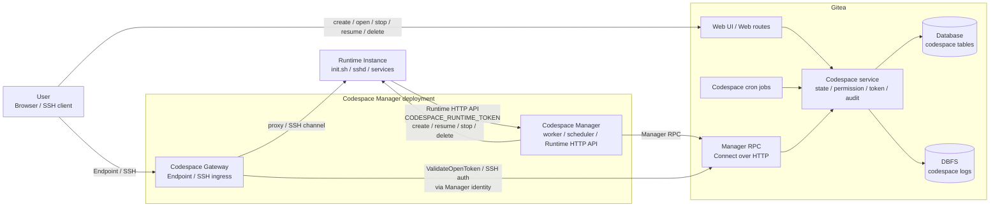
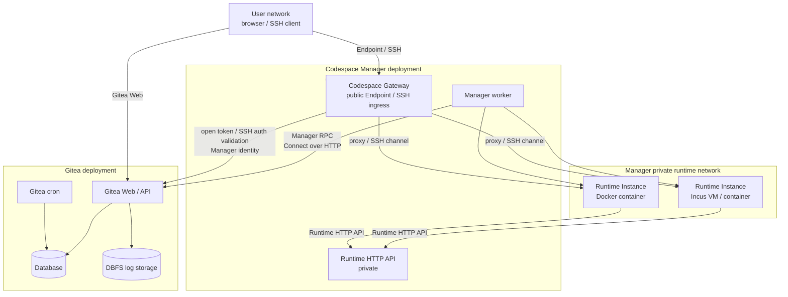
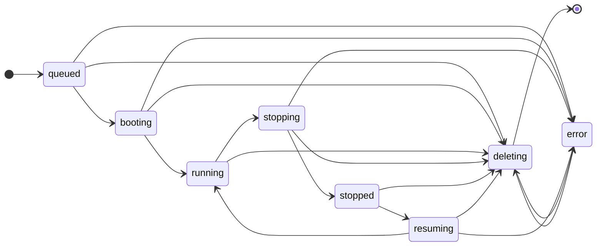
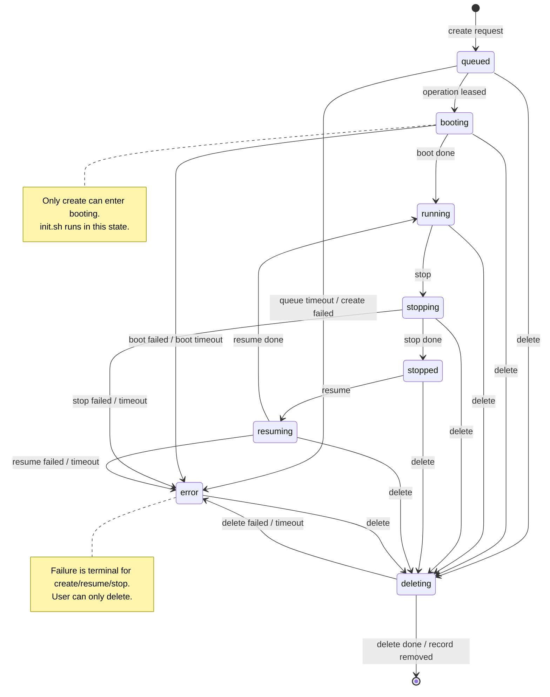

# Gitea Codespace 最终设计

## 目标

[Codespace](#term-codespace) 是 Gitea 内置的远程开发环境入口能力。

Gitea 是以下信息的权威数据源：

- repository / ref 权限
- commit 锁定结果
- 用户身份
- 下发给 Runtime Instance 配置使用的 Gitea token 的签发与吊销
- codespace 生命周期状态
- 审计记录
- 日志归档与展示
- 用户打开 codespace 的入口

[Codespace Manager](#term-codespace-manager) 是以下信息的权威数据源：

- Runtime Instance 类型
- image 和资源规格
- bootstrap / init script
- 工作目录、网络、挂载、端口转发
- Runtime Instance 创建、恢复、停止、删除的执行细节
- Runtime Instance 内访问 Codespace Manager Runtime HTTP API 所需的 Runtime Token
- Runtime Instance 声明的 Endpoint 与内部 SSH 连接信息
- Codespace Gateway 解析 Endpoint 与 SSH upstream 所需的内部状态

[Codespace Gateway](#term-codespace-gateway) 是 Codespace Manager deployment 下的接入组件，不作为独立 Gitea 身份注册。

Codespace Gateway 负责：

- 用户 Endpoint 访问入口
- 用户 SSH 访问入口
- 通过 Codespace Manager 身份或 Manager 内部调用校验 Gateway Open Token
- Gateway 到 Runtime Instance 的 SSH 转发行为

Gitea 不参与运行时选型，不保存运行时专有配置，不直接操作 Incus / Docker，不读取或校验 Runtime Token。

## 架构图



架构约束：

- Gitea 只保存状态、权限、token 绑定、审计、日志元数据和 Runtime Metadata
- Codespace Manager 是运行侧唯一 Gitea 注册身份
- Codespace Gateway 属于 Codespace Manager deployment，不单独注册 Gitea 身份
- Runtime Instance 只通过 Runtime HTTP API 与 Codespace Manager 通信
- 用户 Endpoint / SSH 流量不进入 Gitea

## 部署图



部署约束：

- Gitea 与 Codespace Manager 之间只使用 Manager RPC
- Runtime HTTP API 只在 Manager 私有网络内开放
- Codespace Gateway 对用户暴露 Endpoint 与 SSH 入口
- Incus / Docker 后端只存在于 Codespace Manager 本地部署中

## 核心通信图


通信约束：

- Manager 通过轮询或长轮询领取 Gitea operation
- Runtime Instance 不直接调用 Gitea
- Gateway 用户流量只在需要鉴权时回到 Gitea
- Endpoint upstream 只由 Codespace Gateway 和 Codespace Manager 解析
- Gitea 不保存 Endpoint upstream

## 术语表

本文档使用以下标准术语。后续实现、表结构、RPC、HTTP API、日志、错误码和测试命名应以本表为准。

| 术语 | 定义 |
| --- | --- |
| <a id="term-codespace"></a>Codespace | Gitea 中的远程开发环境记录，包含状态、权限、日志、审计和关联的 Runtime Metadata。 |
| <a id="term-runtime-instance"></a>Runtime Instance | Codespace Manager 在 Incus 或 Docker 后端创建的实际 VM、容器或工作负载。 |
| <a id="term-codespace-manager"></a>Codespace Manager | 负责向 Gitea 领取 Operation、创建和管理 Runtime Instance、上传日志与 Runtime Metadata 的执行组件。 |
| <a id="term-codespace-gateway"></a>Codespace Gateway | Codespace Manager deployment 下的接入组件，负责用户 Endpoint 与 SSH 接入，并通过 Codespace Manager 身份或 Manager 内部调用校验 Gateway Open Token。 |
| <a id="term-manager-rpc"></a>Manager RPC | Codespace Manager 调用 Gitea 的 Connect RPC over HTTP 控制面。 |
| <a id="term-runtime-http-api"></a>Runtime HTTP API | Runtime Instance 内部调用 Codespace Manager 的 HTTP/JSON API，根地址为 `CODESPACE_MANAGER_BASE_URL`。 |
| <a id="term-operation"></a>Operation | 一次异步生命周期操作，类型为 create、resume、stop、delete。 |
| <a id="term-manager-selection"></a>Manager Selection | Gitea 基于 repo、owner、global scope 和 tag 选择 Codespace Manager 的过程。 |
| <a id="term-manager-capacity"></a>Manager Capacity | Codespace Manager 上报的当前可接收 create / resume 工作量快照，参与调度和任务领取。 |
| <a id="term-scope"></a>Scope | Manager 注册和 Codespace 创建时固定的调度作用域，取值为 global、owner、repo。 |
| <a id="term-endpoint"></a>Endpoint | Runtime Instance 声明给 Codespace Manager 的可打开入口，使用 `endpoint_id` 标识；`endpoint_id` 只要求在同一 `codespace_uuid + generation` 内唯一，协议和 upstream 由 Codespace Gateway 与 Codespace Manager 解释。 |
| <a id="term-reserved-endpoint"></a>Reserved Endpoint | 保留的 Endpoint ID；`workspace` 表示默认 Web IDE。 |
| <a id="term-gateway-open-token"></a>Gateway Open Token | Gitea 为打开 Endpoint 签发的一次性 opaque token，使用 Gitea cache 保存并在首次校验后删除。 |
| <a id="term-gitea-token"></a>Gitea Token | Gitea 签发给 Runtime Instance 用于 git clone、fetch、push 的 access token。 |
| <a id="term-runtime-token"></a>Runtime Token | Codespace Manager 签发给 Runtime Instance 访问 Runtime HTTP API 的 token。 |
| <a id="term-manager-token"></a>Manager Token | Codespace Manager 调用 Manager RPC 的长期注册凭据。 |
| <a id="term-interactive-access"></a>Interactive Access | 用户进入 Codespace 的能力，包括打开 Endpoint、SSH、resume。 |
| <a id="term-administrative-permission"></a>Administrative Permission | 管理 Codespace 的能力，包括查看最小信息、查看日志、stop、delete。 |
| <a id="term-runtime-metadata"></a>Runtime Metadata | Codespace Manager 上报并保存在 `codespace.meta_json` 中的动态运行时信息。 |
| <a id="term-action-availability"></a>Action Availability | Gitea 根据用户、repository、Codespace 状态和 Runtime Metadata 判断某个动作是否可执行的规则。 |
| <a id="term-state-finalization"></a>State Finalization | Gitea 根据 operation 结果更新 codespace 主状态的过程。 |
| <a id="term-state-reconciliation"></a>State Reconciliation | Gitea 后台任务处理 operation 超时、Codespace Manager 离线、状态不一致和清理任务的过程。 |
| <a id="term-stale-report"></a>Stale Report | Codespace Manager 上报的 `operation_uuid` 或 `generation` 已不匹配当前 codespace 状态的过期上报。 |
| <a id="term-state-divergence"></a>State Divergence | Gitea 记录状态与 Codespace Manager 上报的 Runtime Instance 实际状态不一致。 |
| <a id="term-manager-instruction"></a>Manager Instruction | Gitea 返回给 Codespace Manager 的调和指令，例如 `cleanup_local_runtime`。 |

术语使用规则：

- Codespace Manager 表示运行侧唯一 Gitea 注册身份
- Endpoint ID 字段统一命名为 `endpoint_id`
- Endpoint ID 唯一性范围是单个 codespace 当前 generation，不是全局唯一
- Endpoint 不是端口模型；真实端口只属于 Runtime Instance 内部实现
- 动态运行时数据统一命名为 Runtime Metadata
- codespace 创建者字段统一命名为 `user_id`

字段命名原则：

- 字段名只表达 Gitea 需要持久化或校验的最小业务语义
- 不把协议类型、UI 产品类型、后端类型、镜像类型编码进 Gitea 字段
- Endpoint 只在 Gitea 侧使用 `endpoint_id`、`label` 这类最小展示和鉴权字段
- Endpoint 的真实协议、upstream、端口、进程和启动方式由 Codespace Gateway 与 Codespace Manager 内部解释

## 核心原则

- Gitea 只负责授权、审计、状态、日志和跳转入口
- codespace 在 Gitea 内的实现必须完全遵循 Gitea 现有用户、组织、仓库、权限、token、SSH key、TOTP 与登录限制模型
- `owner` 直接复用 Gitea 现有 `user` 模型；organization 也是 `user` 的一种类型，不再为 codespace 额外抽象新的 owner 概念
- 用户只要拥有 repository 代码读权限，就可以创建 codespace
- 下发给 Runtime Instance 配置使用的 Gitea token 必须基于创建用户的真实权限签发
- Codespace Manager 不得以自己的身份访问 repository
- create / resume / stop / delete 必须幂等
- 同一个 codespace 任一时刻只允许一个 active operation
- Incus / Docker 后端、镜像、规格、网络、挂载、DinD 等能力全部属于 Codespace Manager 本地实现细节
- Gitea 与 Codespace Manager 的契约应尽量最小
- operation 超时、失败和 Manager 崩溃后的状态最终化必须由 Gitea 后台任务独立推进
- [Runtime Metadata](#term-runtime-metadata) 优先进入 `meta_json`，不扩散为独立表
- codespace 只组合 Gitea 已有用户、组织、仓库、权限、token、SSH key、TOTP、Pull Request、git 与 Actions task claim 能力
- 不为 codespace 新增 Gitea 缺失的通用平台能力
- 若某项能力需要新增通用 notifier、通用 rate limiter、通用 repo-scoped token 或通用审计子系统，则不在 codespace 首期实现
- 不提供统一 `retry`
- 不支持在原 codespace 对象上重建 create
- 失败即失败，Gitea 不负责修复性重试
- 删除完成后直接移除数据，不做 soft delete

## Gitea 约束对齐

codespace 相关实现必须复用 Gitea 现有通用能力，不重写第二套语义。

明确约束：

- repository 可见性与权限判断统一复用 Gitea 现有 repo permission 逻辑
- create / open / stop / resume / delete 的前置鉴权统一复用 Gitea 当前请求上下文，但不把所有动作绑定到同一组 repo permission check
- codespace 是创建用户私有对象，不是 repository 共享对象
- codespace 的“交互访问权限”和“管理权限”必须分离
- 默认对象级交互访问权限仍属于创建用户本人
- 组织仓库下，组织管理员额外获得最小管理权限，但不获得交互访问权限
- 组织管理员统一指 Gitea `IsOrganizationAdmin(ctx, orgID, userID)` 判定通过的用户，覆盖 Owners 团队和具备 admin 权限的团队成员
- repo code-read 权限只作为 create 与 Interactive Access 的 precondition，不作为 Administrative Permission 的统一前置条件
- repository 权限与状态检查是对象访问的附加 precondition；除组织仓库管理场景外，不授予其他用户进入他人 codespace 的能力
- repository code unit 不可读时，不允许创建或打开 codespace
- `owner` 的含义始终是 `repository.owner_id -> user.id`
- codespace 对象中记录“谁创建了这个 codespace”的字段不再命名为 `owner_id`，避免与 repository owner 语义冲突
- SSH 密码认证统一复用 Gitea 本地用户密码校验与 TOTP 校验逻辑
- SSH 公钥认证统一复用 Gitea 现有用户 SSH key 数据
- 用于 Runtime Instance git 访问的 token 统一复用 Gitea 现有 access token 体系，不单独定义第二套 git token 模型
- codespace token 的 repository binding 是 codespace token 的附加校验，不实现 Gitea 通用 repo-scoped token 系统
- Gitea 侧关于 `is_active`、`prohibit_login`、`must_change_password`、全站强制 2FA 等限制，对 create / open / stop / resume / delete / SSH 同样生效
- user blocking、restricted user、owner visibility、internal/private repository 等边界也必须直接复用 Gitea 现有结果
- repository 的 `archived`、`mirror`、`empty`、`being migrated`、`pending transfer`、`broken` 等状态也必须纳入 codespace 创建与恢复的 precondition

## 生命周期状态

用户可见状态与存储状态统一使用单轴状态图：



说明：

- `queued` 表示请求已创建，但尚未被 Codespace Manager 领取 operation；create / resume 可因 [Manager Capacity](#term-manager-capacity) 不足停留在该状态
- `booting` 只用于首次创建时构建环境、执行 init 脚本
- `running` 只表示 Runtime Instance 当前处于运行态
- `stopping` 表示正在停止已正常运行的 Runtime Instance
- `stopped` 表示 Runtime Instance 已停止但可恢复
- `resuming` 表示正在恢复已停止 Runtime Instance
- `deleting` 表示正在删除
- `error` 表示当前生命周期失败，等待用户查看或删除

约束：

- `booting` 只能由 create 流程进入
- `resume` 不允许进入 `booting`
- `create` 失败后不能在原对象上重新 create
- `error` 不允许恢复为正常状态
- 删除完成后对象直接删除，不保留墓碑记录

补充原则：

- 主状态只描述生命周期阶段
- `open / SSH / resume / stop / delete / logs` 是否可用，由主状态、repo 状态、用户状态、[Codespace Manager](#term-codespace-manager) 在线状态与 [Runtime Metadata](#term-runtime-metadata) 共同决定
- 不为 [Interactive Access](#term-interactive-access) 或 [Administrative Permission](#term-administrative-permission) 扩展第二套主状态

## 完整状态图



等价理解：

- create [Operation](#term-operation): `queued -> booting -> running`
- stop [Operation](#term-operation): `running -> stopping -> stopped`
- resume [Operation](#term-operation): `stopped -> resuming -> running`
- delete [Operation](#term-operation): `queued|booting|running|stopping|stopped|resuming|error -> deleting -> removed`
- 中间状态超时、失败或 [Codespace Manager](#term-codespace-manager) 崩溃: `-> error`

## 页面模型

Web 页面只保留 3 类。

### Repository Codespace 入口页

```text
GET  /{owner}/{repo}/codespace
POST /{owner}/{repo}/codespace
```

作用：

- 基于当前 repository / ref 创建 codespace
- 展示当前用户在该 repository 下已有的 codespace
- 组织仓库下，若当前用户是组织管理员，还展示该 repository 下其他成员 codespace 的管理入口
- 提供进入用户 codespace 管理页的入口

Repository 相关页面都应提供静态 `Open in Codespace` 入口或按钮。

建议挂载位置：

- repository 主页
- branch / tag 下拉菜单
- pull request 页面
- commit 页面

首期入口优先集中在这些主路径，不在过多零散页面重复挂载，避免控制面分散。

这些入口只负责把当前上下文转换为 codespace 创建参数，不承载运行时参数。

显示入口前提：

- 当前用户对 repository 的 code unit 具备读权限
- repository 不处于 Gitea 明确禁止创建开发环境的状态
- pull request 页面入口仅在当前用户可访问对应 PR 与代码上下文时显示

如果当前用户已经创建过该 repository 的 codespace，则在创建入口下方列出现有 codespace：

- ref
- status
- last active
- open / 查看详情

组织仓库下，若当前用户是组织管理员，还额外展示管理列表：

- creator
- ref
- status
- last active
- 查看管理视图 / stop / delete

### 用户 codespace 列表页

```text
GET /codespace
```

这是用户的主控制台。

该页面只展示“我创建的 codespace”，不承担组织管理列表功能。

展示：

- repo
- ref
- status
- last active
- 状态摘要
- open / stop / resume / delete 操作

列表页不读取日志文件，只依赖结构化字段和日志元数据。

### 单个 codespace 单页面

```text
GET    /codespace/{uuid}
GET    /codespace/{uuid}/logs
POST   /codespace/{uuid}/open
POST   /codespace/{uuid}/resume
POST   /codespace/{uuid}/stop
DELETE /codespace/{uuid}
```

`GET /codespace/{uuid}` 是唯一对象页面。

`GET /codespace/{uuid}/logs` 只作为日志读取接口存在，不再定义为独立页面。

对象页面根据状态只切换布局，不切换页面路径。

对象页面访问规则：

- 个人仓库下，只有 codespace 创建用户本人可以访问该对象页面
- 组织仓库下：
  - 创建用户本人可进入完整对象页
  - 组织管理员可进入管理视图
  - repository 协作者与普通 repo 管理员不因为 repo 权限自动获得他人 codespace 访问权
- 若创建用户后续失去 repository code read 权限，对象页降级为只读清理页：
  - 允许查看最小对象信息
  - 允许查看日志
  - 允许 delete
  - 不允许 open / SSH / resume / stop
- 若创建用户被禁用登录、未激活、被要求改密或不再满足站点安全约束：
  - 创建用户失去交互能力
  - 组织仓库下的组织管理员仍可进入管理视图并执行 stop / delete
- 若创建用户已被物理删除：
  - 组织仓库下：
    - 不重分配该 codespace
    - `codespace.user_id` 保留原值
    - UI 显示 creator unavailable / deleted
    - 对象页只保留日志、最小信息与管理 stop / delete 能力
  - 个人仓库下：
    - 不重分配该 codespace
    - `codespace.user_id` 保留原值
    - 不提供新的 Endpoint 或 SSH 管理入口
    - 只保留后台清理与审计保留

统一展示基础信息：

- repo / ref / commit
- 当前状态
- 当前 operation
- 最近一次 booting 进度或准备信息
- 最近错误

### `queued|booting|error|首次创建链路中的 deleting` 布局

- 日志区域居中展示
- 按钮区域固定在右上角
- 页面主体只展示：
  - repo / ref / commit
  - 当前状态
  - 当前 boot stage
  - 当前 operation
  - 最新日志
  - 最近错误
- 不展示 Endpoint 列表
- 不展示 SSH 信息
- 不展示资源占用区
- 不展示正常控制面

按钮规则：

- `queued` / `booting`：只允许 `delete`
- `error`：只允许 `delete`
- `deleting`：不允许新的用户动作

### `running|stopping|stopped|resuming|非首次创建链路中的 deleting` 布局

- 左侧固定为日志区
- 右侧固定为控制与信息区

左侧日志区：

- 最新日志流
- 当前 operation 日志
- 最近一次 operation 日志

日志默认选择规则：

- `queued|booting|stopping|resuming|deleting` 默认显示当前 active operation 日志
- `running|stopped|error` 默认显示最近一次已完成或失败的 operation 日志

右侧控制与信息区：

- repo / ref / commit
- 当前状态
- 当前 operation
- Endpoint 打开区
- SSH 信息区
- 资源占用区
- 最近错误
- open / stop / resume / delete 操作

资源占用信息属于 Runtime Metadata，来自 `meta_json`，不单独建表。

资源占用规则：

- CPU / 内存 / 磁盘 / 网络等占用信息都是可选 Runtime Metadata 字段
- Codespace Manager 未上报时页面显示 `unavailable`
- 资源占用缺失不影响 codespace 主状态

### 状态对应的页面行为

- `queued`
  - 使用中心日志布局
  - 只允许 delete
- `booting`
  - 使用中心日志布局
  - 只允许 delete
- `running`
  - 使用左右分栏布局
  - 允许展示 Endpoint 与 SSH 区域
  - 是否允许 open / SSH 由实时 precondition 检查决定
  - 允许 stop / delete
- `stopping`
  - 使用左右分栏布局
  - 不允许新的打开动作
- `stopped`
  - 使用左右分栏布局
  - 允许 resume / delete
- `resuming`
  - 使用左右分栏布局
  - 不允许新的打开动作
- `deleting`
  - 若仍处于首次 create 生命周期，则使用中心日志布局
  - 否则使用左右分栏布局
  - 不允许新的打开动作
- `error`
  - 使用中心日志布局
  - 不允许 open
  - 不允许 SSH 连接
  - 只允许 delete

### repository 外部状态变化对页面和动作的影响

- repository 被 archive 后：
  - 不允许 create
  - 不允许 resume
  - 已存在且 `running` 的 codespace 不再允许新的 open / SSH 接入
  - 仍允许查看、stop、delete、查看日志
- repository 进入 `pending transfer`、`being migrated`、`broken`：
  - 不允许 create
  - 不允许 resume
  - 已存在 codespace 不允许新的 open / SSH 接入
  - 仍允许查看、stop、delete、查看日志
- repository 被强制删除、git 数据不可读或 ref 已不可解析：
  - 不允许 create
  - 不允许 resume
  - 已存在 codespace 不允许新的 open / SSH 接入
  - 若 Codespace Manager 仍在线且 Runtime Instance 仍可能存在，仍允许 stop
  - 仍允许查看日志与 delete

正常 repository 删除规则：

- 普通 repository 删除前只检查作用域在该 repository 下的 codespace
- 检查条件固定为 `codespace.scope_type=repo AND codespace.scope_id=repository.id`
- 只要该 scope 下存在 `queued|booting|running|stopping|stopped|resuming|deleting|error` codespace，就阻止普通 repository 删除
- UI 必须提示先删除该 repo scope 下的 codespace，再删除 repository
- 不检查 global scope 或 owner scope 下引用该 `repo_id` 的 codespace
- `codespace.repo_id` 只表示代码来源 repository，不表示删除检查归属
- 不设计“repository 已删除但 codespace Web UI 继续完整可用”的常规路径
- repository 删除流程必须在删除事务中查询 `scope_type!=repo AND repo_id=repository.id` 的 codespace
- `scope_type!=repo AND repo_id=repository.id` 的 codespace 不阻塞 repository 删除
- 对这些 codespace，repository 删除流程必须同步吊销 Gitea token
- 对这些 codespace，repository 删除流程必须同步禁止 open / SSH / resume
- 若 Codespace Manager 在线且 codespace 可能存在 Runtime Instance，删除流程应创建 delete operation 并进入 `deleting`
- 若 Codespace Manager 离线、codespace 尚未绑定 manager、或无法确认 Runtime Instance，删除流程将 codespace 置为 `error`
- `status_message` 必须写入明确原因，例如 `source repository deleted; cleanup required`
- State Reconciliation 只负责后续兜底调和，不能作为 repository 删除后的唯一失效机制
- repository 删除成功后，创建者的 codespace 列表、组织管理列表和全局列表必须展示 `source repository deleted`
- repository 删除成功页或确认页必须提示受影响的 owner / global scope codespace 数量
- 不发送站内通知；repository 删除后的状态、列表提示、详情页日志、`status_message` 和 delete 控制已经形成闭环
- 若因管理员强制清理、历史不一致数据或外部故障产生 orphaned codespace，只允许进入最小清理语义：
  - 不允许 open / SSH / resume
  - 允许有管理权限的用户或后台任务查看日志、stop、delete

owner / user / organization 删除规则：

- 删除 user / organization 前只检查作用域在该 owner 下的 codespace
- 检查条件固定为 `codespace.scope_type=owner AND codespace.scope_id=user.id`
- 只要该 scope 下存在未删除 codespace，就阻止普通 owner 删除
- 删除 user / organization 名下 repository 时，repository 删除流程只检查各自 repo scope 下的 codespace
- 不因为 global scope 或 repo scope 下存在引用该 owner 名下 repository 的 codespace，就阻止 owner 删除
- 删除 user / organization 名下注册的 owner-scope Codespace Manager 时，若该 Codespace Manager 仍有关联未删除 codespace，也必须先阻止删除
- 若某个用户只是其他组织仓库 codespace 的创建者，删除该用户不阻止组织仓库存在
- 创建用户被删除后，相关 Gitea token 必须吊销，codespace 不允许 open / SSH / resume
- 组织仓库下由组织管理员继续承担 stop / delete 管理清理

重命名规则：

- user / organization 重命名不改变 `user.id`
- repository 重命名不改变 `repository.id`
- codespace 权威关联只使用 `user_id`、`repo_id`、`scope_type`、`scope_id`、`manager_id`
- UI 展示名称每次按 ID 解析当前名称
- 解析失败时显示 `deleted` / `unavailable`
- `ssh_user` 创建后不随 user / organization 重命名改变
- 新建 codespace 使用重命名后的用户名生成新的 `ssh_user`
- `repo_full_name`、`owner_name`、`repo_name` 可以作为显示缓存字段放入 `meta_json`
- 显示缓存字段不能参与权限判断、路由判断、删除检查或 Manager Selection
- 已存在 Runtime Instance 不因 user / organization / repository 重命名自动改写 Runtime Instance 内 git remote
- create / resume 时重新生成任务载荷中的 clone URL 与 web URL，使用当时的当前名称

### 用户状态与对象访问限制

- 创建用户被 `prohibit_login`、未激活、被要求修改密码或不满足站点强制 2FA 约束时：
  - 不允许 create
  - 不允许 open
  - 不允许 resume
  - 不允许 SSH
  - stop / delete 只保留最小必要能力
- 创建用户与 repository owner / 相关对象之间若命中 Gitea 现有 user blocking 规则，则 create 失败
- repository / owner 可见性变化导致创建用户已不再具备 repository code read 权限时，对象页降级为只读清理页
- 组织仓库下，若创建用户失去 repo 访问、被禁用登录或被删除，组织管理员仍可 stop / delete
- 个人仓库下不存在“owner 代理管理他人 codespace”语义
- restricted user、owner visibility、internal/private repository 等边界不单独发明第二套规则，统一直接复用 Gitea 现有最终可见性与权限判定结果

[Action Availability](#term-action-availability) 统一规则：

- create 需要当前用户对 repository 具备 code-read 权限
- open / SSH / resume 属于 [Interactive Access](#term-interactive-access)：
  - 仅创建用户本人可用
  - 还必须通过 repo 当前状态、登录限制、Codespace Manager 在线和 Endpoint metadata 等实时 precondition
- view minimal info / logs / stop / delete 属于 [Administrative Permission](#term-administrative-permission)：
  - 创建用户本人始终保留
  - 组织仓库下组织管理员额外保留
  - Administrative Permission 不要求创建用户本人当前仍具备 repo code-read
  - Administrative Permission 不要求组织管理员具备 repo code-read

Minimal info 字段白名单：

- `uuid`
- `status`
- `status_message`
- `created_unix`
- `updated_unix`
- `stopped_unix`
- `creator_id`
- `creator_display_name`
- `creator_deleted`
- `repo_id`
- `repo_display_name`
- `repo_deleted`
- `ref_type`
- `ref_name`
- `commit_sha`
- `pull_id`
- `scope_type`
- `scope_id`
- `manager_id`
- `manager_display_name`
- `manager_online`
- `log_line_count`
- `log_size`
- `last_log_unix`
- `log_expired`
- `allowed_actions`

Minimal info 禁止返回：

- `gitea_token_id`
- Manager Token、Runtime Token、Gateway Open Token 或任何 token 明文
- token hash / salt
- `internal_ssh`
- Endpoint upstream
- 完整 `meta_json`
- 日志正文
- Runtime Instance 内部 host / port / user

页面路由规则：

- `POST /{owner}/{repo}/codespace` 成功后统一重定向到 `GET /codespace/{uuid}`
- 对象页面不存在 `/boot` 子页面
- 首次 create 完成前，不发生对象级页面跳转，只在同一路径内切换布局
- 状态进入 `running` 后，同一路径内从中心日志布局切换到左右分栏布局
- `stop` 成功后停留在 `GET /codespace/{uuid}`
- `resume` 成功后停留在 `GET /codespace/{uuid}`
- `delete` 成功后按显式 `return_to` 返回；若未提供 `return_to`：
  - repository 仍可见时回到 `GET /{owner}/{repo}/codespace`
  - 否则回到 `GET /codespace`
- `error` 不细分子状态，失败即失败；页面只展示日志和 delete

## Endpoint 打开入口

`POST /codespace/{uuid}/open` 是打开动作入口。

请求参数：

```text
endpoint_id=<endpoint_id>
```

语义：

- `endpoint_id` 表示一个已上报的 [Endpoint](#term-endpoint) ID
- `workspace` 是唯一保留的 [Endpoint](#term-endpoint) ID，表示默认 Web IDE 入口
- 预览端口、服务入口和 IDE 入口都通过 Endpoint 打开
- 除 `workspace` 外，Gitea 不为其他 Endpoint 定义产品类型或协议类型

约束：

- 不接受 `path`
- 不接受任意 redirect 参数
- `endpoint_id` 必须命中当前 [Runtime Metadata](#term-runtime-metadata) 中已声明的 Endpoint
- `endpoint_id` 只能包含大小写字母、数字、中划线、下划线
- `endpoint_id` 不允许包含空格、点、斜杠、冒号和其他特殊字符
- Gitea 不读取 Endpoint 的真实协议、端口或 upstream

展示与默认行为：

- 若 [Codespace Manager](#term-codespace-manager) 上报了 `endpoint_id=workspace`，Gitea UI 将其视为默认 Web IDE 入口
- 其他 Endpoint 只展示 label 并提供打开动作，不内建额外产品语义
- 常见 Endpoint ID 如 `jetbrains`、`code-server`、`jupyter`、`app-3000` 可以作为约定使用，但不是 Gitea 强制类型语义
- 是否返回浏览器页面、协议提示、连接信息或其他 Gateway 页面，由 Codespace Gateway 决定
- repo 页和列表页上的默认 `Open` 动作：
  - 若当前 Runtime Metadata 存在 `workspace`，则打开 `workspace`
  - 若不存在 `workspace`，则进入 `GET /codespace/{uuid}`，由用户手动选择 Endpoint

Gitea 处理流程：

1. 校验用户是否有权访问该 codespace
2. 校验 codespace 当前状态是否允许打开
3. 校验该 `endpoint_id` 是否已在当前 Runtime Metadata 中声明
4. 校验当前用户是否具备 Interactive Access
5. 校验所属 [Codespace Manager](#term-codespace-manager) 当前在线
6. 生成短期一次性 Gateway Open Token
7. 将 token hash 与 user / codespace / generation / endpoint / manager 路由校验字段写入 Gitea cache
8. 重定向到 [Codespace Gateway](#term-codespace-gateway)
9. Codespace Gateway 通过 Codespace Manager 身份或 Manager 内部调用 `ValidateOpenToken`
10. 认证通过后按 `manager_uuid + codespace_uuid + generation + endpoint_id` 跳转到对应 Endpoint

如果 Codespace Manager 离线，或 Endpoint 没有在当前 Runtime Metadata 中声明，Gitea 不允许打开。

## SSH 访问设计

SSH 不是 `open` 的一种 Endpoint。

SSH 是 codespace 自身的稳定接入面，由 Gitea 生成唯一 SSH 用户名，由 Codespace Gateway 提供 SSH 入口。

因为产品要求完整 SSH 能力，Codespace Manager 创建出的运行环境必须强制具备可用 OpenSSH 契约。

展示形式例如：

```text
dragon+12141qwdada@1.2.3.4
```

其中：

- `dragon` 是 Gitea 用户名
- `12141qwdada` 是随机短后缀
- `1.2.3.4` 是 Codespace Manager 注册的 `gateway_ssh_addr` 中的 SSH 地址

规则：

- `ssh_user` 在创建 codespace 时生成
- `ssh_user` 在该 codespace 生命周期内保持不变
- stop / resume 不改变 `ssh_user`
- 删除后该 SSH 用户名失效，不复用
- 只有 `running` 状态允许 SSH 接入
- `queued|booting|stopping|stopped|resuming|deleting|error` 一律拒绝 SSH 接入
- SSH 不负责自动唤醒 stopped codespace
- `ssh_password_auth_allowed` 是创建时由 Gitea 内部策略写入的布尔字段，不由前端提交
- `ssh_password_auth_allowed=false` 时，`VerifySSHPassword` 必须拒绝，Gateway 必须拒绝该 SSH 密码认证连接，只允许 SSH 公钥认证

### SSH 密码认证

SSH 密码登录只支持 Gitea 本地用户。

没有本地密码的用户不允许通过 SSH 密码登录。

如果用户启用了 TOTP，则 SSH 密码输入格式固定为：

```text
password|totp_code
```

例如：

```text
my-password|123456
```

如果用户未启用 TOTP，则输入纯密码即可。

Gateway 收到 SSH 密码后，不本地校验，不使用认证缓存，不签发预认证令牌，必须直接委托 Gitea 实时认证。

Gitea 认证时必须校验：

- `ssh_user` 是否映射到一个有效 codespace
- 该 codespace 当前是否为 `running`
- 该 codespace 是否属于对应创建用户
- 该 codespace 是否允许 SSH 密码认证
- 该 user 是否为 Gitea 本地用户
- 该 user 是否设置了本地密码
- 该 user 是否处于允许登录状态
- 若站点启用了强制 2FA，该 user 是否满足 Gitea 的 2FA 约束
- 若启用了 TOTP，输入内容是否符合 `password|totp_code` 结构
- 本地密码是否通过 Gitea 现有密码校验逻辑
- 若启用了 TOTP，TOTP 验证码是否通过 Gitea 现有消费式校验逻辑
- 当前 SSH 请求者是否就是该 codespace 创建用户本人

说明：

- “本地用户”含义直接复用 Gitea `IsLocal()` 语义
- “已设置密码”含义直接复用 Gitea `IsPasswordSet()` 语义
- 密码校验直接复用 Gitea `ValidatePassword()` 语义
- SSH RPC 没有 Web session，不能复用依赖 session 的 `DoerNeedTwoFactorAuth()`
- 全站强制 2FA 判断必须复用 Gitea 无 session 的 2FA enrollment 查询能力
- TOTP 校验必须复用 Gitea 现有 `ValidateAndConsumeTOTP()` 语义，不允许自行仅做纯校验而不消费
- 若用户处于 `must_change_password`、`prohibit_login`、未激活或其他 Gitea 禁止登录状态，则 SSH 密码认证必须失败
- 每次 SSH 密码认证请求都以上游 Gitea 当前用户、密码、TOTP、登录限制和 codespace 状态为准
- Gateway 不得跨连接缓存密码认证成功结果
- 不设计 SSH password pre-auth token

### SSH 公钥认证

SSH 公钥机制保持不变，但校验权威仍在 Gitea。

Gateway 收到公钥后，在线向 Gitea 校验，不使用跨连接认证缓存：

- `ssh_user` 是否映射到一个有效 codespace
- 该 codespace 当前是否为 `running`
- 当前公钥 fingerprint 是否属于该 codespace 创建用户
- 当前用户是否仍处于 Gitea 允许登录状态
- 当前 SSH 请求者是否就是该 codespace 创建用户本人

说明：

- 公钥到用户的绑定直接复用 Gitea 现有 `public_key.owner_id -> user.id`
- 外部来源同步到 Gitea 的 SSH key 仍按 Gitea 现有 externally-managed / source 管理模型处理
- codespace 不单独维护一份用户 SSH 公钥关系
- 每次 SSH 公钥认证请求都以上游 Gitea 当前 SSH key、用户状态和 codespace 状态为准

### SSH 认证入口保护

SSH 认证入口保护由 Codespace Gateway 承担，Gitea 不为 codespace 新增通用 rate limiter。

规则：

- Gateway 限流维度至少包含 source IP、`ssh_user`、`codespace_uuid`
- 密码认证失败必须在 Gateway 侧触发退避
- 公钥认证失败必须在 Gateway 侧触发退避
- TOTP 格式错误或消费失败按密码认证失败处理
- 同一连接内连续失败达到阈值后，Gateway 必须断开连接
- 同一 source IP 或同一 `ssh_user` 在窗口期内失败过多时，Gateway 必须延迟响应或临时拒绝
- Gitea 的 `VerifySSHPassword` 与 `VerifySSHPublicKey` 不实现通用服务端限流
- Gitea RPC 侧必须使用统一失败响应，不暴露用户、codespace 或 SSH key 是否存在
- Gitea RPC 侧必须实时校验用户、codespace、repository、TOTP 与 SSH key 当前状态
- 失败审计只记录 user、codespace、source IP、认证方式、失败原因类别和时间，不记录密码、TOTP 或公钥原文
- Gateway 限流与退避不改变 Gitea 作为认证权威的事实，不能用缓存绕过上游实时校验

不实现原因：

- Gitea 当前没有可直接复用的通用 rate limiter 基础设施
- codespace 不新增通用限流平台能力

### SSH 路由与认证职责

- SSH 用户名负责将连接路由到对应 codespace
- Gitea 负责认证当前连接者是否就是该 codespace 创建用户
- Codespace Gateway 负责 SSH 协议接入、内部 SSH 建链和最终 channel 转发
- Codespace Manager 负责提供 Runtime Instance 内部 SSH 连接元数据

长期 SSH 授权状态不作为 Runtime Instance 内长期静态配置的唯一来源。

### SSH 会话转发模型

SSH 连接始终先到 Codespace Gateway，不直接进入 codespace。

流程：

1. 用户通过 `ssh_user@gateway_host` 连接 Gateway SSH 入口
2. Gateway 解析 `ssh_user`，定位到对应 codespace
3. Gateway 在线向 Gitea 完成密码 / TOTP 或公钥认证
4. Gateway 确认 codespace 状态为 `running`
5. Gateway 作为 SSH client，再连接该 codespace 内部 SSH server
6. Gateway 将外部 SSH 会话的 channel 转发到内部 SSH 会话

约束：

- Gateway 终止外部 SSH 连接
- Gateway 重建到内部 codespace 的 SSH 连接
- 不采用纯 TCP forwarding 模式
- 不由 Gateway 自行实现 shell / sftp / pty 语义
- tty / exec / sftp / forwarding / X11 / agent forwarding 等能力依赖内部 codespace SSH server 提供

### codespace 内部 SSH server

codespace 内必须存在稳定的 SSH server，供 Gateway 连接。

规则：

- 该 SSH server 必须满足 OpenSSH 兼容能力要求
- 内部 SSH server 不直接暴露公网
- 内部 SSH server 只接受 Codespace Gateway 的内部接入凭据
- 用户密码、公钥、TOTP 不在 Runtime Instance 内部进行认证
- 用户认证只发生在 Gateway -> Gitea 这一侧

强制要求：

- Codespace Manager 必须确保最终环境中存在可用的 OpenSSH server
- 不允许使用能力裁剪版、协议不完整或私有兼容实现替代这一契约
- Gitea 不负责配置 sshd；镜像准备、boot 过程与最终能力保证由 Codespace Manager 负责

### Gateway 到 codespace 的内部接入

Gateway 对用户认证成功后，再使用内部凭据连接 codespace 内部 SSH server。

统一模型：

- Codespace Manager 必须持有一对固定的内部 Gateway SSH key
- Codespace Manager 注册时声明自己的 `gateway_internal_ssh_public_key`
- create / resume 时，Codespace Manager 在 boot 过程中把该固定公钥写入 codespace 内部工作用户的 `authorized_keys`
- Gateway 后续始终使用对应 private key 连接 codespace 内部 sshd
- 内部 SSH 端口、host、user 不是固定常量，必须在 boot 完成前由运行时上报
- stop / delete / error 时，该内部连接能力失效
- 该内部凭据只用于 Gateway 到当前 codespace 的私网连接

不建议：

- 复用用户自己的 SSH 公钥进入 codespace
- 让 codespace 内部直接校验用户密码 / TOTP
- 让 codespace 自己暴露公网 SSH 入口

安全边界：

- 内部 Gateway SSH key 不得作为用户外部登录凭据暴露
- 不允许多个 Codespace Manager 共享同一把内部 Gateway SSH key
- internal SSH 连接信息不作为公开 UI 字段直接展示给终端用户

### SSH 能力支持范围

必须完整支持：

- shell
- exec
- subsystem `sftp`
- `pty-req`
- `window-change`
- `signal`
- `env`
- `exit-status`
- `exit-signal`
- `auth-agent-req`
- `x11-req`
- `direct-tcpip`
- `tcpip-forward`
- `cancel-tcpip-forward`

说明：

- tty 必须完整支持
- sftp 必须完整支持
- scp 依赖内部 SSH server 的 `exec` / `sftp` 能力自然支持
- agent forwarding 必须支持
- X11 forwarding 必须支持
- local / remote / dynamic port forwarding 必须支持

转发语义：

- SSH port forwarding 属于用户进入 codespace 后的 SSH 能力
- 允许用户使用 local / remote / dynamic port forwarding
- Gateway 不做目的地址白名单或网段限制
- SSH forwarding 造成的网络可达性与数据泄漏风险视为用户在 codespace 内主动操作的一部分
- Endpoint access 与 SSH forwarding 是两套独立能力
- Gitea 不读取或校验 SSH forwarding 动态打开了哪些端口
- SSH forwarding 不回写到 `meta_json.endpoints`

### SSH 审计与执行身份

外部认证身份与 codespace 内部执行身份分离。

规则：

- Gitea / Gateway 审计记录真实 Gitea user
- codespace 内可统一映射到固定工作用户，例如 `coder`
- 如需将真实用户信息提供给 Runtime Instance，可由 Gateway 在建立内部会话后注入环境变量
- 不为每个 Gitea user 动态创建 Linux 系统用户

## 创建入口

创建入口支持细粒度 ref，但不暴露运行时选型。

创建参数：

- repository ID
- ref type: `branch`, `tag`, `commit`, `pull`
- ref name
- commit SHA
- pull request ID

静态入口指向约定：

- repository 默认入口指向当前默认分支的 codespace 创建
- branch / tag 入口指向该 ref 的 codespace 创建
- commit 入口指向该 commit 的 codespace 创建
- pull request 入口指向该 pull request 的 codespace 创建

创建按钮提交参数：

- `repo_id`
- `ref_type`
- `ref_name`
- `commit_sha`
- `pull_id`

规则：

- 前端只提交当前 git 上下文
- 不提交 runtime 参数
- 不提交 image / vm / lxc 参数
- 不提交 Endpoint / SSH 参数

Gitea 内部创建参数：

- `ssh_password_auth_allowed`

规则：

- `ssh_password_auth_allowed` 由 Gitea 创建服务层根据站点策略、用户类型和目标 repository 策略写入
- `ssh_password_auth_allowed` 不由前端提交，不来自 `.gitea/codespace.yaml`
- `ssh_password_auth_allowed` 不下发给 `init.sh`
- `ssh_password_auth_allowed=false` 时，SSH 密码认证必须失败，但 SSH 公钥认证不受该字段影响

## Boot 与 init 契约

`booting` 是首次创建的唯一环境初始化阶段。

统一原则：

- Runtime Instance 启动后，Codespace Manager 必须以 `init.sh` 作为唯一初始化入口
- git clone / fetch / checkout、workspace 目录准备、OpenSSH 准备、IDE 启动、Endpoint 声明前置准备，都由 `init.sh` 完成
- Gitea 不解析 `init.sh` 内容，只感知日志、boot 阶段进度、Runtime Metadata 与最终结果

### `init.sh` 输入变量

Codespace Manager 在执行 `init.sh` 前，至少注入以下变量：

Git 相关：

- `GITEA_REPO_CLONE_URL`
- `GITEA_REPO_WEB_URL`
- `GITEA_BASE_REPO_CLONE_URL`
- `GITEA_BASE_REPO_WEB_URL`
- `GITEA_HEAD_REPO_CLONE_URL`
- `GITEA_HEAD_REPO_WEB_URL`
- `GITEA_REF_TYPE`
- `GITEA_REF_NAME`
- `GITEA_COMMIT_SHA`
- `GITEA_PULL_ID`
- `GITEA_TOKEN`

Codespace 相关：

- `CODESPACE_UUID`
- `CODESPACE_NAME`
- `CODESPACE_OWNER_NAME`
- `CODESPACE_REPO_NAME`
- `CODESPACE_WORKSPACE_DIR`
- `CODESPACE_SSH_USER`

控制面相关：

- `CODESPACE_MANAGER_BASE_URL`
- `CODESPACE_RUNTIME_TOKEN`
- `CODESPACE_GATEWAY_INTERNAL_SSH_PUBLIC_KEY`

可选调试相关：

- `CODESPACE_BOOT_LOG_PATH`

变量语义：

- `GITEA_REPO_CLONE_URL` 是 init 首选 clone URL，必须能获取锁定的 `GITEA_COMMIT_SHA`
- `GITEA_BASE_REPO_CLONE_URL` / `GITEA_BASE_REPO_WEB_URL` 始终表示页面所在 base repository
- `GITEA_HEAD_REPO_CLONE_URL` / `GITEA_HEAD_REPO_WEB_URL` 仅在 pull request fork 场景下可能非空
- `GITEA_TOKEN` 只用于 git 凭据配置与 Runtime Instance 内后续 Gitea git 访问
- `CODESPACE_RUNTIME_TOKEN` 只用于 Runtime Instance 内访问 Runtime HTTP API，例如 Endpoint 声明、internal SSH 声明、boot 进度上报与其他运行时控制能力
- `CODESPACE_MANAGER_BASE_URL` 必须是当前 codespace 可直连的 Codespace Manager 内网地址，而不是面向公网的通用入口
- `GITEA_TOKEN` 不是 Runtime Token
- `CODESPACE_RUNTIME_TOKEN` 不参与 git 认证
- `GITEA_TOKEN` 由 Codespace Manager 在 create / resume 流程中向 Gitea 申请
- `CODESPACE_RUNTIME_TOKEN` 由 Codespace Manager 本地生成、校验并注入 `init.sh`
- `CODESPACE_GATEWAY_INTERNAL_SSH_PUBLIC_KEY` 是当前 Codespace Manager 固定的内部 Gateway SSH 公钥，用于写入内部工作用户 `authorized_keys`

网络约束：

- codespace 与所属 Codespace Manager 处于对等网络，可直接通过内网互通
- `CODESPACE_MANAGER_BASE_URL` 走的是 codespace -> Codespace Manager 的对等内网链路
- Runtime HTTP API 不面向公网开放
- Runtime HTTP API 必须同时受 source IP 限制与 `CODESPACE_RUNTIME_TOKEN` 约束

### `init.sh` 最低职责

- 配置 git 凭据
- clone repository 或复用已有工作目录
- fetch 目标 ref
- checkout 到锁定的 `commit_sha`
- 校验当前 HEAD 与目标 `commit_sha` 一致
- 准备 OpenSSH 运行环境
- 写入 `CODESPACE_GATEWAY_INTERNAL_SSH_PUBLIC_KEY` 到内部工作用户 `authorized_keys`
- 启动内部 sshd，并确定最终监听 host / port / user
- 准备并启动默认 Web IDE 或其他本地服务
- 在可用后通过 Runtime HTTP API 声明 Endpoints
- 通过 Runtime Token 上报内部 SSH 监听信息与 host key 指纹

### Boot 完成条件

create 流程只有在以下条件都满足后，才能通过 State Finalization 从 `booting` 更新为 `running`：

- `init.sh` 成功退出
- 工作目录已 checkout 到锁定的 `commit_sha`
- `CODESPACE_GATEWAY_INTERNAL_SSH_PUBLIC_KEY` 已写入内部工作用户 `authorized_keys`
- OpenSSH server 已可被 Codespace Gateway 内部连通
- `internal_ssh.host / port / user / host_key_fingerprint` 已成功上报
- Runtime Token 已可在 Runtime Instance 内使用
- Codespace Manager 已成功向 Gitea 上报至少一版 Runtime Metadata
- 若存在 Web IDE，则对应 Endpoint 已完成声明

### Boot 进度约定

Codespace Manager 在 boot 期间应尽量上报结构化进度，至少包含：

- `stage`
- `message`
- `started_unix`
- `last_update_unix`

推荐 `stage` 值：

- `prepare-runtime`
- `configure-ssh`
- `configure-git`
- `clone-repository`
- `checkout-commit`
- `run-init-script`
- `start-ide`
- `report-endpoints`

### `init.sh` 日志协议

`init.sh` 的 stdout 与 stderr 由 Codespace Manager 合并为同一个 operation log 流上传给 Gitea。

日志格式规则：

- 每一条上传日志必须是单行
- 换行必须在 Codespace Manager 侧拆成多条日志行
- 单行超过 `LOG_MAX_LINE_SIZE` 时，Codespace Manager 必须截断并追加明确的 truncation 标记
- 日志内容允许 ANSI color，Gitea 前端按 Actions console 方式渲染
- 日志时间戳由 Codespace Manager 上传日志时生成或转发，不要求 `init.sh` 自行输出时间戳

日志命令规则：

- `::group::title` 开始一个可折叠日志组
- `::endgroup::` 结束当前日志组
- `##[group]title` 与 `##[endgroup]` 作为等价格式处理
- `::error::message` 与 `##[error]message` 显示为错误行
- `::warning::message` 与 `##[warning]message` 显示为警告行
- `::notice::message` 与 `##[notice]message` 显示为提示行
- `::debug::message` 与 `##[debug]message` 显示为调试行
- `##[command]command` 或 `[command]command` 显示为命令行

折叠展示规则：

- Gitea 前端复用 Actions 日志组件的解析、折叠、ANSI、自动滚动、复制与下载行为
- codespace 日志组件应从 Actions 日志组件抽出通用 console 组件，不复制一套独立解析逻辑
- 未闭合的 group 在当前日志批次中保持展开容器，后续批次继续追加到同一 group
- operation 完成后仍未闭合的 group 由前端按已结束 group 展示，不修改原始日志文件
- `booting` 页面默认展开正在运行的 group，历史完成 group 默认折叠

推荐 `init.sh` 输出分组：

```sh
echo "::group::configure git"
git config --global credential.helper store
echo "::endgroup::"

echo "::group::clone repository"
git clone "$GITEA_REPO_CLONE_URL" "$CODESPACE_WORKSPACE_DIR"
echo "::endgroup::"
```

敏感信息输出规则：

- `init.sh` 不得主动 echo `GITEA_TOKEN`
- `init.sh` 不得主动 echo `CODESPACE_RUNTIME_TOKEN`
- `init.sh` 不得输出带 token 的 clone URL、credential file 或 Authorization header
- 必须关闭 shell xtrace，禁止在持有 token 的命令周围使用 `set -x`
- 如果必须调试命令，输出前必须由脚本自行替换 token 为 `***`

Gitea 侧创建前置检查：

- repository 必须可见，且当前用户对 code unit 具有读权限
- repository 处于 `archived`、`being migrated`、`pending transfer`、`broken` 时不允许 create
- repository `IsBroken()` 判定优先于 `IsEmpty`
- repository empty 判定不能只信数据库 `IsEmpty` 字段，必须基于 Gitea 现有 git repo 打开、`GitRepo.IsEmpty()`、目标 ref 和锁定 commit 可解析结果综合判断
- 真空仓库、无分支仓库、目标 ref 不存在或锁定 commit 不可解析时不允许 create
- repository 为 `mirror` 时允许 create，但其后 git push / 写入仍完全受 Gitea 现有 mirror 限制约束

pull request 场景规则：

- pull request 页面入口属于 base repository 页面的一部分
- `ref_type=pull` 时，Gitea 必须先解析 pull request，再锁定最终用于启动的 commit SHA
- pull request 场景必须明确记录 `pull_id`
- pull request 场景必须使用 Gitea `PullRequest.BaseRepoID` 与 `PullRequest.HeadRepoID`，不能只依赖页面参数
- 入口 repository 必须等于 `PullRequest.BaseRepoID`
- 创建用户必须能读取 base repository 的 code unit
- 当 `HeadRepoID != BaseRepoID` 时，必须加载 `HeadRepo` 并校验创建用户能读取 head repository 的 code unit
- pull request 来自 fork 时，必须明确区分 base repo 与 head repo
- codespace 实际使用的 git 内容来源，以最终锁定的 commit SHA 为准，而不是依赖页面上的临时 ref 名称
- 锁定 commit 必须能从 head repository 解析；不能只信 pull request 元数据中的 commit 字段
- pull request 场景下的 `.gitea/codespace.yaml` 与 Manager Selection scope，统一以 base repository 为准
- pull request 来自 fork，且锁定 commit 只能从 head repository 获取时，任务载荷必须同时包含 base repo 与 head repo 的 clone URL
- pull request 场景下，下发给 Runtime Instance 的 Gitea token 仍按创建用户对实际需要读取的 repository 的当前权限签发，不因为来自 fork 而额外放宽
- 如果创建用户无法读取 head repository 中的锁定 commit，create 必须失败

## Repository Codespace 配置

repository 通过仓库内配置文件声明 codespace 所需环境标签。

固定路径：

```text
.gitea/codespace.yaml
```

最小写法：

```yaml
tag: default
```

规则：

- repo 只能声明一个 `tag`
- `tag` 可选，缺省等价于 `default`
- `tag` 只用于 create 调度
- `tag` 不参与 stop / resume / delete 的 Manager Selection
- `tag` 只允许大小写字母、数字、中划线、下划线
- 解析后统一按 lower-case 处理
- 文件不存在时，等价于 `tag=default`
- repository 为空时，不读取该文件，因为空仓库本身不允许 create
- 文件存在但 YAML 非法时，create 直接失败
- 当前版本只识别 `tag`
- 未知字段一律忽略，不影响当前 create

## Codespace Manager 注册与 Manager Selection

[Codespace Manager](#term-codespace-manager) 的注册作用域只支持 3 层：

- `global`
- `owner`
- `repo`

说明：

- `owner` 直接复用 Gitea 现有 owner 模型
- Gitea 中 organization 本质上也是 `user` 表中的一种类型
- 因此 `owner` 可以同时表示个人用户或组织
- `repo` 通过 `repository.owner_id` 归属到某个 owner
- owner 级设置页与权限判断直接复用 Gitea 现有 user / org 设置模型，不额外发明新的 owner 资源类型
- 一个 Codespace Manager 注册记录只属于一个作用域
- [Manager Selection](#term-manager-selection) scope 直接存放在 `codespace_manager.owner_id` / `codespace_manager.repo_id`
- 不单独设计 Codespace Manager binding 表
- 若同一个 Codespace Manager 部署实例需要服务多个作用域，则在 Gitea 中注册多条 Codespace Manager 记录

注册权限：

- `global` scope Codespace Manager 仅站点管理员可注册
- `owner` scope Codespace Manager 由该 owner 的管理员在对应设置页注册
- `repo` scope Codespace Manager 由 repo 管理员在仓库设置页注册

注册方式：

- Codespace Manager 记录只由 Gitea Web UI 创建
- 创建时 Gitea 生成并一次性展示 `manager_uuid` 与 `manager_token`
- Gitea 只保存 Manager Token hash / salt，不保存明文 token
- Codespace Manager 启动后使用 `manager_uuid + manager_token` 调用 `DeclareManager`
- 不提供运行侧自注册入口

注册能力要求：

- SSH 是 Codespace Manager 的必选能力，不支持完整 SSH 能力的 Codespace Manager 不允许注册
- Codespace Manager 启动后通过 `DeclareManager` 必须声明：
  - `gateway_url`
  - `gateway_ssh_addr`
  - `gateway_internal_ssh_public_key`
  - `tags`
  - `capacity_total`
  - `capacity_available`
- `gateway_url` 是 Gateway 用户 Endpoint 入口地址
- `gateway_ssh_addr` 是 Gateway 用户 SSH 入口地址，例如 `1.2.3.4:22`
- `gateway_internal_ssh_public_key` 是该 Codespace Manager 专用于 Gateway -> codespace 内部 sshd 的固定公钥
- 后续若轮换该公钥，只影响新 boot / 新 resume；已运行 Runtime Instance 需要在后续生命周期重新写入
- `capacity_total / capacity_available` 是当前 Manager 的运行容量快照，后续可通过 Manager RPC 持续更新
- Incus / Docker 后端能力不作为 Gitea 调度字段
- Codespace Manager 可以在 `meta_json` 中上报只读诊断信息，例如 `backend_capabilities`，但 Gitea 不基于这些字段做 Manager Selection

Manager tags：

- Codespace Manager 可以声明多个 `tags`
- Codespace Manager 在注册时上报 `tags`
- Codespace Manager 后续允许更新 `tags`
- `tags` 更新只影响新建 codespace 的调度
- 已存在 codespace 不因 `tags` 变化而迁移
- `tags` 只允许大小写字母、数字、中划线、下划线
- `tags` 保存和匹配前统一按 lower-case 处理

tag 匹配规则：

- create 调度要求 `repo.tag` 必须命中 `manager.tags`
- 若 `repo.tag` 不在 `manager.tags` 中，则该 Codespace Manager 不可调度
- repo 只声明单个 `tag`
- Codespace Manager 可声明多个 `tags`

Codespace Manager 本地后端规则：

- Codespace Manager 必须至少支持 Incus 与 Docker 两类后端
- 后端选择只发生在 Codespace Manager 本地，不进入 Gitea create 参数
- Gitea 只负责把 `repo.tag` 调度到支持该 tag 的 Codespace Manager
- Codespace Manager 本地将 tag 映射到具体后端、镜像、规格、网络、挂载、DinD 等能力
- Docker 后端若提供 DinD，必须使用非特权 / rootless DinD 模型，不要求宿主机特权容器
- Gitea 不保存 `backend=incus|docker`
- Gitea 不保存 Docker socket、Incus profile、镜像名、Runtime Instance 类型、LXC 类型或特权配置
- Gitea 不基于后端类型做权限判断、调度或 UI 分支

Codespace Manager 本地配置示例：

```yaml
tags:
  default:
    backend: incus
    profile: default
  docker-dind:
    backend: docker
    image: ghcr.io/example/workspace:latest
    features:
      - rootless-dind
```

[Manager Selection](#term-manager-selection) 分两步完成。

Scope Selection：

1. 先查 repo scope 是否存在 `repo_id = 当前 repository.id` 的 Codespace Manager 记录
2. 若 repo scope 存在 Codespace Manager 记录，则固定使用 repo scope
3. 若 repo scope 不存在 Codespace Manager 记录，则查找 owner scope 的 `owner_id = repository.owner_id` Codespace Manager 记录
4. 若 owner scope 存在 Codespace Manager 记录，则固定使用 owner scope
5. 若 owner scope 不存在 Codespace Manager 记录，则固定使用 `global` scope
6. 只有当前 scope 根本不存在 Codespace Manager 记录时，才继续向外层回退

Manager Claim：

1. create 先按 Scope Selection 固定 `scope_type / scope_id`
2. Gitea 在该 scope 内校验是否存在支持 `repo.tag` 的 Codespace Manager
3. 若不存在支持 `repo.tag` 的 Codespace Manager，create 直接失败
4. 若存在支持 `repo.tag` 的 Codespace Manager，但全部离线或 [Manager Capacity](#term-manager-capacity) 不足，create 进入 `queued`
5. create 进入 `queued` 时，`codespace.manager_id` 与 `codespace_operation.manager_id` 暂为 `0`
6. Codespace Manager 调用 `FetchOperation` 时，Gitea 只向该 Manager 返回其 scope、tag、在线状态和容量都满足的 operation
7. `FetchOperation` 领取 create operation 时，必须在同一个事务内原子写入 `codespace.manager_id`、`codespace_operation.manager_id`，并把 codespace 主状态推进到 `booting`
8. 并发领取时只能有一个 Codespace Manager 成功；失败的一方返回空任务并继续轮询

Claim 实现约束：

- `FetchOperation` 对齐 Gitea Actions `CreateTaskForRunner` 的乐观锁 claim 模式
- `FetchOperation` 不允许在外部事务中调用
- Gitea 先扫描候选 operation，再逐个尝试 claim
- claim 必须在独立事务中完成
- claim 条件更新必须包含 `manager_id=0`、`status=queued`、`active_operation_id` 与 `generation`
- capacity 必须在 claim 事务内二次校验
- 并发 claim 失败不是系统错误，必须继续尝试下一个候选或返回空任务

[Manager Capacity](#term-manager-capacity) 规则：

- `capacity_total` 表示 Codespace Manager 当前声明可承载的最大 running / booting / resuming 工作量
- `capacity_available` 表示当前还能领取 create / resume operation 的剩余容量
- `capacity_total` 必须大于 `0`
- `capacity_available` 必须大于等于 `0`，且不能大于 `capacity_total`
- `capacity_available=0` 时，不允许领取 create / resume
- `capacity_available=0` 时，仍允许领取 stop / delete
- Gitea 只使用在线 Codespace Manager 的容量快照
- Codespace Manager 每次 `DeclareManager`、`FetchOperation`、`UpdateOperation` 或 `ReportInstances` 时都应携带当前容量快照
- 容量快照只影响新领取的 operation，不迁移已绑定的 codespace
- 如果 Codespace Manager 本地在领取后发现容量已被其他本地进程消耗，必须返回失败结果；Gitea 将该 codespace 置为 `error`，不重试、不重建

Gitea resource quota 规则：

- Gitea quota 独立于 [Manager Capacity](#term-manager-capacity)
- [Manager Capacity](#term-manager-capacity) 表示执行端当前是否能领取任务
- Gitea quota 表示用户、owner、repository 是否允许创建或恢复 codespace
- create 在创建 codespace 记录和 operation 前必须完成 quota 检查
- resume 在创建 resume operation 前必须完成 running quota 检查
- stop / delete 不受 quota 限制
- `queued|booting|running|stopping|stopped|resuming` 计入 total quota
- `booting|running|stopping|resuming|deleting` 计入 running quota
- `error` 不计入 active quota，避免长期失败保留阻塞用户
- `deleting` 不计入 total quota，但计入 running quota，直到清理完成或进入 `error`
- quota 检查必须在事务内与创建 operation 一起完成，避免并发绕过
- 超出 quota 时 create / resume 直接失败，不进入 `queued`
- quota 查询直接基于 `codespace` 表和状态索引，不新增 quota 计数表

最小 quota 配置：

```ini
[codespace.quota]
MAX_CODESPACES = -1
MAX_CODESPACES_PER_USER = -1
MAX_RUNNING_CODESPACES_PER_USER = -1
MAX_CODESPACES_PER_OWNER = -1
MAX_RUNNING_CODESPACES_PER_OWNER = -1
MAX_CODESPACES_PER_REPO = -1
MAX_QUEUED_CODESPACES_PER_USER = -1
```

说明：

- `-1` 表示不限制
- owner quota 中的 owner 直接使用 Gitea `user.id`，organization 也是 user 的一种类型
- repo quota 使用 `codespace.repo_id`
- scope quota 与代码来源 quota 是两回事，不混用 `scope_id` 和 `repo_id`
- quota 是资源数量约束，不实现基于时间窗口的 create rate limit

约束：

- `global` 是默认 fallback scope
- 命中 `repo` scope 后，不再回退到 `owner` 或 `global`
- 命中 `owner` scope 后，不再回退到 `global`
- create 在创建记录时只固定 `scope_type`、`scope_id` 和 `repo_tag`
- create 在被 Codespace Manager 成功领取后固定 `manager_id`
- 后续 stop / resume / delete 仍回到原 `manager_id`
- 修改 Codespace Manager 注册或 tags 只影响新建 codespace，不迁移已有 codespace
- user / organization / repository 重命名不改变既有 codespace 的 `scope_type` / `scope_id`

权限规则：

- 用户对 repository 有代码读权限即可创建 codespace
- repository 可见性与创建权限判断统一复用 Gitea 现有 repo permission 逻辑
- repository 的 code unit 必须可读
- create 只允许为当前登录用户自己创建 codespace
- create / open / stop / resume / delete 的鉴权统一复用 Gitea 现有请求上下文、repo permission 与登录限制
- create 需要当前用户对 repository 有 code-read 权限
- 个人仓库下：
  - 交互访问权限与管理权限都只属于 `codespace.user_id == 当前用户`
- 组织仓库下，权限拆分为两类：
  - 交互访问权限：仅创建用户本人可 `open / SSH / resume`
  - 管理权限：组织管理员可 `view minimal info / logs / stop / delete`
- 组织管理员不允许以管理权限替代创建用户身份进入 workspace
- 创建时记录创建用户身份、仓库、ref、commit
- pull request 场景可记录 PR ID 作为审计信息
- 下发给 Runtime Instance 配置使用的 Gitea token 按创建用户的真实权限签发
- 只读用户拿到的 token 只能读，不能写
- 若创建用户后续被禁用登录、要求修改密码或不再满足站点安全约束，后续访问与认证仍按 Gitea 当前状态实时判定
- 若创建用户失去 repo code read 权限：
  - 创建用户只保留日志查看与 delete
  - 组织仓库下组织管理员仍可 stop / delete
- 若创建用户被物理删除：
  - 组织仓库下进入 orphan cleanup 语义
  - 不允许 open / SSH / resume
  - 组织仓库下组织管理员可 stop / delete
- 个人仓库下只剩后台任务清理能力与审计保留，Web UI 不提供新的代理管理入口
- repository 进入 `archived`、`being migrated`、`pending transfer`、`broken` 后，不允许新建与恢复
- repository 协作者与普通 repo 管理员不获得进入其他用户 codespace 的额外权限

## 生命周期流程

### 创建

```text
用户点击 Create
  -> Gitea 校验 repo/ref 权限
  -> Gitea 校验 repository 状态允许 create
  -> Gitea 解析 ref，锁定 commit SHA
  -> Gitea 读取 `.gitea/codespace.yaml`
  -> Gitea 解析 repo.tag，缺省为 `default`
  -> Gitea 按 `repo -> owner -> global` 执行 Scope Selection
  -> Gitea 固定记录 scope_type、scope_id、repo_tag
  -> Gitea 创建 codespace，status=queued
  -> Gitea 创建 create operation，manager_id=0
  -> Gitea redirect /codespace/{uuid}
  -> 有容量的 Codespace Manager 通过 FetchOperation 原子领取 create operation
  -> Gitea 固定记录 manager_id
  -> Gitea 状态进入 booting
  -> Codespace Manager 按 repo_tag 查询本地配置，决定 Incus / Docker 后端、Runtime Instance 和 bootstrap
  -> Codespace Manager 请求 Gitea token
  -> Codespace Manager 将该 token 配置到 Runtime Instance 的 git 访问环境中
  -> Codespace Manager 生成 Runtime Token 并注入 Runtime Instance
  -> Codespace Manager 执行 boot，并调用 `init.sh`
  -> Codespace Manager 上报日志、Runtime Metadata 和最终状态
  -> Gitea 通过 State Finalization 将 status 更新为 running
  -> 同一路径内切换为左右分栏布局
```

### 恢复

```text
用户点击 Resume
  -> Gitea 校验 repository 当前状态允许 resume
  -> Gitea status=resuming
  -> Gitea 创建 resume operation
  -> Codespace Manager 恢复既有 Runtime Instance
  -> Codespace Manager 重新请求 Gitea token
  -> Codespace Manager 生成新的 Runtime Token 并注入 Runtime Instance
  -> Codespace Manager 上报 Runtime Metadata 和最终状态
  -> Gitea 通过 State Finalization 将 status 更新为 running
```

### 停止

```text
用户点击 Stop
  -> Gitea status=stopping
  -> Gitea 创建 stop operation
  -> Codespace Manager 停止 Runtime Instance
  -> Codespace Manager 上报结果
  -> Gitea 吊销 Gitea token
  -> Gitea 通过 State Finalization 将 status 更新为 stopped
```

### 删除

```text
用户点击 Delete
  -> Gitea status=deleting
  -> Gitea 创建 delete operation
  -> Codespace Manager 删除 Runtime Instance 或确认 Runtime Instance 已不存在
  -> Codespace Manager 上报结果
  -> Gitea 吊销 Gitea token
  -> Gitea 删除 operation / codespace 记录和 codespace 日志文件
```

## State Finalization 规则

codespace 主状态只能由 Gitea 的 [State Finalization](#term-state-finalization) 逻辑写入。

规则：

- operation 的终态由 Gitea 记录
- codespace 的主状态由 Gitea 根据 active operation 终态更新
- 所有状态推进必须基于当前 `status` 与 `active_operation_id` 做条件更新
- 每次创建新的 active operation 时，`codespace.generation` 必须递增
- Codespace Manager 上报结果、用户动作和后台任务都必须携带或定位同一个 `operation_uuid`
- 若 `operation_uuid` 不等于当前 active operation，回调必须被拒绝或按幂等历史结果处理，不能改写当前主状态
- 若 Codespace Manager 上报携带的 `generation` 不等于 `codespace.generation`，该上报视为 [Stale Report](#term-stale-report)，不能改写当前主状态
- `queued -> booting`、`running -> stopping`、`stopped -> resuming`、任意状态进入 `deleting` 都必须是原子状态转移
- `StoppedUnix` 只在 stop 成功后写入
- `booting` 只允许 create 流程写入
- resume / stop / delete 不允许将状态推进到 `booting`
- create / resume / stop / delete 任一失败时，codespace 进入 `error`
- `error` 不允许回到 `queued|booting|running|stopping|stopped|resuming`
- `error` 状态只允许用户再次发起 delete；该动作创建新的 delete operation，递增 `generation`，不视为 retry
- delete 成功后直接物理删除 codespace、operation 与 codespace 日志文件
- delete 成功后只保留 Gitea 通用审计记录，不保留 codespace 详情页日志
- repository 若在 codespace 生命周期中途进入 `archived`、`pending transfer`、`being migrated`、`broken`，Gitea 不强制改写已有 codespace 主状态，但必须限制后续 create / resume / open / SSH 能力；`stop / delete / logs` 仍按管理权限规则保留
- `booting` 存在独立超时；长时间未完成 boot 时必须直接进入 `error`

### State Reconciliation

Gitea 是 codespace 状态的权威数据源。

[Codespace Manager](#term-codespace-manager) 只能上报 [Runtime Instance](#term-runtime-instance) 的观测事实，不能因为本地仍存在 Runtime Instance 而恢复 Gitea 主状态。

规则：

- `UpdateOperation`、`UpdateLog` 和 operation 最终结果必须携带 `manager_uuid`、`codespace_uuid`、`operation_uuid`、`generation`
- `ReportRuntimeMetadata` 必须携带 `manager_uuid`、`codespace_uuid`、`generation`；处于 active operation 时可以附带 `operation_uuid`
- `ReportInstances` 必须携带 `manager_uuid` 与本地 Runtime Instance 集合；集合内每项至少包含 `codespace_uuid / generation`
- Gitea 只接受当前 `manager_id + generation` 匹配的单个 codespace 上报项
- 绑定 active operation 的上报还必须匹配当前 `active_operation_id`
- Codespace Manager 离线期间，如果用户在 Gitea 删除 codespace，Gitea 进入 `deleting` 并创建 delete operation
- Codespace Manager 重新上线后，如果上报旧的 `running` Runtime Metadata，Gitea 必须拒绝该上报，并要求 Codespace Manager 领取当前 delete operation
- 如果 Gitea 中 codespace 已物理删除，Codespace Manager 再上报该 UUID，Gitea 返回 `NotFound + manager_instruction=cleanup_local_runtime`
- Codespace Manager 收到 `cleanup_local_runtime` 后必须清理本地残留 Runtime Instance，不得尝试重新注册、恢复或回写状态
- 如果 Gitea 当前认为 `error`，Codespace Manager 再上报本地 Runtime Instance 仍存在，Gitea 不恢复状态，只记录 State Divergence，并返回 `manager_instruction=cleanup_local_runtime`
- 如果 Codespace Manager 声称 Runtime Instance 不存在，而 Gitea 当前认为 `running`，Gitea 将 codespace 置为 `error`，并吊销 Gitea token
- 如果 Codespace Manager 声称 Runtime Instance 存在，而 Gitea 当前认为 `stopped`，Gitea 不改主状态，只记录 [State Divergence](#term-state-divergence)，并通过后续 stop / delete 调和
- 如果 Gitea 当前认为 `deleting`，任何非 delete 结果都不能改变状态，只能继续要求 delete
- 如果 repository / user / organization 已被删除导致 codespace 失去代码来源或创建者能力，State Reconciliation 必须吊销 Gitea token，禁止 open / SSH / resume，并根据 Codespace Manager 在线状态推进 delete 或 error

## Operation 超时与失败处理

operation 的超时、失败和 Codespace Manager 崩溃不依赖 Codespace Manager 是否继续轮询。

规则：

- `queued` 长时间无人领取时，置 `error`
- `booting` 超时或 Codespace Manager 崩溃时，置 `error`
- `stopping` 超时或 Codespace Manager 崩溃时，置 `error`
- `resuming` 超时或 Codespace Manager 崩溃时，置 `error`
- `deleting` 超时或 Codespace Manager 崩溃时，置 `error`
- `error` 后再次 delete 是新的 delete operation，不使用 attempts / max_attempts
- 进入 `error` 时写入 `status_message`
- stop / delete / error 处理时吊销相关 Gitea token
- 不使用 `attempts / max_attempts / retry`
- Gitea 不负责触发修复性补偿操作
- Runtime Instance 资源清理由 Codespace Manager 负责尽力完成，Codespace Gateway 同步清理接入侧状态

Boot 超时处理：

- 从进入 `booting` 起开始单独计时
- 超过 `BOOT_TIMEOUT` 仍未满足 boot 完成条件时：
  - active operation 标记为 `failed`
  - codespace 主状态更新为 `error`
  - `status_message` 写入明确 boot timeout 信息
  - 吊销相关 Gitea token
  - Runtime Instance 资源由 Codespace Manager 尽力清理，Codespace Gateway 同步清理接入侧状态

## 后台任务

### reconcile_codespace_operations

周期运行，例如每 1 分钟一次。

职责：

- 检查 `queued / booting / stopping / resuming / deleting` 状态的 codespace
- 检查 active operation 是否超时
- 检查 Codespace Manager 崩溃或长时间无进展
- 将异常中间态直接更新为 `error`
- 写入统一的 `status_message`
- 吊销应失效的 Gitea token

### cleanup_failed_codespaces

周期运行，例如每天一次。

职责：

- 清理长期 `error` 的 codespace、operation 与日志文件
- 默认按较长保留期处理，例如 365 天
- 清理策略参考 Actions

### cleanup_codespace_logs

按日志保留期清理已完成 operation 的旧日志。

## Token 设计

### Manager Token

用于 [Codespace Manager](#term-codespace-manager) 调用 [Manager RPC](#term-manager-rpc)。

- Gitea Web UI 创建 Codespace Manager 记录时返回一次
- Gitea 只保存 hash / salt
- 所有 Manager RPC 使用 Codespace Manager UUID + Manager Token header

### Runtime Token

用于 [Runtime Instance](#term-runtime-instance) 内访问 Codespace Manager 提供的 [Runtime HTTP API](#term-runtime-http-api)。

- 由 Codespace Manager 自行生成和校验
- Gitea 不签发
- Gitea 不存储
- Gitea 不校验
- 用于 Runtime Instance 内 Endpoint 声明、internal SSH 声明、boot 进度上报和其他运行时控制能力

### Gitea Token

用于下发给 [Runtime Instance](#term-runtime-instance) 配置 git pull / push 等访问能力。

- 该 token 本质上是 Gitea token
- 由 Codespace Manager 在 create / resume 时向 Gitea 请求
- 直接复用 Gitea 现有 access token / scope 体系
- 按创建用户身份和当前仓库权限签发
- scope 至少要与 repository 访问级别一致，不默认授予高于当前用户实际权限的写能力
- Gitea 现有 access token scope 不是 repository 级 scope，因此 codespace 签发的 token 必须额外绑定 `codespace.repo_id`
- 绑定关系不新建表，直接通过 `codespace.gitea_token_id` 与 `codespace.repo_id` 建立
- Git HTTP / SSH 认证链路识别到 codespace 签发的 token 时，必须额外校验当前访问 repository 是否等于绑定的 `codespace.repo_id`
- 若 token 试图访问其他 repository，即使 scope 本身允许，也必须拒绝
- 该校验只针对 codespace 签发的 token，不改变普通 Gitea access token 的 scope 语义
- 不实现 Gitea 通用 repository-scoped token
- 每次 create / resume 都重新签发新的 Gitea token，并替换旧 token
- Codespace Manager 负责将其写入 Runtime Instance 内部 git 配置或凭据环境
- codespace 处于 `booting|running|resuming` 时保持有效
- stop / delete / error 时禁用或吊销
- Gitea 必须能够精确定位并吊销当前 codespace 持有的有效 token，不允许只做模糊过期说明
- token 只能由持有当前 active operation 的 Codespace Manager 在 create / resume 流程中申请
- stopped、deleting、error 状态不允许申请新的 Gitea token

说明：

- codespace 不单独实现第二套 git token 模型
- 该 token 不是 Runtime Token，也不是 Manager Token
- 该 token 是否可访问其他 Gitea 资源，受 Gitea 现有 token scope 体系约束，因此 codespace 服务层必须只签发所需最小 category scope，并在 git repository 访问路径补充 repo binding check
- Codespace Manager 不持久缓存多枚历史 Gitea token
- git clone / fetch / checkout 不由 Gitea 直接执行，而是由 Codespace Manager 在 `init.sh` 中基于该 token 完成

### Gateway Open Token

用于用户从 Gitea 跳转到 Codespace Gateway 打开 Endpoint。

- 对应术语是 [Gateway Open Token](#term-gateway-open-token)
- 短期有效
- 一次性使用
- 使用 opaque bearer token，不使用 JWT
- 不进入数据库表
- 使用 Gitea cache 保存 token hash 与路由校验字段
- 绑定 user / codespace / generation / endpoint_id / manager_uuid
- 由 Codespace Gateway 通过 Codespace Manager 身份或 Manager 内部调用校验
- 不授予 git、SSH 或控制面权限

生成规则：

```text
issued_unix_nano = current time
random_bytes = crypto random 32 bytes
token_salt = crypto random 16 bytes
open_token = base64url(sha256(random_bytes + issued_unix_nano + token_salt + gitea_secret))
token_hash = sha256(open_token)
```

规则：

- `open_token` 必须不可预测，不能只依赖 user / codespace / endpoint 信息拼接
- `gitea_secret` 使用 Gitea 服务端密钥材料，不下发给 Codespace Manager 或 Codespace Gateway
- 如果生成的 `token_hash` 在 Gitea cache 中已存在，必须重新生成
- 浏览器跳转到 Gateway 时使用 `open_token` 参数传递令牌
- Gitea cache 只保存 `token_hash` 与路由校验字段，不保存 `open_token` 明文
- Gitea 多节点部署时必须使用共享 cache，否则 Gateway Open Token 只能在签发节点校验
- token 比较必须使用常量时间比较

Gitea cache 结构：

```text
key = codespace:open-token:{token_hash}
value = user_id + codespace_uuid + generation + endpoint_id + manager_uuid + issued_unix + expires_unix
ttl = OPEN_TOKEN_EXPIRE
```

校验语义：

- 成功校验后必须删除 cache 中对应 token 记录
- 同一个 Gateway Open Token 只能成功校验一次
- `ValidateOpenToken` 必须使用原子 get-and-delete；若底层 cache 不支持原子 get-and-delete，必须使用每 token 锁避免并发双成功
- cache 丢失时 token 直接失效，用户需要重新从 Gitea 发起 open
- stop / delete / error / generation 变化 / Endpoint 移除 / Manager 离线 / 用户失去 Interactive Access 时，即使 token 未过期也必须校验失败

`ValidateOpenToken` 必须执行：

1. 计算请求中 `open_token` 的 `token_hash`
2. 原子读取并删除 `token_hash` 对应的 Gitea cache 记录
3. 校验 cache 记录未过期
4. 校验调用方 Codespace Manager 身份等于 `manager_uuid`
5. 重新读取 codespace 当前状态
6. 校验 `generation` 仍匹配
7. 校验 codespace 当前仍为 `running`
8. 校验用户仍允许登录且仍具备 Interactive Access
9. 校验 `endpoint_id` 仍存在于当前 Runtime Metadata

校验成功后返回：

```text
user_id
codespace_uuid
generation
endpoint_id
manager_uuid
```

Gateway 侧规则：

- Gateway 不得将 `open_token` 转发给 Runtime Instance upstream
- Gateway access log 不得记录完整 `open_token`
- Gateway 校验成功后可以建立自己的 Gateway session
- Gateway session 必须绑定 `user_id / codespace_uuid / generation / endpoint_id`
- codespace 状态变化或 generation 变化时，Gateway session 必须失效

## 最小 Control Plane 契约

最小契约必须足够支撑任务领取、续租、日志、[Runtime Metadata](#term-runtime-metadata) 和结果回报。

### Gitea 下发给 Codespace Manager 的任务载荷

```text
operation_uuid
operation_type=create|resume|stop|delete
codespace_uuid
generation
repo_clone_url
repo_web_url
repo_tag
base_repo_clone_url
base_repo_web_url
head_repo_clone_url
head_repo_web_url
start_ref
ref_type
ref_name
commit_sha
pull_id
workspace_dir
ssh_user
manager_base_url
lease_deadline_unix
```

说明：

- `operation_uuid` 是任务执行、续租、日志上传、状态回报的统一关联键
- `operation_type` 明确动作语义，不能仅靠上下文推断
- `generation` 是当前 codespace 生命周期操作代次，Codespace Manager 所有后续上报必须原样带回
- `lease_deadline_unix` 用于超时处理和任务续租
- `repo_clone_url` 是 init 首选 clone URL，必须能获取锁定的 `commit_sha`
- `repo_tag` 是 create 时固定的环境标签，Codespace Manager 用它查询本地 Incus / Docker 后端配置
- `base_repo_clone_url` 始终指向页面所在 base repository
- `head_repo_clone_url` 仅在 pull request fork 场景下可能非空
- create 场景下的静态上下文输入必须足够支撑 Codespace Manager 在领取任务后申请 token、再执行 `init.sh` 完成环境准备
- `manager_base_url` 是 Runtime Instance 内 `CODESPACE_MANAGER_BASE_URL` 的来源
- Gitea 不向 Codespace Manager 下发 Runtime Instance ID 或名称
- Codespace Manager 必须能通过 `codespace_uuid` 与本地确定性映射定位 Runtime Instance

### Codespace Manager 必须具备的控制面能力

- 领取 operation
- 上报当前容量快照
- 续租 operation lease
- 上报 operation 成功 / 失败结果
- 增量上传 operation 日志
- 上报当前 Runtime Metadata
- 申请 Gitea token
- 通过 Codespace Manager 身份或内部调用为 Codespace Gateway 校验 Gateway Open Token
- 委托 Gitea 校验 SSH 密码
- 委托 Gitea 校验 SSH 公钥
- 接受 Gitea 返回的用户登录限制结果，而不是只接受“密码/公钥是否正确”这一个布尔值
- 保证运行环境具备 OpenSSH 能力
- 执行 `init.sh`
- 使用 Runtime Token 声明 endpoints
- 使用 Runtime Token 上报 internal SSH 监听信息
- 为每个 Codespace Manager 维护独立固定的内部 Gateway SSH key

### Gitea Control Plane RPC

Gitea 与 Codespace Manager 的控制面通信必须对齐 Gitea Actions runner，只使用 Connect RPC over HTTP。

Gitea 与 Codespace Manager 之间不提供 REST 控制面旁路，所有 Codespace Manager 到 Gitea 的任务、日志、Runtime Metadata、token、SSH 校验和 Gateway Open Token 校验都走该 RPC 服务。

服务名：

```text
codespace.v1.ManagerService
```

Gitea 路由注册方式：

- 使用 Connect 生成的 handler
- 通过 Gitea router 挂载为与 Actions runner 相同形态的 Connect HTTP POST 服务路径
- handler 内使用 interceptor 完成 Codespace Manager 鉴权
- 只定义 RPC method，不定义资源式 URL

认证约束：

- 所有 Manager RPC 都使用 Codespace Manager UUID + Manager Token header
- header 命名参考 Actions runner 模型，例如 `x-codespace-manager-uuid`、`x-codespace-manager-token`
- Gitea 只保存 Manager Token hash / salt，不保存明文 token
- token 校验必须使用常量时间比较
- 每次有效 RPC 更新 `last_online_unix`
- `UpdateOperation`、`UpdateLog`、`ReportRuntimeMetadata` 额外更新 `last_active_unix`
- 部署时应支持对 Codespace Manager 来源 IP 做 allowlist 限制
- Codespace Manager 只能操作绑定到自己的 `manager_id` 的 operation / codespace

最小 RPC：

```text
DeclareManager
FetchOperation
UpdateOperation
UpdateLog
ReportRuntimeMetadata
RequestGiteaToken
ValidateOpenToken
VerifySSHPassword
VerifySSHPublicKey
ReportInstances
```

语义：

- `DeclareManager` 用于 Codespace Manager 启动后声明版本、tags、SSH 能力、gateway 地址、容量与只读诊断能力
- `FetchOperation` 返回当前 Codespace Manager 可领取的 operation，并在领取 create operation 时完成容量门控和原子 claim
- `UpdateOperation` 用于续租、阶段推进与最终结果上报，但不直接绕过 Gitea State Finalization
- `UpdateLog` 必须按 offset 追加，不允许产生日志空洞；写入前必须完成敏感信息脱敏
- `ReportRuntimeMetadata` 只更新 Runtime Metadata 到 `meta_json`
- `RequestGiteaToken` 只允许 create / resume active operation 申请
- `ValidateOpenToken` 只用于 Codespace Gateway 通过 Codespace Manager 身份或 Manager 内部调用校验短期 Gateway Open Token，成功时返回 `user_id / codespace_uuid / generation / endpoint_id / manager_uuid`
- `VerifySSHPassword` 与 `VerifySSHPublicKey` 只做 Gitea 侧认证与权限判定，不返回用户长期凭据
- `ReportInstances` 用于 Codespace Manager 重新上线后上报本地仍存在的 Runtime Instance 集合，辅助 Gitea 发现 State Divergence 并返回 `manager_instruction`

Manager 身份字段：

```text
manager_uuid
```

Manager 容量快照字段：

```text
capacity_total
capacity_available
```

绑定 operation 的 RPC 字段：

```text
operation_uuid
codespace_uuid
generation
```

约束：

- `UpdateOperation`、`UpdateLog`、`RequestGiteaToken` 必须携带 `operation_uuid / codespace_uuid / generation`
- `capacity_total / capacity_available` 是 Codespace Manager 的当前容量快照；不绑定单个 operation，主要由 `DeclareManager`、`FetchOperation`、`UpdateOperation` 和 `ReportInstances` 携带
- `operation_uuid` 必须匹配当前 active operation
- `generation` 必须匹配 `codespace.generation`
- `ReportRuntimeMetadata` 必须携带 `codespace_uuid / generation`，`operation_uuid` 仅在 active operation 中可选携带
- `ReportInstances` 不绑定单个 active operation；集合内每项必须携带 `codespace_uuid / generation`
- 不匹配时只允许返回幂等历史结果或 Stale Report 错误，不能改写当前状态
- 如果 codespace 已物理删除，Gitea 返回 `NotFound` 与 `manager_instruction=cleanup_local_runtime`

### `CODESPACE_MANAGER_BASE_URL` Runtime HTTP API

`CODESPACE_MANAGER_BASE_URL` 是 Runtime Instance 内 Runtime HTTP API 根地址。

Runtime Instance 内的 init agent 调用 Codespace Manager 使用标准 HTTP / JSON。

所有 Runtime HTTP API 请求都使用：

- `Authorization: Bearer <CODESPACE_RUNTIME_TOKEN>`
- `Content-Type: application/json`

网络与访问限制：

- 这些 HTTP 接口只允许从当前 Codespace Manager 管辖的 codespace 内网地址访问
- Codespace Manager 必须按 source IP 做允许名单校验
- 即使拿到了 `CODESPACE_RUNTIME_TOKEN`，只要来源 IP 不在当前 codespace 的允许范围内，也必须拒绝
- 这些 HTTP 接口不允许从公网、浏览器页面或普通用户终端直接调用

统一路径前缀：

```text
{CODESPACE_MANAGER_BASE_URL}/api/runtime/v1
```

最小 HTTP 接口：

```text
GET  /api/runtime/v1/session
PUT  /api/runtime/v1/boot
PUT  /api/runtime/v1/endpoints
PUT  /api/runtime/v1/internal-ssh
```

语义：

- `GET /session` 返回当前 Runtime Instance 已知状态，用于 Runtime Instance 自检与调试
- `PUT /boot` 上报 boot 阶段结构化进度
- `PUT /endpoints` 以全量 Runtime Metadata 子集声明当前 Endpoints
- `PUT /internal-ssh` 上报 Gateway 到 codespace 内部 sshd 的连接信息

语义约束：

- `CODESPACE_MANAGER_BASE_URL` 只服务当前 codespace 的运行时控制，不承担 git 服务
- Runtime Token 只允许访问当前 codespace 对应运行时 HTTP 接口
- `PUT /internal-ssh` 上报的是内部连接信息，不是用户展示用的外部 SSH 地址
- `PUT /endpoints` 上报的 `endpoint_id` 必须符合 Endpoint ID 命名规则
- `PUT /endpoints` 是当前 `codespace_uuid + generation` 的全量 Endpoint 快照
- 同一次 `PUT /endpoints` 内不得出现重复 `endpoint_id`
- 若同一次上报存在重复 `endpoint_id`，Codespace Manager 必须拒绝该请求，保留上一版 Runtime Metadata
- 若存在 Web IDE，Runtime Instance 应最终声明 `endpoint_id=workspace`
- Endpoint 上报不包含可由用户控制的公开 URL
- Gitea 不保存、不信任 Endpoint upstream 地址
- Codespace Gateway 根据 Codespace Manager 维护的 Runtime Metadata，以 `manager_uuid + codespace_uuid + generation + endpoint_id` 在内部解析真实 upstream

### Codespace Manager 上报结果最少内容

```text
operation_uuid
codespace_uuid
generation
result=done|failed
status_message
```

### Codespace Manager 上报 Runtime Metadata 最少内容

```text
internal_ssh
endpoints
generation
last_reported_unix
```

其中 `endpoints` 结构至少包含：

```json
[
  {
    "endpoint_id": "workspace",
    "label": "Workspace"
  },
  {
    "endpoint_id": "app-3000",
    "label": "App 3000"
  }
]
```

约束：

- `workspace` 是唯一保留的 Endpoint ID，表示默认 Web IDE
- 若存在 Web IDE，Codespace Manager 应上报 `workspace`
- 若不存在 `workspace`，Gitea 不推断默认 IDE 类型
- 除 `workspace` 外的 Endpoint 全部按普通入口处理
- `internal_ssh` 是 Codespace Gateway 内部使用的 Runtime Metadata，不直接作为公开 UI 字段透出

其中 `internal_ssh` 结构至少包含：

```json
{
  "host": "10.0.0.12",
  "port": 2222,
  "user": "coder",
  "auth_mode": "publickey",
  "host_key_fingerprint": "SHA256:..."
}
```

## Runtime Metadata 与 meta_json

动态、展示导向的 Runtime Metadata 优先进入 `meta_json`，不扩展为独立表。

适合进入 `codespace.meta_json` 的数据：

- `endpoints`
- `internal_ssh`
- `last_boot_stage`
- `boot_progress_text`
- `last_error_detail`
- `last_reported_unix`
- `boot_started_unix`
- `boot_last_update_unix`

规则：

- `endpoints` 完全是 Runtime Metadata，不单独建表
- 只要所属 Codespace Manager 在线，Gitea 即信任当前 `meta_json.endpoints`
- `endpoint_id` 由 Codespace Manager 上报并保证在同一 `codespace_uuid + generation` 内唯一
- 不同 codespace 或不同 generation 可以使用相同 `endpoint_id`
- `label` 只用于 UI 展示，可以重复，不能作为路由键
- `endpoint_id` 只能包含大小写字母、数字、中划线、下划线
- `workspace` 是唯一保留的 Endpoint ID
- Codespace Manager 离线时，不允许新的 Endpoint 打开动作
- Codespace Manager 离线时，不允许新的 SSH 接入

建议结构：

```json
{
  "runtime": {
    "internal_ssh": {
      "host": "10.0.0.12",
      "port": 2222,
      "user": "coder",
      "auth_mode": "publickey",
      "host_key_fingerprint": "SHA256:..."
    }
  },
  "endpoints": [
    {
      "endpoint_id": "workspace",
      "label": "Workspace"
    },
    {
      "endpoint_id": "app-3000",
      "label": "App 3000"
    }
  ],
  "boot": {
    "stage": "run-init-script",
    "message": "running init script",
    "started_unix": 0,
    "last_update_unix": 0
  }
}
```

这些数据只表示当前 Runtime Metadata，不表示历史。

## 数据模型

### codespace_manager

```text
id
uuid
name
owner_id
repo_id
gateway_url
gateway_ssh_addr
gateway_internal_ssh_public_key
status
capacity_total
capacity_available
token_hash
token_salt
tags_json
last_online_unix
last_active_unix
created_by
created_unix
updated_unix
meta_json
```

说明：

- `owner_id=0 && repo_id=0` 表示 global manager
- `owner_id>0 && repo_id=0` 表示 owner manager，owner 直接对应 Gitea `user.id`
- `owner_id=0 && repo_id>0` 表示 repo manager
- 禁止 `owner_id>0 && repo_id>0`
- scope 直接存放在 `codespace_manager` 表中，不再使用单独的 Codespace Manager 绑定表
- `tags_json` 存放该 Codespace Manager 当前声明支持的 tags
- `gateway_url` 存放用户 Endpoint 入口地址
- `gateway_ssh_addr` 存放用户 SSH 入口地址
- `gateway_internal_ssh_public_key` 是 Gateway 连接 Runtime Instance 内部 sshd 的固定公钥
- `capacity_total / capacity_available` 是调度和 operation 领取使用的一等字段，不放入 `meta_json`
- `meta_json` 只存放诊断与扩展信息，例如 `backend_capabilities`
- Codespace Manager 注册时必须声明 `gateway_internal_ssh_public_key`
- 该公钥由 runtime boot 期间写入 codespace 内部 `authorized_keys`

### codespace

```text
id
uuid
user_id
repo_id
scope_type=global|owner|repo
scope_id
ref_type
ref_name
repo_tag
commit_sha
pull_id
manager_id
ssh_user
ssh_password_auth_allowed
status
active_operation_id
generation
gitea_token_id
last_active_unix
created_unix
updated_unix
stopped_unix
status_message
meta_json
```

说明：

- `user_id` 表示创建该 codespace 的历史创建者 Gitea user id
- `user_id` 允许悬空引用；创建者被物理删除后不改写、不重分配
- `repo_id` 表示代码来源 repository，不表示删除检查归属
- `scope_type / scope_id` 表示创建时命中的 Manager Selection scope
- `scope_type=global` 时 `scope_id=0`
- `scope_type=owner` 时 `scope_id=user.id`
- `scope_type=repo` 时 `scope_id=repository.id`
- repository 删除只检查 `scope_type=repo AND scope_id=repository.id`
- owner 删除只检查 `scope_type=owner AND scope_id=user.id`
- repository owner 仍通过 `repository.owner_id` 表示，不在 codespace 表中重复存一份 `owner_id`
- `repo_tag` 表示 create 时从 `.gitea/codespace.yaml` 解析出的 tag，后续不随仓库文件变化而改变
- `ssh_password_auth_allowed` 表示该 codespace 是否允许 SSH 密码认证，由 Gitea 创建服务层写入，默认值来自站点策略
- create operation 被领取前 `manager_id=0`
- create operation 被领取后 `manager_id` 固定，后续 stop / resume / delete 都回到该 Manager
- `generation` 每次创建新的 active operation 时递增，用于拒绝 Stale Report
- `gitea_token_id` 表示当前有效的 Gitea access token 标识，用于精确吊销；为空表示当前没有有效 token

建议索引：

- `(uuid)`
- `(user_id, status)`
- `(repo_id, status)`
- `(scope_type, scope_id, status)`
- `(manager_id, status)`

### codespace_operation

```text
id
uuid
codespace_id
manager_id
generation
type=create|resume|stop|delete
status=queued|running|done|failed
deadline_unix
created_unix
updated_unix
finished_unix
status_message
log_filename
log_line_count
log_size
last_log_unix
log_expired
```

说明：

- create operation 被领取前 `manager_id=0`
- create operation 被领取时与 `codespace.manager_id` 在同一事务中写入
- resume / stop / delete operation 必须从创建时就绑定既有 `codespace.manager_id`

用于 Runtime Instance 配置的 token 直接复用 Gitea 现有 token 体系。

## 数据库目标

最小表集合：

- `codespace_manager`
- `codespace`
- `codespace_operation`

## 日志模型

日志内容存 DBFS。

数据库中的日志元数据只保留页面摘要所需最小字段，保证在列表页和详情页非日志查看场景下，不需要读取日志文件。

文件前缀：

```text
codespace_log/
  {manager_id}/
    {codespace_uuid}/
      {operation_uuid}.log
```

日志要求：

- append-only
- 支持详情页实时显示
- 支持错误后审计
- 支持 Codespace Manager 崩溃前最后日志保留
- 读取按 cursor / offset 增量获取
- `error` 状态下保留日志供用户调试，直到用户 delete 或 `cleanup_failed_codespaces` 清理
- delete 成功后删除该 codespace 的日志文件，不再提供 codespace 详情日志

日志存储格式：

- Gitea 存储的是脱敏后的单行日志
- 每行包含 timestamp 与 message
- message 内部不能包含真实换行
- 读取时按 cursor / offset 增量返回
- 下载日志与页面展示使用同一份脱敏后的日志内容
- Gitea 不保存未脱敏日志副本

日志命令处理：

- Codespace 日志展示复用 Actions console 的命令解析
- `::group::` / `##[group]` 生成可折叠 group
- `::endgroup::` / `##[endgroup]` 结束当前 group
- `::error::`、`::warning::`、`::notice::`、`::debug::` 按 Actions console 样式展示
- `::add-mask::value` 由 Codespace Manager 消费，不写入 Gitea 日志
- `::add-mask::value` 消费后，后续日志中出现的 `value` 必须替换为 `***`

敏感信息脱敏：

- Codespace Manager 是精确脱敏的第一责任方
- Codespace Manager 必须在调用 `UpdateLog` 前脱敏 `GITEA_TOKEN`
- Codespace Manager 必须在调用 `UpdateLog` 前脱敏 `CODESPACE_RUNTIME_TOKEN`
- Codespace Manager 必须脱敏 URL userinfo、URL query 中的 token、`Authorization` header、git credential helper 输出和常见 bearer / basic token 形式
- Codespace Manager 必须维护 operation-local mask set，包含注入给 `init.sh` 的所有敏感值和 `::add-mask::` 动态追加值
- Codespace Manager 重启后继续处理同一 operation 时，必须重新加载或重建该 operation 的必要 mask set
- 如果 Codespace Manager 无法确认脱敏安全，必须停止上传该 operation 的原始日志，并将 operation 失败或上传明确错误摘要
- Gitea 的 `UpdateLog` 在入库前做通用防御性清理，例如控制字符过滤、单行长度限制、URL userinfo 和 Authorization header 模式替换
- Gitea 不持有 Runtime Token 明文，因此不能承担 Runtime Token 精确匹配脱敏
- Gitea 通用防御性清理不是 Runtime Token 泄漏的安全兜底
- 前端隐藏不属于安全边界，日志文件、下载接口和页面接口都必须只暴露脱敏后的内容

operation 上的日志元数据只保留：

```text
log_filename
log_line_count
log_size
last_log_unix
log_expired
```

说明：

- `log_size` 是按 offset 增量读取日志的必要元数据
- 列表页和非日志详情区只读取 `log_line_count / log_size / last_log_unix / log_expired`
- 只有日志面板需要读取 DBFS 日志内容

## 路由与控制面拆分

目标拆分：

- `routers/api/codespace/manager.go`
- `routers/web/codespace/repo.go`
- `routers/web/codespace/user.go`
- `services/codespace/`

web 页面和 Gitea 侧 ManagerService Connect RPC handler 不应继续混在同一个 handler 文件中。

Runtime HTTP API 由 Codespace Manager 在 `CODESPACE_MANAGER_BASE_URL` 上提供，不属于 Gitea 路由。

## 配置

Gitea：

```ini
[codespace]
ENABLED = true
CONTROL_PLANE_TIMEOUT = 30s
MANAGER_OFFLINE_TIMEOUT = 120s
TASK_LEASE_TIMEOUT = 300s
QUEUE_TIMEOUT = 5m
BOOT_TIMEOUT = 30m
RESUME_TIMEOUT = 15m
STOP_TIMEOUT = 10m
DELETE_TIMEOUT = 15m
OPEN_TOKEN_EXPIRE = 60s
SSH_PASSWORD_AUTH_ALLOWED = true
LOG_MAX_LINE_SIZE = 64KiB
LOG_RETENTION_DAYS = 365
FAILED_RETENTION_DAYS = 365

[cron.reconcile_codespace_operations]
ENABLED = true
RUN_AT_START = true
SCHEDULE = @every 1m

[cron.cleanup_failed_codespaces]
ENABLED = true
RUN_AT_START = false
SCHEDULE = @daily

[cron.cleanup_codespace_logs]
ENABLED = true
RUN_AT_START = false
SCHEDULE = @daily
```

说明：

- `OPEN_TOKEN_EXPIRE` 是 Gateway Open Token 的有效期和 Gitea cache TTL
- `SSH_PASSWORD_AUTH_ALLOWED` 是新建 codespace 的默认内部策略值，可由 Gitea 服务层按站点策略进一步收紧
- SSH 认证限流与退避属于 Codespace Gateway 配置，不属于 Gitea 配置

Codespace Manager 本地配置文件可继续存在，例如：

```text
/etc/gitea-codespace/manager.yaml
/etc/gitea-codespace/manager.json
```

这些本地配置承载 tag 到 Incus / Docker 后端的映射、Runtime Instance 相关参数、镜像、规格、网络、挂载与 DinD 策略，Gitea 不保存这些内容。

注意：

- repository 侧固定使用 `.gitea/codespace.yaml`
- Codespace Manager 本地配置与 repository 配置不是同一个文件

## 实现与验证约束

当前处于设计阶段，不保留旧 codespace 实现兼容约束。

实现要求：

- Gitea 内 codespace 代码按本设计完整重写
- 不复用旧 codespace 数据结构、旧路由语义或旧 Codespace Manager 契约
- 新实现必须遵循 Gitea 现有目录分层、路由注册、setting、cron、permission、token、SSH key 与测试组织方式
- 实现完成后再补充精确的包级测试命令

最低验证：

```bash
cd gitea
go test ./...
make fmt
make lint-backend
```
