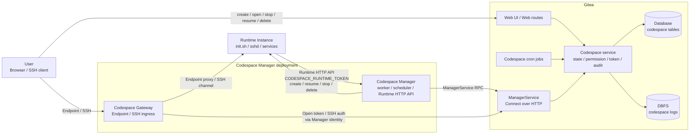
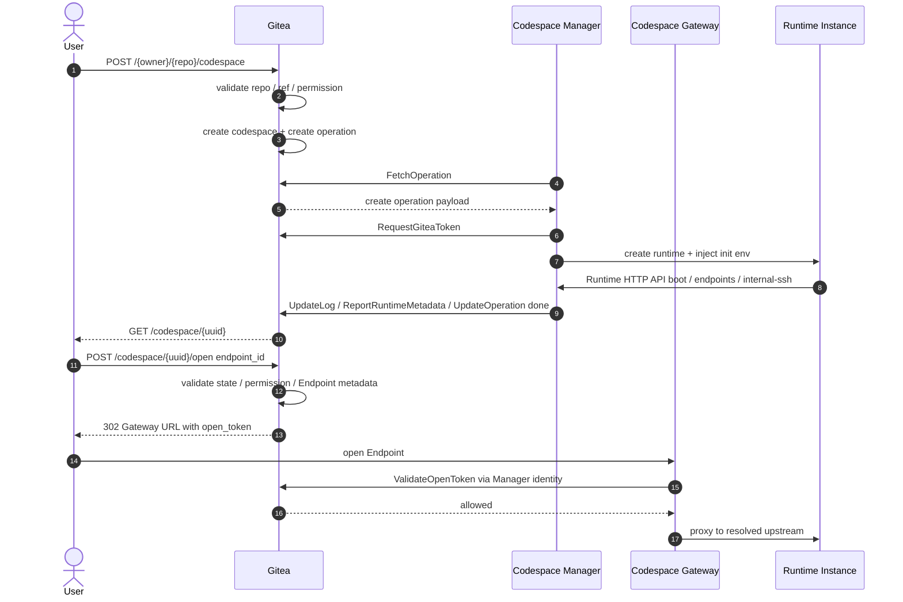
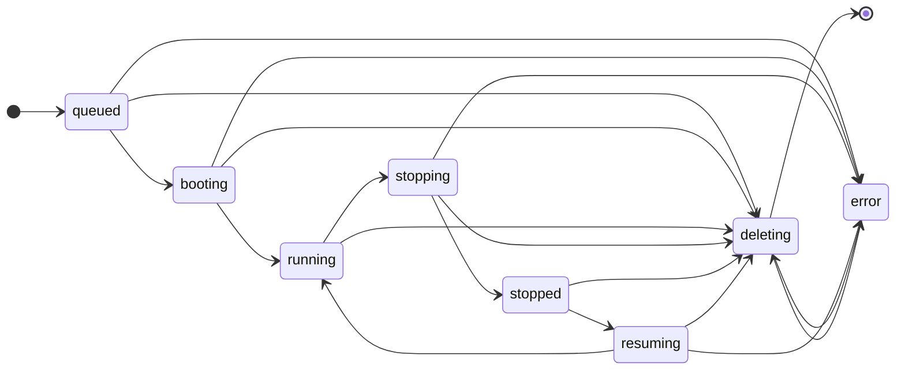

# Gitea Codespace 最终设计

## 目标

Codespace 是 Gitea 内置的远程开发环境入口能力。

Gitea 是以下信息的权威数据源：

- repository、ref 与 commit 校验
- 用户身份与 Gitea 权限判断
- codespace 生命周期状态
- Codespace Manager 注册与认证
- Gitea access token 的签发、绑定、删除保护与吊销
- Gateway Open Token 的签发与校验
- SSH 认证判定
- 审计记录
- operation 日志归档与展示
- 用户 create、open、stop、resume、delete、logs 入口

Codespace Manager 是以下信息的权威数据源：

- Runtime Instance 类型、镜像、资源、后端、bootstrap、init script、网络、挂载、端口转发
- Runtime Instance create、resume、stop、delete 执行细节
- Runtime Token 生成与校验
- Runtime HTTP API
- Runtime Metadata 观测
- Endpoint upstream 解析
- Gateway 内部 SSH upstream 解析

Codespace Gateway 是 Codespace Manager deployment 下的接入组件，不作为独立 Gitea 身份注册。

Codespace Gateway 负责：

- 用户 Endpoint 接入
- 用户 SSH 接入
- Gateway session 处理
- 通过 Codespace Manager 身份或 Manager 内部调用让 Gitea 校验 Gateway Open Token 与 SSH 认证
- 到 Runtime Instance 的 SSH channel 转发

Gitea 不参与运行时选型，不保存运行时专有配置，不直接操作 Incus / Docker，不读取或校验 Runtime Token。

## 架构



架构约束：

- Gitea 只保存状态、权限、token 绑定、审计和日志元数据。
- Codespace Manager 是运行侧唯一 Gitea 注册身份。
- Codespace Gateway 属于 Codespace Manager deployment，不单独注册 Gitea 身份。
- Runtime Instance 的 codespace 专用控制面 API 只调用 Codespace Manager Runtime HTTP API。
- 用户 Endpoint / SSH 流量不经过 Gitea 代理。
- Incus、Docker、镜像、资源规格、挂载、网络、DinD 都是 Codespace Manager 本地实现细节。
- Gitea 与 Codespace Manager 之间只使用 ManagerService RPC。
- Runtime HTTP API 只在 Manager 私有网络内开放。
- Codespace Gateway 对用户暴露 Endpoint 与 SSH 入口。
- Runtime Instance 可以访问 Gitea 标准数据面能力，例如 git HTTP/SSH、repository web URL 和其他非 codespace 专用入口。
- Gitea 不接受 Runtime Instance 直接调用 codespace 专用内部接口。
- Gateway 用户流量只在需要鉴权时回到 Gitea。
- Endpoint upstream 只由 Codespace Gateway 和 Codespace Manager 解析。
- Gitea 不保存 Endpoint upstream。

核心通信流程：



## 术语

| 术语 | 定义 |
| --- | --- |
| Codespace | Gitea 中的一条远程开发环境记录。 |
| Runtime Instance | Codespace Manager 创建的 VM、容器或工作负载。 |
| Codespace Manager | 运行侧 worker，负责注册、领取 operation、管理 Runtime Instance、上传日志、上报 Runtime Metadata。 |
| Codespace Gateway | Manager deployment 内的用户 Endpoint 与 SSH 接入组件。 |
| ManagerService | Gitea 实现、Codespace Manager 调用的 Connect RPC over HTTP 服务。 |
| Runtime HTTP API | Codespace Manager 实现、Runtime Instance 使用 Runtime Token 调用的 HTTP/JSON API。 |
| Operation | 一次异步生命周期操作，类型为 create、resume、stop、delete。 |
| Manager Selection | Gitea 选择 global、owner、repo scope 并匹配 Manager tag 的过程。 |
| Manager Capacity | Codespace Manager 上报的 create/resume 可领取容量快照。 |
| Endpoint | Runtime 声明的可打开入口，使用 `endpoint_id` 标识。 |
| Gateway Open Token | Gitea 为打开 Endpoint 签发的一次性短期 opaque token。 |
| Gitea Token | Gitea 签发给 Runtime Instance 做 git 访问的 access token。 |
| Runtime Token | Codespace Manager 签发给 Runtime Instance 调用 Runtime HTTP API 的 token。 |
| Manager Token | Codespace Manager 调用 ManagerService RPC 的长期凭据。 |
| Runtime Metadata | Codespace Manager 上报到 Gitea 本地 cache 的动态运行时信息。 |
| Interactive Access | open Endpoint、SSH、resume。 |
| Administrative Permission | 查看最小信息、日志、stop、delete。 |
| State Finalization | Gitea 根据 operation 结果推导 codespace 主状态的服务逻辑。 |
| State Reconciliation | Gitea 后台任务处理 operation 超时、stale report、状态分歧和清理。 |
| Stale Report | Manager 上报的 `operation_uuid`、`codespace_uuid` 或 `generation` 已不匹配当前 codespace 状态的过期上报。 |
| State Divergence | Gitea 记录状态与 Manager 上报的 Runtime Instance 实际状态不一致。 |
| Manager Instruction | Gitea 返回给 Manager 的调和指令，例如 `cleanup_local_runtime`。 |

命名规则：

- codespace 创建者字段统一为 `user_id`，不使用 `owner_id`。
- repository owner 仍为 `repository.owner_id -> user.id`。
- Endpoint 字段统一为 `endpoint_id`。
- Endpoint 唯一性范围是单个 `codespace_uuid + generation`。
- Endpoint 不是端口模型。
- 动态运行时数据统一称为 Runtime Metadata。

## 核心原则

- Gitea 只负责授权、审计、状态、日志、token 绑定和跳转入口。
- Codespace 复用 Gitea 现有用户、组织、仓库、权限、token、SSH key、TOTP、登录限制、git、Pull Request 和 Actions task claim 模型。
- 用户拥有 repository code-read 权限即可创建 codespace。
- Codespace 是创建用户私有对象，不是 repository 共享对象。
- Codespace Manager 不得用自己的身份访问 repository 内容。
- Runtime git 访问必须使用基于创建用户当前权限签发的 Gitea access token。
- create、resume、stop、delete 必须幂等。
- 同一 codespace 同一时刻只能有一个 active operation。
- codespace 不新增通用 notifier、通用 rate limiter、通用 repo-scoped token 或通用审计子系统。
- 不存在 retry operation。
- create 失败后不在同一个 codespace 对象上重建。
- 失败是终态，除 delete 外不能恢复。
- delete 成功后物理删除 codespace、operation 和 codespace 日志。
- codespace 不设计 quota。保留 Manager Capacity，它只控制 Manager 能否领取 create/resume。

## 生命周期状态

用户可见状态与存储主状态使用单轴状态图：



状态含义：

- `queued`：请求和 operation 已创建，但尚未被 Manager 领取。
- `booting`：首次 create 正在构建环境并执行 `init.sh`。
- `running`：Runtime Instance 正在运行，可按条件 open/SSH。
- `stopping`：正在停止 Runtime Instance。
- `stopped`：Runtime Instance 已停止，可按条件 resume。
- `resuming`：正在恢复 stopped Runtime Instance。
- `deleting`：正在删除 Runtime Instance 和 Gitea 记录。
- `error`：生命周期失败终态，用户只能 delete。

规则：

- `booting` 只能由 create 进入。
- resume 不进入 `booting`。
- `error` 不回到正常状态。
- `error` 后 delete 会创建新的 delete operation 并递增 generation，不视为 retry。
- open、SSH、resume、stop、delete、logs 是否可用，由主状态、repo 状态、用户状态、Manager 在线状态和 Runtime Metadata 共同决定。

## Operation 状态

Operation status 统一为：

```text
queued
running
done
failed
```

含义：

- `queued`：等待 Manager 领取。
- `running`：已被 Manager claim，lease 有效或可续租。
- `done`：Manager 上报成功，且 Gitea 已完成 State Finalization。
- `failed`：Manager 上报失败或 Gitea 判定超时失败，且 Gitea 已完成 State Finalization。

不使用 `leased`、`succeeded`、`cancelled`、`attempts`、`max_attempts`、`retry`。

## Web 页面

Web 页面只保留三类。

### Repository Codespace 入口页

```text
GET  /{owner}/{repo}/codespace
POST /{owner}/{repo}/codespace
```

作用：

- 基于当前 repository/ref 上下文创建 codespace。
- 展示当前用户在该 repository 下创建的 codespace。
- 组织仓库下展示组织管理员可管理的其他成员 codespace。
- 提供进入用户 codespace 列表页的入口。

Repository 页面可以提供静态 `Open in Codespace` 入口：

- repository 主页
- branch/tag 下拉菜单
- pull request 页面
- commit 页面

这些入口只提交 git 上下文，不提交 runtime 参数、image、VM/container 类型、Endpoint、SSH 或 backend 选项。

创建输入：

```text
repo_id
ref_type=branch|tag|commit|pull
ref_name
commit_sha
pull_id
```

### 用户 Codespace 列表页

```text
GET /codespace
```

该页面只展示当前用户创建的 codespace。

展示字段：

- repo
- ref
- status
- last active
- 状态摘要
- open / stop / resume / delete

列表页不读取日志文件。

### 单个 Codespace 页面

```text
GET    /codespace/{uuid}
GET    /codespace/{uuid}/logs
POST   /codespace/{uuid}/open
POST   /codespace/{uuid}/resume
POST   /codespace/{uuid}/stop
DELETE /codespace/{uuid}
```

`GET /codespace/{uuid}` 是唯一对象页面，不存在 `/boot` 或 `/create` 子页面。

`GET /codespace/{uuid}/logs` 是日志数据接口，不是独立页面。

路由行为：

- `POST /{owner}/{repo}/codespace` 成功后重定向到 `GET /codespace/{uuid}`。
- 首次 create 期间停留在同一个对象路径，只按状态切换布局。
- stop/resume 后停留在 `GET /codespace/{uuid}`。
- delete 后返回显式 `return_to`；若没有，则 repository 可见时回到 repository codespace 页，否则回到 `/codespace`。

布局：

- `queued|booting|error|首次 create 链路中的 deleting`：中心日志布局；除 deleting 外只允许 delete。
- `running|stopping|stopped|resuming|非首次 create 链路中的 deleting`：左右分栏；左侧日志，右侧控制与信息。
- `running`：按条件展示 Endpoint 与 SSH 区域。
- `stopped`：按条件展示 resume/delete。
- `error`：只展示日志和 delete。

## 权限

所有权限判断必须复用 Gitea 现有用户、组织、仓库、unit、visibility、blocking、restricted user、login restriction、2FA 和 repository permission 逻辑，不实现第二套权限语义。

Gitea 登录限制至少包括：

- `is_active`
- `prohibit_login`
- `must_change_password`
- 站点强制 2FA

repository 边界必须复用 Gitea 现有结果：

- user blocking
- restricted user
- owner visibility
- internal/private repository visibility
- repository code unit 可读性
- archived、mirror、empty、being migrated、pending transfer、broken 等 repository 状态

Create 要求：

- 当前用户已登录。
- 当前用户满足 Gitea 登录限制。
- 当前用户拥有 repository code-read 权限。
- repository code unit 可读。
- repository 不处于 archived、migrating、pending transfer、broken、empty 或无法解析目标 ref/commit 的状态。

Interactive Access（`open`、SSH、`resume`）要求：

- 仅 codespace 创建用户本人。
- 创建用户当前仍满足 Gitea 登录限制。
- 创建用户当前仍有 repository code-read 权限。
- repository 当前状态允许交互访问。
- codespace 与 Manager 状态允许该动作。
- open 时 Endpoint metadata 必须存在。

Administrative Permission（查看最小信息、日志、stop、delete）：

- 创建用户本人始终拥有管理权限，除非创建用户已被物理删除。
- 组织仓库下，组织管理员额外拥有管理权限。
- 组织管理员统一指 `IsOrganizationAdmin(ctx, orgID, userID)` 判定通过的用户，覆盖 Owners 团队和具备 admin 权限的团队成员。
- 管理权限不要求创建用户当前仍具备 repo code-read。
- 组织管理员不能进入其他用户 workspace。
- 普通协作者和普通 repo 管理员不会因为 repo 权限获得他人 codespace 权限。

个人仓库：

- 不存在 owner 代理管理他人 codespace 的语义。
- 创建用户被删除后，只保留后台清理和审计保留语义。

组织仓库：

- 创建用户失去 repo 访问、被禁用或被删除后，组织管理员仍可 stop/delete 和查看日志/最小信息。

Minimal info 只允许返回：

```text
uuid
status
status_message
created_unix
updated_unix
stopped_unix
creator_id
creator_display_name
creator_deleted
repo_id
repo_display_name
repo_deleted
ref_type
ref_name
commit_sha
pull_id
scope_type
scope_id
manager_id
manager_display_name
manager_online
log_line_count
log_size
last_log_unix
log_expired
allowed_actions
```

Minimal info 禁止返回：

```text
gitea_token_id
Manager Token
Runtime Token
Gateway Open Token
token hash / salt
internal_ssh
Endpoint upstream
完整 meta_json
日志正文
Runtime Instance 内部 host / port / user
```

## Endpoint 打开流程

`POST /codespace/{uuid}/open` 打开一个 Runtime Metadata Endpoint。

输入：

```text
endpoint_id=<endpoint_id>
```

规则：

- `workspace` 是唯一保留 Endpoint ID，表示默认 Web IDE。
- SSH 不是 Endpoint。
- 预览端口、服务入口和 IDE 入口都通过 Endpoint 打开。
- 除 `workspace` 外，Gitea 不定义 Endpoint 协议或产品类型。
- Gitea 不读取 Endpoint 协议、端口、进程或 upstream。
- Gitea 只校验 `endpoint_id` 存在于当前 Runtime Metadata。
- `endpoint_id` 必须匹配 `[A-Za-z0-9_-]+`。
- 不接受 `path`、任意 `redirect`、upstream、URL 或 port 参数。

Endpoint label：

- 仅供 UI 展示。
- 不参与查找、路由、授权、默认选择或审计身份。
- trim 后长度为 1 到 64。
- 禁止控制字符。
- UI 仍必须按普通文本 escape 后展示。

默认 open：

- 当前 Runtime Metadata 存在 `endpoint_id=workspace` 时，列表页/repo 页默认 Open 打开 `workspace`。
- 不存在 `workspace` 时，默认 Open 进入 `GET /codespace/{uuid}`，让用户手动选择 Endpoint。

open 成功响应：

```text
302 Location: {manager.gateway_url}/open?open_token={token}
```

规则：

- `open_token` 是唯一授权凭据。
- Gitea 可以追加只读路由提示参数，但 Gateway 不能信任这些参数作为授权依据。
- Gateway 必须调用 `ValidateOpenToken` 校验。
- Gateway 不得把 `open_token` 转发给 Runtime Instance。
- Gateway access log 不得记录完整 token。

## Gateway Open Token

Gateway Open Token 是：

- 短期有效
- 一次性使用
- opaque bearer token
- 非 JWT
- 不进入数据库
- 以 token hash 写入 Gitea 本地 cache
- 绑定 `user_id / codespace_uuid / generation / endpoint_id / manager_uuid`

签发算法：

```text
issued_unix_nano = current time
random_bytes = crypto random 32 bytes
token_salt = crypto random 16 bytes
open_token = base64url(sha256(random_bytes + issued_unix_nano + token_salt + gitea_secret))
token_hash = sha256(open_token)
```

规则：

- token 明文只出现在 `302 Location` 中，不写 DB、不写日志。
- cache 写入前若 `token_hash` 冲突，必须重新生成。
- hash 比较使用常量时间比较。
- token 消费通过本机锁串行化执行 `get -> validate -> delete`。

Cache 结构：

```text
key = codespace:open-token:{token_hash}
value = user_id + codespace_uuid + generation + endpoint_id + manager_uuid + issued_unix + expires_unix
ttl = OPEN_TOKEN_EXPIRE
```

校验必须执行：

1. 计算提交 token 的 hash。
2. 在本机锁保护下读取并删除 cache 记录。
3. 校验过期时间。
4. 校验调用方 Manager 身份等于 `manager_uuid`。
5. 重新读取 codespace。
6. 校验 generation 仍匹配。
7. 校验 codespace 当前为 `running`。
8. 校验用户仍具备 Interactive Access。
9. 校验 Endpoint 仍存在于当前 Runtime Metadata。
10. 校验 Manager 仍在线。
11. 校验 Manager 未被 disabled。

成功返回：

```text
user_id
codespace_uuid
generation
endpoint_id
manager_uuid
```

Cache 丢失即 token 失效，用户必须重新从 Gitea 发起 open。

Gateway session 规则：

- Gateway 必须维护 `codespace_uuid -> live sessions` 的本地索引。
- open 建立的 HTTP/WebSocket/IDE 会话在 `stop`、`delete`、Manager disabled、repo access lost、user access lost 后必须被 Gateway 主动关闭。
- 上述条件发生后，Gateway 同时拒绝该 codespace 的新 open。

## SSH 设计

SSH 是 codespace 自身稳定接入面，不是 Endpoint。

Gitea 在创建 codespace 时生成 `ssh_user`。`ssh_user` 在 codespace 生命周期内保持不变，delete 后失效且不复用。

示例：

```text
dragon+12141qwdada@1.2.3.4
```

规则：

- 只有 `running` 允许 SSH。
- `queued|booting|stopping|stopped|resuming|deleting|error` 一律拒绝 SSH。
- SSH 不自动唤醒 stopped codespace。
- `ssh_password_auth_allowed` 由 Gitea 创建服务策略写入。
- `ssh_password_auth_allowed=false` 时拒绝密码认证，但不影响公钥认证。

Codespace Manager 必须保证 Runtime Instance 存在兼容 OpenSSH 的 sshd。

Gateway 模型：

1. 用户连接 `ssh_user@gateway_host`。
2. Gateway 解析 `ssh_user`。
3. Gateway 调用 Gitea 完成密码/TOTP 或公钥认证。
4. Gateway 确认 codespace 为 running。
5. Gateway 作为 SSH client 连接 Runtime Instance 内部 sshd。
6. Gateway 在外部 SSH 连接与内部 SSH 连接之间转发 channel。

Gateway 终止外部 SSH 并重建内部 SSH，不采用纯 TCP forwarding，也不自行实现 shell/sftp/pty 语义。

必须支持的 SSH channel 能力：

- shell
- exec
- subsystem `sftp`
- `pty-req`
- `window-change`
- `signal`
- `env`
- `exit-status`
- `exit-signal`
- `auth-agent-req`
- `x11-req`
- `direct-tcpip`
- `tcpip-forward`
- `cancel-tcpip-forward`

SSH forwarding 属于 SSH 会话能力，不写入 Runtime Metadata `endpoints`。

## SSH 认证 RPC

Gateway 每次 SSH 认证尝试都必须调用 Gitea。Gateway 不得跨连接缓存密码或公钥认证成功结果。

`VerifySSHPasswordRequest`：

```text
ssh_user
password
source_ip
user_agent_or_client_version
gateway_session_id
```

若用户启用 TOTP，密码格式为：

```text
password|totp_code
```

`VerifySSHPasswordResponse`：

```text
allowed
user_id
codespace_uuid
generation
failure_category
failure_retryable
```

`VerifySSHPublicKeyRequest`：

```text
ssh_user
public_key_fingerprint
public_key_algorithm
public_key_blob
source_ip
user_agent_or_client_version
gateway_session_id
```

`VerifySSHPublicKeyResponse`：

```text
allowed
user_id
codespace_uuid
generation
failure_category
failure_retryable
```

失败分类：

```text
invalid_credentials
login_restricted
totp_required_or_invalid
codespace_not_found
codespace_not_running
ssh_disabled
repo_access_lost
manager_mismatch
permission_denied
internal_error
```

Gitea 校验：

- `ssh_user` 映射到有效 codespace。
- codespace 为 `running`。
- 认证者是 codespace 创建用户。
- 创建用户当前允许登录。
- 满足站点 2FA 要求。
- repository access precondition 仍通过。
- 绑定 Manager 当前在线且未被 disabled。
- 密码认证被该 codespace 允许。
- 本地密码和 TOTP 使用 Gitea 现有校验与消费逻辑。
- 公钥通过 Gitea 现有 SSH key 模型归属于创建用户。

Gateway 必须至少按 source IP、`ssh_user`、`codespace_uuid` 做限流和退避。Gitea 不新增通用 rate limiter。

Gitea 可以向 Gateway 返回失败分类用于审计和退避。Gateway 对 SSH client 只能返回统一认证失败。

SSH session 规则：

- Gateway 必须维护 `codespace_uuid -> live SSH sessions` 的本地索引。
- 已建立 SSH 会话在 `stop`、`delete`、Manager disabled、repo access lost、user access lost 后必须被 Gateway 主动断开。
- 上述条件发生后，Gateway 同时拒绝新的 SSH 认证与会话建立。

## 内部 SSH

每条 Codespace Manager 注册记录拥有一对固定内部 Gateway SSH key。

规则：

- Manager 声明 `gateway_internal_ssh_public_key`。
- create/resume 时将该公钥写入 Runtime Instance 内部工作用户 `authorized_keys`。
- Gateway 使用对应 private key 连接内部 sshd。
- 内部 host、port、user、host key fingerprint 通过 Runtime HTTP API 上报。
- 用户密码、用户公钥、TOTP 不在 Runtime Instance 内部校验。
- 内部 SSH metadata 不在普通 UI/API 输出中暴露。

## 创建与 Ref 解析

Create 支持：

```text
ref_type=branch|tag|commit|pull
ref_name
commit_sha
pull_id
```

Gitea 必须：

- 校验 repository 可见性和 code-read 权限。
- 校验 repository 状态。
- 打开 git repository 并确认非空。
- 解析并锁定最终 commit SHA。
- 拒绝不存在的 ref 和不可解析的 commit。
- PR 创建记录 `pull_id`。

Pull Request 规则：

- PR 入口属于 base repository 页面。
- `ref_type=pull` 时从 Gitea 数据加载 PR。
- base repository 必须等于路由 repository。
- 创建用户必须能读取 base repository。
- head repository 不同时，创建用户也必须能读取 head repository。
- 锁定 commit 必须能从 head repository 解析。
- 必要时 operation payload 同时包含 base/head clone URL 与 web URL。
- Manager Selection 和 `.gitea/codespace.yaml` 使用 base repository。

## Repository Codespace 配置

Repository 配置文件：

```text
.gitea/codespace.yaml
```

唯一字段：

```yaml
tag: default
```

规则：

- 配置只从 branch tree 读取。
- `ref_type=branch`：读取该 branch。
- `ref_type=pull`：读取 PR base branch。
- `ref_type=tag`：读取 repository default branch。
- `ref_type=commit`：读取 repository default branch。
- 文件不存在等价于 `tag=default`。
- 空仓库在读取配置前已被拒绝。
- YAML 非法时 create 失败。
- 未知字段忽略。
- `tag` 必须匹配 `[A-Za-z0-9_-]+`。
- `tag` 解析后 lower-case。
- `tag` 只影响 create 的 Manager Selection。
- `tag` 不影响 stop/resume/delete。
- 实际 checkout commit 仍按用户选择的 branch/tag/commit/PR 锁定 SHA。

## Boot 与 Init 契约

`booting` 是首次 create 的唯一环境初始化状态。

Codespace Manager 在 Runtime Instance 启动后必须以 `init.sh` 作为唯一初始化入口。

`init.sh` 负责：

- 配置 git 凭据
- clone 或复用 workspace 目录
- fetch 目标 ref
- checkout 到锁定 commit SHA
- 校验 HEAD 等于锁定 commit SHA
- 准备 OpenSSH
- 将 `CODESPACE_GATEWAY_INTERNAL_SSH_PUBLIC_KEY` 写入内部工作用户 `authorized_keys`
- 启动内部 sshd
- 启动默认 Web IDE 或其他本地服务
- 通过 Runtime HTTP API 声明 Endpoints
- 通过 Runtime HTTP API 上报 internal SSH metadata

必需环境变量：

```text
GITEA_REPO_CLONE_URL
GITEA_REPO_WEB_URL
GITEA_BASE_REPO_CLONE_URL
GITEA_BASE_REPO_WEB_URL
GITEA_HEAD_REPO_CLONE_URL
GITEA_HEAD_REPO_WEB_URL
GITEA_REPO_ID
GITEA_REPO_FULL_NAME
GITEA_OWNER_ID
GITEA_OWNER_NAME
GITEA_OWNER_TYPE
GITEA_OWNER_DISPLAY_NAME
GITEA_REF_TYPE
GITEA_REF_NAME
GITEA_COMMIT_SHA
GITEA_PULL_ID
GITEA_TOKEN
CODESPACE_UUID
CODESPACE_NAME
CODESPACE_OWNER_NAME
CODESPACE_REPO_NAME
CODESPACE_WORKSPACE_DIR
CODESPACE_SSH_USER
CODESPACE_MANAGER_BASE_URL
CODESPACE_RUNTIME_TOKEN
CODESPACE_GATEWAY_INTERNAL_SSH_PUBLIC_KEY
```

可选环境变量：

```text
CODESPACE_BOOT_LOG_PATH
```

Boot 完成条件：

- `init.sh` 成功。
- workspace checkout 到锁定 commit SHA。
- internal SSH 可被 Gateway 连通。
- `internal_ssh.host / port / user / host_key_fingerprint` 已上报。
- 至少一版 Runtime Metadata 被 Gitea 接受。
- 若存在 Web IDE，对应 Endpoint 已上报。

推荐 boot stage：

```text
prepare-runtime
configure-ssh
configure-git
clone-repository
checkout-commit
run-init-script
start-ide
report-endpoints
```

## Manager 注册与选择

Manager 注册参考 Gitea Actions runner 方式。

命令：

```text
gitea-codespace register
gitea-codespace serve
```

注册流程：

1. Gitea 为某个 scope 创建一次性 registration token。
2. `gitea-codespace register` 通过 `RegisterManager` 兑换该 token。
3. Gitea 创建 Manager 记录，返回一次性明文 `manager_uuid + manager_token`。
4. Manager 将凭据保存到本地配置。
5. `gitea-codespace serve` 使用该凭据调用后续所有 RPC。

registration token 设计：

- registration token 不建数据库表。
- registration token 只写入 Gitea 本地 cache。
- key：`codespace:manager-reg-token:{token_hash}`
- value：`owner_id + repo_id + created_by + expires_unix`
- ttl：`REGISTRATION_TOKEN_EXPIRE`
- 消费时通过本机锁串行化执行 `get -> validate -> delete`。
- Gitea 重启后，所有未消费的 registration token 失效，需要重新生成。

注册 scope：

- `global`：站点管理员
- `owner`：owner 管理员
- `repo`：repository 管理员

Manager 记录字段：

```text
id
uuid
name
owner_id
repo_id
gateway_url
gateway_ssh_addr
gateway_internal_ssh_public_key
admin_state=enabled|disabled
capacity_total
capacity_available
token_hash
token_salt
tags_json
last_online_unix
created_by
created_unix
updated_unix
meta_json
```

Scope 规则：

- `owner_id=0 && repo_id=0`：global
- `owner_id>0 && repo_id=0`：owner
- `owner_id=0 && repo_id>0`：repo
- `owner_id>0 && repo_id>0` 非法
- 不设计单独的 Manager binding 表
- `admin_state` 只表达管理态，不表达在线态；在线态由 `last_online_unix` 和 timeout 推导。

Declare 必须声明：

- `gateway_url`
- `gateway_ssh_addr`
- `gateway_internal_ssh_public_key`
- `tags`
- `capacity_total`
- `capacity_available`
- 可选诊断 `meta_json`

SSH 是必选能力。不满足完整 SSH 契约的 Manager 无效。

Manager Selection：

1. 若 repository 存在 repo-scope Manager，固定使用 repo scope。
2. 否则若 `repository.owner_id` 存在 owner-scope Manager，固定使用 owner scope。
3. 否则使用 global scope。
4. 一旦某层 scope 存在 Manager，不再向外层 fallback，即使该 scope 没有匹配 tag/capacity 的 Manager。
5. create 记录固定 `scope_type`、`scope_id`、`repo_tag`。
6. 当前 scope 没有 Manager 支持 `repo_tag` 时，create 直接失败。
7. 有匹配 Manager 但当前无人可领取 create 时，create 保持 `queued`。

Create operation claim：

- claim 前：`codespace.manager_id=0`，`operation.manager_id=0`。
- `FetchOperation` 原子 claim operation。
- claim 同时写入 `codespace.manager_id`、`operation.manager_id`，并将 codespace 从 `queued` 推进到 `booting`。
- claim 条件必须包含 `manager_id=0`、当前 status、active operation 和 generation。
- capacity 在 claim 事务内二次校验。
- 并发 claim 失败不是系统错误。

Manager Capacity：

- `capacity_total > 0`
- `0 <= capacity_available <= capacity_total`
- create/resume 需要可用 capacity
- stop/delete 不需要可用 capacity
- capacity 只是 Manager claim 约束，不是 Gitea quota

Manager 禁用/删除：

- 常规操作支持禁用，不提供普通物理删除。
- disabled Manager 不能领取 create/resume，不能服务 open/SSH。
- disabled Manager 仍可领取 stop/delete 用于清理。
- 仍有未删除 codespace 引用时，禁止物理删除 Manager 记录。
- 完整移除 Manager 前必须先删除或清理其所有 codespace。

## ManagerService RPC

Gitea 实现：

```text
codespace.v1.ManagerService
```

传输：

- Connect RPC over HTTP
- 使用生成的 Connect handler
- 按 Actions runner Connect 服务形态挂载
- 不提供 REST 控制面旁路

Manager 认证 header：

```text
x-codespace-manager-uuid: <manager uuid>
x-codespace-manager-token: <manager token>
```

只有 `RegisterManager` 不使用 Manager header。它使用一次性 registration token 认证。

RPC：

```text
RegisterManager
DeclareManager
FetchOperation
UpdateOperation
UpdateLog
ReportRuntimeMetadata
RequestGiteaToken
ValidateOpenToken
VerifySSHPassword
VerifySSHPublicKey
ReportInstances
```

`RegisterManager`：

- 将一次性 registration token 兑换为 Manager identity 和 Manager Token。
- 消费 registration token。
- 只返回一次明文 Manager Token。

`DeclareManager`：

- 更新 Manager 版本、gateway 地址、tags、capacity、内部 SSH 公钥和诊断 metadata。
- 更新 `last_online_unix`。
- `DeclareManager` 同时承担 heartbeat。
- Manager 必须周期调用 `DeclareManager`；心跳间隔必须严格小于 `MANAGER_OFFLINE_TIMEOUT`，建议不超过其三分之一。

`FetchOperation`：

- 返回当前 Manager 可领取的 operation。
- 对 create operation 执行 scope/tag/capacity 检查并原子 claim。
- 更新 capacity snapshot。

`UpdateOperation`：

- 续租 lease。
- 更新 progress/stage。
- 写入终态结果 `done|failed`。
- 更新 capacity snapshot。
- 触发 Gitea 服务层同步执行 State Finalization。

`UpdateLog`：

- 按 offset 追加已脱敏日志。
- 拒绝日志空洞。
- 要求匹配 `operation_uuid / codespace_uuid / generation`。

`ReportRuntimeMetadata`：

- 只写 Runtime Metadata 到本地 cache。
- 永远不写主状态。
- Manager 启动后必须为所有仍由自己持有且处于 `booting|running|stopping|resuming` 的 codespace 重建 Runtime Metadata cache。
- Manager 运行期间必须周期刷新 active codespace 的 Runtime Metadata cache，避免 Gitea 重启或本地 cache 丢失后长期失去交互能力。

`RequestGiteaToken`：

- 只允许 active create/resume operation 申请。
- 返回一次性明文 Gitea access token。

`ValidateOpenToken`：

- 校验并消费 Gateway Open Token。
- 返回校验后的 open binding。

`VerifySSHPassword` 与 `VerifySSHPublicKey`：

- 做 Gitea 侧认证和授权判定。
- 不返回长期凭据。

`ReportInstances`：

- Manager 重启后上报本地 Runtime Instance 集合。
- Gitea 检测状态分歧，并可返回 `manager_instruction=cleanup_local_runtime`。

所有 operation-bound RPC 都必须携带：

```text
operation_uuid
codespace_uuid
generation
```

Stale report 不能修改当前状态。

### Operation Payload

`FetchOperation` 返回给 Manager 的 operation payload 至少包含：

```text
operation_uuid
operation_type
codespace_uuid
generation
repo_clone_url
repo_web_url
repo_tag
base_repo_clone_url
base_repo_web_url
head_repo_clone_url
head_repo_web_url
start_ref
ref_type
ref_name
commit_sha
pull_id
workspace_dir
ssh_user
manager_base_url
lease_deadline_unix
```

规则：

- `operation_type` 只允许 `create|resume|stop|delete`。
- `start_ref` 是 Manager 用于 fetch/checkout 的输入提示，最终 checkout 必须以 `commit_sha` 为准。
- 非 PR 场景下 `base_*` 与 `head_*` 可以为空。
- PR 场景下 payload 必须同时包含 base/head clone URL 与 web URL。
- Gitea 不下发 Runtime Instance ID、Runtime Instance name、镜像、资源、backend、mount、network 或 Endpoint upstream。
- Manager 使用 `codespace_uuid` 和 `generation` 在本地生成或查找 Runtime Instance 的确定性映射。
- `lease_deadline_unix` 是本次 claim/续租的截止时间，Manager 必须在截止前通过 `UpdateOperation` 续租或上报终态。

## State Finalization

Codespace 主状态只能由 Gitea State Finalization 写入。

`UpdateOperation` 只记录 operation 事实并触发 State Finalization。Manager 永远不能直接覆盖 codespace 主状态。

State Finalization 在同一事务内执行：

1. 读取 codespace 和 operation。
2. 校验 `active_operation_id`。
3. 校验 `generation`。
4. 校验当前状态转移合法。
5. 应用 operation 终态结果。
6. 更新 codespace 主状态。
7. 更新 token 状态。
8. 写入 `stopped_unix`、`status_message` 和必要 metadata。
9. 按需清理或保留 active operation。

状态推进：

```text
create done:   booting -> running
create failed: queued|booting -> error
resume done:   resuming -> running
resume failed: resuming -> error
stop done:     stopping -> stopped
stop failed:   stopping -> error
delete done:   deleting -> physical delete
delete failed: deleting -> error
```

超时：

- queue timeout：`queued -> error`
- boot timeout：`booting -> error`
- resume timeout：`resuming -> error`
- stop timeout：`stopping -> error`
- delete timeout：`deleting -> error`

进入 `stopping`、`deleting`、`error` 的同一事务里吊销 active Gitea Token。

## State Reconciliation

`reconcile_codespace_operations` 周期运行。

职责：

- 检查中间态。
- 检查 active operation deadline。
- 检查 Manager offline timeout。
- 将超时 operation 标记为 failed。
- 通过 State Finalization 进入 `error`。
- 吊销失效 Gitea Token。
- 写入 `status_message`。
- 处理 stale Runtime Metadata 与 ReportInstances 分歧。

规则：

- Gitea 是状态权威。
- Manager 观测事实不能恢复 Gitea 主状态。
- Gitea 当前为 `error` 而 Manager 报告 runtime 仍存在时，Gitea 记录分歧并返回 cleanup 指令。
- Gitea 已物理删除 codespace 而 Manager 继续上报时，Gitea 返回 `NotFound + cleanup_local_runtime`。
- Manager 声称 runtime 不存在而 Gitea 认为 running 时，Gitea 进入 `error` 并吊销 token。
- Gitea 认为 deleting 时，任何非 delete 上报都不能改变状态。

## Runtime HTTP API

`CODESPACE_MANAGER_BASE_URL` 是 Runtime Instance 访问 Codespace Manager Runtime HTTP API 的根地址。

Runtime HTTP API 属于 Manager 私有运行网络，不属于 Gitea 路由。

所有请求使用：

```text
Authorization: Bearer <CODESPACE_RUNTIME_TOKEN>
Content-Type: application/json
```

网络规则：

- 只允许 Runtime Instance 私网 source IP 调用。
- source IP 与 Runtime Token 必须同时校验。
- 禁止公网、浏览器页面或普通用户终端直接调用。

路径前缀：

```text
{CODESPACE_MANAGER_BASE_URL}/api/runtime/v1
```

最小接口：

```text
GET  /api/runtime/v1/session
PUT  /api/runtime/v1/boot
PUT  /api/runtime/v1/endpoints
PUT  /api/runtime/v1/internal-ssh
```

`PUT /endpoints`：

- 上报当前 `codespace_uuid + generation` 的全量快照。
- 重复 `endpoint_id` 直接拒绝。
- 如果同一次上报存在重复 `endpoint_id`，Manager 必须拒绝 Runtime 请求并保留上一版 Runtime Metadata。
- 若存在 Web IDE，Runtime Instance 应最终声明 `endpoint_id=workspace`。
- Endpoint 上报不包含可由用户控制的公开 URL。
- Endpoint upstream 只保存在 Manager/Gateway 内部状态。
- Gitea 只接收展示与校验所需 metadata。

`PUT /internal-ssh`：

- 上报私有内部 SSH 连接信息。
- 不面向用户展示。

## Runtime Metadata

`ReportRuntimeMetadata` 只写当前 Runtime Metadata 快照。

允许的结构：

```json
{
  "runtime": {
    "internal_ssh": {
      "host": "10.0.0.12",
      "port": 2222,
      "user": "coder",
      "auth_mode": "publickey",
      "host_key_fingerprint": "SHA256:..."
    }
  },
  "endpoints": [
    {
      "endpoint_id": "workspace",
      "label": "Workspace"
    },
    {
      "endpoint_id": "app-3000",
      "label": "App 3000"
    }
  ],
  "boot": {
    "stage": "run-init-script",
    "message": "running init script",
    "started_unix": 0,
    "last_update_unix": 0
  },
  "resource_usage": {
    "cpu": "unavailable",
    "memory": "unavailable",
    "disk": "unavailable",
    "network": "unavailable"
  },
  "last_reported_unix": 0
}
```

规则：

- `endpoints` 不建独立表。
- `internal_ssh` 不在普通 UI/API 输出中暴露。
- `endpoint_id` 由 Manager 上报并保证在同一 `codespace_uuid + generation` 内唯一。
- 不同 codespace 或不同 generation 可以使用相同 `endpoint_id`。
- `label` 只用于 UI 展示，可以重复，不能作为路由键。
- Runtime Metadata 不持久化到数据库，只保存在 Gitea 本地 cache。
- key：`codespace:runtime-meta:{codespace_uuid}:{generation}`
- value：当前 generation 的 `endpoints + internal_ssh + boot + resource_usage + last_reported_unix`
- ttl：`MANAGER_OFFLINE_TIMEOUT * 2`
- 只要所属 Manager 在线，Gitea 即信任当前 cache 中的 Runtime Metadata。
- Gitea 重启或本地 cache 丢失后，Runtime Metadata 必须由 Manager 重建。
- Manager 离线时，不允许新的 Endpoint 打开动作。
- Manager 离线时，不允许新的 SSH 接入。
- resource usage 是可选展示信息。
- 缺失 resource usage 时显示 `unavailable`。
- Runtime Metadata 不保存历史，cache miss 只影响交互与展示，不直接推进主状态。

## Gitea Token

Codespace Gitea Token 复用 Gitea 现有 `access_token` 模型。

设计依据：

- 参考 Gitea Actions 的 token 认证与 repository 绑定模型，而不是新增新的通用 token 类型。
- Actions 现有实现先把 task token 识别为内部 actor，再在 repository 权限判定阶段按 `task.RepoID` 校验目标 repository；同 repo 允许正常权限，跨 repo 再按额外限制收紧。
- Codespace 采用同类设计：继续复用现有 `access_token` 与 `write:repository` scope，再增加 `codespace.repo_id` 绑定校验，而不是扩展 repository 级 scope。
- 这样做的原因是 Gitea 现有 access token scope 只有 category 级，没有单仓库语义；把“能做 repository 类操作”和“只能访问哪个 repository”拆开，才能在不扩展通用 token 系统的前提下得到可执行且可审计的边界。

当前 Gitea access token scope 是 category 级，例如 `write:repository`，不是 repository 级 scope。Codespace 不新增通用细粒度 repo-scoped token。

规则：

- token 归属于 codespace 创建用户。
- 所有 codespace token 统一签发 `write:repository`。
- 这是 repository 类能力开关，不表达单仓库范围，也不提升创建用户原有 repository 权限。
- `codespace.gitea_token_id` 指向当前 active access token。
- `codespace.repo_id` 是唯一 repository binding。
- Git HTTP/SSH 认证链路必须识别 codespace-bound token。
- repository 访问只在现有支持 token/basic auth 的入口做 repo binding 校验。
- 最小必需入口是：git HTTP、git SSH、API v1 repository routes，以及显式启用 `AllowBasic`/`AllowOAuth2` 的 repository HTTP 路径。
- 上述入口在 scope 校验外，必须额外校验 `target_repo_id == codespace.repo_id`。
- codespace-bound token 只能访问 `codespace.repo_id`；访问其他 repository 时即使 token scope 正常允许，也必须拒绝。
- codespace token 不授予 `read:user`、`read:organization` 或其他非 repository scope。
- Runtime 需要的 owner/org 展示信息由 Gitea 在 create/resume 时作为只读环境变量注入，不通过 codespace token 调用通用 user/org API。
- 每次 create/resume 都替换 token。
- stop/delete/error/source repo 删除/user 删除时吊销 token。
- 只有 `booting`、`running`、`resuming` 允许持有 active token；`stopped`、`deleting`、`error` 不允许申请或继续使用 token。

删除保护：

- 被 `codespace.gitea_token_id` 引用的 access token 不允许手动删除。
- 用户设置页和 API token 列表必须展示该 token 被 codespace 使用。
- 这是对现有 Gitea access token 管理页与 API 的 codespace 定制扩展，不引入新的通用 token 子系统。
- UI/API 必须能显示该 token 当前被哪个 codespace 占用。
- 手动删除返回：
  - Web：提示先 stop/delete 对应 codespace。
  - API：`409 Conflict`。
- 只有 codespace 生命周期服务可以吊销/删除该 token。
- reconciliation 负责清理 codespace 已不存在但 token 仍标记占用的异常状态。

## Runtime Token

Runtime Token 只由 Codespace Manager 生成和校验。

Gitea：

- 不签发 Runtime Token。
- 不保存 Runtime Token。
- 不校验 Runtime Token。
- 不在 ManagerService RPC 中接收 Runtime Token。

Runtime Token 只用于 Runtime Instance 调用 Runtime HTTP API。

## Manager Token

Manager Token 用于认证 ManagerService RPC。

规则：

- 只在 `RegisterManager` 响应中返回一次。
- 由 Manager 保存在本地配置。
- Gitea 只保存 hash/salt。
- 使用常量时间比较。
- token rotation 只影响后续 RPC。

## 删除与外部状态变化

Repository archived、migrating、pending transfer、broken、deleted、git 不可读或 ref 不可解析时：

- 不允许 create。
- 不允许 resume。
- 不允许新的 open。
- 不允许新的 SSH。
- 仍按 Administrative Permission 允许 logs、stop、delete。

Repository 删除：

- 存在 `scope_type=repo AND scope_id=repository.id` 的未删除 codespace 时阻止删除。
- `scope_type!=repo AND repo_id=repository.id` 的 codespace 不阻止删除。
- repository 删除确认 UI 必须提示会清理或影响的 codespace 数量。
- 若存在 repo-scope codespace，删除确认页必须要求先删除这些 codespace，不能在同一事务里静默删除 repository。
- repository 删除成功页或确认摘要必须展示受影响的 owner/global scope codespace 数量。
- 对不阻止删除的关联 codespace，repository 删除事务内必须：
  - 吊销 Gitea Token。
  - 禁止 open/SSH/resume。
  - 写入 `status_message=source repository deleted; cleanup required`。
  - Manager 在线且已绑定时创建 delete operation 并进入 `deleting`。
  - 否则进入 `error`。
- source repository 删除后，相关 codespace 列表和详情页显示 `source repository deleted`。
- repository 删除不发送站点通知。

Owner/user/org 删除：

- 存在 `scope_type=owner AND scope_id=user.id` 的未删除 codespace 时阻止删除。
- owner/org 删除确认必须在删除事务前检查 owner-scope codespace。
- manager 记录属于该 owner scope 且仍被未删除 codespace 引用时，owner/org 删除必须被阻止。
- 删除该 owner 下 repository 时按 repository 删除规则处理。
- 某用户只是其他组织仓库 codespace 创建者时，不阻止组织存在。
- 创建用户删除后吊销 token，并禁止 open/SSH/resume。
- 组织管理员可清理组织仓库下的相关 codespace。

Manager 删除：

- 普通管理操作只允许禁用 Manager。
- 物理删除 Manager 记录前必须确认没有未删除 codespace 引用该 Manager。
- 禁用 Manager 与 codespace 生命周期状态更新不在同一事务里批量改写；后续 open/SSH/resume/claim 根据 Manager disabled 状态实时拒绝。
- 物理删除 Manager 是管理清理动作，不应承担 Runtime Instance 清理职责。

重命名：

- ID 是权威关联。
- 名称每次展示时解析。
- `ssh_user` 创建后不随重命名变化。
- create/resume operation payload 使用当时当前名称重新生成 clone/web URL。
- 显示缓存和 runtime 动态数据不持久化到数据库。

## 数据模型

最小表集合：

- `codespace_manager`
- `codespace`
- `codespace_operation`

不为 Endpoint、port、Runtime Token、Git token、Gateway Open Token、quota counter、Manager binding 建独立表。

### codespace_manager

```text
id
uuid
name
owner_id
repo_id
gateway_url
gateway_ssh_addr
gateway_internal_ssh_public_key
admin_state=enabled|disabled
capacity_total
capacity_available
token_hash
token_salt
tags_json
last_online_unix
created_by
created_unix
updated_unix
meta_json
```

说明：

- `owner_id=0 && repo_id=0` 表示 global manager。
- `owner_id>0 && repo_id=0` 表示 owner manager，owner 直接对应 Gitea `user.id`。
- `owner_id=0 && repo_id>0` 表示 repo manager。
- `owner_id>0 && repo_id>0` 非法。
- `tags_json` 存放该 Manager 当前声明支持的 tags。
- `gateway_url` 存放用户 Endpoint 入口地址。
- `gateway_ssh_addr` 存放用户 SSH 入口地址。
- `gateway_internal_ssh_public_key` 是 Gateway 连接 Runtime Instance 内部 sshd 的固定公钥。
- `admin_state` 只表达管理态，不表达在线态。
- `capacity_total / capacity_available` 是调度和 operation 领取使用的一等字段，不放入 `meta_json`。
- `meta_json` 只存放诊断与扩展信息，例如 `backend_capabilities`。

### codespace

```text
id
uuid
user_id
repo_id
scope_type=global|owner|repo
scope_id
ref_type=branch|tag|commit|pull
ref_name
repo_tag
commit_sha
pull_id
manager_id
ssh_user
ssh_password_auth_allowed
status
active_operation_id
generation
gitea_token_id
last_active_unix
created_unix
updated_unix
stopped_unix
status_message
```

说明：

- `user_id` 表示创建该 codespace 的历史创建者 Gitea user id。
- `user_id` 允许悬空引用；创建者被物理删除后不改写、不重分配。
- `repo_id` 表示代码来源 repository，不表示删除检查归属。
- `scope_type / scope_id` 表示创建时命中的 Manager Selection scope。
- `scope_type=global` 时 `scope_id=0`。
- `scope_type=owner` 时 `scope_id=user.id`。
- `scope_type=repo` 时 `scope_id=repository.id`。
- repository 删除只检查 `scope_type=repo AND scope_id=repository.id` 是否阻止删除。
- owner 删除只检查 `scope_type=owner AND scope_id=user.id` 是否阻止删除。
- repository owner 仍通过 `repository.owner_id` 表示，不在 codespace 表中重复存一份 `owner_id`。
- `repo_tag` 表示 create 时从 `.gitea/codespace.yaml` 解析出的 tag，后续不随仓库文件变化而改变。
- `ssh_password_auth_allowed` 表示该 codespace 是否允许 SSH 密码认证，由 Gitea 创建服务层写入，默认值来自站点策略。
- create operation 被领取前 `manager_id=0`。
- create operation 被领取后 `manager_id` 固定，后续 stop、resume、delete 都回到该 Manager。
- `generation` 每次创建新的 active operation 时递增，用于拒绝 Stale Report。
- `gitea_token_id` 表示当前有效的 Gitea access token 标识，用于精确吊销；为空表示当前没有有效 token。
- endpoint、boot、resource usage、internal SSH 和 last_reported 不持久化到 `codespace`，只保存在本地 cache。

索引：

- `uuid`
- `(user_id, status)`
- `(repo_id, status)`
- `(scope_type, scope_id, status)`
- `(manager_id, status)`
- `(ssh_user)`

### codespace_operation

```text
id
uuid
codespace_id
manager_id
generation
type=create|resume|stop|delete
status=queued|running|done|failed
deadline_unix
created_unix
updated_unix
finished_unix
status_message
log_filename
log_line_count
log_size
last_log_unix
log_expired
```

说明：

- create operation 被领取前 `manager_id=0`。
- create operation 被领取时与 `codespace.manager_id` 在同一事务中写入。
- resume、stop、delete operation 必须从创建时就绑定既有 `codespace.manager_id`。
- `log_size` 是按 offset 增量读取日志的必要元数据。
- 列表页和非日志详情区只读取 `log_line_count / log_size / last_log_unix / log_expired`。
- 只有日志面板需要读取 DBFS 日志内容。

## 本地 Cache

单实例设计下，Gitea 本地 cache 只保存短期易失数据：

- `codespace:open-token:{token_hash}`
- `codespace:manager-reg-token:{token_hash}`
- `codespace:runtime-meta:{codespace_uuid}:{generation}`

规则：

- cache 只影响交互能力和页面展示，不影响主状态权威。
- 主状态推进、权限闭环、删除闭环和 operation 超时闭环只依赖数据库。
- 一次性 token 消费通过本机锁串行化，不依赖 cache 原生原子操作。

## 日志

Codespace operation 日志存储在 DBFS。

路径：

```text
codespace_log/
  {manager_id}/
    {codespace_uuid}/
      {operation_uuid}.log
```

规则：

- append-only
- 每条存储日志都是已脱敏单行
- 每行包含 timestamp 和 message
- message 内部不允许真实换行
- 按 cursor/offset 读取
- delete 成功后删除 codespace 日志
- `error` 日志保留到用户 delete 或 failed cleanup

日志命令：

- `::group::title`
- `::endgroup::`
- `##[group]title`
- `##[endgroup]`
- `::error::message`
- `::warning::message`
- `::notice::message`
- `::debug::message`
- `##[command]command`
- `[command]command`

Codespace 日志 UI 必须复用 Actions console 解析和渲染能力，不复制一套解析逻辑。

脱敏：

- Codespace Manager 是精确脱敏第一责任方。
- Manager 必须在 `UpdateLog` 前脱敏 `GITEA_TOKEN`、`CODESPACE_RUNTIME_TOKEN`、URL userinfo、URL query token、Authorization header、git credential helper 输出和常见 bearer/basic token 形式。
- Manager 必须维护 operation-local mask set。
- operation-local mask set 必须包含注入给 `init.sh` 的所有敏感值。
- `::add-mask::value` 消费后，`value` 必须加入 operation-local mask set，后续日志中出现的 `value` 必须替换为 `***`。
- `::add-mask::value` 由 Manager 消费，不写入 Gitea 日志。
- Manager 重启后继续处理同一 operation 时，必须重新加载或重建该 operation 的必要 mask set。
- 如果 Manager 无法确认脱敏安全，必须停止上传该 operation 的原始日志，并将 operation 标记为 failed 或上传明确错误摘要。
- Gitea 入库前只做防御性清理，例如控制字符过滤、单行长度限制、URL userinfo 和 Authorization header 模式替换。
- Gitea 不持有 Runtime Token 明文，不能精确脱敏 Runtime Token。
- Gitea 通用防御性清理不是 Runtime Token 泄漏的安全兜底。
- 前端隐藏不属于安全边界。
- 下载日志和 UI 日志使用同一份脱敏内容。

operation 日志元数据：

```text
log_filename
log_line_count
log_size
last_log_unix
log_expired
```

## Cron Jobs

```text
reconcile_codespace_operations
cleanup_failed_codespaces
cleanup_codespace_logs
```

`reconcile_codespace_operations`：

- 默认每分钟运行。
- 处理中间态超时、Manager offline timeout、stale operation、token 吊销和状态分歧。

`cleanup_failed_codespaces`：

- 默认每天运行。
- 清理长期保留的 `error` 记录和日志。

`cleanup_codespace_logs`：

- 默认每天运行。
- 清理已完成 operation 的过期日志。

## 配置

Gitea：

```ini
[codespace]
ENABLED = true
CONTROL_PLANE_TIMEOUT = 30s
MANAGER_OFFLINE_TIMEOUT = 120s
OPERATION_LEASE_TIMEOUT = 300s
QUEUE_TIMEOUT = 5m
BOOT_TIMEOUT = 30m
RESUME_TIMEOUT = 15m
STOP_TIMEOUT = 10m
DELETE_TIMEOUT = 15m
OPEN_TOKEN_EXPIRE = 60s
SSH_PASSWORD_AUTH_ALLOWED = true
LOG_MAX_LINE_SIZE = 64KiB
LOG_RETENTION_DAYS = 365
FAILED_RETENTION_DAYS = 365
REGISTRATION_TOKEN_EXPIRE = 24h

[cron.reconcile_codespace_operations]
ENABLED = true
RUN_AT_START = true
SCHEDULE = @every 1m

[cron.cleanup_failed_codespaces]
ENABLED = true
RUN_AT_START = false
SCHEDULE = @daily

[cron.cleanup_codespace_logs]
ENABLED = true
RUN_AT_START = false
SCHEDULE = @daily
```

说明：

- `OPEN_TOKEN_EXPIRE` 是 Gateway Open Token 的有效期和 Gitea cache TTL。
- `SSH_PASSWORD_AUTH_ALLOWED` 是新建 codespace 的默认内部策略值，可由 Gitea 服务层按站点策略进一步收紧。
- SSH 认证限流与退避属于 Codespace Gateway 配置，不属于 Gitea 配置。
- `OPERATION_LEASE_TIMEOUT` 是 Manager claim/续租 operation 的 lease 时长。

不存在 `[codespace.quota]` 配置。

Codespace Manager 本地配置由 Manager 自己管理，例如：

```text
/etc/gitea-codespace/manager.yaml
/etc/gitea-codespace/manager.json
```

Manager 本地配置保存 tag 到 backend 的映射，以及 Incus/Docker 配置、镜像、资源、网络、挂载、bootstrap、DinD 策略。

Repository 配置固定为 `.gitea/codespace.yaml`，与 Manager 本地配置不是同一个文件。

## 代码组织目标

Gitea 侧代码按以下方向拆分：

```text
routers/api/codespace/manager.go
routers/web/codespace/repo.go
routers/web/codespace/user.go
services/codespace/
models/codespace/
modules/codespace/
```

Web handler 与 ManagerService RPC handler 不应混在同一个文件。

Runtime HTTP API 属于 Codespace Manager，不属于 Gitea route。

## 实现约束

本文档是最终设计基线。

- 不兼容旧 codespace prototype route、proto name、table 或 runtime option form。
- 删除旧 codespace port table 行为。
- 删除前端 runtime 选型输入。
- 删除 `/codespace/{uuid}/create`、`retry`、`cancel`。
- 删除旧 `initializing` 状态。
- 删除旧 task 术语。
- 删除所有 quota 设计和实现。
- 复用 Gitea 现有 permission、token、SSH key、TOTP、setting、cron、routing、DBFS 和测试组织方式。

实现完成后的最低验证：

```bash
cd gitea
go test ./...
make fmt
make lint-backend
```
