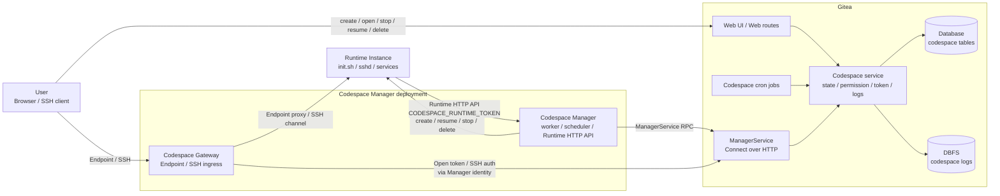
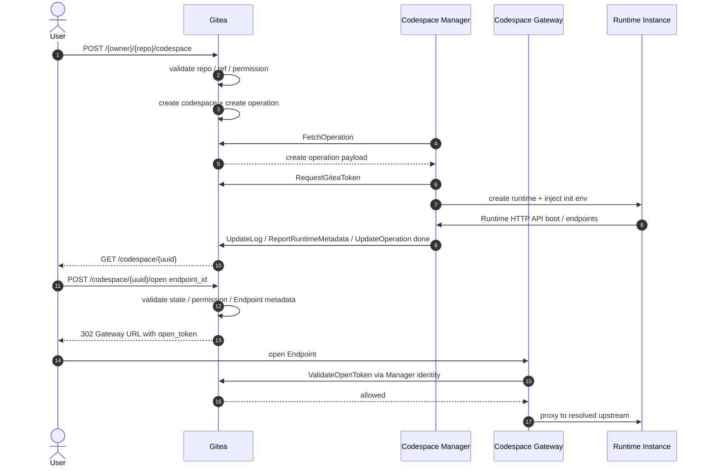

# Gitea Codespace 最终设计

## 目标

Codespace 是 Gitea 内置的远程开发环境入口。

Gitea 负责：

- repository、ref 与 commit 校验
- 用户身份与权限（复用现有 `CanRead(unit.Code)` 统一入口）
- codespace 生命周期状态
- Codespace Manager 注册与认证（参考 Actions runner 注册模式）
- Gitea access token 签发、绑定、删除保护与吊销
- Gateway Open Token 签发与校验
- SSH 认证判定
- operation 日志归档（基于 DBFS）

Codespace Manager 负责：

- Runtime Instance 创建、恢复、停止、删除
- Runtime Instance 类型、镜像、资源配置
- Runtime Token 生成与校验
- Runtime HTTP API
- Runtime Metadata 上报
- Endpoint upstream 解析与代理

Codespace Gateway 属于 Manager deployment 下的接入组件，不作为独立 Gitea 身份注册，负责：

- 用户 Endpoint 接入
- 用户 SSH 接入
- Gateway session 管理
- 通过 Manager 身份调用 Gitea 校验 Gateway Open Token 与 SSH 认证
- 到 Runtime Instance 的 SSH channel 转发

Gitea 不参与运行时选型，也不操作 Incus/Docker 等运行后端。运行时专有配置和 Runtime Token 均由 Manager 管理。

## 架构

架构约束：

**部署边界**
- Codespace 跟随 Gitea 当前部署模型；Gitea 不提供集群模式。
- Gitea 与 Manager 之间只通过 ManagerService RPC 通信。
- Manager 是运行侧唯一的 Gitea 注册身份。
- Gateway 属于 Manager deployment，不单独注册 Gitea 身份。

**数据边界**
- Gitea 只保存状态、权限、token 绑定和日志元数据。
- Gitea 不保存 Endpoint upstream。
- Incus、Docker、镜像、资源规格、网络等均为 Manager 内部实现。
- Runtime HTTP API 只在 Manager 私有网络内开放。

**流量边界**
- 用户 Endpoint / SSH 流量不经过 Gitea，直接到 Gateway。
- Gateway 用户流量仅在鉴权时回到 Gitea。
- Runtime Instance 可访问 Gitea 标准 Git HTTP 和 repository web URL，但不直接调用 codespace 专用内部接口。

**Runtime 边界**
- Runtime Instance 只通过 Runtime HTTP API 调用 Manager。
- Endpoint upstream 只由 Gateway 和 Manager 解析。

用户 Endpoint、WebSocket 和 SSH channel 是长连接流量，不适合让 Gitea Web 进程代理。Manager/Gateway 与 Runtime Instance 在同一部署内，能直接解析 upstream 和内部 SSH 连接，Gitea 保持为短路径鉴权与状态权威。

核心通信流程：

## 术语

| 术语 | 定义 |
| --- | --- |
| Codespace | Gitea 中的一条远程开发环境记录。 |
| Runtime Instance | Manager 创建的 VM、容器或工作负载。 |
| Codespace Manager | 运行侧 worker，负责注册、领取 operation、管理 Runtime Instance、上传日志、上报 Runtime Metadata。 |
| Codespace Gateway | Manager deployment 内的用户 Endpoint 与 SSH 接入组件。 |
| ManagerService | Gitea 实现、Manager 调用的 Connect RPC over HTTP 服务。 |
| Runtime HTTP API | Manager 实现、Runtime Instance 使用 Runtime Token 调用的 HTTP/JSON API。 |
| Operation | 一次异步生命周期操作，类型为 create、resume、stop、delete。 |
| Manager Matching | Gitea 按 repository tag 匹配可领取 create operation 的 Manager。 |
| Manager Capacity | Manager 最近上报的本地 create/resume 可接收能力快照，用于展示、诊断和 `FetchOperation` 准入检查。 |
| Endpoint | Runtime 声明的可打开入口，使用 `endpoint_id` 标识。 |
| Gateway Open Token | Gitea 为打开 Endpoint 签发的一次性短期 opaque token。 |
| Gitea Token | Gitea 签发给 Runtime Instance 做 git 访问的 access token。 |
| Runtime Token | Manager 签发给 Runtime Instance 调用 Runtime HTTP API 的 token。 |
| Manager Secret | Manager 调用 ManagerService RPC 的长期凭据。 |
| Runtime Metadata | Manager 上报到 Gitea 本地 cache 的动态运行时信息。 |
| Interactive Access | open Endpoint、SSH、resume。 |
| Administrative Permission | 查看最小信息、日志、stop、delete。 |
| State Finalization | Gitea 根据 operation 结果推导 codespace 主状态的服务逻辑。 |
| State Reconciliation | Gitea 后台任务处理 operation 超时、stale report、状态分歧和清理。 |
| Stale Report | Manager 上报的 `operation_uuid`、`codespace_uuid` 或 `generation` 已不匹配当前 codespace 状态的过期上报。 |
| State Divergence | Gitea 记录状态与 Manager 上报的 Runtime Instance 实际状态不一致。 |
| Manager Instruction | Gitea 返回给 Manager 的调和指令，例如 `cleanup_local_runtime`。 |

命名规则：

- codespace 创建者字段统一为 `user_id`。
- repository owner 仍为 `repository.owner_id -> user.id`。
- Endpoint 字段统一为 `endpoint_id`。
- Endpoint 唯一性范围是单个 `codespace_uuid + generation`。
- Endpoint 不是端口模型。
- 动态运行时数据统一称为 Runtime Metadata。

## 核心原则

- Gitea 只负责授权、状态、日志、token 绑定和跳转入口。
- Codespace 复用 Gitea 现有用户、组织、仓库、权限（`CanRead(unit.Code)` 统一入口）、access token（`models/auth/access_token.go`）、SSH key、TOTP、登录限制、git、Pull Request 和 Actions task claim 模型。
- 用户拥有 repository code-read 权限就可以创建 codespace。
- codespace 使用创建用户自己的 access token 访问 repository，是用户私有对象而非 repository 共享资源。
- Manager 不能用自己身份访问 repository 内容。
- Runtime git 访问使用基于创建用户当前权限签发的 Gitea access token，只走 Git HTTP(S)。
- create、resume、stop、delete 必须幂等。
- 同一 codespace 同一时刻只能有一个 active operation。
- codespace 不新增通用 notifier、通用 rate limiter 或通用 repo-scoped token。
- 不存在 retry operation。
- create 失败后不在同一个 codespace 对象上重建。create 失败后 Runtime、token、日志和 generation 可能已部分产生，不在同一对象上 retry 可避免旧状态与新初始化混淆。
- 失败是终态，除 delete 外不能恢复。
- delete 成功后物理删除 codespace、operation 和日志。
- codespace 不设计 quota。Manager 的真实并发容量由 Manager 自己控制，Gitea 不维护运行容量计数。容量管理是 Manager 本地资源管理问题。
