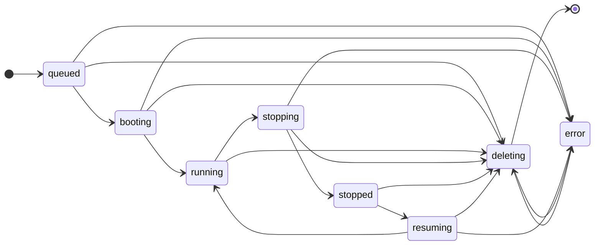

# 生命周期与状态机

## 生命周期状态

用户可见状态与存储主状态使用单轴状态图：



状态含义：

- `queued`：请求和 operation 已创建，但尚未被 Manager 通过 `FetchOperation` 成功领取。
- `booting`：首次 create 正在构建环境并执行 `init.sh`。
- `running`：Runtime Instance 正在运行，可按条件 open/SSH。
- `stopping`：正在停止 Runtime Instance。
- `stopped`：Runtime Instance 已停止，可按条件 resume。
- `resuming`：正在恢复 stopped Runtime Instance。
- `deleting`：正在删除 Runtime Instance 和 Gitea 记录。
- `error`：生命周期失败终态，用户只能 delete。

规则：

- `booting` 只能由 create 进入。
- resume 不进入 `booting`。
- `error` 不回到正常状态。
- `error` 后 delete 会创建新的 delete operation 并递增 generation，不视为 retry。
- open、SSH、resume、stop、delete、logs 是否可用，由主状态、repo 状态、用户状态、Manager 在线状态和 Runtime Metadata 共同决定。

## Operation 状态

Operation status 统一为：

```text
queued
running
done
failed
```

含义：

- `queued`：operation 已创建，但尚未被任何 Manager 通过 `FetchOperation` 成功领取。
- `running`：已被 Manager claim，lease 有效或可续租。
- `done`：Manager 上报成功，且 Gitea 已完成 State Finalization。
- `failed`：Manager 上报失败或 Gitea 判定超时失败，且 Gitea 已完成 State Finalization。

不使用 `leased`、`succeeded`、`cancelled`、`attempts`、`max_attempts`、`retry`。

## State Finalization

Codespace 主状态只能由 Gitea State Finalization 写入。

`UpdateOperation` 只记录 operation 事实并触发 State Finalization。Manager 永远不能直接覆盖 codespace 主状态。

State Finalization 在同一事务内执行：

1. 读取 codespace 和 operation。
2. 校验 `active_operation_id`。
3. 校验 `generation`。
4. 校验当前状态转移合法。
5. 应用 operation 终态结果。
6. 更新 codespace 主状态。
7. 更新 token 状态。
8. 写入 `stopped_unix`、`status_message`、`gitea_token_id` 等主状态字段。
9. 清空 `active_operation_id`。

`active_operation_id` 含义：

- `active_operation_id` 只表示当前未完成 lifecycle operation。
- lifecycle operation 处于 `queued|running` 时，`active_operation_id` 指向该 operation。
- lifecycle operation 进入 `done|failed` 并完成 State Finalization 后，`active_operation_id` 清空。
- 创建新的 stop、resume 或 delete operation 时，`active_operation_id` 写入新 operation。
- 日志展示通过历史 operation 记录查询，不依赖 `active_operation_id` 保留。
- delete done 后物理删除 codespace、operation 和日志。

状态推进：

```text
create done:   booting -> running
create failed: queued|booting -> error
resume done:   resuming -> running
resume failed: resuming -> error
stop done:     stopping -> stopped
stop failed:   stopping -> error
delete done:   deleting -> physical delete
delete failed: deleting -> error
```

超时：

- queue timeout：`queued -> error`
- boot timeout：`booting -> error`
- resume timeout：`resuming -> error`
- stop timeout：`stopping -> error`
- delete timeout：`deleting -> error`

进入 `stopping`、`deleting`、`error` 的同一事务里吊销 active Gitea Token。

## State Reconciliation

`reconcile_codespace_operations` 周期运行。

职责：

- 检查中间态。
- 检查 active operation deadline。
- 检查 Manager offline timeout。
- 将超时 operation 标记为 failed。
- 通过 State Finalization 进入 `error`。
- 吊销失效 Gitea Token。
- 写入 `status_message`。
- 处理 stale Runtime Metadata 与 ReportInstances 分歧。

规则：

- Gitea 是状态权威。
- Manager 观测事实不能恢复 Gitea 主状态。
- Gitea 当前为 `error` 而 Manager 报告 runtime 仍存在时，Gitea 记录分歧并返回 cleanup 指令。
- Gitea 已物理删除 codespace 而 Manager 继续上报时，Gitea 返回 `NotFound + cleanup_local_runtime`。
- Manager 声称 runtime 不存在而 Gitea 认为 running 时，Gitea 进入 `error` 并吊销 token。
- Gitea 认为 deleting 时，任何非 delete 上报都不能改变状态。

## 删除与外部状态变化

Repository archived、migrating、pending transfer、broken、deleted、git 不可读或 ref 不可解析时：

- 不允许 create。
- 不允许 resume。
- 不允许新的 open。
- 不允许新的 SSH。
- 仍按 Administrative Permission 允许 logs、stop、delete。

Repository 删除：

- repository 删除不会因为 Manager 分组被阻止；不存在 repository 级 Manager。
- repository 删除确认 UI 提示会清理或影响的 codespace 数量。
- repository 删除成功页或确认摘要展示受影响的 codespace 数量。
- repository 删除在 `repo_service.DeleteRepository` / `DeleteRepositoryDirectly` 删除 DB repository 记录前执行 codespace pre-cleanup。
- 对引用该 repository 的关联 codespace，repository 删除事务内：
  - 吊销 Gitea Token。
  - 不允许 open/SSH/resume。
  - 写入 `status_message=source repository deleted; cleanup required`。
  - codespace 已绑定 Manager 且 Manager 记录存在时创建 delete operation 并进入 `deleting`。
  - codespace 从未绑定 Manager 或 Manager 记录不存在时进入 `error`。
- disabled Manager 也允许领取已绑定给自己的 delete operation。
- Manager offline 时，只要 Manager 记录仍存在，仍创建 delete operation 并进入 `deleting`，等待 Manager 回来领取。
- delete timeout 后进入 `error`。
- repository 删除事务创建的 delete operation 不依赖 repository row 生成 payload。
- repository DB 记录删除后，Manager 仍能通过 `codespace_uuid + generation` 领取 delete operation 并完成 Runtime cleanup。
- source repository 删除后，相关 codespace 列表和详情页显示 `source repository deleted`。
- repository 删除不发送站点通知。

Owner/user/org 删除：

- owner 删除前，Gitea 现有流程先处理该 owner 下 repositories。
- 删除该 owner 下 repository 时按 repository 删除规则处理。
- Manager 和 registration secret 不属于 owner 或 organization，owner/org 删除不删除 Manager 或 registration secret。
- owner/org 删除不向 Manager 下发 delete RPC，不依赖 Manager 在线。
- 某用户只是其他组织仓库 codespace 创建者时，不阻止组织存在。
- 创建用户删除后吊销 token，并不允许 open/SSH/resume。
- 组织管理员可清理组织仓库下的相关 codespace。

Manager 删除：

- 普通管理操作只允许禁用 Manager。
- 物理删除 Manager 记录前确认没有未删除 codespace 引用该 Manager。
- 物理删除 Manager 记录前确认没有 active operation 绑定该 Manager。
- 禁用 Manager 与 codespace 生命周期状态更新不在同一事务里批量改写；后续 open/SSH/resume/claim 根据 Manager disabled 状态实时拒绝。
- 物理删除 Manager 是管理清理动作，不负责 Runtime Instance 清理。
- 物理删除 Manager 只注销 Gitea 注册身份，不向 Manager 下发删除指令。
- Manager 记录被物理删除后，后续 ManagerService RPC 按 unregistered manager 返回 unauthenticated。
- Runtime cleanup 通过 codespace delete operation 实现，不能由删除 Manager 记录隐式触发。
- 物理删除 Manager 前先清理引用它的 codespaces 和未完成 operations。

重命名：

- ID 是权威关联。
- 名称每次展示时解析。
- `ssh_user` 创建后不随重命名变化。
- create/resume operation payload 使用当时当前名称重新生成 clone/web URL。
- 显示缓存和 runtime 动态数据不持久化到数据库。
