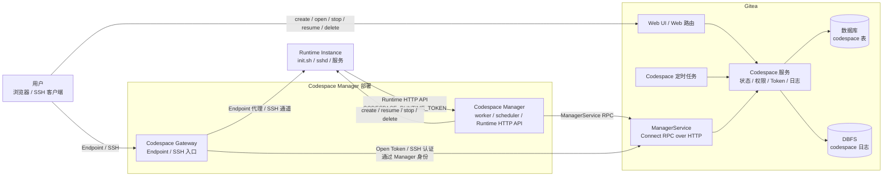
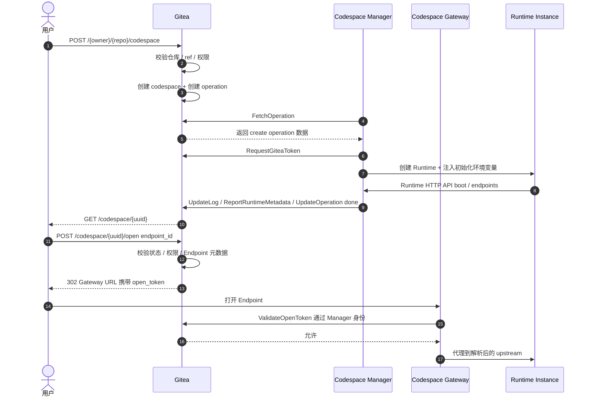

# Gitea Codespace 最终设计

## 目标

Codespace 是 Gitea 内置的远程开发环境入口。

| 主体 | 职责 |
| --- | --- |
| Gitea | repository、ref 与 commit 校验；用户身份与权限（复用 `CanRead(unit.Code)` 统一入口）；codespace 生命周期状态；Codespace Manager 注册与认证（参考 Actions runner 注册模式）；Gitea access token 签发、绑定、删除保护与吊销；Gateway Open Token 签发与校验；SSH 认证判定；operation 日志存储与读取（基于 DBFS） |
| Codespace Manager | Runtime Instance 创建、恢复、停止、删除；Runtime Instance 类型、镜像、资源配置；Runtime Token 生成与校验；Runtime HTTP API；Runtime Metadata 上报；Endpoint upstream 解析与代理 |
| Codespace Gateway（Manager deployment 内组件） | 用户 Endpoint 接入；用户 SSH 接入；Gateway session 管理；通过 Manager 身份调用 Gitea 校验 Gateway Open Token 与 SSH 认证；到 Runtime Instance 的 SSH channel 转发 |

Gitea 管理生命周期和权限闭环，运行时选型和后端（Incus/Docker 等）由 Manager 独立管理。运行时专有配置和 Runtime Token 均由 Manager 维护。

## 架构

架构约束：

**部署边界**
- Codespace 部署模型为 Gitea 单实例。
- Gitea 与 Manager 之间只通过 ManagerService RPC 通信。
- Manager 是运行侧唯一的 Gitea 注册身份。
- Gateway 是 Manager deployment 内部组件，通过 Manager 身份调用 Gitea。

**数据边界**
- Gitea 只保存状态、权限、token 绑定和日志元数据。
- Incus、Docker、镜像、资源规格、网络等均为 Manager 内部实现。
- Runtime HTTP API 只在 Manager 私有网络内开放。

**流量边界**
- 用户 Endpoint / SSH 流量不经过 Gitea，直接到 Gateway。
- Gateway 用户流量仅在鉴权时回到 Gitea。
- Runtime Instance 可访问 Gitea 标准 Git HTTP 和 repository web URL，但不直接调用 codespace 专用内部接口。

**Runtime 边界**
- Runtime Instance 只通过 Runtime HTTP API 调用 Manager。
- Endpoint upstream 只由 Gateway 和 Manager 解析。

用户 Endpoint、WebSocket 和 SSH channel 是长连接流量，不适合让 Gitea Web 进程代理。Manager/Gateway 与 Runtime Instance 在同一部署内，能直接解析 upstream 和内部 SSH 连接，Gitea 保持为短路径鉴权与状态权威。

核心通信流程：

## 术语

参见[术语页](glossary.md) 获取完整术语表和命名规则。

## 核心原则

- Gitea 只负责授权、状态、日志、token 绑定和跳转入口。
- Codespace 复用 Gitea 现有用户、组织、仓库、权限（`CanRead(unit.Code)` 统一入口）、access token（`models/auth/access_token.go`）、SSH key、登录限制、git、Pull Request 和 Actions task claim 模型。
- create、open、SSH、resume、stop、delete 和 logs 使用 Gitea 服务层统一权限判定入口。统一入口让 Web、RPC 和 Gateway 对同一用户状态、repository 状态与 Manager 状态得到一致结论，避免 handler 各自拼接权限条件。
- 用户拥有 repository code-read 权限就可以创建 codespace。
- codespace 使用创建用户自己的 access token 访问 repository，是用户私有对象而非 repository 共享资源。
- Manager 使用 codespace 身份访问 repository，不直接使用自己身份。
- Runtime git 访问使用基于创建用户当前权限签发的 Gitea access token，只走 Git HTTP(S)。
- codespace-bound token 继续使用 Gitea access token 和 `write:repository` scope，并通过 repo binding 判定限制到创建时绑定的 repository。这样保留 Gitea 现有 token 体系，同时补足通用 scope 不能表达单仓库边界的问题。
- create、resume、stop、delete 必须幂等。
- 同一 codespace 同一时刻只能有一个 active operation。
- codespace 复用 Gitea 现有 notifier、rate limiter 和 access token 模型。
- create 失败后在同一 codespace 对象上进入 `error`，由用户决定 delete 后重新创建。失败时 Runtime、token 和日志可能已部分产生，仅允许 delete 操作保证状态一致。
- 失败为终态，通过 delete 退出。
- delete 成功后物理删除 codespace、operation 和日志。
- Manager 的并发容量由 Manager 自行控制并以 `capacity_available` 上报，Gitea 不维护运行容量计数。
- Manager 使用本地 operation worker pool 执行已 claim 的 operation，create/resume 使用容量槽位，stop/delete 使用独立 cleanup 队列。这样资源创建与资源回收互不阻塞，Manager 满载时仍能推进清理。
- Runtime Instance name 由 `codespace_uuid` 确定性派生。这样 create、resume、delete 和本地清理都能找到同一个运行实例，便于幂等执行。
- Gitea 重启和 Manager 重启按日常维护事件处理。重启不直接改变 codespace 主状态，交互入口可以临时返回 rebuilding/recovering 分类，恢复窗口结束且没有恢复证据时才由 reconciliation 推进到 `error`。这样可以区分正常维护和真实生命周期失败。
- Gateway Endpoint 第一版支持 HTTP reverse proxy 和 WebSocket upgrade，SSH 使用独立接入面。这样覆盖 Web IDE 和端口预览主场景，同时减少任意 TCP tunnel 带来的鉴权、审计和资源复杂度。
- Gateway session 使用 TTL、idle timeout 和周期 revalidate。这样既控制长连接资源占用，也让权限变化在可预期时间内收敛。
- SSH 认证限流与退避由 Gateway 按 source IP、codespace、source IP + codespace 和 public key fingerprint 多维度执行。这样可以降低暴力破解风险，并减少单一维度限流的误伤。
- Gateway access log 使用结构化 JSON line，并记录模板、hash 和失败分类，不记录 token、cookie、query string 或完整 user agent。这样满足运维审计和排障，同时降低敏感信息泄漏风险。
- repository 删除后 codespace 与 repository 不再保持强关联，Gitea 在删除事务中吊销 token、置空 repository 关联字段并保留来源已删除状态。这样用户能明确看到来源仓库已删除，Runtime 清理仍通过 `codespace.uuid` 和已绑定 Manager 完成，不依赖已经不存在的 repository row。
- codespace 日志第一版存储在 DBFS，使用 byte offset 追加和读取。DBFS 已适合运行中日志 seek/read/write，先不引入对象存储归档可以减少日志 transfer 状态对生命周期状态机的影响。
- 测试按 models、services、RPC routes、Web routes 和 integration 分层组织。这样可以分别覆盖数据模型、状态事务、权限/token 边界和跨层生命周期流程，避免 Manager backend 细节污染 Gitea 状态权威测试。
