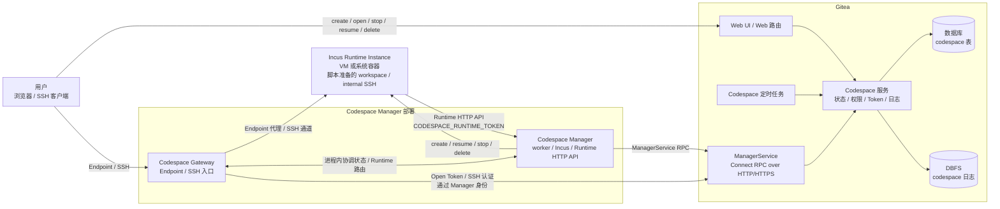
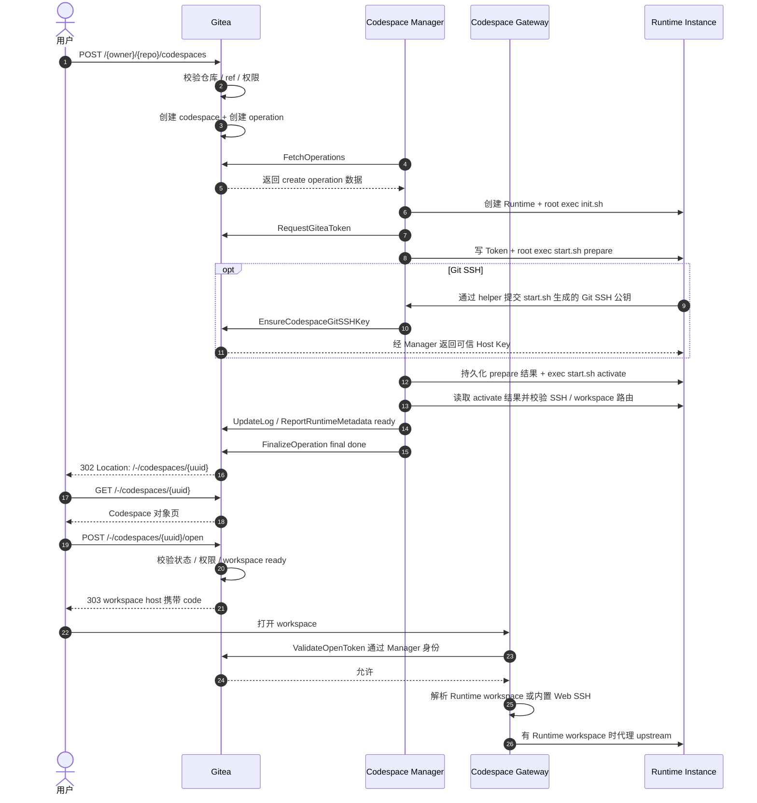

# Gitea Codespace 最终设计

## 目标

Codespace 是 Gitea 内置的远程开发环境入口。

| 主体 | 职责 |
| --- | --- |
| Gitea | repository、ref 与 commit 校验；用户身份与权限（复用 `CanRead(unit.Code)` 统一入口）；Codespace 生命周期状态；Codespace Manager 注册与认证（参考 Actions runner 注册模式）；独立 Codespace Gitea Token 和 Git SSH 公钥绑定；Gateway Open Token、公共 Endpoint 与已有 session 校验；用户工作区 SSH 与 Git SSH 认证判定；operation 日志存储与读取（基于 DBFS） |
| Codespace Manager | 通过 Incus 创建、恢复、停止、删除 Runtime Instance；把 repository tag 映射为本地实例模板；执行可替换的本地初始化脚本；周期验证 running Codespace 的基础交互能力；管理 Runtime Token、Runtime HTTP API、Runtime Metadata、Endpoint upstream 和通信地址 |
| Codespace Gateway（Manager `serve` 进程内组件） | 需要认证与公共 Endpoint 接入；用户 SSH 接入；Gateway session 和公共连接管理；通过 Manager 身份调用 Gitea 完成访问校验；到 Runtime Instance 的 HTTP/WebSocket 与 SSH channel 转发 |

本文承担整体边界和阅读导航。生命周期转换以[状态机](state-machine.md)为完整定义，持久字段以[数据模型](data-model.md)为完整定义，通信字段与校验以[RPC 协议](rpc-spec.md)为完整定义，运行编排与恢复分别以[生命周期流程](lifecycle-flows.md)和[维护与恢复](maintenance-recovery.md)为完整定义，脚本输入、输出和默认行为以[脚本契约与内置实现](builtin-scripts.md)为完整定义；Gitea 与 Manager/Gateway 文档负责把这些规则落实到各自组件。总览和术语表保留跨组件规则的简要说明，组件章节会保留实现该组件所需的输入、结果和验收点。维护同一规则时先修改承担完整定义的专题文档，再同步相关摘要和组件行为，使每条规则有唯一的完整定义，同时让读者在当前章节取得足够的实现条件。

Gitea 管理生命周期、权限判断、Codespace Token 和 Git SSH 公钥绑定。Manager 只使用 Incus 管理运行环境，并在本地决定 tag 对应的是虚拟机还是系统容器；运行时专有配置和 Runtime Token 由 Manager 维护，Git SSH 私钥由 Runtime 保存。这样 Gitea 的状态机和协议不随实例类型变化，同时运行侧只有一套可实现、可测试的资源生命周期。

实现验收点：

- Gitea、Manager、Gateway 和 Runtime Instance 的接口只能访问本章分配给自己的数据与职责。
- Gitea Codespace 数据表和状态枚举不包含 Incus 实例类型、镜像或设备字段；虚拟机与系统容器使用同一套 Gitea 生命周期。

## 架构

架构规则：

**部署边界**
- Codespace 按单个活动 Gitea 进程部署。短期数据直接复用 Gitea 已配置的缓存，能否跨重启保留由缓存实现和 TTL 决定；需要按对象串行执行的写路径直接调用 Gitea `globallock.Lock`。Redis 作为缓存或全局锁后端时仍服务于这一部署模型，因为 Codespace 的调度与定时任务均由该活动进程执行。
- 每个已注册 `manager_id` 在受支持部署中对应一个 `gitea-codespace serve` 进程。该进程同时运行 Manager worker、Runtime HTTP API、Gateway HTTP/WebSocket 和 Gateway SSH listener，并在内存中统一维护 operation worker、generation、Incus 实例映射、Endpoint 路由、session 索引和 Codespace 协调状态。Manager 通过本地状态目录独占锁保证同一目录只有一个进程启动；部署时为每个并行进程注册独立身份和状态目录。
- Gitea 与 Manager 之间只通过 ManagerService RPC 通信。
- Manager 是运行侧在 Gitea 中注册的身份。
- Gateway 是同一 `serve` 进程中的用户接入组件，通过进程内调用读取 Manager 的路由和准入状态，并通过 Manager 身份调用 Gitea；Manager 与 Gateway 之间不需要独立通信协议。

**数据边界**
- Gitea 保存生命周期状态、固化 Git 首选协议、独立 Codespace Token、Git SSH 公钥绑定、Manager 最新状态报告版本和 Codespace 日志；Git SSH 私钥只保存在 Runtime。Manager 保存已经初始化的绝对 workspace 路径、实际 remote、规范共享环境、当前 operation 使用的脚本摘要、Incus 实例、模板快照、镜像、资源规格和网络选择。
- 一个 Codespace 对应一个 Incus 实例；workspace 与用户修改保存在该实例的根存储中，实例停止后继续保留，删除实例时一并删除。
- Runtime HTTP API 只在 Manager 私有网络内开放。

**流量边界**
- 用户 Endpoint / SSH 流量不经过 Gitea，直接到 Gateway。
- Gateway 用户流量仅在鉴权时回到 Gitea。
- Runtime Instance 按 Codespace 固化的首选顺序访问 Gitea 标准 Git HTTP(S) 或 SSH，并把成功地址固定为 workspace remote；Codespace 专用动态调用只发给 Manager Runtime HTTP API。

**Runtime 边界**
- Manager 通过 Incus file/exec API 初始化 Runtime；Runtime 只通过受控 helper 调用 Manager Runtime HTTP API 的 Git SSH Key 和 Endpoint 接口。
- Endpoint upstream 只由 Gateway 和 Manager 解析。
- Manager 核心只执行 init、prepare、activate 的通用脚本契约；完整内置套件和完整本地自定义套件使用相同输入、共享环境、结果与 ready 校验。具体契约和默认实现见[脚本契约与内置实现](builtin-scripts.md)。

用户 Endpoint HTTP、WebSocket 和 SSH 流量由 Manager/Gateway 在与 Runtime Instance 同一部署内直接解析 upstream 和内部 SSH 连接；Gitea 只处理鉴权和状态写入。WebSocket 与 SSH 是持续连接，普通 HTTP 按请求转发。

核心通信流程：

实现验收点：

- 用户 Endpoint/SSH 数据流不经过 Gitea，鉴权请求通过 ManagerService 到达 Gitea。
- Runtime HTTP API 只在 Manager 私网开放，并同时校验 Runtime Token 和来源绑定。
- Gateway 不把 open code、Gitea token、Manager Secret 或 Runtime Token 转发给 Runtime。

## 术语

参见[术语页](glossary.md) 获取完整术语表和命名规则。

实现验收点：

- Web、RPC、数据库和文档使用术语页定义的同一组名称。

## 核心原则

- Gitea 只负责授权、状态、日志、Codespace Token、Git SSH 公钥绑定和跳转入口。
- Codespace 复用 Gitea 现有用户、组织、仓库、权限（`CanRead(unit.Code)` 统一入口）、Token hash/Secret 工具、SSH key、登录限制、git、Pull Request 和 Actions task 领取模型；Codespace Token 使用独立表，不复用普通 PAT 行。
- create、认证打开、SSH、resume、stop、delete 和 logs 使用 Gitea 服务层统一用户权限判定入口。公共 Endpoint 使用独立的当前状态校验，不要求用户身份。两类入口都复用 Codespace、Manager 和 Runtime Metadata 的服务层判定，避免 handler 各自拼接生命周期条件。
- 用户登录后，满足 Gitea 登录限制（`is_active`、`prohibit_login`、`must_change_password`、站点强制 2FA）且拥有 repository code-read 权限，就可在许可的仓库状态下创建 codespace。
- repository 状态只参与 create 阶段的来源校验。create operation 完成、workspace 已初始化后，Codespace 按自身状态继续运行；repository 删除、归档、迁移、ref 移动或创建用户权限变化，只影响后续 Git HTTP(S)/SSH、LFS 和 repository API 的具体结果，每个请求仍由 Gitea 当前 repository、unit、分支保护和用户权限判定，不反向改变 Codespace 生命周期。
- Codespace Token 代表创建用户访问 repository，Codespace 是用户私有对象而非 repository 共享资源。
- Manager 使用 codespace 身份访问 repository，不直接使用自己身份。
- Runtime 始终使用代表创建用户的 Codespace Gitea Token 调用开发协作 API；HTTP(S) remote 同时用它完成 Git smart HTTP，SSH remote 使用工作环境生成、只绑定当前 Codespace 仓库的专用 Key。两种 Git 入口都继续执行 Gitea 当前用户、repository、unit、分支保护和权限检查。
- Git 首选协议在 Codespace 创建时按站点默认值固化。create 脚本同时得到 HTTP(S) 和 SSH clone URL，并选择实际 remote；内置脚本在带当前 UUID 标记的临时 workspace 中先尝试首选入口，clone/fetch 非零退出时清理该目录并用另一入口重试一次。Manager 校验 HEAD、最终 workspace 和实际 remote 的本地凭据配置。已有 Codespace 的 resume 只配置实际 remote 的本地凭据，站点默认值变化只影响新建对象。
- Git SSH Key 使用 `KeyTypeCodespace` 和一对一关系表；鉴权成功后以创建者为真实用户且 `DeployKeyID=0`。普通用户 Key、Deploy Key 和 Gateway 用户 SSH Key 保持各自范围和生命周期。
- Git、LFS 和按具体 method/route 标记的开发 API 在副作用前由 resolver 通过一次查询读取独立 Token 行、Codespace 工作状态、唯一 `repo_id` binding 和创建用户当前登录限制；仓库控制权、长期凭据、用户/组织/站点管理、Package 和其他 repository 请求保持拒绝。
- **设计选择：Token 行的持久生命周期与单次请求授权分别判定。** Token 行随有效 create/resume 初始化期或 `running` 保留，并在这三个阶段直接用于绑定仓库的 Git/LFS/API；稳定 `stopped` 没有 Token。resume final failed/timeout、stop final、`failed`、`deleting` 或物理删除会物理删除 Token 行。active stop 创建前已有的 Token 可以继续使用，但 Manager 不能重新请求明文。站点排空或用户登录限制成立时，新请求分别返回状态不可用或登录受限；条件恢复且 Codespace 仍处于允许阶段时，同一 Token 可继续使用。repository 删除后 `repo_id` 写为 0，Token 仍可签发和保存，但 repository 请求均因没有匹配的绑定仓库而拒绝。
- 同一 `operation_rversion` 的 create、resume、stop、delete 在 Manager 执行、日志重放和 final 重试层面必须幂等；普通 Web POST 只按请求到达时的当前资源状态处理，不承诺没有请求键或 tombstone 支撑的网络级幂等。
- 同一 codespace 同一时刻只能有一个 active operation。
- active operation 完成后清空 operation 字段，不保留 operation 历史；失败诊断通过 codespace 日志读取。
- Manager 可通过 `ReportRuntimeTransition` 上报本地主动 stopped/failed 状态；failed 用于单 Codespace 已确认不可恢复且当前没有 active operation 的情况，不增加新的持久主状态。
- stopped Runtime 只通过 Gitea 下发的 resume operation 恢复；Manager 在该 operation 内先运行 init 取得凭据身份，再申请并写入新 Gitea Token 和 Runtime Token，随后运行 resume prepare/activate。Manager 按 workspace 实际 remote 配置 HTTP helper 或确认已有 Git SSH Key，上报当前版本 ready 后才能 final done 进入 running。ready 不探测 repository 可达性；repository 删除后已有 workspace 仍可恢复，后续 Git/API 请求按当前 binding 和权限返回结果。面向用户的 open 和 Gateway SSH 等待 running。
- Runtime inventory 差异只在 `ReportInstances` 请求内计算；Cron 不保存或重放 inventory，只处理数据库可判断的 operation 超时、Manager 可用性和 failed retention。Token 创建与删除由签发和生命周期事务完成，不增加周期修复路径。
- failed 保留期到期后由 Gitea 直接物理删除记录、Codespace Token、Git SSH Key 和日志，提交并释放 Codespace lock 后尽力清理 cache；Cron 不创建 Manager operation 或等待远端确认，原 Manager 身份仍有效时由后续成功的完整 inventory 对无记录 UUID 返回 `cleanup_local_runtime`。
- Codespace Token 使用 `gcs_` 专用前缀和独立表；Web/API 认证入口先识别该前缀并进入 Codespace 专用认证分支。该分支验证失败时直接返回认证失败，普通密码、PAT、Session 或 Reverse Proxy 认证不再处理该凭据。resolver 通过一次候选查询验证 Token，并生成包含 Codespace、创建用户、仓库绑定和登录限制的请求内认证数据；后续权限检查复用这份数据。API 路由注册处按具体 method/route 标记开发操作。**设计理由：Codespace Token 是绑定仓库的开发凭据。**它支持 commit、Issue、Pull Request、Release、Wiki 和受限 Actions 操作；仓库删除、权限、Hook、Deploy Key、Actions Secret/Runner 等管理操作统一返回 403。直接 API 路由目标必须是绑定 repository，进入绑定 Issue/PR 后，由 Gitea 已有的 fork、commit、dependency、project 关系触发的关联写入继续按创建用户当前权限处理。新增 API route 只有明确标记为开发操作后才接受 Codespace Token。通知使用 Gitea 现有机制；SSH 认证限流由 Gateway 执行，Manager RPC 通过认证、双向消息大小和控制面超时限制资源使用。
- repository/ref/commit/config 前置校验失败直接返回创建错误，不产生残缺对象；来源数据完整但 Manager 不匹配或进入队列后的 create 失败，在同一 codespace 对象上进入 `failed`，由用户决定 delete 后重新创建。
- 失败为终态，通过 delete 退出。
- delete 成功后物理删除 Codespace、Codespace Token、Git SSH Key 和日志。
- Manager 的并发容量由 Manager 自行控制；Fetch 分别以 `capacity_available` 和 `cleanup_capacity_available` 表达可立即承接的启动与清理任务数量，Gitea 不维护本地 worker 占用计数。
- Manager 可修改名称、版本、tags、容量、Gateway/SSH 地址和 host key，并通过完整 Declare 快照覆盖 Gitea 当前展示与匹配数据；Declare 响应同时下发服务端选定的心跳周期、Runtime Metadata 刷新周期、双向消息上限和 Gitea 浏览器根 URL。Gitea 不保存声明历史，已有 Codespace binding 不随声明变化迁移。
- Manager 使用独立的启动和清理 worker pool；create/resume 使用启动槽位，stop/delete 和持久化本地缩减动作使用清理槽位。Fetch 发出前预留声明的槽位，两个池满载时仍为已有 operation 续租。
- Runtime Instance name 由 `codespace_uuid` 确定性派生，确保 create、resume、delete 和本地清理都能定位同一个实例。
- Gitea 重启和 Manager 重启按日常维护事件处理。重启不改变 codespace 主状态、active operation 或 Gitea deadline，交互入口可以临时返回 metadata_rebuilding/recovering 分类；Manager 的 exec launcher 以当前 lease pulse 限制进程组，重启后先终止遗留 launcher、停止 active create/resume 实例并恢复 `lease_paused`。本地上下文完整的 operation 只有成功 Fetch 续租并取得新的相对有效时长后才重新启动并继续，之后的 inventory 按正常当前状态差异处理。
- Manager 周期使用当前 `internal_ssh` 严格认证并执行固定无副作用命令，确认 stable running Codespace 的基础交互能力。每轮开始时固定符合条件的 UUID 集合，全部仍符合条件的对象取得首次结果后统一判断共享故障；未达到共享条件时，连续 3 次失败的对象停止 Incus 实例、保留根存储并通过现有 stopped 状态报告收敛。检查不访问 repository、用户进程或普通 Endpoint，也不增加脚本入口和 Gitea 状态。
- Manager 的 Declare、Fetch/lease、inventory、健康调度和必要 listener 由进程级监督器统一管理；关键循环意外结束时整体关闭准入并退出。正常进程关闭在固定期限内暂停启动 worker、保存本地状态并关闭连接，后续继续使用现有 lease、快照和 inventory 恢复。
- Gateway Endpoint 支持 HTTP 反向代理和 WebSocket 升级，SSH 使用独立接入面，覆盖 Web IDE、端口预览和 SSH 工作流。需要认证的 Endpoint 使用 Open Code 与 Gateway session；缺少本地 session 的顶层 HTML GET 经 Gitea 登录确认后回到原路径，其他请求返回 401。反向代理把可解析的应用 `Set-Cookie` 强制重建为当前 Endpoint 的仅限当前主机 Cookie；认证请求按方法、Origin 和 Fetch Metadata 的固定表判定来源，Endpoint host 拒绝 Service Worker 注册。普通 Endpoint 可以通过 `public` 明确声明公共访问，由 Gateway 本地路由和 Gitea 当前状态双重校验后匿名访问，其跨源读取由 Runtime 应用返回的 CORS 头决定。**设计如此：HTTP 响应 Cookie 会被收窄，但页面脚本仍可在非公共后缀父域写入普通应用 Cookie；平台 session 依靠 HTTPS `__Host-` Cookie 和服务端 Host/binding 校验保持独立。**
- 默认 open 始终绑定逻辑 Endpoint `workspace`。Runtime 声明同名 Endpoint 时 Manager 使用其 upstream；未声明时由 Manager 内置 Web SSH 管理器使用当前 `internal_ssh`、固定内部 client key 和严格 host key 校验建立 PTY 登录 shell。Gitea 只授权稳定的 `endpoint_id=workspace`，Manager 负责解析当前实际目标。
- Gateway URL 使用 `{uuid32}.{gateway_domain}` 表示 workspace，使用 `{endpoint_id}-{uuid32}.{gateway_domain}` 表示普通 Endpoint。所有入口位于同一层 wildcard DNS/TLS 域下，既保持每个入口独立来源，又避免为每个 Codespace 单独签发证书。该基础域名专用于用户工作区内容；Gitea 启动和 Declare 都要求派生 Endpoint 与 Gitea 登录地址处于不同可注册域，并拒绝 Gateway 域覆盖 Gitea host、wildcard 路由或 `[session].DOMAIN`。
- 每个 Manager 的规范化 Gateway URL 和 SSH 地址写入独立地址表，并由数据库唯一约束拒绝冲突，避免不包含 `manager_id` 的 Endpoint host 或 SSH 入口被路由到错误 deployment。
- Gateway session 使用 TTL、idle timeout 和持续授权复检：普通 HTTP 在每次请求转发前检查本地状态和最多 1 秒的新鲜 Gitea allowed，相同键的并发 miss 合并并受全进程校验 RPC 上限约束；WebSocket/SSH 按定时器检查。Open Code 交换先建立最长 30 秒的 `connecting` session，浏览器首次无 code 请求将其激活；同一浏览器重复 Open 时只原子替换请求 cookie 指向的同 Host、同 binding 旧 session，其他浏览器不受影响。
- 自动暂停由 Manager/Gateway 根据已认证 HTTP、WebSocket、IDE 和 SSH live session 及本地单调时钟判断；running/ready、设置启用、没有 worker 且 session 为 0 时开始 Codespace 级计时，覆盖首次 ready、最后一个 session 关闭和重新启用。公共 Endpoint 流量不代表创建者交互，不进入该计数。达到有效超时后，Manager 调用 Gitea，由 Gitea 使用当前启用值、有效超时、交互版本和 active operation 创建普通 stop。暂停完成仍是 `stopped`，用户通过普通 resume 恢复；`default/custom/never` 为每个 Codespace 提供站点默认、自定义或关闭空闲暂停的明确设置。延迟快照最多影响本地计时，不能绕过 Gitea 当前值复检。
- Gateway 已有 session 通过 `RevalidateGatewaySession` 复检，不重复消费一次性 open code；拒绝、超时或通信失败时关闭 session，待转发的 HTTP 请求不进入 upstream。
- 公共 Endpoint 的普通 HTTP 请求检查本地状态和最多 1 秒的新鲜 `ValidatePublicEndpoint` allowed，持续连接按固定周期复检；不建立用户 session、不注入用户 ID、不更新交互或活跃时间，并使用独立的 per-Endpoint/per-IP 并发上限。**设计如此：持有 Runtime Token 的工作环境进程是 Endpoint 声明主体，`public=true` 不要求 Gitea 页面再次确认；repository 可见性、删除和用户权限也不改变已经声明的值。**
- SSH 认证限流与退避由 Gateway 按 source IP、codespace、source IP + codespace 和 public key hash 多维度执行，降低暴力破解风险并减少单一维度限流的误伤。
- Manager/Gateway 只在本地结构化诊断日志中记录鉴权拒绝、限流、连接和恢复失败，不建立成功连接访问审计；用户 open、SSH、继续运行和 resume 推进用于空闲请求竞态的 `interaction_generation`，`last_active_unix` 仍只作为尽力更新的展示时间，写入失败不阻断访问。
- repository 删除后 codespace 与 repository 不再保持强关联，Gitea 在删除事务中把 `repo_id` 写为 0，但不因 repository 删除单独改写主状态。`repo_id=0` 是来源 repository 已不可解析的机器状态；open、SSH、resume、stop、delete 和 logs 继续按 codespace 自身权限与状态判定，不依赖已经不存在的 repository row。
- 会影响账户删除判定的关系写入统一使用 `owner_write_{owner_id}`：全部 repository 创建/转移/删除、package/version 写入、组织与 team 成员写入、Codespace 创建、Manager 注册和 registration token 变更都在锁内事务中复读 owner。多个 owner ID 去重升序取得，后续锁层级固定为 repository、Manager、Codespace。
- repository 创建在 owner 写锁内提交可见关系，并在释放 owner 前把保护接续给新 repository lock，再执行耗时初始化；`CreateCodespace` 记录插入、repository 删除和 transfer 使用相同 repository key。只有实际修改 `owner_id` 的 transfer 同时取得原/新 owner 写锁，transfer 后 repository 关系跟随新 owner。
- 用户或组织删除时，在任何 owner repository 删除前按 keyset 分批、逐 Codespace 短事务清理当前仍通过创建者、repository 或 Manager owner 关系关联的 Codespace、Codespace Token、Git SSH Key 和日志，并清理目标 owner 自有的 Manager、地址与 registration token。用户 purge 在组织成员和 package 阶段释放用户 owner 写锁，最终重新取得并复扫全部删除判定关系；管理员删除用户与自助删除调用同一服务。此前已单独删除 repository 的 `repo_id=0` Codespace 不再保留原 repository owner 关系。
- Manager 删除时，持续持有 owner 和 Manager lock，按 UUID keyset 分批、逐 Codespace 短事务清理 binding、Codespace Token、Git SSH Key 和日志，空集合复检后删除 Manager 地址与 Manager；online、offline 和 recovering 都使用相同路径，不联系 Manager。
- **设计选择：Owner/Manager 删除对调用方同步完成，内部按有界批次和可重试短事务清理 Gitea 本地资源。**Owner 删除在全部删除判定关系与 Codespace 关联资源清空后返回成功，Manager 删除在绑定 Codespace 与地址清空后返回成功；数据库步骤失败时保留父记录，已经提交的子项保持删除，重试继续处理剩余项。账户清理绑定到其他 owner 或 `owner_id=0` Manager 的 Codespace 时只取得 Codespace lock，并由数据库复检保证旧 RPC 不能重建记录；全局 Manager、地址、registration token 及其无关 Codespace 保持有效。全局或其他仍有效 Manager 在后续完整 inventory 中清理无记录 UUID；随 owner 删除而失效的 Manager 无法继续认证，其运行资源由部署运维处理。账户删除结果因此不依赖运行侧当前可用性。
- Codespace 日志存储在 DBFS，使用 byte offset 追加和读取。日志写入只涉及 DBFS 和当前日志元数据，不向生命周期状态机增加归档状态。
- `manager_id=0` 的 codespace delete 在 Codespace lock 内使用带 UUID、版本、binding 和 operation 条件的事务物理删除；Fetch claim 使用对应条件更新。claim 先提交时 delete 重新读取并进入 `deleting`，delete 先提交时 claim 影响 0 行，因此无需为 claim 增加 Codespace lock。已经绑定 Manager 的 delete 由绑定 Manager 清理 Runtime。
- resume 完全使用已初始化 workspace，在进入 running 前申请新 Gitea Token、按实际 remote 配置 Runtime Git 凭据并上报 ready，不重新读取 repository payload、探测 repository 可达性或 checkout 初始 commit。
- `operation_rversion` 只协商 Gitea 下发动作；主动 Runtime 状态报告、完整 inventory 和 Runtime Metadata 分别使用只保存最新值的 generation 拒绝旧上报。
- Manager 通过 Fetch 的容量和接受类型控制是否领取新 create/resume；该选择不改变已有 operation、Codespace、Token 或会话。Manager 采用四个互相独立的信号：记录存在表示身份有效，心跳状态表示运行可用性，Fetch 的容量和接受类型表示本次领取意愿，删除记录表示永久撤销身份。这个模型让身份、可用性和调度意愿各自只有一个来源，避免单一管理开关同时改变 operation、Token、Gateway session 和 Runtime transition。
- `[codespace] GIT_PROTOCOL=http|ssh` 选择新建 Codespace 的首次 clone 首选协议并固化到记录。功能启用时 HTTP 与 SSH 接入面都必须可用；HTTP 检查 `DISABLE_HTTP_GIT`，SSH 检查 SSH 服务和可信 Host Key，配置错误在 Codespace 组件初始化前阻止启动。
- `[codespace] ENABLED=false` 是排空模式：禁止新运行、交互、新的空闲 stop 创建和开发凭据登记，但保留已有 idle stop 的幂等查询与执行、其他 stop/delete/abort/final、管理清理、凭据识别与 Cron；此时可以关闭 HTTP Git 或 SSH，重新启用后按现有持久状态和当前自动暂停设置继续。
- 测试按 models、services、RPC routes、Web routes 和 integration 分层组织，分别覆盖数据模型、状态事务、权限/token 边界和跨层生命周期流程。

实现验收点：

- repository、Manager 和 Runtime 的职责边界与各自保存的数据一致。
- 五个持久主状态和当前 active operation 可以表达完整生命周期，不依赖 operation 历史。
- repository 删除不级联销毁已初始化 Codespace，Codespace Token 访问仍经过工作状态、repo binding 和 Gitea 原有权限检查。
- Codespace token 的直接 Issue/PR API 目标只允许绑定 repository；既有 fork、commit、dependency 和 project 关系产生的后续行为按创建用户当前 Gitea 权限处理，Codespace 生命周期变化不撤销已创建的 auto-merge 等持久业务对象。
- `gcs_` 凭据由 Web/API 认证入口在现有认证组前终止式处理；无效凭据不能回退到密码、其他 Token、Session 或 Reverse Proxy。有效凭据的新请求在 Git、LFS 和 API 上执行相同登录限制检查，限制变化不删除工作状态中的 Token 行。
- resolver 的一次候选查询生成当前请求使用的 Token、Codespace、仓库绑定和登录限制数据；后续权限检查复用该结果。并发状态变化先提交时当前请求被拒绝，查询先完成时当前请求按已取得的授权结果完成。
- active stop 和排空模式不调用或放行 `RequestGiteaToken`；Manager 从本地 Runtime credential 文件恢复 stop 日志脱敏值，无法确认安全的缓冲日志不上传。
- Token 行不由 Cron 修复；签发、状态转换和物理删除路径在各自 Codespace 事务中维护唯一当前行。
- 用户或组织删除成功后，不存在指向目标 owner 的 repository、package、组织与 team 成员、Codespace、owner-scoped Manager 或 registration token 关系；分阶段释放 owner 写锁期间提交的关系由最终复扫清理或使删除保留禁用 owner 并返回错误。
- 删除普通用户或组织保留 `owner_id=0` 的全局 Manager、地址和 registration token，也保留与目标三条关系均无关的全局 Manager binding。
- Manager 删除不经过运行侧回收流程，绑定 Gitea 资源通过有界短事务清理，最终空集合复检后删除 Manager。
- 数据表、RPC、配置与管理界面均不包含单 Manager enable、disable、pause 或 quarantine 能力。
- 成功、当前 generation 的 `ReportInstances` 对数据库明确无记录、binding 不匹配或 failed 的资源返回 `cleanup_local_runtime`；数据库/RPC 错误、空 Fetch、普通 `resource_absent` 和旧 generation 不触发删除。
- `ReportInstances` 逐项复检 Manager 和 generation；无记录与 binding 不匹配属于 cleanup 动作判定，不会被误作整个请求失效。任一 UUID 处理失败时不返回部分 action。
- Manager 接受当前 generation 的 cleanup 后先在现有 codespace 快照中持久化 `cleanup_pending`，再串行停止旧动作、关闭会话并删除归属 Incus 实例和本地快照；实例内凭据随根存储一并删除，进程崩溃后由 pending 快照续做。
- 数据库时间点恢复由运维在 Gitea 和 Manager 全部停止时处理。正常运行中，Fetch 或 inventory 的正数 observed operation 高于已存在且绑定当前 Manager 的 Codespace 当前版本时，Gitea 在该请求写入前返回 Manager 级 `state_history_conflict`；Manager 收到低于对应请求发出时本地最高版本的 payload、续租回执或带版本 action 时产生 `operation_version_regression`。两者都使整个 Manager 关闭准入、领取和新的 Incus 修改并保留资源。响应不低于请求发出时的版本、但低于处理时本地最高版本，说明另一路请求已经推进本地状态，只丢弃该延迟结果。inventory generation 只负责快照排序，不作为数据库恢复证明。
- Manager/Gateway 重启后通过数据库当前 operation、最新 generation 和本地持久数据恢复；恢复 worker 先暂停，只有服务端成功续租返回的相对时长建立新本地执行边界。重启本身不触发生命周期写入。
- Manager online 只表示控制面恢复；每个 Codespace 的本地 session 准入在进程启动时关闭，完成凭据、SSH、路由和当前 ready 重报后逐项开放，外部 cache 保留旧 ready 不能提前建连。
- 自动暂停只由 Manager 的 live session 与单调计时触发，Gitea 当前策略和交互版本授权；延迟设置快照不能创建错误 stop，请求丢失或重启后已创建的 idle stop 由普通 Fetch 恢复，never 不影响手动 stop/delete 和账户管理动作。
- `ENABLED=true` 时 HTTP 与 SSH 两种 Git 接入都在 Codespace 组件初始化前通过校验；排空模式允许关闭任一入口并继续完成 stop、delete 与管理清理。
- Manager 本地版本基线丢失后，running 主状态对应 stopped Runtime 或无 active operation 的 failed inventory 可从 report transition action 取得当前版本；stopped 主状态对应 running Runtime 固定停止 Incus 实例并保留根存储，新的启动只来自 resume operation。Manager 持有正版本操作上下文但低于 Gitea 当前 active operation 时，failed inventory 可通过 refetch 取得当前 payload；版本相同时直接提交当前 operation 的 final failed；`observed_operation_rversion=0` 表示上下文缺失，只等待原租约超时。单 Codespace 不可恢复时可上报 failed 状态报告，Manager 整体离线本身不批量改写 Codespace。
- running 只由当前 create/resume 的 ready metadata 和 Token 都完整的 final done 建立；同一 boot 版本 ready 不回退，resume 失败后清除本轮发布上下文并拒绝迟到快照，下一次 resume 从保留的 Incus 实例重建。
- 每个 Codespace 只有一个串行 metadata 发布任务管理完整快照和 generation。`ReportRuntimeMetadata` 的成功空响应确认 Gitea 接受本次请求快照；请求携带当前 operation ready 时即可继续 final，后续 Endpoint generation 异步收敛。Endpoint 声明以字段形式保存在既有 Codespace 当前快照中，使路由、boot、internal SSH 和 generation 共享“临时文件、文件同步、rename、父目录同步”的提交点；提交后才替换内存路由并返回成功。进程重启读取完整旧版或新版时，通过 Fetch、inventory 和 Runtime 幂等请求恢复。同步期间新增入口暂不展示，已删除入口由 Gateway 当前路由复检拒绝。
- Gateway 的 Open/SSH 最终检查、session 名额预留和登记使用 Codespace 本地协调锁；stop/delete/cleanup 和 Endpoint 路由变更通过同一锁取消连接中与已建立 session，不会在关闭扫描后补登记新连接。
- Open Code 只在格式损坏、显式过期或全部实时校验通过后进入删除；暂时访问条件不满足时保留到原 TTL，成功 binding 一定对应已经删除的 code。
- failed retention 清理不依赖 Manager 状态；原 Manager 身份仍有效时，删除后的无记录 Runtime 通过完整 inventory 取得清理指令。
- 每个 `serve` 进程使用独立身份和状态目录，并同时持有 Manager worker、Runtime API、Gateway HTTP 和 Gateway SSH；状态目录锁阻止同一目录启动第二个进程。复制身份到另一状态目录属于错误部署，版本或 generation 冲突使用既有保守硬错误处理。
- Gateway 不读取 Gitea 数据库，Endpoint 与 SSH 鉴权都通过 ManagerService 完成。
- 默认 open 的 `OpenTokenBinding.endpoint_id` 始终是 `workspace`；Runtime 未声明 workspace Endpoint 时，同一 URL 使用 Manager 内置 Web SSH。
- 需要认证的 Endpoint 直接导航在无有效 session 时经 Gitea GET 登录确认和 POST 打开动作恢复原 path/query；非导航、WebSocket 和修改请求返回 401，Gateway 不重放请求。
- 普通 Endpoint 的 `public` 字段明确选择唯一访问方式；公共请求通过本地路由与 Gitea 双重校验，使用独立并发名额，不建立用户 session、不更新交互或活跃时间，也不阻止自动暂停。workspace 始终需要认证。
- Web SSH 只连接 Manager 当前 `internal_ssh`，浏览器不能选择 host、user 或 key；终端 WebSocket 沿用原 Gateway session，stop/delete/路由切换和复检失败会关闭内部 SSH。
- 创建者详情页面数据中的 workspace label、非 workspace Endpoint 列表和 SSH 命令由服务端规范化；`open_endpoint` 只在需要认证的普通 Endpoint 列表非空时出现，SSH 只展示 Manager 公开地址和 host key。完整详情页与状态 HTML 片段使用同一服务端数据和权限判断。组织所有者和站点管理员使用不含详情、日志、自动暂停、Endpoint 或 SSH 的治理列表数据，只能执行当前状态允许的直接管理动作。
- 组织 Codespace 治理按已经绑定的运行容量归属判断：绑定组织 Manager 后进入该组织治理列表；未绑定或绑定全局 Manager 时不进入组织列表，由创建者和站点管理员管理。repository transfer 不改变已经成立的 Manager binding 和治理范围。
- 同一浏览器重复 Open 以旧 cookie 原子替换同 binding session，不额外占用配额或触发自动暂停 0/1 变化；未激活的新 session 在 30 秒后清理。
- SSH 认证成功后的内部建连同样使用固定 30 秒上限；公钥删除立即阻止新连接，已经建立的连接继续受用户状态、功能开关、生命周期、复检、TTL 和空闲超时控制。
- workspace 与普通 Endpoint host 都由完整 `uuid32` 无歧义派生，并可由 base domain 的单层 wildcard DNS 和证书覆盖。
