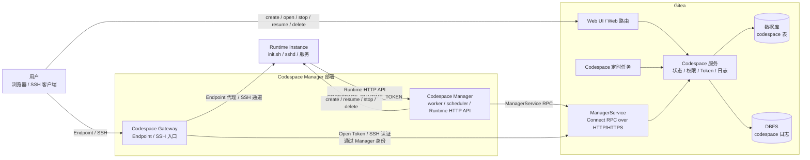
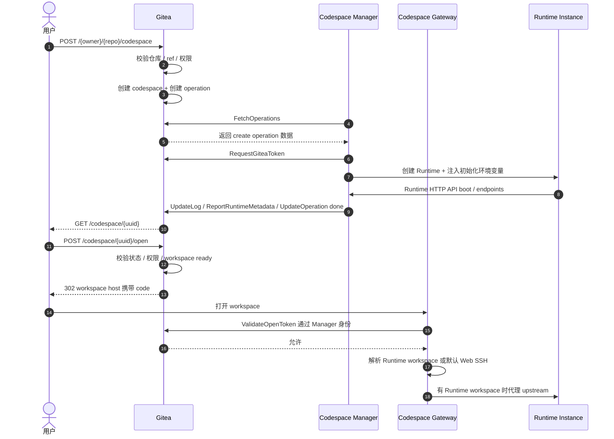

# Gitea Codespace 最终设计

## 目标

Codespace 是 Gitea 内置的远程开发环境入口。

| 主体 | 职责 |
| --- | --- |
| Gitea | repository、ref 与 commit 校验；用户身份与权限（复用 `CanRead(unit.Code)` 统一入口）；codespace 生命周期状态；Codespace Manager 注册与认证（参考 Actions runner 注册模式）；Gitea access token 签发、绑定、删除保护与吊销；Gateway Open Token 签发与校验；SSH 认证判定；operation 日志存储与读取（基于 DBFS） |
| Codespace Manager | Runtime Instance 创建、恢复、停止、删除；Runtime Instance 类型、镜像、资源配置；Runtime Token 生成与校验；Runtime HTTP API；Runtime Metadata 上报；Endpoint upstream 解析与代理 |
| Codespace Gateway（Manager deployment 内组件） | 用户 Endpoint 接入；用户 SSH 接入；Gateway session 管理；通过 Manager 身份调用 Gitea 校验 Gateway Open Token 与 SSH 认证；到 Runtime Instance 的 SSH channel 转发 |

Gitea 管理生命周期、权限判断和 token 生命周期绑定，运行时选型和后端（Incus/Docker 等）由 Manager 独立管理。运行时专有配置和 Runtime Token 均由 Manager 维护。

实现验收点：

- Gitea、Manager、Gateway 和 Runtime Instance 的接口只能访问本章分配给自己的数据与职责。
- Runtime backend 选型变化不要求修改 Gitea codespace 数据表或状态枚举。

## 架构

架构约束：

**部署边界**
- Codespace 部署模型为 Gitea 单实例。
- 每个已注册 `manager_id` 同一时刻只运行一个 Manager 进程；同身份多进程和 active-active 不受支持。Manager 使用本地状态目录独占锁阻止共享该目录的重复进程，因为 operation worker、generation 和 backend Runtime 映射都由该身份的单一进程维护。把同一凭据复制到另一目录或主机属于错误部署，Gitea 不提供同身份多进程仲裁。
- Gitea 与 Manager 之间只通过 ManagerService RPC 通信。
- Manager 是运行侧在 Gitea 中注册的身份。
- Gateway 是 Manager deployment 内部组件，通过 Manager 身份调用 Gitea。

**数据边界**
- Gitea 保存生命周期状态、权限与 token 绑定、Manager 最新事实版本和 codespace 日志；Runtime backend 专属状态由 Manager 保存。
- Incus、Docker、镜像、资源规格、网络等均为 Manager 内部实现。
- Runtime HTTP API 只在 Manager 私有网络内开放。

**流量边界**
- 用户 Endpoint / SSH 流量不经过 Gitea，直接到 Gateway。
- Gateway 用户流量仅在鉴权时回到 Gitea。
- Runtime Instance 可访问 Gitea 标准 Git HTTP 和 repository web URL，但不直接调用 codespace 专用内部接口。

**Runtime 边界**
- Runtime Instance 只通过 Runtime HTTP API 调用 Manager。
- Endpoint upstream 只由 Gateway 和 Manager 解析。

用户 Endpoint HTTP、WebSocket 和 SSH 流量由 Manager/Gateway 在与 Runtime Instance 同一部署内直接解析 upstream 和内部 SSH 连接；Gitea 只处理鉴权和状态写入。WebSocket 与 SSH 是持续连接，普通 HTTP 按请求转发。

核心通信流程：

实现验收点：

- 用户 Endpoint/SSH 数据流不经过 Gitea，鉴权请求通过 ManagerService 到达 Gitea。
- Runtime HTTP API 只在 Manager 私网开放，并同时校验 Runtime Token 和来源绑定。
- Gateway 不把 open code、Gitea token、Manager Secret 或 Runtime Token 转发给 Runtime。

## 术语

参见[术语页](glossary.md) 获取完整术语表和命名规则。

实现验收点：

- Web、RPC、数据库和文档使用术语页定义的同一组名称。

## 核心原则

- Gitea 只负责授权、状态、日志、token 绑定和跳转入口。
- Codespace 复用 Gitea 现有用户、组织、仓库、权限（`CanRead(unit.Code)` 统一入口）、access token（`models/auth/access_token.go`）、SSH key、登录限制、git、Pull Request 和 Actions task 领取模型。
- create、open、SSH、resume、stop、delete 和 logs 使用 Gitea 服务层统一权限判定入口。统一入口让 Web、RPC 和 Gateway 对同一用户状态、codespace 状态与 Manager 状态得到一致结论，减少 handler 各自拼接权限条件带来的分歧。
- 用户登录后，满足 Gitea 登录限制（`is_active`、`prohibit_login`、`must_change_password`、站点强制 2FA）且拥有 repository code-read 权限，就可在许可的仓库状态下创建 codespace。
- repository 状态只参与 create 阶段的来源校验。create operation 完成、workspace 已初始化后，codespace 按自身状态继续运行；repository 删除、归档、迁移、ref 移动或创建用户失去 repository 访问权限，只会让后续 Git HTTP(S) 访问被 Gitea 现有权限链路拒绝。
- codespace 使用创建用户自己的 access token 访问 repository，是用户私有对象而非 repository 共享资源。
- Manager 使用 codespace 身份访问 repository，不直接使用自己身份。
- Runtime git 访问使用创建用户的 Gitea access token，只走 Git HTTP(S)，每次访问继续经过 Gitea 现有 token、用户、repository、unit 和权限检查。
- codespace-bound token 继续使用 Gitea access token 和 `write:repository` scope，并在 Gitea 现有检查链路上追加 repo binding 判定：目标 repository 必须是 codespace 绑定的 repository，其他 repository 一律拒绝。
- Gitea token 只在 `creating/running` 工作状态存在并可用，进入 `stopped`、`failed`、`deleting` 或物理删除时吊销。`creating -> running` 不吊销 token，可直接复用；repository 删除后 `repo_id` 写为 0，codespace-bound token 对任何 repository 都拒绝。
- create、resume、stop、delete 必须幂等。
- 同一 codespace 同一时刻只能有一个 active operation。
- active operation 完成后清空 operation 字段，不保留 operation 历史；失败诊断通过 codespace 日志读取。
- Manager 可通过 `ReportRuntimeTransition` 上报本地主动 running/stopped/failed 事实；failed 用于单 Codespace 已确认不可恢复且当前没有 active operation 的情况，不增加新的持久主状态。
- Manager 主动把 stopped Runtime 恢复为 running 时，不创建 operation；先提交 `credential-refresh` running fact，主状态成立后申请新 Git token 并刷新 credential，最后上报 ready。
- Runtime inventory 差异只在 `ReportInstances` 请求内计算；Cron 不保存或重放 inventory，只处理数据库可判断的超时、Manager 可用性和 token binding。
- failed 保留期到期后由 Gitea 直接物理删除记录、token、日志和 cache，不创建 Manager operation 或 instruction；后续未知 UUID inventory 继续按无记录处理。
- codespace 复用 Gitea 现有 access token 模型和 Web 全局中间件；第一版不增加 codespace 专用 notifier，SSH 认证限流由 Gateway 执行，Manager RPC 通过认证、请求大小和 control-plane timeout 控制资源使用。
- repository/ref/commit/config 前置校验失败直接返回创建错误，不产生残缺对象；来源数据完整但 Manager 不匹配或进入队列后的 create 失败，在同一 codespace 对象上进入 `failed`，由用户决定 delete 后重新创建。
- 失败为终态，通过 delete 退出。
- delete 成功后物理删除 codespace 记录、吊销 token 并删除日志。
- Manager 的并发容量由 Manager 自行控制并以 `capacity_available` 上报，Gitea 不维护运行容量计数。
- Manager 可修改名称、版本、tags、容量、Gateway/SSH 地址、host key 和 capability，并通过完整 Declare 快照覆盖 Gitea 当前展示与匹配数据；Gitea 不保存声明历史，已有 Codespace binding 不随声明变化迁移。
- Manager 使用本地 operation worker pool 执行已领取的 operation，create/resume 使用容量槽位，stop/delete 使用独立 cleanup 队列，确保资源创建与回收互不阻塞。
- Runtime Instance name 由 `codespace_uuid` 确定性派生，确保 create、resume、delete 和本地清理都能定位同一个实例。
- Gitea 重启和 Manager 重启按日常维护事件处理。重启不直接改变 codespace 主状态，交互入口可以临时返回 metadata_rebuilding/recovering 分类；Manager 恢复完成并上报完整 inventory 后，再由 reconciliation 写入明确结果，区分正常维护和真实生命周期失败。
- Gateway Endpoint 第一版支持 HTTP reverse proxy 和 WebSocket upgrade，SSH 使用独立接入面，覆盖 Web IDE 和端口预览主场景，同时避免任意 TCP tunnel 的鉴权和资源复杂度。
- 默认 open 始终绑定逻辑 Endpoint `workspace`。Runtime 声明同名 Endpoint 时 Manager 使用其 upstream，未声明时使用默认 Web SSH；Gitea 不保存实现类型，也不为 Web SSH 增加独立 Endpoint 或 token 分支。
- Gateway URL 使用 `{uuid32}.{gateway_domain}` 表示 workspace，使用 `{endpoint_id}-{uuid32}.{gateway_domain}` 表示普通 Endpoint。所有入口位于同一层 wildcard DNS/TLS 域下，既保持每个入口独立 origin，也避免为每个 Codespace 签发证书。
- 每个 Manager 的规范化 Gateway URL 唯一；首次声明或变更时由 Gitea 串行检查，避免不包含 `manager_id` 的 Endpoint host 被路由到错误 deployment。
- Gateway session 使用 TTL、idle timeout 和按间隔 revalidate：普通 HTTP 在间隔到期后的下一次请求转发前同步检查，WebSocket/SSH 按定时器检查，从而在控制 RPC 数量的同时收敛用户登录状态、codespace 状态和 Manager 状态变化。
- Gateway 已有 session 通过 `RevalidateGatewaySession` 复检，不重复消费一次性 open code；拒绝、超时或通信失败时关闭 session，待转发的 HTTP 请求不进入 upstream。
- SSH 认证限流与退避由 Gateway 按 source IP、codespace、source IP + codespace 和 public key hash 多维度执行，降低暴力破解风险并减少单一维度限流的误伤。
- Manager/Gateway 只在本地结构化诊断日志中记录鉴权拒绝、限流、连接和恢复失败，不建立成功连接访问审计；`last_active_unix` 仍由 Gitea 按成功 open、SSH 认证和用户 resume 更新。
- repository 删除后 codespace 与 repository 不再保持强关联，Gitea 在删除事务中把 `repo_id` 写为 0，但不因 repository 删除单独改写主状态。`repo_id=0` 是来源 repository 已不可解析的机器状态；open、SSH、resume、stop、delete 和 logs 继续按 codespace 自身权限与状态判定，不依赖已经不存在的 repository row。
- 用户或组织删除时，在 Gitea 删除事务中物理清理关联 Codespace、token、日志、Manager 和 registration token；不创建 operation、不向 Manager 发送指令，也不等待运行侧回收。
- Manager 删除时，在 Gitea 删除事务中物理清理 Manager、其绑定 Codespace、token、日志和 cache；enabled/disabled/online/offline/recovering 都使用相同删除路径，不联系 Manager。
- 上述删除边界是有意设计，不是数据不同步缺陷：Gitea 删除成功只表示其数据库、凭据、日志和 cache 已清理。Runtime、volume、进程或 Manager 本地快照可以保留，后续表现为部署侧资源占用或通信失败，不会取得有效身份破坏 Gitea。设计不引入远端删除确认、等待状态、补偿队列、墓碑或 orphan Runtime 扫描；删除确认页负责让用户明确接受这一结果。
- codespace 日志第一版存储在 DBFS，使用 byte offset 追加和读取，不引入对象存储归档以减少日志 transfer 状态对生命周期状态机的影响。
- `manager_id=0` 的 codespace delete 由 Gitea 同步完成；已经绑定 Manager 的 delete 进入 `deleting` 并由绑定 Manager 清理 Runtime。
- resume 完全使用已初始化 workspace，进入 running 后申请新 Gitea token 并刷新 Runtime Git credential，不重新读取 repository payload 或 checkout 初始 commit。
- `operation_rversion` 只协商 Gitea 下发动作；主动 Runtime 事实、完整 inventory 和 Runtime Metadata 分别使用只保存最新值的 generation 拒绝旧上报。
- disabled Manager 不领取新 create/resume；禁用前已领取的 create/resume 通过 abort 命令清理并收敛为 failed，stop/delete 继续完成。
- 测试按 models、services、RPC routes、Web routes 和 integration 分层组织，分别覆盖数据模型、状态事务、权限/token 边界和跨层生命周期流程。

实现验收点：

- repository、Manager 和 Runtime 的职责边界与各自保存的数据一致。
- 五个持久主状态和当前 active operation 可以表达完整生命周期，不依赖 operation 历史。
- repository 删除不级联销毁已初始化 codespace，token 访问仍经过状态、repo binding 和 Gitea 原有权限检查。
- 用户或组织删除只收敛 Gitea 持久资源；后续未知 Runtime inventory 不触发 Manager 清理。
- Manager 删除不经过 disabled 或运行侧回收流程，绑定 Gitea 资源在本地事务中直接清理。
- 评审与实现测试把“运行侧资源可能保留且 Gitea 不发清理指令”作为预期行为，而不是待修复缺陷。
- Manager/Gateway 重启后能通过当前 operation、最新 generation 和本地持久数据恢复。
- Manager 本地版本基线丢失后，running/stopped 分歧或无 active operation 的 failed inventory 可从 report transition instruction 取得当前版本，有 active operation 的 failed inventory 则通过 refetch 恢复 payload；单 Codespace 不可恢复时可上报 failed fact，Manager 整体离线本身不批量改写 Codespace。
- failed retention 清理不依赖 Manager 状态，也不会向未知 Runtime 发出清理指令。
- 同一 Manager 本地状态目录只能由一个进程持有；同一身份凭据不得复制给另一目录或主机并发运行。
- Gateway 不读取 Gitea 数据库，Endpoint 与 SSH 鉴权都通过 ManagerService 完成。
- 默认 open 的 `OpenTokenBinding.endpoint_id` 始终是 `workspace`；Runtime 未声明 workspace Endpoint 时，同一 URL 回退到 Manager 默认 Web SSH。
- workspace 与普通 Endpoint host 都由完整 `uuid32` 无歧义派生，并可由 base domain 的单层 wildcard DNS 和证书覆盖。
