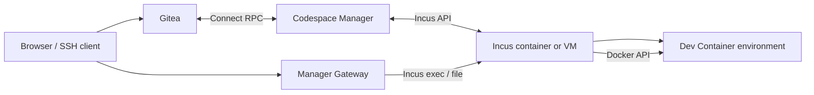
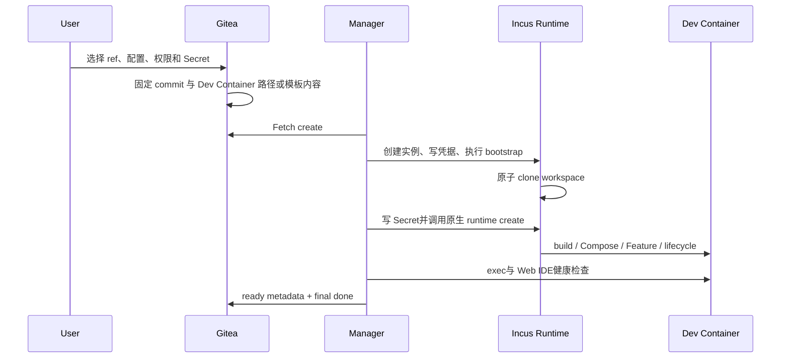

# Gitea Codespace 总体设计

## 目标

本设计为 Gitea 提供用户私有的远程开发环境。用户从 repository 代码页选择 ref 和 Dev Container 配置创建 Codespace，也可以从个人 Codespace 页面查看、恢复、停止、设置或删除已有环境。全部现有能力属于同一份目标设计，不按版本拆分。

系统由三个仓库组成：

| 组件 | 职责 |
| --- | --- |
| Gitea | 用户与 repository 权限、Codespace 状态、operation、日志、Secret、开发 Token、Git SSH 公钥和 Gateway 授权 |
| codespace-proto-go | Gitea 与 Manager 共用的类型化 protobuf/Connect 协议 |
| Codespace Manager | Incus 实例、原生 Dev Container、Gateway、Web IDE、SSH/SFTP、Endpoint、资源采样和本地恢复 |

Dev Container 是唯一的开发环境格式。仓库可以提供 Dev Container 文件；管理员和用户也可以在 Gitea 设置中保存命名 Dev Container 模板，用于没有仓库配置或希望使用统一基础环境的仓库。Gitea 只解析名称、Secret 建议和 Gitea 权限扩展；Manager 解析标准运行字段并通过 Docker API、Compose Go API 和 ORAS Go API实现。模板内容在创建提交时写入 Codespace 记录，后续模板修改只影响新的 Codespace。**设计如此：**模板是创建入口的可管理候选，不是运行时配置项；把本次选择直接保存到 Codespace 行，可以让 queued create 和 Manager Fetch 不依赖会继续变化的设置表。

### 实现验收点

- [x] Gitea、共享协议和 Manager 的职责边界明确，生命周期状态只有 Gitea 一个权威来源。
- [x] 开发环境只使用 Dev Container；基础设施环境只由 Manager tag和本地配置选择。
- [x] 没有 Dev Container 文件的仓库可以选择全局或个人 Dev Container 模板完成同一创建流程。
- [x] 用户可在 repository 入口和个人页面完成创建、访问、停止、恢复、设置和删除。

## 架构

```mermaid
flowchart LR
    Browser[Browser / SSH client] --> G[Gitea]
    Browser --> GW[Manager Gateway]
    G <-->|Connect RPC| M[Codespace Manager]
    M <-->|Incus API| I[Incus container or VM]
    I --> D[Dev Container environment]
    GW -->|Incus exec / file| I
    I -->|Docker API| D
```

Gitea 与 Manager 只通过 ManagerService 通信。Manager 身份先由 Gitea 管理页面创建，Manager 运行期主动发起 Declare、Fetch、运行身份绑定、日志、Runtime Metadata、凭据和状态报告；Runtime 内没有访问 Manager 控制端口的路径。Gateway 的 HTTP、WebSocket、SSH、SFTP和端口转发都先完成 Gitea授权，再通过 Incus exec/file进入当前 Dev Container。

每个 Codespace 对应一个确定性命名的 Incus 实例。实例可以是系统容器或虚拟机，虚拟机强制要求 agent。Manager project隔离实例、profile和项目卷；managed bridge位于 default project，由 Codespace project共享。Manager托管 bridge时开启 IPv4 NAT和 DHCPv4，实例资源限制由用户在 Gitea 创建确认页选择、Manager 已声明的本地 environment定义，仓库不能改变调度 tag或 Incus规格。

实例内只保留一个固定 bootstrap 和同一 `gitea-codespace` 可执行文件。bootstrap 准备外层用户、Git、Docker 和 workspace；隐藏的原生 runtime 负责 Dev Container create/resume/stop/inspect/exec/TCP。完整环境状态保存主容器、Compose 相关容器、用户、workspace、合并配置、Feature digest 和 lifecycle；固定 Web IDE 端口由产品适配层提供，Secret 不进入环境状态。

### 实现验收点

- [x] Runtime不监听 Manager控制端口；全部调用方向为 Manager经 Incus进入实例。
- [x] container和 VM使用同一生命周期、Gateway和 Dev Container运行时代码。
- [x] HTTP/SSH连接在 Gateway完成认证和持续复检后才进入 Incus backend。
- [x] Managed network显式提供 DHCPv4；自定义 network/profile由部署者提供等价网络能力。
- [x] Manager和实例架构不一致时在复制运行时前返回明确部署错误。

## 创建与恢复

```mermaid
sequenceDiagram
    participant U as User
    participant G as Gitea
    participant M as Manager
    participant R as Incus Runtime
    participant D as Dev Container

    U->>G: 选择 ref、配置、权限和 Secret
    G->>G: 固定 commit 与 Dev Container 路径或模板内容
    M->>G: Fetch create
    M->>R: 创建实例、写凭据、执行 bootstrap
    R->>R: 原子 clone workspace
    M->>R: 写 Secret并调用原生 runtime create
    R->>D: build / Compose / Feature / lifecycle
    M->>D: exec与 Web IDE健康检查
    M->>G: ready metadata + final done
```

create 的 clone只在 bootstrap中执行，并在受控临时目录校验锁定 commit后原子提交。首选 Git协议失败且另一个 URL可用时，同一次 bootstrap最多回退一次。原生 runtime随后从 workspace 读取仓库配置，或直接解析 Gitea 下发的模板内容，创建完整 Dev Container环境，执行首次 lifecycle、配置 Git、初始化 Web IDE settings 和扩展，并启动固定 code-server。

stop 停止完整 Dev Container环境、清理易失 Secret，再停止 Incus实例。resume启动同一实例和保存的容器集合，重写当前 Token与 Secret，执行 `postStartCommand` 和 `postAttachCommand`、恢复 Web IDE并重新发布 ready；它不重新读取 repository配置、不 clone、不 checkout、不覆盖 Web IDE settings，也不重复安装扩展。delete直接删除 Incus实例并确认缺失，不依赖 stop成功。

### 实现验收点

- [x] create只提交经过 commit校验的 workspace，Dev Container 仓库路径或模板内容与用户确认一致。
- [x] stop/resume覆盖主容器和 Compose相关容器，不只处理单一容器。
- [x] resume保留用户 HEAD、remote和 Git identity，只刷新当前开发凭据与运行服务。
- [x] resume保留用户在 Web IDE内修改过的 settings 和扩展状态。
- [x] ready在 final done前验证 Incus、workspace、Dev Container、Web IDE和同一 operation版本。
- [x] delete以 Incus实例缺失为资源清理完成条件。

## 访问与权限

Codespace 是创建用户的私有对象，不是 repository共享资源。创建需要用户可登录且具有源 repository code-read权限；创建完成后，repository删除或权限变化不反向删除环境。开发 Token和 Git SSH Key的每次请求仍由 Gitea按当前用户、repository、单元和分支保护判定。

Web IDE使用固定 code-server Feature，端口为 `13337`，自身认证关闭。Gateway workspace路由固定连接该端口；普通 Endpoint由 Dev Container端口配置和运行时 manifest声明。所有后端连接通过 Incus exec和 Docker API在主 Dev Container内访问 localhost，不依赖容器 IP、host网络或内部 sshd。

SSH shell/exec在 Dev Container的 remote user和 workspace中执行，支持 PTY、resize、signal和退出码。SFTP使用 Incus文件 API，以外层 UID/GID和 workspace为默认目录。`direct-tcpip`只允许目标语义为 localhost、`127.0.0.1`或`::1`，实际连接仍由 Dev Container内运行时发起。

### 实现验收点

- [x] Codespace Token不能用于账户、组织、管理、Package等未授权能力。
- [x] Web IDE、私有 Endpoint和 SSH均使用一次性 Open Code或当前 Gitea授权建立会话并持续复检。
- [x] 公共 Endpoint不建立用户 session，也不计入自动暂停活跃度。
- [x] SSH、SFTP、Web IDE和端口转发均使用当前本地环境状态，不从 Runtime Metadata猜测 backend。

## 状态与恢复

Gitea主状态为 queued、creating、running、stopping、stopped、resuming、deleting和failed；同一 Codespace同一时刻最多一个 active operation。Manager使用 operation版本、lease和本地单调截止点限制执行，持久化 active payload、worker阶段、startup input、完整环境、Runtime Metadata和cleanup pending。

Manager重启先终止遗留执行，以 recovering声明运行状态，后续 Fetch提交零启动可用槽位。只有同版本 Fetch续租成功后才恢复 worker。旧本地状态格式直接报错，不做兼容读取，因为无法证明旧状态能够唯一映射为完整 Dev Container环境。Gitea重启不改变数据库状态，Manager通过 Declare、Fetch和完整 inventory自然重建 cache与路由。

Runtime Metadata只包含 boot、普通 Endpoint和 CPU/内存/磁盘用量。SSH、Web IDE、SFTP和 proxy的实际 backend只保存在 Manager本地状态。**设计如此：**动态地址和容器目标由 Manager直接使用，写入 Gitea cache会产生第二份可能过期的路由来源。

### 实现验收点

- [x] operation版本、lease和总期限共同阻止旧 worker继续修改资源。
- [x] Manager重启后成功续租前不执行 create/resume，cleanup pending可独立继续。
- [x] Runtime Metadata cache丢失后可由 Manager完整重报，不影响数据库生命周期或凭据关系。
- [x] 本地状态保存恢复所需的完整环境，Secret、Git私钥和 Gitea Token明文不进入状态文件。

## 文档导航

- [数据模型](data-model.md)
- [状态与生命周期](state-machine.md)
- [生命周期流程](lifecycle-flows.md)
- [Manager 原生 Dev Container 运行时](devcontainer-runtime.md)
- [维护与重启恢复](maintenance-recovery.md)
- [Gitea 服务端](gitea-server.md)
- [Manager 与 Gateway](manager-gateway.md)
- [RPC 接口定义](rpc-spec.md)
- [实施与测试](implementation.md)

### 实现验收点

- [x] 各专题文档与本总览使用相同状态、调用方向和 Dev Container职责边界。
- [x] 每个设计章节给出原因和可验证行为，不以历史版本或过时实现解释当前设计。
