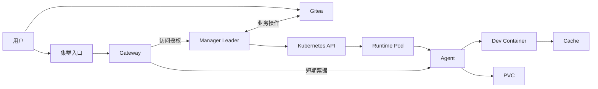

# Gitea Codespace 总体设计

## 产品边界

Gitea Codespace 为仓库、提交和合并请求提供可停止、恢复和删除的远程开发环境。用户选择运行环境与 Dev Container 配置，Gitea 完成权限确认并建立操作，Manager 再把操作收敛为 Kubernetes 资源和可访问的开发容器。

Gitea 是用户、仓库权限和业务状态的权威来源；Manager 是运行资源的控制面；Dev Container 描述仓库需要的开发环境。明确这三个边界，可以让 Gitea 在不了解 Kubernetes 的情况下完成授权，也让运行平台在不了解 Gitea 内部模型的情况下恢复资源。

### 实现验收点

- 分支、标签、提交和合并请求使用同一创建流程。
- 仓库没有 Dev Container 配置时，用户可以选择可见的命名模板。
- Gitea 页面、模型和 RPC 不包含 Kubernetes、RuntimeClass 或容器网络字段。

## 系统边界

| 组件               | 权威职责                                                      |
| ------------------ | ------------------------------------------------------------- |
| Gitea              | 用户授权、业务状态、操作、运行凭据、日志和访问判定            |
| Manager            | 站点接入、资源控制器、操作协调和状态报告                      |
| Kubernetes         | 调度、命名空间、配额、持久卷、工作负载和 Leader Lease         |
| Codespace Agent    | Runtime Pod 的 PID 1，管理专属 Docker、Dev Container 和访问流 |
| Gateway            | HTTP/WebSocket、SSH、SFTP 和回环端口转发入口                  |
| Cache              | 可重新生成的镜像代理和构建缓存                                |
| codespace-proto-go | Gitea 与 Manager 共享的公共业务协议                           |

```mermaid
flowchart LR
    U[用户] --> G[Gitea]
    U --> I[集群入口]
    I --> W[Gateway]
    W -->|访问授权| M[Manager Leader]
    M <-->|业务操作| G
    M --> K[Kubernetes API]
    K --> P[Runtime Pod]
    P --> A[Agent]
    A --> D[Dev Container]
    A --> V[PVC]
    W -->|短期票据| A
    D --> C[Cache]
```

用户流量由 Gateway 直接连接当前 Agent，Manager 只处理控制与授权。Gitea 保存用户意图和结果，Kubernetes 保存运行资源，PVC 保存可恢复的环境数据；进程内缓存均可从这些权威来源重建。

### 实现验收点

- 同一操作版本贯穿 Gitea、Codespace 自定义资源和 Agent 任务。
- Gateway 数据流不经过 Manager 转发。
- Gateway 只接受与当前 Pod 身份、路由和目标版本匹配的票据。
- Manager 重启后能从 Gitea 与 Kubernetes 恢复协调状态。

## 运行原则

每个 Gitea 站点使用独立命名空间。Runtime Pod 在明确选择的 Kata 或 Sysbox RuntimeClass 中运行专属 Docker，实际 Dev Container 由该 Docker 构建和启动。工作区、Docker 数据和 IDE 数据保存在独立 PVC；短期 Token、Secret 和 socket 保存在易失目录。

RuntimeClass 在环境模板中显式选择。Kata 与 Sysbox 具有不同的隔离条件，恢复继续使用创建时确定的配置，从而保持安全边界稳定。环境恢复以 PVC 中的持久数据为准，Cache 只保存可以重新生成的加速数据。

### 实现验收点

- 不同站点的资源、凭据和网络策略位于各自命名空间。
- stop 保留 PVC，resume 使用同一工作区和内部 Docker 数据。
- Runtime Pod 不获得节点容器运行时套接字或 Kubernetes API 凭据。
- 清空 Cache 不影响已有 Codespace 从 PVC 恢复。
