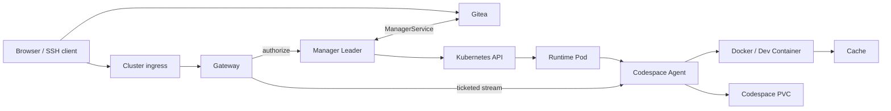

# Gitea Codespace 总体设计

## 产品目标

Gitea Codespace 为 Gitea 用户提供与仓库和提交绑定的远程开发环境。用户选择运行环境和 Dev Container 配置后，可以创建、访问、停止、恢复和删除 Codespace。Gitea 管理仓库权限、Secret、Git 身份和访问授权，Manager 管理运行资源。

Dev Container 是开发环境的统一描述格式。仓库配置、个人模板、站点模板和平台默认配置进入同一解析流程。项目构建在 Runtime Pod 内完成，不使用 Kubernetes 节点的容器运行时。

**设计如此：**Gitea 负责用户业务，Manager 负责运行资源，Dev Container 负责开发环境。三者各自只有一个权威来源，避免页面状态、集群状态和容器状态互相推导。

### 实现验收点

- 用户可以从仓库、提交和合并请求进入同一创建流程。
- 没有仓库配置时可以使用默认配置或命名模板创建环境。
- Gitea 不保存 Kubernetes、Docker 或 RuntimeClass 的实现细节。

## 系统组成

| 组件 | 核心职责 |
| --- | --- |
| Gitea | 用户授权、业务状态、操作队列、开发凭据、日志和访问判定 |
| codespace-proto-go | Gitea、Manager、Agent、Gateway 和 Cache 的共享协议 |
| Manager | 管理页面、站点接入、Kubernetes 控制器、操作协调和状态报告 |
| Kubernetes | 调度、命名空间、配额、持久卷、服务发现和 Leader Lease |
| Codespace Agent | Runtime Pod 的 PID 1，管理专属 Docker、Dev Container 和访问流 |
| Gateway | HTTP/WebSocket、SSH、SFTP 和本地端口转发入口 |
| Cache | 可重新生成的镜像代理与构建缓存 |

```mermaid
flowchart LR
    U[Browser / SSH client] --> G[Gitea]
    U --> I[Cluster ingress]
    I --> W[Gateway]
    W -->|authorize| M[Manager Leader]
    M <-->|ManagerService| G
    M --> K[Kubernetes API]
    K --> P[Runtime Pod]
    P --> A[Codespace Agent]
    A --> D[Docker / Dev Container]
    A --> V[Codespace PVC]
    W -->|ticketed stream| A
    D --> C[Cache]
```

Gitea 保存用户意图和业务结果，Kubernetes 保存平台资源，PVC 保存开发环境，Agent 报告容器内执行结果。恢复时按这一所有权顺序核对。

### 实现验收点

- 同一操作版本贯穿 Gitea、Codespace 自定义资源和 Agent 任务。
- Gateway 用户流量直达当前 Agent，不经过 Manager 转发数据。
- Pod 替换后旧身份、旧路由和旧访问票据立即失效。

## 运行与隔离

每个 Gitea 站点对应一个 `GiteaSite` 集群资源和一个 `codespace-<site-name>` 命名空间。Codespace CR、Runtime Pod、PVC、身份和网络策略位于站点命名空间；Manager、Gateway 和 Cache 位于管理命名空间。

Manager、Gateway、Cache 和 Runtime Pod 使用同一份摘要固定的平台镜像。Kata 提供虚拟机隔离，Sysbox 用于无法提供硬件虚拟化的节点；环境模板明确选择其中一种，不在运行中自动切换。Pod 内的专属 Docker 构建并运行实际 Dev Container，工作区、Docker 数据和 IDE 状态保存在专属 PVC，短期 Token、Secret 和 socket 保存在易失目录。

**设计如此：**Kata 与 Sysbox 的安全边界和存储条件不同，明确选择比自动降级更容易审计。PVC 保存可恢复事实，Cache 只提高构建效率，因此清空 Cache 不影响已有环境恢复。

### 实现验收点

- 站点删除只回收该站点命名空间内的资源。
- stop 保留 PVC，resume 使用同一工作区和内部容器数据。
- RuntimeClass、存储、平台镜像和 Dev Container 注入组合通过真实部署验证后才声明为可用环境。

## 阅读路径

文档按用途分层，避免在不同章节重复维护同一设计：

| 文档 | 面向对象 | 说明 |
| --- | --- | --- |
| [Gitea 服务端](gitea-server.md) | Gitea 开发者 | 用户体验、权限和业务控制面 |
| [运行平台](runtime-platform.md) | Codespace 开发者 | Kubernetes、Runtime、Gateway 与 Cache |
| [生命周期](lifecycle.md) | 两侧开发者 | create、stop、resume、delete 和恢复语义 |
| [数据模型](data-model.md) | 模型与控制器开发者 | 数据所有权、标识和持久化不变量 |
| [RPC 接口](rpc-spec.md) | 协议开发者 | 跨进程职责、安全与重试语义 |
| [部署要求](deployment-requirements.md) | 集群管理员 | 平台依赖、上线和恢复要求 |
| [实施与测试](implementation.md) | 贡献者 | 仓库边界、测试层次和完成标准 |

具体字段、命令参数和默认值由源码、Proto、Helm values 与组件 README 维护；设计文档只保留跨模块必须一致的行为及其原因。

### 实现验收点

- 每个主题有唯一的主要文档，其他章节通过链接引用。
- 新设计能在对应章节找到原因、行为和可验证结果。
- 字段、命令和默认值变化不要求复制修改多份设计说明。
