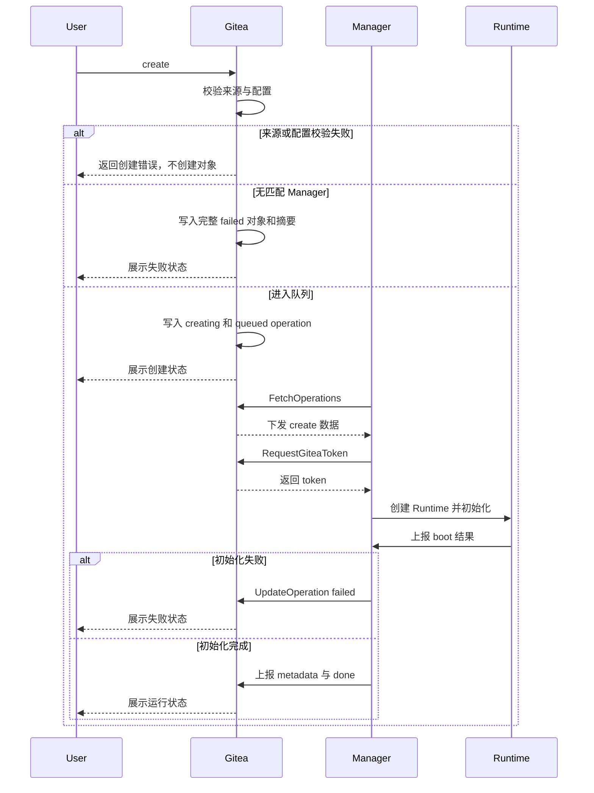

# 生命周期流程

## 创建流程

### Ref 解析

Create 支持：

| 参数 | 说明 |
| --- | --- |
| `ref_type` | `branch` / `tag` / `commit` / `pull` |
| `ref_name` | 用户输入：`branch` → 分支名；`tag` → 标签名；`commit` → 完整 commit SHA；`pull` → 十进制 PR index |

repository ID 来自 Web 路由，最终 `commit_sha` 只由 Gitea 解析。pull index 在服务端规范化为持久 `ref_name/start_ref=refs/pull/{index}/head`。客户端提交 repository ID 或最终 commit 字段时返回参数错误，避免把用户输入误当作已验证来源。

Gitea 校验步骤：

1. 校验 repository 可见性和 code-read 权限。
2. 校验 repository 状态。
3. 打开 git repository 并确认非空。
4. 解析并锁定最终 commit SHA。
5. 校验目标 ref/commit 存在且可解析。
6. PR 入口属于 base repository 页面。

Pull Request 规则：

- PR 入口属于 base repository 页面。
- `ref_type=pull` 时从 Gitea 数据加载 PR。
- base repository 与路由 repository 一致。
- 创建用户具备 base repository code-read 权限。
- head repository 与 base repository 不同时，创建用户同时具备 head repository code-read 权限。
- Gitea 从 PR 数据读取 `base_repo_id`、`head_repo_id`、`base_branch`、`head_branch` 和当前 head commit。
- `commit_sha` 固定为 PR 当前 head commit。
- `start_ref` 使用 `refs/pull/{index}/head` 作为 Manager fetch/checkout 提示。
- operation 使用 base repository clone URL，并以 `start_ref=refs/pull/{index}/head` fetch PR 当前代码；最终 checkout 以 `commit_sha` 为准，并校验 HEAD 等于 `commit_sha`。
- Manager tag matching 和 `.gitea/codespace.yaml` 使用 base repository。

PR 页面属于 base repository 但代码来自 head commit。锁定当前 head commit 防止 head branch 移动导致 workspace 漂移；校验 head repository 可读，防止通过 base repository PR ref 间接访问无权 head repository。codespace token 只绑定 base repository，因此初始化统一通过 base repository 的 pull ref，不使用 head repository clone URL。

### Repository Codespace 配置

配置文件：

```text
.gitea/codespace.yaml
```

当前识别字段：

```yaml
tag: default
```

规则：

- 配置只从 branch tree 读取。
- `ref_type=branch`：读取该 branch。
- `ref_type=pull`：读取 PR base branch。
- `ref_type=tag`：读取 repository default branch。
- `ref_type=commit`：读取 repository default branch。
- 文件缺失等价于 `tag=default`。
- 空仓库在读取配置前返回 empty repository 分类。
- default branch 不存在、目标 branch tree 不可读、配置 blob 不是普通文件时，create 请求返回配置读取错误，不创建 codespace。
- 配置文件超过 `CODESPACE_REPO_CONFIG_MAX_SIZE` 时，create 请求返回配置过大错误，默认上限 64 KiB。
- YAML 非法时，create 请求返回 YAML 解析错误。
- `tag` 缺失或空字符串等价于 `default`。
- 未知字段忽略，create 日志中提示当前只识别 `tag`。
- `tag` 解析后 lower-case。
- `tag` 使用 `[a-z0-9_-]+`，与 Manager tag 匹配保持大小写无关且便于配置。
- `tag` 确定 create 时的 Manager tag matching。stop、resume、delete 按已绑定的 `manager_id` 执行，不看 tag。
- 实际 checkout commit 仍按用户选择的 branch/tag/commit/PR 锁定 SHA。
- `.gitea/codespace.yaml` 中的 `tag` 字段用于选择 Manager。实际 checkout 以用户选择的 branch/tag/commit/PR 确定的 `commit_sha` 为准。
- tag/commit 场景读取 default branch，避免任意历史 commit 改变 Manager 选择。
- PR 场景使用 base branch，让目标仓库维护者控制运行侧选择；实际代码仍按用户选择的 ref 锁定到具体 commit SHA。

配置缺失是正常路径，非法配置是仓库维护者需要修复的问题。Gitea 先完成 repository 权限与状态、ref/commit 锁定和配置解析；这些步骤失败时直接返回 create 页面错误，不插入缺少 `commit_sha` 或 `repo_tag` 的 codespace。只有取得完整 `repo_id/ref_type/ref_name/commit_sha/repo_tag` 后才创建记录。

完整来源数据已经确定但没有 enabled Manager 匹配时，Gitea 可以创建 `status=failed, manager_id=0` 的完整 codespace，operation 字段为空，并通过内部日志入口写入无匹配 Manager 摘要。进入队列后的 Manager、Runtime、clone 和 boot 失败也在同一对象上进入 failed。这样 failed 对象始终满足真实表的非空数据约束，不需要为前置解析失败增加空值字段。

### Manager 匹配

- create 记录固定 `repo_tag`。
- enabled Manager 按 owner scope 和 tag 参与匹配。
- global Manager 参与所有 owner scope 的匹配。
- owner scoped Manager 参与相同 repository owner 的匹配；owner 可以是个人用户或组织，组织 ID 使用 Gitea `user.id`。
- 没有 enabled Manager 同时满足 owner scope 和 `repo_tag` 时，create 进入 `failed` 并写入无可用 Manager 匹配日志。
- create 创建时不绑定具体 Manager。
- 具体 `manager_id` 只在某个 Manager 通过 `FetchOperations` 成功领取 create [Operation](glossary.md#operation) 时写入。
- 有匹配 Manager 但全部离线、满载、不调用 `FetchOperations`，或调用 `FetchOperations` 但声明不可接收 create 时，create 保持 `status=creating, operation_status=queued`（参见 [Manager Capacity](glossary.md#manager-capacity)），页面可派生展示为 queued。

owner scope 表达 Manager 管理边界，tag 表达运行能力需求。global Manager 用于站点级容量，owner scoped Manager 用于个人或组织自有容量。

Create operation 领取：

- 领取前：`codespace.status=creating`，`codespace.manager_id=0`，`codespace.operation_type=create`，`codespace.operation_status=queued`。
- `FetchOperations` 通过数据库条件更新完成领取。
- 领取同时写入 `codespace.manager_id`、`codespace.operation_status=running`、`codespace.operation_started_unix`、`codespace.operation_deadline_unix`。
- 领取条件包含 caller Manager enabled、caller Manager owner scope 匹配、caller Manager 支持 `repo_tag`、本次 `FetchOperations` 声明可接收 create、`codespace.manager_id=0`、`codespace.status=creating`、`codespace.operation_type=create`、`codespace.operation_status=queued`。
- 本次 `FetchOperations` 的 `capacity_available` 大于 0 时才领取 create/resume。
- `capacity_total / capacity_available` 仅用于本次领取判断；Declare 中的同名容量快照由 Gitea 规范化写入 `meta_json`，只用于管理页面展示。
- 领取成功后，operation 归属保持为领取它的 Manager。
- 并发领取失败不是系统错误。

Create 初始化流程：



### Boot 与 Init

create 的 running operation 是首次环境初始化阶段，页面可派生展示为 `booting`。

Codespace Manager 在 Runtime Instance 启动后以 `init.sh` 作为初始化入口。统一入口可以让 clone、checkout、git 凭据、内部 SSH 和默认 IDE 启动都在同一日志上下文中执行，失败时用户能从一个 codespace 对象页看到完整过程。

`init.sh` 负责：

- 通过 `GET /boot` 获取初始化所需信息
- 配置 git 凭据
- 使用 Git HTTP(S) clone URL clone 或复用 workspace 目录
- fetch 目标 ref
- checkout 到锁定 commit SHA
- 校验 HEAD 等于锁定 commit SHA
- 准备 OpenSSH
- 将 `CODESPACE_GATEWAY_INTERNAL_SSH_PUBLIC_KEY` 写入内部工作用户 `authorized_keys`
- 启动内部 sshd
- 启动默认 Web IDE 或其他本地服务
- 通过 `POST /boot` 上报初始化结果与 internal SSH metadata
- 通过 `/endpoints/{endpoint_id}` 创建、更新或删除 Endpoints

### 环境变量

create 初始化环境变量：

| 环境变量 | 说明 |
| --- | --- |
| `GITEA_REPO_CLONE_URL` | 仓库 Git HTTP(S) clone URL |
| `GITEA_REPO_WEB_URL` | 仓库 Web URL |
| `GITEA_REPO_ID` | 仓库 ID |
| `GITEA_REPO_FULL_NAME` | 仓库完整名称（如 `owner/repo`） |
| `GITEA_OWNER_ID` | 仓库 owner ID |
| `GITEA_OWNER_NAME` | 仓库 owner 名称 |
| `GITEA_OWNER_TYPE` | 仓库 owner 类型（user/org） |
| `GITEA_OWNER_DISPLAY_NAME` | 仓库 owner 展示名称 |
| `GITEA_REF_TYPE` | ref 类型（branch/tag/commit/pull） |
| `GITEA_REF_NAME` | ref 名称 |
| `GITEA_COMMIT_SHA` | 锁定的 commit SHA |
| `GITEA_TOKEN` | 仅提供给 create init 进程的 Gitea access token，用于首次 clone/checkout |
| `CODESPACE_UUID` | codespace UUID |
| `CODESPACE_NAME` | 派生名称，格式 `cs-{short_uuid}` |
| `CODESPACE_OWNER_NAME` | codespace 创建者名称 |
| `CODESPACE_REPO_NAME` | 仓库名称 |
| `CODESPACE_WORKSPACE_DIR` | 工作目录路径（由 Manager 注入） |
| `CODESPACE_MANAGER_BASE_URL` | Runtime HTTP API 基础 URL（由 Manager 注入） |
| `CODESPACE_RUNTIME_TOKEN` | Runtime Token（由 Manager 注入） |
| `CODESPACE_GATEWAY_INTERNAL_SSH_PUBLIC_KEY` | Gateway 内部 SSH 公钥 |

环境变量规则：

- `CODESPACE_NAME` 由 `codespace.uuid` 派生（`cs-{short_uuid}`），每次展示时计算。
- `CODESPACE_NAME` 生成规则固定为 `cs-{short_uuid}`，其中 `short_uuid` 取 UUID 去掉 `-` 后前 20 位。
- UI 展示名称使用同一派生规则。
- delete 后 `CODESPACE_NAME` 不复用。
- Runtime Instance name 使用同一 `cs-{short_uuid}` 规则，由 Manager 用 `codespace_uuid` 本地生成。
- `CODESPACE_WORKSPACE_DIR`、`CODESPACE_MANAGER_BASE_URL` 和 `CODESPACE_RUNTIME_TOKEN` 由 Manager 创建 Runtime 时注入。
- create 阶段的 `GITEA_TOKEN` 用于首次 clone/checkout；持久 Git 配置使用 Manager 可刷新的 credential 文件或 helper，不把首次 token 固化为永久凭据。
- Manager 只把 `GITEA_TOKEN` 作为启动 `init.sh` 进程的 process-scoped 环境传入，不写入 VM/container 全局环境、Runtime HTTP `/boot` 响应或持久配置。
- create init 完成后 IDE 或普通用户进程不能继承或重新查询 `GITEA_TOKEN`；运行期 Git 只通过 Manager 可刷新的 credential 文件或 helper 获取当前 token。

Create boot 完成条件：

- `init.sh` 成功。
- workspace checkout 到锁定 commit SHA。
- internal SSH 可被 Gateway 连通。
- Manager 已从 Runtime identity 派生 `internal_ssh.host`，Runtime 上报的 port/user/host-key fingerprint 已通过连通和 host-key 校验。
- 至少一版 Runtime Metadata 被 Gitea 接受。
- 若存在 Web IDE，对应 Endpoint 已上报。

boot stage 固定为以下顺序：

```text
prepare-runtime
configure-ssh
configure-git
clone-repository
checkout-commit
run-init-script
start-ide
report-endpoints
ready
```

`ready` 是 create 的终态阶段；只有 token、internal SSH 和已声明服务均可用后才上报，Gitea 接受该快照后才允许 create final done。

Resume 不重新执行 create 初始化：Manager 启动已有 workspace、恢复 internal SSH 和本地服务，以 `credential-refresh` 上报本次 `operation_rversion` 对应的 resume boot session，再调用 `UpdateOperation(done)`。Gitea 写入 `running` 后，Manager 调用 `RequestGiteaToken` 生成新 token、刷新 Runtime Git credential，最后以更高 metadata generation 上报 `ready` 和完整 Endpoint。resume 不重新读取 repository payload，也不要求 workspace HEAD 等于创建时的 `commit_sha`；ready 前 open/SSH 返回 `runtime_not_ready`。

实现验收点：

- repository/ref/commit/config 前置失败不创建对象；来源数据完整但无 Manager 匹配时形成可查看日志的 failed 对象，且不创建 active operation。
- PR create 只使用 base repository clone URL 和 `refs/pull/{index}/head`，token 不访问 head repository。
- create payload 提供 Runtime 初始化所需的 repository、owner、创建者和 ref 数据。
- resume 基于已有 workspace，不读取 repository、不 checkout 初始 commit，并在进入 running 后轮换 Git token。
- 每个 boot session 以 `operation_rversion` 标识；同版本、同规范化内容幂等返回第一次结果，同版本不同内容返回 conflict。
- create 仅在 `ready` 快照后 final done；resume 通过 `credential-refresh -> running -> ready` 完成 token 刷新，ready 前不提供交互。

## 外部变化

### Repository 删除

Repository archived、migrating、pending transfer、broken、deleted、git 不可读或 ref 不可解析时，只影响 create 的来源校验和后续 Git HTTP(S) 访问。已经初始化完成的 workspace 按 Runtime 数据和 Manager binding 继续提供 open、SSH、resume、stop、delete 和 logs；resume 从不读取 repository payload。已领取 create 可能因后续 Git HTTP(S) 被拒绝而上报 failed，但如果 Manager 已持久化成功 boot 结果、确认 workspace 初始化完成并上报 `ready` metadata，即使 repository 已删除，也可以用当前 `operation_rversion` 上报 done 并进入 running。

repository 删除后 Gitea 不再重发 running create 的 repository payload。Manager 收到 create payload 后必须先持久化 payload、operation 版本和 boot 结果，再启动 worker；Fetch 中已观察到相同版本时继续使用本地数据。Manager 重启后请求恢复 `repo_id=0` 的 running create 时，Gitea 只返回 `recover_create_without_source`：Manager 检查确定性 Runtime、本地 boot 结果和当前 metadata，已初始化完成则补齐 `ready` 快照并上报 done，无法确认或未完成则清理本轮资源并上报 failed。尚未领取且 `repo_id=0` 的 create 不进入候选 payload，最终由 queue timeout 写入 failed 和来源不可用摘要。repository 删除事务本身不直接改写主状态。

Repository 删除：

- repository 删除确认 UI 提示会影响的 codespace 数量。
- repository 删除成功页或确认摘要展示受影响的 codespace 数量。
- repository 删除在 `repo_service.DeleteRepositoryDirectly` 已建立的数据库事务中执行 codespace pre-cleanup；所有上层删除入口最终复用该函数。
- pre-cleanup 放在读取 repository row 和收集删除上下文之后、删除 repository row 之前。
- pre-cleanup 失败时 repository 删除整体失败并回滚。
- 对引用该 repository 的关联 codespace，pre-cleanup 在同一事务内：
  - 将 `repo_id` 写为 0；`repo_id=0` 即表示来源 repository 已不可再解析。
  - 不因 repository 删除单独吊销 Gitea Token；若当前仍有 token，`repo_id=0` 后它对任何 repository 都会被 repo binding 拒绝。后续进入 `stopped`、`failed`、`deleting` 或物理删除时按状态吊销。
  - 不创建 delete operation，不改变 `status`，不清理 Runtime。
- source repository 删除后，相关 codespace 列表和详情页根据 `repo_id=0` 显示来源 repository 已删除或不可用。
- repository 删除不发送站点通知。


### Owner/User/Org 删除

- owner 删除前，Gitea 现有流程先处理该 owner 下 repositories。
- 删除该 owner 下 repository 时按 repository 删除规则处理。
- Manager 和 registration token 的归属与管理独立于 owner 或 organization。owner/org 删除操作不级联删除 Manager 或 registration token。
- owner/org 删除触发 repository 删除流程时，codespace 只执行 repository 删除规则中的弱关联更新和来源展示置空，不级联销毁 Runtime。
- 某用户只是其他组织仓库 codespace 创建者时，不阻止组织存在。
- 创建用户删除时，Gitea 现有用户删除流程会删除该用户的全部 access token；codespace pre-cleanup 在同一用户删除事务中清空该用户所有 codespace 的 `gitea_token_id/gitea_token`，避免留下已不存在 token 的 ID 和明文。
- 创建用户删除后，`RequestGiteaToken` 和 token reconciliation 识别悬空 `user_id` 并返回 `user_deleted`；即使 codespace 主状态仍为 `creating|running` 也不重新签发 token。
- 创建用户删除只清理 Git token binding，不改变 codespace 主状态、active operation、Manager binding、Runtime 或日志；open、SSH 和 resume 返回 user deleted 分类，站点管理员继续管理这些 codespace。
- 站点管理员可管理所有 codespace。

用户、组织和 repository 删除都走已有 Gitea 删除流程。repository 删除只执行来源弱关联更新；创建用户删除额外清理其 Git token binding，因为现有 Gitea 用户删除流程必然删除该用户的 access token。两者都不级联销毁 Runtime。

### Manager 删除

Manager 管理流程分为禁用、清理、注销三步：

- 常规管理操作使用禁用 Manager。
- 禁用 Manager 后，新的 open/SSH/resume/create 领取根据 Manager disabled 状态返回 disabled 分类；已绑定的 stop/delete 领取和上报继续允许。
- 禁用 Manager 不批量改写 codespace 生命周期状态，已有状态由后续 operation、用户操作和 reconciliation 处理。
- 引用该 Manager 的 codespace 通过 delete operation 完成 Runtime cleanup。
- 未删除 codespace 和 active operation 清理完成后，再物理删除 Manager 记录。
- 物理删除 Manager 记录表示注销 Gitea 注册身份；后续 ManagerService RPC 返回 unregistered manager 分类。
- Manager 永久不可恢复时，站点管理员可以在确认运行侧无法再执行 cleanup 后强制删除 Gitea codespace 记录、token 和日志；若旧 Manager 后续重新出现，其 Runtime 会在 inventory 中成为 extra runtime 并收到 `cleanup_local_runtime`。

Manager 记录代表 Gitea 注册身份，Runtime Instance 清理代表 codespace 生命周期操作。分开处理可以避免删除 Manager 记录时隐式触发运行侧破坏性动作，管理员可以先禁用止血再按 codespace 对象逐个清理。

### 重命名

- 记录关联以 ID 为准。
- 名称每次展示时解析。
- create operation 返回数据使用当时的当前名称生成 clone/web URL；resume 基于已初始化 workspace，不重新生成 repository payload。
- 显示缓存和 runtime 动态数据按需从 cache 或 Manager 获取，每次展示时计算。

实现验收点：

- repository 删除事务只把 `repo_id` 写为 0，不创建 operation、不吊销 token、不改主状态。
- 已初始化 codespace 在 repository 或访问权限变化后仍可 open、SSH、resume、stop、delete 和读取日志。
- repository 删除后不重发 create 来源 payload；本地已确认初始化完成的 running create 可以 final done，无法确认的 create final failed。
- 创建用户删除后交互入口被拒绝，站点管理员仍可查看、停止和删除 codespace。
- 创建用户删除后 token 行和 codespace token binding 均已清理，主状态、Runtime 和日志保持不变。
- 创建用户删除后的工作状态 codespace 不会因通用“缺少 token”修复规则重新得到 token。
- Manager 注销前不存在引用该 Manager 的 codespace；永久失联场景可由站点管理员执行明确的强制清理。
