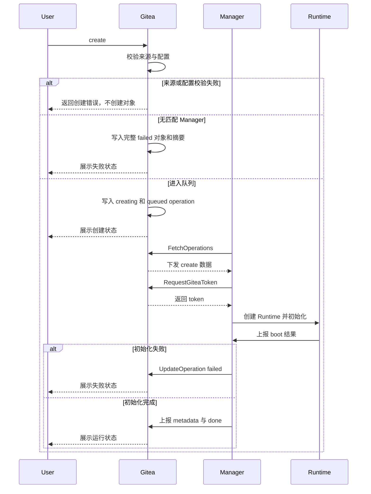

# 生命周期流程

## 创建流程

### Ref 解析

Create 支持：

| 参数 | 说明 |
| --- | --- |
| `ref_type` | `branch` / `tag` / `commit` / `pull` |
| `ref_name` | 用户输入：`branch` → 分支名；`tag` → 标签名；`commit` → 完整 commit SHA；`pull` → 十进制 PR index |

repository ID 来自 Web 路由，最终 `commit_sha` 只由 Gitea 解析。pull index 在服务端规范化为持久 `ref_name/start_ref=refs/pull/{index}/head`。客户端提交 repository ID 或最终 commit 字段时返回参数错误，避免把用户输入误当作已验证来源。

Gitea 校验步骤：

1. 校验 repository 可见性和 code-read 权限。
2. 校验 repository 状态。
3. 打开 git repository 并确认非空。
4. 解析并锁定最终 commit SHA。
5. 校验目标 ref/commit 存在且可解析。
6. PR 入口属于 base repository 页面。

Pull Request 规则：

- PR 入口属于 base repository 页面。
- `ref_type=pull` 时从 Gitea 数据加载 PR。
- base repository 与路由 repository 一致。
- 创建用户具备 base repository code-read 权限。
- head repository 与 base repository 不同时，创建用户同时具备 head repository code-read 权限。
- Gitea 从 PR 数据读取 `base_repo_id`、`head_repo_id`、`base_branch`、`head_branch` 和当前 head commit。
- `commit_sha` 固定为 PR 当前 head commit。
- `start_ref` 使用 `refs/pull/{index}/head` 作为 Manager fetch/checkout 提示。
- operation 使用 base repository clone URL，并以 `start_ref=refs/pull/{index}/head` fetch PR 当前代码；最终 checkout 以 `commit_sha` 为准，并校验 HEAD 等于 `commit_sha`。
- Manager tag matching 和 `.gitea/codespace.yaml` 使用 base repository。

PR 页面属于 base repository 但代码来自 head commit。锁定当前 head commit 防止 head branch 移动导致 workspace 漂移；校验 head repository 可读，防止通过 base repository PR ref 间接访问无权 head repository。codespace token 只绑定 base repository，因此初始化统一通过 base repository 的 pull ref，不使用 head repository clone URL。

### Repository Codespace 配置

配置文件：

```text
.gitea/codespace.yaml
```

当前识别字段：

```yaml
tag: default
```

规则：

- 配置只从 branch tree 读取。
- `ref_type=branch`：读取该 branch。
- `ref_type=pull`：读取 PR base branch。
- `ref_type=tag`：读取 repository default branch。
- `ref_type=commit`：读取 repository default branch。
- 文件缺失等价于 `tag=default`。
- 空仓库在读取配置前返回 empty repository 分类。
- default branch 不存在、目标 branch tree 不可读、配置 blob 不是普通文件时，create 请求返回配置读取错误，不创建 codespace。
- 配置文件超过 `CODESPACE_REPO_CONFIG_MAX_SIZE` 时，create 请求返回配置过大错误，默认上限 64 KiB。
- YAML 非法时，create 请求返回 YAML 解析错误。
- `tag` 缺失或空字符串等价于 `default`。
- 未知字段忽略，create 日志中提示当前只识别 `tag`。
- `tag` 解析后 lower-case。
- `tag` 使用 `[a-z0-9_-]+`，与 Manager tag 匹配保持大小写无关且便于配置。
- `tag` 确定 create 时的 Manager tag matching。stop、resume、delete 按已绑定的 `manager_id` 执行，不看 tag。
- 实际 checkout commit 仍按用户选择的 branch/tag/commit/PR 锁定 SHA。
- `.gitea/codespace.yaml` 中的 `tag` 字段用于选择 Manager。实际 checkout 以用户选择的 branch/tag/commit/PR 确定的 `commit_sha` 为准。
- tag/commit 场景读取 default branch，避免任意历史 commit 改变 Manager 选择。
- PR 场景使用 base branch，让目标仓库维护者控制运行侧选择；实际代码仍按用户选择的 ref 锁定到具体 commit SHA。

配置缺失是正常路径，非法配置是仓库维护者需要修复的问题。Gitea 先完成 repository 权限与状态、ref/commit 锁定和配置解析；这些步骤失败时直接返回 create 页面错误，不插入缺少 `commit_sha` 或 `repo_tag` 的 codespace。只有取得完整 `repo_id/ref_type/ref_name/commit_sha/repo_tag` 后才创建记录。

完整来源数据已经确定但没有已注册 Manager 匹配时，Gitea 先生成规范 Codespace UUID，再创建 `status=failed, manager_id=0` 的完整记录。该记录从未下发 operation，因此 `operation_rversion=0`，operation type/status 为空，operation created/started/deadline、`runtime_generation`、`last_active_unix`、`stopped_unix` 和 token pair 都保持初始 0 或空字符串，`created_unix=updated_unix=now`；`log_filename` 使用 `codespace_log/{codespace_uuid}.log`，日志计数和 index 从空值开始。事务提交后，Gitea 取得 Codespace lock 并重新确认 failed 记录仍存在，再通过内部日志入口尽力写入固定的无匹配 Manager 摘要；记录已经被并发删除时跳过，摘要失败时只记录服务端日志，两者都不回滚 failed 创建事务。进入队列后的 Manager、Runtime、clone 和 boot 失败则在原对象上按 State Finalization 进入 failed。

Manager 匹配查询在创建记录事务中的结果就是本次 create 的判定点。之后并发注册、Declare 或修改 tags 的 Manager 不会把已经创建的 failed 记录恢复为 queued；用户可以查看日志并删除后重新创建。这样无匹配 Manager 的对象既满足真实表的非空约束，也不会伪造从未存在的 operation 版本或引入自动复活规则。

### Manager 匹配

- create 记录固定 `repo_tag`。
- 已注册 Manager 按 owner scope 和 tag 参与匹配。
- global Manager 参与所有 owner scope 的匹配。
- owner scoped Manager 参与相同 repository owner 的匹配；owner 可以是个人用户或组织，组织 ID 使用 Gitea `user.id`。
- 没有已注册 Manager 同时满足 owner scope 和 `repo_tag` 时，create 进入 `failed` 并写入无匹配 Manager 日志。
- 无匹配 Manager 的 failed 记录使用 `operation_rversion=0` 且没有 active operation；之后 Manager 可用性变化不自动复活该记录。
- create 创建时不绑定具体 Manager。
- 具体 `manager_id` 只在某个 Manager 通过 `FetchOperations` 成功领取 create [Operation](glossary.md#operation) 时写入。
- 有匹配 Manager 但全部离线、满载、不调用 `FetchOperations`，或调用 `FetchOperations` 但声明不可接收 create 时，create 保持 `status=creating, operation_status=queued`（参见 [Manager Capacity](glossary.md#manager-capacity)），页面可派生展示为 queued。

owner scope 表达 Manager 管理边界，tag 表达运行能力需求。global Manager 用于站点级容量，owner scoped Manager 用于个人或组织自有容量。

Create operation 领取：

- 领取前：`codespace.status=creating`，`codespace.manager_id=0`，`codespace.operation_type=create`，`codespace.operation_status=queued`。
- `FetchOperations` 通过数据库条件更新完成领取。
- 领取同时写入 `codespace.manager_id`、`codespace.operation_status=running`、`codespace.operation_started_unix`、`codespace.operation_deadline_unix`。
- 领取条件包含 caller Manager online、caller Manager owner scope 匹配、caller Manager 支持 `repo_tag`、本次 `FetchOperations` 声明可接收 create、`codespace.manager_id=0`、`codespace.status=creating`、`codespace.operation_type=create`、`codespace.operation_status=queued`。
- Fetch request 不提交 tags；Gitea 使用认证 Manager 最近一次成功 Declare 保存的 `tags_json`，客户端修改 tags 后只影响之后尚未领取的 create。
- 本次 `FetchOperations` 的 `capacity_available` 大于 0 时才领取 create/resume。
- `capacity_total / capacity_available` 仅用于本次领取判断；Declare 中的同名容量快照由 Gitea 规范化写入 `meta_json`，只用于管理页面展示。
- 领取提交后，operation 通常保持归属于领取它的 Manager；唯一释放路径是同一 Fetch 在 payload 构造失败时按 UUID、版本、Manager 和 running 状态做条件回退。系统错误或响应丢失保留 binding，由下一次 Fetch 重发。
- create payload 中的 `repo_clone_url`、`repo_web_url` 和其他 Gitea 绝对 URL 统一以配置的 `ROOT_URL`（`setting.AppURL`，包含 `AppSubURL`）构造，并使用 payload 构造时重新读取的当前 owner/repository 名称。Fetch 是 Manager 发起的控制面请求，不能用该请求的 Host 或浏览器转发头推导 repository URL；Manager 按 payload 原值使用，部署方负责让 Runtime 可访问配置的 HTTP 或 HTTPS `ROOT_URL`。
- 并发领取失败不是系统错误。
- queued create 在最终条件 UPDATE 中重新确认 repository 仍存在，并使用该语句看到的当前 owner 做 scope 匹配；`repo_tag` 仍使用创建时已经固定的值。repository transfer 与 claim 并发时，claim 先成立则 binding 固定，transfer 先成立则旧 owner Manager 领取失败；领取后 transfer 不再影响 binding。

Create 初始化流程：



### Boot 与 Init

create 的 running operation 是首次环境初始化阶段，页面可派生展示为 `booting`。

Codespace Manager 在 Runtime Instance 启动后以 `init.sh` 作为初始化入口。统一入口可以让 clone、checkout、git 凭据、内部 SSH 和默认 IDE 启动都在同一日志上下文中执行，失败时用户能从一个 codespace 对象页看到完整过程。

`init.sh` 负责：

- 通过 `GET /boot` 获取初始化所需信息
- 配置 git 凭据
- 使用 Git HTTP(S) clone URL clone 或复用 workspace 目录
- fetch 目标 ref
- checkout 到锁定 commit SHA
- 校验 HEAD 等于锁定 commit SHA
- 准备 OpenSSH
- 将 `CODESPACE_GATEWAY_INTERNAL_SSH_PUBLIC_KEY` 写入内部工作用户 `authorized_keys`
- 启动内部 sshd
- 启动默认 Web IDE 或其他本地服务
- 通过 `POST /boot` 上报初始化结果与 internal SSH metadata
- 通过 `/endpoints/{endpoint_id}` 创建、更新或删除 Endpoints

### 环境变量

create 初始化环境变量：

| 环境变量 | 说明 |
| --- | --- |
| `GITEA_REPO_CLONE_URL` | 仓库 Git HTTP(S) clone URL |
| `GITEA_REPO_WEB_URL` | 仓库 Web URL |
| `GITEA_REPO_ID` | 仓库 ID |
| `GITEA_REPO_FULL_NAME` | 仓库完整名称（如 `owner/repo`） |
| `GITEA_OWNER_ID` | 仓库 owner ID |
| `GITEA_OWNER_NAME` | 仓库 owner 名称 |
| `GITEA_OWNER_TYPE` | 仓库 owner 类型（user/org） |
| `GITEA_OWNER_DISPLAY_NAME` | 仓库 owner 展示名称 |
| `GITEA_REF_TYPE` | ref 类型（branch/tag/commit/pull） |
| `GITEA_REF_NAME` | ref 名称 |
| `GITEA_COMMIT_SHA` | 锁定的 commit SHA |
| `GITEA_SERVER_URL` | `RequestGiteaToken` 返回的 Gitea 对外根地址，包含 `AppSubURL` |
| `GITEA_TOKEN_FILE` | Manager 原子刷新的 `0600` 当前 Gitea token 文件路径 |
| `GITEA_TOKEN` | 启动当前 init、Shell 或 IDE 进程时从 token 文件读取的 token 快照 |
| `CODESPACE_UUID` | codespace UUID |
| `CODESPACE_NAME` | 派生名称，格式 `cs-{short_uuid}` |
| `CODESPACE_OWNER_NAME` | codespace 创建者名称 |
| `CODESPACE_REPO_NAME` | 仓库名称 |
| `CODESPACE_WORKSPACE_DIR` | 工作目录路径（由 Manager 注入） |
| `CODESPACE_MANAGER_BASE_URL` | Runtime HTTP API 基础 URL（由 Manager 注入） |
| `CODESPACE_RUNTIME_TOKEN` | Runtime Token（由 Manager 注入） |
| `CODESPACE_GATEWAY_INTERNAL_SSH_PUBLIC_KEY` | Gateway 内部 SSH 公钥 |

环境变量规则：

- `CODESPACE_NAME` 由 `codespace.uuid` 派生（`cs-{short_uuid}`），每次展示时计算。
- `CODESPACE_NAME` 生成规则固定为 `cs-{short_uuid}`，其中 `short_uuid` 取 UUID 去掉 `-` 后前 20 位。
- UI 展示名称使用同一派生规则。
- delete 后 `CODESPACE_NAME` 不复用。
- Runtime Instance name 使用同一 `cs-{short_uuid}` 规则，由 Manager 用 `codespace_uuid` 本地生成。
- `CODESPACE_WORKSPACE_DIR`、`CODESPACE_MANAGER_BASE_URL` 和 `CODESPACE_RUNTIME_TOKEN` 由 Manager 创建 Runtime 时注入。
- Manager 将 `RequestGiteaToken.token` 原子写入 `GITEA_TOKEN_FILE`，文件归 Runtime 用户所有且 mode 为 `0600`；Git credential helper 每次从该文件读取当前值，API 客户端也以该文件作为轮换后的权威凭据。
- `GITEA_TOKEN` 是启动当前 init、Shell 或 IDE 进程时读取的方便值，用于首次 clone/checkout 和开发 API。它不写入通用 `/boot` 响应；长生命周期进程在 stop/resume 后可能仍持有旧环境快照，应重新读取 `GITEA_TOKEN_FILE`，而不能把环境变量当成可刷新的存储。
- `GITEA_SERVER_URL` 与 token 由同一次 `RequestGiteaToken` 响应提供，Manager 不从 clone URL 或内部控制面地址推导。Manager 持久化该地址和 token 文件位置，使 resume 不依赖 repository payload。
- resume 取得新 token 后先原子替换 token 文件并刷新 Manager 控制的 IDE/服务凭据，再上报 `ready`。任意旧进程或磁盘残留的 token 在 stopped/failed/deleting 后已被 Gitea 吊销，不能继续访问 Git/LFS/API；本地清除失败不改变生命周期结果。

Create boot 完成条件：

- `init.sh` 成功。
- workspace checkout 到锁定 commit SHA。
- internal SSH 可被 Gateway 连通。
- Manager 已从 Runtime identity 派生 `internal_ssh.host`，Runtime 上报的 port/user/host-key fingerprint 已通过连通和 host-key 校验。
- 至少一版 Runtime Metadata 被 Gitea 接受。
- Manager 已建立有效 `workspace` 路由；Runtime 声明同名 Endpoint 时连接 Web IDE，未声明时使用默认 Web SSH，两者不改变 Gitea 侧的 `endpoint_id=workspace`。

boot stage 固定为以下顺序：

```text
prepare-runtime
configure-ssh
configure-git
clone-repository
checkout-commit
run-init-script
start-ide
report-endpoints
ready
```

`ready` 是 create 的终态阶段；只有 token、internal SSH 和已声明服务均可用后才上报，Gitea 接受该快照后才允许 create final done。

Resume 不重新执行 create 初始化：Manager 启动已有 workspace、恢复 internal SSH 和本地服务，以高于此前快照的 metadata generation 上报 `credential-refresh`，再调用 `UpdateOperation(done)`；Gitea 不接受旧 `ready` 快照直接完成 resume。Gitea 写入 `running` 后，Manager 保留该 boot 上下文，调用 `RequestGiteaToken` 生成新 token 和 `server_url`、刷新 Runtime token 文件、Git helper 及 Manager 控制的 IDE/API 凭据，最后以更高 metadata generation 上报 `ready`；ready 被接受后结束后置 worker，但最新 boot 终态结果继续保留以支持 `/boot` 响应丢失重试。Manager 重启时若发现 running Runtime 仍处于 `credential-refresh`，继续这些后置步骤而不恢复已完成的 operation。临时错误持续退避，确认无法写入 credential 时停止 Runtime 并主动上报 stopped。resume 不重新读取 repository payload，也不要求 workspace HEAD 等于创建时的 `commit_sha`；ready 前 open/SSH 返回 `runtime_not_ready`。

credential-refresh 在 active operation 已清空后仍属于已绑定 Codespace 的恢复工作，Manager online 或处于有效 recovering 窗口时可继续申请 token。站点排空返回 `state_unavailable` 时，Manager 取消后置 worker、停止 Runtime 并上报 stopped，停止确认失败时上报 failed；Manager 已派生 offline 时先 Declare recovering；Codespace 或 Manager 记录已删除时停止通信但不据此清理 Runtime。

如果 ready 前收到更高 `operation_rversion` 的 stop/delete，Manager 先原子持久化取消旧 credential-refresh worker，再执行新 operation；被取消的旧 worker 不再申请 token、写 Runtime credential 或上报 ready。stop final 会吊销可能已经签发的 token，delete 则按物理删除路径收敛。该优先级让新的 Gitea 指令稳定覆盖旧的 post-final 工作，而不需要增加 boot 状态字段。

实现验收点：

- repository/ref/commit/config 前置失败不创建对象；来源数据完整但无 Manager 匹配时形成可查看日志的 failed 对象，且不创建 active operation。
- 无匹配 Manager 的 failed 记录使用版本 0 和空 operation 字段，之后出现可用 Manager 不会自动复活该记录。
- PR create 只使用 base repository clone URL 和 `refs/pull/{index}/head`，token 不访问 head repository。
- create payload 提供 Runtime 初始化所需的 repository、owner、创建者和 ref 数据；绝对 URL 基于配置的 HTTP/HTTPS `ROOT_URL` 并保留 `AppSubURL`，不受 Manager 控制面请求 Host 影响。
- resume 基于已有 workspace，不读取 repository、不 checkout 初始 commit，并在进入 running 后轮换 Gitea token。
- 每个 boot session 以 `operation_rversion` 标识；同版本、同规范化内容幂等返回第一次结果，同版本不同内容返回 conflict。
- create 仅在 `ready` 快照后 final done；resume 通过 `credential-refresh -> running -> ready` 完成 token 刷新，ready 前不提供交互。
- resume final 后的 `credential-refresh` boot session 可跨 Manager 重启继续，ready 接受前不会因 active operation 已清空而丢失。
- 最新 boot 终态结果保留到更高 boot 版本或 Runtime 删除，相同 POST 在 operation final 后仍可幂等重试。
- 更高版本 stop/delete 会先取消旧 credential-refresh worker，旧 boot 上下文不再产生 token、credential 或 ready 写入。
- credential-refresh 可在 recovering 且无 active operation 时恢复；站点排空收敛到 stopped/failed，offline 先 Declare recovering，记录删除只停止通信。
- Manager 主动启动 stopped Runtime 时也使用 `credential-refresh -> running fact -> token -> ready`，但不创建 operation 或更新用户活跃时间。

## 外部变化

### Repository 删除

Repository archived、migrating、pending transfer、broken、deleted、git 不可读或 ref 不可解析时，只影响 create 的来源校验和后续 Git HTTP(S)、LFS、repository API 访问。已经初始化完成的 workspace 按 Runtime 数据和 Manager binding 继续提供 open、SSH、resume、stop、delete 和 logs；resume 从不读取 repository payload。已领取 create 可能因后续 repository 访问被拒绝而上报 failed，但如果 Manager 已持久化成功 boot 结果、确认 workspace 初始化完成并上报 `ready` metadata，即使 repository 已删除，也可以用当前 `operation_rversion` 上报 done 并进入 running。

repository 删除后 Gitea 不再重发 running create 的 repository payload。Manager 收到 create payload 后必须先持久化 payload、operation 版本和 boot 结果，再启动 worker；Fetch 中已观察到相同版本时继续使用本地数据。Manager 重启后请求恢复 `repo_id=0` 的 running create 时，Gitea 只返回 `recover_create_without_source`：Manager 检查确定性 Runtime、本地 boot 结果和当前 metadata，已初始化完成则补齐 `ready` 快照并上报 done，无法确认或未完成则清理本轮资源并上报 failed。尚未领取且 `repo_id=0` 的 create 不进入候选 payload，最终由 queue timeout 写入 failed 和来源不可用摘要。repository 删除事务本身不直接改写主状态。

Repository 删除：

- repository 删除确认 UI 提示会影响的 codespace 数量。
- repository 删除成功页或确认摘要展示受影响的 codespace 数量。
- `DeleteRepositoryDirectly` 是取得锁并拥有最外层数据库事务的公共入口。入口首先用 Gitea 现有 `db.InTransaction(ctx)` 检查调用 context；已经处于事务时立即返回内部调用错误，避免 `TxContext` 复用外层事务后把无效的内层 `Commit` 误当成已经提交。合法调用先读取当前 `owner_id`，取得当前 owner lock，再取得 `modules/repository.WorkingLockKey(repoID)` 返回的 repository lock，并在锁内重新读取 repository；owner 已变化时释放并按新 owner 重试。所有上层单仓库删除入口复用该入口，不增加 repository Locker 或加锁 wrapper。
- 公共入口在锁内开启短事务并调用 `deleteRepositoryDBLocked(txCtx)`。该私有函数只执行数据库写入，不开启、提交或关闭事务；它在删除 repository row 前执行 `UPDATE codespace SET repo_id=0 WHERE repo_id=?`，完成现有 repository 数据库删除，并返回 `RepositoryCleanupPlan`。任一数据库步骤失败时由公共入口回滚整个事务。
- `RepositoryCleanupPlan` 只携带 Gitea 现有提交后清理所需数据：repository 与 wiki 路径、archives、LFS、attachments、Actions logs/artifacts、avatar，以及是否需要重写 keys。它不是数据库记录、任务或可恢复状态。
- 最外层数据库事务提交成功后，公共入口释放 repository 和 owner lock，再调用 `cleanupDeletedRepository(plan)` 执行既有文件清理。repository 与 Codespace 关系已经由数据库事务确定，文件清理不参与并发判定且可能耗时，因此放在锁外执行。清理失败继续使用对应 Gitea 删除入口现有的日志、system notice 和错误返回方式；某个入口可以在数据库已经提交后向 caller 返回文件清理错误，但不能回滚或恢复已删除的 repository、owner 或 Codespace 关系，也不增加补偿队列。
- 这一拆分保持 Gitea 现有“数据库删除先提交、文件随后清理”的行为，只保证 Codespace 的 `repo_id=0` 与 repository 数据库删除原子提交；它不额外承诺旧文件清理与同名 repository 再创建串行。当前设计不增加 name lock、tombstone、目录重命名或补偿任务，同名创建继续服从 Gitea 现有 repository 服务语义。
- `deleteRepositoryDBLocked` 只在 repository service 包内、调用者已经持有对应 owner 与 repository lock 且明确提供事务 context 时使用。owner purge 逐个取得 repository lock，为每个 repository 开启短事务、调用该私有函数并提交，累计 cleanup plan；它不能在尚未提交的外层 owner/organization 事务中执行文件清理。
- repository 数据库删除不取得 Codespace lock，也不修改主状态、token、日志或 cache。repository lock 已在事务前取得，`CreateCodespace` 记录插入事务也使用同一锁，因此不会在 repository 已置 0 并删除后再插入带旧 `repo_id` 的记录。
- `repo_id=0` 表示来源 repository 已不可再解析。若当前仍有 token，它随后对任何 repository 都会被 repo binding 拒绝；后续进入 `stopped`、`failed`、`deleting` 或物理删除时按状态吊销。
- `CreateCodespace` 记录插入事务把创建者 owner 与 repository owner ID 去重并按升序取得 owner lock，再取得 repository lock，并在事务中重新确认用户和 repository。插入先提交时，后续 repository 删除把记录置 0；repository 删除先提交时，插入重新检查失败且不得创建记录。Fetch queued claim 继续使用现有条件更新确认 repository 存在，不取得 repository lock。
- source repository 删除后，相关 codespace 列表和详情页根据 `repo_id=0` 显示来源 repository 已删除或不可用。
- repository 删除不新增 Codespace 专用通知；Gitea 原有 repository 文件清理失败 system notice 保持不变。

Repository transfer 按是否真正修改 `owner_id` 选择锁范围：创建 pending transfer、取消或拒绝 pending transfer 只取得 repository lock；接受 transfer 以及其他实际修改 `owner_id` 的路径，把原 owner 与新 owner ID 去重并按升序取得 owner lock，再取得 repository lock。pending transfer 只改变 repository 自身的待处理记录，repository lock 足以串行化；实际 owner 变化会改变 owner 删除和 Manager matching 的关系范围，因此同时使用原/新 owner lock。取得锁后重新读取 repository 和 transfer 记录，再执行条件检查与事务，防止使用锁外读取的旧 owner。repository 删除取得当前 owner、repository lock；`CreateCodespace` 记录插入事务取得创建者 owner、repository owner、repository lock；Fetch queued claim 不取得 repository lock。transfer 不改写已有 Codespace 主状态、Manager binding、token 或 workspace；提交后尚未领取的 create 按新 owner 匹配 Manager，已领取 create 和既有 Codespace 保持原 Manager binding。owner 删除使用 repository 当前 owner，因此 transfer 后 repository 关系跟随新 owner，原 owner 只可能继续通过 Codespace 创建者或 Manager owner 关系触发清理。当前设计不保存 transfer 历史。


### 用户与组织删除

用户或组织普通删除先执行 Gitea 现有业务前置检查；已知前置条件通过后取得 owner lock，并在锁内再次检查。删除服务持续持有 owner lock 以稳定 Codespace 创建、Manager 注册、repository owner 变化和 registration token 变更，同时最多再持有一个 Manager lock 和一个 Codespace lock，并用短事务提交当前子对象的本地清理。全部关联资源清空后，最终短事务再次检查现有删除条件和关系集合并删除用户或组织记录。这样删除范围保持确定，同时持锁数量和事务体积不随 Codespace 数量增长。

五个外部删除入口统一进入上述服务顺序：用户自助 Web 删除、管理员 Web 删除用户、管理员 API 删除用户、组织 Web 删除和组织 API 删除。inactive-user Cron 也调用用户删除服务；用户 purge 因 last owner 触发组织删除时调用组织删除服务。入口只负责参数、权限和错误适配，不在 router 中直接删除 owner、repository 或 Codespace 数据，因此 Web、API、Cron 和 purge 不会形成不同的清理边界。

普通删除和 purge 都沿用 Gitea 的分阶段提交方式，不把整个清理包装成一个长事务：

- 用户 purge 取得用户 owner lock，先在短事务中禁用用户并提交；随后按下述有界流程删除当前通过创建者、repository owner 或 Manager owner 关系关联的 Codespace、Manager、registration token、token 和日志。
- 用户自己的 repository 按 ID 升序逐个处理：每次只取得一个 repository lock，在短事务中调用 `deleteRepositoryDBLocked`，由 purge 调用方提交该 repository 的数据库删除，再释放 repository lock 并累计 `RepositoryCleanupPlan`。全部 repository 数据库删除完成后释放用户 owner lock，再逐个执行 repository 与 Codespace 的锁外清理。
- 用户 purge 随后沿用 Gitea 现有组织成员与 package 清理。最后重新取得用户 owner lock，在最终短事务中重检剩余前置条件并删除用户记录；由 last owner 触发的组织删除进入该组织自己的删除流程和 owner lock。
- 组织 purge 取得组织 owner lock，先按下述有界流程清理 Codespace 资源；再按 repository ID 升序逐个取得 repository lock、提交数据库删除、释放 repository lock，并累计 `RepositoryCleanupPlan`。repository 数据库删除完成后，在仍持有 owner lock 的最终短事务中重检 repository/package 等剩余前置条件并删除组织记录；提交并释放 owner lock 后执行所有 repository 与 Codespace 锁外清理。
- `DeleteOrganization` 在开启组织记录的最终事务前完成逐仓库删除，不在外层事务中调用 `DeleteRepositoryDirectly`。repository 数据库删除使用上述逐仓库短事务，避免 Gitea `TxContext` 复用外层事务后，内层提交实际未生效却提前执行文件清理。
- owner lock 内按 Manager ID keyset 升序逐个处理该 owner 的 Manager。每个 Manager 取得 Manager lock 后，按完整 UUID keyset 每批至多 100 条查询绑定 Codespace；每条 Codespace 单独取得 Codespace lock，在短事务中重新检查 `manager_id` 后删除 access token、明文 binding、DBFS 日志元数据和 Codespace 记录。绑定集合为空后用另一个短事务重检并删除 Manager，再释放 Manager lock。
- owner 自有 Manager 清理完成后，按完整 UUID keyset 每批至多 100 条查询仍通过创建者、repository owner 或 Manager owner 任一关系命中的 Codespace。查询时已绑定非零 Manager 的记录先取得该 Manager lock，再取得 Codespace lock；未绑定记录只取得 Codespace lock。短事务重检三条 owner 关系和当前 binding 后删除；关系已经变化的记录跳过并由下一次查询按当前事实决定。这样已经绑定的记录与 Fetch、inventory 和 Manager 删除形成明确先后。未绑定 create 的 claim 不取得 owner 或 Codespace lock，数据库条件写入与物理删除只会得到“先 claim 后随记录删除”或“先删除后 claim 影响 0 行”两种结果；前一种情况下 Manager 可能已取得 create payload 并留下运行侧资源，这仍属于本节明确接受的本地残留，不是 owner 删除向 Manager 发送的清理指令。
- Codespace 清空后用短事务删除 owner scope registration token；最终 owner 事务必须再次确认关联 Manager、Codespace 和 registration token 均为空。repository 删除、实际 transfer、`CreateCodespace` 记录插入、Manager 注册和 registration token 轮换参与同一 owner lock，因此不会在清理完成与 owner 删除之间创建新的关联资源。
- 每个子事务提交并释放该子 lock 后，尽力清除该 Codespace 的 Runtime Metadata 和未消费 open code cache；每批最多保留 100 条待清理输入。cache 或已有事务后文件清理失败只记录服务端日志，不恢复已经删除的 Gitea 数据，也不创建持久任务。
- Codespace access token 通过生命周期内部删除入口先行清理，再执行 Gitea 现有用户 access-token 删除步骤。该顺序避免通用 PAT 删除保护返回冲突，也避免当前 owner 删除流程先把 repository 关联置 0。
- 用户或组织删除期间不创建 stop/delete operation，不调用 ManagerService，不读取 Manager runtime state，也不等待 Runtime 回收。Gitea 删除结果只表示 Gitea 持久资源已经清理。
- Manager 端可能继续保留 Runtime 或本地快照；这不会破坏 Gitea 数据。owner Manager 的身份记录已删除，后续 RPC 认证失败；其他 Manager 后续 inventory 上报已删除 UUID 时，Gitea 因无记录而忽略该项，不返回 `cleanup_local_runtime`。
- 普通 repository 删除仍使用上一节的弱关联规则。若 repository 在 owner 删除之前已被单独删除，其 Codespace 的 `repo_id` 已为 0，之后不再与原 repository owner 关联；删除原组织时仅在创建用户或绑定 Manager owner 关系仍匹配时清理。继续追踪原 owner 需要新增来源 owner 历史字段，当前设计明确不保存该关系。
- 站点级 `owner_id=0` Manager 和 registration token 不属于任何 owner 删除事务，由站点管理员单独管理。

Codespace 以创建用户、来源 repository 和绑定 Manager 三条现有关系判定用户或组织删除范围，不新增 owner 字段。账户删除本身已经使这些 Gitea 对象失去可管理主体或通信身份，直接清理 Gitea 资源比生成无法保证被领取的 Manager operation 更确定；运行侧残留由 Manager 本地运维处理，不再反向影响 Gitea。

**设计说明（有意如此，容易产生歧义）：用户或组织删除是有界、分阶段提交的 Gitea 本地清理，不是跨全部子对象的原子事务。**删除成功只在最终 owner 记录和目标关联资源均已删除后返回；任一数据库子步骤失败时返回错误，已经提交的子对象保持删除，owner 记录保留，重试从剩余关系继续。已知业务前置条件在第一条破坏性清理前检查，避免可预见的拒绝造成部分清理；清理期间其他 Gitea 业务变化导致最终重检失败时，仍按上述可重试结果处理。这个边界与 Gitea purge 的既有分阶段行为一致，也避免为包装成单一事务而引入长事务、删除队列或墓碑。

Manager 是否在线、是否收到请求、是否删除 Runtime 不属于删除结果。删除后，Manager 身份失效或 Codespace UUID 不再存在，旧 Manager 无法通过认证和 binding 校验改写 Gitea；其他 Manager 上报未知 UUID 时也不会收到破坏性指令。因此设计不增加分布式删除确认、等待状态、重试队列、删除墓碑或 orphan Runtime 回收任务。用户在确认删除时明确接受运行侧可能保留 Runtime、volume 或本地快照，其后续处理属于 Manager 部署运维。

### Manager 删除

Manager 删除是 Gitea 侧同步管理操作。个人 owner、组织管理员或站点管理员提交删除并确认影响范围后，服务取得对应 owner lock 和目标 Manager lock，然后执行有界的本地清理：

1. 按完整 UUID keyset 每批至多 100 条查询 `manager_id` 当前绑定的 Codespace。
2. 每次只取得一个 Codespace lock，在短事务中重新检查 Manager 记录和 `manager_id` binding，再删除该 Codespace 的 access token、明文 binding、DBFS 日志元数据和数据库记录。
3. 提交并释放该 Codespace lock 后尽力清除相关 Runtime Metadata 和未消费 open code cache，然后继续下一条；清理失败只记录服务端日志。
4. 查询不到绑定 Codespace 后，用最终短事务再次确认集合为空并删除 Manager 记录及其 secret verifier。
5. 提交最终事务，释放 Manager 和 owner lock。

删除服务需要串行化时直接调用 Gitea `globallock.Lock`，不实现 Codespace Locker 或 mutex pool。完整层级是 `codespace_manager_addresses`、按 `owner_id` 升序的 `codespace_owner_{owner_id}`、按 `repository_id` 升序的 `repo_working_{repo_id}`、按 `manager_id` 升序的 `codespace_manager_{manager_id}`、`codespace_{uuid}`。删除流程持续持有父级 owner/Manager lock，但同一时刻最多持有一个子级 Codespace lock；不预先收集或同时持有全部子锁。Fetch 和 ReportInstances 持有 Manager 后按需取得 Codespace；单 Codespace command RPC 只取得 Codespace lock，并在锁内事务中重新确认 Manager 记录、binding 和版本，因此不会形成 Codespace 反向等待 Manager 的锁环。每个子事务开始前取得对应 lock，提交后先释放子 lock，再尽力清理 cache；数据库记录已经不存在，后续请求取得 lock 后重新查询也不能重建资源。持锁期间不调用 Manager、Gateway 或其他网络服务。

Codespace 功能只支持单个活动 Gitea 进程。上述路径直接复用站点配置的 Gitea `globallock` backend，Gateway Open Code 和 Runtime Metadata 直接复用 Gitea cache adapter；配置 Redis 只沿用 Gitea 现有后端，不增加多实例协调或支持范围。固定锁序、锁内数据库重读和条件更新共同处理并发；cache 清理失败不改变数据库删除结果，也不需要增加 `deleting manager` 状态。

该流程不检查 online/offline/recovering，不创建 stop/delete operation，也不调用或等待 Manager。删除成功后旧身份调用 ManagerService 返回 `manager_unregistered`；Manager 侧可能保留 Runtime、volume、进程或本地快照，这属于用户确认时已经接受的运行侧结果，不影响 Gitea 删除成功。registration token 属于 owner scope，可供同一 owner 注册其他 Manager，因此单独删除一个 Manager 时保留 registration token；用户或组织删除时再按上一节删除整个 scope 的 token。数据库子步骤失败时，已经提交的 Codespace 保持删除，Manager 记录保留；相同删除请求重试剩余 binding，直到最终事务删除 Manager。

**设计说明（有意如此，容易产生歧义）：Manager 删除对调用方是同步完成的管理操作，但内部使用多个可重试短事务。**成功响应表示 Manager 及其当时绑定的 Gitea 资源均不存在；失败响应可能已经清理部分子对象，但不会留下 `manager_id` 指向已删除 Manager 的记录。该语义用父记录充当自然的重试边界，在最多 10000 个 Runtime 的上限下避免一次持有全部 Codespace lock 或执行超大事务。

**设计说明（有意如此）：单个 Manager 现在和以后均没有 enable、disable、pause 或 quarantine 状态。** 临时停止领取新 create/resume 由 Manager 在 Fetch 中上报零容量或不接受对应 operation 类型；永久撤销身份使用本节的直接删除。Manager 删除与用户或组织删除使用同一边界：Gitea 只提交本地资源清理，不建立分布式回收协议。

### 重命名

- 记录关联以 ID 为准。
- 名称每次展示时解析。
- create operation 返回数据使用当时的当前名称生成 clone/web URL；resume 基于已初始化 workspace，不重新生成 repository payload。
- 显示缓存和 runtime 动态数据按需从 cache 或 Manager 获取，每次展示时计算。

实现验收点：

- repository 数据库删除事务在删除 repository row 前把 `repo_id` 写为 0，不创建 operation、不吊销 token、不改主状态；提交并释放 lock 后才执行既有文件 cleanup。
- `DeleteRepositoryDirectly` 收到已处于数据库事务中的 context 时拒绝执行；强制数据库回滚不会删除 repository 文件或清理 cache。
- `deleteRepositoryDBLocked` 只接受 repository service 内部的事务 context 并返回 cleanup plan，不自行提交事务或执行文件清理；组织 purge 在最终组织事务开始前完成逐仓库删除。
- repository 文件 cleanup 沿用各 Gitea 删除入口现有的提交后清理和错误返回语义；无论 caller 最终收到成功还是提交后的清理错误，已提交的 `repo_id=0` 和数据库删除都不恢复，Codespace 不增加同名 repository 重建锁、墓碑或补偿任务。
- `CreateCodespace` 记录插入事务与 repository 删除使用同一 repository lock，不能形成 repository 已删除但新记录仍保留旧非零 `repo_id` 的结果。
- 已初始化 codespace 在 repository 或访问权限变化后仍可 open、SSH、resume、stop、delete 和读取日志。
- repository 删除后不重发 create 来源 payload；本地已确认初始化完成的 running create 可以 final done，无法确认的 create final failed。
- 用户或组织删除在任何 owner repository 删除前，以每批至多 100 条、每个 Codespace 一个短事务的方式清理当时仍由三条关系关联的 Codespace、access token、日志、Manager 和 registration token。
- Fetch 与 Manager 删除、owner 对已绑定 Codespace 的清理通过同一 Manager lock 排序；每个短事务重新查询后，不会留下 `manager_id` 指向已删除 Manager 的 Codespace。
- 已单独删除 repository 的 `repo_id=0` Codespace 不再跟随原 repository owner 删除；创建者和 Manager owner 关系仍正常生效。
- repository 数据库删除不取得 Codespace lock；repository lock 保证与创建记录并发时只产生插入先提交后被置 0，或 repository 删除先提交后插入拒绝两种结果。
- pending repository transfer 的创建、取消和拒绝只使用 repository lock；接受或其他实际 owner 变更使用原 owner、新 owner 和 repository lock，并在锁内重读当前记录。
- 用户/组织普通删除的已知前置条件失败时不清理 Codespace；分阶段清理后，最终事务在 owner lock 内重检空集合并删除 owner。中途失败保留 owner 和未处理子对象，重试继续清理，已经提交的子对象不恢复。
- 用户/组织 purge 在第一条 owner repository 删除前提交 Codespace 前置清理，repository 按 ID 逐个使用短事务删除，锁外执行 `RepositoryCleanupPlan`，并按 Gitea 既有分阶段语义完成最终 owner 删除。
- 五个 Web/API 删除入口、inactive-user Cron 和 user purge 的 last-owner 组织删除都进入同一用户或组织删除服务，不在 router 或调用方复制清理事务。
- 用户或组织删除不创建 operation、不向 Manager 发指令，也不等待或判断 Manager 状态。
- 用户或组织删除完成后，并发旧 RPC 不能重新写入已删除记录、token 或 cache。
- 每个 Codespace 子事务提交并释放对应子 lock 后尽力清除相关 cache；未知 UUID 的后续 inventory 不触发运行侧清理。
- Manager 删除按 UUID keyset 分批、逐 Codespace 短事务同步清理 binding、token 和日志，空集合复检后再删除 Manager；不检查 Manager 状态，也不向 Manager 发送指令。
- 与删除并发的已认证 RPC 必须在同一 keyed lock 内重新检查记录和 binding，删除完成后不能重建 Gitea 资源。
- 所有路径按 Gateway/SSH 地址、owner、repository、Manager、Codespace 的固定层级取得所需 lock；删除流程保持父级 lock、一次只取得一个 Codespace 子锁，应用锁均在对应短事务开始前取得，压力测试下不发生锁顺序反转或随子对象数量增长的同时持锁。
- 每个删除阶段在数据库事务提交后先释放对应 `globallock`，再尽力执行 cache 或文件清理；后续请求通过锁内数据库重读拒绝，不因清理移出临界区而重建资源。
- 单独删除 Manager 时保留 owner scope registration token；用户或组织删除时删除该 scope 的全部 Manager 和 registration token。
- 删除确认页展示将删除的 Manager、Codespace 数量以及运行侧资源可能保留的结果。
