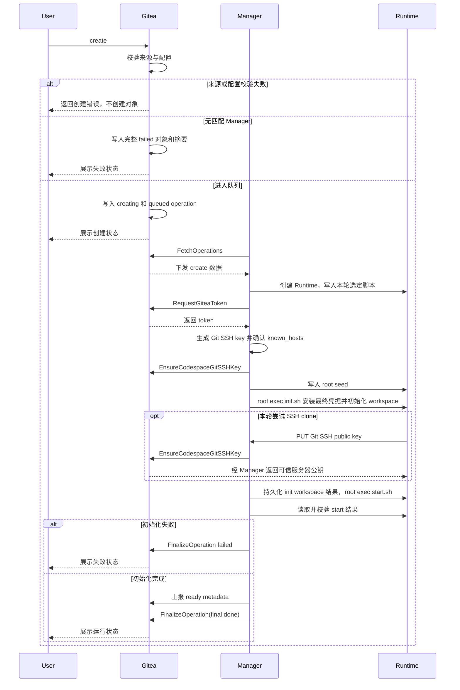
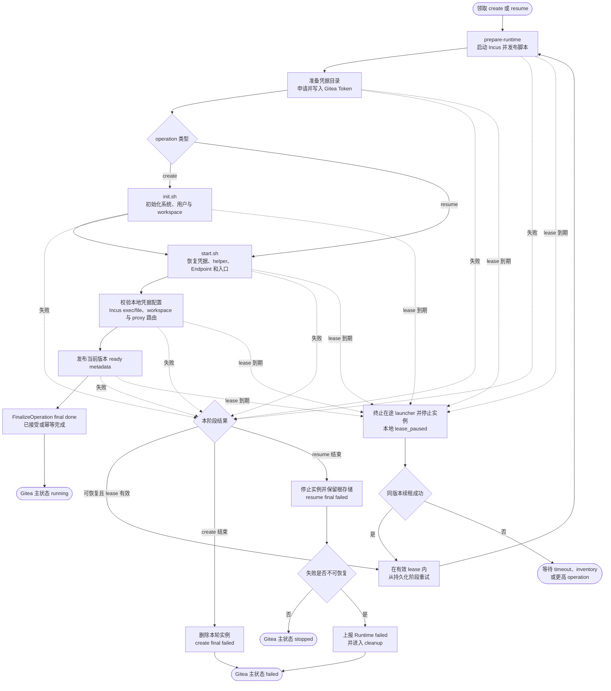
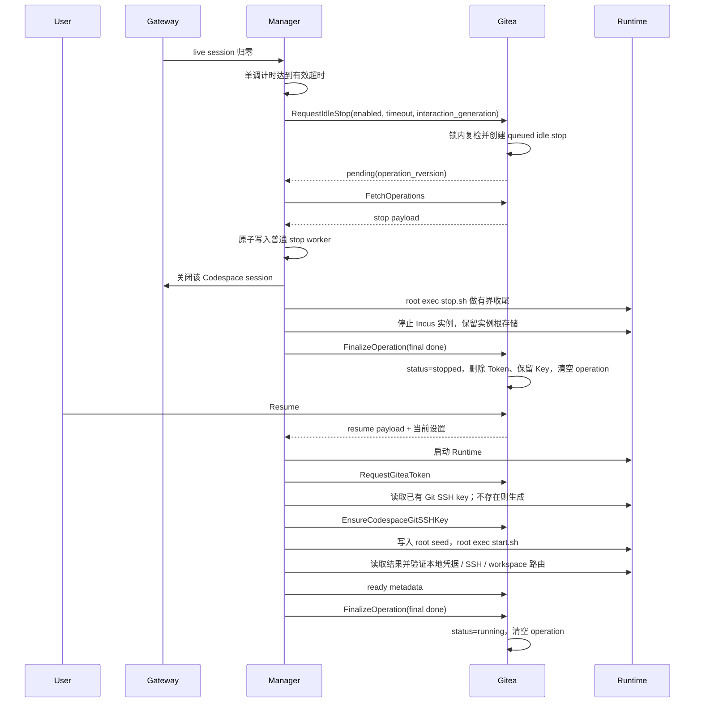

# 生命周期流程

## 创建流程

### Ref 解析

Create 支持：

| 参数 | 说明 |
| --- | --- |
| `ref_type` | `branch` / `tag` / `commit` / `pull` |
| `ref_name` | 用户输入：`branch` → 分支名；`tag` → 标签名；`commit` → 完整 commit SHA；`pull` → 十进制 PR index |

repository ID 来自 Web 路由，最终 `commit_sha` 只由 Gitea 解析。pull index 在服务端规范化为持久 `ref_name/start_ref=refs/pull/{index}/head`。客户端提交 repository ID 或最终 commit 字段时返回参数错误，避免把用户输入误当作已验证来源。

Gitea 校验步骤：

1. 校验 repository 可见性和 code-read 权限。
2. 校验 repository 状态。
3. 打开 git repository 并确认非空。
4. 解析并锁定最终 commit SHA。
5. 校验目标 ref/commit 存在且可解析。
6. PR 入口属于 base repository 页面。

Pull Request 规则：

- PR 入口属于 base repository 页面。
- `ref_type=pull` 时从 Gitea 数据加载 PR。
- base repository 与路由 repository 一致。
- 创建用户具备 base repository code-read 权限。
- head repository 与 base repository 不同时，创建用户同时具备 head repository code-read 权限。
- Gitea 从 PR 数据读取 `base_repo_id`、`head_repo_id`、`base_branch`、`head_branch` 和当前 head commit。
- `commit_sha` 固定为 PR 当前 head commit。
- `start_ref` 使用 `refs/pull/{index}/head` 作为 create 脚本准备 workspace 的提示。
- operation 使用 base repository clone URL，并以 `start_ref=refs/pull/{index}/head` fetch PR 当前代码；最终 checkout 以 `commit_sha` 为准，并校验 HEAD 等于 `commit_sha`。
- Manager tag matching 和 `.gitea/codespace.yaml` 使用 base repository。

PR 页面属于 base repository，但初始化代码来自创建时解析出的 head commit。Gitea 把该 commit SHA 固定写入 create 数据，使 head branch 后续移动不会改变本次 workspace 内容；同时校验创建用户对 head repository 有读取权限。base repository 是 Codespace 的源仓库，初始化通过其 pull ref 读取该 commit；后续访问外部 head 时仍按本章的附加仓库权限确认规则处理。

### Repository Codespace 配置

配置文件：

```text
.gitea/codespace.yaml
```

当前识别字段：

```yaml
tag: default
permissions:
  repositories:
    owner/dependency:
      code: read
      issues: write
```

规则：

- 配置只从 branch tree 读取。
- `ref_type=branch`：读取该 branch。
- `ref_type=pull`：读取 PR base branch。
- `ref_type=tag`：读取 repository default branch。
- `ref_type=commit`：读取 repository default branch。
- 文件缺失等价于 `tag=default`。
- 空仓库在读取配置前返回 empty repository 分类。
- default branch 不存在、目标 branch tree 不可读、配置 blob 不是普通文件时，create 请求返回配置读取错误，不创建 codespace。
- 配置文件超过 `CODESPACE_REPO_CONFIG_MAX_SIZE` 时，create 请求返回配置过大错误，默认上限 64 KiB。
- 配置必须是单个 YAML document，顶层为 mapping；YAML 非法、出现第二个 document、重复字段或 `tag` 字段类型错误时，create 请求返回配置解析错误。
- Gitea 解析 `tag` 和 `permissions.repositories`；其他字段仍随完整正文交给 Manager 保存到本地 state，并写入 Runtime 固定配置文件供 init/start 使用。
- `tag` 缺失或空字符串等价于 `default`。
- `tag` 解析后 lower-case。
- `tag` 使用 `[a-z0-9_-]+`，与 Manager tag 匹配保持大小写无关且便于配置。
- `tag` 确定 create 时的 Manager tag matching。stop、resume、delete 按已绑定的 `manager_id` 执行，不看 tag。
- 实际 checkout commit 仍按用户选择的 branch/tag/commit/PR 锁定 SHA。
- `.gitea/codespace.yaml` 中的 `tag` 字段用于选择 Manager。实际 checkout 以用户选择的 branch/tag/commit/PR 确定的 `commit_sha` 为准。
- tag/commit 场景读取 default branch，避免任意历史 commit 改变 Manager 选择。
- PR 场景使用 base branch，让目标仓库维护者控制运行侧选择；实际代码仍按用户选择的 ref 锁定到具体 commit SHA。
- `permissions.repositories` 使用精确 `owner/repository` 名称，最多申请 32 个仓库、合计 128 条规则；单元只接受 `code / issues / pulls / wiki / releases / actions`，级别只接受 `read / write`。
- 源仓库权限来自创建者当前的 Gitea 权限，不在 `permissions.repositories` 重复申请。附加仓库申请在创建确认页逐项展示；用户可以按申请值确认、把 `write` 降为 `read`，或选择不授权。
- Gitea 在展示确认页时完成无副作用的解析和权限检查。用户确认后，Gitea 取得 repository working lock，重新读取 ref、配置提交和附加权限，只有确认摘要仍一致才创建 Codespace 和授权记录。
- `config_commit_sha` 保存确认时读取配置的完整提交 SHA。create operation 始终从该提交读取正文，因此用户确认后的分支移动不会改变已经批准的权限或下发给 Manager 的配置。
- 授权确认只保存在 Gitea；Manager 收到完整配置正文供运行环境使用，但不接收、不解释 Gitea 仓库授权记录。

配置缺失是正常路径，非法 YAML、非法 `tag` 或无权确认的附加仓库申请是仓库维护者或创建者需要处理的明确错误。**设计如此：repository 配置文件同时承担运行环境选择、运行环境正文和附加仓库权限申请，但权限决定仍只由 Gitea 用户确认。**这样仓库可以声明开发环境需要什么，用户可以看清并缩减授权，Manager 又无需成为第二个仓库权限系统。未知字段继续随正文下发，Gitea 只理解自己负责的 `tag` 与 `permissions`。Gitea 先完成 repository 权限与状态、ref/commit 锁定、配置解析、权限确认和站点 Git 传输配置校验；这些步骤失败时不插入 Codespace。Git 协议不是仓库配置项，也不保存到 Codespace 表；Manager 领取 create 时由 Gitea 按当前站点 Git 接入能力构造 payload。

实现验收点：

- 创建确认页展示源仓库、锁定 ref、环境 tag 和每条附加仓库单元权限；`write` 可降为 `read` 或 `none`，`read` 可降为 `none`。
- 确认前没有 Codespace、授权或 operation 数据写入；确认摘要过期时返回重新审阅提示。
- 创建成功后 `commit_sha` 固定工作区代码，`config_commit_sha` 固定已审阅配置，两者分别承担自己的用途。
- 相同用户、源仓库、申请摘要和相同授权级别可以复用授权；已经降权或撤销的授权不会被新创建流程自动提升。
- Manager 收到原始配置正文，但协议和 Manager state 中没有 Gitea 附加仓库授权副本。

完整来源数据已经确定但没有已注册 Manager 匹配时，Gitea 先生成规范 Codespace UUID，再创建 `status=failed, manager_id=0` 的完整记录。该记录从未下发 operation，因此 `operation_rversion=0`，operation type/status/trigger 为空，operation created/started/deadline、`runtime_generation`、`interaction_generation`、`last_active_unix` 和 `stopped_unix` 都保持初始 0，也不创建 `codespace_gitea_token` 行；`created_unix=updated_unix=now`，`log_filename` 使用 `codespace_log/{codespace_uuid}.log`，日志计数和 index 从空值开始。事务提交后，Gitea 取得 Codespace lock 并重新确认 failed 记录仍存在，再通过内部日志入口尽力写入固定的无匹配 Manager 摘要；记录已经被并发删除时跳过，摘要失败时只记录服务端日志，两者都不回滚 failed 创建事务。进入队列后的 Manager、Runtime、clone 和 boot 失败则在原对象上按 State Finalization 进入 failed。

Manager 匹配查询在创建记录事务中的结果就是本次 create 的判定点。之后并发注册、Declare 或修改 tags 的 Manager 不会把已经创建的 failed 记录恢复为 queued；用户可以查看日志并删除后重新创建。这样无匹配 Manager 的对象既满足真实表的非空约束，也不会伪造从未存在的 operation 版本或引入自动复活规则。

### Manager 匹配

- create 记录固定 `environment_tag`。
- create 记录不保存 `git_protocol`；Manager 匹配不按协议分组，领取后按 payload 中本次计算出的协议和 clone URL 执行初始化。
- 已注册 Manager 按创建者用户和 tag 参与匹配。
- 站点全局 Manager 参与全部个人用户的匹配。
- 个人 Manager 只参与 `codespace.user_id` 与其 `user_id` 相同的匹配；repository 可以属于个人用户或组织。
- 没有已注册 Manager 同时满足创建者范围和 `environment_tag` 时，create 进入 `failed` 并写入无匹配 Manager 日志。
- 无匹配 Manager 的 failed 记录使用 `operation_rversion=0` 且没有 active operation；之后 Manager 可用性变化不自动复活该记录。
- create 创建时不绑定具体 Manager。
- 具体 `manager_id` 只在某个 Manager 通过 `FetchOperations` 成功领取 create [Operation](glossary.md#operation) 时写入。
- 有匹配 Manager 但全部离线、满载、不调用 `FetchOperations`，或调用 `FetchOperations` 但声明不可接收 create 时，create 保持 `status=creating, operation_status=queued`（参见 [Manager Capacity](glossary.md#manager-capacity)），页面可派生展示为 queued。

`user_id` 表达 Manager 管理边界，tag 表达运行能力需求。站点全局 Manager 用于站点级容量，个人 Manager 用于该用户自有容量。repository 中可被 create 读取的配置能够选择合格 Manager 已声明的任一 tag，因此 tag 不承担用户授权或信任等级判断。站点全局 Manager 的每个 tag 都适用于站点范围内有权创建 Codespace 的仓库代码；个人 Manager 的每个 tag 都适用于该用户有权读取的仓库代码。需要不同信任边界的环境由部署管理员使用独立 Manager 身份管理，不把该环境的 tag 声明到不适用的创建范围。

**设计如此：tag 选择开发能力，不授予额外权限。**仓库内容可以影响工具链、架构和资源模板，但不能依靠“用户不会选择某个 tag”保护宿主资源或长期凭据。这个边界保留 repository 自主选择开发环境的能力，同时让运行安全由 Manager 的部署范围明确承担，无需增加难以维护的 tag ACL。

Create operation 领取：

- 领取前：`codespace.status=creating`，`codespace.manager_id=0`，`codespace.operation_type=create`，`codespace.operation_status=queued`，`codespace.operation_trigger=user`。
- `FetchOperations` 通过数据库条件更新完成领取。
- 领取同时写入 `codespace.manager_id`、`codespace.operation_status=running`、`codespace.operation_started_unix`、`codespace.operation_deadline_unix`。
- 领取条件包含 caller Manager online、caller Manager 为站点全局或属于 Codespace 创建者、caller Manager 支持 `environment_tag`、本次 `FetchOperations` 声明可接收 create、`codespace.manager_id=0`、`codespace.status=creating`、`codespace.operation_type=create`、`codespace.operation_status=queued`。
- Fetch request 不提交 tags；Gitea 使用认证 Manager 最近一次成功 Declare 保存的 `tags_json`，客户端修改 tags 后只影响之后尚未领取的 create。
- 本次 `FetchOperations` 的 `startup_capacity_available` 大于 0 时才领取 create/resume。
- Fetch 使用本次 `startup_capacity_available` 限制 create/resume，并另行提交 `cleanup_capacity_available` 限制 stop/delete；Gitea 使用最近成功 Declare 的 `startup_capacity_total` 校验启动容量范围。Declare 容量同时用于管理页面展示和诊断，清理容量只属于单次 Fetch。
- 领取提交后，operation 保持归属于领取它的 Manager；同一 Fetch 在 payload 构造失败时按 UUID、版本、Manager 和 running 状态做条件回退。系统错误或响应丢失保留 binding 和原 deadline，Manager 未持久化上下文时由普通 timeout 收敛。
- create payload 中的 `repo_web_url` 和其他 Web URL 以配置的 `ROOT_URL`（`setting.AppURL`，包含 `AppSubURL`）构造；`repo_clone_http_url` 与 `repo_clone_ssh_url` 由 Gitea 现有仓库克隆地址生成器分别产生规范 HTTP(S) 和 SSH clone URL，只有对应 clone 能力可用时才非空。三类 URL 都使用 payload 构造时重新读取的当前 owner/repository 名称。Fetch 是 Manager 发起的控制面请求，不能用该请求的 Host 或浏览器转发头推导对外地址；Manager 按 payload 原值注入，`git_protocol` 表示本次 create 的首次首选项，并且必须对应一个非空 clone URL。内置 `init.sh` 在首选地址的 clone/fetch 非零退出且另一种 URL 非空时清理当前受控临时 workspace 并重试；同一 operation 恢复时，已提交且 HEAD 等于锁定 SHA 的 workspace 被视为 init 已完成。本地前置错误和 HEAD 校验失败不切换协议；自定义脚本可以选择任一非空地址。部署方负责让 Runtime 可访问已启用的 Git 接入面和 Web URL。
- 并发领取失败不是系统错误。
- queued create 在最终条件 UPDATE 中重新确认 repository 仍存在，并使用该语句看到的当前 owner 做 scope 匹配；`environment_tag` 仍使用创建时已经固定的值。repository transfer 与 claim 并发时，claim 先成立则 binding 固定，transfer 先成立则旧 owner Manager 领取失败；领取后 transfer 不再影响 binding。

Create 初始化流程：


```mermaid
sequenceDiagram
    participant U as User
    participant G as Gitea
    participant M as Manager
    participant R as Runtime

    U->>G: create
    G->>G: 校验来源与配置
    alt 来源或配置校验失败
        G-->>U: 返回创建错误，不创建对象
    else 无匹配 Manager
        G->>G: 写入完整 failed 对象和摘要
        G-->>U: 展示失败状态
    else 进入队列
        G->>G: 写入 creating 和 queued operation
        G-->>U: 展示创建状态
        M->>G: FetchOperations
        G-->>M: 下发 create 数据
        M->>R: 创建 Runtime，写入本轮选定脚本
        M->>G: RequestGiteaToken
        G-->>M: 返回 token
        M->>M: 生成 Git SSH key 并确认 known_hosts
        M->>G: EnsureCodespaceGitSSHKey
        M->>R: 写入 root seed
        M->>R: root exec init.sh 安装最终凭据并初始化 workspace
        opt 本轮尝试 SSH clone
            R->>M: PUT Git SSH public key
            M->>G: EnsureCodespaceGitSSHKey
            G-->>R: 经 Manager 返回可信服务器公钥
        end
        M->>R: 持久化 init workspace 结果，root exec start.sh
        M->>R: 读取并校验 start 结果
        alt 初始化失败
            M->>G: FinalizeOperation failed
            G-->>U: 展示失败状态
        else 初始化完成
            M->>G: 上报 ready metadata
            M->>G: FinalizeOperation(final done)
            G-->>U: 展示运行状态
        end
    end
```

### 系统初始化与环境启动

create 的 running operation 是首次环境初始化阶段，页面可派生展示为 `booting`。

Manager 创建或启动 Incus 实例并确认 file/exec API 可用后，原子发布本次 operation 固定使用的 `init.sh`、`start.sh` 和 `stop.sh`。create 先以 root 执行 `init.sh` 完成系统、凭据和首次 workspace 初始化，再执行 `start.sh` 完成本次启动；resume 不重新运行 init，只执行同一个 `start.sh` 恢复已有 workspace 的当前凭据、helper、Endpoint 和脚本私有入口。stop 先执行 `stop.sh` 做有界收尾，脚本成功时保存本次共享环境，再执行 Incus stop；脚本失败只写日志并保留旧共享环境。三个脚本共享 `flock` 和 `CODESPACE_ENV`，stdout/stderr 进入同一 operation 日志；每次调用使用独立结果文件，Manager 只在结果与共享环境同时通过校验后推进本地阶段。**设计如此：**首次 clone 是 create 初始化的一部分，失败时应通过 init 的明确结果闭环；首次启动和恢复启动本质相同，都只面对已经存在的 workspace，不负责再次解释 repository payload。stop 的目标是得到可恢复的 stopped 实例，因此成功环境必须持久化；脚本失败不阻止停止，是为了让用户停止请求优先收敛。

脚本可以使用 Manager 内置版本，也可以由部署方通过本地配置替换。Manager 核心固定消费 init、start、stop、共享环境和通用输出；软件包管理器、工作用户名称、直接运行、devcontainer、内部容器和端口转发都由具体脚本实现。完整契约、当前内置实现和 devcontainer 案例见[脚本契约、内置实现与 devcontainer 案例](builtin-scripts.md)。

**设计如此：devcontainer 是完整自定义脚本案例，内置路径保持直接运行。**Manager 和 Gitea 的状态、RPC、当前快照与 Endpoint API 只保存通用脚本结果、共享环境、workspace、Git 本地配置、Incus backend 和 Endpoint 目标端口；管理员显式配置该案例的三个脚本后，由脚本自行读取 repository 配置并提供相同 workspace、Git 本地配置和 Endpoint 行为。shell、exec、SFTP 和 Web 终端由 Manager 通过 Incus API 提供。这样既证明自定义开发环境能够接入，也让 Go 代码的职责稳定在通用契约和 Incus 实例生命周期上。

每次脚本调用的结果只包含 `outcome` 和固定 boot stage。`done` 提交本次 `CODESPACE_ENV` 追加并进入下一阶段；`recoverable_failed` 在 lease 内重试；`unrecoverable_failed` 沿 create/resume 已定义结果收敛。Manager 主动取消时丢弃本次结果和环境追加，其他结果缺失、损坏或 schema 不匹配按可恢复失败处理。脚本不接收 `operation_rversion`，退出码只用于诊断。

create 的 `init.sh` 取得当前可用协议的规范 clone URL、首选协议和锁定 commit SHA，输出最终 workspace 路径。Manager 只在该目录 HEAD 等于锁定 SHA，且实际 remote 的本地凭据配置有效时接受 create 初始化。resume 不取得 repository payload，`start.sh` 使用已保存 workspace、实际 remote 和共享环境恢复本地凭据与交互入口，并保留用户当前 HEAD。默认脚本的临时目录、协议回退、Git SSH 密钥和直接运行行为集中定义在[内置脚本实现](builtin-scripts.md#内置脚本实现)；devcontainer 案例单独定义在[自定义脚本案例](builtin-scripts.md#devcontainer-自定义脚本案例)。

**设计如此：resume 的 ready 证明 workspace、本地凭据配置和交互入口已经恢复，不证明来源 repository 当前存在或可访问。**repository 删除后 `repo_id=0`，Manager 仍按已保存 remote 配置 HTTP helper 或确认 SSH 密钥与 known_hosts，Codespace 可以恢复到 running；Gitea 同时清理以该源仓库为来源的附加授权，之后 Git HTTP(S)、LFS 和 repository API 只保留匿名公开读取。Git SSH Key 没有匿名公开读模型，`repo_id=0` 时不能用于仓库命令。

Git SSH 私钥只保存在工作环境用户目录；Manager 和 Gitea 只接收公钥。公钥是 Codespace 生命周期级凭据，不携带 operation 版本，也不因 resume 轮换。相同公钥确保请求幂等，不同公钥返回硬冲突。**设计如此：**稳定 Key 使迟到请求无法覆盖当前关系，并避免为低收益轮换增加版本协议；它只认证 Runtime 以当前 Codespace 的源仓库和附加 Code 权限访问 Gitea，不复用 Gateway 用户 SSH Key 或 Manager 的 Incus 管理身份。

create 实际使用 SSH remote 时必须在 ready 前登记公钥并配置严格 Host Key 校验；HTTP(S) remote 必须配置读取当前 Gitea Token 文件的限定路径 helper。SSH 尝试后改用 HTTP(S) 成功时，已经登记的公钥关系继续按 Codespace 生命周期保留，但不参与 HTTP(S) remote 的 ready 校验。

### 脚本输入与共享环境

Manager 使用环境变量向三个脚本传递当前 operation 和本地快照；init 或 start 前，Manager 先申请本轮 Gitea Token，读取或生成 Git SSH key，把私钥和公钥写入 root seed，再确认公钥和 known_hosts，并把 Token 与 known_hosts 写入同一 seed。create 取得当前可用协议的 clone URL、首选协议及锁定 ref，resume 不取得 repository 字段。

三个脚本通过 `>> "$CODESPACE_ENV"` 追加共享变量，非预定义变量由最后一行覆盖前值。Manager 预定义输入的同名追加覆盖无效并在规范化时移除。只有当前调用结果为 done 时，Manager 才解析、规范化并原子提交本次追加；失败或取消恢复调用前环境。完整变量表、优先级、持久化和校验规则见[调用与共享环境](builtin-scripts.md#调用与共享环境)。

### 脚本实现边界

内置脚本固定在 Incus 实例内直接运行，并只保存 `GITEA_BUILTIN_*` 私有状态。完整自定义套件可以通过 `CODESPACE_ENV` 保存自己的实现选择、内部环境和转发状态，并最终输出同一组通用 workspace、Git 本地配置和 Endpoint 目标端口。Manager 只保存规范共享环境，不解析其中的实现私有变量。

Endpoint helper 始终把 Runtime 实例内已经可以访问的目标端口和明确的 `public` 布尔值写入本地 manifest。Manager 读取 manifest 后为该端口创建本地 Incus proxy listener，并把 listener 作为 Gateway 路由。helper 默认要求认证，只有显式 `--public` 才公开普通 Endpoint；`workspace` 固定要求认证。**设计如此：写入 Runtime 本地 manifest 的工作环境进程是 Endpoint 声明主体，`--public` 是 Runtime 本地 manifest 提交的访问方式。**Gitea 页面展示已经提交的当前结果，并在访问时复检生命周期和权限。需要内部容器的自定义脚本先在实例内建立转发，再登记实例本地目标端口；devcontainer 案例也只使用这条通用规则。Manager 的路由只保存目标端口、proxy listener 与访问方式，容器逻辑端口与内部转发由脚本保存和恢复。

**设计如此：脚本实现可以变化，Incus 实例边界保持不变。**stop、delete 和 inventory 只管理 Incus 实例；内部环境的安装、恢复、端口转发和用户选择由当前脚本负责。默认直接运行行为见[内置脚本实现](builtin-scripts.md#内置脚本实现)，devcontainer 作为完整自定义案例见[自定义脚本案例](builtin-scripts.md#devcontainer-自定义脚本案例)。

Manager 的启动编排如下。图中的步骤是 Manager 本地执行阶段；Gitea 数据库仍只保存主状态和 active operation，具体脚本步骤不写入主状态：


```mermaid
flowchart TB
    begin([领取 create 或 resume])
    prepare[prepare-runtime<br/>启动 Incus 并发布脚本]
    credentials[准备凭据目录<br/>申请并写入 Gitea Token]
    operation{operation 类型}
    init[init.sh<br/>初始化系统、用户与 workspace]
    start[start.sh<br/>恢复凭据、helper、Endpoint 和入口]
    validate[校验本地凭据配置<br/>Incus exec/file、workspace 与 proxy 路由]
    publish[发布当前版本 ready metadata]
    finalize[FinalizeOperation final done<br/>已接受或幂等完成]
    running([Gitea 主状态 running])
    classify{本阶段结果}
    retry[在有效 lease 内<br/>从持久化阶段重试]
    paused[终止在途 launcher 并停止实例<br/>本地 lease_paused]
    renewed{同版本续租成功}
    reconcile([等待 timeout、inventory<br/>或更高 operation])
    createFailed[删除本轮实例<br/>create final failed]
    resumeStopped[停止实例并保留根存储<br/>resume final failed]
    resumeResult{失败是否不可恢复}
    reportFailed[上报 Runtime failed<br/>并进入 cleanup]
    failed([Gitea 主状态 failed])
    stopped([Gitea 主状态 stopped])

    begin --> prepare --> credentials
    credentials --> operation
    operation -- create --> init
    operation -- resume --> start
    init --> start
    start --> validate
    validate --> publish --> finalize --> running

    prepare -. 失败 .-> classify
    credentials -. 失败 .-> classify
    init -. 失败 .-> classify
    start -. 失败 .-> classify
    validate -. 失败 .-> classify
    publish -. 失败 .-> classify
    classify -- 可恢复且 lease 有效 --> retry --> prepare
    classify -- create 结束 --> createFailed --> failed
    classify -- resume 结束 --> resumeStopped --> resumeResult
    resumeResult -- 否 --> stopped
    resumeResult -- 是 --> reportFailed --> failed

    prepare -. lease 到期 .-> paused
    credentials -. lease 到期 .-> paused
    init -. lease 到期 .-> paused
    start -. lease 到期 .-> paused
    validate -. lease 到期 .-> paused
    publish -. lease 到期 .-> paused
    paused --> renewed
    renewed -- 是 --> retry
    renewed -- 否 --> reconcile
```

重试从 Manager 已持久化的阶段继续；图中回到 `prepare-runtime` 表示重新进入统一编排入口。已经提交的系统初始化、凭据、workspace 和共享环境先复检，仍成立时可以跳过破坏性工作；只要实例曾因 `lease_paused` 被停止，就必须重新执行本次 operation 需要的 init/start 和连通校验，再允许 ready/final。create 通过幂等 `init.sh` 复检或提交 workspace；resume 只执行 `start.sh`。脚本自行恢复其内部实现。此前已持久化或上报的 boot stage 保持单调，不向 Gitea 回退，但不能替代本次实例启动后的重新校验。`lease_paused` 只是 Manager 本地 worker 阶段：Manager 终止本轮 launcher 并停止 create/resume 实例，不提交 final；同版本取得新相对 lease 后继续，未取得时由 Gitea timeout、inventory 或更高 operation 给出最终动作。create 的失败终点是 `failed`；resume 的普通失败保留实例根存储并回到 `stopped`，不可恢复结果则在 final failed 后继续上报 `failed`。delete 和 cleanup 使用销毁语义，先持久化清理目标，再删除 Incus 实例并确认缺失；它们不依赖普通 stop 形成可恢复 stopped 状态。这些分支与主状态图使用相同结果，不增加 Gitea 主状态或 RPC 字段。

Create 启动完成条件：

- `init.sh` 和 `start.sh` 均写入合法结果并由 Manager 持久化；create 的 workspace 由 init 提交，start 不 clone、不 checkout。
- workspace 从当前 create 的受控临时目录原子发布，脚本需要保留的实现状态已经写入共享环境或 Runtime 文件。
- workspace checkout 到锁定 commit SHA。
- Incus exec/file API 可用，Manager 可以用 init 输出的非 root UID/GID 在 workspace 中执行固定命令。
- 已声明 Endpoint 的 Incus proxy route 与当前本地快照一致。
- 至少一版 Runtime Metadata 被 Gitea 接受。
- 实际 workspace remote 为 SSH 时，Codespace Git SSH 公钥绑定完整且与 init 安装到 Runtime 的最终公钥相同；HTTP(S) remote 的 helper 已配置为读取当前 Gitea Token 文件。该检查确认本地凭据配置，不要求 repository 可达。
- Manager 已建立有效 `workspace` 路由；Runtime 声明同名 Endpoint 时连接 Endpoint proxy，未声明时使用内置 Web 终端，两者不改变 Gitea 侧的 `endpoint_id=workspace`。
- stop 成功条件是 session 准入关闭、stop 成功环境已持久化或脚本失败已保留旧环境、Incus 实例确认 stopped、本地 ready/Endpoint 准入已撤销。
- delete/cleanup 成功条件是 cleanup 目标已先落盘、Incus 实例确认不存在、本地 Codespace state 和 cleanup pending 已清除。

boot stage 是 Manager 对自身编排的展示，不是 Runtime 脚本协议。固定顺序见[运行快照阶段](state-machine.md#runtime-metadata)。

具体包安装、Git 和内部环境子步骤写入 operation 日志和失败摘要，不扩充持久状态枚举。Manager 只在前一阶段成功后推进；active create/resume 的凭据提交中断或校验不一致时，本地执行阶段可以回到 `write_credentials` 重新执行，Gitea 的同一 operation boot stage 保持已达到的最高阶段，`ready` 成立后保持 `ready`。

`ready` 是 create/resume 的终态阶段；只有Gitea Token 文件、本地实际 remote 凭据配置、Incus exec/file、`workspace` 路由和已声明 Endpoint proxy 可用后才写入 Manager 当前完整 metadata 快照。普通 Endpoint 服务内容和用户进程不参与 ready 判定；它们可以在 running 后继续声明或启动。Manager 的单一发布任务确认 Gitea 已接受任一包含当前 operation 版本 ready 的快照后，才允许 final done；之后产生的 Endpoint generation 继续异步同步，不延迟 final。同一 operation 版本的阶段只按上表前进，`ready` 成立后保持 `ready`。

Resume 使用已有 workspace：Manager 持久化并领取 resume payload 后关闭本地准入、启动 Runtime，并等待 Incus file API 和唯一通信地址；随后持久化 `write_credentials`，调用 `RequestGiteaToken` 取得新 Token 和 `server_url`、读取或生成 Git SSH key、先写 key seed、确认公钥和 known_hosts、写入完整 root seed，再以 root 执行 `start.sh`。start 从 `CODESPACE_ENV` 恢复脚本私有状态，安装当前 seed，恢复 workspace 实际 remote 的本地凭据配置、脚本私有入口和 Endpoint 所需服务，不读取 repository payload，也不修改当前 HEAD。Manager 校验结果文件、规范共享环境、Incus exec/file、workspace 路由和 Endpoint proxy 后推进到 `ready`。唯一 metadata 发布任务确认 Gitea 已接受包含本次 resume ready 的快照后，Manager 调用 `FinalizeOperation(final done)`。Gitea 只在 ready metadata 和 Gitea Token 行完整时写入 `running` 并清空 operation；实际 remote 协议和对应凭据由 Manager 在 ready 前验证。旧 operation 版本的 ready 不能完成本次 resume。final accepted 或幂等完成后，Manager 在本地协调锁内复检当前 operation 和 cleanup，再开放 session 准入。

临时错误在 operation 当前 lease 内退避重试，续租总量受固定总执行期限限制。Manager 重启时，本地 resume payload、boot 结果和 worker 阶段完整的 worker 先保持暂停；普通 Fetch 成功续租并返回新的相对有效时长后，才继续 token、credential、ready 和 final 的未完成步骤。上下文缺失或服务端已超时时不重新执行，等待普通 timeout 回到 stopped。站点排空时由 `abort_resume` 停止本轮启动的 Incus 实例、保留实例根存储并提交 final failed；确认无法写入 credential 或恢复服务时也先停止本轮实例，再提交 final failed。Manager 把 boot 终态保存为 `operation_type + operation_rversion + outcome`，其中 `outcome` 为 `done|recoverable_failed|unrecoverable_failed`。普通失败、timeout 或 abort 清除本轮 boot 发布上下文并保持 stopped；`unrecoverable_failed` 在 final failed 后继续驱动 failed 状态报告，报告接受后清理实例。repository 初始化只在 create 中执行；resume 不读取 repository payload，也不要求 workspace HEAD 等于创建时的 `commit_sha`。

每个 init/start/stop exec 都由 Manager 内置 launcher 建立独立进程组。Manager 每次取得当前 operation 的 payload 或续租回执后，用自己的剩余本地 lease 原子更新实例内 pulse 文件；launcher 按 Runtime 单调时钟等待下一次 `pulse_sequence`，在 `remaining_lease_milliseconds` 到期前没有更新时终止整个进程组。Manager 自己到达 `local_worker_deadline` 时也取消 Incus exec、终止 launcher，并停止 create/resume 实例；停止和终止属于收缩本地执行，不授权继续初始化。Manager 崩溃时，pulse 停止更新，launcher 会自行结束；Manager 重启先清理遗留 launcher，再把完整 worker 恢复为 `lease_paused`。只有同版本 Fetch 成功返回新的正相对时长后，Manager 才重新启动实例，复用仍然有效的持久结果，并重做本次启动所需的 init/start 和校验；其中 `prepare-workspace` 只是 metadata 展示阶段，create 由 init 的 workspace 提交进入该阶段，resume 由本地共享环境确认已有 workspace 后进入该阶段。

active create、resume 或 stop 期间若 delete 以更高 `operation_rversion` 接管，Manager 先持久化新的 delete operation 上下文，再取消旧 worker lease、替换内存 active operation、关闭本地访问入口和旧 Runtime Metadata 发布任务，最后执行 delete。旧 create/resume/stop worker 退出后不能再保存旧上下文、申请 Token、写 credential、上报 metadata 或提交 final。delete 已在 Gitea 事务中删除可能提前签发的 Token 和 Git SSH Key 行。**设计如此：**Gitea 当前更高版本 operation 是唯一权威目标；先持久化 delete 再取消旧 worker，可以保证 Manager 在替换过程中崩溃后仍从 delete 继续，而不是恢复旧 boot。

实现验收点：

- repository/ref/commit/config 前置失败不创建对象；来源数据完整但无 Manager 匹配时形成可查看日志的 failed 对象，且不创建 active operation。
- repository 配置必须是单个 YAML mapping；Gitea 只解析 `tag`，重复字段、`tag` 错误类型、第二个 document 与非法 YAML 返回配置错误，未知字段随正文下发给 Manager/Runtime，文件缺失或合法空 tag 使用 `default`。
- 站点全局 Manager 声明的全部 tag 可由站点范围内符合创建权限的仓库代码选择，个人 Manager 声明的全部 tag 可由该用户有权创建 Codespace 的仓库代码选择；tag 只决定开发能力和资源模板，不承担授权或信任等级判断。
- 无匹配 Manager 的 failed 记录使用版本 0 和空 operation 字段，之后出现可用 Manager 不会自动复活该记录。
- PR create 只使用 base repository clone URL 和 `refs/pull/{index}/head`，token 不访问 head repository。
- repository 配置只要求 `tag` 可被 Gitea 解析；未知字段随 create payload 下发并由 Manager 写入本地 state 和 Runtime 固定文件，Gitea 数据库不保存配置正文。
- create payload 提供 Manager 选择本地模板所需的 `environment_tag`、本次首选 `git_protocol`、当前可用协议的规范 clone URL、创建者身份、repository 配置文件正文，以及 Runtime 初始化所需的 repository、owner、创建者和 ref 数据；Web URL 基于配置的 `ROOT_URL` 并保留 `AppSubURL`，所有 URL 都不受 Manager 控制面请求 Host 影响。`environment_tag` 由 Manager 保存到本地 state 和 Incus 实例元数据，并作为 `GITEA_CODESPACE_ENVIRONMENT_TAG` 传入脚本环境，便于 init/start 了解本次运行环境选择。
- Manager 领取 create 后先把创建者身份、派生后的运行用户名和 repository 配置正文保存到本地 state；resume 只从本地 state 恢复这些初始化输入，不要求 Gitea 再次下发 repository 或用户资料。
- `repo_clone_ssh_url` 为空时 Manager 和脚本把 SSH clone 视为关闭；首选协议对应 URL 为空的 payload 属于服务端错误。
- resume 基于已有 workspace，不读取 repository、不 checkout 初始 commit，并在初始化阶段轮换 Gitea Token；SSH remote 使用本轮 Manager 生成并登记的 Git SSH Key，不以 repository 网络可达性作为 ready 条件。
- 使用 SSH remote 时，start/resume 脚本按固定私钥、公钥和 known_hosts 路径使用密钥材料；Manager 与 Gitea 的持久状态只保存公钥绑定，私钥不进入 Gitea 数据库或 Manager state。
- 脚本只接收当前运行环境所需输入，不接收 operation 版本；init、start 和 stop 每次调用都写入 `root:root 0600` 的唯一结果文件，Manager 先持久化严格 schema 的结果和本地阶段再继续。非主动取消场景的缺失或损坏结果按可恢复失败处理。
- create/resume 都仅在当前 operation 版本的 `ready` 快照、Token 行、本地实际 remote 凭据配置、Incus exec/file、workspace 路由和 Endpoint proxy 完整后 final done；普通 Endpoint 服务内容和用户进程不阻塞 ready。resume 顺序为 `启动实例 -> 写入 seed -> start -> ready -> running`。
- ready 接受记录来自任一成功 metadata 请求实际携带的当前 operation ready；空响应不重复返回 boot 或 generation，并发 Endpoint 变更继续同步最新 generation，不阻塞 final。
- Manager 只在 final accepted/idempotent done 后开放本地 session 准入；进程重启后在凭据、Incus backend、路由和 ready 上报重新确认前保持关闭。
- active create、active resume 和 running 使用固定 boot 阶段与版本关系；同版本 ready 不能回退。稳定 stopped 只在 Manager 本地保留最新 boot 终态，等待下一次 resume 从保留的 Incus 实例重建并发布 metadata。
- resume failed、timeout 或 abort 后不发布历史 ready；迟到的失败版本 metadata 不能重新成为当前启动上下文，下一次 resume 从保留的 Incus 实例重建。
- Git SSH 密钥材料矛盾和 Gitea 返回 `key_conflict` 时保存 `unrecoverable_failed`；resume final failed 后继续上报 failed，进程重启和并发新 resume 都不能丢失该收敛目标。
- resume 在本地上下文完整且重启后成功取得新相对 lease 时长时继续，final done 后没有独立凭据刷新任务。
- 最新 boot 终态结果固定包含 operation 类型、版本和三值 outcome，保留到下一次合法 create/resume session 或 Runtime 删除。
- 更高版本 delete 会替换旧 create、resume 或 stop worker；Manager 先持久化 delete 上下文，再取消旧 worker。旧 boot 上下文不再产生 token、credential、ready metadata、日志推进或 final 写入。
- recovering Manager 通过普通 Fetch 恢复 active resume；站点排空通过 abort 回到 stopped，记录缺失通过完整 inventory 确认本地处理。
- stopped Runtime 只能由 Gitea 下发的 resume operation 启动；inventory 发现无对应 operation 的 running Runtime 时停止 Incus 实例并保留根存储。
- Manager 向 create 脚本提供当前可用协议的 clone URL、首选协议和锁定 SHA，并校验脚本提交的最终 workspace、HEAD 和实际 remote 本地凭据。内置脚本的临时目录、协议回退与崩溃恢复按独立脚本文档实现。
- create 先写 root seed，再以 root 运行 `init.sh -> start.sh`；resume 先写 root seed，再以 root 运行同一个 `start.sh`。create 校验锁定 SHA，resume 不修改用户当前 HEAD。
- 内置脚本的 apt/dnf/pacman、固定用户、直接运行和 helper 准备由独立文档的实现验收点覆盖；devcontainer 案例另以完整自定义套件覆盖 CLI、lifecycle commands、恢复和端口转发。Manager 核心测试通过通用自定义脚本模拟覆盖同一脚本契约和输出。
- lease pulse 停止或本地截止点到达时 launcher 终止进程组，Manager 停止 create/resume 实例并保留 operation 上下文；同版本续租前不继续 Runtime 修改，Manager 崩溃后脚本也不能无限运行。
- `lease_paused` 后重新启动实例时复检持久 workspace、凭据和共享环境，并重新执行本次 operation 需要的 init/start 与连通校验；旧 ready 快照不能直接触发 final，boot stage 也不向 Gitea 回退。
- Gitea Token、Git SSH 私钥、公钥和 known_hosts 通过 root seed 交付给 init/start，再安装到固定文件。Git SSH 私钥和公钥先写入 seed，再登记公钥并写入 known_hosts，使凭据提交中断后重试复用同一 key。active create/resume 在凭据提交中断时回到 `write_credentials` 重做本轮后续步骤；稳定 running 的 Gitea Token 缺失表示最终凭据损坏，Manager 关闭入口、停止实例并由下一次 resume 重新 seed 和 start。
- Git SSH 私钥只作为 Manager 内存 seed 和 Runtime 文件存在；每次 create/resume 生成并确认本轮公钥。stopped 且无 active resume 时公钥不能使用；active create/resume 初始化和 running 可以使用；failed、deleting 和物理删除会清理 Gitea 公钥绑定。

## 自动暂停与恢复流程

自动暂停是 stop 的一种触发来源，不是新的生命周期状态。Gitea 在 create/resume payload 和完整 inventory response 中下发当前有效开关、超时和交互版本；Manager/Gateway 在 running/ready、策略启用、没有 lifecycle worker 且认证 live session 为 0 时使用单调时钟累计空闲。公共 Endpoint 连接不进入 session 计数，也不产生用户交互。create/resume 首次 ready、最后一个认证 session 关闭、从 never 或排空重新启用以及恢复 inventory 完成都会重新计算这组条件，条件首次成立便从完整时长开始。达到超时后，Manager 携带观察到的开关、超时和交互版本调用 `RequestIdleStop`。Gitea 在 Codespace lock 内重新校验当前策略、用户交互、主状态和 active operation，成立时创建 `operation_trigger=idle` 的 queued stop。


```mermaid
sequenceDiagram
    participant U as User
    participant W as Gateway
    participant M as Manager
    participant G as Gitea
    participant R as Runtime

    W->>M: live session 归零
    M->>M: 单调计时达到有效超时
    M->>G: RequestIdleStop(enabled, timeout, interaction_generation)
    G->>G: 锁内复检并创建 queued idle stop
    G-->>M: pending(operation_rversion)
    M->>G: FetchOperations
    G-->>M: stop payload
    M->>M: 原子写入普通 stop worker
    M->>W: 关闭该 Codespace session
    M->>R: root exec stop.sh 做有界收尾
    M->>R: 停止 Incus 实例，保留实例根存储
    M->>G: FinalizeOperation(final done)
    G->>G: status=stopped，删除 Token、保留 Key，清空 operation
    U->>G: Resume
    G-->>M: resume payload + 当前设置
    M->>R: 启动 Runtime
    M->>G: RequestGiteaToken
    M->>R: 读取已有 Git SSH key；不存在则生成
    M->>G: EnsureCodespaceGitSSHKey
    M->>R: 写入 root seed，root exec start.sh
    M->>R: 读取结果并验证本地凭据 / SSH / workspace 路由
    M->>G: ready metadata
    M->>G: FinalizeOperation(final done)
    G->>G: status=running，清空 operation
```

用户活动与请求竞争由 Gitea 决定。需要认证的 Open Code 签发/消费、SSH 成功认证和“继续运行”会推进 `interaction_generation` 并取消 queued idle stop；resume 也推进版本。公共 Endpoint 校验不推进版本，也不取消 queued idle stop。queued idle 保持 running 展示和创建者交互能力，但公共请求因 active stop 被拒绝；用户 stop 遇到它时将来源改为 user，使后续交互不能取消用户明确的停止。用户事务与 `RequestIdleStop` 由 Codespace lock 串行，和 Fetch claim 则由双方只匹配 queued 的数据库条件更新决定提交顺序。Manager 已领取 idle stop 后页面和连接入口转为 stopping，停止完成后使用普通 resume。这条边界让尚未执行的资源回收可以响应用户活动，已经开始的停止保持单向完成。

设置为 never 会关闭 Manager 普通计时并取消 queued idle stop；已经 running 的 stop 完成后设置仍保留，用户 resume 后不会再次因空闲暂停。相同持久值幂等成功且不取消 queued idle stop；只有解析后的开关或有效超时变化才取消 queued idle stop。启用策略之间变化按当前本地 `idle_started` 重新计算剩余时间，从关闭变为启用则从当前时间开始完整计时。Manager 使用最后收到的完整设置覆盖本地策略，交互版本只向前；延迟设置最多暂时改变本地计时，Gitea 仍以当前实际设置值复检并返回最新设置。控制面恢复稳定后，下一次成功完整 inventory 会在一个 `inventory_report_interval` 加当前 RPC 退避内重新下发当前设置。

Manager 重启时，普通计时在恢复完成且统一条件成立后从当前设置的完整时长开始。Gitea 已经创建的 queued idle stop 由普通 Fetch 领取；running stop 从完整本地上下文恢复为暂停 worker，成功 Fetch 续租并取得新的相对有效时长后继续，上下文缺失或服务端已超时时等待普通 timeout。idle stop 与用户 stop 的 payload 完全相同，Gitea 内部来源可以因用户 stop 接管从 idle 变为 user，但相同版本仍由同一个普通 stop worker 执行。

**设计理由：复用 stop/resume 保持一条资源状态闭环。**自动触发只影响 stop 创建前的授权，Manager 真正停止 Runtime、Gitea 写入 stopped、Token 吊销、Git SSH Key 状态禁用、workspace 保留和用户恢复都沿用已经定义的操作。请求携带的启用值、有效超时和交互版本足以发现请求在途期间的变化，Gitea 无需保存连接心跳或按 `last_active_unix` 扫描。

实现验收点：

- 自动暂停只创建来源为 idle 的普通 stop，完成后主状态为 stopped，数据和 workspace 保留。
- 认证 live session 归零并持续达到有效超时后才请求；任一认证 live session 存在时不累计 Codespace 空闲时间，公共 Endpoint 流量不改变计时。
- create/resume 首次 ready、从 never 或排空重新启用以及恢复完成时，即使没有发生 session 归零事件，也会从完整时长开始计时。
- Gitea 使用当前启用值、有效超时和交互版本授权，过期 Manager 观察值不能创建 stop。
- 请求响应丢失、Manager 重启和 Fetch 空响应下，当前 idle stop 保持同一 operation 版本且不会出现并行 stop；queued timeout 明确结束后，持续空闲才可创建更高版本重试。
- queued idle stop 可被有效用户活动或设置变化取消，已领取 stop 完成后由普通 resume 恢复。
- 自动暂停 stop 完成时清理 Token 并保留 Git SSH Key；稳定 stopped 状态拒绝 Key，恢复初始化重新签发 Token、确认原 Key 后可以直接使用。
- queued idle stop 保持 running 展示与 open/SSH/continue 能力；queued user stop 或已领取 stop 展示 stopping。
- 延迟设置快照不能绕过当前启用值、有效超时和交互版本复检；stop payload 只通过普通 Fetch 与本地 operation 快照交接。
- 控制面稳定后，当前自动暂停设置在一个 inventory 周期加当前 RPC 退避内重新覆盖临时旧快照。
- never 只关闭空闲触发，手动 stop/delete、failed、排空和账户管理流程保持有效。
- 自动暂停不读取 `last_active_unix`，Gitea Cron 不创建 idle stop，Runtime 后台活动不隐式延长空闲时间。
- 公共 Endpoint 请求不推进交互版本且不取消 queued idle stop；需要持续公开服务时由创建者显式选择 never。

## 外部变化

### Repository 删除

Repository archived、migrating、pending transfer、broken、deleted、Git 不可读或 ref 不可解析时，只影响 create 的来源校验和后续 Git HTTP(S)/SSH、LFS、repository API 访问。已经初始化完成的 workspace 按 Runtime 数据和 Manager binding 继续提供 open、SSH、resume、stop、delete 和 logs；resume 从不读取 repository payload。已领取 create 可能因后续 repository 访问被拒绝而上报 failed，但如果 Manager 已持久化成功 boot 结果、确认 workspace 初始化完成并上报 `ready` metadata，即使 repository 已删除，也可以用当前 `operation_rversion` 上报 done 并进入 running。

repository 删除后 Gitea 无法再构造 running create 的 repository payload。Manager 收到 create payload 后先持久化 payload、operation 版本和 boot 结果，再启动 worker；本地上下文完整时在 Fetch 中声明已观察到相同版本，Gitea 只续租，Manager 继续使用本地数据。Manager 重启后若该上下文不完整，就停止本轮 Incus 修改并等待原 deadline，running create timeout 后进入 failed。尚未领取且 `repo_id=0` 的 create 不进入候选 payload，最终由 queue timeout 写入 failed 和来源不可用摘要。repository 删除事务本身不直接改写主状态。

Repository 删除：

- repository 删除确认 UI 提示会影响的 codespace 数量。
- repository 删除成功页或确认摘要展示受影响的 codespace 数量。
- `DeleteRepositoryDirectly` 是取得 repository working lock 并拥有最外层数据库事务的公共入口。入口首先用 Gitea 现有 `db.InTransaction(ctx)` 检查调用 context；已经处于事务时立即返回内部调用错误，避免 `TxContext` 复用外层事务后把无效的内层 `Commit` 误当成已经提交。合法调用取得 `modules/repository.WorkingLockKey(repoID)` 返回的 repository lock，并在锁内重新读取 repository。所有上层单仓库删除入口复用这个公共入口。
- 公共入口在锁内开启短事务并调用 `deleteRepositoryDBLocked(txCtx)`。该私有函数只执行数据库写入，不开启、提交或关闭事务；它在删除 repository row 前执行 `UPDATE codespace SET repo_id=0 WHERE repo_id=?`，完成现有 repository 数据库删除，并返回 `RepositoryCleanupPlan`。任一数据库步骤失败时由公共入口回滚整个事务。
- `RepositoryCleanupPlan` 只携带 Gitea 现有提交后清理所需数据：repository 与 wiki 路径、archives、LFS、attachments、Actions logs/artifacts、avatar，以及是否需要重写 keys。它是数据库事务提交后立即消费的内存返回值，生命周期到本次删除调用结束为止。
- 最外层数据库事务提交成功后，公共入口释放 repository lock，再调用 `cleanupDeletedRepository(plan)` 执行既有文件清理。repository 与 Codespace 关系已经由数据库事务确定，文件清理不参与并发判定且可能耗时，因此放在锁外执行。清理失败继续使用对应 Gitea 删除入口现有的日志、system notice 和错误返回方式；某个入口可以在数据库已经提交后向 caller 返回文件清理错误，但不能回滚或恢复已删除的 repository 或 Codespace 关系，也不增加补偿队列。
- 这一拆分保持 Gitea 现有“数据库删除先提交、文件随后清理”的行为：Codespace 的 `repo_id=0` 与 repository 数据库删除原子提交，同名 repository 的后续创建和旧文件清理继续服从 Gitea 现有 repository 服务语义。
- `deleteRepositoryDBLocked` 只在 repository service 包内使用，调用者持有对应 repository lock，并明确提供本次短事务的 context。owner purge 逐个取得 repository lock，为每个 repository 开启短事务、调用该私有函数并提交，累计已经提交记录的 cleanup plan；文件清理在对应数据库事务提交后执行。
- repository 数据库删除使用字段级 SQL 只把匹配记录的 `repo_id` 写为 0，不修改主状态、Codespace Token、Git SSH Key、日志或 cache。其他 Codespace 写路径只更新各自负责的字段，因此状态流转、续租、日志元数据、设置或展示时间更新在前后任一顺序提交都不会恢复旧 `repo_id`。repository lock 已在事务前取得，`CreateCodespace` 记录插入事务也使用同一锁；这个边界既阻止删除提交后插入带旧 `repo_id` 的新记录，也使删除无需逐个取得 Codespace lock。
- `repo_id=0` 表示来源 repository 已不可再解析。当前 Token 和 Git SSH Key 随 Codespace 保留；源仓库删除同时清理相关附加授权，Token 只保留匿名公开读取，Git SSH Key 不能匹配任何仓库。后续进入 stopped 时删除 Token 并保留 Git SSH Key，进入 failed/deleting 或物理删除时删除两类开发凭据。
- `CreateCodespace` 记录插入先取得创建者的 Codespace user relation lock，再取得 repository lock，并在事务中重新确认个人用户和 repository。插入先提交时，后续 repository 删除把记录置 0；repository 删除先提交时，插入返回 repository 不存在且不写 Codespace 记录。Fetch queued claim 继续使用现有条件更新确认 repository 存在，不取得 repository lock。
- source repository 删除后，相关 codespace 列表和详情页根据 `repo_id=0` 显示来源 repository 已删除或不可用。
- repository 删除的用户提示由确认页、成功摘要和 Gitea 现有文件清理失败 system notice 共同表达。

Repository working lock 的公共使用范围固定为 repository 删除、`CreateCodespace` 主记录插入、repository 重命名，以及 transfer 的 start、accept、reject、cancel。每个公共入口都在数据库事务外取得 `modules/repository.WorkingLockKey(repoID)`，锁内重新读取 repository、owner 和适用的 transfer 记录，再调用不重复加锁的私有 helper。transfer 不改写已有 Codespace 主状态、Manager binding、开发凭据或 workspace；创建者不变，因此尚未领取和已经领取的 Codespace 都保持相同 Manager 候选范围或 binding。

**设计如此：repository lock 只串行化上述需要稳定 repository 身份或路径的入口，Codespace user relation lock 只串行化新增的个人工作区关系。**普通 repository 创建、push、设置修改、package、组织成员和 team 成员继续使用 Gitea 现有服务流程；把这些无关写入口全部接入同一锁会扩大回归范围，却不会改善 `repo_id=0` 的原子性。repository 删除事务和 `CreateCodespace` 共享 repository lock 已足以保证“先插入后置零”或“先删除后拒绝创建”两个确定结果；同名 repository 后续创建继续服从 Gitea 现有服务语义。


### 用户、组织与仓库删除

用户删除沿用 Gitea 现有分阶段服务流程，并在其中清理该用户创建的 Codespace、个人 Manager 和 registration token。`codespace_user_{user_id}` 只由 CreateCodespace、个人 Manager、registration token 写入口和用户删除服务使用；写入口在锁内重新读取个人用户，用户删除在同一锁内完成最终复扫，因此新增关系与删除只有“先提交后被清理”或“用户先删除后写入失败”两种结果。

个人 Manager 按 ID 逐个删除；每个 Manager 使用 Manager lock 和有界 UUID 批次清理其绑定对象。其余由该用户创建的 Codespace 每次只取得一个 Codespace lock 并在短事务中复检 `codespace.user_id`，然后删除开发凭据、日志和主记录。绑定站点全局或其他用户 Manager 的 Codespace 不需要取得外部 Manager lock；仍有效的 Manager 后续通过完整 inventory 对无记录 UUID 执行本地清理。用户删除不调用 Manager、不等待运行状态，也不创建 operation。

组织删除不进入 Codespace 用户关系清理。组织的 repository 按 Gitea 现有删除流程处理，并在 repository 数据库事务中把相关 Codespace 的 `repo_id` 写为 0；由成员创建的 Codespace、个人 Manager 和 registration token 保持不变。repository 转移也只改变源仓库所有者，不改变 Codespace 创建者、候选 Manager 或已有 binding。

**设计如此：组织是源代码的所有者，不是成员工作区的所有者。**组织删除或仓库转移不应删除个人开发环境；用户删除则必须清理以该用户身份创建和注册的本功能资源。两类流程按各自真实关系处理，可以避免为了 Codespace 改写 Gitea 的组织、package 或成员删除边界。

实现验收点：

- 用户自助、管理员 Web/API、CLI 和 inactive-user Cron 最终调用同一用户删除服务，并清理该用户的 Codespace、个人 Manager、地址和 registration token。
- 用户删除按有界批次和单 Codespace 短事务执行；部分提交后失败时父用户保留，重试继续清理剩余关系。
- 用户删除与 create、Manager 注册或 token 重置并发时，共用 `codespace_user_{user_id}` 并在锁内复读用户，成功删除后不存在新的个人 Codespace 关系。
- 组织设置和组织删除流程不创建、查询或删除 Codespace Manager 与 registration token；组织 repository 删除只把相关 `repo_id` 写为 0。
- 来源 repository 属于组织、发生转移或被删除，都不改变 `codespace.user_id`、Manager 候选范围或已有 binding。
- 用户删除不等待 Manager；身份仍有效的 Manager 通过完整 inventory 清理无记录 Runtime，随用户删除失效的个人 Manager 资源由部署运维处理。

### Manager 删除

Manager 删除是 Gitea 侧同步管理操作。个人用户可以删除自己的 Manager，站点管理员可以删除站点全局或任意个人 Manager；服务取得对应 Codespace user relation lock 和目标 Manager lock，然后执行有界的本地清理：

1. 按完整 UUID keyset 每批至多 100 条查询 `manager_id` 当前绑定的 Codespace。
2. 每次只取得一个 Codespace lock，在短事务中重新检查 Manager 记录和 `manager_id` binding，再删除该 Codespace 的 Gitea Token、Git SSH Key 关系及其 `PublicKey`、DBFS 日志元数据和数据库记录。
3. 提交并释放该 Codespace lock 后尽力清除相关 Runtime Metadata，然后继续下一条；未消费 Open Code 保留到原短 TTL，并在交换时因记录不存在而拒绝，metadata 清理失败只记录服务端日志。
4. 查询不到绑定 Codespace 后，用最终短事务再次确认集合为空并删除 Manager 的两类地址行、Manager 记录及其 secret verifier。
5. 提交最终事务，释放 Manager 和 Codespace user relation lock。

删除服务需要串行化时直接调用 Gitea `globallock.Lock`。完整层级是按 `user_id` 升序的 `codespace_user_{user_id}`、按 `repository_id` 升序的 `repo_working_{repo_id}`、按 `manager_id` 升序的 `codespace_manager_{manager_id}`、`codespace_{uuid}`。该层级只约束明确使用这些 Codespace 锁的路径，不扩展到 Gitea package 或成员服务。删除流程持续持有父级 Codespace user/Manager lock，但同一时刻最多持有一个子级 Codespace lock。Fetch 持有 Manager 后按需取得 Codespace；`ReportInstances` 逐项取得 Codespace lock 并复检当前 inventory generation，单 Codespace command RPC 也只取得 Codespace lock，并在锁内事务中重新确认 Manager 记录、binding 和版本，因此不会形成 Codespace 反向等待 Manager 的锁环。每个子事务开始前取得对应 lock，提交后先释放子 lock，再尽力清理 cache；数据库记录已经不存在，后续请求取得 lock 后重新查询也不能重建资源。持锁期间不调用 Manager、Gateway 或其他网络服务。

Codespace 功能只支持单个活动 Gitea 进程。上述路径直接复用站点配置的 Gitea `globallock` backend，Gateway Open Code 和 Runtime Metadata 直接复用 Gitea cache adapter；配置 Redis 只沿用 Gitea 现有后端，不增加多实例协调或支持范围。固定锁序、锁内数据库重读和条件更新共同处理并发；cache 清理失败不改变数据库删除结果，也不需要增加 `deleting manager` 状态。

该流程不检查 online/offline/recovering，不创建 stop/delete operation，也不调用或等待 Manager。删除成功后，被删除的 Manager 身份调用 ManagerService 返回 `manager_unregistered`；对应 Manager 观察到该结果后关闭入口并强制停止 Incus 实例，但在此之前或永久失联时仍可能保留运行中的实例、实例根存储或本地快照，这属于用户确认时已经接受的运行侧结果，不影响 Gitea 删除成功。registration token 可供同一站点或个人用户注册其他 Manager，因此单独删除一个 Manager 时保留 token；个人 token 在用户删除时清理。数据库子步骤失败时，已经提交的 Codespace 保持删除，Manager 记录保留；相同删除请求重试剩余 binding，直到最终事务删除 Manager。

**设计选择：Manager 删除对调用方是同步完成的管理操作，但内部使用多个可重试短事务。**成功响应表示 Manager、Manager 地址行及其当时绑定的 Gitea 资源均不存在；失败响应可能已经清理部分子对象，但不会留下 `manager_id` 指向已删除 Manager 的记录。该语义用父记录充当自然的重试边界，在最多 10000 个 Runtime 的上限下避免一次持有全部 Codespace lock 或执行超大事务。

**设计理由：Manager 生命周期由注册身份、心跳状态、Fetch 调度意愿和删除操作共同表达。**临时停止领取新 create/resume 时，Manager 在 Fetch 中上报零容量或省略对应 operation 类型；永久撤销身份使用本节的直接删除。Manager 删除与用户删除采用同一有界处理方式：Gitea 提交本地身份和资源清理后返回，不等待运行侧回收。这样删除结果不受 Manager 是否在线影响。

### 重命名

- 记录关联以 ID 为准。
- 名称每次展示时解析。
- create operation 返回数据使用当时的当前名称生成 clone/web URL；resume 基于已初始化 workspace，不重新生成 repository payload。
- 显示缓存和 runtime 动态数据按需从 cache 或 Manager 获取，每次展示时计算。

实现验收点：

- repository 数据库删除事务在删除 repository row 前只把匹配 Codespace 的 `repo_id` 写为 0；主状态、active operation、Token、Git SSH Key 和日志保持原值，提交并释放 lock 后执行既有文件 cleanup。
- `DeleteRepositoryDirectly` 收到已处于数据库事务中的 context 时拒绝执行；强制数据库回滚不会删除 repository 文件或清理 cache。
- `deleteRepositoryDBLocked` 只接受 repository service 内部的事务 context 并返回 cleanup plan，不自行提交事务或执行文件清理；组织 purge 在最终组织事务开始前完成逐仓库删除。
- repository 文件 cleanup 沿用各 Gitea 删除入口现有的提交后清理和错误返回语义；无论 caller 最终收到成功还是提交后的清理错误，已提交的 `repo_id=0` 和数据库删除都保持有效，同名 repository 创建继续使用现有 repository 服务语义。
- repository 删除与状态 final、operation 续租、日志元数据、自动暂停设置和 `last_active_unix` 更新分别按两种提交顺序并发执行，最终 `repo_id` 始终为 0，其他动作负责的字段也保留各自提交结果。
- `CreateCodespace` 记录插入事务与 repository 删除使用同一 repository lock，并只形成两种结果：记录先插入后由删除事务置 0，或者删除先提交后创建返回 repository 不存在。
- 已初始化 codespace 在 repository 或访问权限变化后仍可 open、SSH、resume、stop、delete 和读取日志。
- repository 删除后，本地上下文完整的 running create 可以继续并 final done；上下文缺失的 create 等待原 deadline 后 timeout 为 failed。
- 用户删除以每批至多 100 条、每个 Codespace 一个短事务的方式清理该用户创建的 Codespace、开发凭据和日志，并清理该用户的个人 Manager、地址和 registration token。
- Fetch 与 Manager 身份删除通过同一 Manager lock 排序；用户清理绑定到外部或站点全局 Manager 的 Codespace 时只取得 Codespace lock，RPC 和删除事务分别复检当前记录。
- 已删除 repository 的 `repo_id=0` Codespace 仍按创建者关系参与用户删除，不保留原 repository owner 关系。
- repository 数据库删除只持有 repository lock，并使用字段级 SQL 批量置 0；其他 Codespace 写路径保留各自字段，因此无需取得 Codespace lock。与创建记录并发时只产生插入先提交后被置 0，或 repository 删除先提交后插入拒绝两种结果。
- 普通 repository 创建、fork、template、migration、adopt、push-to-create、package 和成员写入不增加 Codespace user relation lock，继续通过 Gitea 现有服务处理并发。
- repository 删除、`CreateCodespace` 主记录插入、重命名以及 transfer start/accept/reject/cancel 都使用同一 repository lock，并在锁内重读适用记录；普通创建、push 和设置修改不增加该锁。transfer 不修改已有 Codespace 状态、创建者或 binding。
- 用户删除在 Codespace user relation lock 内清理并最终复扫 Codespace、Manager 和 registration token；中途失败保留用户和未处理子对象，重试继续清理，已经提交的子对象保持删除。
- 组织删除只沿用 Gitea 原有组织与 repository 清理；不存在组织 Codespace relation lock、Manager 或 registration token 清理阶段。
- CreateCodespace、Manager 和 registration token 写入口取得个人用户的 `codespace_user_{user_id}` 并在事务内复读；用户删除成功后这些关系中没有目标用户 ID。
- 用户自助 Web、管理员 Web/API、CLI 和 inactive-user Cron 进入同一用户删除服务；组织删除继续进入 Gitea 原有组织服务。
- 用户删除请求本身不创建 operation、不调用 Manager，也不等待或判断 Manager 状态；仍有效的 Manager 在后续完整 inventory 中按无记录差异取得 cleanup。
- 普通未绑定 delete 与 Fetch claim 竞争时，带 UUID、版本、binding 和 operation 条件的数据库写入只有一方成功；claim 成功则 delete 重新读取并创建绑定 Manager 的 delete operation，delete 成功则 claim 影响 0 行。claim 构造 payload 前再次确认当前 running operation，不返回已删除或已替换记录的旧 payload。
- 账户删除与 Fetch claim 竞争时，claim 先提交由账户清理直接删除最新 binding，删除先提交则 claim 影响 0 行；并发旧 RPC 不能重新写入已删除记录、开发凭据或 cache。
- 每个 Codespace 子事务提交并释放对应子 lock 后尽力清除相关 cache；仍有效的原 Manager 后续成功提交完整 inventory 时，无记录 UUID 触发运行侧完整清理。
- 全局或其他仍有效 Manager 收到 cleanup 后先持久化本地清理并等待旧 worker 退出；Incus 实例部分删除、进程重启和 Incus 实例已删除但快照仍存在都能继续完成。
- Manager 删除按 UUID keyset 分批、逐 Codespace 短事务同步清理 binding、Codespace Token、Git SSH Key 和日志，空集合复检后再删除 Manager 地址行与 Manager；不检查 Manager 状态，也不向 Manager 发送指令。
- 与删除并发的已认证 RPC 必须在同一 keyed lock 内重新检查记录和 binding，删除完成后不能重建 Gitea 资源。
- 需要多个 Codespace 锁的路径按 Codespace user relation、repository、Manager、Codespace 的固定层级取得；Manager 地址唯一性使用数据库约束。Manager 删除保持 Codespace user relation 和 Manager 父级 lock 并一次只取得一个 Codespace 子锁；用户清理外部或站点全局 Manager 绑定时只取得 Codespace lock，已进入该路径后不再向上取得 Manager lock。
- 每个删除阶段在数据库事务提交后先释放对应 `globallock`，再尽力执行 cache 或文件清理；后续请求通过锁内数据库重读拒绝，不因清理移出临界区而重建资源。
- 单独删除 Manager 时保留同一站点或用户的 registration token；用户删除时删除该用户的全部个人 Manager 和 registration token。
- 用户清理条件精确匹配正数 `user_id`；删除用户后 `user_id=0` 的站点全局 Manager、地址和 registration token 仍存在，绑定该 Manager 的无关 Codespace 仍可正常工作。
- 用户成功删除后，数据库不存在以目标用户为创建者或 Manager 用户的 Codespace、Manager 或 registration token；组织删除不以组织 ID 扫描这些表。
- 删除确认页展示将删除的 Manager、Codespace 数量，并区分两种运行侧结果：身份仍有效的站点全局或其他用户 Manager 将通过 inventory 自动清理，随用户删除而失效的个人 Manager 资源需要部署运维处理。
- 身份仍有效的 Manager 在协议资源上限内完成 Incus 全量扫描后自动清理；超限、永久失联和 Incus 无法枚举沿用部署运维处理边界。
