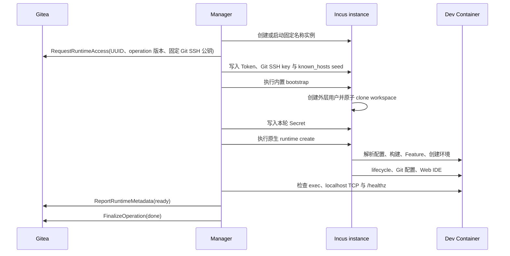

# Codespace 生命周期流程

## 创建流程

### Ref 与 Dev Container 选择

用户从 repository 代码页、Commit 页或开放的 Pull Request 页发起创建。Gitea 先用 repository 的默认分支、明确分支、Tag、commit 或 PR 内部引用解析一个完整 commit SHA，再从该提交扫描以下配置候选：

```text
.devcontainer/devcontainer.json
.devcontainer.json
.devcontainer/*/devcontainer.json
```

根配置优先作为默认候选；一级子目录中的配置分别作为独立环境，不相互融合。管理员和用户还可以保存命名 Dev Container 模板，作为非仓库配置候选。用户确认页展示所选来源、ref、运行环境、配置名称、当前可用 Secret 名称、尚未满足的 Secret 建议和附加仓库权限；Gitea 保存来源、仓库配置路径或模板内容以及完整提交。仓库来源在 RPC 中只携带路径，由 Manager 从锁定 workspace 读取；模板来源在 RPC 中携带创建时固化的内容。**设计如此：**仓库文件的权威来源是锁定提交，模板的权威来源是用户提交创建时的设置内容，二者都只保存本次 create 需要的最小输入。

仓库配置中的 `customizations.gitea.repositories` 只声明希望附加访问的仓库和单元权限。Gitea 在确认页按当前用户权限展开并让用户确认，最终授权保存在 Gitea；Manager 只解释标准 Dev Container 字段，不取得授权规则。顶层 `secrets` 只提供名称和说明，Secret 值仍由用户设置中的所有仓库范围或指定仓库关系决定。确认页只展示当前计划且不读取已有值，create 和 resume 会按当时的代码写权限与范围重新解析；普通 fork Pull Request 的配置来自贡献者分支，因此不向该环境提供用户 Secret。

**设计如此：**配置正文来自锁定提交，Gitea 只解释自己负责的权限扩展，Manager 原生运行时解释开发环境。两侧各自只有一个权威来源，也不会因分支后来移动而改变已经创建的环境。

### 实现验收点

- [x] ref 在创建前解析为完整 commit，解析失败不产生 Codespace 记录。
- [x] Pull Request 页面提交十进制编号，数据库保存基仓库规范内部 ref；关闭、来源仓库不可读或来源分支缺失时不产生 Codespace 记录。
- [x] 多个 Dev Container 文件和可见模板作为候选单选，仓库没有配置时可选择全局或个人模板。
- [x] 创建确认和持久数据包含配置来源、仓库路径或模板内容以及提交；仓库来源不保存正文，模板来源保存创建时内容。
- [x] Secret 和附加仓库权限由 Gitea 确认，Manager 不形成第二份授权状态；所有仓库 Secret 与指定当前仓库的 Secret 在 create/resume 时按当前代码写权限解析。
- [x] 确认页列出当前可用 Secret 名称和未满足的建议项，不返回已有值；普通 fork Pull Request 不展示、写入或注入用户 Secret。

### Manager 匹配与 operation 创建

Gitea 把用户在确认页显式选择的 `environment_tag` 写入 Codespace。成功 Declare 同名 tag 的站点全局 Manager 与当前用户个人 Manager 都可参与领取；Manager online、具有启动容量、接受 create，且本轮 `accepted_create_tags` 包含该 tag 时可以 claim。tag 表示部署管理员定义的基础设施环境，不是仓库配置、Incus profile 或实例类型。暂时没有 Manager 当前可接单时 Codespace 保持 queued create；Fetch 按稳定顺序领取，并在数据库事务中绑定 `manager_id`、写入 running operation、版本、开始时间和 deadline。

create payload 使用 `repository` 分组携带领取时重新读取的仓库名、HTTP(S)/SSH clone URL、起始 ref、锁定提交和首次 clone 首选协议。不可用协议的 URL 为空，`preferred_protocol` 必须指向一个非空 URL。分支使用 `refs/heads/<name>`，Tag 使用 `refs/tags/<name>`，直接 commit 使用空 ref。普通 Pull Request 以数据库中的基仓库内部 ref 锁定审阅内容，领取时再使用来源仓库 clone URL 和 `refs/heads/<head_branch>`；AGit 没有独立来源仓库分支，使用基仓库 clone URL 和 `refs/pull/<index>/head`。Manager 不从 Fetch 请求 Host 推导外部地址。**设计如此：**普通 PR 同时需要审阅快照的稳定身份和开发分支的正常提交、推送语义；基仓库内部 ref 与锁定 `commit_sha` 负责前者，来源仓库和 heads ref 负责后者。AGit 只有内部 ref，因此明确作为固定快照处理。

### 实现验收点

- [x] create 只由用户已选 tag、Manager 用户范围、实时状态、启动容量、接受类型和本轮可创建 tag 集合共同匹配。
- [x] 没有可见 tag 时不创建记录；tag 已声明但 Manager 暂时离线或无容量时 create 保持排队。
- [x] claim 事务同时绑定 Manager 和 operation 版本，重复 Fetch 不会产生第二个 active operation。
- [x] payload URL 来自 Gitea 规范地址生成器，首选协议始终对应非空 clone URL。
- [x] 普通 Pull Request payload 使用来源仓库与来源 heads ref，AGit 使用基仓库内部 ref；分支、Tag、PR 和直接 commit 全部由同一 `commit_sha` 锁定。
- [x] queued create 由 queue timeout 收敛，不通过 Manager 本地猜测改写状态。

### Manager 原生创建

Manager 领取 create 后按以下顺序执行：


```mermaid
sequenceDiagram
    participant G as Gitea
    participant M as Manager
    participant I as Incus instance
    participant D as Dev Container

    M->>I: 创建或启动固定名称实例
    M->>G: RequestRuntimeAccess(UUID、operation 版本、固定 Git SSH 公钥)
    M->>I: 写入 Token、Git SSH key 与 known_hosts seed
    M->>I: 执行内置 bootstrap
    I->>I: 创建外层用户并原子 clone workspace
    M->>I: 写入本轮 Secret
    M->>I: 执行原生 runtime create
    I->>D: 解析配置、构建、Feature、创建环境
    I->>D: lifecycle、Git 配置、Web IDE
    M->>D: 检查 exec、localhost TCP 与 /healthz
    M->>G: ReportRuntimeMetadata(ready)
    M->>G: FinalizeOperation(done)
```

bootstrap 只处理外层系统和 workspace。clone 使用带 Runtime UUID 的临时目录和 `--no-checkout`，首选协议失败且另一个 URL 可用时在同一次 bootstrap 中清理并回退一次。普通分支和普通 Pull Request 来源分支精确 fetch 到 `origin/<branch>`，在锁定 commit 上建立同名本地分支并设置 upstream；Tag、AGit Pull Request 和直接 commit 在锁定 commit 上使用 detached HEAD。HEAD 校验成功后工作区原子移动到最终目录；create 重试发现已有工作区时复用同一检出函数，修复分支和 upstream 后再次校验 commit。它输出实际 UID/GID、用户和 workspace，Manager 随后把这些值与 create startup input 持久化。

原生 runtime 对仓库来源从 workspace 读取固定配置，对模板来源直接解析创建时下发的内容。单镜像、Dockerfile 和 Compose 都转换为同一个结构化环境；OCI 与 HTTPS Feature 固定摘要，仓库内 Feature 由锁定提交固定，平台 code-server Feature 始终加入。环境创建完成后依次执行首次 lifecycle，配置 Git、初始化 Web IDE settings 和扩展，并启动 Web IDE。Manager 只有在本地状态保存成功、Dev Container running、code-server `/healthz` 可达并且同版本 ready metadata 被 Gitea 接受后才提交 final done。

**设计如此：**workspace 的一次性 clone 与 Dev Container 的可恢复环境分开。普通分支和普通 Pull Request 保持开发者熟悉的 branch/upstream 语义，Tag、AGit Pull Request 和直接 commit 保持锁定提交语义；create 重试可以识别同 Codespace 标签的未完成 Docker 对象并清理重建，但不会接管其他对象。

### 实现验收点

- [x] bootstrap、构建、Feature 和 lifecycle 的 stdout/stderr 按正文行实时写入同一 operation 日志；用于解析 shell 与环境的内部探测只返回结果，不进入用户日志，命令末尾没有换行时展示流仍与下一条分组标记保持独立行。
- [x] operation 使用顶层日志分组，启动流程按运行时访问、系统与 workspace、Dev Container 和 Endpoint 发布分组；lifecycle 与 VS Code 扩展安装使用阶段子分组，错误分组保持展开，正文不因折叠而丢弃。
- [x] workspace 在临时目录校验 commit 后原子提交，协议回退最多一次。
- [x] 普通分支和普通 Pull Request 检出同名本地分支并跟踪 `origin/<branch>`；Tag、AGit Pull Request 和直接 commit 使用 detached HEAD，最终 HEAD 都等于锁定提交。
- [x] create 重试对已有 workspace 使用同一 ref 检出与 commit 校验流程。
- [x] 原生 create 保存完整环境、所有 Compose 容器和 Feature digest。
- [x] ready 同时验证外层凭据、workspace、Dev Container、Web IDE 和当前 operation 版本。
- [x] final done 前已持久化 startup input、运行用户、环境状态和 ready metadata。

## 停止、恢复与删除

### Stop

stop operation 先关闭新的 Gateway 准入，再调用原生 runtime 停止环境状态中的主容器和全部相关容器。随后 Manager 删除易失 Secret 文件、停止 Incus 实例并保存 stopped transition，最后提交 final done。外层根存储和结构化环境状态保留，因此 stopped 表示可以恢复的资源仍存在。

停止 Dev Container 失败时 Manager 不把对象伪装成 stopped；operation 在 lease 内按可恢复错误重试，超过总期限后由既有 timeout 规则收敛。delete 不依赖 stop 成功，因为 delete 的目标是销毁整个 Incus 资源。

### 实现验收点

- [x] stop 关闭交互准入后停止完整 Dev Container 环境，再停止 Incus 实例。
- [x] stopped 保留 workspace、根存储和环境状态，Secret 文件已删除。
- [x] stop 失败不会留下“已停止但内部容器仍运行”的成功状态。
- [x] delete 可以接管失败的 stop 并直接进入销毁流程。

### Resume

resume 只使用 Manager state 中的 startup input、外层用户、workspace 和完整 Dev Container 环境。Manager 启动原 Incus 实例，取得新的 Gitea Token 和当前仓库授权 Secret，重写 seed 与易失 Secret，然后调用原生 runtime 启动保存的全部容器、执行 `postStartCommand` 和 `postAttachCommand`、恢复 code-server 并检查 ready。它不再读取 repository payload、重新解析 Dev Container 文件、clone、fetch、checkout、覆盖 Web IDE settings 或重复安装扩展。

Git helper 使用 workspace 已有 remote；HTTP(S) 和 SSH 请求仍由 Gitea 依据当前用户、仓库和分支保护判断。repository 已删除时，resume 仍可恢复本地 workspace，后续远端请求按当前 Gitea 状态失败。**设计如此：**resume 恢复的是用户已经工作的磁盘和容器环境，不是重新创建最初提交；把远端可达性作为 ready 条件会让 repository 运维变化错误阻断本地数据访问。

### 实现验收点

- [x] resume 启动同一 Incus 实例和同一完整 Dev Container 环境。
- [x] resume 重写当前 Token 与 Secret，保留 workspace HEAD、remote 和用户修改的 Git identity。
- [x] resume 保留用户在 Web IDE 中修改过的 settings 和扩展状态，只恢复 code-server 进程与当前运行环境。
- [x] `postStartCommand` 与平台 Web IDE附着命令重新执行，首次 create 命令不重放。
- [x] repository 可达性不参与 ready，实际 Git/API请求继续由 Gitea当前权限判断。

### Delete

delete 先持久化 cleanup pending 并关闭访问，再删除确定性命名的 Incus 实例，确认实例缺失后清理 Manager 本地 Codespace state，最后提交 final done。Gitea 在相同 Codespace lock 内物理删除 Codespace、Token、Git SSH Key 关系和日志。响应丢失时，Manager 通过 cleanup pending 和资源缺失事实继续幂等完成。

### 实现验收点

- [x] delete 的本地意图先于资源删除持久化，崩溃后可继续。
- [x] Incus 实例缺失是本地删除成功条件，内部 Docker 状态不形成额外 tombstone。
- [x] final accepted 后清理本地快照；重复 delete 不创建第二份资源。
- [x] Gitea 物理删除 Codespace 的同时清理开发凭据关系和日志。

## Lease、重试与重启

每个 worker 只在当前 operation lease 内执行。Manager 使用 Fetch 返回的相对有效时长建立本地单调截止点，续租更新当前 worker；取消、过期或更高版本 operation 会终止当前 Incus exec。create/resume 在 lease 暂停时停止 Incus 实例并保存 `lease_paused`，不会继续后台构建。

Manager 重启先终止遗留执行，读取完整 operation、startup input和环境快照，并以 recovering、零启动容量声明。只有 Fetch 成功续租同一版本后才重新启动 worker。create 可复检已经提交的 bootstrap workspace并重做未完成的原生 create；resume 重新执行本轮 credential、runtime resume 和 ready 检查。旧版本 ready 不能直接完成新一轮 resume。

原生 runtime 通过严格请求/结果 JSON返回可恢复性。配置格式、摘要、路径、Feature依赖和环境身份问题是不可恢复输入错误；Docker/OCI/网络和暂时不可用的 exec属于本轮可重试错误。结果文件即使进程返回错误也优先解析，避免退出码覆盖明确分类。

### 实现验收点

- [x] worker 不越过当前 lease 或 operation 总期限继续运行。
- [x] Manager 重启后先恢复为 `lease_paused`，成功续租前不执行生命周期。
- [x] 同版本重试复用已提交 workspace，并按标签清理本次未完成的 Docker 对象。
- [x] 结构化错误分类优先于进程退出码，控制请求和结果文件调用后清理。

## 自动暂停与交互

自动暂停只统计经过认证的 Web IDE、普通私有 Endpoint、SSH 和 SFTP live session；公共 Endpoint 不代表创建者交互。running/ready、设置启用且 session 为零时，Manager 使用本地单调时钟开始计时。达到有效 timeout 后调用 `RequestIdleStop`，由 Gitea 复检当前设置、交互版本和 active operation，再创建普通 stop。

用户打开 stopped Codespace 时，Gitea 创建普通 resume。Open Code 或 SSH 不直接唤醒实例；它们只在 Codespace 已 running 且 metadata ready 后建立 Gateway session。这样自动暂停、手动停止和普通恢复始终使用同一状态机与凭据流程。

### 实现验收点

- [x] 自动暂停使用 live session和单调时钟，公共 Endpoint不进入计数。
- [x] Gitea在创建 stop 前复检当前设置和交互版本，旧观察不会误停。
- [x] stopped 的交互入口返回可定位状态，只有普通 resume 可以恢复。
- [x] resume 完成前 Open Code、Web IDE 和 SSH 都不开放用户流量。

## 外部变化

repository 删除时，Gitea 在 repository lock内把相关 Codespace `repo_id` 写为 0，并清理以该仓库为来源的附加授权，不主动 stop或 delete。用户仍可打开本地 workspace、查看日志、stop、resume和 delete；Git 与 API按当前 repository 不存在返回结果。

repository、owner 或用户重命名不修改现有 workspace目录、Incus实例名或环境 ID。Gitea页面使用当前可解析名称，Runtime 继续使用初始化时的外层用户名和 workspace。用户删除会按 Codespace user relation lock清理其 Codespace、个人 Manager、凭据和日志；组织删除不作为 Codespace 用户清理入口。

Manager 删除由 Gitea在对应用户关系锁和 Manager lock内分批删除绑定 Codespace及地址记录，不联系已经失效的 Manager。仍有效 Manager通过后续完整 inventory取得无记录 UUID的本地清理指令。

### 实现验收点

- [x] repository 删除只解除数据库关联，不删除用户本地 workspace。
- [x] 重命名不改写已经创建的系统用户名、目录、实例名或环境 ID。
- [x] 用户和 Manager 删除按既有关系锁、短事务和最终复检完成本地数据清理。
- [x] 远端 Runtime残留由完整 inventory收敛，不在 Gitea删除事务中进行网络调用。
