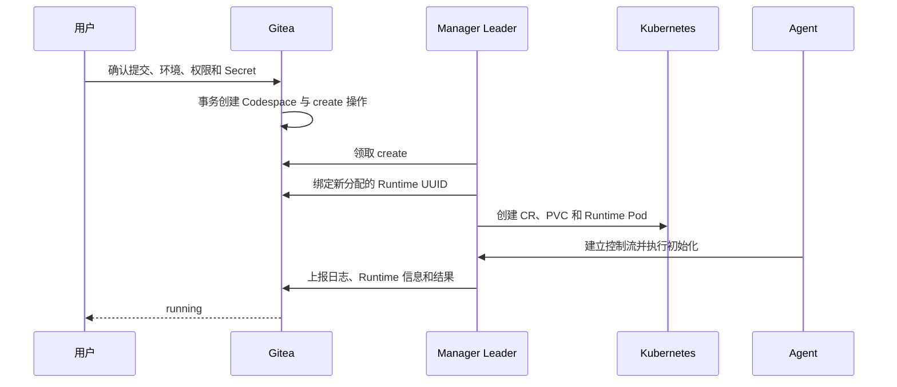

# 生命周期

Gitea 保存用户可见的主状态和当前操作，Manager 负责让 Kubernetes 资源收敛，Agent 负责 Runtime 内的执行。操作版本贯穿三者，使网络重试、进程重启和 Leader 切换不会产生第二条执行链。

## 状态与操作

| 主状态     | 含义                         | 有操作时的类型  |
| ---------- | ---------------------------- | --------------- |
| `creating` | 已确认创建，环境尚未可用     | create          |
| `running`  | Runtime 已就绪               | stop            |
| `stopped`  | 持久数据保留，Runtime 已停止 | resume          |
| `deleting` | 正在确认平台资源清理         | delete          |
| `failed`   | create 已确定无法完成        | 无；允许 delete |

操作创建时间大于零表示存在操作；开始时间为零表示 queued，否则表示 running。操作完成后写入新的主状态并清空触发来源和操作时间。操作类型与阶段由主状态和时间唯一推导，不在数据库中保存第二份相同事实。

每个新意图增加操作版本。续期、日志、Runtime 绑定、状态报告和最终提交都需要匹配 Codespace、Manager、操作类型与版本。数据库写入同时比较读取时的主状态、操作版本和操作阶段，只有仍为当前状态时才生效。delete 可以用更高版本替代进行中的 create、resume 或 stop，因为它代表用户的最终清理意图；其他冲突操作返回当前状态。

用户活动代数独立保护活动递增和自动停止取消，Manager 的操作完成则只比较生命周期快照。这样打开 Endpoint 与 stop 完成并发发生时，活动请求保持环境的既定主状态，stop 也保留已经记录的活动代数。

### 实现验收点

- 一个 Codespace 同时最多有一个有效操作。
- 同一持久行能够唯一推导操作类型和 queued/running 阶段。
- 日志、Runtime 信息和最终结果只接受当前操作版本。
- 并发状态写入只有一个能够匹配读取时的生命周期快照。
- 用户活动递增和 Manager 操作完成分别按各自的条件更新生效。
- 重复提交相同意图保持幂等，不增加操作版本。

## 创建

Gitea 先锁定目标提交，再在同一数据库事务中校验用户、仓库、环境标签、Dev Container 配置和授权，并创建 Codespace 与 queued 操作。Manager 领取后分配 Runtime UUID，绑定成功后才创建集群资源。Agent 完成工作区、Dev Container 和访问服务初始化后发布 ready，Manager 再提交 create 结果。

输入和权限错误在持久化前返回。确定性执行错误进入 failed；可能已经创建的平台资源继续由同一 Runtime UUID 清理，避免重试生成另一套资源。

### 实现验收点

- 创建确认、授权和任务入队位于同一数据库事务。
- 同一 create 只对应一个 Runtime UUID、一组 CR/PVC 和一个有效操作版本。
- Runtime UUID 绑定前不创建对外可用的 Runtime。
- 页面在 create 完成前可以按偏移读取日志，成功后状态为 running。

## 运行与访问

running 状态下，Agent 向 Manager 发布当前 Pod 身份、访问目标和 Endpoint；Gateway 在每次连接前复核 Gitea 权限并取得短期票据。用户活动更新最后活动时间，用于自动停止；组件心跳和后台状态检查不计为用户活动。

Runtime 信息是可重建的展示数据。暂时失联会让访问入口显示不可用，但不会把 running 推测为 stopped 或 failed。

### 实现验收点

- 私有 Endpoint、Web IDE、SSH 和 SFTP 均需要当前用户授权。
- 公共 Endpoint 仍需匹配当前 Runtime 和 Endpoint 声明。
- 后台心跳不会延后自动停止。
- Runtime 信息过期不改变主状态。

## 停止、恢复与自动停止

stop 定向到已绑定 Manager。Manager 撤销路由和运行期凭据、停止 Runtime Pod 并保留 CR/PVC，确认完成后 Gitea 进入 stopped。resume 复用 Runtime UUID、CR、PVC 和已确定的环境配置，创建具有新 Pod UID、Agent 身份和访问目标版本的 Pod。

首次创建由 init 后进入 start；恢复只执行同一 start 语义。环境标签用于首次调度，后续改名或删除不会迁移已有 Codespace。自动停止通过普通 stop 操作实现，因此具有相同版本、清理和恢复行为。

### 实现验收点

- stop 后持久数据保留，Runtime Pod、路由和运行期 Token 消失。
- resume 不重新克隆仓库，也不重放初始化或一次性生命周期命令。
- resume 发布新的 Pod 身份、访问目标版本和短期凭据。
- 手动停止与自动停止使用同一状态转换，并发扫描不会创建重复操作。

## 删除

delete 生效后，只有当前 delete 版本可以发布状态。Manager 依次撤销访问、停止执行并删除 Pod、PVC、CR 和路由信息；确认平台资源消失后，Gitea 清理业务关系、凭据、日志和展示数据。

删除步骤以资源身份和稳定名称保持幂等。资源已经不存在表示该步骤完成；资源状态尚未确认时保持 deleting，并由后续协调继续核对。

### 实现验收点

- create、resume 或 stop 期间发起 delete 最终能够收敛。
- 重复 delete 不会重建资源，也不会因资源已经不存在而失败。
- deleting 只接受当前 delete 版本的操作结果。
- 平台资源确认清理前，业务状态保持可诊断。

## 超时与恢复

create 和 resume 的排队或执行期限用于结束无法启动的请求：create 进入 failed，resume 回到 stopped。stop 和 delete 表达必须完成的收敛意图；执行许可到期后以更高操作版本重新排队，并保留首次创建时间用于诊断。

Manager Leader 接管时先续期仍绑定的操作，再提交完整资源清单并核对 Gitea、CR、PVC、Pod 和 Agent。已成功且持久记录的 Agent 阶段只重复上报结果；开始后未记录完成的阶段明确失败，因为盲目重放可能重复修改用户环境。旧 Pod 是否仍可能写入 PVC 的处理见[运行平台](runtime-platform.md#高可用与恢复)。

### 实现验收点

- create/resume 超时进入明确稳定状态，stop/delete 超时继续收敛。
- 两个 Manager 竞争时只有一个能领取同一操作。
- 新 Leader 不依赖前任进程内状态即可恢复协调。
- 已完成阶段不会重放，结果未知的阶段提供明确诊断。
