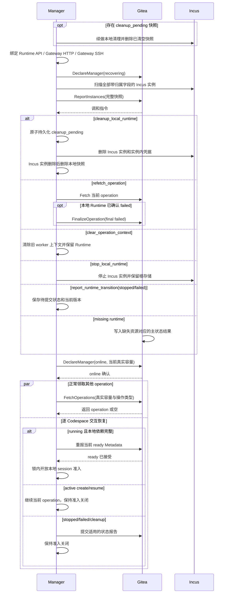

# 维护与重启恢复

## 总体模型

Gitea 重启和 Manager 重启都属于日常维护事件。重启本身不改变 codespace 主状态、active operation 或租约截止时间；Gitea 恢复数据库服务，Manager 恢复本地映射和交互入口，之后继续使用正常的 operation、超时和 inventory 规则。

维护恢复使用三类数据：

| 类型 | 负责方 | 作用 |
| --- | --- | --- |
| Gitea-issued operation | Gitea | 当前 active operation，表达 Gitea 期望 Manager 执行的 create/resume/stop/delete。 |
| Main State | Gitea | `creating/running/stopped/deleting/failed`，表达 codespace 资源生命周期结果。 |
| Runtime 状态报告 | Manager | `ReportInstances`、`ReportRuntimeMetadata` 和 `ReportRuntimeTransition`，表达运行侧实际资源与交互入口。 |

生命周期状态以 Gitea 数据库为准，Gitea 缓存和 Manager inventory 提供运行信息。维护期间 Gitea 保持主状态稳定；Manager 恢复完成并上报完整 inventory 后，Gitea 比较两侧当前状态并按正常差异表处理。**设计如此：进程重启只表示服务暂时不可用，不是 Codespace 生命周期事件，因此不设置重启专用超时、批量失败或批量清理流程。**

实现验收点：

- Gitea 重启或 Manager 重启本身不改写 codespace 主状态。
- 重启前保存的 operation deadline 在重启后保持原值，并继续由普通租约规则判断。
- operation、主状态和 Runtime 状态报告始终由表中指定的负责方提供。

## Gitea 重启恢复

Gitea 重启后从数据库恢复：

```text
codespace.status
operation_rversion
operation_type
operation_status
operation_created_unix
operation_started_unix
operation_deadline_unix
manager_id
codespace_gitea_token 当前行
日志元数据
```

以下短期数据缺失时由 Manager、用户交互或后续请求重新建立：

```text
Gateway Open Token cache
Runtime Metadata cache
Gitea globallock 的当前锁持有状态
短期页面展示数据
```

启动后主状态保持：

| 主状态 | 恢复行为 |
| --- | --- |
| `creating` | 等待当前 create operation 继续上报，或等待完整 inventory 给出运行侧状态。 |
| `running` | 主状态保持；Runtime Metadata 缓存未命中时等待 Manager 重建，open/SSH 返回 `metadata_rebuilding`，外部缓存保留的合法快照可继续使用。 |
| `stopped` | 主状态保持，等待完整 inventory 确认对应 Incus 实例及根存储仍存在。 |
| `deleting` | 等待当前 delete operation 继续上报，或等待 inventory 确认资源已缺失后物理删除。 |
| `failed` | 保持 failed；若 Manager 仍上报 Runtime，则返回 cleanup 指令。 |

Codespace 通过 Gitea 缓存保存 Open Token、Runtime Metadata 和短期页面展示数据。memory/twoqueue 重启后通常丢失，Redis/memcache 可在 TTL 内保留；缓存未命中时 Runtime Metadata 由 Manager 重建，Gateway Open Token 由用户重新 open 生成。缓存中仍存在的值也要通过当前数据库和权限校验。进程重启保留数据库状态，可以避免把维护重启误判为批量失败。`globallock` 的锁持有状态不属于生命周期数据；重试入口取得新锁后重新读取数据库并执行条件校验。

**设计如此：Gitea 启动路径只恢复数据库连接、缓存和常规定时任务，不遍历 Codespace，也不写主状态、active operation、Token、inventory generation 或 deadline。**服务可用后，普通请求按数据库当前值处理，常规定时任务按原有时间字段处理真正已经到期的记录；这些行为与未发生重启时完全相同。

实现验收点：

- Gitea 重启后从数据库恢复 active operation、当前 Codespace Gitea Token、Git SSH 公钥绑定和日志元数据。
- cache 丢失不写 failed，用户可重新 open，Manager 可重建 metadata。
- memory/twoqueue 丢失 cache 和 Redis/memcache 在 TTL 内保留 cache 都不改变数据库主状态；保留的 Open Code 继续执行完整访问校验，cache miss 按既有重建流程处理。
- 启动路径不扫描或改写 Codespace；启动后的普通 Cron 只按原时间字段处理已经满足超时条件的记录。

## 数据库时间点恢复

数据库时间点恢复可能使 Gitea 的 operation、Token、inventory generation 与 Manager 本地持久状态来自不同时间点。自动判断哪一侧可以继续会引入跨系统恢复协议，却仍无法证明全部对象一致，因此时间点恢复由运维在停止 Gitea 和全部 Manager 后完成。运维恢复相互一致的数据库与 Manager 状态；无法取得一致状态时，选择保留数据库并通过部署工具按不可变归属字段明确清理 Incus 实例。

正常运行期间只处理能够直接证明的历史不一致。Fetch 或 inventory 中，任一正数 `observed_operation_rversion` 大于仍存在且绑定当前 Manager 的 Codespace 当前版本时，Gitea 返回 `state_history_conflict`。该请求在租约、超时、领取、inventory generation 和 Codespace 数据写入前结束，也不返回差异 action；Manager 关闭整个 Manager 的新任务领取、全部交互入口和新的 Incus 修改，并保留已有实例及根存储。无记录或 binding 不匹配没有足够历史证明回退，继续由完整 inventory 返回 cleanup。inventory generation 只承担请求新旧排序：任意更高值可以接受，相等或更低值返回 stale，因此它本身不被当作数据库恢复证明。

Manager 本地还保存每个 UUID 见过的最高 operation 版本。每次 Fetch 和 ReportInstances 发出时在内存中记录该请求开始时的最高版本；响应低于请求开始版本时进入本地硬错误 `operation_version_regression`，响应不低于请求开始版本、但处理时本地已经接受更高版本，则只丢弃该 UUID 的延迟结果。这样并发 Fetch 已推进到版本 6 时，先前 inventory 返回的版本 5 action 不会被误判为数据库回退；请求发出前本地已经是版本 6 而响应仍为版本 5，才证明历史倒退。`cleanup_local_runtime` 不携带 operation 版本，继续以数据库当前明确无记录等 cleanup 结果和 inventory generation 为依据。

**设计如此：`state_history_conflict` 和 `operation_version_regression` 都是停止扩大影响的硬边界，不是数据库恢复协议。**它们能发现 operation 版本明确倒退，但无法证明未报错的数据一定来自同一时间点。时间点恢复仍由运维停机完成，正常运行协议只负责当前状态收敛。

Manager 记录不存在时返回 `manager_unregistered`，Secret 不匹配时返回 `unauthenticated`。Manager 随即关闭全部入口和 Incus 修改并停止 Gitea RPC，同时保留实例。运维恢复一致的身份与数据后可重新启动 Manager；选择放弃这些实例时，由部署工具按不可变 `manager_id + codespace_uuid` 归属字段执行明确清理。

实现验收点：

- Fetch 或 inventory 的正数 observed operation 高于已存在且绑定当前 Manager 的 Codespace 当前版本时，Gitea 返回 Manager 级 `state_history_conflict`，且该请求不产生业务写入；无记录或 binding 不匹配由完整 inventory 收敛。
- payload、续租回执或带版本 action 低于请求发出时的本地最高版本时，Manager 产生 `operation_version_regression`；请求期间本地已经接受更高版本造成的延迟结果只丢弃当前 UUID。
- 两种冲突都关闭整个 Manager 的新任务领取、全部交互入口和新的 Incus 修改，并保留实例等待运维恢复一致数据或明确清理。
- generation 无法证明数据库与 Manager 来自同一恢复点；时间点恢复流程在 Gitea 和 Manager 全部停止后执行。
- 普通 Gitea 重启继续按数据库中的当前状态、operation 和原 deadline 工作，不进入数据库时间点恢复流程。

## Manager 重启恢复

Manager 启动流程：

1. 取得该 Manager 本地状态目录独占锁；锁已被其他进程持有时退出，不发送 RPC。
2. 读取并校验 Manager 根快照；失败时以固定硬错误退出，不发送 RPC 或修改 Incus 实例。校验各 Codespace 快照，为有效对象初始化关闭 session 准入、空 session 集合和空 ready 接受记录；优先续做 `cleanup_pending=true` 的本地清理。单个快照损坏时按“持久状态损坏处理”清理该 UUID，不尝试恢复其运行状态。
3. 校验配置和 host key，绑定 Runtime HTTP API、Gateway HTTP/WebSocket 和 Gateway SSH listener；任一必要 listener 失败时退出，不 Declare online。
4. `DeclareManager(manager_runtime_state=recovering)`，取得服务端心跳周期、Runtime Metadata 刷新周期和控制面消息上限；响应非法时以零容量保持 recovering，不开始新的 Incus 枚举或修改，步骤 2 已经持久化的 `cleanup_pending` 继续按原授权完成。
5. 全量枚举带当前 Manager 归属字段的 Incus 实例，并读取每个实例的当前状态。
6. 生成 Runtime inventory 快照，递增 `inventory_generation`，通过 `ReportInstances` 上报完整快照；正数 observed operation 高于 Gitea 当前版本时，因 Manager 级 `state_history_conflict` 停止恢复并等待运维处理。
7. 恢复 Runtime 映射，并把每个本地 worker 上下文分类为“完整、可以请求续租”或“缺失、保持不执行并等待原 deadline”。全部恢复 worker 先保持暂停；只有上下文完整的 active operation 放入 `FetchOperations(observed_operations=...)`，服务端版本更高时重新取得当前 payload。
8. 对 Fetch 成功返回的普通 payload 或续租回执，使用请求开始时的本地单调时钟和相对有效时长建立新本地截止点，再恢复对应 worker。服务端已经超时、RPC 暂时不可用或未返回明确续租结果时继续暂停。随后执行 inventory 返回的 cleanup、clear、stop 和 refetch 指令。
9. 执行 `DeclareManager(manager_runtime_state=online)`，表示必要 listener、完整 inventory、Runtime 映射和 worker 上下文分类已经完成；后续 Fetch 使用真实 `capacity_available` 和当前 `accepted_operation_types`，可以领取其他 Codespace 的 operation。
10. 同时逐 Codespace 完成交互恢复：active create/resume 继续当前 operation；Gitea 与本地都为 running 的对象验证凭据、internal SSH 和路由，并通过唯一 metadata 发布任务重报当前 ready 快照；本地 stopped/failed 或待清理对象提交明确状态结果并保持准入关闭。稳定 stopped 保留 Incus 实例及根存储，等待下一次 resume 从该实例重建 metadata。
11. running 对象收到当前 ready 的成功上报且没有待提交状态后，在本地协调锁内开放 session 准入；单个仍在重试的对象保持关闭，不阻塞其他对象恢复或 operation 领取。

**设计如此：Declare online 表示 Manager 的全局运行能力已恢复，不表示每个 Codespace 已经恢复交互。**全局边界包括必要 listener、完整 Incus inventory、Runtime 映射和 worker 上下文分类；逐 Codespace 的 Runtime Metadata、凭据、内部 SSH、路由和待提交状态在 online 后独立恢复。Fetch 使用真实容量，不把未完成的对象级恢复转换成整个 Manager 的零容量。Gateway/SSH 的前置检查与最终登记仍拒绝本地准入尚未开放的对象，因此外部 cache 保留的旧 ready 快照不能越过本地恢复边界。`operation_rversion` 相同且本地上下文完整的 running operation 可以请求续租，但收到新的相对有效时长前保持暂停；已经到期或上下文缺失的 operation 由普通超时和 inventory 规则收敛。

运行中任一必要 listener 意外终止时，`serve` 关闭全部 Codespace 的新 session 准入和已有连接后退出；heartbeat 停止后 Gitea 按现有超时派生 offline。该故障使用进程退出、heartbeat 和本地结构化日志诊断，不增加新的持久健康状态。

Manager 重启恢复流程：



实现验收点：

- recovering 状态写入 `codespace_manager.runtime_state`。
- 功能启用时，Manager 在 recovering 期间接受 `FinalizeOperation`、`UpdateLog`、`ReportInstances`、`ReportRuntimeMetadata` 和 `ReportRuntimeTransition`；站点排空时按排空能力表处理。
- Manager 完整扫描 Incus 实例、恢复 Runtime 映射和 worker 上下文后声明 online；各 Codespace 的 metadata 和状态报告任务在 online 后继续处理。
- active create、active resume 和 running Codespace 恢复时只启动一个读取当前完整快照的 metadata 发布任务；Endpoint、boot、SSH 和周期刷新共享其 generation。稳定 stopped 不启动周期发布。
- Declare online 后 Fetch 使用真实容量和当前操作类型；单个 Codespace 的交互恢复未完成不阻塞其他 operation，Declare 本身不分配 operation。
- Manager 进程启动时所有 Codespace 的本地 session 准入关闭；online 后只有完成凭据、SSH、路由和当前 ready 上报的 running 对象逐个开放，外部 cache 保留旧 metadata 不能提前建立连接。
- 单个 Codespace 的临时恢复错误只保持该对象准入关闭并后台重试，其他健康对象可以开放；确定无法恢复时停止 Runtime 并上报 stopped 或 failed。
- 状态目录独占锁保证一个 Manager 身份只有一个本地进程管理其 Incus 实例和版本状态。
- Manager 从原子当前快照恢复 operation payload、generation 和 Runtime 映射；恢复 worker 在取得新的相对 lease 时长前保持暂停。Fetch 空响应不清除 worker，只有明确的 `clear_operation_context` 指令执行清理。
- Manager 根快照缺失、损坏或与配置身份不匹配时启动硬失败，不发送 RPC 或修改 Incus；管理员删除原 Manager、清理归属实例和状态目录后重新注册。
- 单个 Codespace 快照缺失或损坏时，Manager 关闭该 UUID 的准入并先持久化最小清理记录，再按不可变归属字段删除对应 Incus 实例；后续完整 inventory 使 running/stopped 进入 failed、deleting 完成物理删除，active create 在原 deadline 到期后进入 failed。
- Manager 从快照恢复自动暂停开关、超时和交互版本；Gitea 已创建的 stop 通过普通 Fetch 恢复，其他对象在当前 inventory 设置应用后从完整时长重新计时。
- Manager 在扫描和上报新 inventory 前续做全部 `cleanup_pending`；Incus 实例已删除但本地快照仍存在时也能完成清理。
- 启动恢复遇到 `state_history_conflict` 时 Manager 整体停止；payload、续租回执或带版本 action 低于对应请求发出时的本地最高版本时，Manager 因 `operation_version_regression` 整体停止，请求期间产生的延迟响应只丢弃当前 UUID。
- 三个必要 listener 在首次 recovering Declare 前成功绑定；任一 listener 启动失败时进程退出，运行中意外终止时关闭 session 并退出，Gitea 最终按 heartbeat 派生 offline。

## Runtime Inventory Reconciliation

`ReportInstances` 上报 Manager 本地 Runtime inventory。

Manager 在启动恢复、每个 `inventory_report_interval` 和 Incus 实例异常事件后提交完整快照；Gitea 据此处理运行期间发生的实例删除或已知状态变化。只有 Incus 实例全量枚举成功、每个实例状态都可确定且扫描期间没有分页或连接错误时，快照才算完整；任一实例状态无法读取或枚举失败时，本轮保留 generation 并重试完整扫描。这样 missing 判定只使用完整集合。

inventory 语义：

- Manager 全量枚举带其 `manager_id + codespace_uuid` 归属字段的 Incus 实例，并按 UUID 生成 inventory item，而不只扫描 running 实例。
- stopped 实例仍生成对应 UUID 的 inventory item，因为它的根存储是 resume 的恢复来源。
- `ReportInstances` 每次提交完整快照，单个 Manager 最多持有 10000 个带归属字段的 Incus 实例，单次请求最多包含 10000 个 UUID 唯一的实例。完整快照使 missing 判定有确定依据，并避免增量丢失造成错误删除。
- 成功 response 为每个 reported UUID 返回一个 result，其中可以同时带当前有效自动暂停设置和至多一个差异 action。Manager 先应用完整设置，再执行 action；站点默认或对象配置变化无需改变本地 Runtime 集合即可下发。
- `inventory_generation` 由 Manager 单调递增。每次完整扫描成功后分配一个更高值；传输失败或响应丢失后重新扫描并分配新值。Gitea 接受任意高于当前值的 generation，相等或更低版本返回 stale 和当前 generation。每项写入前及响应返回前都复检数据库当前 generation 仍等于请求值；更高版本成立后，旧 handler 不再写入或返回 result。
- generation 只确定完整快照的新旧顺序，Gitea 不保存或比较 inventory 内容哈希。这样响应丢失只需要一次新的全量扫描，不需要持久化待确认快照。
- Incus 已产生稳定 Runtime identity、但创建尚未完成的实例上报 `creating`；该状态只证明实例存在，不驱动主状态变化。停止过程按扫描时仍可观察到的 running 或已经完成的 stopped 上报。Runtime identity 仍存在、但 Manager 已确认实例根存储或配置不可恢复时上报 `failed`；该 inventory 状态不直接写主状态。Manager 持有低于当前 active operation 的正版本操作上下文时，可用它取得当前 operation payload；版本相同时使用已有上下文。`observed_operation_rversion=0` 表示没有本地 active operation 上下文，此时 Gitea 不补发 payload，当前 operation 按原 deadline 超时。identity 或状态无法确定属于扫描失败，整轮不提交。
- 全量扫描发现超过 10000 个归属该 Manager 的 Runtime 时，不提交截断快照；Manager 保持 recovering、把可用容量声明为 0，并记录本地错误，等待运维把资源数量恢复到协议上限内。

Request：

```text
inventory_generation
instances:
  - codespace_uuid
    runtime_state
    observed_operation_rversion
```

Gitea 计算：

```text
expected = Gitea 中绑定该 Manager 且按主状态应存在 Runtime 资源的 codespace
reported = Manager 上报的本地 Runtime 资源
extra = reported - expected
missing = expected - reported
```

Gitea 主状态决定 expected：

| Gitea 状态 | Runtime 期望 |
| --- | --- |
| `creating` 且 `manager_id=0` | 不期望，尚未领取。 |
| `creating` 且 `manager_id!=0` | 期望存在或正在创建。 |
| `running` | 期望存在且 running。 |
| `stopped` | 期望存在且 stopped/retained。 |
| `deleting` | 期望可能存在；缺失即可完成删除。 |
| `failed` | Runtime 可以已清除；仍存在时按 cleanup 策略处理。 |

实现验收点：

- expected 集合只按绑定 Manager 和持久主状态计算。
- 不完整或含未知实例状态的 Incus 扫描不会递增 generation，也不会提交给 Gitea。
- 每个完整扫描使用新的 generation；相等或更低 generation 不驱动任何差异写入。
- generation 可以跳号，Gitea 以“高于当前值”作为唯一接受条件。过旧快照按服务端当前值之后的新 generation 重新完整扫描。
- inventory generation checked increment 失败返回 `version_exhausted`，Manager 不回绕或提交部分快照，并使用相同的 Manager 删除和重新注册路径。
- 完整设置快照覆盖本地自动暂停开关和超时，交互版本只前进；延迟响应即使暂时改变本地计时，也不能通过 RequestIdleStop 对当前启用值、有效超时和交互版本的复检创建错误 stop。

## Extra Runtime 处理

extra runtime 表示 Manager 本地存在一条 Gitea 当前没有记录为应存在的 Runtime。

| 场景 | Gitea 指令 |
| --- | --- |
| Gitea 成功确认无 codespace 记录 | `cleanup_local_runtime`，持久化本地清理后删除 Incus 实例和本地快照 |
| codespace 绑定其他 Manager | `cleanup_local_runtime`，持久化本地清理后删除 Incus 实例和本地快照 |
| codespace 状态为 `failed` | `cleanup_local_runtime`，持久化本地清理后删除 Incus 实例和本地快照 |
| codespace 状态为 `creating` 且 `manager_id=0` | 不返回指令，等待该 create 被领取或超时 |

`cleanup_local_runtime` 是删除 Incus 实例、实例内凭据、本地会话和 codespace 快照的完整资源清理指令，不等同于只停止实例。Gitea 在正常向前的数据库历史中明确确认 UUID 不存在、记录绑定其他 Manager 或主状态为 failed 时返回该指令。Manager 的完整 inventory 只包含带当前不可变 `manager_id + codespace_uuid` 归属字段的实例，Codespace UUID 又永不复用，因此当前 generation 的明确结果可以安全地要求原 Manager 持久化并执行本地清理，不需要 Gitea 再保存删除墓碑、清理任务或完成回执。

该判断只在 Manager 身份认证成功、完整 inventory generation 已被接受、处理该 UUID 前后复检仍为当前 generation，且数据库查询正常完成并明确返回无记录时成立。数据库连接、查询、事务或 RPC 发生错误时，整次请求返回临时错误，不把错误转换成 cleanup；Manager 也只接受仍匹配本地当前 generation 的成功响应。响应丢失或 Manager 在持久化 cleanup 前崩溃时，下一次使用更高 generation 的完整扫描会根据当前数据库重新得到 cleanup；`cleanup_pending` 已经持久化后则由本地任务直接续做。未绑定 creating 在 Gitea 中仍有记录，之后可能由当前或其他 Manager 合法领取，因此继续保留实例并等待 claim 或 queue timeout。running、stopped 和 resume/stop timeout 保留的实例根存储同样只有在记录仍存在时按各自主状态处理。

实现验收点：

- 数据库成功确认无记录、Manager 不匹配和 failed 记录返回 `cleanup_local_runtime`；未绑定 creating 保持等待且不返回 cleanup。
- 数据库错误、RPC 错误、不完整 Incus 扫描、未被接受或已经过期的 inventory generation 都不会触发本地删除。
- `cleanup_local_runtime` 先持久化 cleanup，再删除 Incus 实例和本地快照；数据库中仍存在的 running、stopped 和 resume/stop timeout 保留实例根存储，不会收到该指令。
- 物理删除与 inventory 并发时，inventory 先查询到记录则本轮按原状态处理并在下一轮发现不存在，物理删除先提交则本轮直接返回 cleanup；两种顺序最终都删除归属 Incus 实例和本地状态文件。
- UUID 永不复用，Manager 又只执行本地当前 generation 的响应，因此延迟 cleanup 不会命中后续新建 Codespace。
- extra runtime 处理不创建 codespace 记录或改写其他 codespace 状态。

## Missing Runtime 处理

missing runtime 表示 Gitea 记录中应该存在 Runtime 资源，但 Manager 完整快照中没有对应资源。

| Gitea 状态 | 处理方式 |
| --- | --- |
| `creating` 且 active create deadline 未到期 | 保持 creating，Runtime 可能仍在创建；本轮完整清单不提前结束 operation。 |
| `creating` 且 active operation 缺失或 deadline 已到期 | 进入 `failed`，物理删除 Token 与 Git SSH Key，清空 active operation。 |
| `running` | 进入 `failed`，物理删除 Token 与 Git SSH Key，清空 active operation。 |
| `stopped` | 进入 `failed`，物理删除 Token 与 Git SSH Key，因为实例和其中唯一私钥已经不存在，无法 resume。 |
| `deleting` | 视为 cleanup 已完成，物理删除 Codespace、开发凭据、日志和绑定数据。 |
| `failed` | 保持 failed。 |

Runtime 缺失说明 Manager 无对应 Incus 实例。delete 时缺失即满足目标；running/stopped 时缺失表明无法恢复。creating 在 create deadline 未到期时允许实例尚未出现在 Incus 扫描中，避免 inventory 先于创建结果到达时提前使 create 失败。Manager 是否刚刚重启不改变该判断。

实现验收点：

- active create deadline 未到期时 missing 不写 failed；Manager 重启不延长该 deadline。
- deleting 资源缺失完成物理删除，running/stopped 资源缺失进入 failed。

## Manager 主动 Transition 恢复

Manager 可以在重启或运行期间发现本地 Incus 实例已经 stopped，或者实例仍存在但某个 Codespace 已确认不可恢复。Gitea 当前没有对应 active operation 时，Manager 使用 `ReportRuntimeTransition` 上报 stopped/failed；running 只能由当前 create/resume operation 的 final done 建立。

| Gitea 状态 | Runtime 状态报告 | Gitea 行为 |
| --- | --- | --- |
| `running` 且无 active operation | stopped | 接受，写 `status=stopped`，物理删除 Token 并保留 Git SSH Key。 |
| `running/stopped` 且无 active operation | failed | 接受，写 `status=failed` 并物理删除 Token 与 Git SSH Key；提交后尽力清除交互 cache。 |
| `running/stopped` 且有 active operation | 任意 | 拒绝，返回 `current_operation_conflict`。 |
| `failed` 且相同 generation 的 failed 重试 | failed | 目标主状态已经成立，幂等成功，不刷新 failed retention 起点。 |
| `creating/deleting`，或 failed 收到 stopped | 任意 | 拒绝，返回 `stale_operation`。 |

Manager 主动 transition 是运行状态报告，不是 Gitea-issued operation，不递增 `operation_rversion`。

Manager 每次主动上报 stopped/failed 时递增 `runtime_generation`，并携带生成该状态报告时观察到的 `operation_rversion`。Gitea running、Runtime stopped 的分歧或无 active operation 的 failed inventory 可以取得 `report_runtime_transition.current_operation_rversion`；Gitea stopped、Runtime running 的分歧只返回 `stop_local_runtime`。未绑定 creating 不返回版本或 payload。已绑定且仍有 active operation 时，本地正版本低于当前版本的 failed inventory 取得 refetch action，恢复 payload 后提交 final failed；版本相同时直接使用本地完整上下文提交 final failed；上下文版本为 0 时等待原 operation deadline，由普通超时规则结束 active operation。Gitea 按 binding、active operation、Manager 状态、operation 版本、runtime generation 和状态报告的固定顺序校验。runtime generation 低于当前值时 stale；相同 generation 且状态报告的目标主状态已成立时按处理结果幂等成功，目标不同时 generation conflict；更高 generation 只在主状态转换合法时写入。

功能启用时，Manager 声明为 online 或 recovering 且 heartbeat 有效时可以上报 stopped/failed；站点排空时同样接受这两种缩减状态。已派生 offline 的 Manager 先声明 recovering 并更新 heartbeat，再完成 inventory 和 transition。

`ReportRuntimeTransition` 只提交当前状态、`runtime_generation` 和 `observed_operation_rversion`。Gitea 不保存 transition 历史，因此不提交观察时间或原因字段；运行侧诊断保留在 Manager 本地日志。

failed 状态报告提交前，Manager 先关闭本地 session，并停止该对象尚未完成的 metadata 上报和生命周期 worker。Gitea 返回接受或目标主状态已经成立的幂等成功后，Manager 先持久化本地 cleanup，再删除归属 Incus 实例和本地快照；清理失败或进程重启时由 pending 快照续做，尚存实例继续上报 failed inventory。Gitea 记录仍为 failed 时返回 `cleanup_local_runtime`；记录已经由其他删除流程物理删除时，成功的 inventory 查询按无记录返回同一清理指令。

实现验收点：

- 主动 transition 只在无 active operation 时生效。
- generation 确保旧 stopped/failed 状态报告不能覆盖新主状态。
- 相同 generation 按状态报告的目标主状态写入，不依赖历史状态报告字段。
- `observed_operation_rversion` 确保旧 operation 上下文产生的状态报告不能在新 operation final 后生效。
- stopped 主状态对应 running Runtime 时，inventory 只会要求停止 Incus 实例并保留根存储；新的启动必须来自 Gitea 下发的 resume operation。
- 单 Codespace 不可恢复但 Runtime 仍存在时使用 failed 状态报告；Manager 整体离线、metadata 丢失和临时连接错误不批量改写为 failed。
- failed 状态报告成功后先持久化本地 cleanup；未完成清理由 pending 快照直接续做，尚存实例仍通过 failed inventory 取得同一 cleanup action。
- failed 状态报告响应丢失后的相同 generation 重试幂等，且不延后 failed retention。

## Active Operation 超时

`operation_created_unix + QUEUE_TIMEOUT` 是 queued operation 等待 Manager 领取的硬截止时间；`now >= deadline` 后即使 Cron 尚未扫描也不能再领取。`operation_deadline_unix` 是 running operation 的 lease 截止时间。

queued operation 等待超时表示 Manager 尚未执行动作，因此写回 operation 创建前可确认的稳定状态：create/delete 写 failed，resume 保持 stopped，stop 保持 running。全部清空 active operation；queued resume 删除可能残留的 Token 并保留 Git SSH Key，queued stop 保留当前两类开发凭据，create/delete 的 failed 结果删除两类开发凭据。

Fetch 遇到已超过该硬截止时间的 queued 候选时，在 Codespace lock 内按当前 UUID、operation 版本和 queued 状态条件执行同一 timeout State Finalization，不领取该项，也不把它计入 `max_operations`。Cron 处理未被 Fetch 扫到的过期记录。

running operation lease 到期后统一执行 timeout 映射：create/delete 写 failed，resume/stop 写 stopped。Manager 的 online、recovering 或 offline 状态只影响当前能否通信和领取新任务，不改变已经写入 operation 的 deadline。这样 Gitea 与 Manager 的重启顺序不会产生另一套超时结果。

Fetch 在 observed 续租或返回当前 running payload 前检查原 deadline；未到期时可以原子写入新 deadline，observed-only 续租通过 `renewed_leases` 返回相对有效时长。已经到期时，Fetch 直接执行 timeout 且不返回 payload 或续租回执。当前版本 FinalizeOperation 在发现 deadline 已过而 Cron 尚未处理时，同样先执行按 operation 类型定义的 timeout State Finalization；请求 final 映射出的目标与 timeout 结果一致时返回 `idempotent_done`，其他 final 返回 `stale_operation`。Cron、Fetch 续租和 final 使用相同条件更新，第一个成功者生效。站点排空时，未到期的 create/resume 返回不续租的 abort 命令。

Manager 在发送 Fetch 前记录本地单调时钟，成功收到 payload 或续租回执后将请求开始时间加 `lease_valid_for_milliseconds` 作为普通 worker 的本地截止点，并把按该截止点计算的剩余毫秒数和递增 pulse 序号写给当前 Runtime launcher。达到截止点或 pulse 到期时，launcher 终止进程组；Manager 取消在途 exec，create/resume 额外停止实例并把 worker 持久化为 `lease_paused`，保留 operation 上下文且不提交 final。只有收到同版本新的成功 Fetch 续租才重新启动实例并从已提交阶段继续。服务端绝对 Unix deadline 不通过协议返回。**设计如此：pulse 与 `lease_paused` 只落实现有 lease 的本地执行边界，不暂停、不延长 Gitea 侧 operation lease。**Manager 重启先终止遗留 launcher 并停止 active create/resume 实例，再等待成功续租；上下文缺失的 operation 不通过 Fetch 重新开始执行，而是等待原 deadline 触发同一 timeout 结果。abort 的相对时长为 0，只立即执行本轮缩减清理并提交 final failed。

实现验收点：

- online、recovering 和 offline 使用相同的 operation 超时映射，重启不改变 deadline。
- queued timeout 与 running lease 使用不同时间字段。
- Fetch 对遇到的过期 queued 候选直接写入 timeout 结果并继续本批，不等待 Cron。
- deadline 在 claim、Fetch、renew 和 final 路径直接校验；请求处理与 Cron 并发时只有一个条件更新生效。
- 过期 FinalizeOperation 不等待 Cron，按 operation 类型写稳定结果并返回确定 outcome。
- resume/stop timeout 保留实例根存储，不进入 failed 或触发 `cleanup_local_runtime`；create/delete timeout 仍进入 failed。
- 过期 running operation 不会被 Fetch observed 续租或返回 payload；Manager 普通 worker 在本地 deadline 后也不继续 Incus 变更。
- Fetch observed-only 续租返回相对有效时长；绝对 deadline 只保存在 Gitea 数据库。无回执不建立新的 Manager 本地截止点，也不隐式清除 operation 上下文。
- `DeclareManager(recovering)` 只改变 Manager 可用性声明，不读写任何 operation deadline。
- Manager 重启后全部恢复 worker 先暂停；只有成功 Fetch 续租返回新的相对有效时长后才恢复普通 Incus 变更。

## Operation 恢复

Manager 重启后从本地完整快照恢复 Gitea 下发的 operation，先终止遗留 launcher、停止 active create/resume 实例，并把全部 worker 置为 `lease_paused`。上下文完整的 operation 通过普通 Fetch 请求同版本续租，只有取得新的相对有效时长后才重新启动并继续；上下文缺失或 Gitea 已按原 deadline 超时的 operation 不重新执行。resume 的 Token、实际 remote 本地 Git 凭据配置和 ready 都在 final done 前完成，因此成功续租的 active resume 可复用已持久化的系统、workspace、凭据和规范共享环境，但实例重新启动后仍须重做 prepare、activate 和连通校验；SSH 公钥确认响应丢失时，resume prepare 使用已落盘公钥幂等重试。已经 final done 的 resume 没有后置任务。最新 boot 终态保存 operation 类型、版本和 `done|recoverable_failed|unrecoverable_failed`；前两种可由下一次合法初始化替换，`unrecoverable_failed` 保留到 failed 状态报告或 delete 完成并继续驱动相应收敛。

| operation | Runtime 状态 | Manager 行为 |
| --- | --- | --- |
| create | Runtime 与持久 create payload、脚本阶段完整 | 继续当前 create；本地结果已成功则上报 metadata 和 done。 |
| create | repository 已删除且本地完整上下文仍在 | 继续使用已持久化的 payload 和 boot 结果；初始化已完成时上报 `ready` 并 done。 |
| create | repository 已删除且本地上下文不完整 | 保持本轮工作停止并等待原 deadline，timeout 后 Gitea 进入 failed。 |
| create | 站点排空后收到 `abort_create` | 清理本轮 Runtime 工作、上传摘要并 final failed。 |
| stop | Runtime 仍运行 | 继续 stop，完成后上报 done。 |
| stop | Runtime 已停止 | 上报 done。 |
| stop | Runtime 不存在 | 上报 failed；Gitea 根据 missing runtime 进入 failed。 |
| resume | Runtime 已运行且基础 metadata 完整 | 在当前 operation 内先运行 init，申请并写入新 Gitea Token 与 Runtime Token，再运行 resume prepare/activate；按实际 remote 配置 HTTP helper 或确认已有 Git SSH Key，上报当前版本 `ready` metadata，再提交 final done。 |
| resume | Runtime 正在恢复 | 继续 resume，通过 renew lease 保持 operation，并用 Runtime Metadata 和日志上报阶段。 |
| resume | Runtime 仍停止 | 继续执行 resume。 |
| resume | Runtime 不存在或恢复失败 | 停止本轮启动进程；确认 workspace 可恢复时保存 `recoverable_failed`、final failed 并回到 stopped；密钥材料矛盾或根存储损坏时保存 `unrecoverable_failed`，final failed 后继续上报 failed 状态报告。 |
| resume | 收到 `abort_resume` | 停止恢复并确认本轮启动进程已清理，上传摘要后 final failed，Gitea 保持 workspace 并写回 stopped。 |
| delete | Runtime 仍存在 | 继续按 `codespace_uuid` 的确定性映射清理，完成后上报 done。 |
| delete | Runtime 已不存在 | 直接上报 done；若 Gitea 已物理删除，`resource_absent` 同样视为完成。 |

stop 让 running Codespace 退出可交互态并保留可恢复资源。Runtime 不存在则无法满足 stopped 可恢复语义，故进入 failed。resume 在 active operation 内依次完成系统初始化、Token 写入、脚本共享环境恢复、实际 remote 凭据和 ready；临时错误通过 lease 续租继续重试，普通失败停止本轮 Runtime 并 final failed 回到 stopped，不可恢复终态在 operation 清空后继续上报 failed。进程在两个请求之间退出时从已持久化 boot 终态继续；新 resume 抢先创建时，Manager 领取后直接 final failed，再次提交 failed 状态报告。

站点排空时，active resume 取得 `abort_resume` 后停止本轮 Incus 实例并 final failed；`manager_offline` 先 Declare recovering；`codespace_not_found` 停止当前通信并触发完整 inventory；`manager_unregistered` 或明确认证失败关闭全部入口、强制停止 Incus 实例并停止 RPC，同时保留实例根存储等待同一身份凭据恢复；更高 delete operation 通过普通版本替换接管。

Fetch 的 `renewed_leases` 回执使 worker 用请求开始时的本地单调时钟和相对有效时长建立新截止点后继续。`FinalizeOperation` 的 `final_accepted` 和 `idempotent_done` 清除同一版本的 operation 上下文。`stale_operation` 停止该 worker 的新 Incus 变更和 operation RPC，从 observed 集合省略旧上下文并保留 Incus 实例；Gitea 按原 deadline 超时，随后由完整 inventory 处理 cleanup、停止或状态差异。它不用于重新取得 payload，也不覆盖本地更高版本上下文。`resource_absent` 只清除当前通信上下文并触发新一轮完整 inventory，Incus 实例是否删除由该 inventory 的明确 action 决定。

实现验收点：

- Manager 重启后把本地上下文完整的 create/resume/stop/delete 以相同 `operation_rversion` 恢复为暂停 worker；成功 Fetch 续租后继续，上下文缺失或服务端已超时时等待普通 timeout。站点排空的 abort 使用同一版本使 create 写为 failed、resume 写为 stopped。
- resume 在进入 running 前取得新的 Gitea Token，按 workspace 实际 remote 配置 HTTP helper 或确认 Runtime 已有 Git SSH Key，再上报当前版本 ready；该检查不探测 repository 可达性，final 成功后仍保留最新 boot 结果供重启恢复。repository clone 和 Git SSH 密钥首次生成只在 create 中执行。
- 最新 boot 结果使重启后可以继续 metadata/final；更高版本 delete 通过普通 operation 替换停止旧 resume worker。
- stale outcome 停止旧 worker 并省略旧 observed 上下文，保留 Runtime 和更高版本上下文；原 operation 超时后由 inventory 收敛。resource absent 本身不删除资源，随后由完整 inventory 取得当前处理指令。
- active resume 在 recovering 期间凭完整本地上下文请求普通 Fetch 续租，取得新相对有效时长后才恢复，并对站点排空、offline、记录缺失和更高 delete operation 作确定处理。

## Reconciliation

恢复依据：

```text
DeclareManager(recovering/online)
ReportInstances(完整快照)
ReportInstances 包含 codespace_uuid
FinalizeOperation 携带当前 operation_rversion
ReportRuntimeMetadata 被接受
ReportRuntimeTransition 被接受
```

`ReportInstances` 为每个请求 UUID 返回一个 result。result 可以带当前自动暂停设置，并通过 oneof 带至多一个 action：`cleanup_local_runtime`、`report_runtime_transition(current_operation_rversion)`、`refetch_operation(current_operation_rversion)`、`clear_operation_context(current_operation_rversion)` 或 `stop_local_runtime(current_operation_rversion)`。`cleanup_local_runtime` 先持久化本地 cleanup，再关闭会话、删除 Incus 实例和本地快照；实例内凭据随根存储一并删除。正常向前的数据库历史中明确无记录、binding 不匹配或 failed 记录都使用该动作。`stop_local_runtime` 停止 Incus 实例和交互入口并保留根存储。Manager 持有正版本完整操作上下文且当前 active operation 版本更高时，Manager 才先 Fetch 当前 payload；failed inventory 的版本与当前 active operation 相同时，Manager 使用已有完整上下文直接提交 `FinalizeOperation(final failed)`。`observed_operation_rversion=0` 表示缺少完整操作上下文，Gitea 不返回 refetch、不刷新 lease，当前 operation 按原 deadline 超时。正数 observed 版本高于 Gitea 当前版本时，整次 inventory 返回 Manager 级 `state_history_conflict`，不生成 result。当前无 active operation 时明确要求清除旧 worker；自动暂停在当前条件仍成立时从完整超时重新计时。Fetch 未返回某 UUID 不代表服务端已清除 operation，只有当前完整 inventory 返回的明确 cleanup action 才会进入持久化清理。Gitea running、Runtime stopped 的分歧以及无 active operation 的 failed inventory 触发 report transition 并携带当前版本；Gitea stopped、Runtime running 在功能启用和站点排空时都只返回 stop action。Manager 仅在本地 operation 版本不高于该版本时停止，因而不会让延迟 action 停止较新 operation 启动的 Runtime；新的启动只由 Gitea 下发的 resume operation 表达。

每个 UUID 的 action 优先级固定为 `cleanup_local_runtime > refetch_operation > clear_operation_context > stop_local_runtime > report_runtime_transition`。Runtime Metadata cache 缺失由该 Codespace 的单一发布任务重建，create/resume final 缺少当前 ready 快照时由 `FinalizeOperation` 返回 `metadata_required`；这两种情况不参与 inventory action 选择。这样 inventory 只处理资源和生命周期差异，不与可重建缓存的发布状态交叉。

Gitea 不在处理全部 inventory 期间持有 Manager lock。请求先确认 generation 高于当前值，并批量预读 reported UUID 的当前 operation 版本；任一正数 observed operation 高于 Gitea 当前值时，整次请求直接返回 Manager 级 `state_history_conflict`。预检通过后，新请求在短事务中条件接受 `inventory_generation`，再按 UUID 取得 Codespace lock，并复检 Manager 身份和数据库 generation 仍等于请求值。单个 Codespace 失败不回滚其他已提交项，但 RPC 以临时错误结束且不返回部分 result；Manager 重新完整扫描并使用更高 generation 继续。Manager 在接受响应前还要确认本地当前 generation 仍等于请求 generation。每个 UUID 最多返回一个 action，优先级固定为 `cleanup > refetch > clear > stop > report transition`，避免同一轮给出互相冲突的动作。

Codespace Cron 使用单活动 Gitea 进程中的现有调度器。queued、running 和 failed 分别按对应时间字段与 UUID 使用 100 条 keyset 批次；Codespace 候选逐条取得 Codespace lock 并使用短事务。单条错误记录日志后继续并在下一轮重试，候选查询或数据库级错误终止本轮。Registration Token 停用时已经物理删除，不进入 Cron。该边界避免一条损坏记录阻塞其他生命周期结果，也不增加任务队列或持久扫描游标。

超过 `FAILED_RETENTION_DAYS` 的 failed Codespace 由 Gitea 定时任务取得 Codespace lock 后，在本地事务中直接物理删除其 Token、Git SSH Key、日志和记录；提交并释放 lock 后尽力清理 cache。failed 已经不能 resume，保留期结束表示 Gitea 不再保留该终态及诊断日志；运行侧若仍有同 UUID Runtime，原 Manager 下一次成功提交完整 inventory 时收到 `cleanup_local_runtime` 并完成本地清理。

实现验收点：

- online、recovering 和 offline 使用相同的 Gitea operation deadline；重启和可用性声明不延长期限。Manager 重启后以新相对时长重建本地执行边界。
- ReportInstances 始终以完整快照计算 expected/reported 差异。
- ReportInstances 为每个 reported Runtime 返回一个 result；当前有效自动暂停设置和互斥差异 action 可以在同一 result 中返回，Manager 先应用设置。
- inventory 差异只在 `ReportInstances` 请求内处理，不由 Cron 保存或重放。
- ReportInstances 不用 Manager 长锁覆盖全请求；更高 generation 成立后旧请求停止，Manager 丢弃低于本地当前 generation 的延迟响应。
- inventory generation 接受任意更高值；相等或更低值返回 stale，不处理差异或生成 cleanup。
- running 主状态对应 stopped Runtime，以及 failed inventory 的 report transition action 提供当前 operation 版本；stopped 主状态对应 running Runtime 固定返回 stop action。
- 归属不匹配、failed 和数据库明确不存在的 extra runtime 都返回 cleanup；未绑定 creating 保持等待。
- failed retention 到期不等待 Manager；Gitea 记录删除后由原 Manager 的下一次成功完整 inventory 触发本地清理。
- missing runtime 按当前主状态处理。
- Manager 主动 stopped/failed 状态通过 `ReportRuntimeTransition` 处理；running 通过 create/resume final done 建立。
- `running` 主状态在 Manager offline/recovering 时保持稳定，交互入口返回 unavailable/recovering 分类。
- 旧 `inventory_generation`、`runtime_generation` 和 `metadata_generation` 不覆盖已接受的新状态。
- operation refetch 与上下文清除使用不同 action，Manager 不从空 Fetch 响应推导服务端状态。
- Gitea 的 `state_history_conflict` 始终使整个 Manager 停止继续处理；Manager 收到低于请求发出时本地最高版本的 payload、续租回执或带版本 action 时使用 `operation_version_regression` 整体停止并保留资源，正常延迟结果只丢弃对应 UUID。
- 每个 inventory UUID 只产生五种互斥 action 之一；metadata cache 重建和 final ready 条件由各自接口处理。
- Cron 使用 100 条稳定 keyset 批次和逐条短事务；单条失败继续，数据库级错误终止本轮，cache 清理失败不恢复已删除记录。

## 自动暂停恢复

自动暂停的普通空闲计时只存在于 Manager 进程的单调时钟，不把墙上时间或最后活动时间保存为跨重启截止点。Manager/Gateway 重启后 live session 已经丢失，恢复流程先扫描 Incus 实例、提交完整 inventory，并应用 Gitea 当前启用值、有效超时和交互版本。running/ready、设置启用、没有 worker 且 session 为 0 的 Codespace 从完整配置时长重新计时。进程停机时间不计入空闲，这给用户重新建立连接留下确定窗口，也避免系统时间调整导致启动后立即暂停。

Gitea 已经创建的 idle stop 使用普通 operation 规则恢复：queued stop 可以被 Fetch 领取；running stop 从完整本地 operation 快照恢复为暂停 worker，成功 Fetch 续租并取得新的相对有效时长后继续。本地上下文缺失或 Gitea 已经超时时不重新执行；超时后 Gitea 写入 stopped，后续 inventory 若仍发现运行中的 Incus 实例则返回 `stop_local_runtime`。Gitea 尚未创建 stop 时，响应丢失最多导致 Manager 在退避后使用当前开关、超时和交互版本再次请求；`RequestIdleStop` 对已有 idle stop 返回 `pending(operation_rversion)`，因此不会创建并行 stop。

设置在 Manager 离线期间变为 never 或改变超时，会随恢复 inventory 下发。Manager 使用最后收到的完整设置覆盖本地策略，交互版本只向前；延迟设置会在 `RequestIdleStop` 中被当前启用值、有效超时和交互版本拒绝并返回最新值。控制面恢复稳定后，下一次成功完整 inventory 会在一个 `inventory_report_interval` 加当前 RPC 退避内重新下发当前设置。

**设计理由：跨重启只恢复已经写入权威状态的结果。**Gitea active operation 足以恢复已经创建的 stop，尚未创建的请求没有资源变更，重新经过完整空闲时长或幂等请求即可。这样既不把停机时间误算为空闲，也无需为一次 RPC 保存另一套阶段状态。

实现验收点：

- 普通空闲计时在 Manager/Gateway 重启后从当前设置的完整时长开始，停机时间和墙上时钟变化不计入。
- RequestIdleStop 响应在 Gitea 提交前后丢失都不会在现有 active idle stop 之外生成并行 stop；queued timeout 明确结束后才可创建更高版本。
- queued/running idle stop 完全复用普通 operation 的 Fetch、lease、日志、final 和超时恢复。
- 延迟设置快照不能绕过 Gitea 对当前启用值、有效超时和交互版本的复检；交互版本在 Manager 本地只前进。
- 控制面稳定后，Gitea 当前设置在一个 inventory 周期加当前 RPC 退避内覆盖 Manager 的临时旧快照。
- 离线期间设置变为 never、交互版本推进、operation 被取消或 stop 已完成时，Manager 都能从 inventory、Fetch 或 RequestIdleStop 的明确结果收敛。
- 自动暂停完成后只形成 stopped 主状态，用户通过普通 resume 在 final 前完成开发凭据和 ready 后回到 running。

## Gateway Session 恢复

Gateway session 是 Manager/Gateway 本地连接状态。Gitea 重启不恢复 Gateway session；Manager/Gateway 根据本地 TTL、idle timeout、Runtime 断开和 `RevalidateGatewaySession` 周期判定关闭或延续连接。新的 open/SSH 入口仍需重新经过 Gitea 权限、主状态、Manager 在线态和 Runtime Metadata 校验。

实现验收点：

- Gitea 重启不改变持久主状态、active operation 或 deadline；Manager 重启后暂停恢复出的 running operation，只有上下文完整且成功续租取得新相对有效时长的 worker 才继续。
- 新 generation 的完整 inventory 驱动 missing 判定；响应丢失后重新扫描并使用更高 generation。
- active create deadline 未到期时，Runtime 暂未出现在完整 inventory 中不会被误判为 failed；Manager 重启不延长该期限。
- Gateway 已有 session 通过专用 revalidate RPC 恢复权限检查，不重复消费 open code。
