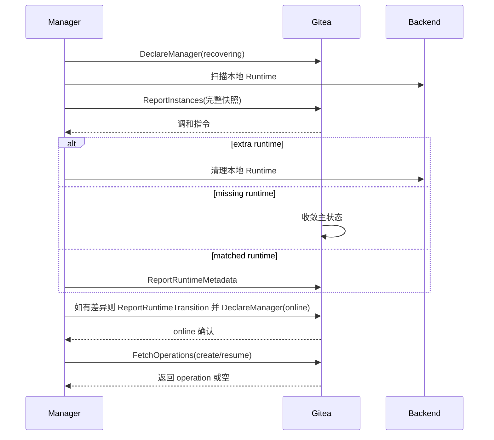

# 维护与重启恢复

## 总体模型

Gitea 重启和 Manager 重启都属于日常维护事件。维护恢复不直接改变 codespace 主状态，而是影响 operation 超时判定、Runtime Metadata 重建、Runtime inventory 差异处理和 Gateway session。

维护恢复使用三类数据：

| 类型 | 负责方 | 作用 |
| --- | --- | --- |
| Gitea-issued operation | Gitea | 当前 active operation，表达 Gitea 期望 Manager 执行的 create/resume/stop/delete。 |
| Main State | Gitea | `creating/running/stopped/deleting/failed`，表达 codespace 资源生命周期结果。 |
| Runtime Fact | Manager | `ReportInstances`、`ReportRuntimeMetadata` 和 `ReportRuntimeTransition`，表达运行侧实际资源与交互入口。 |

生命周期状态以 Gitea 数据库为准，本地 cache 和 Manager inventory 只提供运行信息。维护期间 Gitea 保持主状态稳定；Manager 恢复完成并上报完整 inventory 后，Gitea 根据事实处理差异。

## Gitea 重启恢复

Gitea 重启后从数据库恢复：

```text
codespace.status
operation_rversion
operation_type
operation_status
operation_created_unix
operation_started_unix
operation_deadline_unix
manager_id
token binding
日志元数据
```

本地短期数据由 Manager 或用户交互重建：

```text
Gateway Open Token cache
Runtime Metadata cache
本机锁
短期页面展示数据
```

启动后主状态保持：

| 主状态 | 恢复行为 |
| --- | --- |
| `creating` | 等待当前 create operation 继续上报，或等待完整 inventory 给出运行侧事实。 |
| `running` | 主状态保持，等待 Manager 重建 Runtime Metadata；open/SSH 在 metadata 缺失时返回 `metadata_rebuilding`。 |
| `stopped` | 主状态保持，等待完整 inventory 确认可恢复 Runtime 资源仍存在。 |
| `deleting` | 等待当前 delete operation 继续上报，或等待 inventory 确认资源已缺失后物理删除。 |
| `failed` | 保持 failed；若 Manager 仍上报 Runtime，则返回 cleanup 指令。 |

Gitea 本地 cache 只承载 open token、Runtime Metadata 和短期页面展示数据。进程重启后保留数据库状态，可以减少维护重启造成的批量误失败；Runtime Metadata 由 Manager 重建，Gateway Open Token 由用户重新 open 生成。

## Manager 重启恢复

Manager 启动流程：

1. `DeclareManager(manager_runtime_state=recovering)`。
2. 扫描本地所有 Runtime 资源。
3. 生成 Runtime inventory 快照。
4. `ReportInstances(snapshot_complete=true)` 上报完整快照。
5. 使用 `FetchOperations(observed_operations=...)` 重新获取缺失或版本变化的 active operation payload。
6. 继续本地仍有效的 operation。
7. 为 `creating/running/stopped` 且归属自己的 codespace 重建 Runtime Metadata。
8. 对本地策略导致的 stopped/running 事实调用 `ReportRuntimeTransition`。
9. `DeclareManager(manager_runtime_state=online)`。
10. 恢复领取新的 create/resume。

Manager 重启后先恢复已有 Runtime 信息，再领取新的 create/resume，可以让 Gitea 中已有 codespace 平稳接回。`operation_rversion` 相同的 running operation 不需要重复下发完整 payload；版本缺失或不同则由 Gitea 重新下发。

Manager 重启恢复流程：



实现验收点：

- recovering 状态写入 `codespace_manager.runtime_state`。
- recovering 期间接受 `UpdateOperation`、`UpdateLog`、`ReportInstances`、`ReportRuntimeMetadata`、`ReportRuntimeTransition`。
- Manager 完成本地扫描和 metadata 重建后声明 online。
- online 后恢复领取新的 create/resume。

## Runtime Inventory Reconciliation

`ReportInstances` 上报 Manager 本地 Runtime inventory。

inventory 语义：

- 上报 Manager 持有的所有 Runtime 资源，而不只是 running 进程。
- stopped workspace、volume 或可恢复实例也必须上报。
- snapshot_complete=false 只用于增量诊断，不驱动 missing 判定。
- snapshot_complete=true 表示 Manager 本轮扫描完成，Gitea 可以计算 expected/reported 差异。

Request：

```text
snapshot_id
snapshot_complete
instances:
  - codespace_uuid
    runtime_state
    observed_operation_rversion
    observed_unix
```

Gitea 计算：

```text
expected = Gitea 中绑定该 Manager 且按主状态应存在 Runtime 资源的 codespace
reported = Manager 上报的本地 Runtime 资源
extra = reported - expected
missing = expected - reported
```

Gitea 主状态决定 expected：

| Gitea 状态 | Runtime 期望 |
| --- | --- |
| `creating` 且 `manager_id=0` | 不期望，尚未领取。 |
| `creating` 且 `manager_id!=0` | 期望存在或正在创建。 |
| `running` | 期望存在且 running。 |
| `stopped` | 期望存在且 stopped/retained。 |
| `deleting` | 期望可能存在；缺失即可完成删除。 |
| `failed` | 不要求存在；若存在则按 cleanup 策略处理。 |
| 已物理删除 | 不期望。 |

## Extra Runtime 处理

extra runtime 表示 Manager 本地存在一条 Gitea 当前没有记录为应存在的 Runtime。

| 场景 | Gitea 指令 |
| --- | --- |
| Gitea 无 codespace 记录 | `cleanup_local_runtime` |
| codespace 已物理删除 | `cleanup_local_runtime` |
| codespace 绑定其他 Manager | `cleanup_local_runtime` |
| codespace 状态为 `failed` | `cleanup_local_runtime` |
| codespace 状态为 `creating` 且 `manager_id=0` | `cleanup_local_runtime` |

Gitea 记录中没有当前 Manager 对该 Runtime 的生命周期归属时，该 Runtime 属于运行侧残留资源。Gitea 返回 cleanup 指令，让 Manager 清理本地残留 Runtime。

## Missing Runtime 处理

missing runtime 表示 Gitea 记录中应该存在 Runtime 资源，但 Manager 完整快照中没有对应资源。

| Gitea 状态 | 处理方式 |
| --- | --- |
| `creating` | Manager online 且 snapshot complete 后进入 `failed`，吊销 token，清空 active operation。 |
| `running` | 进入 `failed`，吊销 token，清空 active operation。 |
| `stopped` | 进入 `failed`，因为已经无法 resume。 |
| `deleting` | 视为 cleanup 已完成，物理删除 codespace、token、日志和绑定数据。 |
| `failed` | 保持 failed。 |

Runtime 缺失说明 Manager 无对应资源。delete 时缺失即满足目标；creating/running/stopped 时缺失表明无法恢复，转入 failed。

## Manager 主动 Transition 恢复

Manager 可以在重启后发现本地 Runtime 已经 stopped 或 running，但 Gitea 当前没有对应 active operation。此时 Manager 使用 `ReportRuntimeTransition` 上报事实。

| Gitea 状态 | Runtime fact | Gitea 行为 |
| --- | --- | --- |
| `running` 且无 active operation | stopped | 接受，写 `status=stopped`，吊销 token。 |
| `stopped` 且无 active operation | running | 接受，写 `status=running`，要求同请求携带 Runtime Metadata。 |
| `running/stopped` 且有 active operation | 任意 | 拒绝，返回 `current_operation_conflict`。 |
| `creating/deleting/failed` | 任意 | 拒绝，返回 `stale_operation`。 |

Manager 主动 transition 是运行事实上报，不是 Gitea-issued operation，不递增 `operation_rversion`。

## Active Operation 超时

`operation_created_unix + QUEUE_TIMEOUT` 是 queued operation 等待 Manager 领取的最长时间。`operation_deadline_unix` 是 running operation 的 lease 截止时间。Manager 在截止前通过 `UpdateOperation` 续租或上报终态。

queued operation 等待超时后按当前 operation failed 处理：写 `status=failed`、吊销 token、清空 active operation。

running operation lease 到期时按 Manager 状态判断：

| Manager 状态 | 处理 |
| --- | --- |
| online | 按当前 operation failed 处理，吊销 token，清空 active operation。 |
| recovering | 暂缓失败，等待完整 inventory 或 Manager online。 |
| offline 且未超过 `MANAGER_RESTART_GRACE` | 暂缓失败。 |
| offline 超过 `MANAGER_RESTART_GRACE` | 按当前 operation failed 处理，吊销 token，清空 active operation。 |

维护窗口属于 Manager 可用性事件，不写入每条 codespace。完整 inventory 到达后优先使用运行侧事实，不再等待 operation timeout。

## Operation 恢复

Manager 重启后继续处理当前 Gitea-issued operation。

| operation | Runtime 状态 | Manager 行为 |
| --- | --- | --- |
| stop | Runtime 仍运行 | 继续 stop，完成后上报 done。 |
| stop | Runtime 已停止 | 上报 done。 |
| stop | Runtime 不存在 | 上报 failed；Gitea 根据 missing runtime 进入 failed。 |
| resume | Runtime 已运行且 metadata 完整 | 先上报 Runtime Metadata，再上报 done。 |
| resume | Runtime 正在恢复 | 继续 resume 并上报 progress。 |
| resume | Runtime 仍停止 | 继续执行 resume。 |
| resume | Runtime 不存在或恢复失败 | 上报 failed。 |

stop 让 running codespace 退出可交互态并保留可恢复资源。Runtime 不存在则无法满足 stopped 可恢复语义，故进入 failed。resume 恢复可交互态，Manager 先重建 Runtime Metadata 再上报 resume done，使状态与交互入口同步可用。

## Reconciliation

恢复证据：

```text
DeclareManager(recovering/online)
ReportInstances(snapshot_complete=true)
ReportInstances 包含 codespace_uuid
UpdateOperation 携带当前 operation_rversion
ReportRuntimeMetadata 被接受
ReportRuntimeTransition 被接受
```

差异分类：

```text
extra_runtime
missing_runtime
manager_mismatch
stale_operation
current_operation_conflict
metadata_missing
metadata_required
snapshot_incomplete
```

实现验收点：

- Manager recovering/offline grace 内不因 operation deadline 直接失败 active operation。
- snapshot_complete=false 不触发 missing runtime。
- snapshot_complete=true 后计算 expected/reported 差异。
- extra runtime 返回 cleanup。
- missing runtime 按当前主状态处理。
- Manager 主动 stopped/running 事实通过 `ReportRuntimeTransition` 收敛。
- `running` 主状态在 Manager offline/recovering 时保持稳定，交互入口返回 unavailable/recovering 分类。

## Gateway Session 恢复

Gateway session 是 Manager/Gateway 本地连接状态。Gitea 重启不恢复 Gateway session；Manager/Gateway 根据本地 TTL、idle timeout、Runtime 断开和周期 revalidate 自行关闭或延续连接。新的 open/SSH 入口仍需重新经过 Gitea 权限、主状态、Manager 在线态和 Runtime Metadata 校验。
