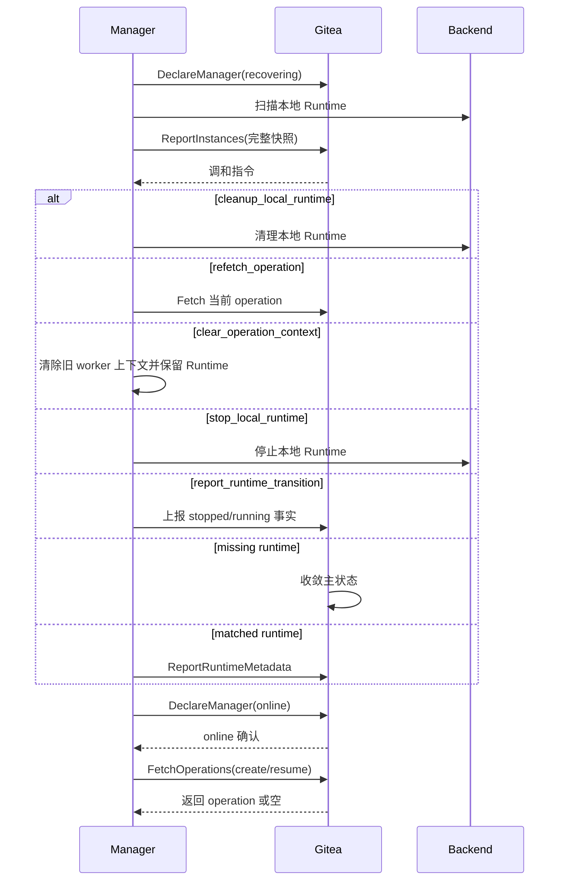

# 维护与重启恢复

## 总体模型

Gitea 重启和 Manager 重启都属于日常维护事件。维护恢复不直接改变 codespace 主状态，而是影响 operation 超时判定、Runtime Metadata 重建、Runtime inventory 差异处理和 Gateway session。

维护恢复使用三类数据：

| 类型 | 负责方 | 作用 |
| --- | --- | --- |
| Gitea-issued operation | Gitea | 当前 active operation，表达 Gitea 期望 Manager 执行的 create/resume/stop/delete。 |
| Main State | Gitea | `creating/running/stopped/deleting/failed`，表达 codespace 资源生命周期结果。 |
| Runtime Fact | Manager | `ReportInstances`、`ReportRuntimeMetadata` 和 `ReportRuntimeTransition`，表达运行侧实际资源与交互入口。 |

生命周期状态以 Gitea 数据库为准，本地 cache 和 Manager inventory 只提供运行信息。维护期间 Gitea 保持主状态稳定；Manager 恢复完成并上报完整 inventory 后，Gitea 根据事实处理差异。

实现验收点：

- Gitea 重启或 Manager 重启本身不改写 codespace 主状态。
- operation、主状态和 Runtime fact 始终由表中指定的负责方提供。

## Gitea 重启恢复

Gitea 重启后从数据库恢复：

```text
codespace.status
operation_rversion
operation_type
operation_status
operation_created_unix
operation_started_unix
operation_deadline_unix
manager_id
token binding
日志元数据
```

本地短期数据由 Manager 或用户交互重建：

```text
Gateway Open Token cache
Runtime Metadata cache
本机锁
短期页面展示数据
```

启动后主状态保持：

| 主状态 | 恢复行为 |
| --- | --- |
| `creating` | 等待当前 create operation 继续上报，或等待完整 inventory 给出运行侧事实。 |
| `running` | 主状态保持，等待 Manager 重建 Runtime Metadata；open/SSH 在 metadata 缺失时返回 `metadata_rebuilding`。 |
| `stopped` | 主状态保持，等待完整 inventory 确认可恢复 Runtime 资源仍存在。 |
| `deleting` | 等待当前 delete operation 继续上报，或等待 inventory 确认资源已缺失后物理删除。 |
| `failed` | 保持 failed；若 Manager 仍上报 Runtime，则返回 cleanup 指令。 |

Gitea 本地 cache 只承载 open token、Runtime Metadata 和短期页面展示数据。进程重启后保留数据库状态，可以减少维护重启造成的批量误失败；Runtime Metadata 由 Manager 重建，Gateway Open Token 由用户重新 open 生成。

实现验收点：

- Gitea 重启后从数据库恢复 active operation、token binding 和日志元数据。
- cache 丢失不写 failed，用户可重新 open，Manager 可重建 metadata。

## Manager 重启恢复

Manager 启动流程：

1. 取得该 Manager 本地状态目录独占锁；锁已被其他进程持有时退出，不发送 RPC。
2. `DeclareManager(manager_runtime_state=recovering)`。
3. 扫描本地所有 Runtime 资源。
4. 生成 Runtime inventory 快照。
5. 递增 `inventory_generation`，通过 `ReportInstances` 上报完整快照。
6. 使用 `FetchOperations(observed_operations=...)` 重新获取缺失或版本变化的 active operation payload。
7. 继续本地仍有效的 operation。
8. 为 `creating/running/stopped` 且归属自己的 codespace 重建 Runtime Metadata。
9. 对本地策略导致的 stopped/running 事实调用 `ReportRuntimeTransition`。
10. `DeclareManager(manager_runtime_state=online)`。
11. 恢复领取新的 create/resume。

Manager 重启后先恢复已有 Runtime 信息，再领取新的 create/resume，可以让 Gitea 中已有 codespace 平稳接回。`operation_rversion` 相同且本地上下文完整的 running operation 不需要重复下发完整 payload；版本缺失或不同则由 Gitea 返回当前 operation。Manager disabled 时不恢复 create/resume 执行，只处理 abort、stop、delete 和本地调和指令。

Manager 重启恢复流程：



实现验收点：

- recovering 状态写入 `codespace_manager.runtime_state`。
- enabled Manager 在 recovering 期间接受 `UpdateOperation`、`UpdateLog`、`ReportInstances`、`ReportRuntimeMetadata`、`ReportRuntimeTransition`；disabled Manager 始终按 disabled 能力表处理。
- Manager 完成本地扫描和 metadata 重建后声明 online。
- online 后恢复领取新的 create/resume。
- 同一 Manager 身份的第二个本地进程无法越过状态目录独占锁，不支持同身份多进程运行。
- Manager 从原子当前快照恢复 operation payload、generation 和 Runtime 映射；Fetch 空响应不清除 worker，只有明确的 `clear_operation_context` 指令执行清理。

## Runtime Inventory Reconciliation

`ReportInstances` 上报 Manager 本地 Runtime inventory。

Manager 在启动恢复、每个 `inventory_report_interval` 和 backend 资源异常事件后提交完整快照；周期上报让运行期间发生的外部 Runtime 删除或未知资源也能收敛，不依赖 Gitea Cron 保存 inventory。

inventory 语义：

- 上报 Manager 持有的所有 Runtime 资源，而不只是 running 进程。
- stopped workspace、volume 或可恢复实例也必须上报。
- 第一版每次请求都是完整快照，不提供增量或 incomplete 模式；单次最多 10000 个实例且 UUID 唯一。
- `inventory_generation` 由 Manager 单调递增；更高版本执行差异写入，相同 generation、相同规范化快照不重复写主状态但重新返回当前 instruction，相同 generation、不同快照返回 conflict，更低版本返回 stale 和当前 generation。
- inventory 规范化按 UUID 排序并包含 runtime state 与 observed operation version；Gitea 将其 SHA-256 与当前 `inventory_hash` 比较。

Request：

```text
inventory_generation
instances:
  - codespace_uuid
    runtime_state
    observed_operation_rversion
```

Gitea 计算：

```text
expected = Gitea 中绑定该 Manager 且按主状态应存在 Runtime 资源的 codespace
reported = Manager 上报的本地 Runtime 资源
extra = reported - expected
missing = expected - reported
```

Gitea 主状态决定 expected：

| Gitea 状态 | Runtime 期望 |
| --- | --- |
| `creating` 且 `manager_id=0` | 不期望，尚未领取。 |
| `creating` 且 `manager_id!=0` | 期望存在或正在创建。 |
| `running` | 期望存在且 running。 |
| `stopped` | 期望存在且 stopped/retained。 |
| `deleting` | 期望可能存在；缺失即可完成删除。 |
| `failed` | 不要求存在；若存在则按 cleanup 策略处理。 |
| 已物理删除 | 不期望。 |

实现验收点：

- expected 集合只按绑定 Manager 和持久主状态计算。
- 相同 generation 的相同快照可以重获 instruction 而不重复状态写入，旧 generation 不驱动任何差异写入。
- 相同 generation、相同快照的重试按当前数据库状态重新计算 instruction，已经完成的条件状态写入保持幂等。

## Extra Runtime 处理

extra runtime 表示 Manager 本地存在一条 Gitea 当前没有记录为应存在的 Runtime。

| 场景 | Gitea 指令 |
| --- | --- |
| Gitea 无 codespace 记录 | `cleanup_local_runtime` |
| codespace 已物理删除 | `cleanup_local_runtime` |
| codespace 绑定其他 Manager | `cleanup_local_runtime` |
| codespace 状态为 `failed` | `cleanup_local_runtime` |
| codespace 状态为 `creating` 且 `manager_id=0` | `cleanup_local_runtime` |

Gitea 记录中没有当前 Manager 对该 Runtime 的生命周期归属时，该 Runtime 属于运行侧残留资源。Gitea 返回 cleanup 指令，让 Manager 清理本地残留 Runtime。

实现验收点：

- 无记录、已删除、Manager 不匹配和 failed 资源都返回 `cleanup_local_runtime`。
- extra runtime 处理不创建 codespace 记录或改写其他 codespace 状态。

## Missing Runtime 处理

missing runtime 表示 Gitea 记录中应该存在 Runtime 资源，但 Manager 完整快照中没有对应资源。

| Gitea 状态 | 处理方式 |
| --- | --- |
| `creating` 且 active create lease 有效 | 保持 creating，Runtime 可能仍在创建。 |
| `creating` 且 active create lease 已失效或 active operation 缺失 | 进入 `failed`，吊销 token，清空 active operation。 |
| `running` | 进入 `failed`，吊销 token，清空 active operation。 |
| `stopped` | 进入 `failed`，因为已经无法 resume。 |
| `deleting` | 视为 cleanup 已完成，物理删除 codespace、token、日志和绑定数据。 |
| `failed` | 保持 failed。 |

Runtime 缺失说明 Manager 无对应资源。delete 时缺失即满足目标；running/stopped 时缺失表明无法恢复。creating 在 create lease 有效期间允许 Runtime 尚未出现在 backend scan 中，lease 失效后再按 operation timeout 收敛。

实现验收点：

- active create lease 有效时 missing 不写 failed。
- deleting 资源缺失完成物理删除，running/stopped 资源缺失进入 failed。

## Manager 主动 Transition 恢复

Manager 可以在重启后发现本地 Runtime 已经 stopped 或 running，但 Gitea 当前没有对应 active operation。此时 Manager 使用 `ReportRuntimeTransition` 上报事实。

| Gitea 状态 | Runtime fact | Gitea 行为 |
| --- | --- | --- |
| `running` 且无 active operation | stopped | 接受，写 `status=stopped`，吊销 token。 |
| `stopped` 且无 active operation | running | 接受，写 `status=running`，要求同请求携带 Runtime Metadata。 |
| `running/stopped` 且有 active operation | 任意 | 拒绝，返回 `current_operation_conflict`。 |
| `creating/deleting/failed` | 任意 | 拒绝，返回 `stale_operation`。 |

Manager 主动 transition 是运行事实上报，不是 Gitea-issued operation，不递增 `operation_rversion`。

Manager 每次主动 stop/resume 递增 `runtime_generation`，并携带产生事实时观察到的 `operation_rversion`。Gitea 按 binding、active operation、Manager 状态、operation 版本、runtime generation、状态/fact、metadata 的固定顺序校验；相同 generation 在主状态已匹配时幂等接受，更低版本返回当前已接受 generation。两个版本共同避免延迟事实覆盖较新的 Gitea-issued operation 结果，固定顺序保证相同请求得到稳定失败分类。

`ReportRuntimeTransition` 只提交当前事实、`runtime_generation` 和 `observed_operation_rversion`。Gitea 不保存 transition 历史，因此不提交观察时间或原因字段；运行侧诊断保留在 Manager 本地日志。

实现验收点：

- 主动 transition 只在无 active operation 时生效。
- generation 确保旧 stop/resume 事实不能覆盖新主状态。
- `observed_operation_rversion` 确保旧 operation 上下文产生的事实不能在新 operation final 后生效。

## Active Operation 超时

`operation_created_unix + QUEUE_TIMEOUT` 是 queued operation 等待 Manager 领取的硬截止时间；`now >= deadline` 后即使 Cron 尚未扫描也不能再领取。`operation_deadline_unix` 是 running operation 的 lease 截止时间。online Manager 必须在截止前通过 `UpdateOperation` 续租或上报终态。

queued operation 等待超时后按当前 operation failed 处理：写 `status=failed`、吊销 token、清空 active operation。

running operation lease 到期时按 Manager 状态判断：

| Manager 状态 | 处理 |
| --- | --- |
| online | 按当前 operation failed 处理，吊销 token，清空 active operation。 |
| recovering 且未超过 `MANAGER_RESTART_GRACE` | 暂缓失败，等待完整 inventory 或 Manager online。 |
| recovering 超过 `MANAGER_RESTART_GRACE` | 不再暂停 lease 超时，按当前 operation failed 处理。 |
| offline 且 `now-(last_online_unix+MANAGER_OFFLINE_TIMEOUT) <= MANAGER_RESTART_GRACE` | 暂缓失败。 |
| offline 超过上述 hard deadline | 按当前 operation failed 处理，吊销 token，清空 active operation。 |

维护窗口属于 Manager 可用性事件，不写入每条 codespace。offline 从 `last_online_unix+MANAGER_OFFLINE_TIMEOUT` 成立的时刻起算 grace；recovering 从首次 `last_recovering_unix` 起算。有效 grace 内，绑定 Manager 可用当前版本的首次 Fetch、renew 或 final 原子恢复已到期 lease；超过 hard deadline 后不能恢复。Cron、claim、renew 和 final 使用 `codespace_uuid + operation_rversion + operation_status` 条件更新，第一个成功者生效。完整 inventory 到达后在 `ReportInstances` 请求内优先使用运行侧事实，不再等待 operation timeout。

实现验收点：

- online 超时按 operation 失败处理，recovering 和 offline grace 内暂缓；recovering 超过 hard grace 后不再冻结 operation。
- queued timeout 与 running lease 使用不同时间字段。
- deadline 在 claim/renew/final 路径直接校验；grace 恢复与 Cron 并发时只有一个条件更新生效。

## Operation 恢复

Manager 重启后继续处理当前 Gitea-issued operation。

| operation | Runtime 状态 | Manager 行为 |
| --- | --- | --- |
| create | Runtime 与持久 create payload/boot session 完整 | 继续当前 create；boot 已成功则上报 metadata 和 done。 |
| create | `repo_id=0` 且收到 `recover_create_without_source` | 检查确定性 Runtime、持久 boot 结果和 metadata；确认初始化完成后补齐 `ready` 快照并 done，否则清理并 failed。 |
| create | 收到 `abort_create` | 清理本轮 Runtime 工作、上传摘要并 final failed，不重新读取 repository payload。 |
| stop | Runtime 仍运行 | 继续 stop，完成后上报 done。 |
| stop | Runtime 已停止 | 上报 done。 |
| stop | Runtime 不存在 | 上报 failed；Gitea 根据 missing runtime 进入 failed。 |
| resume | Runtime 已运行且基础 metadata 完整 | 上报基础 Runtime Metadata，再上报 done；进入 running 后申请新 Gitea token、刷新 Git credential 并上报完整 Endpoint metadata。 |
| resume | Runtime 正在恢复 | 继续 resume，通过 renew lease 保持 operation，并用 Runtime Metadata 和日志上报阶段。 |
| resume | Runtime 仍停止 | 继续执行 resume。 |
| resume | Runtime 不存在或恢复失败 | 上报 failed。 |
| resume | 收到 `abort_resume` | 停止恢复并清理本轮新建进程，上传摘要后 final failed。 |
| delete | Runtime 仍存在 | 继续按 `codespace_uuid` 的确定性映射清理，完成后上报 done。 |
| delete | Runtime 已不存在 | 直接上报 done；若 Gitea 已物理删除，`resource_absent` 同样视为完成。 |

stop 让 running codespace 退出可交互态并保留可恢复资源。Runtime 不存在则无法满足 stopped 可恢复语义，故进入 failed。resume 恢复可交互态，Manager 先重建 Runtime Metadata 再上报 resume done，使状态与交互入口同步可用。

实现验收点：

- Manager 重启后使用相同 `operation_rversion` 继续幂等 create/resume/stop/delete；disabled abort 使用同一版本收敛为 failed。
- resume 进入 running 后轮换 Git token 并刷新 credential，不重新初始化 repository。

## Reconciliation

恢复证据：

```text
DeclareManager(recovering/online)
ReportInstances(完整快照)
ReportInstances 包含 codespace_uuid
UpdateOperation 携带当前 operation_rversion
ReportRuntimeMetadata 被接受
ReportRuntimeTransition 被接受
```

差异分类：

```text
extra_runtime
missing_runtime
manager_mismatch
stale_operation
current_operation_conflict
metadata_missing
metadata_required
```

`ReportInstances` response 不把分类和动作拆成可任意组合的字段，而是返回互斥 action：`cleanup_local_runtime`、`report_runtime_transition`、`refetch_operation(current_operation_rversion)`、`clear_operation_context(current_operation_rversion)` 或 `stop_local_runtime`。当前存在 active operation 且版本不一致时不使用该实例事实改写主状态，Manager 先 Fetch 当前 payload；当前无 active operation 时明确要求清除旧 worker 上下文。Fetch 未返回某 UUID 不代表服务端已清除 operation。disabled Manager 在 Gitea stopped、Runtime running 时执行本地 stop，在 Gitea running、Runtime stopped 时只上报 stopped，因而不会收到无法执行的 running transition。

实现验收点：

- Manager recovering/offline grace 内不因 operation deadline 直接失败 active operation。
- ReportInstances 始终以完整快照计算 expected/reported 差异。
- inventory 差异只在 `ReportInstances` 请求内处理，不由 Cron 保存或重放。
- extra runtime 返回 cleanup。
- missing runtime 按当前主状态处理。
- Manager 主动 stopped/running 事实通过 `ReportRuntimeTransition` 收敛。
- `running` 主状态在 Manager offline/recovering 时保持稳定，交互入口返回 unavailable/recovering 分类。
- 旧 `inventory_generation`、`runtime_generation` 和 `metadata_generation` 不覆盖已接受的新事实。
- operation refetch 与上下文清除使用不同 instruction，Manager 不从空 Fetch 响应推导服务端状态。

## Gateway Session 恢复

Gateway session 是 Manager/Gateway 本地连接状态。Gitea 重启不恢复 Gateway session；Manager/Gateway 根据本地 TTL、idle timeout、Runtime 断开和 `RevalidateGatewaySession` 周期判定关闭或延续连接。新的 open/SSH 入口仍需重新经过 Gitea 权限、主状态、Manager 在线态和 Runtime Metadata 校验。

实现验收点：

- Gitea 重启不改变持久主状态，Manager 可重发当前 running operation payload 并继续执行。
- 新 generation 的完整 inventory 驱动 missing 判定；相同 generation 重试只重发当前 instruction，不重复状态写入。
- active create lease 有效期间，Runtime 暂未出现在完整 inventory 中不会被误判为 failed。
- Gateway 已有 session 通过专用 revalidate RPC 恢复权限检查，不重复消费 open code。
