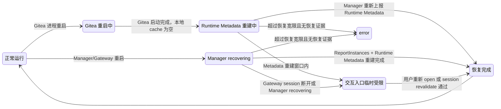
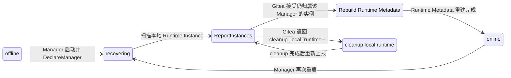

# 维护与重启恢复

## 设计目标

Gitea 重启和 Manager 重启都属于日常维护事件。重启会短暂影响本地 cache、worker、Gateway session 或 Runtime 观测数据，但不直接代表 codespace 生命周期失败。

维护恢复设计遵循以下原则：

- codespace 主状态仍由 Gitea 数据库和 State Finalization 维护。
- Gitea 或 Manager 重启不直接改写 `codespace.status`。
- 交互能力可以临时返回 `manager recovering`、`runtime metadata rebuilding` 或 `open token expired` 分类。
- 生命周期失败只在超过恢复宽限窗口，并且 Manager/Runtime 没有提供可恢复证据时，由 reconciliation 推进到 `error`。

这样设计的原因是重启通常来自升级、配置变更或主机维护。把重启直接转成 `error` 会让用户在维护窗口后看到大量误报失败，而 Runtime Instance 可能实际仍在正常运行。

## 总体状态变化



该图表达的是维护观测态，不新增用户可见的 codespace 主状态。`MetadataRebuild`、`ManagerRecovering` 和 `InteractiveLimited` 用于 UI 提示、Gateway 返回分类和 reconciliation 判断。

## Gitea 重启恢复

Gitea 重启会丢失本地短期数据：

- Gateway Open Token cache。
- Runtime Metadata cache。
- 本机锁和短期页面观测数据。

Gitea 数据库仍保留：

- codespace 主状态。
- operation 状态和 deadline。
- `manager_id`。
- token binding。
- operation 日志。
- Manager 最近在线时间和容量快照。

恢复规则：

- Gitea 启动后保持现有 `queued|booting|running|stopping|stopped|resuming|deleting|error` 主状态。
- Open Token cache 丢失后，未消费的旧 open token 失效，用户重新从 Gitea 发起 open。
- Runtime Metadata cache 丢失后，页面显示 `runtime metadata rebuilding`。
- Gitea 等待 Manager 通过 `DeclareManager`、`ReportInstances` 和 `ReportRuntimeMetadata` 重建运行观测数据。
- 在 `GITEA_RESTART_RECOVERY_GRACE` 内，reconciliation 不因为 Runtime Metadata cache miss 推进到 `error`。
- 超过恢复宽限后，reconciliation 仍按 Manager offline timeout、operation deadline 和 ReportInstances 分歧推进。

配置：

```ini
GITEA_RESTART_RECOVERY_GRACE = 5m
RUNTIME_METADATA_REBUILD_GRACE = 5m
```

这样设计的原因是 Gitea 本地 cache 只影响交互入口和页面展示，不是主状态权威。重启后由 Manager 重建 cache，比把 cache miss 解释为 Runtime 失败更符合维护场景。

## Manager 重启恢复

Manager 重启会影响：

- 本地 worker pool。
- 正在执行的 operation 内存上下文。
- Gateway live sessions。
- Runtime Metadata 周期上报。
- Runtime Token 本地校验状态。
- backend connection。

Runtime Instance 可能仍存在，workspace 数据也可能完整。Manager 重启后先恢复本地观测，再恢复接收新任务。

Manager 启动流程：

1. Manager 进入本地 `recovering` 阶段。
2. 调用 `DeclareManager`，上报 `manager_runtime_state=recovering`。
3. 扫描本地 Runtime Instance。
4. 通过确定性 Runtime Instance name 解析 `codespace_uuid`。
5. 调用 `ReportInstances` 上报本地实例集合。
6. 对本地存在且 Gitea 仍认为属于该 Manager 的 active codespace，重建 Runtime Metadata。
7. 完成扫描与 Runtime Metadata 重建后，上报 `manager_runtime_state=online`。
8. 恢复 `FetchOperation(create|resume)`。

这样设计的原因是 Manager 重启后最重要的是先恢复“本地已有 Runtime”，再恢复“接收新 operation”。这可以避免 Manager 刚启动就领取新 create/resume，而旧 Runtime 还没有被发现和整理。

## Manager 重启状态变化



`recovering` 是 Manager 运行态，不是 codespace 主状态。Gitea 在 `recovering` 期间限制新的 create/resume claim，但保留 stop/delete、ReportInstances、UpdateOperation 和 Runtime Metadata 重建能力。

## Operation 恢复

Manager 重启期间，operation 按类型恢复。

| operation | Runtime 观测结果 | 恢复动作 | 设计原因 |
| --- | --- | --- | --- |
| create/resume | Runtime 存在且 boot 已完成，metadata 完整 | Manager 上报 `done`，Gitea Finalization 推进到 `running` | 用户关心最终 workspace 是否可用，重启不应抹掉已完成事实。 |
| create/resume | Runtime 存在但 boot 未完成 | Manager 继续执行或重新执行幂等 boot/init stage | create/resume 的 init 以锁定 `commit_sha` 和确定性 Runtime name 为幂等边界。 |
| create/resume | Runtime 不存在 | Manager 上报 failed；或 Gitea 在恢复宽限后进入 `error` | 缺少 Runtime 且无恢复证据时，保留日志后进入失败终态。 |
| stop | Runtime 已停止 | Manager 上报 `done` | stop 的目标状态已经达成。 |
| stop | Runtime 仍运行 | Manager 重新执行 stop | stop 是幂等管理动作。 |
| stop | Runtime 不存在 | Manager 上报 `done`，Gitea 推进到 `stopped` | Runtime 不存在满足停止后的不可交互目标。 |
| delete | Runtime 已删除或不存在 | Manager 上报 `done`，Gitea 物理删除 codespace 和日志 | delete 的目标是清理运行侧和记录。 |
| delete | Runtime 仍存在 | Manager 重新执行 delete | delete 是幂等清理动作，恢复后继续推进资源回收。 |

## Reconciliation 规则

配置：

```ini
MANAGER_RESTART_GRACE = 10m
OPERATION_RECOVERY_GRACE = 15m
DELETE_RECOVERY_GRACE = 30m
RUNTIME_METADATA_REBUILD_GRACE = 5m
```

规则：

- Manager 超过 `MANAGER_OFFLINE_TIMEOUT` 后标记为 offline，交互入口返回 manager unavailable 分类。
- Manager offline 不直接推进其持有的 active codespace 到 `error`。
- active operation 超过 `operation_deadline_unix` 后，先进入 operation recovery window。
- Manager 在 `OPERATION_RECOVERY_GRACE` 内重新 online 并上报 recovering 时，Gitea 接受该 Manager 继续或完成原 operation。
- delete 使用 `DELETE_RECOVERY_GRACE`，因为 delete 是资源清理动作，等待 Manager 回来继续清理比快速进入 `error` 更有价值。
- 超过恢复宽限仍没有 Manager online、ReportInstances 或 Runtime Metadata 证据时，Gitea 通过 State Finalization 进入 `error`。
- `running` codespace 在 Manager offline/recovering 期间保持 `running` 主状态，open/SSH 返回 manager unavailable 或 manager recovering 分类。

这样设计的原因是主状态代表用户可理解的生命周期，不应频繁受短暂进程重启影响。交互入口可以实时反映 Manager online/recovering 状态，生命周期状态则通过恢复窗口稳定收敛。

## Gateway Session 恢复

Gitea 重启：

- 已建立 Gateway session 等待下一次 revalidate。
- Open Token cache 丢失只影响未消费 token。
- revalidate 失败时，Gateway 引导用户重新从 Gitea open。

Manager/Gateway 重启：

- live Endpoint session 和 SSH session 断开。
- 用户重新从 Gitea open 或重新 SSH。
- `running` codespace 主状态保持不变。
- Runtime Metadata 重建前，页面显示 `runtime metadata rebuilding`。

这样设计的原因是长连接断开是维护重启的自然结果，但不代表 workspace 生命周期失败。用户重新 open 或重新 SSH 即可恢复交互。

## 数据模型

新增 Manager 运行态字段：

```text
manager_runtime_state = online | recovering | offline
last_recovering_unix
last_recovered_unix
```

新增 operation 恢复字段：

```text
operation_recovery_deadline_unix
operation_last_recovering_unix
```

`recovering` 放在 Manager/operation 层，而不是 codespace 主状态。这样可以表达维护观测态，又不增加用户可见生命周期状态的复杂度。
