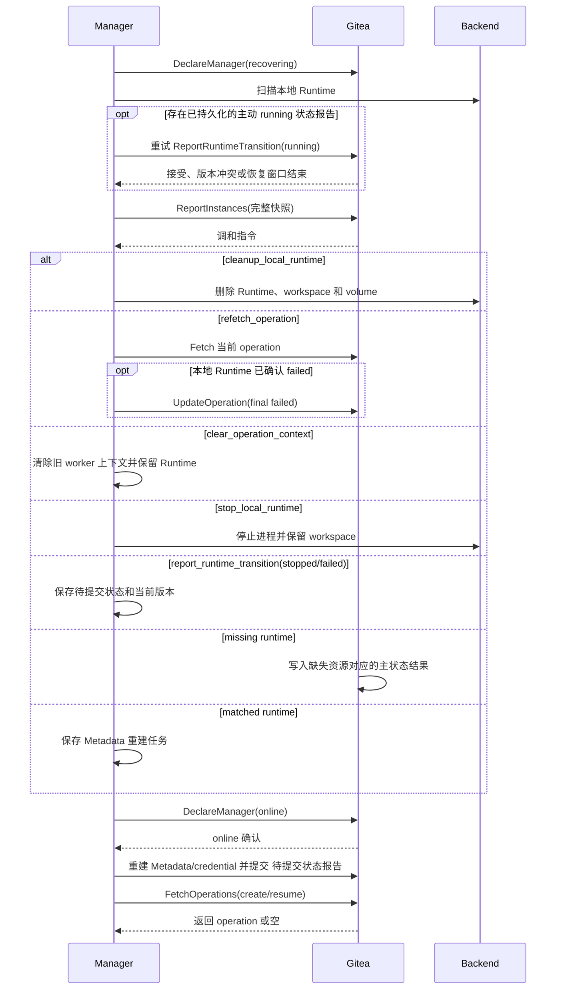

# 维护与重启恢复

## 总体模型

Gitea 重启和 Manager 重启都属于日常维护事件。维护恢复不直接改变 codespace 主状态，而是影响 operation 超时判定、Runtime Metadata 重建、Runtime inventory 差异处理和 Gateway session。

维护恢复使用三类数据：

| 类型 | 负责方 | 作用 |
| --- | --- | --- |
| Gitea-issued operation | Gitea | 当前 active operation，表达 Gitea 期望 Manager 执行的 create/resume/stop/delete。 |
| Main State | Gitea | `creating/running/stopped/deleting/failed`，表达 codespace 资源生命周期结果。 |
| Runtime 状态报告 | Manager | `ReportInstances`、`ReportRuntimeMetadata` 和 `ReportRuntimeTransition`，表达运行侧实际资源与交互入口。 |

生命周期状态以 Gitea 数据库为准，Gitea 缓存和 Manager inventory 提供运行信息。维护期间 Gitea 保持主状态稳定；Manager 恢复完成并上报完整 inventory 后，Gitea 比较两侧状态并按状态表处理差异。

实现验收点：

- Gitea 重启或 Manager 重启本身不改写 codespace 主状态。
- operation、主状态和 Runtime 状态报告始终由表中指定的负责方提供。

## Gitea 重启恢复

Gitea 重启后从数据库恢复：

```text
codespace.status
operation_rversion
operation_type
operation_status
operation_created_unix
operation_started_unix
operation_deadline_unix
manager_id
codespace_gitea_token 当前行
日志元数据
```

以下短期数据缺失时由 Manager、用户交互或后续请求重新建立：

```text
Gateway Open Token cache
Runtime Metadata cache
Gitea globallock 的当前锁持有状态
短期页面展示数据
```

启动后主状态保持：

| 主状态 | 恢复行为 |
| --- | --- |
| `creating` | 等待当前 create operation 继续上报，或等待完整 inventory 给出运行侧状态。 |
| `running` | 主状态保持；Runtime Metadata 缓存未命中时等待 Manager 重建，open/SSH 返回 `metadata_rebuilding`，外部缓存保留的合法快照可继续使用。 |
| `stopped` | 主状态保持，等待完整 inventory 确认可恢复 Runtime 资源仍存在。 |
| `deleting` | 等待当前 delete operation 继续上报，或等待 inventory 确认资源已缺失后物理删除。 |
| `failed` | 保持 failed；若 Manager 仍上报 Runtime，则返回 cleanup 指令。 |

Codespace 通过 Gitea 缓存保存 Open Token、Runtime Metadata 和短期页面展示数据。memory/twoqueue 重启后通常丢失，Redis/memcache 可在 TTL 内保留；缓存未命中时 Runtime Metadata 由 Manager 重建，Gateway Open Token 由用户重新 open 生成。缓存中仍存在的值也要通过当前数据库和权限校验。进程重启保留数据库状态，可以避免把维护重启误判为批量失败。`globallock` 的锁持有状态不属于生命周期数据；重试入口取得新锁后重新读取数据库并执行条件校验。

实现验收点：

- Gitea 重启后从数据库恢复 active operation、当前 Codespace Gitea Token 和日志元数据。
- cache 丢失不写 failed，用户可重新 open，Manager 可重建 metadata。
- memory/twoqueue 丢失 cache 和 Redis/memcache 在 TTL 内保留 cache 都不改变数据库主状态；保留的 Open Code 继续执行完整访问校验，cache miss 按既有重建流程处理。

## Manager 重启恢复

Manager 启动流程：

1. 取得该 Manager 本地状态目录独占锁；锁已被其他进程持有时退出，不发送 RPC。
2. `DeclareManager(manager_runtime_state=recovering)`。
3. 扫描本地所有 Runtime 资源。
4. 对启动 Runtime 前已经持久化、但尚未确认的主动 running 状态报告，先重试对应 `ReportRuntimeTransition`；版本冲突或恢复窗口已经结束时停止 Runtime 和交互入口并保留 workspace，后续 inventory 将再次确认两侧状态。
5. 生成 Runtime inventory 快照。
6. 递增 `inventory_generation`，通过 `ReportInstances` 上报完整快照。
7. 使用 `FetchOperations(observed_operations=...)` 重新获取缺失或版本变化的 active operation payload。
8. 恢复 Runtime 映射和本地 worker 上下文，继续仍有效的 operation，并执行 inventory 返回的 cleanup、clear、stop 和 refetch 指令。
9. `DeclareManager(manager_runtime_state=online)`。
10. 为 `creating/running/stopped` 且归属自己的 codespace 重建 Runtime Metadata。
11. 对 running 且 boot session 仍为 `credential-refresh` 的 Runtime 继续申请 token、刷新 credential 并上报 `ready`。
12. 对本地策略或故障确认产生的 stopped/failed 状态变化调用 `ReportRuntimeTransition`；新的主动 running 先建立并持久化独立 boot 上下文。
13. 上述逐 Codespace 恢复任务完成后，恢复领取新的 create/resume。

Manager 重启后先恢复已有 Runtime 信息，再领取新的 create/resume，使已有 Codespace 优先恢复控制。Declare online 表示完整 backend inventory、Runtime 映射和 worker 上下文已经恢复，可以继续接受逐 Codespace RPC；Runtime Metadata、credential-refresh 或待提交状态报告可以在 online 后继续完成。这个顺序让超过 restart grace 的后置 RPC 仍可执行，同时 Manager 在最后一步 Fetch 前保持 `capacity_available=0` 或省略 create/resume，避免提前领取新工作。`operation_rversion` 相同且本地上下文完整的 running operation 只需续租；版本缺失或不同则由 Gitea 返回当前 operation 数据。站点排空时，Manager 处理 abort、stop、delete 和状态差异指令；超过恢复期限的 operation 由 Gitea 按超时表写入结果。

Manager 重启恢复流程：



实现验收点：

- recovering 状态写入 `codespace_manager.runtime_state`。
- 功能启用时，Manager 在 recovering 期间接受 `UpdateOperation`、`UpdateLog`、`ReportInstances`、`ReportRuntimeMetadata` 和 `ReportRuntimeTransition`；站点排空时按排空能力表处理。
- Manager 完整扫描 backend、恢复 Runtime 映射和 worker 上下文后声明 online；各 Codespace 的 metadata、credential 和状态报告任务在 online 后继续处理。
- 逐 Codespace 恢复任务完成前，Fetch 使用零容量或省略 create/resume；Declare online 本身不分配 operation。
- 同一 Manager 身份的第二个本地进程无法越过状态目录独占锁，不支持同身份多进程运行。
- Manager 从原子当前快照恢复 operation payload、generation 和 Runtime 映射；Fetch 空响应不清除 worker，只有明确的 `clear_operation_context` 指令执行清理。

## Runtime Inventory Reconciliation

`ReportInstances` 上报 Manager 本地 Runtime inventory。

Manager 在启动恢复、每个 `inventory_report_interval` 和 backend 资源异常事件后提交完整快照；Gitea 据此处理运行期间发生的 Runtime 删除或已知状态变化。只有 backend 全量枚举成功、每个资源状态都可确定且扫描期间没有分页或连接错误时，快照才算完整；任一资源状态无法读取或枚举失败时，本轮保留 generation 并重试完整扫描。这样 missing 判定只使用完整集合。

inventory 语义：

- 上报 Manager 持有的所有 Runtime 资源，而不只是 running 进程。
- stopped workspace、volume 或可恢复实例也必须上报。
- `ReportInstances` 每次提交完整快照，单个 Manager 最多持有 10000 个带其 label 的 Runtime 资源，单次请求最多包含 10000 个 UUID 唯一的实例。完整快照使 missing 判定有确定依据，并避免增量丢失造成错误删除。
- `inventory_generation` 由 Manager 单调递增；Gitea 以条件写入接受更高 generation，相同 generation、相同规范化快照继续从当前数据库状态处理，相同 generation、不同快照返回 generation conflict 且不附 stale detail，更低版本返回 stale 和当前 generation。每项写入前及响应返回前复检当前 generation，更高版本成立后旧请求不再写入或返回 instruction。stale 时 Manager 用服务端当前值加一，同代冲突时用请求中的已知值加一；两者都重新完整扫描 backend、持久化新 generation 后提交当前快照。
- inventory 规范化按 UUID 排序并包含 runtime state 与 observed operation version；Gitea 将其 SHA-256 与当前 `inventory_hash` 比较。
- backend 已产生稳定 Runtime identity、但创建尚未完成的资源上报 `creating`；该状态只证明资源存在，不驱动主状态变化。停止过程按扫描时仍可观察到的 running 或已经完成的 stopped 上报。Runtime identity 仍存在、但 Manager 已确认 workspace/volume 或 backend 资源不可恢复时上报 `failed`；该 inventory 状态只用于向 Gitea 取得当前 operation 版本，不直接写主状态。identity 或状态无法确定属于扫描失败，整轮不提交。`observed_operation_rversion=0` 表示 Manager 没有该 Runtime 的本地 active operation 上下文。
- 全量扫描发现超过 10000 个归属该 Manager 的 Runtime 时，不提交截断快照；Manager 保持 recovering、把可用容量声明为 0，并记录本地错误，等待运维把资源数量恢复到协议上限内。

Request：

```text
inventory_generation
instances:
  - codespace_uuid
    runtime_state
    observed_operation_rversion
```

Gitea 计算：

```text
expected = Gitea 中绑定该 Manager 且按主状态应存在 Runtime 资源的 codespace
reported = Manager 上报的本地 Runtime 资源
extra = reported - expected
missing = expected - reported
```

Gitea 主状态决定 expected：

| Gitea 状态 | Runtime 期望 |
| --- | --- |
| `creating` 且 `manager_id=0` | 不期望，尚未领取。 |
| `creating` 且 `manager_id!=0` | 期望存在或正在创建。 |
| `running` | 期望存在且 running。 |
| `stopped` | 期望存在且 stopped/retained。 |
| `deleting` | 期望可能存在；缺失即可完成删除。 |
| `failed` | Runtime 可以已清除；仍存在时按 cleanup 策略处理。 |

实现验收点：

- expected 集合只按绑定 Manager 和持久主状态计算。
- 不完整或含未知资源状态的 backend 扫描不会递增 generation，也不会提交给 Gitea。
- 相同 generation 的相同快照可以重获 instruction 而不重复状态写入，旧 generation 不驱动任何差异写入。
- 相同 generation、相同快照的重试按当前数据库状态重新计算 instruction，已经完成的条件状态写入保持幂等。
- 同代不同快照按请求 generation 加一后重新完整扫描，过旧快照按服务端 generation 加一后重新完整扫描。
- generation checked increment 到达上限时 Manager 保持 recovering，不回绕或提交部分快照。

## Extra Runtime 处理

extra runtime 表示 Manager 本地存在一条 Gitea 当前没有记录为应存在的 Runtime。

| 场景 | Gitea 指令 |
| --- | --- |
| Gitea 无 codespace 记录 | 不返回指令，Manager 保留或自行按本地策略处理 |
| codespace 绑定其他 Manager | `cleanup_local_runtime`，删除 Runtime、workspace 和 volume |
| codespace 状态为 `failed` | `cleanup_local_runtime`，删除 Runtime、workspace 和 volume |
| codespace 状态为 `creating` 且 `manager_id=0` | 不返回指令，等待该 create 被领取或超时 |

Gitea 只对仍有数据库记录、因 Manager binding 或 failed 主状态明确不应由当前 Manager 保留的 Runtime 返回 cleanup 指令。该指令是删除 Runtime、workspace 和 volume 的破坏性授权，不等同于只停止进程。未绑定 creating 之后可能由当前 Manager 合法领取，而 claim 不递增 operation 版本，因此提前返回 cleanup 会让延迟指令误删新领取资源；该场景保持资源，领取后由 create worker 接管，其他 Manager 领取或 queue timeout 后再按明确 binding/failed 结果处理。无记录的 UUID 可能来自用户或组织删除、站点管理员 force delete 或 Manager 本地资源，Gitea 又不保存删除墓碑，因此无法证明该资源应被破坏；这类项不返回指令。running、stopped 和 resume/stop timeout 处理后的 workspace 同样不满足破坏性清理条件。

实现验收点：

- 无记录 UUID 和未绑定 creating 不返回指令；Manager 不匹配和 failed 记录返回 `cleanup_local_runtime`。
- `cleanup_local_runtime` 删除完整本地资源；running、stopped 和 operation timeout 保留的 workspace 不会收到该指令。
- extra runtime 处理不创建 codespace 记录或改写其他 codespace 状态。

## Missing Runtime 处理

missing runtime 表示 Gitea 记录中应该存在 Runtime 资源，但 Manager 完整快照中没有对应资源。

| Gitea 状态 | 处理方式 |
| --- | --- |
| `creating` 且 active create deadline 未到期，或绑定 Manager 仍在有效 restart grace | 保持 creating，Runtime 可能仍在创建，或 Manager 尚未恢复 worker。 |
| `creating` 且 active operation 缺失，或 deadline 与 restart grace 都已结束 | 进入 `failed`，物理删除 Token 行，清空 active operation。 |
| `running` | 进入 `failed`，物理删除 Token 行，清空 active operation。 |
| `stopped` | 进入 `failed`，因为已经无法 resume。 |
| `deleting` | 视为 cleanup 已完成，物理删除 Codespace、Token 行、日志和绑定数据。 |
| `failed` | 保持 failed。 |

Runtime 缺失说明 Manager 无对应资源。delete 时缺失即满足目标；running/stopped 时缺失表明无法恢复。creating 在 create deadline 未到期或 Manager 仍处于有效 restart grace 时允许 Runtime 尚未出现在 backend scan 中，避免恢复流程中 inventory 先于 Fetch 到达时提前使 create 失败。

实现验收点：

- active create deadline 未到期或 Manager 仍在有效 restart grace 时，missing 不写 failed。
- deleting 资源缺失完成物理删除，running/stopped 资源缺失进入 failed。

## Manager 主动 Transition 恢复

Manager 可以在重启或运行期间发现本地 Runtime 已经 stopped、running，或者资源仍存在但某个 Codespace 已确认不可恢复。Gitea 当前没有对应 active operation 时，Manager 使用 `ReportRuntimeTransition` 上报该状态。

| Gitea 状态 | Runtime 状态报告 | Gitea 行为 |
| --- | --- | --- |
| `running` 且无 active operation | stopped | 接受，写 `status=stopped`，物理删除 Token 行。 |
| `stopped` 且无 active operation | running | 接受，写 `status=running`，要求同请求携带新的 `credential-refresh` Runtime Metadata。 |
| `running/stopped` 且无 active operation | failed | 接受，写 `status=failed` 并物理删除 Token 行；提交后尽力清除交互 cache。 |
| `running/stopped` 且有 active operation | 任意 | 拒绝，返回 `current_operation_conflict`。 |
| `failed` 且相同 generation 的 failed 重试 | failed | 目标主状态已经成立，幂等成功，不刷新 failed retention 起点。 |
| `creating/deleting`，或 failed 收到 running/stopped | 任意 | 拒绝，返回 `stale_operation`。 |

Manager 主动 transition 是运行状态报告，不是 Gitea-issued operation，不递增 `operation_rversion`。

Manager 每次主动上报 running/stopped/failed 时递增 `runtime_generation`，并携带生成该状态报告时观察到的 `operation_rversion`。Gitea running、Runtime stopped 的分歧或无 active operation 的 failed inventory 可以取得 `report_runtime_transition.current_operation_rversion`；Gitea stopped、Runtime running 的分歧只返回 `stop_local_runtime`，不能从 inventory 恢复主动 running 意图。主动 resume 在启动 Runtime 前原子持久化 boot 上下文和版本，并直接调用、重试 `ReportRuntimeTransition(running)`。未绑定 creating 不返回版本或 payload。已绑定且有 active operation 的 failed inventory 取得 refetch instruction，恢复 payload 后提交 final failed。Gitea 按 binding、active operation、Manager 状态、operation 版本、runtime generation、状态报告、metadata 的固定顺序校验。runtime generation 低于当前值时 stale；相同 generation 且状态报告的目标主状态已成立时按处理结果幂等成功，目标不同时 generation conflict；更高 generation 只在主状态转换合法时写入。

功能启用时，Manager 在 online 或有效 recovering 期间可以上报 running、stopped、failed 三种状态；站点排空时接受 stopped/failed；已派生 offline 的 Manager 先声明 recovering，再完成 inventory 和 transition。

主动 running 与用户 resume 使用相同的 token 生命周期规则，但不创建 operation：running 状态报告先携带 `boot.operation_rversion=observed_operation_rversion` 的新 `credential-refresh` 快照；Gitea 写入 running 后，Manager 申请新 token、刷新 credential，再以更高 metadata generation 上报 `ready`。ready 前交互不可用；credential 无法写入时停止 Runtime，递增 runtime generation 后上报 stopped。该恢复动作不更新 `last_active_unix`。

`ReportRuntimeTransition` 只提交当前状态、`runtime_generation` 和 `observed_operation_rversion`。Gitea 不保存 transition 历史，因此不提交观察时间或原因字段；运行侧诊断保留在 Manager 本地日志。

failed 状态报告提交前，Manager 先关闭本地 session，取消 pending metadata/Endpoint mutation 和凭据刷新任务。Gitea 返回接受或目标主状态已经成立的幂等成功后，Manager 可立即删除本地 Runtime、workspace 和 volume；清理失败时保留本地快照并继续上报 failed inventory，Gitea 在仍有 failed 记录时返回 `cleanup_local_runtime`。如果 Gitea 记录已被其他删除流程物理删除，未知 UUID 仍不返回破坏性指令。

实现验收点：

- 主动 transition 只在无 active operation 时生效。
- generation 确保旧 running/stopped/failed 状态报告不能覆盖新主状态。
- 相同 generation 按状态报告的目标主状态写入，不依赖历史状态报告字段。
- `observed_operation_rversion` 确保旧 operation 上下文产生的状态报告不能在新 operation final 后生效。
- 主动 running 在旧 Token 行已物理删除的 stopped 状态下先完成 credential-refresh，再提交 ready。
- 主动 resume 在启动 Runtime 前持久化 boot 上下文，响应丢失或 Manager 重启时先重试显式 running 状态报告；丢失该上下文时 inventory 只会要求停止 Runtime 并保留 workspace。
- 单 Codespace 不可恢复但 Runtime 仍存在时使用 failed 状态报告；Manager 整体离线、metadata 丢失和临时连接错误不批量改写为 failed。
- failed 状态报告成功后可立即删除本地 Runtime、workspace 和 volume，未完成清理通过 failed inventory 和 cleanup instruction 继续。
- failed 状态报告响应丢失后的相同 generation 重试幂等，且不延后 failed retention。

## Active Operation 超时

`operation_created_unix + QUEUE_TIMEOUT` 是 queued operation 等待 Manager 领取的硬截止时间；`now >= deadline` 后即使 Cron 尚未扫描也不能再领取。`operation_deadline_unix` 是 running operation 的 lease 截止时间。

queued operation 等待超时表示 Manager 尚未执行动作，因此写回 operation 创建前可确认的稳定状态：create/delete 写 failed，resume 保持 stopped，stop 保持 running；全部清空 active operation，只有 queued stop 保留现有 Token 行。

Fetch 遇到已超过该硬截止时间的 queued 候选时，在 Codespace lock 内按当前 UUID、operation 版本和 queued 状态条件执行同一 timeout State Finalization，不领取该项，也不把它计入 `max_operations`。Cron 处理未被 Fetch 扫到的过期记录。

running operation lease 到期时按 Manager 状态判断：

| Manager 状态 | 处理 |
| --- | --- |
| online | 立即执行 running timeout 映射：create/delete 写 failed，resume/stop 写 stopped。 |
| recovering 且未超过 `MANAGER_RESTART_GRACE` | 暂缓 timeout，等待完整 inventory 或 Manager online。 |
| recovering 超过 `MANAGER_RESTART_GRACE` | 执行 lease timeout，并按 operation 类型写入结果。 |
| offline 且 `now-(last_online_unix+MANAGER_OFFLINE_TIMEOUT) <= MANAGER_RESTART_GRACE` | 暂缓 timeout。 |
| offline 超过上述 hard deadline | 按 operation 类型写入超时结果并清空 active operation。 |

维护窗口属于 Manager 可用性事件，不写入每条 codespace。首次进入本轮 recovering 时，Gitea 在更新 heartbeat 前读取 `old_last_online_unix`：值为 0 的新 Manager 和尚未派生 offline 的 Manager 以当前时间建立 `last_recovering_unix`；已经派生 offline 时计算并继承 `offline_since=old_last_online_unix+MANAGER_OFFLINE_TIMEOUT`。hard deadline 固定为 `last_recovering_unix+MANAGER_RESTART_GRACE`，recovering heartbeat 不后移，进入 online 后清零并结束本轮窗口。有效 grace 内，绑定 Manager 可用当前版本的首次 Fetch、renew 或 final 原子恢复已到期 lease；超过 hard deadline 后不能恢复。Fetch 在 observed 续租或 running payload 重发前执行该判定：有效 grace 内先写新 deadline，observed-only 续租通过 `renewed_leases` 返回新 deadline；非 grace 过期时直接 timeout 且不返回 payload 或续租回执。站点排空时，create/resume 在 deadline 未到期或到期后仍处于有效 grace 时只返回不续租的 abort 命令。当前版本 UpdateOperation 在非 grace 情况发现 deadline 已过而 Cron 尚未处理时，直接执行按 operation 类型定义的 timeout State Finalization；请求 final 映射出的目标与 timeout 结果一致时返回 `idempotent_done`，否则 final 或 renew 返回 `stale_operation`。Cron、claim、Fetch、renew、final 和 transition 使用同一 grace 判定，第一个成功者生效；Declare 与 Cron 的先后顺序不能改变 hard deadline。完整 inventory 到达后在 `ReportInstances` 请求内优先使用扫描到的运行状态，不再等待 operation timeout。

Manager 在本地单调时钟到达已保存 deadline 时暂停普通 worker 的新 backend 变更，保留 operation 上下文并请求 Fetch 或 renew。restart grace 只允许 Gitea 恢复 deadline，Manager 不在未收到新 deadline 时自行继续。abort 命令只允许停止本轮执行、清理新建工作并 final failed。

实现验收点：

- online 超时按 operation 类型处理，recovering 和 offline grace 内暂缓；recovering 超过 hard grace 后不再冻结 operation。
- queued timeout 与 running lease 使用不同时间字段。
- Fetch 对遇到的过期 queued 候选直接写入 timeout 结果并继续本批，不等待 Cron。
- deadline 在 claim/Fetch/renew/final 路径直接校验；grace 恢复与 Cron 并发时只有一个条件更新生效。
- 非 grace 的过期 UpdateOperation 不等待 Cron，按 operation 类型写稳定结果并返回确定 outcome。
- resume/stop timeout 保留 workspace，不进入 failed 或触发 `cleanup_local_runtime`；create/delete timeout 仍进入 failed。
- 非 grace 的过期 running operation 不会被 Fetch observed 续租或重发；Manager 普通 worker 在本地 deadline 后也不继续 backend 变更。
- Fetch observed-only 续租必须返回轻量 deadline 回执；无回执不刷新 Manager 本地 deadline，也不隐式清除 operation 上下文。
- 新 Manager 首次 Declare recovering 使用当前时间；offline 后迟到的 Declare recovering 继承 `offline_since`，重复 heartbeat 不后移 hard deadline；进入 online 后下一轮 recovering 使用新起点。

## Operation 恢复

Manager 重启后继续处理当前 Gitea-issued operation；已经 final done 的 resume 不恢复 operation，而是根据本地 boot 上下文的 `credential-refresh` 阶段继续刷新凭据。最新 boot 终态结果是当前幂等结果，保留到更高 create/resume 版本或 Runtime 删除，以支持 Runtime API 重试。

| operation | Runtime 状态 | Manager 行为 |
| --- | --- | --- |
| create | Runtime 与持久 create payload/boot session 完整 | 继续当前 create；boot 已成功则上报 metadata 和 done。 |
| create | `repo_id=0` 且收到 `recover_create_without_source` | 检查确定性 Runtime、持久 boot 结果和 metadata；确认初始化完成后补齐 `ready` 快照并 done，否则清理并 failed。 |
| create | 收到 `abort_create` | 清理本轮 Runtime 工作、上传摘要并 final failed，不重新读取 repository payload。 |
| stop | Runtime 仍运行 | 继续 stop，完成后上报 done。 |
| stop | Runtime 已停止 | 上报 done。 |
| stop | Runtime 不存在 | 上报 failed；Gitea 根据 missing runtime 进入 failed。 |
| resume | Runtime 已运行且基础 metadata 完整 | 上报 `credential-refresh` metadata，再上报 done；进入 running 后保留当前 boot 上下文，申请新 Gitea token、刷新 Git credential 并上报 `ready` metadata，完成后结束凭据刷新任务并保留最新 boot 结果。 |
| resume | Runtime 正在恢复 | 继续 resume，通过 renew lease 保持 operation，并用 Runtime Metadata 和日志上报阶段。 |
| resume | Runtime 仍停止 | 继续执行 resume。 |
| resume | Runtime 不存在或恢复失败 | 停止本轮启动进程；确认 workspace 可恢复时 final failed 并回到 stopped，不可恢复时随后上报 failed 状态报告。 |
| resume | 收到 `abort_resume` | 停止恢复并确认本轮启动进程已清理，上传摘要后 final failed，Gitea 保持 workspace 并写回 stopped。 |
| delete | Runtime 仍存在 | 继续按 `codespace_uuid` 的确定性映射清理，完成后上报 done。 |
| delete | Runtime 已不存在 | 直接上报 done；若 Gitea 已物理删除，`resource_absent` 同样视为完成。 |

stop 让 running codespace 退出可交互态并保留可恢复资源。Runtime 不存在则无法满足 stopped 可恢复语义，故进入 failed。resume 先用 `credential-refresh` metadata 完成主状态切换，再以同一 boot session 刷新 token 和 credential；临时错误可在 operation 清空后继续重试，确认无法写入 credential 时停止 Runtime 并主动上报 stopped。

resume final 或主动 running 状态报告后的 credential-refresh 可在 Manager online 或有效 recovering 期间申请 token，不要求 active operation 仍存在。站点排空返回 `state_unavailable` 时，Manager 取消凭据刷新任务、停止 Runtime 并上报 stopped，停止确认失败时上报 failed；`manager_offline` 先 Declare recovering；`codespace_not_found|manager_unregistered` 停止通信但不清理 Runtime；更高 stop/delete operation 取消该任务并接管。

Manager 收到高于当前 boot 版本的 stop/delete payload 时，先持久化取消旧 credential-refresh worker，再执行 operation；旧 worker 不再申请 token、写 credential 或上报 ready。该规则同样适用于重启后恢复出来的 post-final worker。

`UpdateOperation` 返回 `lease_renewed` 时 worker 使用新 deadline 继续；`final_accepted` 和 `idempotent_done` 清除同一版本的 operation 上下文，其中 resume done 继续保留 credential-refresh 上下文。`stale_operation` 停止旧 worker 并等待 Fetch 或 inventory instruction，不能覆盖本地更高版本上下文；`resource_absent` 只清除通信上下文并停止上报，不要求 Manager 删除 Runtime。

实现验收点：

- Manager 重启后使用相同 `operation_rversion` 继续幂等 create/resume/stop/delete；站点排空的 abort 使用同一版本使 create 写为 failed、resume 写为 stopped。
- resume 进入 running 后轮换 Gitea token 并刷新 credential；`ready` 被接受前保留凭据刷新任务，完成后仍保留最新 boot 结果供幂等重试。repository 初始化只在 create 中执行。
- 最新 boot 结果使 final 后的相同 POST 重试保持幂等；更高版本 stop/delete 取消旧 credential-refresh 凭据刷新任务。
- stale outcome 保留 Runtime 和更高版本上下文；resource absent 不触发额外运行侧清理。
- credential-refresh 在 recovering 无 active operation 时仍可恢复 token，并对站点排空、offline、记录缺失和更高 operation 作确定处理。

## Reconciliation

恢复依据：

```text
DeclareManager(recovering/online)
ReportInstances(完整快照)
ReportInstances 包含 codespace_uuid
UpdateOperation 携带当前 operation_rversion
ReportRuntimeMetadata 被接受
ReportRuntimeTransition 被接受
```

差异分类：

```text
extra_runtime
missing_runtime
manager_mismatch
stale_operation
current_operation_conflict
metadata_missing
metadata_required
```

`ReportInstances` response 不把分类和动作拆成可任意组合的字段，而是返回互斥 action：`cleanup_local_runtime`、`report_runtime_transition(current_operation_rversion)`、`refetch_operation(current_operation_rversion)`、`clear_operation_context(current_operation_rversion)` 或 `stop_local_runtime(current_operation_rversion)`。`cleanup_local_runtime` 是删除 Runtime、workspace 和 volume 的破坏性动作；`stop_local_runtime` 只停止进程和交互入口并保留 workspace。当前存在 active operation 且版本不一致，或 failed inventory 遇到 active operation 时，Manager 先 Fetch 当前 payload；后一种情况再使用 `UpdateOperation(final failed)` 处理，inventory 不直接写主状态。当前无 active operation 时明确要求清除旧 worker 上下文。Fetch 未返回某 UUID 不代表服务端已清除 operation。Gitea running、Runtime stopped 的分歧以及无 active operation 的 failed inventory 触发 report transition 并携带当前版本；Gitea stopped、Runtime running 在功能启用和站点排空时都只返回 stop instruction。Manager 仅在本地 operation 版本不高于该版本时停止，因而不会让延迟指令停止较新 operation 启动的 Runtime；主动 resume 通过 inventory 之外的持久 boot 上下文和显式 running 状态报告表达。

Gitea 不在处理全部 inventory 期间持有 Manager lock。请求先在短事务中条件接受 `inventory_generation/inventory_hash`，随后按 UUID 取得 Codespace lock 并复检 Manager、binding 和当前 generation；相同 generation、相同 hash 的重试从当前数据库状态继续计算尚需返回的 instruction。单个 Codespace 失败不回滚其他已提交项，handler 记录内部错误并返回可重试错误，Manager 使用同一 generation 和快照重试。Manager 在执行响应前还要确认本地当前 generation 仍等于请求 generation，避免延迟响应覆盖已经持久化的新快照。每个 UUID 最多返回一个 action，优先级固定为 `cleanup > refetch > clear > stop > report transition`，避免同一轮给出互相冲突的动作。

Codespace Cron 使用单活动 Gitea 进程中的现有调度器。queued、running 和 failed 分别按对应时间字段与 UUID 使用 100 条 keyset 批次；Codespace 候选逐条取得 Codespace lock 并使用短事务。单条错误记录日志后继续并在下一轮重试，候选查询或数据库级错误终止本轮。Registration Token 停用时已经物理删除，不进入 Cron。该边界避免一条损坏记录阻塞其他生命周期结果，也不增加任务队列或持久扫描游标。

超过 `FAILED_RETENTION_DAYS` 的 failed Codespace 由 Gitea 定时任务取得 Codespace lock 后，在本地事务中直接物理删除其 Token 行、日志和记录；提交并释放 lock 后尽力清理 cache，不查询 Manager 状态、不创建 operation 或 instruction。failed 已经不能 resume，保留期结束只表示 Gitea 不再保留该终态及诊断日志；运行侧若仍有同 UUID Runtime，后续完整 inventory 将其视为未知 UUID 并忽略，不借此恢复记录或要求 Manager 清理。

实现验收点：

- Manager recovering/offline grace 内不因 operation deadline 直接失败 active operation。
- ReportInstances 始终以完整快照计算 expected/reported 差异。
- inventory 差异只在 `ReportInstances` 请求内处理，不由 Cron 保存或重放。
- ReportInstances 不用 Manager 长锁覆盖全请求；更高 generation 成立后旧请求停止，Manager 丢弃低于本地当前 generation 的延迟响应。
- running 主状态对应 stopped Runtime，以及 failed inventory 的 report transition instruction 提供当前 operation 版本；stopped 主状态对应 running Runtime 固定返回 stop instruction。
- 已知但归属不匹配的 extra runtime 返回 cleanup；数据库中不存在的 UUID 不返回指令。
- failed retention 到期只清理 Gitea 资源；不等待 Manager，删除后的 inventory 也不返回 cleanup。
- missing runtime 按当前主状态处理。
- Manager 主动 running/stopped/failed 状态通过 `ReportRuntimeTransition` 处理。
- `running` 主状态在 Manager offline/recovering 时保持稳定，交互入口返回 unavailable/recovering 分类。
- 旧 `inventory_generation`、`runtime_generation` 和 `metadata_generation` 不覆盖已接受的新状态。
- operation refetch 与上下文清除使用不同 instruction，Manager 不从空 Fetch 响应推导服务端状态。
- Cron 使用 100 条稳定 keyset 批次和逐条短事务；单条失败继续，数据库级错误终止本轮，cache 清理失败不恢复已删除记录。

## Gateway Session 恢复

Gateway session 是 Manager/Gateway 本地连接状态。Gitea 重启不恢复 Gateway session；Manager/Gateway 根据本地 TTL、idle timeout、Runtime 断开和 `RevalidateGatewaySession` 周期判定关闭或延续连接。新的 open/SSH 入口仍需重新经过 Gitea 权限、主状态、Manager 在线态和 Runtime Metadata 校验。

实现验收点：

- Gitea 重启不改变持久主状态，Manager 可重发当前 running operation payload 并继续执行。
- 新 generation 的完整 inventory 驱动 missing 判定；相同 generation 重试只重发当前 instruction，不重复状态写入。
- active create deadline 未到期或 Manager 仍在有效 restart grace 期间，Runtime 暂未出现在完整 inventory 中不会被误判为 failed。
- Gateway 已有 session 通过专用 revalidate RPC 恢复权限检查，不重复消费 open code。
