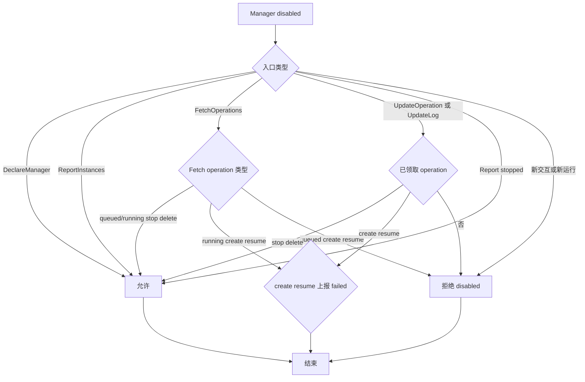
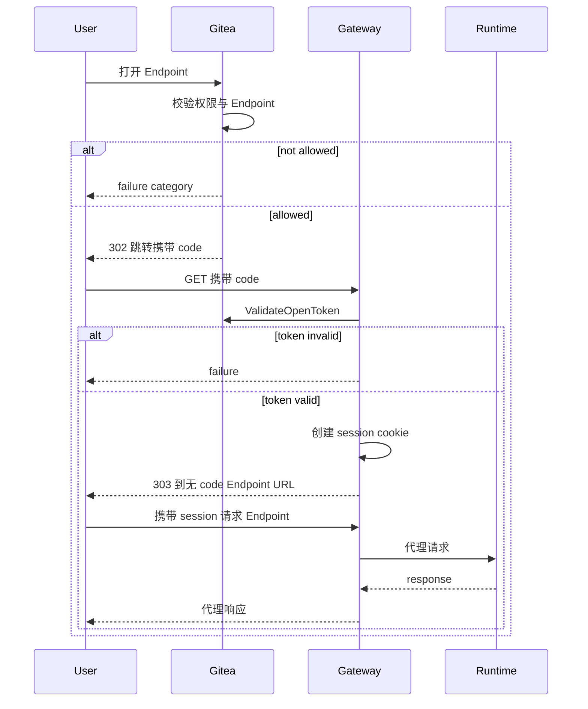
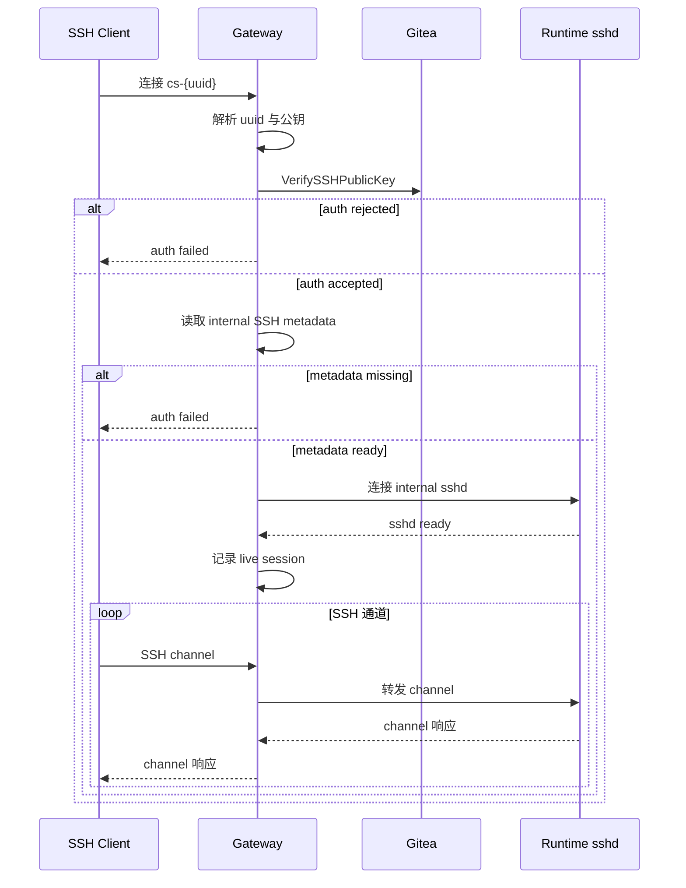

# Manager 与 Gateway

## Manager 设计

Manager 通过 [ManagerService RPC](rpc-spec.md) 与 Gitea 通信。完整 proto 定义见 [RPC 接口定义](rpc-spec.md)。

### 注册与认证

Manager 注册参考 Gitea Actions runner 方式。

Manager 注册入口使用 Gitea 现有 owner 模型。Gitea 中 organization 是 `user` 表中的一种类型，repository owner、用户设置页和组织设置页都映射到同一套 `user.id`。因此 registration token 和 Manager 记录统一使用 `owner_id` 表达归属：

| scope | 字段表达 | 含义 |
| --- | --- | --- |
| global | `owner_id = 0` | 站点级注册入口 |
| owner | `owner_id = user.id` | owner 级注册入口，owner 可以是个人用户或组织 |

注册入口直接复用 Gitea 的 owner 身份模型，个人用户和组织使用同一字段，设置页按当前上下文直接定位对应的注册入口。

命令：

```text
gitea-codespace register
gitea-codespace serve
```

注册流程：

1. Gitea 创建 registration token。
2. `gitea-codespace register` 通过 `RegisterManager` 兑换该 registration token。
3. Gitea 创建 Manager 记录，`codespace_manager.owner_id` 继承 registration token 的 `owner_id`。
4. Gitea 返回一次性明文 `manager_id + manager_secret`。
5. Manager 将凭据保存到本地配置。
6. `gitea-codespace serve` 使用该凭据调用后续所有 RPC。
7. `serve` 在发送 heartbeat 或启动 worker 前取得 Manager 本地状态目录独占锁；锁已被持有时直接退出。

`RegisterManager` 请求字段：

| 字段 | 说明 |
| --- | --- |
| `registration_token` | 设置页展示给管理员的注册入口凭据 |

`RegisterManager` 响应字段：

| 字段 | 说明 |
| --- | --- |
| `manager_id` | Manager 身份 ID |
| `manager_secret` | ManagerService RPC 通信凭据，明文只在注册响应中返回一次 |

Manager 将 `manager_id + manager_secret` 保存到本地配置。后续 ManagerService RPC 通过 header 发送：

```text
x-codespace-manager-id: <manager id>
x-codespace-manager-secret: <manager secret>
```

ManagerService 认证流程：

1. 从 header 读取 `x-codespace-manager-id`。
2. 从 header 读取 `x-codespace-manager-secret`。
3. Gitea 根据 Manager ID 查询 `codespace_manager`。
4. Gitea 使用该 Manager 的 `secret_salt` 计算提交 secret 的 hash。
5. Gitea 使用常量时间比较提交 hash 与 `secret_hash`。
6. 认证成功后，将 Manager 身份写入 request context。
7. 本次 RPC 按 Manager 身份继续处理。

Manager ID 提供稳定身份定位，Manager Secret 提供身份认证。认证逻辑集中在 ManagerService interceptor 中，所有注册后 RPC 使用同一认证路径。

一个 `manager_id` 只对应一个活动 Manager 进程，不支持同身份多进程、active-active 或多个进程共享同一 secret。原因是 worker 领取状态、`runtime_generation/metadata_generation/inventory_generation` 和 backend Runtime 映射都在 Manager 本地持久化；并发进程会产生无法可靠排序的运行事实。本地状态目录独占锁防止共享该目录的重复进程；运维侧不得把同一 `manager_id + manager_secret` 复制到另一目录或主机并发运行。Gitea 不增加 Manager session 表、历史状态或服务端多进程仲裁。

设置页 token 查询：

| 页面 | registration token scope |
| --- | --- |
| 站点管理 Codespace 页面 | `owner_id = 0` |
| 用户设置 Codespace 页面 | `owner_id = ctx.Doer.ID` |
| 组织设置 Codespace 页面 | `owner_id = ctx.Org.Organization.ID` |

registration token 设计：

- registration token 存放在 `codespace_manager_token` 表。
- 页面进入 Codespace 管理界面时，Gitea 按当前 scope 查询 active registration token。
- 当前 scope 没有 active registration token 时，Gitea 创建新的 token 并展示给管理员。
- 数据库保存明文 `token`、`owner_id`、`is_active`。明文 token 使用唯一索引，查找方式与 `action_runner_token` 一致。
- `RegisterManager` 使用 registration token 时校验 `is_active=true`。
- active registration token 可用于注册多个 Manager。
- registration token 负责创建 Manager 身份，manager secret 负责证明已注册 Manager 身份。
- 创建或轮换 registration token 时，Gitea 单实例按 owner scope 使用 keyed lock，并在同一事务把旧 token 设为 inactive、插入新 active token；并发请求最终只留下一个 active token。
- inactive token 按 `REGISTRATION_TOKEN_RETENTION_DAYS` 清理。

Registration Token 明文保存——它是管理员复制给 Manager 完成首次注册的入口凭据。唯一索引用于让 `RegisterManager` 通过提交 token 直接定位注册入口。Registration Token 和 Manager Secret 承担不同职责，注册入口和已注册 Manager 通信身份分别管理。

实现验收点：

- global Codespace 管理页读取或创建 `owner_id=0` 的 active token。
- 用户 Codespace 管理页读取或创建 `owner_id=ctx.Doer.ID` 的 active token。
- 组织 Codespace 管理页读取或创建 `owner_id=ctx.Org.Organization.ID` 的 active token。
- `codespace_manager_token.token` 具备唯一索引。
- 使用 global token 注册出的 Manager 记录 `owner_id=0`。
- 使用用户 token 注册出的 Manager 记录 `owner_id=该用户 user.id`。
- 使用组织 token 注册出的 Manager 记录 `owner_id=该组织 user.id`。
- 注册成功后返回一次性明文 `manager_secret`。
- 注册成功后数据库保存 `secret_hash / secret_salt`。
- ManagerService 认证成功后 request context 中可取得 Manager 记录。
- 同一 owner scope 的并发 token 创建最终只有一个 active registration token。
- 同一 Manager 状态目录启动第二个 `serve` 进程时，第二个进程在发出任何 RPC 前因独占锁失败而退出。
- 同一 Manager 凭据复制到另一目录或主机并发运行属于不支持的部署方式，不作为故障切换或高可用方案。

### Manager 规则

Manager 通过 owner scope 和 tag 匹配 create operation。`admin_state` 控制管理态：disabled Manager 可以执行 stop/delete 和状态分歧上报，并把禁用前已领取的 create/resume 收敛为 failed；`last_online_unix` + timeout 推导在线态。

Declare 声明：

- `name`
- `version`
- `gateway_url`
- `gateway_ssh_addr`
- `tags`
- `gateway_ssh_host_key_algorithm`
- `gateway_ssh_host_key_fingerprint_sha256`
- `gateway_ssh_host_key_updated_unix`
- `capacity_total / capacity_available`
- `backend_capabilities`

Gitea 的 `DeclareManagerResponse.admin_state` 返回当前 `enabled|disabled`。Manager 每次 heartbeat 都据此更新本地管理态；进入 disabled 后立即停止 create/resume 和新交互，并通知同 deployment 的 Gateway 关闭已有 session。

Declare 使用明确类型字段作为唯一输入，Gitea 校验后生成规范化 `meta_json`；Manager 不提交自由 map，也不存在顶层字段与 JSON 两份权威来源。

`version` 写入规范化 `meta_json`，用于管理页面展示和兼容性诊断；它不参与 Manager matching、容量判断或 operation 领取。

### Manager Capacity

- `capacity_total > 0`
- `0 <= capacity_available <= capacity_total`
- create/resume 需要 Manager 在本次 `FetchOperations` 中声明可接收，且 `capacity_available > 0`。stop/delete 不受 `capacity_available` 限制。
- capacity 通过 Declare 明确字段上报，由 Gitea 规范化写入 `meta_json`；它不是 Gitea quota，只用于管理页面展示和诊断。
- `FetchOperations` 使用 request 中的 `capacity_total / capacity_available` 做本次 create/resume 领取判断，不将容量值写入数据库。
- Manager tags 与 repository tag 使用相同的 lower-case 和 `[a-z0-9_-]+` 校验；Declare 时去重后写入 `tags_json`。
- Manager 根据本地真实容量决定是否拉取 create/resume [Operation](glossary.md#operation)。
- Gitea 通过数据库条件更新保证 operation 只被一个 Manager 领取。Manager 自行控制本地并发，不超容量拉取。

Manager 主动 pull operation；满载时不拉取 create/resume，queued operation 自然等待。Gitea 看不到 Manager 本地 Runtime 队列、资源占用和启动中任务，数据库中的容量值仅由 `DeclareManager` 更新，用于 UI 和诊断展示。Manager tags 与 create `repo_tag` 的匹配在 Go 内存中完成，数据库只负责 queued operation 粗筛和条件领取。

Manager 启动恢复完成后仍按 `inventory_report_interval` 扫描并上报完整 Runtime inventory，backend 外部删除、发现未知 Runtime 等事件也立即触发一轮完整扫描。每个新快照先递增并持久化 generation；网络重试复用同一 generation 和规范化快照。相同 generation、相同快照的重试仍处理 Gitea 按当前数据库状态重新计算后返回的 instruction。Gitea 不依赖 Cron 保存或重放 inventory。

### Manager Worker Pool 与 Runtime 映射

Manager 本地维护 operation worker pool。worker pool 执行已领取的 operation；是否继续从 Gitea 领取 create/resume 由 Manager 通过 `capacity_available` 表达。

规则：

- `FetchOperations` 单次可领取多个 operation。
- Fetch 先恢复当前 Manager 的 running operation，再领取新的 queued operation；enabled Manager 和 disabled stop/delete 的普通 payload 重发刷新 lease但不占新容量，disabled create/resume 返回 abort 且不刷新 lease。
- enabled Manager 和 disabled stop/delete 在 `observed_operations` 中声明相同版本时不返回 payload，只由 Fetch 批量刷新 lease；disabled create/resume 不使用 observed 抑制 abort。
- Manager 只有在本地具备继续执行所需的完整 operation 上下文时才把版本放入 `observed_operations`；仅知道 UUID/version 但 payload 或 boot 结果缺失时必须省略，让 Gitea 返回普通 payload或 `recover_create_without_source`。
- 单次总领取数量不超过 `max_operations`。
- 本次新领取的 queued create/resume 数量不超过 `capacity_available`；running 恢复和 abort 使用既有 worker/cleanup 上下文，不占新容量。
- 已领取的 operation 使用 `operation_rversion` 绑定后续 `UpdateOperation` 和 `UpdateLog`。
- create/resume 使用容量槽位。
- stop/delete 使用独立 cleanup 队列，不占 create/resume 容量。
- operation 调度优先级为 `delete > stop > resume > create`。
- 同类型按 `operation_created_unix ASC, uuid ASC` 处理；单次 request 最多返回 256 条，observed 列表最多 10000 条，DB 候选由服务端在所有类型合计最多粗筛 1024 条。
- `capacity_available` 根据本地 worker 空闲数、backend 资源状态、正在启动/恢复的 Runtime 数量计算。
- `accepted_operation_types` 只声明本次是否接收 create/resume；stop/delete 进入独立 cleanup 队列并始终允许绑定 Manager 领取。
- Fetch/续租周期不超过 `OPERATION_LEASE_TIMEOUT / 3`。
- 空闲 Fetch 默认每 2 秒发起一次，并加入 0-20% 正抖动；网络或服务端临时错误按指数退避到最多 30 秒，任一成功响应立即恢复默认间隔。operation lease 续租使用独立调度，不被 Fetch 退避阻塞。
- lease 调度以收到服务端 deadline 时的本地单调时钟为基准计算下一次续租，墙上时钟跳变不推迟续租；每次在剩余 lease 的三分之一前完成 renew。
- Manager disabled 后，running stop/delete 继续使用普通 command；running create/resume 只接受 `abort_create|abort_resume`，不恢复初始化或启动流程。abort worker 按 UUID 清理本轮 Runtime 工作、上传摘要并提交 `final failed`，且不续租。
- Runtime Instance name 使用 `codespace_uuid` 确定性派生：

```text
cs-{codespace_uuid_short}
```

`codespace_uuid_short` 取 UUID 去掉 `-` 后前 20 位。

Manager 本地只持久化当前运行侧快照，不保存 operation 历史，也不引入本地数据库：

```text
{state_dir}/manager.json
{state_dir}/codespaces/{codespace_uuid}.json
```

`manager.json` 保存当前 `inventory_generation`；每个 codespace 文件保存 backend Runtime identity、Runtime Token verifier 与 source IP binding、Endpoint 声明、当前 `operation_rversion/type/payload/执行阶段`、runtime/metadata generation 和当前 boot session 结果。active operation 完成后清除同一快照中的 operation payload 和 worker 阶段，但保留 Runtime 映射、Endpoint 与 generation；Runtime 物理删除后删除该 codespace 文件。

状态目录权限为 `0700`，配置和快照文件权限为 `0600`。每次更新都在同目录写临时文件、`fsync` 文件、原子 rename 到固定文件名，再 `fsync` 目录。进程启动时只读取固定文件名并清理遗留临时文件；文件损坏时停止领取新的 create/resume，先用 backend scan、inventory instruction 和 stale generation detail 重建当前快照。该方式只解决崩溃后恢复当前事实，不形成审计记录。

这些数据属于 Manager 后端状态，不写入 Gitea。Manager 收到 create payload 后必须先原子持久化完整 payload、operation 版本和 worker 状态，再启动 Runtime；boot 结果也先持久化再向 Gitea final。Manager 重启时将本地记录与 backend scan 合并，再通过 inventory、metadata 和 operation 恢复接口与 Gitea 收敛。

Manager 必须原子持久化 generation 后再发送对应上报。若本地 generation 文件损坏或丢失，stale generation 错误会返回 Gitea 当前已接受值；Manager 将本地值推进到该值之后重新生成事实。该恢复只重新建立单调版本，不把 Gitea 状态直接当作 Runtime 事实，实际状态仍来自 backend scan。

`ReportInstances` 仅在 Gitea 当前存在 active operation 且版本不一致时返回 `refetch_operation(current_operation_rversion)`。Manager 在下一次 Fetch 中省略该 UUID 的 observed 版本，收到 payload 后原子替换本地 operation 上下文；Fetch 未返回该 UUID 不代表 operation 已清除，Manager 继续等待下一次 Fetch 或明确 instruction。Gitea 当前无 active operation 时返回 `clear_operation_context(current_operation_rversion)`；Manager 在本地 worker 版本小于或等于指令版本时清除旧上下文并保留 Runtime，已经换成更高版本时忽略延迟指令。`cleanup_local_runtime` 删除无归属资源，`report_runtime_transition` 上报新事实，`stop_local_runtime` 只停止本地 Runtime 并保持 Gitea stopped 主状态。

Gitea 只知道 operation 和 Manager 上报的容量快照，Manager 才知道本地 CPU、内存、backend 队列和 Runtime 启动状态。stop/delete 独立于 create/resume 容量，Manager 满载时仍能推进资源回收。Runtime name 由 `codespace_uuid` 派生，create、resume、delete 和本地清理都能找到同一个实例。

Manager 重启恢复策略见 [维护与重启恢复](maintenance-recovery.md)。该设计把 Manager 重启视为日常维护事件，先恢复本地 Runtime 信息和 Runtime Metadata，再恢复 create/resume 领取，减少维护重启造成的 codespace 误失败。

实现验收点：

- operation payload 和 boot 结果在启动 Runtime 或提交 final 前完成原子快照替换，崩溃后不会读取半写文件。
- Manager 凭据、Runtime Token verifier 和当前快照只存在于 `0700` 状态目录中的 `0600` 文件。
- Manager 本地没有 operation 历史表；active operation 完成后只清除当前上下文，Runtime 删除后删除当前 codespace 文件。
- Fetch 空响应不会清除本地 worker；只有 `clear_operation_context` 明确指令执行清理。
- clear instruction 只作用于不高于服务端当前版本的本地上下文，不清除已经替换的新 operation。
- Fetch 临时错误退避不阻塞现有 operation 的 lease 续租，墙上时钟跳变不使续租越过 deadline。

### Manager 禁用与删除

常规管理操作使用 disabled 状态停用 Manager。disabled 保留已绑定清理能力，停止新的交互和新的运行实例：

- disabled Manager 可以调用 `DeclareManager`、领取并完成已绑定的 `stop|delete`、`ReportInstances`、`ReportRuntimeTransition(runtime_state=stopped)`。
- Manager 被 disabled 时，已经领取的 create/resume 必须停止初始化或恢复并清理本轮新建进程；Gitea 允许它继续 `UpdateLog` 并只接受 `UpdateOperation(final failed)`，不接受 done 或续租。这样 operation 能立即收敛到 failed，而不是等待 lease 超时或留下无归属 Runtime。
- disabled Manager 的 queued create/resume、Runtime Metadata 写入、Gitea Token 申请、Open Token 校验和 SSH 公钥校验返回 disabled 分类；禁用前已领取的 running create/resume 通过 Fetch 取得 abort 命令。
- inventory 发现 Gitea stopped、Runtime running 时，disabled Manager 执行 `stop_local_runtime`，不尝试上报 running；发现 Gitea running、Runtime stopped 时仍可按 `report_runtime_transition` 上报 stopped。
- 物理删除 Manager 记录前，管理流程先确认没有未删除 codespace 和 active operation 引用该 Manager。

Manager disabled 处理流程：



disabled 是运维止血动作：快速阻止新的 workspace 和用户会话，同时保留 stop/delete/report 能力让已绑定 Runtime 继续完成清理，避免把资源留在运行侧。

入口统一先判断 `admin_state`，再判断 `runtime_state`。因此 disabled Manager 即使同时处于 recovering，也只具备上述 disabled 能力；active operation 冲突检查仍优先于主动 stopped 上报，已领取 stop/delete 正常完成，已领取 create/resume 只能上报 failed 并清理本轮运行侧工作。

实现验收点：

- disabled Manager 不领取 queued create/resume，running create/resume 只收到 abort command。
- abort worker 不续租、不读取 repository payload，最终清理本轮工作并提交 failed。
- disabled Manager 对 stopped/running 分歧分别执行允许的 stopped fact 或本地 stop，不提交 running fact。
- stop/delete 在 disabled 状态仍可领取、续租和完成。

### Manager Secret

[Manager Secret](glossary.md#manager-secret) 用于认证已注册 Manager 调用 ManagerService RPC。

规则：

- 只在 `RegisterManager` 响应中返回一次。
- 由 Manager 保存在本地配置。
- Gitea 只保存 hash/salt。
- 使用常量时间比较（`subtle.ConstantTimeCompare`）。
- registration token 和 manager secret 是两个不同生命周期的凭据。
- registration token 只用于 `gitea-codespace register` 调用 `RegisterManager`。
- manager secret 只用于已注册 Manager 调用后续 ManagerService RPC。
- manager secret 明文只在 `RegisterManager` 成功时展示一次。
- 凭据更换由 Manager 使用安全随机源生成至少 256 位熵的新 secret，并以 `pending_secret` 持久化，同时保留当前 secret；随后使用当前 secret 认证调用 `RotateManagerSecret(new_manager_secret)`。成功响应后 Manager 用新 secret 调用一次 `DeclareManager`，认证成功才把 pending 提升为 current 并删除旧 secret。响应丢失时先尝试用 pending 调用 Declare：成功表示服务端已轮换；明确返回 unauthenticated 表示服务端仍使用旧 secret，Manager 继续用旧 secret 重试 Rotate；网络或服务端临时错误只重试 pending 探测，不能据此判断轮换未提交。Gitea 原子替换 hash/salt，整个恢复过程不会生成第三个 secret。

Manager Secret 使用 salt/hash 保存，是因为它是 ManagerService 的长期通信凭据。Gitea 保存可验证值即可完成认证，Manager 本地保存明文 secret 并负责后续 RPC 调用。

实现验收点：

- `RegisterManager` 响应包含一次性明文 `manager_secret`。
- `codespace_manager` 表保存 `secret_hash / secret_salt`。
- ManagerService 认证使用 `manager_id` 定位 Manager。
- ManagerService 认证使用 `secret_salt` 计算提交 secret 的 hash。
- ManagerService 认证使用常量时间比较 hash。
- `RotateManagerSecret` 成功后旧 secret 认证失败，新 secret 认证成功，`manager_id` 和现有 codespace binding 保持不变。
- Rotate 响应丢失时，Manager 可通过 pending/current 两次认证判定服务端结果，不会丢失 Manager 身份。

### Runtime Token

[Runtime Token](glossary.md#runtime-token) 只由 Manager 生成和校验。

Runtime Token 不出现在 Gitea 或 ManagerService RPC 中。

Runtime Token 只用于 Runtime Instance 调用 Runtime HTTP API。Manager 使用安全随机源生成至少 256 位熵的 token，持久化 `SHA-256(token)` verifier 并用常量时间比较校验，同时绑定 `codespace_uuid + backend Runtime identity + source IP`。随机 token 已有足够熵，不需要密码型慢 hash 或 salt。Runtime 重建时轮换，Runtime 物理删除时吊销；请求必须同时通过 Bearer token、Runtime identity 和私网 source IP 校验。

实现验收点：

- Manager 重启后能从本地持久数据和 backend scan 恢复 Runtime、Endpoint upstream、Runtime Token verifier 和 active operation 上下文。
- Runtime Token 只对绑定的 Runtime identity 和 source IP 有效，Runtime 重建后旧 token 失效。
- Manager 不持久化 Runtime Token 明文，verifier 使用 SHA-256 和常量时间比较。
- Declare 响应返回当前 `admin_state`，disabled 后 Manager/Gateway 停止新运行和新交互。
- create/resume 使用容量槽位，stop/delete 通过独立清理队列继续执行。
- tags 在 Declare 时规范化、校验并去重。

## Runtime HTTP API

`CODESPACE_MANAGER_BASE_URL` 是 Runtime Instance 访问 Manager Runtime HTTP API 的根地址，允许 absolute `http://` 或 `https://` URL。Manager 可通过 `runtime_api_require_https` 拒绝 HTTP；默认允许 HTTP 供隔离私网使用，启用 HTTPS 时使用配置的服务端证书。

Runtime HTTP API 由 Manager 实现和管理，路由和认证独立于 Gitea。

所有请求使用：

```text
Authorization: Bearer <CODESPACE_RUNTIME_TOKEN>
Content-Type: application/json
```

网络规则：

- Runtime HTTP API 仅接受 Runtime Instance 私网 source IP 调用，同时校验 Runtime Token。
- scheme 只决定传输方式，不改变 Runtime Token、Runtime identity 和 source IP 三重绑定；HTTP 部署应使用隔离网络，HTTPS 部署额外提供链路加密。

路径前缀：

```text
{CODESPACE_MANAGER_BASE_URL}/api/runtime/v1
```

最小接口：

| 方法 | 路径 | 用途 |
| --- | --- | --- |
| `GET` | `/api/runtime/v1/boot` | 查询初始化所需的完整 boot session 信息 |
| `POST` | `/api/runtime/v1/boot` | 上报初始化完成结果（一次调用） |
| `GET` | `/api/runtime/v1/endpoints/{endpoint_id}` | 查询单个 Endpoint 当前声明 |
| `POST` | `/api/runtime/v1/endpoints/{endpoint_id}` | 创建 Endpoint |
| `PUT` | `/api/runtime/v1/endpoints/{endpoint_id}` | 更新 Endpoint |
| `DELETE` | `/api/runtime/v1/endpoints/{endpoint_id}` | 删除 Endpoint |

Runtime Instance 只需要获取初始化信息和声明可打开入口。生命周期状态、Gitea token、日志和 Runtime Metadata 由 Manager 统一转接到 Gitea，Runtime HTTP API 保持在 boot/endpoints 两类接口，减少与 Gitea 生命周期设计的耦合。

### GET /boot

- Runtime Instance 启动后调用，用于查询初始化所需的完整 boot session 信息。
- 返回 Manager 当前 Token 绑定信息，作为只读查询接口。
- 返回内容包含：

| 字段 | 来源 |
| --- | --- |
| `codespace_uuid` | Operation 返回数据 |
| `operation_type` | `create` / `resume` |
| `server_time_unix` | Manager 当前时间 |
| `workspace_dir` | Manager 本地决定 |
| `runtime_token_bound_source_ip` | Manager 记录 |
| `gitea_repo_clone_url` | create Operation 返回数据 |
| `gitea_repo_web_url` | create Operation 返回数据 |
| `gitea_repo_id` | create Operation 返回数据 |
| `gitea_repo_full_name` | create Operation 返回数据 |
| `gitea_owner_id` | create Operation 返回数据 |
| `gitea_owner_name` | create Operation 返回数据 |
| `gitea_owner_type` | create Operation 返回数据 |
| `gitea_owner_display_name` | create Operation 返回数据 |
| `gitea_ref_type` | create Operation 返回数据 |
| `gitea_ref_name` | create Operation 返回数据 |
| `gitea_commit_sha` | create Operation 返回数据 |
| `codespace_name` | Manager 派生（`cs-{short_uuid}`） |
| `codespace_owner_name` | Operation 返回数据 |
| `codespace_repo_name` | Operation 返回数据 |

create 与 resume 使用两个固定响应结构，避免用空 repository 字段表达 resume：

```json
{
  "codespace_uuid": "...",
  "operation_rversion": 1,
  "operation_type": "create",
  "server_time_unix": 1,
  "workspace_dir": "/workspace",
  "runtime_token_bound_source_ip": "10.0.0.12",
  "codespace_name": "cs-...",
  "codespace_owner_name": "alice",
  "codespace_repo_name": "project",
  "repository": {
    "id": 1,
    "full_name": "alice/project",
    "clone_url": "http://gitea/alice/project.git",
    "web_url": "http://gitea/alice/project",
    "owner_id": 1,
    "owner_name": "alice",
    "owner_type": "user",
    "owner_display_name": "Alice",
    "ref_type": "branch",
    "ref_name": "main",
    "commit_sha": "..."
  }
}
```

```json
{
  "codespace_uuid": "...",
  "operation_rversion": 2,
  "operation_type": "resume",
  "server_time_unix": 1,
  "workspace_dir": "/workspace",
  "runtime_token_bound_source_ip": "10.0.0.12",
  "codespace_name": "cs-..."
}
```

`GET /boot` 规则：

- create boot 信息由 Manager 根据 `CreateOperationPayload` 和 Manager 本地配置组合生成，包含完整 repository/ref/commit、owner 和创建者数据，但不通过该可重复查询接口返回 Gitea token。
- resume boot 只返回 `codespace_uuid`、`operation_type`、`server_time_unix`、`workspace_dir`、Runtime Token 绑定信息和派生名称；它基于已初始化 workspace，不返回 repository payload，也不在 stopped 状态申请 Gitea token。
- `workspace_dir` 由 Manager 本地决策生成。
- create token 由 Manager 通过 `RequestGiteaToken` 获取后直接注入一次性 init 进程环境，不保存在通用 `/boot` 响应；resume 在 operation done、主状态进入 running 后由 Manager 直接刷新 Runtime credential 文件。
- `codespace_name` 使用 `cs-{short_uuid}` 派生规则，`short_uuid` 取 UUID 去掉 `-` 后前 20 位。
- `runtime_token_bound_source_ip` 仅 Runtime 自检使用，Gitea 权限判断基于 user 和 codespace 状态。

### POST /boot

- 每个 create/resume boot session 完成后上报结果。
- 成功后 Manager 将 boot 结果作为 create/resume operation 的完成依据之一。
- 请求携带当前 `operation_rversion`、`started_unix`、`completed_unix`，并使用结果分支：

| 分支 | 必填数据 |
| --- | --- |
| `create_succeeded` | `workspace_head_sha`、internal SSH port/user/host-key fingerprint |
| `resume_succeeded` | internal SSH port/user/host-key fingerprint |
| `boot_failed` | 固定 boot stage；诊断正文写 operation 日志 |

三个结果使用固定 JSON 结构；请求中恰好出现一个 `result`，且 `type` 与当前 operation 匹配：

```json
{
  "operation_rversion": 1,
  "started_unix": 1,
  "completed_unix": 2,
  "result": {
    "type": "create_succeeded",
    "workspace_head_sha": "...",
    "internal_ssh": {
      "port": 2222,
      "user": "coder",
      "host_key_fingerprint": "SHA256:..."
    }
  }
}
```

`resume_succeeded` 使用相同 envelope 和 `internal_ssh`，不含 `workspace_head_sha`；`boot_failed` 只含 `type=boot_failed` 和固定 `stage`。成功统一返回 `200 {"accepted":true}`。

`POST /boot` 规则：

- create 的 `success=true` 要求 workspace checkout 到锁定 `commit_sha`，且 `workspace_head_sha == commit_sha`。
- resume 的 `success=true` 只要求已有 workspace 和 Runtime 服务恢复完成，不比较当前 HEAD 与创建时的 `commit_sha`。
- succeeded 分支要求 internal SSH port/user/host-key fingerprint 完整；host 由 Manager根据提交请求的 backend Runtime identity 解析，Runtime 不能指定。Manager用派生 host 完成连通和 host-key 校验后才接受 succeeded。
- `boot_failed` 时，Manager 将 create/resume operation 标记 failed。
- `POST /boot` 只上报 boot 完成状态。Endpoint 通过 Endpoint API 独立管理。
- 同一 `operation_rversion`、相同规范化请求内容幂等返回第一次结果；同一版本内容不同才返回 conflict。Manager 先持久化第一次结果再响应，响应丢失不会改变最终判断。
- boot 完成后 Runtime 仍可管理 Endpoint。

### Endpoint API

- `GET /endpoints/{endpoint_id}` 查询单个 [Endpoint](glossary.md#endpoint) 当前声明，不存在返回 404。
- `POST /endpoints/{endpoint_id}` 创建 Endpoint，已存在返回 conflict。
- `PUT /endpoints/{endpoint_id}` 更新 Endpoint，不存在返回 404。
- `DELETE /endpoints/{endpoint_id}` 删除 Endpoint；不存在返回 204。
- `endpoint_id` 使用 `[A-Za-z0-9_-]+`。
- `workspace` 是默认 Web IDE 保留 ID。
- 删除 `workspace` 允许；UI 默认 Open 会退回 codespace 详情页。

Endpoint create/update 请求体：

| 字段 | 说明 |
| --- | --- |
| `label` | 展示标签 |
| `upstream_scheme` | upstream 协议 |
| `upstream_port` | upstream port |
| `upstream_path` | upstream path |

POST/PUT 请求使用固定结构：

```json
{
  "label": "App 3000",
  "upstream_scheme": "http",
  "upstream_port": 3000,
  "upstream_path": "/"
}
```

GET、POST、PUT 成功返回 `200` 和规范化对象，响应在上述字段前增加 path 中的 `endpoint_id`；DELETE 成功返回 `204`，没有 body。请求不重复提交 path 已经确定的 ID，避免两个路由键出现不一致。

Endpoint API 规则：

- `label` 会进入 Gitea Runtime Metadata。
- `upstream_scheme` 只允许 `http|https`，`upstream_port` 范围为 1-65535，`upstream_path` 必须是规范化绝对路径。
- Endpoint 请求不接受 upstream host。Manager 根据提交请求的 backend Runtime identity 解析该 Runtime 的网络地址，Gateway 只能连接这个地址，不能访问 Manager/Gateway、云 metadata、link-local 或其他 Runtime。
- upstream port/path 仅在 Manager/Gateway 内部保存和转发，Gitea 使用 `endpoint_id` 和 `label` 完成 Endpoint 存在性校验和展示。
- 每次 Endpoint create/update/delete 后，Manager 递增该 codespace 的 `metadata_generation`，重新生成当前 Runtime Metadata 快照并调用 `ReportRuntimeMetadata`。
- Endpoint port/path declarations 持久化在 Manager 本地；Manager 重启后结合 backend Runtime identity 恢复目标地址，再重建 Gitea Runtime Metadata cache。
- 单个 codespace 最多声明 64 个 Endpoint；达到上限后 create 返回资源上限错误，update/delete 仍可执行。
- Manager 对 active codespace 至少每 `Runtime Metadata TTL / 3` 重发一次当前规范化快照；内容未变化时使用相同 generation，Gitea 幂等刷新 TTL，内容变化时必须先递增并持久化 generation。

Endpoint 使用 `endpoint_id` 做路由键，使用 `label` 做展示文本，把授权、路由和展示分开：Gitea 只确认 Endpoint 是否存在，Gateway 负责解析内部 upstream，UI 文案变化不影响 open 流程。

所有错误使用 `application/json` 固定结构：

```json
{
  "error": {
    "category": "operation_conflict",
    "retryable": false
  }
}
```

状态码固定为：`400` JSON/字段/endpoint_id 不合法，`401` Runtime Token 未通过，`403` Runtime identity 或 source IP binding 不匹配，`404` boot session 或 Endpoint 不存在，`409` operation 版本、boot 幂等内容或 Endpoint create/update 冲突，`429` Endpoint 数量超限，`503` backend 暂时不可用。响应不返回内部路径、token 或 backend 错误正文；详细原因只写 Manager 本地日志。

请求解码要求单个 JSON 对象、字段类型精确且没有未知字段；对应分支要求的字段必须出现，不属于该分支的字段必须不出现。这样新增或拼错字段会立即得到 `400`，不会被旧 Manager 静默忽略后产生错误 boot 或 upstream。

实现验收点：

- create boot 返回完整初始化数据；resume boot 不包含 repository payload 和 stopped 状态 token。
- `POST /boot` 以 `operation_rversion` 隔离不同 create/resume session。
- resume 保留用户当前 workspace HEAD，不执行 create checkout 校验。
- Manager 重启后可以从本地持久数据恢复 Endpoint upstream 并重新上报 metadata。
- create/resume GET、三个 POST boot 结果和 Endpoint 对象均可按固定 JSON schema 解码，不依赖缺失字段猜测分支。
- Runtime API 在 HTTP 和 HTTPS 配置下执行相同认证与状态逻辑，错误使用固定 JSON body 和状态码。

## Gateway 设计

Gateway 通过 Manager 身份调用 Gitea [ManagerService RPC](rpc-spec.md) 完成 Open Token 校验和 SSH 认证。

### Endpoint 打开流程

`POST /codespace/{uuid}/open` 打开一个 Runtime Metadata [Endpoint](glossary.md#endpoint)。

输入：

```text
endpoint_id=<endpoint_id>
```

规则：

- `endpoint_id` 格式约束为 `[A-Za-z0-9_-]+`（与 Runtime HTTP Endpoint API 定义一致）。
- `workspace` 是保留 Endpoint ID，表示默认 Web IDE。
- SSH 使用独立接入面。
- 预览端口、服务入口和 IDE 入口都通过 Endpoint 打开。
- open 输入仅接受 `endpoint_id`，由 Gitea 根据 Runtime Metadata 校验 Endpoint 存在并生成 Open Token。Gateway 侧自行判断 tunnel 目标。

Endpoint label 规则：

- 长度 1 到 64（trim 后）。
- label 使用普通可展示文本，控制字符、`<` 和 `>` 由输入校验过滤。
- 仅用于 UI 展示，不受查找、路由、授权、默认选择或日志身份影响。
- UI 按普通文本 escape 后展示。

label 只承担展示职责，输入校验关注 UI 可读性和 HTML 展示安全。路由和授权使用 `endpoint_id`，用户修改 label 不影响 Gateway 转发或日志关联。

默认 open：

- 当前 Runtime Metadata 存在 `endpoint_id=workspace` 时，列表页/repo 页默认 Open 打开 `workspace`。
- 不存在 `workspace` 时，默认 Open 进入 `GET /codespace/{uuid}`，让用户手动选择 Endpoint。

open 成功响应：

```text
302 Location: {gateway_origin}{base_path}/open?code={code}
```

规则：
- 把 `gateway_url` 的 path 规范化为固定 base path，并使用相对 path segment 追加 `open`；拼接既不丢弃 base path，也不会产生重复 `/`。
- `gateway_url` 的校验规则见 [DeclareManager 声明校验](gitea-server.md#declaremanager)（absolute HTTP/HTTPS URL、不含 userinfo/query/fragment、path 可为空或固定 base path）。
- `code` 作为 authorization code，由 Gateway 消费并在本地建立 session，不传递到 Runtime Instance。
- Gateway access log 不记录完整 token。
- Gateway 校验并消费 code 后创建服务端 session，返回 `303` 到不含 code 的 `{base_path}/cs/{codespace_uuid}/e/{endpoint_id}/`；带 code 的请求本身不代理到 Runtime。
- code 交换响应设置 `Referrer-Policy: no-referrer`，避免一次性 code 进入浏览器后续 Referer。

Gateway Endpoint 反向代理：

- Gateway 实现 HTTP reverse proxy。
- 支持 WebSocket upgrade。
- 第一版 Endpoint 不提供任意 TCP tunnel；SSH 使用独立接入面。
- Gateway 用户入口按 `gateway_url` 和本地 listener 配置提供 HTTP 或 HTTPS；Gateway 到 Runtime 按 Endpoint 的 `upstream_scheme=http|https` 建立对应连接。
- Open Token 消费后建立 Gateway 服务端 session，cookie 只保存高熵随机 session ID。
- session ID 使用安全随机源生成 32 字节并以不可预测字符串编码。cookie 固定使用 `HttpOnly`、`SameSite=Lax`，Path 限制为当前 `{base_path}/cs/{codespace_uuid}/e/{endpoint_id}/`，不设置跨子域 Domain；`Secure` 由 Manager YAML 的 `gateway_cookie_secure: auto|true|false` 控制，默认 `auto` 按 `gateway_url` scheme 决定。
- Gateway 根据 session 绑定 `user_id / codespace_uuid / endpoint_id / manager_id`。
- Gateway 转发时将 `/cs/{codespace_uuid}/e/{endpoint_id}/` 前缀从 upstream path 中移除。
- Gateway 向 Runtime 注入转发上下文 header：

```text
X-Gitea-Codespace-UUID
X-Gitea-Codespace-Endpoint-ID
X-Gitea-Codespace-User-ID
X-Forwarded-For
X-Forwarded-Proto
X-Forwarded-Host
```

- Gateway 在代理前删除客户端提交的同名上下文和 `Forwarded/X-Forwarded-*` header，再根据已认证 session 和实际连接信息覆盖写入，Runtime 只能看到 Gateway 生成的可信值。
- Gateway 不向 Runtime 传递 `code`、Gitea access token、Manager Secret 或 Runtime Token。
- HTTPS upstream 默认使用系统 CA 和派生 Runtime host 做证书校验；backend 配置可指定 CA 文件和 server name。`upstream_tls_insecure_skip_verify` 默认 false，仅作为明确的部署配置，不由 Endpoint 请求覆盖。

Endpoint open 流程：



Endpoint URL 形态：

```text
{gateway_origin}{base_path}/open?code=...
{gateway_origin}{base_path}/cs/{codespace_uuid}/e/{endpoint_id}/...
```

`base_path` 是 `gateway_url` 中规范化后的 path，可以为空且不以 `/` 结尾；为空时 URL 直接使用 origin 根路径。

HTTP/WebSocket 覆盖 Web IDE 和端口预览主场景。第一版不提供任意 TCP tunnel，减少鉴权和资源占用复杂度。Gateway 集中管理用户入口协议、证书、access log 和 session；HTTP 可用于受信网络，HTTPS 提供链路加密。Open Token 只用于换取 Gateway session，避免一次性 bearer token 泄漏到 Runtime 或后续浏览器请求中。

实现验收点：

- 非空 `gateway_url` base path 在 302、303、Endpoint 路由和 Cookie Path 中保持一致，空 base path 不产生双斜线。
- HTTP 和 HTTPS Endpoint 分别按声明 scheme 连接同一 Runtime identity 派生的 host。
- `gateway_url` 为 HTTP 时可建立不带 Secure 属性的 session cookie；为 HTTPS 或显式配置 true 时 cookie 带 Secure 属性。
- open code 的 allowed/denied outcome 互斥，带 code 的请求不代理到 Runtime。

### Gateway Session 管理

- Gateway 维护 `codespace_uuid -> live sessions` 的本地索引。
- Gateway 和 Manager 是同一 deployment 内的一体化组件。
- Manager 执行 stop/delete 前，先通知本地 Gateway 关闭该 `codespace_uuid` 的 HTTP/WebSocket/IDE 会话。
- Manager disabled 后，本地 Gateway 对新 open 返回 manager disabled 分类，并关闭该 Manager 负责的 live sessions。
- 创建用户登录状态不再允许后，新的 open 由 Gitea `ValidateOpenToken` 返回对应失败分类。
- 已建立 session 在下一次 Manager operation、Gateway 周期校验或 Runtime 断开时关闭。Gateway 会话管理依赖本地 Manager 事件通知，Gitea 不对 Gateway 下发主动指令。

Gateway session 默认配置：

```yaml
gateway_session_ttl: 8h
gateway_session_idle_timeout: 30m
gateway_session_revalidate_interval: 5m
gateway_max_sessions_per_codespace: 32
gateway_max_sessions_per_user: 128
gateway_cookie_secure: auto
```

规则：

- session 绑定 `user_id / codespace_uuid / endpoint_id / manager_id`。
- session TTL 从创建时起算且不滑动；每次通过认证并实际转发的 HTTP 请求刷新 idle time，WebSocket 收到任一方向有效 frame 时刷新 idle time。无流量连接在 idle timeout 到期时关闭。
- 创建 session 前同时检查 codespace 和 user 上限；达到任一上限返回 `429`，不驱逐已有 session，也不消费额外 session ID。
- WebSocket 长连接每 `gateway_session_revalidate_interval` 重新校验 session 条件。
- 周期校验通过 `RevalidateGatewaySession(endpoint={user_id, codespace_uuid, endpoint_id})` 调用 Gitea，不重复消费 Gateway Open Token。
- Manager stop/delete 前通知 Gateway 关闭该 codespace 的所有 Endpoint sessions。
- Manager disabled 时关闭该 Manager 负责的 sessions。
- 创建用户登录状态不再允许后，新 session 由 Gitea 返回对应失败分类；已建立 session 在下一次周期 revalidate 时关闭。
- Runtime upstream 断开时 session 保留，下一次请求重新连接，直到 TTL 或 idle timeout 到期。
- Gateway session 不跨 Gateway 进程重启持久化；重启后旧 cookie 失效，用户从 Gitea 重新 open。
- `gateway_cookie_secure=auto` 在 HTTPS gateway URL 下设置 Secure、HTTP 下不设置；显式 true/false 用于反向代理等部署，但配置必须与浏览器实际访问 scheme 一致。

TTL 限制长期遗留 session，idle timeout 控制资源占用，周期 revalidate 处理用户登录状态、codespace 状态和 Manager 状态变化，减少每个请求回到 Gitea 的开销。stop/delete/disabled 是明确管理事件，由 Manager/Gateway 本地事件立即关闭连接。

`RevalidateGatewaySession` 校验 session 中保存的 user、codespace、endpoint 和 Manager binding；Endpoint session 还要求当前 metadata 中存在对应 endpoint，SSH session 要求 internal SSH metadata 可用。拒绝后 Gateway 关闭本地 session。该 RPC 只做当前访问判定，不写生命周期状态或访问历史。

实现验收点：

- Open Token 只在建立 session 时消费一次，后续周期校验使用 `RevalidateGatewaySession`。
- stop/delete/disabled 通过 Manager 本地事件立即关闭 session，登录状态等远端变化在 revalidate interval 内关闭。
- Gateway session 不包含 Gitea token、Manager Secret 或 Runtime Token。
- session ID 具有 256 位随机熵；达到上限稳定返回 429，TTL 与 idle timeout 按上述固定事件计算。

## SSH 接入

### 连接入口

SSH 是 codespace 自身稳定接入面，不是 Endpoint。

用户通过 `ssh cs-{codespace_uuid}@gateway_host` 连接。Gateway 从连接串解析 `codespace_uuid`，调用 `VerifySSHPublicKey` 让 Gitea 读取 codespace 并完成公钥认证；Gateway 不直接访问 Gitea 数据库。认证通过后，Gateway 从同 deployment 的 Manager 本地 Runtime 映射解析 internal SSH 目标。用户身份通过公钥匹配确定，创建者用户名由 Gitea 侧从 `user_id` 获取。Gitea 页面展示 `gateway_ssh_addr`、Gateway SSH host key algorithm、SHA256 fingerprint 和 host key 更新时间，供用户首次连接前核对。

SSH 可用性：

- `running` 状态且没有 active stop/delete operation 时提供 SSH。
- `creating|stopped|deleting|failed` 返回状态不可用分类。
- `running` 但存在 active stop/delete operation 时返回状态不可用分类。
- stopped codespace 通过显式 resume 恢复后再提供 SSH。

SSH 是长连接交互面，只有 running 状态能保证 internal SSH metadata 与 Manager/Gateway 转发同时成立。stopped 自动唤醒会把认证尝试变成生命周期操作，容易让普通 SSH 客户端重试触发意外资源启动。

### SSH 中转模型

Manager 创建的 Runtime Instance 提供兼容 OpenSSH 的 sshd。

Gateway 中转流程：

1. 用户连接 `ssh cs-{codespace_uuid}@gateway_host`。
2. Gateway 从连接串解析 `codespace_uuid`，不查询 Gitea 数据库。
3. Gateway 调用 Gitea `VerifySSHPublicKey(codespace_uuid, public_key)`，传递 SSH 客户端认证请求中的 wire-format 公钥 bytes。
4. Gateway 确认 codespace 为 running。
5. Gateway 作为 SSH client 连接 Runtime Instance 内部 sshd。
6. Gateway 在外部 SSH 连接与内部 SSH 连接之间转发 channel。

SSH 连接流程：



Gateway 终止外部 SSH 并重建内部 SSH，不采用纯 TCP forwarding，也不自行实现 shell/sftp/pty。

支持的 SSH channel 能力：

- shell
- exec
- subsystem `sftp`
- `pty-req`
- `window-change`
- `signal`
- `env`
- `exit-status`
- `exit-signal`
- `auth-agent-req`
- `x11-req`
- `direct-tcpip`
- `tcpip-forward`
- `cancel-tcpip-forward`

以上 channel 是 SSH 协议内的标准化通道能力（如 sftp、端口转发），与 Endpoint 层的 TCP tunnel 是不同概念。第一版 Endpoint 不提供 HTTP/WebSocket 以外的任意协议 tunnel。

SSH forwarding 属于 SSH 会话能力，在 SSH 连接内独立管理。Endpoint 列表由 Runtime Metadata 的 `endpoints` 数组维护。

### SSH 认证

Gateway 每次 SSH 认证尝试都调用 Gitea `VerifySSHPublicKey`，不跨连接缓存认证结果。

Gitea 校验（详见 [ManagerService RPC](gitea-server.md#managerservice-rpc)）：

- `codespace_uuid` 映射到有效 codespace。
- codespace 为 `running`。
- codespace 当前没有 active stop/delete operation。
- Gitea 解析 wire-format `public_key`，按创建用户、SHA256 fingerprint 和 `KeyTypeUser` 查询现有 SSH key，并比较规范化 wire bytes；部署密钥（`KeyTypeDeploy`）和授权主体（`KeyTypePrincipal`）不接受。若站点强制 2FA，用户必须已启用符合站点要求的 2FA。
- 创建用户当前允许登录。
- 绑定 Manager 当前在线且未被 disabled。

Gateway 按 source IP、`codespace_uuid` 做限流和退避。限流和退避由 Gateway 负责。

Gitea 可以向 Gateway 返回失败分类用于日志和退避。Gateway 对 SSH client 只返回统一认证失败。

SSH session 规则：

- Gateway 维护 `codespace_uuid -> live SSH sessions` 的本地索引。
- Manager 执行 stop/delete 前，先通知本地 Gateway 关闭该 `codespace_uuid` 的 SSH sessions。
- Manager disabled 后，本地 Gateway 对新 SSH 返回 manager disabled 分类，并关闭该 Manager 负责的 live SSH sessions。
- 创建用户登录状态不再允许后，新的 SSH auth 由 Gitea `VerifySSHPublicKey` 返回对应失败分类。
- 已建立 SSH session 在下一次 Manager operation、Gateway 周期校验或 Runtime 断开时关闭。Gateway 会话管理依赖本地 Manager 事件通知，Gitea 不对 Gateway 下发主动指令。
- 已建立 SSH session 周期调用 `RevalidateGatewaySession(ssh={user_id, codespace_uuid})`；返回拒绝时立即关闭外部和内部 SSH channel。

Gateway 本地执行 SSH 认证限流与退避。

计数维度：

- `source_ip`
- `codespace_uuid`
- `source_ip + codespace_uuid`
- `public_key_hash`

默认配置：

```ini
SSH_AUTH_MAX_ATTEMPTS_PER_IP_PER_MINUTE = 30
SSH_AUTH_MAX_ATTEMPTS_PER_CODESPACE_PER_MINUTE = 20
SSH_AUTH_MAX_ATTEMPTS_PER_IP_CODESPACE_PER_MINUTE = 10
SSH_AUTH_BACKOFF_BASE = 1s
SSH_AUTH_BACKOFF_MAX = 30s
SSH_AUTH_FAILURE_WINDOW = 10m
```

失败分类处理：

- `invalid_credentials` 计入退避。
- `codespace_not_found` 计入退避。
- `codespace_not_running` 轻量计数。
- `login_restricted`、`manager_mismatch` 计数并写 Gateway 本地日志。
- `internal_error` 不计入暴力破解退避。

SSH 暴力破解通常同时体现为来源 IP、目标 codespace 和公钥维度异常。多维度计数减少单一 IP 维度的误伤，降低攻击者轮换 key 或目标 codespace 的绕过空间。Gateway 离 SSH 连接最近，适合做快速退避；Gitea 返回失败分类，Gateway 据此区分攻击、状态不可用和内部故障。

### 内部 SSH

每条 Manager 注册记录拥有一对固定内部 Gateway SSH key。

规则：

- create/resume 时将 Gateway 的内部 SSH 公钥写入 Runtime Instance 内部工作用户 `authorized_keys`。
- Gateway 使用对应 private key 连接内部 sshd。
- 内部 host 由 Manager从 backend Runtime identity 派生；Runtime 通过 `POST /boot` 上报 port、user 和 host key fingerprint。
- 用户公钥不在 Runtime Instance 内部校验。
- 内部 SSH metadata 不在普通 UI/API 输出中暴露。

内部 SSH 使用 Gateway 固定密钥，把用户认证放在 Gitea/Gateway 边界完成，Runtime Instance 只信任 Manager deployment 内部通道。Runtime 不需要保存用户 SSH key，也能在用户登录状态变化后由 Gitea 实时返回 SSH 认证失败分类。

实现验收点：

- 每次新 SSH 认证都调用 `VerifySSHPublicKey`，已有 SSH session 按固定间隔调用 `RevalidateGatewaySession`。
- Gateway 不读取 Gitea 数据库；认证成功后只从 Manager 本地映射解析 internal SSH 目标。
- 用户 SSH key 只用于 Gitea/Gateway 外部认证，Runtime 只信任 Gateway 内部固定公钥。
- stop/delete/disabled 和 revalidate 拒绝都能关闭已有 SSH channel。

## 日志与脱敏

### 日志来源

- Gitea 保存一套 codespace 上报日志。
- Manager 本地日志用于 Manager/Gateway 排障。
- `UpdateLog` 是唯一上报入口，始终追加到当前 codespace 日志文件。
- Manager 把每条日志上报为 `LogLine(timestamp_unix_nano, message)`；message 是去除 CR/LF 后的 UTF-8 单行，嵌入换行先拆成多条，下一次 offset 只使用 Gitea `UpdateLogResponse.next_offset`。
- Gitea 可为完整 failed 对象和 operation 最终状态通过内部日志入口写入摘要；Manager 领取 operation 时从 payload 的 `log_offset` 继续追加。
- create/resume/stop/delete lifecycle operation 执行期间的 boot、init、git、Endpoint 初始化、stop、resume、delete 阶段日志写入 codespace 日志。
- active operation 清空后，日志文件进入封闭状态，由 Gitea 页面读取已保存的生命周期证据。
- running 期间 open token 连接成功、SSH 连接成功、session 正常关闭、Endpoint 后续变化和用户可见运行异常记录在 Manager/Gateway 本地日志。
- running 期间连接成功通过 `last_active_unix` 记录用户活跃时间；详细连接事件写 Manager/Gateway 本地日志。
- open token 校验失败、SSH 公钥失败、限流、扫描、爆破、Gateway proxy debug、backend driver debug、heartbeat、空 pull、health poll 明细和内部 retry 细节只写 Manager/Gateway 本地日志。

codespace 日志是生命周期操作的执行证据，单文件连续追加。只有当前 `operation_status=running` 且 `operation_rversion` 匹配时允许追加，active operation 清空后封闭。连接级事件保留在 Manager/Gateway 本地日志——这些事件数量大、包含网络诊断细节，放入 Gitea codespace 日志会干扰用户阅读生命周期过程。

### 脱敏

- Manager 是精确脱敏第一责任方。
- Manager 在 `UpdateLog` 前脱敏 `GITEA_TOKEN`、`CODESPACE_RUNTIME_TOKEN`、Manager Secret、`new_manager_secret`、URL userinfo、URL query token、Authorization header、git credential helper 输出和常见 bearer/basic token 形式。
- Manager 维护 operation-local mask set。
- operation-local mask set 包含注入给 `init.sh` 的所有敏感值。
- `::add-mask::value` 消费后，`value` 加入 operation-local mask set，后续日志中出现的 `value` 替换为 `***`。
- `::add-mask::value` 由 Manager 本地消费并加入 mask set，mask 指令原文仅存在于 Manager 本地内存。
- Manager 重启后继续处理同一 operation 时，重新加载或重建该 operation 的必要 mask set。
- 如果 Manager 无法确认脱敏安全，停止上传该 operation 的原始日志，并将 operation 标记为 failed 或上传明确错误摘要。
- Gitea 入库前只做防御性清理，例如控制字符过滤、单行长度限制、URL userinfo 和 Authorization header 模式替换。
- Manager 持有 Gitea Token 和 Runtime Token 明文，负责精确脱敏。Gitea 执行防御性清理（控制字符过滤、单行长度限制、常见 URL token/Authorization header 模式替换）。安全边界定义如下：前端隐藏和 Gitea 防御性清理均属于展示层保护，不能作为 token 泄漏的安全兜底。
- 下载日志和 UI 日志使用同一份脱敏内容。
- 错误摘要必须在 final `UpdateOperation` 前上传。
- active operation 清空后，Gitea 日志进入封闭状态。
- stop/resume/delete 创建新的 operation 版本后，日志继续追加到同一文件。
- Manager 以 `FetchOperations` 返回的 `log_offset` 初始化当前 operation 的上传 offset；成功追加使用 response `next_offset`，遇到 offset conflict/gap 时使用 `LogOffsetDetail.current_offset` 恢复，不从 0 覆盖已有内容。
- 只有当前 `operation_status=running` 且 `operation_rversion` 匹配时才能追加 Gitea 日志。

脱敏责任放在 Manager——Manager 创建 Runtime、注入 token，并最早看到 init 输出。Gitea 的防御性清理用于降低展示风险，但不能替代 Manager 对已知敏感值的精确 mask；边界清晰，日志泄漏时也能定位责任组件。

### 日志命令

```text
::group::title
::endgroup::
##[group]title
##[endgroup]
::error::message
::warning::message
::notice::message
::debug::message
##[command]command
[command]command
```

Codespace 日志 UI 复用 Actions console 解析和渲染能力，与 Actions 共享同一套日志渲染器。

### Gateway Access Log

Gateway access log 使用结构化 JSON line。

字段：

```json
{
  "time": "...",
  "request_id": "...",
  "kind": "endpoint|ssh",
  "manager_id": 1,
  "codespace_uuid": "...",
  "endpoint_id": "...",
  "user_id": 1,
  "source_ip": "...",
  "method": "GET",
  "path_template": "/cs/{uuid}/e/{endpoint_id}/...",
  "status": 200,
  "duration_ms": 12,
  "bytes_in": 0,
  "bytes_out": 0,
  "failure_category": "",
  "session_id_hash": "...",
  "user_agent_hash": "..."
}
```

脱敏规则：

- 记录 path template，不记录 query string。
- 记录 session ID hash，不记录 session cookie 原文。
- 记录 user agent hash，不记录完整 user agent。
- 记录失败分类，不记录 `open_token`、Authorization header、cookie 原文、Gitea access token、Manager Secret 或 Runtime Token。

保留策略：

```ini
GATEWAY_ACCESS_LOG_RETENTION_DAYS = 30
GATEWAY_ACCESS_LOG_MAX_SIZE = 1GiB
```

Gateway access log 面向运维排障和访问记录，不是用户生命周期日志。JSON line 便于接入 Loki/ELK 等日志系统。记录模板、hash 和失败分类满足排障需求，同时降低 token、cookie、query 参数和用户隐私泄漏风险。

实现验收点：

- Manager 从 operation payload 的 `log_offset` 继续追加，Gitea 内部摘要和后续 operation 日志保持单文件连续。
- Manager 只使用服务端返回的 next/current offset 推进日志，不自行计算脱敏后字节数。
- token、Authorization header、cookie、query string 和完整 user agent 不进入 codespace 日志或 Gateway access log。
- codespace 日志用于生命周期诊断，连接级明细只进入 Manager/Gateway 本地日志。
