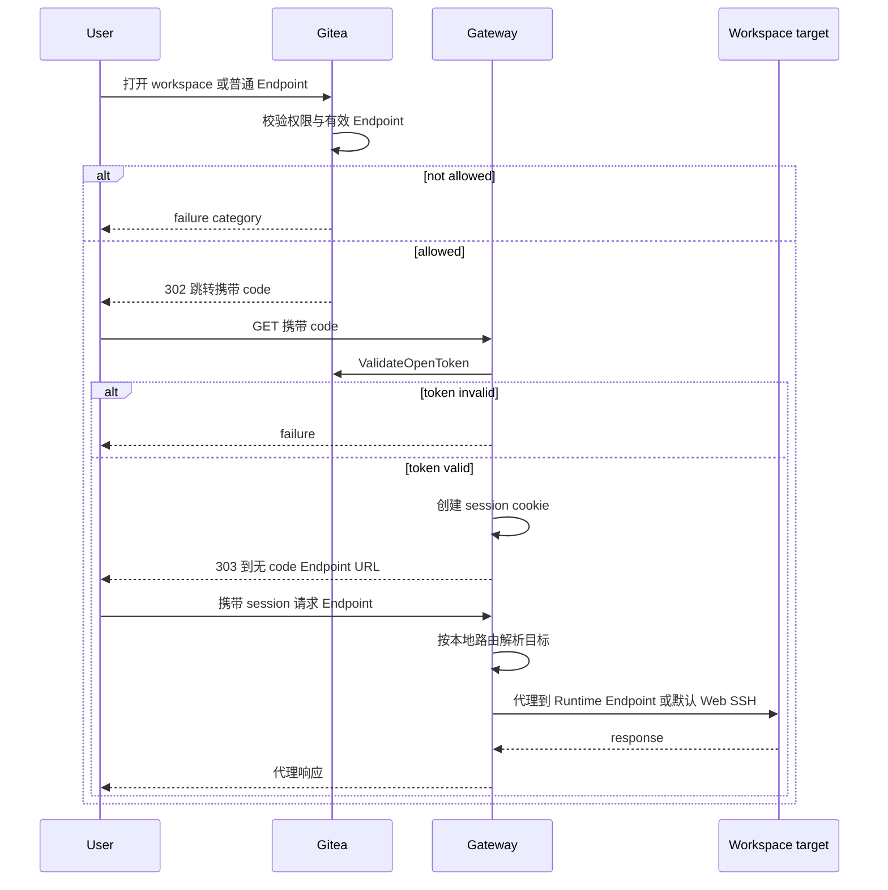
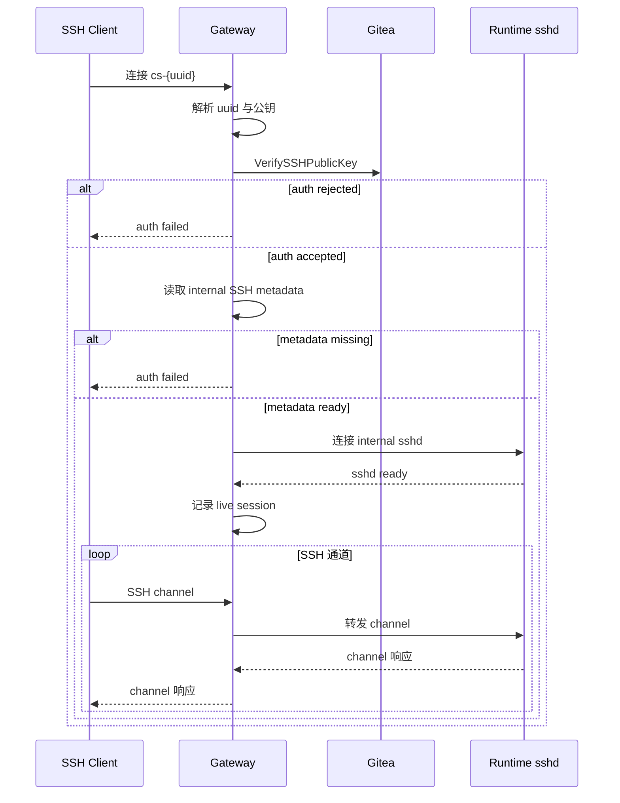

# Manager 与 Gateway

## Manager 设计

Manager 通过 [ManagerService RPC](rpc-spec.md) 与 Gitea 通信。完整 proto 定义见 [RPC 接口定义](rpc-spec.md)。

### 注册与认证

Manager 注册参考 Gitea Actions runner 方式。

Manager 注册入口使用 Gitea 现有 owner 模型。Gitea 中 organization 是 `user` 表中的一种类型，repository owner、用户设置页和组织设置页都映射到同一套 `user.id`。因此 registration token 和 Manager 记录统一使用 `owner_id` 表达归属：

| scope | 字段表达 | 含义 |
| --- | --- | --- |
| global | `owner_id = 0` | 站点级注册入口 |
| owner | `owner_id = user.id` | owner 级注册入口，owner 可以是个人用户或组织 |

注册入口直接复用 Gitea 的 owner 身份模型，个人用户和组织使用同一字段，设置页按当前上下文直接定位对应的注册入口。

命令：

```text
gitea-codespace register
gitea-codespace serve
```

注册流程：

1. Gitea 创建 registration token。
2. `gitea-codespace register` 通过 `RegisterManager` 兑换该 registration token。
3. Gitea 创建 Manager 记录，`codespace_manager.owner_id` 继承 registration token 的 `owner_id`。
4. Gitea 返回一次性明文 `manager_id + manager_secret`。
5. Manager 将凭据保存到 `state_dir` 的凭据文件，不写入普通 YAML 配置。
6. `gitea-codespace serve` 使用该凭据调用后续所有 RPC。
7. `serve` 在发送 heartbeat 或启动 worker 前取得 Manager 本地状态目录独占锁；锁已被持有时直接退出。

`RegisterManager` 响应只返回一次 secret，而 registration token 可以重复注册，因此 CLI 遇到连接超时或响应解析失败时不能自动重试。管理员先在对应设置页检查 `last_online_unix=0`、即从未成功 Declare 的注册记录，删除确认无用的记录后再重新注册；明确的参数或认证失败可以直接修正后重试。该处理不增加注册 nonce 或历史表，也避免不确定响应产生多个 Manager 身份。

`RegisterManager` 请求字段：

| 字段 | 说明 |
| --- | --- |
| `registration_token` | 设置页展示给管理员的注册入口凭据 |

`RegisterManager` 响应字段：

| 字段 | 说明 |
| --- | --- |
| `manager_id` | Manager 身份 ID |
| `manager_secret` | ManagerService RPC 通信凭据，明文只在注册响应中返回一次 |

Manager 将 `manager_id + manager_secret` 保存到 `state_dir` 的凭据文件。后续 ManagerService RPC 通过 header 发送：

```text
x-codespace-manager-id: <manager id>
x-codespace-manager-secret: <manager secret>
```

ManagerService 认证流程：

1. 从 header 读取 `x-codespace-manager-id`。
2. 从 header 读取 `x-codespace-manager-secret`。
3. Gitea 根据 Manager ID 查询 `codespace_manager`。
4. Gitea 使用该 Manager 的 `secret_salt` 计算提交 secret 的 hash。
5. Gitea 使用常量时间比较提交 hash 与 `secret_hash`。
6. 认证成功后，将 Manager 身份写入 request context。
7. 本次 RPC 按 Manager 身份继续处理。

Manager ID 提供稳定身份定位，Manager Secret 提供身份认证。认证逻辑集中在 ManagerService interceptor 中，所有注册后 RPC 使用同一认证路径。

一个 `manager_id` 只对应一个活动 Manager 进程，不支持同身份多进程、active-active 或多个进程共享同一 secret。原因是 worker 领取状态、`runtime_generation/metadata_generation/inventory_generation` 和 backend Runtime 映射都在 Manager 本地持久化；并发进程会产生无法可靠排序的运行事实。本地状态目录独占锁防止共享该目录的重复进程；运维侧不得把同一 `manager_id + manager_secret` 复制到另一目录或主机并发运行。Gitea 不增加 Manager session 表、历史状态或服务端多进程仲裁。

设置页 token 查询：

| 页面 | registration token scope |
| --- | --- |
| 站点管理 Codespace 页面 | `owner_id = 0` |
| 用户设置 Codespace 页面 | `owner_id = ctx.Doer.ID` |
| 组织设置 Codespace 页面 | `owner_id = ctx.Org.Organization.ID` |

registration token 设计：

- registration token 存放在 `codespace_manager_token` 表。
- 页面进入 Codespace 管理界面时，Gitea 按当前 scope 查询 registration token 行。
- 当前 scope 没有记录时，Gitea 创建新的 token 并展示给管理员。
- 数据库保存明文 `token` 和唯一 `owner_id`；token 也使用唯一索引，使 `RegisterManager` 可以直接定位当前入口。
- registration token 行存在且提交明文匹配时有效，可用于注册多个 Manager。
- registration token 负责创建 Manager 身份，manager secret 负责证明已注册 Manager 身份。
- GetOrCreate、轮换、停用和 RegisterManager 都按 owner scope 使用 keyed lock，包括 global scope 的 `owner_id=0`。轮换在同一行原地替换随机 token，停用物理删除该行；并发注册与凭据变更因此只有明确的事务先后。
- RegisterManager 先按唯一 token 索引读取候选 owner，只用来选择 owner lock；锁内再次读取同一 token 行并匹配明文后才认证成功。锁前读取与锁内复读之间发生的轮换、停用或 owner 删除会使注册返回 unauthenticated。

Registration Token 明文保存——它是管理员复制给 Manager 完成首次注册的入口凭据。唯一索引用于让 `RegisterManager` 通过提交 token 直接定位注册入口。Registration Token 和 Manager Secret 承担不同职责，注册入口和已注册 Manager 通信身份分别管理。

**设计说明（有意如此）：Registration Token 不保存 inactive 或轮换历史。**项目不提供凭据审计，旧 token 在轮换或停用后没有恢复用途；每个 owner 一行让记录存在性直接表示当前入口有效，并避免额外 retention 任务。

实现验收点：

- global Codespace 管理页读取或创建 `owner_id=0` 的当前 token。
- 用户 Codespace 管理页读取或创建 `owner_id=ctx.Doer.ID` 的当前 token。
- 组织 Codespace 管理页读取或创建 `owner_id=ctx.Org.Organization.ID` 的当前 token。
- `codespace_manager_token.token` 和 `owner_id` 分别具备唯一索引。
- 使用 global token 注册出的 Manager 记录 `owner_id=0`。
- 使用用户 token 注册出的 Manager 记录 `owner_id=该用户 user.id`。
- 使用组织 token 注册出的 Manager 记录 `owner_id=该组织 user.id`。
- 注册成功后返回一次性明文 `manager_secret`。
- 注册成功后数据库保存 `secret_hash / secret_salt`。
- 注册响应不确定时 CLI 不自动重试，管理页可以识别并删除从未 Declare 的注册记录。
- ManagerService 认证成功后 request context 中可取得 Manager 记录。
- 同一 owner scope 的并发 GetOrCreate 最终只有一行；Rotate 原地替换，Deactivate 物理删除且不保留历史行。
- RegisterManager 与 token 变更使用同一 owner lock，global scope 也使用 `codespace_owner_0`。
- RegisterManager 只以 owner lock 内复读作为 token 认证线性化点，锁前查询不能创建 Manager。
- 同一 Manager 状态目录启动第二个 `serve` 进程时，第二个进程在发出任何 RPC 前因独占锁失败而退出。
- 同一 Manager 凭据复制到另一目录或主机并发运行属于不支持的部署方式，不作为故障切换或高可用方案。

### Manager 规则

Manager 通过 owner scope 和 tag 匹配 create operation。global 与 owner-scoped Manager 同时匹配时没有优先级，首个成功完成 Gitea 条件 UPDATE 的 Manager 获得 binding。`runtime_state` 与 `last_online_unix + timeout` 表达 online、recovering 和派生 offline；本次是否领取 create/resume 由 Fetch 的 capacity 和 accepted operation types 表达。

Declare 声明：

- `name`
- `version`
- `gateway_url`
- `gateway_ssh_addr`
- `tags`
- `gateway_ssh_host_key_algorithm`
- `gateway_ssh_host_key_fingerprint_sha256`
- `gateway_ssh_host_key_updated_unix`
- `capacity_total / capacity_available`
- `backend_capabilities`

`DeclareManagerResponse` 是空响应，只确认完整快照已经接受。Manager 本地运行态由自身配置、恢复进度和 Gitea 对 heartbeat/offline 的响应共同收敛。

Declare 使用明确类型字段提交客户端当前配置和运行能力的完整快照，Gitea 校验后生成规范化 `meta_json`；Manager 不提交自由 map，也不存在顶层字段与 JSON 两份权威来源。名称、版本、tags、容量、Gateway/SSH 地址、host key 和 capability 可以由客户端修改后重新声明；Manager 身份、owner、secret 和已有 Codespace binding 不由 Declare 修改。Gitea 只保存最近一次成功声明，不保存配置历史。

`version` 写入规范化 `meta_json`，用于管理页面展示和兼容性诊断；它不参与 Manager matching、容量判断或 operation 领取。

每个 Manager 使用唯一的规范化 `gateway_url` 和 `gateway_ssh_addr`，两者都来自当前 Manager 配置。首次 Declare 或地址变化时，Gitea 取得 `codespace_manager_addresses` global lock 后检查其他 Manager；当前值未变化的 heartbeat 不重复扫描。Manager 更换 Gateway URL 前关闭全部 Endpoint session，更换 SSH 地址前关闭全部 SSH session，再以 recovering 声明完整新快照；成功后新连接使用新地址，冲突时 Gitea 保留旧快照，Manager 保持 recovering。该规则不增加数据库字段或共享 Gateway/SSH 路由层，因为两类入口都必须到达持有对应 Runtime 映射的 deployment。

实现验收点：

- Declare 成功后，管理页面展示的名称、版本、Gateway/SSH 地址、host key、tags、容量和 backend capabilities 与本次规范化声明一致。
- 客户端修改声明字段后使用完整快照整体覆盖，失败请求不改变任一旧字段或在线时间。
- 两个 Manager 不能声明相同的规范化 `gateway_url` 或 `gateway_ssh_addr`；地址未变化的 heartbeat 不重复执行唯一性扫描。
- 地址变化前对应已有 session 全部关闭，新连接只使用 Gitea 已接受的新地址。
- recovering 和 online 通过 Declare 明确切换，不由其他 RPC 隐式恢复 online。

### Manager Capacity

- `capacity_total > 0`
- `capacity_total <= 10000`
- `0 <= capacity_available <= capacity_total`
- create/resume 需要 Manager 在本次 `FetchOperations` 中声明可接收，且 `capacity_available > 0`。stop/delete 不受 `capacity_available` 限制。
- capacity 通过 Declare 明确字段上报，由 Gitea 规范化写入 `meta_json`；它不是 Gitea quota，只用于管理页面展示和诊断。
- `FetchOperations` 使用 request 中的 `capacity_total / capacity_available` 做本次 create/resume 领取判断，不将容量值写入数据库。
- Manager tags 与 repository tag 使用相同的 lower-case 和 `[a-z0-9_-]+` 校验，单项最长 64 字符；Declare 时去重后写入 `tags_json`。
- Manager 根据本地真实容量决定是否拉取 create/resume [Operation](glossary.md#operation)。
- Gitea 通过数据库条件更新保证 operation 只被一个 Manager 领取。Manager 自行控制本地并发，不超容量拉取。
- global 与 owner-scoped Manager 同时满足条件时均可竞争领取，不等待 scope 更具体的 Manager，也不在 binding 后自动迁移。

Manager 主动 pull operation；满载时不拉取 create/resume，queued operation 自然等待。Gitea 看不到 Manager 本地 Runtime 队列、资源占用和启动中任务，数据库中的容量值仅由 `DeclareManager` 更新，用于 UI 和诊断展示。Gitea 从认证 Manager 数据库记录读取最新 `tags_json`，解析为普通标量列表筛选 `codespace.repo_tag`，不从 Fetch request 接收 tags，也不做数据库 JSON 匹配；Go 层继续判断本次接受类型、容量和最终状态，条件 UPDATE 决定唯一领取者。

单个 Manager 最多管理 10000 个带其完整 `manager_id` label 的 Runtime，包括 creating、running、stopped 和异常残留。达到上限后 `capacity_available=0`，不再领取 create；全量扫描超过上限时保持 recovering 且不发送截断 inventory，由运维先清理到协议上限内。该硬上限保证完整 inventory 和全部本地 running operation 都能放入现有请求，不增加分页协议。

Manager 启动恢复完成后仍按 `inventory_report_interval` 扫描并上报完整 Runtime inventory，backend 外部删除、发现未知 Runtime 等事件也立即触发一轮完整扫描。只有 backend 全量枚举、分页和每个资源状态读取全部成功时才生成快照；出现未知状态或扫描错误时不递增 generation、不调用 `ReportInstances`，而是重试完整扫描。每个新快照先递增并持久化 generation；网络重试复用同一 generation 和规范化快照。相同 generation、相同快照的重试仍处理 Gitea 按当前数据库状态重新计算后返回的 instruction。相同 generation、不同快照收到 `generation_conflict` 时，Manager 对请求中的已知 generation 做 checked increment，持久化新 generation，并重新执行完整 backend 扫描后提交当前完整快照；它不需要服务端返回 stale detail。Gitea 不依赖 Cron 保存或重放 inventory。

实现验收点：

- `capacity_available` 来自本地可接收能力且始终位于 `0..capacity_total`，满载时仍可领取 stop/delete。
- Declare 容量只用于展示和诊断，Fetch 仅使用本次 request 的容量值。
- Manager Runtime 总数超过 10000 时保持 recovering、可用容量为 0，且不发送截断 inventory。
- creating inventory 只证明稳定 Runtime identity 存在，不直接推进 Codespace 主状态。
- inventory generation stale 时按服务端当前值加一重建快照；同代不同快照时按请求值加一重新完整扫描，两条路径都不回退或复用 generation。

### Manager Worker Pool 与 Runtime 映射

Manager 本地维护 operation worker pool。worker pool 执行已领取的 operation；是否继续从 Gitea 领取 create/resume 由 Manager 通过 `capacity_available` 表达。

规则：

- `FetchOperations` 单次可领取多个 operation。
- Fetch 先处理当前 Manager 的 running operation，再领取新的 queued operation；只有服务端确认 deadline 未到期或已在有效 grace 内恢复时，功能启用下的 operation 和站点排空下的 stop/delete 才会收到带新 deadline 的普通恢复结果，排空中的 create/resume 收到不续租的 abort。
- 功能启用时，以及站点排空下的 stop/delete，在 `observed_operations` 中声明相同版本时不返回 payload；服务端仍先校验 deadline，允许继续时才批量刷新 lease，并在 `renewed_leases` 返回 UUID、版本和新 deadline。排空中的 create/resume 不使用 observed 抑制未超过可恢复边界的一次性 abort。
- Manager 只用 UUID 和 rversion 都匹配当前 worker 的续租回执更新本地 deadline；未知、旧版本或重复回执忽略。响应中没有某个 observed UUID 不表示 operation 已清除，worker 继续保留上下文并按原 deadline 暂停，直到 renew、后续 Fetch payload/回执或明确 final/inventory 结果到达。
- Manager 只有在本地具备继续执行所需的完整 operation 上下文时才把版本放入 `observed_operations`；仅知道 UUID/version 但 payload 或 boot 结果缺失时必须省略，让 Gitea 返回普通 payload 或 `recover_create_without_source`。
- 单次总领取数量不超过 `max_operations`。
- 本次新领取的 queued create/resume 数量不超过 `capacity_available`；running 恢复和 abort 使用既有 worker/cleanup 上下文，不占新容量。
- 已领取的 operation 使用 `operation_rversion` 绑定后续 `UpdateOperation` 和 `UpdateLog`。
- create/resume 使用容量槽位。
- stop/delete 使用独立 cleanup 队列，不占 create/resume 容量。
- operation 调度优先级为 `delete > stop > resume > create`。
- 同类型按 `operation_created_unix ASC, uuid ASC` keyset 分页处理；单次 request 最多返回 256 条，observed 列表最多 10000 条，DB 在稳定 scope/tag 筛选后合计最多检查 1024 条候选。
- `capacity_available` 根据本地 worker 空闲数、backend 资源状态、正在启动/恢复的 Runtime 数量计算。
- `accepted_operation_types` 只声明本次是否接收 create/resume；stop/delete 进入独立 cleanup 队列并始终允许绑定 Manager 领取。
- Fetch/续租周期不超过 `OPERATION_LEASE_TIMEOUT / 3`。
- 空闲 Fetch 默认每 2 秒发起一次，并加入 0-20% 正抖动；网络或服务端临时错误按指数退避到最多 30 秒，任一成功响应立即恢复默认间隔。operation lease 续租使用独立调度，不被 Fetch 退避阻塞。
- lease 调度以收到服务端 deadline 时的本地单调时钟为基准计算下一次续租，墙上时钟跳变不推迟续租；每次在剩余 lease 的三分之一前完成 renew。
- 服务端 deadline 是普通 operation worker 继续产生 backend 变更的本地授权边界。deadline 到达且尚未收到成功 renew、带新 deadline 的 Fetch 响应或 final outcome 时，Manager 暂停 worker 并保留当前 operation 上下文，不再启动 Runtime、写 workspace 或修改 backend。有效 restart grace 不是本地盲目继续执行的授权；只有 Gitea 原子恢复 deadline 并返回后才继续。站点排空下 create/resume 的 abort 是一次性缩减命令，可在 deadline 未到期或到期后仍处于有效 grace 时清理本轮工作并提交 `final failed`，但不恢复初始化或刷新 lease。
- 站点排空后，可由服务端继续恢复的 running stop/delete 使用普通 command；running create/resume 在 deadline 未到期或到期后仍处于有效 grace 时只接受 `abort_create|abort_resume`，不恢复初始化或启动流程。`abort_create` 删除本轮新建资源并提交 `final failed`；`abort_resume` 停止本轮启动进程、确认既有 workspace 回到 stopped 后提交 `final failed`。Gitea 分别映射到 failed 和 stopped。两类 abort 都上传摘要且不续租；服务端已经 timeout 时不再启动 abort worker。
- `UpdateOperation` 的 outcome 是当前 worker 的收敛依据：

| outcome | Manager 行为 |
| --- | --- |
| `lease_renewed` | 保存新 deadline，继续当前 worker。 |
| `final_accepted` | 清除该版本 operation payload 和 worker 阶段；resume done 保留 `credential-refresh` 后置上下文直到 token、credential 和 ready metadata 完成，最新 boot 结果继续用于幂等重试。 |
| `idempotent_done` | 按已接受 final 完成同一版本的本地收尾，不重复执行 Runtime 动作。 |
| `stale_operation` | 停止旧版本或同版本错误类型的 worker 和后续 RPC，保留 Runtime，下次 Fetch 不声明该上下文为 observed，以取得权威 payload；已经存在的更高版本上下文不受影响。 |
| `resource_absent` | 清除该版本上下文并停止上报，不主动清理 Runtime；delete worker 将 Gitea 侧删除视为完成。 |

- Manager 若确认单个 running/stopped Codespace 已不可恢复，先通知本地 Gateway 关闭该 Codespace session，取消 pending metadata/Endpoint mutation 和后置 worker，持久化递增后的 `runtime_generation`。Gitea 仍有 active operation 时先 refetch 权威 payload，再使用 `UpdateOperation(final failed)` 清除当前 operation；若该 operation 是 resume，final failed 先回到 stopped，Manager 随后提交 failed fact 表达 workspace 不可恢复。无 active operation 且本地版本基线完整时直接提交 failed fact；无 active operation 但基线丢失时，先在完整 inventory 中上报 `runtime_state=failed`，用 Gitea 返回的 `report_runtime_transition.current_operation_rversion` 提交同一已持久化事实。workspace/volume 损坏或 backend 明确不可恢复可以使用该事实；Manager 整体离线、metadata 丢失和临时网络、Gateway、SSH、Endpoint 错误继续进入 recovering 或本地重试，不批量上报 failed。

- failed fact 被首次接受或按目标状态幂等成功后，Manager 可立即删除本地 Runtime、workspace 和 volume。清理失败时保留 codespace 快照和 failed inventory 状态，以便 Gitea 在记录仍为 failed 时返回 `cleanup_local_runtime`。该指令是对同一完整资源清理的破坏性授权；`resource_absent`、未知 UUID、running 或 stopped 不会触发它，因为这些状态不能证明持久 workspace 应被删除。

- `ReportRuntimeTransition` 被拒绝时，Manager 按 category 收敛而不原样重试：`current_operation_conflict` 转为 Fetch 当前 operation；`stale_operation` 停止原请求并重新上报完整 inventory；`stale_generation` 使用 detail 的当前值加一后重新读取 backend 事实；`generation_conflict` 将已知的相同 generation 加一，仅在 fact 仍为当前事实时重报；站点排空拒绝 running fact 时停止 Runtime 并改报 stopped；`manager_offline` 先 Declare recovering 后重建当前事实；`codespace_not_found` 停止该 Codespace 的通信，`manager_unregistered` 停止全部 Gitea 通信，两者都不删除 Runtime。任何分支都不回退已持久化的 generation 高水位。

- `ReportRuntimeMetadata` 使用相同 generation 恢复原则：stale 时以 detail 当前值加一，generation conflict 时以请求中的已知值加一；两种情况都重新读取本地 Endpoint、internal SSH 和 boot 当前快照，持久化新 generation 后再上报。若 checked increment 已到上限，则保留高水位并进入 recovering，不提交新快照。

- resume final 或主动 running fact 后的 `credential-refresh` 不依赖 active operation 仍存在。Manager 在 online 或有效 recovering 期间可为该已绑定 Codespace 请求 token。站点排空返回 `state_unavailable` 时，Manager 取消后置 worker、停止 Runtime，递增 runtime generation 并上报 stopped；停止确认失败时改报 failed。`manager_offline` 先通过 Declare recovering 重建窗口；`codespace_not_found|manager_unregistered` 终止后置通信但保留 Runtime；更高 stop/delete payload 先取消该 worker 并由 active operation 接管。

- Runtime Instance name 使用 `codespace_uuid` 确定性派生：

```text
cs-{codespace_uuid_short}
```

`codespace_uuid_short` 取 UUID 去掉 `-` 后前 20 位。

Manager 本地只持久化当前运行侧快照，不保存 operation 历史，也不引入本地数据库：

```text
{state_dir}/manager.json
{state_dir}/codespaces/{codespace_uuid}.json
```

`manager.json` 保存当前 `inventory_generation`；每个 codespace 文件保存 backend Runtime identity、Runtime Token verifier、active Endpoint 声明、至多一个 pending desired Endpoint snapshot、最近观察到的 `operation_rversion`、当前 active operation 的 type/payload/执行阶段、runtime/metadata generation 和最新 boot 版本的终态结果。每个 backend Runtime 必须同时带有不可变的完整 `manager_id` 与 `codespace_uuid` label，Manager 只用这两个 label 从全量扫描恢复归属，不依赖可能碰撞的短名称。active operation 完成后清除 type/payload 和 worker 阶段，但保留最近 operation 版本基线；最新 boot 结果保留到更高 create/resume 版本替换或 Runtime 物理删除。Runtime 映射、Endpoint 与 generation 继续保留，Runtime 物理删除后删除该 codespace 文件。

状态目录权限为 `0700`，配置和快照文件权限为 `0600`。每次更新都在同目录写临时文件、`fsync` 文件、原子 rename 到固定文件名，再 `fsync` 目录。进程启动时只读取固定文件名并清理遗留临时文件。文件损坏时进入 recovering 并停止领取新的 create/resume：先按 backend label 恢复完整 identity 和运行状态，再省略 observed version 取得 operation payload；随后轮换 Runtime Token，让 Runtime agent 重新登记 Endpoint，并重建 metadata。恢复完成前不声明 online。Gitea 不保存 Runtime Token verifier、Endpoint upstream 或完整 backend identity，不能把 Gitea 当成本地快照备份。该方式只恢复当前事实，不形成审计记录。

这些数据属于 Manager 后端状态，不写入 Gitea。Manager 收到 create payload 后必须先原子持久化完整 payload、operation 版本和 worker 状态，再启动 Runtime；boot 结果也先持久化再向 Gitea final。Manager 重启时将本地记录与 backend scan 合并，再通过 inventory、metadata 和 operation 恢复接口与 Gitea 收敛。

Manager 必须原子持久化 generation 后再发送对应上报。若本地 generation 文件损坏或丢失，stale generation 错误会返回 Gitea 当前已接受值；Manager 将本地值推进到该值之后重新生成事实。该恢复只重新建立单调版本，不把 Gitea 状态直接当作 Runtime 事实，实际状态仍来自 backend scan。

`ReportInstances` 在 Gitea 当前存在 active operation 且版本不一致时，或该 Runtime 上报 failed 且 Gitea 仍有 active operation 时，返回 `refetch_operation(current_operation_rversion)`。failed inventory 在这条路径上不直接改写主状态，Manager 必须取得权威 payload 后提交 `UpdateOperation(final failed)`。Manager 在下一次 Fetch 中省略该 UUID 的 observed 版本，收到 payload 后原子替换本地 operation 上下文；Fetch 未返回该 UUID 不代表 operation 已清除，Manager 继续等待下一次 Fetch 或明确 instruction。Gitea 当前无 active operation 时返回 `clear_operation_context(current_operation_rversion)`；Manager 在本地 worker 版本小于或等于指令版本时清除旧上下文并保留 Runtime，已经换成更高版本时忽略延迟指令。`cleanup_local_runtime` 只处理 Gitea 仍有记录且 binding 指向其他 Manager 或主状态为 failed 的资源，并删除该 UUID 的 Runtime、workspace 和 volume；未知 UUID、未绑定 creating、running 和 stopped 不返回该指令。running/stopped 分歧和无 active operation 的 failed inventory 可触发 `report_runtime_transition(current_operation_rversion)`，Manager 使用响应版本上报新事实；`stop_local_runtime(current_operation_rversion)` 仅停止进程并保留 workspace，且只在本地 operation 版本不高于指令版本时执行，Gitea 主状态保持 stopped。

Gitea 只知道 operation 和 Manager 上报的容量快照，Manager 才知道本地 CPU、内存、backend 队列和 Runtime 启动状态。stop/delete 独立于 create/resume 容量，Manager 满载时仍能推进资源回收。Runtime name 由 `codespace_uuid` 派生，create、resume、delete 和本地清理都能找到同一个实例。

Manager 重启恢复策略见 [维护与重启恢复](maintenance-recovery.md)。该设计把 Manager 重启视为日常维护事件，先恢复本地 Runtime 信息和 Runtime Metadata，再恢复 create/resume 领取，减少维护重启造成的 codespace 误失败。

实现验收点：

- operation payload 和 boot 结果在启动 Runtime 或提交 final 前完成原子快照替换，崩溃后不会读取半写文件。
- Manager 凭据、Runtime Token verifier 和当前快照只存在于 `0700` 状态目录中的 `0600` 文件。
- Manager 本地没有 operation 历史表；active operation 完成后清除执行上下文但保留最近版本基线和最新 boot 结果，Runtime 删除后删除当前 codespace 文件。
- Fetch 空响应不会清除本地 worker；只有 `clear_operation_context` 明确指令执行清理。
- clear instruction 只作用于不高于服务端当前版本的本地上下文，不清除已经替换的新 operation。
- Fetch 临时错误退避不阻塞现有 operation 的 lease 续租，墙上时钟跳变不使续租越过 deadline。
- 普通 worker 在本地 lease 到期后暂停 backend 变更，只有收到新 deadline 后恢复；abort 只执行缩减清理。
- observed-only 批量续租必须通过 `renewed_leases` 推进本地 deadline；空 Fetch 结果不刷新或清除 worker。
- 五种 UpdateOperation outcome 都有确定的 worker 行为；stale 不覆盖更高版本上下文，resource absent 不触发 Runtime 清理。
- report transition instruction 提供的当前 operation 版本可以在本地执行上下文损坏后恢复 running/stopped/failed fact 的版本基线。
- 单 Codespace failed fact 会先关闭本地交互、取消 pending worker 并持久化 generation；临时 Manager 或连接故障不误报为 failed。
- failed fact 成功后立即尝试删除本地 Runtime、workspace 和 volume；清理失败时保留 failed inventory 供 Gitea 返回 cleanup instruction。
- transition 的 operation、generation、runtime 和 resource 拒绝均有确定的 Fetch、inventory、Declare、新 generation、stopped 或停止通信分支。
- credential-refresh 在 recovering 可恢复 token；站点排空收敛到 stopped/failed，offline 先 Declare recovering，记录缺失停止通信，更高 operation 接管。
- backend label 可以在快照损坏后恢复完整 Manager/Codespace identity；恢复过程轮换 Runtime Token 并重新登记 Endpoint，不假定 Gitea 保存 Manager 本地秘密或 upstream。
- 单个 Manager 的 Runtime 总数不超过 10000；超限时不提交不完整 inventory，也不领取新 create。

### Manager 直接删除

Manager delete 直接在 Gitea 事务中删除 Manager、其绑定 Codespace 以及这些 Codespace 的 token 和日志，提交并释放所持 `globallock` 后尽力清理相关 cache；cache 清理失败只记录服务端日志，不改变删除结果。delete 不读取 Manager runtime state，不发送 RPC，也不等待 Runtime 回收。Manager 本地资源可以继续存在；Manager 记录删除后旧 secret 无法认证，相关 Codespace UUID 也已从 Gitea 消失，因此运行侧残留只能形成部署侧资源占用或连接失败，不会破坏 Gitea 数据。

这是组件所有权的设计边界：Gitea 对自己的数据库、凭据和日志事务给出同步删除结果，cache 在事务后尽力清理；Manager 部署对 Runtime、volume 和本地快照负责。系统不为 Manager 删除增加远端确认、删除中状态、补偿重试、墓碑或 orphan 扫描。删除确认界面负责向用户展示绑定 Codespace 数量和运行侧可能残留资源，用户确认后即可提交 Gitea 删除事务。

Manager 需要暂时停止领取新 create/resume 时，在 `FetchOperations` 中上报 `capacity_available=0` 或从 `accepted_operation_types` 移除对应类型；这只表达当前领取意愿，不改变 Manager 身份、已有 operation、Codespace 主状态、token 或用户会话。启动和恢复过程通过 Declare 上报 recovering，停止心跳后由 Gitea 派生 offline，永久撤销身份则使用 delete。

**设计说明（有意如此）：系统现在和以后都不提供单个 Manager 的 enable、disable、pause 或 quarantine 状态。** 这些状态会把身份有效性、运行可用性、主动排空和 Codespace 生命周期交叉组合，迫使 token、Endpoint、SSH、operation 恢复和删除分别增加分支，却不能提供 Fetch 容量、心跳状态和直接删除之外的新能力。因此 Manager 记录存在即表示身份有效，运行可用性由 `runtime_state` 表达，主动排空由 Fetch 参数表达，永久撤销由直接删除表达。

实现验收点：

- Manager 主动排空只通过 Fetch 容量和 operation 类型表达，不改变已有 operation、token、Endpoint、SSH 会话或状态上报能力。
- Manager 数据表、RPC、配置和管理界面均没有单 Manager enable、disable、pause 或 quarantine 字段与操作。
- Manager delete 在 online、offline 或 recovering 下执行相同的 Gitea 本地清理。
- Manager delete 不产生 ManagerService 调用或 lifecycle operation，提交后旧 Manager 身份认证失败。
- 删除确认界面展示绑定 Codespace 数量和运行侧资源可能残留的结果。

### Manager Secret

[Manager Secret](glossary.md#manager-secret) 用于认证已注册 Manager 调用 ManagerService RPC。

规则：

- 只在 `RegisterManager` 响应中返回一次。
- Manager secret 固定为 32 个安全随机字节的 64 位小写十六进制字符串，由 Manager 保存在 `state_dir` 的凭据文件中，不写入普通 YAML 配置。
- Gitea 只保存 hash/salt。
- Gitea 将十六进制 salt 和 secret 解码为原始字节，按 `SHA-256(salt_bytes || secret_bytes)` 计算 verifier；字符串拼接或大小写归一化后的文本不参与 hash。
- 使用常量时间比较（`subtle.ConstantTimeCompare`）。
- registration token 和 manager secret 是两个不同生命周期的凭据。
- registration token 只用于 `gitea-codespace register` 调用 `RegisterManager`。
- manager secret 只用于已注册 Manager 调用后续 ManagerService RPC。
- manager secret 明文只在 `RegisterManager` 成功时展示一次。
- 凭据更换由 Manager 使用安全随机源生成 32 字节并编码为 64 位小写十六进制新 secret，以 `pending_secret` 持久化，同时保留当前 secret；随后使用当前 secret 认证调用 `RotateManagerSecret(new_manager_secret)`。成功响应后 Manager 用新 secret 调用一次 `DeclareManager`，认证成功才把 pending 提升为 current 并删除旧 secret。响应丢失时先尝试用 pending 调用 Declare：成功表示服务端已轮换；明确返回 unauthenticated 表示服务端仍使用旧 secret，Manager 继续用旧 secret 重试 Rotate；网络或服务端临时错误只重试 pending 探测，不能据此判断轮换未提交。Gitea 原子替换 hash/salt，整个恢复过程不会生成第三个 secret。

Manager Secret 使用 salt/hash 保存，是因为它是 ManagerService 的长期通信凭据。Gitea 保存可验证值即可完成认证，Manager 本地保存明文 secret 并负责后续 RPC 调用。

实现验收点：

- `RegisterManager` 响应包含一次性明文 `manager_secret`。
- `codespace_manager` 表保存 `secret_hash / secret_salt`。
- ManagerService 认证使用 `manager_id` 定位 Manager。
- ManagerService 认证使用 `secret_salt` 计算提交 secret 的 hash。
- ManagerService 认证使用常量时间比较 hash。
- `RotateManagerSecret` 成功后旧 secret 认证失败，新 secret 认证成功，`manager_id` 和现有 codespace binding 保持不变。
- Rotate 响应丢失时，Manager 可通过 pending/current 两次认证判定服务端结果，不会丢失 Manager 身份。

### Runtime Token

[Runtime Token](glossary.md#runtime-token) 只由 Manager 生成和校验。

Runtime Token 不出现在 Gitea 或 ManagerService RPC 中。

Runtime Token 只用于 Runtime Instance 调用 Runtime HTTP API。Manager 使用安全随机源生成至少 256 位熵的 token，持久化 `SHA-256(token)` verifier 并用常量时间比较校验，同时绑定 `codespace_uuid + backend Runtime identity`。每次请求的 source IP 由连接取得，Manager 通过 backend 当前网络映射反查 Runtime identity；只有 IP 唯一映射到该 Runtime 且 UUID、identity 和 token 全部匹配时才接受。source IP 是实时网络条件，不是持久身份，Runtime 地址变化后由 backend 映射自然更新。随机 token 已有足够熵，不需要密码型慢 hash 或 salt。Runtime 重建或本地快照损坏恢复时轮换，Runtime 物理删除时吊销。

轮换不增加 Gitea RPC。Manager 通过 backend 替换 Runtime agent 的 token 并重启 agent，workspace 和用户进程保持不变；running Runtime 必须用新 token 成功调用 Runtime HTTP API 后，Manager 才能结束 recovering。stopped Runtime 在下次 resume 启动 agent 前注入新 token。该交付能力是 backend driver 的必备接口，避免生成新 verifier 后旧 agent 永久失去认证能力。

实现验收点：

- Manager 重启后能从本地持久数据和 backend scan 恢复 Runtime、Endpoint upstream、Runtime Token verifier 和 active operation 上下文。
- Runtime Token 只对绑定的 Runtime identity 有效，请求 IP 必须在当时唯一反查到该 identity；Runtime 重建或恢复轮换后旧 token 失效。
- Manager 不持久化 Runtime Token 明文，verifier 使用 SHA-256 和常量时间比较。
- Runtime Token 轮换通过 backend 替换 agent 凭据并重启 agent；running agent 使用新 token 认证成功前 Manager 保持 recovering。
- Declare 成功只确认当前声明已被 Gitea 接受；Manager/Gateway 根据后续 RPC 的固定结果继续工作。
- create/resume 使用容量槽位，stop/delete 通过独立清理队列继续执行。
- tags 在 Declare 时规范化、校验并去重。

## Runtime HTTP API

`CODESPACE_MANAGER_BASE_URL` 是 Runtime Instance 访问 Manager Runtime HTTP API 的根地址，允许 absolute `http://` 或 `https://` URL。Manager 可通过 `runtime_api_require_https` 拒绝 HTTP；默认允许 HTTP 供隔离私网使用，启用 HTTPS 时使用配置的服务端证书。

Runtime HTTP API 由 Manager 实现和管理，路由和认证独立于 Gitea。

所有请求使用：

```text
Authorization: Bearer <CODESPACE_RUNTIME_TOKEN>
Content-Type: application/json
```

网络规则：

- Runtime HTTP API 从连接读取私网 source IP，并通过 backend 当前网络映射唯一反查 Runtime identity，同时校验 Runtime Token 和 `codespace_uuid`；请求不接受客户端自报 identity header。
- scheme 只决定传输方式，不改变 token 与 backend identity 校验；HTTP 部署应使用隔离网络，HTTPS 部署额外提供链路加密。

路径前缀：

```text
{CODESPACE_MANAGER_BASE_URL}/api/runtime/v1
```

最小接口：

| 方法 | 路径 | 用途 |
| --- | --- | --- |
| `GET` | `/api/runtime/v1/boot` | 查询初始化所需的完整 boot session 信息 |
| `POST` | `/api/runtime/v1/boot` | 上报该 boot session 的唯一终态结果；相同内容可幂等重试 |
| `GET` | `/api/runtime/v1/endpoints/{endpoint_id}` | 查询单个 Endpoint 当前声明 |
| `POST` | `/api/runtime/v1/endpoints/{endpoint_id}` | 创建 Endpoint |
| `PUT` | `/api/runtime/v1/endpoints/{endpoint_id}` | 更新 Endpoint |
| `DELETE` | `/api/runtime/v1/endpoints/{endpoint_id}` | 删除 Endpoint |

Runtime Instance 只需要获取初始化信息和声明可打开入口。生命周期状态、Gitea token、日志和 Runtime Metadata 由 Manager 统一转接到 Gitea，Runtime HTTP API 保持在 boot/endpoints 两类接口，减少与 Gitea 生命周期设计的耦合。

Runtime HTTP API 先完成 Runtime Token、source IP 对应的 backend identity 和 Codespace binding 校验，再判断生命周期可用性。认证或 binding 失败返回 `401/403`；身份成立但当前阶段不允许该接口时按下表返回固定业务错误：

| 接口 | 可用阶段 | 其他已认证阶段 |
| --- | --- | --- |
| `GET /boot` | Manager 本地存在与当前 active create/resume operation 完全匹配的 boot session | `404 boot_session_not_found` |
| `POST /boot` | 当前 active boot session，或请求与本地保留的最新 boot 版本和终态结果完全相同 | `404 boot_session_not_found`；同版本不同结果返回 `409 boot_result_conflict` |
| Endpoint `GET/POST/PUT/DELETE` | `creating + active create`、`stopped + active resume`、`running + 无 active stop/delete`，以及 resume final 后的 running `credential-refresh` 阶段 | `409 operation_conflict` |

站点排空、`deleting`、`failed`、没有 active resume 的 `stopped`，以及已经开始 stop/delete 的实例不接受 Endpoint 读写。这样 Runtime 只能在确实可以继续初始化、恢复或提供交互服务时改变入口；认证错误仍优先返回，避免向无效调用方暴露生命周期信息。

同一 Codespace 的 boot 结果处理、Endpoint 变更和 Runtime Metadata 上报使用一个提交顺序，但 Runtime API 成功边界按请求类型明确区分。`POST /boot` 在 Manager 原子持久化该 boot version 的第一个终态结果时成功，随后的 metadata/final worker 可在后台重试；Endpoint mutation 只在 Gitea 接受对应 metadata generation、Manager 切换本地 active route 后成功。Manager 一次只推进一个尚未完成的 metadata generation：相同 boot 结果或相同 Endpoint mutation 的重试继续使用已持久化结果；同一 boot 版本的不同终态结果返回 `409 boot_result_conflict`，pending generation 期间其他会产生新快照的 Endpoint 或 metadata 请求返回 `409 operation_conflict`。周期 TTL 重发也先重试 pending generation，不能越过它提交旧快照或新 generation。这个顺序让 Gitea Metadata 接受成为 Endpoint 可见性变化的提交边界，不需要增加 Gitea 字段、队列表或新协议。

stop/delete operation、failed fact 或其他使当前 Runtime API 阶段失效的生命周期变化，与 boot/metadata/Endpoint 提交使用同一 Codespace 本地锁确定顺序。第一个 boot 终态结果已先持久化时，后续生命周期变化只取消该结果对应的 metadata/final worker，不改写或删除已持久化结果，相同 `POST /boot` 仍幂等返回 200；生命周期变化先成立且 boot 结果尚未持久化时，POST 按当前阶段返回 `404 boot_session_not_found`。Endpoint metadata generation 已被 Gitea 接受时，Manager 先完成 active route 切换和 mutation 响应，再执行生命周期变化；尚未接受时，Manager 丢弃 pending desired snapshot，等待中的 Endpoint 请求返回 `409 operation_conflict`，active route 保持原值。已递增的 `metadata_generation` 作为本地高水位保留，不回退也不复用。

### GET /boot

- Runtime Instance 启动后调用，用于查询初始化所需的完整 boot session 信息。
- create 与 resume 使用下面两个固定 JSON 结构；JSON 是字段名称、层级和必填性的唯一协议定义，避免扁平字段表与实际对象结构产生两套解释，也避免用空 repository 字段表达 resume：

```json
{
  "codespace_uuid": "...",
  "operation_rversion": 1,
  "operation_type": "create",
  "server_time_unix": 1,
  "workspace_dir": "/workspace",
  "codespace_name": "cs-...",
  "codespace_owner_name": "alice",
  "codespace_repo_name": "project",
  "repository": {
    "id": 1,
    "full_name": "alice/project",
    "clone_url": "http://gitea/alice/project.git",
    "web_url": "http://gitea/alice/project",
    "owner_id": 1,
    "owner_name": "alice",
    "owner_type": "user",
    "owner_display_name": "Alice",
    "start_ref": "refs/heads/main",
    "ref_type": "branch",
    "ref_name": "main",
    "commit_sha": "..."
  }
}
```

```json
{
  "codespace_uuid": "...",
  "operation_rversion": 2,
  "operation_type": "resume",
  "server_time_unix": 1,
  "workspace_dir": "/workspace",
  "codespace_name": "cs-..."
}
```

`GET /boot` 规则：

- create boot 信息由 Manager 根据 `CreateOperationPayload` 和 Manager 本地配置组合生成，包含完整 repository/ref/commit、owner 和创建者数据，但不通过该可重复查询接口返回 Gitea token。
- resume boot 只返回 `codespace_uuid`、`operation_rversion`、`operation_type`、`server_time_unix`、`workspace_dir` 和派生名称；它基于已初始化 workspace，不返回 repository payload，也不在 stopped 状态申请 Gitea token。
- `workspace_dir` 由 Manager 本地决策生成。
- create token 和 `server_url` 由 Manager 通过 `RequestGiteaToken` 获取，不放入通用 `/boot` 响应。Manager 把 token 原子写入 Runtime 用户可读的 `0600` credential 文件，注入稳定的 `GITEA_TOKEN_FILE` 和 `GITEA_SERVER_URL`，并在启动 init、Shell、IDE 或其他 Manager 控制进程时从文件设置 `GITEA_TOKEN` 快照；resume 在 operation done、主状态进入 running 后替换同一文件并刷新受控服务凭据。持久 Git helper 启用等价于 `credential.useHttpPath=true` 的完整 URL path 匹配，只对 binding repository 的规范化 clone URL 返回 token；同一 Gitea host 的其他 repository URL 返回无凭据。API 客户端读取同一 token 文件，服务端再执行单 repository route adapter。
- `codespace_name` 使用 `cs-{short_uuid}` 派生规则，`short_uuid` 取 UUID 去掉 `-` 后前 20 位。
- `repo_tag` 只参与 Gitea 与 Manager 的领取匹配，不下发给 Runtime；Runtime 不需要知道调度标签。

### POST /boot

- 每个 create/resume boot session 完成后上报结果。
- 成功后 Manager 将 boot 结果作为 create/resume operation 的完成依据之一。
- 请求携带当前 `operation_rversion` 并使用结果分支。开始和完成时间由 Manager 根据接收 boot session 与终态结果的本地时间记录，Runtime 不提交另一套时钟：

| 分支 | 必填数据 |
| --- | --- |
| `create_succeeded` | `workspace_head_sha`、internal SSH port/user/host-key fingerprint |
| `resume_succeeded` | internal SSH port/user/host-key fingerprint |
| `boot_failed` | 固定 boot stage；诊断正文写 operation 日志 |

三个结果使用固定 JSON 结构；请求中恰好出现一个 `result`，且 `type` 与当前 operation 匹配：

```json
{
  "operation_rversion": 1,
  "result": {
    "type": "create_succeeded",
    "workspace_head_sha": "...",
    "internal_ssh": {
      "port": 2222,
      "user": "coder",
      "host_key_fingerprint": "SHA256:..."
    }
  }
}
```

`resume_succeeded` 使用相同 envelope 和 `internal_ssh`，不含 `workspace_head_sha`；`boot_failed` 的 result 固定为 `{"type":"boot_failed","stage":"<boot-stage>"}`，stage 使用 Runtime Metadata 已定义的 boot stage。成功统一返回 `200 {"accepted":true}`。

`POST /boot` 规则：

- `result.type=create_succeeded` 要求 workspace checkout 到锁定 `commit_sha`，且 `workspace_head_sha == commit_sha`。
- `result.type=resume_succeeded` 只要求已有 workspace 和 Runtime 服务恢复完成，不比较当前 HEAD 与创建时的 `commit_sha`。
- succeeded 分支要求 internal SSH port/user/host-key fingerprint 完整；host 由 Manager 根据提交请求的 backend Runtime identity 解析，Runtime 不能指定。Manager 用派生 host 完成连通和 host-key 校验后才接受 succeeded。
- `boot_failed` 时，Manager 对 create 提交 `final failed` 并清理本轮新建资源；对 resume 先确认本轮启动进程已停止，再提交 `final failed`，由 Gitea 保留 workspace 并收敛到 stopped。无法确认 workspace 可恢复时，operation 收敛后再上报 failed fact。
- `POST /boot` 只上报 boot 完成状态。Endpoint 通过 Endpoint API 独立管理。
- 每个 `operation_rversion` 只接受一个终态结果；相同规范化请求内容的重复提交幂等返回第一次结果，同一版本内容不同才返回 conflict。Manager 先持久化第一次结果再响应，并把最新 boot 版本的终态结果保留到更高 create/resume 版本替换或 Runtime 物理删除，因此即使 operation 已 final 且原响应丢失，相同 POST 仍返回第一次接受结果。这里只保存最新结果，不形成 boot 历史。
- Manager 原子持久化第一个 boot 终态结果是 `POST /boot` 的成功线性化点；之后更高 stop/delete 或 failed 收敛只取消后续 worker，不把已接受的相同 POST 改成 conflict 或 not found。
- boot 完成后 Runtime 仍可管理 Endpoint。

### Endpoint API

- `GET /endpoints/{endpoint_id}` 查询单个 [Endpoint](glossary.md#endpoint) 当前 active 声明，不存在返回 404；尚未提交的 pending desired snapshot 不提前出现在 GET 中。
- `POST /endpoints/{endpoint_id}` 创建 Endpoint，已存在返回 conflict。
- `PUT /endpoints/{endpoint_id}` 更新 Endpoint，不存在返回 404。
- `DELETE /endpoints/{endpoint_id}` 删除 Endpoint；不存在返回 204。
- `endpoint_id` 使用 `^[a-z0-9](?:[a-z0-9-]{0,28}[a-z0-9])?$`，长度为 1 到 30。该格式可以直接进入 DNS label；30 字符上限与分隔符和 32 位 `uuid32` 组合后仍不超过单个 DNS label 的 63 字符限制。
- `workspace` 是默认工作区入口的保留 ID。Runtime 可以创建、更新或删除同名 Endpoint；未声明 `workspace` 时，Manager 仍提供同一逻辑入口并回退到默认 Web SSH。

Endpoint create/update 请求体：

| 字段 | 说明 |
| --- | --- |
| `label` | 展示标签 |
| `upstream_scheme` | upstream 协议 |
| `upstream_port` | upstream port |

POST/PUT 请求使用固定结构：

```json
{
  "label": "App 3000",
  "upstream_scheme": "http",
  "upstream_port": 3000
}
```

GET、POST、PUT 成功返回 `200` 和规范化对象，响应在上述字段前增加 path 中的 `endpoint_id`；DELETE 成功返回 `204`，没有 body。请求不重复提交 path 已经确定的 ID，避免两个路由键出现不一致。

Endpoint API 规则：

- `label` 会进入 Gitea Runtime Metadata。
- `upstream_scheme` 只允许 `http|https`，`upstream_port` 范围为 1-65535。
- Endpoint 请求不接受 upstream host。Manager 根据提交请求的 backend Runtime identity 解析该 Runtime 的网络地址，Gateway 只能连接这个地址，不能访问 Manager/Gateway、云 metadata、link-local 或其他 Runtime。
- upstream port 仅在 Manager/Gateway 内部保存和转发，Gitea 使用 `endpoint_id` 和 `label` 完成 Endpoint 存在性校验和展示。公开请求的 path 与 query 原样转发到 upstream 根路径；Runtime 服务需要自行在该端口提供根路径，不增加 path 拼接、redirect 或 cookie Path 改写协议。
- 每次 Endpoint create/update/delete 先原子持久化 pending desired Endpoint 快照和递增后的 `metadata_generation`，active Endpoint 声明与 active route 暂时保持原值。Manager 用 desired snapshot 生成完整 Runtime Metadata 并调用 `ReportRuntimeMetadata`；该 pending/active 区分只存在于 Manager 本地，不增加 Gitea RPC 字段或数据库状态。
- mutation worker 从调用 `ReportRuntimeMetadata` 前到确认失败或完成 active route 提升期间持有该 Codespace 的本地提交屏障。Gateway 已建立的连接在 Gitea 接受前仍使用旧 active route；屏障期间到达的新建连和新的 HTTP 转发不读取路由并返回 503。这样 Gitea 提交后即使请求先于 Manager worker 恢复执行，也只会暂时不可用，不会把新授权请求转到旧目标。Report 失败后释放屏障并继续使用旧 active route。
- Report 临时失败时保留 pending desired snapshot、返回 `503 backend_unavailable` 并在后台重试相同 generation；Gitea 和 Gateway 继续看到旧 active Endpoint。Runtime 重试完全相同的 mutation 时复用 pending generation，其他 Endpoint mutation 返回 `409 operation_conflict`。此时到达的 `POST /boot` 仍按 boot 规则先持久化第一个终态结果并返回，其 metadata/final worker 等待当前 pending generation 完成后再推进。
- Gitea 接受 generation 后，Manager 在本地锁内关闭目标发生变化或被删除的 Endpoint session，再原子把 desired snapshot 提升为 active 声明并切换 active route，最后返回 API 成功；仅修改 label 不关闭 session。切换的短暂窗口内新连接可以返回 503，但不能连接旧授权信息下的新目标。`workspace` 在 Runtime upstream 与默认 Web SSH 间变化时使用相同顺序。
- DELETE 在 pending 阶段保留旧 active route；相同 DELETE 重试继续推进同一 generation。Gitea 接受后才移除 active 声明和路由并返回 204，因此 Report 失败不会让 Gitea 仍展示 Endpoint 而 Gateway 已经失去目标。
- stop/delete/failed 等生命周期变化先成立时，取消尚未被 Gitea 接受的 pending Endpoint mutation、丢弃 desired snapshot 并返回 `409 operation_conflict`；active 声明和路由不变，generation 高水位保留。已经持久化的 boot 终态结果仍按 `/boot` 规则幂等返回。
- Endpoint port declarations 持久化在 Manager 本地；Manager 重启后结合 backend Runtime identity 恢复目标地址，再重建 Gitea Runtime Metadata cache。
- 单个 codespace 最多声明 64 个 Endpoint；达到上限后 create 返回资源上限错误，update/delete 仍可执行。
- Manager 对 active codespace 至少每 `Runtime Metadata TTL / 3` 重发一次当前规范化快照；内容未变化时使用相同 generation，Gitea 幂等刷新 TTL，内容变化时必须先递增并持久化 generation。

Endpoint 使用 `endpoint_id` 做路由键，使用 `label` 做展示文本，把授权、路由和展示分开：Gitea 只确认普通 Endpoint 是否存在，Gateway 负责解析内部 upstream，UI 文案变化不影响 open 流程。`workspace` 是额外的稳定逻辑入口；它是否连接 Runtime 声明的同名 Endpoint，不改变 Gitea 看到的 ID。

所有错误使用 `application/json` 固定结构：

```json
{
  "error": {
    "category": "operation_conflict",
    "retryable": false
  }
}
```

状态码和 category 固定为：`400 invalid_request`，`401 invalid_runtime_token`，`403 runtime_binding_mismatch`，`404 boot_session_not_found|endpoint_not_found`，`409 operation_conflict|boot_result_conflict|endpoint_conflict`，`429 endpoint_limit_exceeded`，`503 backend_unavailable`。其中 Endpoint 已在本地提交但 metadata 尚未被 Gitea 接受时返回 `503 backend_unavailable`，相同请求可以安全重试。响应不返回内部路径、token 或 backend 错误正文；详细原因只写 Manager 本地日志。

请求解码要求单个 JSON 对象、字段类型精确且没有未知字段；对应分支要求的字段必须出现，不属于该分支的字段必须不出现。这样新增或拼错字段会立即得到 `400`，不会被旧 Manager 静默忽略后产生错误 boot 或 upstream。

实现验收点：

- create boot 返回完整初始化数据；resume boot 不包含 repository payload 和 stopped 状态 token。
- create/resume 原子写入当前 token 文件；Git credential 只匹配 binding repository 的规范化 clone URL，API 客户端使用 `server_url` 和同一 credential，访问同 host 的其他 repository 时 helper 不返回 Codespace token，且服务端拒绝跨 repository API。
- resume 的 `ready` 只在 token 文件、Git helper 和 Manager 控制的 IDE/API 凭据已经刷新后上报；旧环境快照失效时可从 `GITEA_TOKEN_FILE` 读取当前值。
- `POST /boot` 以 `operation_rversion` 隔离不同 create/resume session。
- resume 保留用户当前 workspace HEAD，不执行 create checkout 校验。
- Manager 重启后可以从本地持久数据恢复 Endpoint upstream 并重新上报 metadata。
- Endpoint API 成功响应表示 Gitea 已接受对应 Runtime Metadata generation，且 desired snapshot 已提升为本地 active 声明和路由；临时失败后的相同请求可以幂等恢复。
- Runtime Endpoint API 拒绝不能安全组成 DNS label 或长度超过 30 的 `endpoint_id`。
- `GET /boot` 的 create/resume 两种响应、`POST /boot` 的三种 result 和 Endpoint 对象均可按固定 JSON schema 解码，不依赖缺失字段猜测分支。
- `POST /boot` 每个版本只保存一个终态结果，Runtime 不提交开始或完成时间；相同结果重试返回同一接受结果。
- operation final 后相同版本、相同内容的 `POST /boot` 仍可从最新结果快照幂等返回；更高 boot 版本替换旧结果。
- pending Endpoint generation 不改变 `POST /boot` 的本地持久化成功边界；boot 后置 worker 等待该 generation 完成，pending boot metadata 则拒绝新的 Endpoint mutation。
- Report 失败或生命周期取消 pending mutation 时，Gateway 和 Endpoint GET 继续使用旧 active 声明与路由；PUT 修改目标或 DELETE 在 active route 变化前关闭受影响 session，仅修改 label 不关闭。
- Endpoint metadata 提交期间的新路由请求返回 503；Gitea 接受 desired snapshot 后不存在连接到旧 active 目标的窗口。
- 公开 Endpoint 请求的 path 和 query 从 upstream 根路径转发，不存在独立 upstream path 配置。
- Runtime API 在 HTTP 和 HTTPS 配置下执行相同认证与状态逻辑，错误使用固定 JSON body 和状态码。
- `/boot` 和 Endpoint API 按生命周期矩阵开放；认证与 binding 错误优先于阶段错误，站点排空和不可交互阶段不能修改 Endpoint。
- 同一 Codespace 同时只有一个 pending metadata generation；相同 mutation 可重试，不同 mutation 返回 conflict，周期 TTL 重发不能越过 pending generation。

## Gateway 设计

Gateway 通过 Manager 身份调用 Gitea [ManagerService RPC](rpc-spec.md) 完成 Open Token 校验和 SSH 认证。

### Endpoint 打开流程

Gitea 提供两个明确的打开路由：

```text
POST /codespaces/{uuid}/open
POST /codespaces/{uuid}/open/{endpoint_id}
```

无 `endpoint_id` 的路由始终打开 `workspace`，不接收可选表单字段；带 `endpoint_id` 的路由打开用户选择的普通 Endpoint，并拒绝保留值 `workspace`。两个路由都签发包含非空 `endpoint_id` 的 Open Token binding，因此 Gateway 不需要根据缺失字段推断默认值。

`workspace` 是每个 running Codespace 都有的有效逻辑入口：Runtime Metadata 声明同名 Endpoint 时，Manager 把它路由到该 Runtime upstream；未声明时，Manager 把同一个入口路由到默认 Web SSH。Web SSH 不占用另一个 Endpoint ID，也不增加 Endpoint 类型、RPC 分支或 metadata 字段，最终目标完全由 Manager 当前本地路由表决定。这样 Gitea 的授权对象和用户书签保持稳定，Runtime 只需声明它实际提供的 HTTP 服务。

页面始终把 `workspace` 显示为默认 Open；Runtime Metadata 中的同名记录只补充展示 label，不再作为一个普通 Endpoint 重复列出。其他 Endpoint 使用显式路由打开。

普通 Endpoint 要求当前 Runtime Metadata ready 且存在目标记录；`workspace` 在 metadata ready 后由 Gitea 视为有效入口，不要求 endpoints 数组中存在同名项。SSH 客户端仍使用独立 SSH 接入面。

Endpoint label 规则：

- 长度 1 到 64（trim 后）。
- label 使用普通可展示文本，控制字符、`<` 和 `>` 由输入校验过滤。
- 仅用于 UI 展示，不受查找、路由、授权、默认选择或日志身份影响。
- UI 按普通文本 escape 后展示。

label 只承担展示职责，输入校验关注 UI 可读性和 HTML 展示安全。路由和授权使用 `endpoint_id`，用户修改 label 不影响 Gateway 转发或日志关联。

Endpoint URL 使用 `gateway_url` 的 scheme、base domain 和可选 port。`uuid32` 是完整 Codespace UUID 去掉连字符后的 32 位小写十六进制字符串：

```text
workspace:       {scheme}://{uuid32}.{gateway_domain}[:port]/
normal endpoint: {scheme}://{endpoint_id}-{uuid32}.{gateway_domain}[:port]/
```

`workspace` 不生成 `workspace-{uuid32}` 别名，避免同一逻辑入口出现两个 origin。普通 Endpoint 从 host 最后固定的 `-{uuid32}` 后缀反向解析，前缀完整作为 `endpoint_id`；不使用短 UUID，避免不同 Codespace 产生 DNS 路由碰撞。

open 成功响应指向目标 host 的保留 code 交换路径：

```text
302 Location: {target_origin}/.gitea-codespace/open?code={code}
```

规则：
- `gateway_url` 的校验规则见 [DeclareManager 声明校验](gitea-server.md#declaremanager)。它只描述 scheme、base domain 和可选 port，不携带业务 path。
- `code` 作为 authorization code，由 Gateway 消费并在本地建立 session，不传递到 Runtime Instance。
- Manager/Gateway 本地诊断日志不记录完整 token。
- Gateway 根据 `Host` 解析目标 `codespace_uuid/endpoint_id`，并要求它与 `ValidateOpenToken` 返回的 binding 和当前 Manager 完全一致。校验并消费 code 后创建服务端 session，返回 `303 Location: /`；带 code 的请求本身不代理到 Runtime。
- code 交换响应设置 `Referrer-Policy: no-referrer`，避免一次性 code 进入浏览器后续 Referer。

Gateway 本地 HTTP 失败固定为：非法或未知 Host 返回 404；open code 无效、Gitea 拒绝或 Host 与 binding 不匹配返回 403；session cookie 缺失、重复或无效返回 401；本地 Endpoint/workspace 目标暂不可用返回 503；upstream 连接失败返回 502、连接超时返回 504；session 数量达到上限返回 429。upstream 已经返回的业务状态码原样透传。浏览器只看到通用错误页或固定错误 body，具体分类和连接错误正文只写 Manager/Gateway 本地日志。

Gateway Endpoint 反向代理：

- Gateway 实现 HTTP reverse proxy。
- 支持 WebSocket upgrade。
- 第一版 Endpoint 不提供任意 TCP tunnel；SSH 使用独立接入面。
- Gateway 用户入口按 `gateway_url` 和本地 listener 配置提供 HTTP 或 HTTPS；Gateway 到 Runtime 按 Endpoint 的 `upstream_scheme=http|https` 建立对应连接。
- Open Token 消费后建立 Gateway 服务端 session，cookie 只保存高熵随机 session ID。
- session ID 使用安全随机源生成 32 字节并以不可预测字符串编码。cookie 名称固定为 `gitea_codespace_session`，属性固定使用 `HttpOnly`、`SameSite=Lax`、`Path=/`，不设置 `Domain`，因此浏览器只把它发回当前 Endpoint host；`Secure` 由 Manager YAML 的 `gateway_cookie_secure: auto|true|false` 控制，默认 `auto` 按 `gateway_url` scheme 决定。请求未携带该 cookie 或携带多于一个同名 cookie 时拒绝，只有恰好一个值才进入 session 查找。
- Gateway 保留 `gitea_codespace_session` 名称；代理响应中的同名 `Set-Cookie` 被删除，其他 upstream cookie 的 `Domain` 属性被删除后再返回，使其成为当前 Endpoint host 的 host-only cookie。这样 Runtime 服务仍可使用自己的 cookie，但不能写入 `gateway_domain` 父域影响其他 Codespace 或 Endpoint。
- Gateway 根据 session 绑定 `user_id / codespace_uuid / endpoint_id / manager_id`。
- Gateway 在根路径直接代理用户请求，不增加或剥离包含 Codespace/Endpoint 身份的业务 path。保留的 `/.gitea-codespace/open` 只用于 code 交换，不转发到 upstream。
- Gateway 向 Runtime 注入转发上下文 header：

```text
X-Gitea-Codespace-UUID
X-Gitea-Codespace-Endpoint-ID
X-Gitea-Codespace-User-ID
X-Forwarded-For
X-Forwarded-Proto
X-Forwarded-Host
```

- Gateway 在代理前删除客户端提交的同名上下文和 `Forwarded/X-Forwarded-*` header，再根据已认证 session 和实际连接信息覆盖写入，Runtime 只能看到 Gateway 生成的可信值。
- Gateway 在代理前删除自身 session cookie，不把 Gateway 凭据发送给 Runtime Endpoint 或 Web SSH handler；目标只能使用可信转发 header 获取已校验上下文。
- Gateway 不向 Runtime 传递 `code`、Gitea access token、Manager Secret 或 Runtime Token。
- HTTPS upstream 默认使用系统 CA 和派生 Runtime host 做证书校验；backend 配置可指定 CA 文件和 server name。`upstream_tls_insecure_skip_verify` 默认 false，仅作为明确的部署配置，不由 Endpoint 请求覆盖。
- Runtime 创建、更新或删除 `workspace` 导致实际目标在 Runtime upstream 与默认 Web SSH 之间变化时，Manager 按 Endpoint API 的提交规则关闭现有 `workspace` HTTP/WebSocket session，再原子替换本地路由。两种实现共享同一浏览器 origin 是默认入口稳定性的有意取舍；Web SSH 不信任浏览器提交的身份数据，仍以 Gateway 服务端 session 为授权依据。

DNS 与 TLS 部署：

- `gateway_domain` 需要一条指向 Gateway 的精确 DNS 记录和一条 `*.{gateway_domain}` wildcard 记录；所有 Codespace 和 Endpoint 都落在单层 wildcard 下。
- HTTPS listener 或前置反向代理证书包含 `{gateway_domain}` 与 `*.{gateway_domain}` 两个 SAN。证书按 Manager 部署签发，不为单个 Codespace 或 Endpoint 动态签发。
- 采用 `{endpoint_id}-{uuid32}.{gateway_domain}` 而不是 `*.{uuid}.example.com`，是为了让一个固定 wildcard 证书覆盖全部入口，同时避免 wildcard 证书不能跨越多级 DNS label 的限制。
- HTTP 与 HTTPS 使用完全相同的 host 派生和路由规则；是否要求 HTTPS 由部署配置决定。

Endpoint open 流程：



Endpoint URL 示例：

```text
https://0123456789abcdef0123456789abcdef.codespace.example.com/
https://app-3000-0123456789abcdef0123456789abcdef.codespace.example.com/
```

HTTP/WebSocket 覆盖 Web IDE 和端口预览主场景。第一版不提供任意 TCP tunnel，减少鉴权和资源占用复杂度。Gateway 集中管理用户入口协议、证书、session 和失败诊断；HTTP 可用于受信网络，HTTPS 提供链路加密。Open Token 只用于换取 Gateway session，避免一次性 bearer token 泄漏到 Runtime 或后续浏览器请求中。

实现验收点：

- 默认 open 的 binding 始终为 `endpoint_id=workspace`；Runtime 未声明同名 Endpoint 时，同一 workspace URL 打开 Manager 默认 Web SSH。
- 普通 Endpoint host 可以无歧义还原完整 `endpoint_id` 和 32 位 UUID；Host 与 Open Token binding 不匹配时不建立 session。
- 精确域名和单层 wildcard DNS/证书覆盖 workspace 与全部普通 Endpoint，不需要按 Codespace 动态签发证书。
- HTTP 和 HTTPS Endpoint 分别按声明 scheme 连接同一 Runtime identity 派生的 host。
- `gateway_url` 为 HTTP 时可建立不带 Secure 属性的 session cookie；为 HTTPS 或显式配置 true 时 cookie 带 Secure 属性。
- Runtime 响应不能覆盖 Gateway session cookie 或设置父域 cookie；普通应用 cookie 在规范化后仍可用于当前 Endpoint host。
- open code 的 allowed/denied outcome 互斥，带 code 的请求不代理到目标；交换后 URL 和后续请求不含 code。

### Gateway Session 管理

- Gateway 维护 `codespace_uuid -> live sessions` 的本地索引。
- Gateway 和 Manager 是同一 deployment 内的一体化组件。
- Manager 执行 stop/delete 前，先通知本地 Gateway 关闭该 `codespace_uuid` 的 HTTP/WebSocket/IDE 会话。
- Manager 切换 `workspace` 的本地实际目标时，关闭该 Codespace 的现有 `workspace` session；用户重新 open 后在同一 URL 建立绑定到新目标的 session。
- Manager 修改 `gateway_url` 前关闭该 Manager 的全部 Endpoint session；新 Declare 成功后用户重新 open 到新 origin。
- 站点排空后，本地 Gateway 对新 open 返回状态不可用分类，并关闭 live sessions。
- 创建用户登录状态不再允许后，新的 open 由 Gitea `ValidateOpenToken` 返回对应失败分类。
- 已建立 session 在下一次 Manager operation、本地事件、到期复检或 Runtime 断开时关闭。Gateway 会话管理依赖本地 Manager 事件通知，Gitea 不对 Gateway 下发主动指令。

Gateway session 默认配置：

```yaml
gateway_session_ttl: 8h
gateway_session_idle_timeout: 30m
gateway_session_revalidate_interval: 5m
gateway_max_sessions_per_codespace: 32
gateway_max_sessions_per_user: 128
gateway_cookie_secure: auto
```

规则：

- session 绑定 `user_id / codespace_uuid / endpoint_id / manager_id`。
- session TTL 从创建时起算且不滑动；每次通过认证并实际转发的 HTTP 请求刷新 idle time，WebSocket 收到任一方向有效 frame 时刷新 idle time。无流量连接在 idle timeout 到期时关闭。
- 创建 session 前同时检查 codespace 和 user 上限；统计范围包含 Endpoint session 与 SSH connection，一个 SSH connection 计一个 session。达到任一上限返回 `429`，不驱逐已有 session，也不消费额外 session ID。
- 普通 HTTP session 记录上次成功复检时间；间隔未到时可继续处理请求，间隔已到时必须同步调用 `RevalidateGatewaySession(endpoint={user_id, codespace_uuid, endpoint_id})`，只有明确 allowed 才把当前请求转发给 upstream。没有请求的 idle HTTP session 不主动发 RPC，下一次请求先完成复检。
- WebSocket 和 SSH 是持续占用的长连接，各自使用定时器，每 `gateway_session_revalidate_interval` 调用 `RevalidateGatewaySession`；WebSocket 使用 endpoint 分支，SSH 使用 ssh 分支。Open Token 只在建连时消费一次。
- Manager stop/delete 前通知 Gateway 关闭该 codespace 的所有 Endpoint sessions。
- 站点排空时关闭 sessions。
- 创建用户登录状态不再允许后，新 session 由 Gitea 返回对应失败分类；普通 HTTP session 在间隔到期后的下一次请求前关闭，WebSocket/SSH session 在下一次定时复检时关闭。
- Runtime upstream 断开时 session 保留，下一次请求重新连接，直到 TTL 或 idle timeout 到期。
- Gateway session 不跨 Gateway 进程重启持久化；重启后旧 cookie 失效，用户从 Gitea 重新 open。
- `gateway_cookie_secure=auto` 在 HTTPS gateway URL 下设置 Secure、HTTP 下不设置；显式 true/false 用于反向代理等部署，但配置必须与浏览器实际访问 scheme 一致。

TTL 限制长期遗留 session，idle timeout 控制资源占用。按间隔复检可以处理用户登录状态、codespace 状态和 Manager 状态变化，又避免每个 HTTP 请求都回到 Gitea；普通 HTTP 在下一次真实请求前复检，WebSocket 和 SSH 则用定时器保证没有新建连也能收敛。stop、delete 和站点排空是明确管理事件，由 Manager/Gateway 本地事件立即关闭连接。

`RevalidateGatewaySession` 校验 session 中保存的 user、codespace、endpoint 和 Manager binding；所有 Endpoint 与 SSH session 都要求当前 metadata ready，普通 Endpoint session 还要求存在对应 endpoint，`workspace` session 不要求同名 Endpoint，因为 Manager 始终为它解析 Runtime workspace 或默认 Web SSH；SSH session 还要求 internal SSH metadata 可用。Gateway 只有收到明确 `allowed` 才继续保留 session；`denied`、超时、Connect `Unavailable|Internal`、连接错误或响应解析失败都立即关闭外部与内部连接。该 RPC 是持续授权检查，无法确认权限时关闭连接，不能把 `retryable=true` 解释成继续放行。该 RPC 只做当前访问判定，不写生命周期状态或访问历史。

实现验收点：

- Open Token 只在建立 session 时消费一次，后续到期复检使用 `RevalidateGatewaySession`。
- 普通 HTTP 在复检间隔到期后的下一次请求转发前同步复检；WebSocket 和 SSH 按固定定时器复检。
- stop、delete 和站点排空通过 Manager 本地事件立即关闭 session；revalidate 的拒绝和通信失败均 fail closed，当前 HTTP 请求也不转发。
- Gateway session 不包含 Gitea token、Manager Secret 或 Runtime Token。
- `workspace` 实际目标切换会关闭已有 session；用户重新 open 前，旧 session 不会连接到新目标。
- session ID 具有 256 位随机熵；达到上限稳定返回 429，TTL 与 idle timeout 按上述固定事件计算。
- 普通 Endpoint 目标更新/删除、workspace 目标切换和 gateway URL 变化都会在新目标生效前关闭受影响的旧 session。

## SSH 接入

### 连接入口

SSH 是 codespace 自身稳定接入面，不是 Endpoint。

用户通过 `ssh cs-{codespace_uuid}@gateway_host` 连接。Gateway 从连接串解析 `codespace_uuid`，调用 `VerifySSHPublicKey` 让 Gitea 读取 codespace 并完成公钥认证；Gateway 不直接访问 Gitea 数据库。认证通过后，Gateway 从同 deployment 的 Manager 本地 Runtime 映射解析 internal SSH 目标。用户身份通过公钥匹配确定，创建者用户名由 Gitea 侧从 `user_id` 获取。Gitea 页面展示 `gateway_ssh_addr`、Gateway SSH host key algorithm、SHA256 fingerprint 和 host key 更新时间，供用户首次连接前核对。

SSH 可用性：

- `running` 状态且没有 active stop/delete operation 时提供 SSH。
- Runtime Metadata 必须存在且 `boot.stage=ready`，`internal_ssh` 必须完整。
- `creating|stopped|deleting|failed` 返回状态不可用分类。
- `running` 但存在 active stop/delete operation 时返回状态不可用分类。
- stopped codespace 通过显式 resume 恢复后再提供 SSH。

SSH 是长连接交互面，只有 running 状态能保证 internal SSH metadata 与 Manager/Gateway 转发同时成立。stopped 自动唤醒会把认证尝试变成生命周期操作，容易让普通 SSH 客户端重试触发意外资源启动。

### SSH 中转模型

Manager 创建的 Runtime Instance 提供兼容 OpenSSH 的 sshd。

Gateway 中转流程：

1. 用户连接 `ssh cs-{codespace_uuid}@gateway_host`。
2. Gateway 从连接串解析 `codespace_uuid`，不查询 Gitea 数据库。
3. Gateway 调用 Gitea `VerifySSHPublicKey(codespace_uuid, public_key)`，传递 SSH 客户端认证请求中的 wire-format 公钥 bytes。
4. Gateway 确认 codespace 为 running。
5. Gateway 作为 SSH client 连接 Runtime Instance 内部 sshd。
6. Gateway 在外部 SSH 连接与内部 SSH 连接之间转发 channel。

SSH 连接流程：



Gateway 终止外部 SSH 并重建内部 SSH，不采用纯 TCP forwarding，也不自行实现 shell/sftp/pty。

支持的 SSH channel 能力：

- shell
- exec
- subsystem `sftp`
- `pty-req`
- `window-change`
- `signal`
- `env`
- `exit-status`
- `exit-signal`
- `auth-agent-req`
- `x11-req`
- `direct-tcpip`
- `tcpip-forward`
- `cancel-tcpip-forward`

以上 channel 是 SSH 协议内的标准化通道能力（如 sftp、端口转发），与 Endpoint 层的 TCP tunnel 是不同概念。第一版 Endpoint 不提供 HTTP/WebSocket 以外的任意协议 tunnel。

SSH forwarding 属于 SSH 会话能力，在 SSH 连接内独立管理。Endpoint 列表由 Runtime Metadata 的 `endpoints` 数组维护。

### SSH 认证

Gateway 每次 SSH 认证尝试都调用 Gitea `VerifySSHPublicKey`，不跨连接缓存认证结果。

Gitea 校验（详见 [ManagerService RPC](gitea-server.md#managerservice-rpc)）：

- `codespace_uuid` 映射到有效 codespace。
- codespace 为 `running`。
- codespace 当前没有 active stop/delete operation。
- Gitea 解析 wire-format `public_key`，按创建用户、SHA256 fingerprint 和 `KeyTypeUser` 查询现有 SSH key，并比较规范化 wire bytes；部署密钥（`KeyTypeDeploy`）和授权主体（`KeyTypePrincipal`）不接受。若站点强制 2FA，用户必须已启用符合站点要求的 2FA。
- 创建用户当前允许登录。
- 绑定 Manager 当前在线。

Gateway 按 source IP、`codespace_uuid` 做限流和退避。限流和退避由 Gateway 负责。

Gitea 可以向 Gateway 返回失败分类用于日志和退避。Gateway 对 SSH client 只返回统一认证失败。

SSH session 规则：

- Gateway 维护 `codespace_uuid -> live SSH sessions` 的本地索引。
- Manager 执行 stop/delete 前，先通知本地 Gateway 关闭该 `codespace_uuid` 的 SSH sessions。
- 站点排空后，本地 Gateway 对新 SSH 返回状态不可用分类，并关闭 live SSH sessions。
- 创建用户登录状态不再允许后，新的 SSH auth 由 Gitea `VerifySSHPublicKey` 返回对应失败分类。
- 已建立 SSH session 在下一次 Manager operation、Gateway 周期校验或 Runtime 断开时关闭。Gateway 会话管理依赖本地 Manager 事件通知，Gitea 不对 Gateway 下发主动指令。
- 已建立 SSH session 周期调用 `RevalidateGatewaySession(ssh={user_id, codespace_uuid})`；返回拒绝时立即关闭外部和内部 SSH channel。

Gateway 本地执行 SSH 认证限流与退避。

计数维度：

- `source_ip`
- `codespace_uuid`
- `source_ip + codespace_uuid`
- `public_key_hash`

默认配置：

```yaml
ssh_auth_max_attempts_per_ip_per_minute: 30
ssh_auth_max_attempts_per_codespace_per_minute: 20
ssh_auth_max_attempts_per_ip_codespace_per_minute: 10
ssh_auth_max_attempts_per_public_key_per_minute: 30
ssh_auth_backoff_base: 1s
ssh_auth_backoff_max: 30s
ssh_auth_failure_window: 10m
```

失败分类处理：

- `invalid_credentials` 计入退避。
- `codespace_not_found` 计入退避。
- `codespace_not_running` 轻量计数。
- `login_restricted`、`manager_mismatch` 计数并写 Gateway 本地日志。
- `internal_error` 不计入暴力破解退避。

SSH 暴力破解通常同时体现为来源 IP、目标 codespace 和公钥维度异常。多维度计数减少单一 IP 维度的误伤，降低攻击者轮换 key 或目标 codespace 的绕过空间。Gateway 离 SSH 连接最近，适合做快速退避；Gitea 返回失败分类，Gateway 据此区分攻击、状态不可用和内部故障。

### 内部 SSH

每条 Manager 注册记录拥有一对固定内部 Gateway SSH key。

规则：

- Gateway 对外 SSH host private key 与内部 Gateway client private key 都保存在 Manager `0700` 状态目录中的独立 `0600` 文件，private key 不写入 Gitea、`meta_json`、日志或 Runtime Metadata。
- 对外 host key 丢失时 Manager 生成新 key，并通过下一次 `DeclareManager` 更新 algorithm、fingerprint 和更新时间；用户页面据此展示新的核对信息。
- 内部 client key 丢失时 Manager 进入 recovering，生成新 key，并在声明 online 前把新公钥更新到其全部 Runtime 的 `authorized_keys`；任一仍应存在的 Runtime 未完成更新时保持 recovering，避免 Gateway 已上线但无法连接旧 Runtime。
- create/resume 时将 Gateway 的内部 SSH 公钥写入 Runtime Instance 内部工作用户 `authorized_keys`。
- Gateway 使用对应 private key 连接内部 sshd。
- 内部 host 由 Manager 从 backend Runtime identity 派生；Runtime 通过 `POST /boot` 上报 port、user 和 host key fingerprint。
- 用户公钥不在 Runtime Instance 内部校验。
- 内部 SSH metadata 不在普通 UI/API 输出中暴露。

内部 SSH 使用 Gateway 固定密钥，把用户认证放在 Gitea/Gateway 边界完成，Runtime Instance 只信任 Manager deployment 内部通道。Runtime 不需要保存用户 SSH key，也能在用户登录状态变化后由 Gitea 实时返回 SSH 认证失败分类。

实现验收点：

- 每次新 SSH 认证都调用 `VerifySSHPublicKey`，已有 SSH session 按固定间隔调用 `RevalidateGatewaySession`。
- source IP、Codespace、source IP + Codespace 和 public key hash 四个限流维度都有固定阈值；Endpoint session 与 SSH connection 共用 per-user/per-codespace session 上限。
- Gateway 不读取 Gitea 数据库；认证成功后只从 Manager 本地映射解析 internal SSH 目标。
- 用户 SSH key 只用于 Gitea/Gateway 外部认证，Runtime 只信任 Gateway 内部固定公钥。
- stop、delete、站点排空和 revalidate 拒绝都能关闭已有 SSH channel。
- 两类 private key 只存在于 Manager 状态目录；host key 丢失会更新展示指纹，内部 key 丢失会在全部 Runtime 更新完成前保持 recovering。

## 日志与脱敏

### 日志来源

- Gitea 保存一套 codespace 上报日志。
- Manager 本地日志用于 Manager/Gateway 排障。
- `UpdateLog` 是唯一上报入口，始终追加到当前 codespace 日志文件。
- Manager 把每条日志上报为 `LogLine(timestamp_unix_nano, message)`；message 是去除 CR/LF 后的 UTF-8 单行，嵌入换行先拆成多条，下一次 offset 只使用 Gitea `UpdateLogResponse.next_offset`。
- Gitea 可为完整 failed 对象和 operation 最终状态通过内部日志入口写入摘要；Manager 领取 operation 时从 payload 的 `log_offset` 继续追加。
- create/resume/stop/delete lifecycle operation 执行期间的 boot、init、git、Endpoint 初始化、stop、resume、delete 阶段日志写入 codespace 日志。
- active operation 清空后，日志文件进入封闭状态，由 Gitea 页面读取已保存的生命周期诊断输出。
- running 期间 Endpoint 后续变化和用户可见运行异常记录在 Manager/Gateway 本地日志；成功连接和正常关闭不写独立访问事件。
- running 期间成功 open code 和 SSH 认证由 Gitea 尽力更新 `last_active_unix`，时间戳写入失败不拒绝访问，也不保存详细成功连接流水。
- open token 校验失败、SSH 公钥失败、限流、扫描、爆破、Gateway proxy debug、backend driver debug、heartbeat、空 pull、health poll 明细和内部 retry 细节只写 Manager/Gateway 本地日志。

codespace 日志是生命周期操作的诊断输出，单文件连续追加。只有当前 `operation_status=running` 且 `operation_rversion` 匹配时允许追加，active operation 清空后封闭。连接级事件保留在 Manager/Gateway 本地日志——这些事件数量大、包含网络诊断细节，放入 Gitea codespace 日志会干扰用户阅读生命周期过程。

### 脱敏

- Manager 是精确脱敏第一责任方。
- Manager 在 `UpdateLog` 前脱敏 `GITEA_TOKEN`、`CODESPACE_RUNTIME_TOKEN`、Manager Secret、`new_manager_secret`、URL userinfo、URL query token、Authorization header、git credential helper 输出和常见 bearer/basic token 形式。
- Manager 维护 operation-local mask set。
- operation-local mask set 包含注入给 `init.sh` 的所有敏感值。
- `::add-mask::value` 消费后，`value` 加入 operation-local mask set，后续日志中出现的 `value` 替换为 `***`。
- `::add-mask::value` 由 Manager 本地消费并加入 mask set，mask 指令原文仅存在于 Manager 本地内存。
- Manager 重启后继续处理同一 operation 时，从当前明文凭据重建 mask set：Runtime Token 通过恢复时轮换取得；Manager 在 creating/running 可通过 `RequestGiteaToken` 取得 Gitea Token。running 状态执行 stop 时，绑定 Manager 仍可读取当前 token 仅用于恢复该 operation 的 mask set，不改变 token 生命周期；站点排空期间无法重建的缓冲内容按下一条规则丢弃。
- 重启前尚未上传且无法用当前 mask set 确认安全的本地缓冲日志直接丢弃，Manager 追加固定的“重启期间部分日志已丢弃”警告后继续当前生命周期；日志恢复本身不把 operation 标记为 failed。无法确认安全的原始内容始终不上传。
- Gitea 入库前只做防御性清理，例如控制字符过滤、单行长度限制、URL userinfo 和 Authorization header 模式替换。
- Manager 持有 Gitea Token 和 Runtime Token 明文，负责精确脱敏。Gitea 执行防御性清理（控制字符过滤、单行长度限制、常见 URL token/Authorization header 模式替换）。安全边界定义如下：前端隐藏和 Gitea 防御性清理均属于展示层保护，不能作为 token 泄漏的安全兜底。
- 下载日志和 UI 日志使用同一份脱敏内容。
- 错误摘要必须在 final `UpdateOperation` 前上传。
- active operation 清空后，Gitea 日志进入封闭状态。
- stop/resume/delete 创建新的 operation 版本后，日志继续追加到同一文件。
- Manager 以 `FetchOperations` 返回的 `log_offset` 初始化当前 operation 的上传 offset；成功追加使用 response `next_offset`，遇到 offset conflict/gap 时使用 `LogOffsetDetail.current_offset` 恢复，不从 0 覆盖已有内容。
- 只有当前 `operation_status=running` 且 `operation_rversion` 匹配时才能追加 Gitea 日志。

脱敏责任放在 Manager——Manager 创建 Runtime、注入 token，并最早看到 init 输出。Gitea 的防御性清理用于降低展示风险，但不能替代 Manager 对已知敏感值的精确 mask；边界清晰，日志泄漏时也能定位责任组件。

### 日志命令

```text
::group::title
::endgroup::
##[group]title
##[endgroup]
::error::message
::warning::message
::notice::message
::debug::message
##[command]command
[command]command
```

Codespace 日志 UI 复用 Actions console 解析和渲染能力，与 Actions 共享同一套日志渲染器。

### Manager/Gateway 本地诊断日志

Manager/Gateway 不建立连接访问审计或成功会话流水。Endpoint/SSH 鉴权拒绝、Host/binding 不一致、限流、upstream 连接失败、Runtime 扫描失败和恢复错误写入现有本地结构化诊断日志，成功 open、SSH 连接和正常关闭不单独记录事件。用户 resume 由 Gitea 写 `last_active_unix`，成功 open code 和 SSH 认证后由 Gitea 尽力写入；时间戳失败只影响活跃时间展示。

本地诊断日志记录固定失败分类和排障所需的 Manager/Codespace/Endpoint 标识，不记录 open code、Authorization header、cookie、Gitea access token、Manager Secret、Runtime Token、query string 或完整 user agent。日志输出位置、轮转与保留复用 Manager 部署现有日志配置，不增加 Codespace 专用 access-log 文件、表、保留期或容量配置。

实现验收点：

- Manager 从 operation payload 的 `log_offset` 继续追加，Gitea 内部摘要和后续 operation 日志保持单文件连续。
- Manager 只使用服务端返回的 next/current offset 推进日志，不自行计算脱敏后字节数。
- Manager 在 final 前上传最终摘要；Gitea 只为仍保留 Codespace 记录的结果在主事务提交后尝试写内部摘要，失败或预留空间不足不回滚生命周期结果，物理删除路径不重新创建日志。
- token、Authorization header、cookie、query string 和完整 user agent 不进入 codespace 日志或 Manager/Gateway 本地诊断日志。
- codespace 日志用于生命周期诊断；连接失败只进入 Manager/Gateway 本地日志，不生成成功访问审计。
