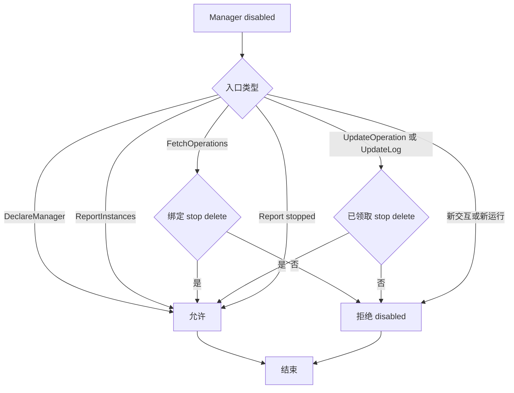
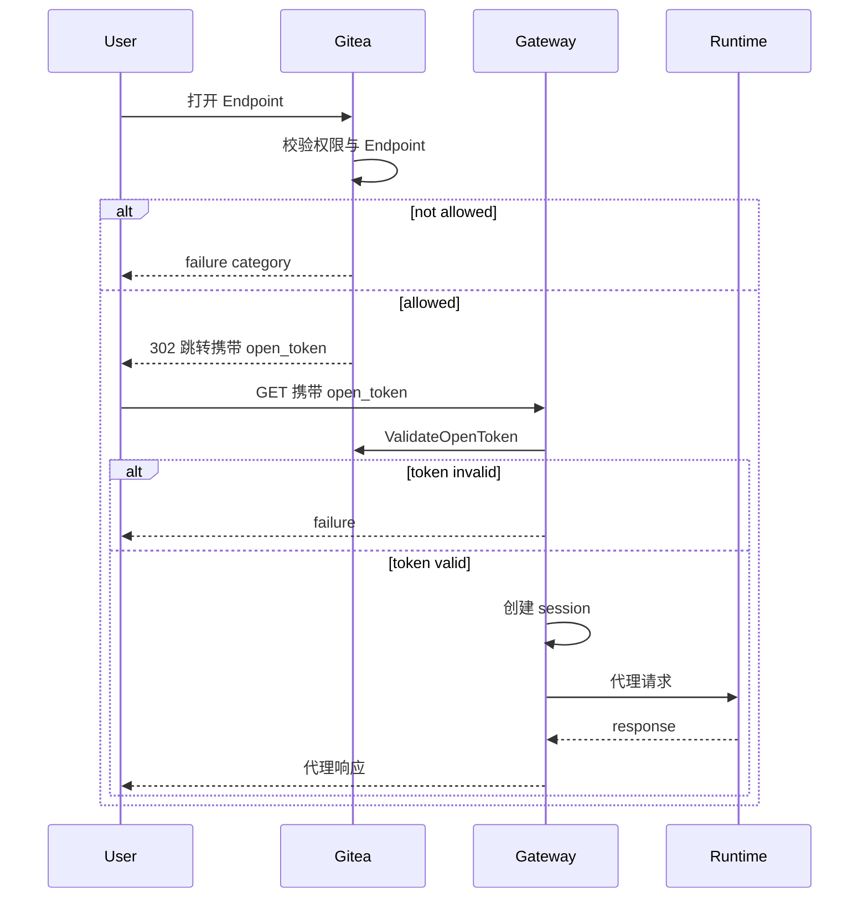
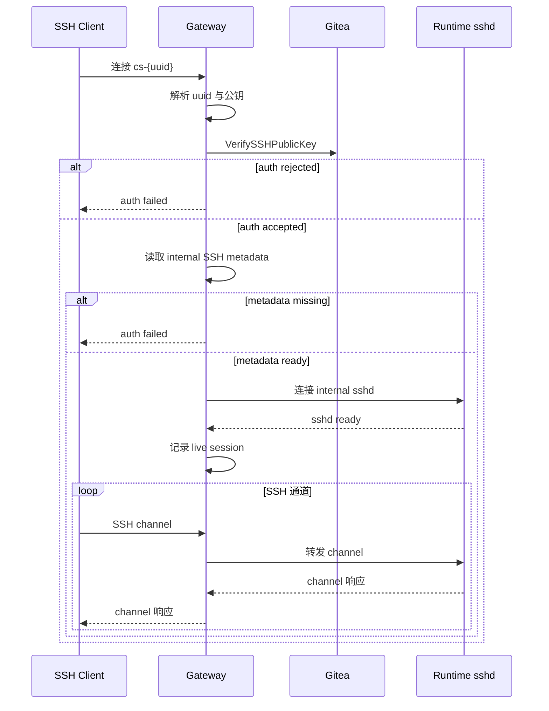

# Manager 与 Gateway

## Manager 设计

Manager 通过 [ManagerService RPC](rpc-spec.md) 与 Gitea 通信。完整 proto 定义见 [RPC 接口定义](rpc-spec.md)。

### 注册与认证

Manager 注册参考 Gitea Actions runner 方式。

Manager 注册入口使用 Gitea 现有 owner 模型。Gitea 中 organization 是 `user` 表中的一种类型，repository owner、用户设置页和组织设置页都映射到同一套 `user.id`。因此 registration token 和 Manager 记录统一使用 `owner_id` 表达归属：

| scope | 字段表达 | 含义 |
| --- | --- | --- |
| global | `owner_id = 0` | 站点级注册入口 |
| owner | `owner_id = user.id` | owner 级注册入口，owner 可以是个人用户或组织 |

注册入口直接复用 Gitea 的 owner 身份模型，个人用户和组织使用同一字段，设置页按当前上下文直接定位对应的注册入口。

命令：

```text
gitea-codespace register
gitea-codespace serve
```

注册流程：

1. Gitea 创建 registration token。
2. `gitea-codespace register` 通过 `RegisterManager` 兑换该 registration token。
3. Gitea 创建 Manager 记录，`codespace_manager.owner_id` 继承 registration token 的 `owner_id`。
4. Gitea 返回一次性明文 `manager_id + manager_secret`。
5. Manager 将凭据保存到本地配置。
6. `gitea-codespace serve` 使用该凭据调用后续所有 RPC。

`RegisterManager` 请求字段：

| 字段 | 说明 |
| --- | --- |
| `registration_token` | 设置页展示给管理员的注册入口凭据 |

`RegisterManager` 响应字段：

| 字段 | 说明 |
| --- | --- |
| `manager_id` | Manager 身份 ID |
| `manager_secret` | ManagerService RPC 通信凭据，明文只在注册响应中返回一次 |

Manager 将 `manager_id + manager_secret` 保存到本地配置。后续 ManagerService RPC 通过 header 发送：

```text
x-codespace-manager-id: <manager id>
x-codespace-manager-secret: <manager secret>
```

ManagerService 认证流程：

1. 从 header 读取 `x-codespace-manager-id`。
2. 从 header 读取 `x-codespace-manager-secret`。
3. Gitea 根据 Manager ID 查询 `codespace_manager`。
4. Gitea 使用该 Manager 的 `secret_salt` 计算提交 secret 的 hash。
5. Gitea 使用常量时间比较提交 hash 与 `secret_hash`。
6. 认证成功后，将 Manager 身份写入 request context。
7. 本次 RPC 按 Manager 身份继续处理。

Manager ID 提供稳定身份定位，Manager Secret 提供身份认证。认证逻辑集中在 ManagerService interceptor 中，所有注册后 RPC 使用同一认证路径。

设置页 token 查询：

| 页面 | registration token scope |
| --- | --- |
| 站点管理 Codespace 页面 | `owner_id = 0` |
| 用户设置 Codespace 页面 | `owner_id = ctx.Doer.ID` |
| 组织设置 Codespace 页面 | `owner_id = ctx.Org.Organization.ID` |

registration token 设计：

- registration token 存放在 `codespace_manager_token` 表。
- 页面进入 Codespace 管理界面时，Gitea 按当前 scope 查询 active registration token。
- 当前 scope 没有 active registration token 时，Gitea 创建新的 token 并展示给管理员。
- 数据库保存明文 `token`、`owner_id`、`is_active`。明文 token 使用唯一索引，查找方式与 `action_runner_token` 一致。
- `RegisterManager` 使用 registration token 时校验 `is_active=true`。
- active registration token 可用于注册多个 Manager。
- registration token 负责创建 Manager 身份，manager secret 负责证明已注册 Manager 身份。

Registration Token 明文保存——它是管理员复制给 Manager 完成首次注册的入口凭据。唯一索引用于让 `RegisterManager` 通过提交 token 直接定位注册入口。Registration Token 和 Manager Secret 承担不同职责，注册入口和已注册 Manager 通信身份分别管理。

实现验收点：

- global Codespace 管理页读取或创建 `owner_id=0` 的 active token。
- 用户 Codespace 管理页读取或创建 `owner_id=ctx.Doer.ID` 的 active token。
- 组织 Codespace 管理页读取或创建 `owner_id=ctx.Org.Organization.ID` 的 active token。
- `codespace_manager_token.token` 具备唯一索引。
- 使用 global token 注册出的 Manager 记录 `owner_id=0`。
- 使用用户 token 注册出的 Manager 记录 `owner_id=该用户 user.id`。
- 使用组织 token 注册出的 Manager 记录 `owner_id=该组织 user.id`。
- 注册成功后返回一次性明文 `manager_secret`。
- 注册成功后数据库保存 `secret_hash / secret_salt`。
- ManagerService 认证成功后 request context 中可取得 Manager 记录。

### Manager 规则

Manager 通过 owner scope 和 tag 匹配 create operation。`admin_state` 控制管理态（disabled Manager 仅能执行已有任务的 stop/delete 和状态分歧上报）；`last_online_unix` + timeout 推导在线态。

Declare 声明：

- `name`
- `version`
- `gateway_url`
- `gateway_ssh_addr`
- `tags`
- `meta_json`（含 Gateway SSH host key 指纹、容量快照和 backend 能力）

`meta_json` 中的 SSH 展示字段：

- `gateway_ssh_host_key_algorithm`
- `gateway_ssh_host_key_fingerprint_sha256`
- `gateway_ssh_host_key_updated_unix`

### Manager Capacity

- `capacity_total > 0`
- `0 <= capacity_available <= capacity_total`
- create/resume 需要 Manager 在本次 `FetchOperations` 中声明可接收，且 `capacity_available > 0`。stop/delete 不受 `capacity_available` 限制。
- capacity 是 Manager 最近上报的本地可接收能力快照，不是 Gitea quota。
- Manager 根据本地真实容量决定是否拉取 create/resume [Operation](glossary.md#operation)。
- Gitea 通过数据库条件更新保证 operation 只被一个 Manager 领取。Manager 自行控制本地并发，不超容量拉取。
- `FetchOperations` 使用 request 中的 `capacity_total / capacity_available` 覆盖数据库中的容量快照。

Manager 主动 pull operation；满载时不拉取 create/resume，queued operation 自然等待。Gitea 看不到 Manager 本地 Runtime 队列、资源占用和启动中任务，只保存最近容量快照用于 UI、诊断和本次 `FetchOperations` 领取判断。Manager tags 与 create `repo_tag` 的匹配在 Go 内存中完成，数据库只负责 queued operation 粗筛和条件领取。

### Manager Worker Pool 与 Runtime 映射

Manager 本地维护 operation worker pool。worker pool 执行已领取的 operation；是否继续从 Gitea 领取 create/resume 由 Manager 通过 `capacity_available` 表达。

规则：

- `FetchOperations` 单次可领取多个 operation。
- 单次总领取数量不超过 `max_operations`。
- create/resume 领取数量不超过 `capacity_available`。
- 已领取的 operation 使用 `operation_rversion` 绑定后续 `UpdateOperation` 和 `UpdateLog`。
- create/resume 使用容量槽位。
- stop/delete 使用独立 cleanup 队列，不占 create/resume 容量。
- operation 调度优先级为 `delete > stop > resume > create`。
- `capacity_available` 根据本地 worker 空闲数、backend 资源状态、正在启动/恢复的 Runtime 数量计算。
- Runtime Instance name 使用 `codespace_uuid` 确定性派生：

```text
cs-{codespace_uuid_short}
```

`codespace_uuid_short` 取 UUID 去掉 `-` 后前 20 位。

Gitea 只知道 operation 和 Manager 上报的容量快照，Manager 才知道本地 CPU、内存、backend 队列和 Runtime 启动状态。stop/delete 独立于 create/resume 容量，Manager 满载时仍能推进资源回收。Runtime name 由 `codespace_uuid` 派生，create、resume、delete 和本地清理都能找到同一个实例。

Manager 重启恢复策略见 [维护与重启恢复](maintenance-recovery.md)。该设计把 Manager 重启视为日常维护事件，先恢复本地 Runtime 信息和 Runtime Metadata，再恢复 create/resume 领取，减少维护重启造成的 codespace 误失败。

### Manager 禁用与删除

常规管理操作使用 disabled 状态停用 Manager。disabled 保留已绑定清理能力，停止新的交互和新的运行实例：

- disabled Manager 可以调用 `DeclareManager`、领取已绑定的 `stop|delete`、`UpdateOperation`、`UpdateLog`（仅限已领取的 `stop|delete`）、`ReportInstances`、`ReportRuntimeTransition(runtime_state=stopped)`。
- disabled Manager 的 create/resume、Runtime Metadata 写入、Gitea Token 申请、Open Token 校验和 SSH 公钥校验返回 disabled 分类。
- 物理删除 Manager 记录前，管理流程先确认没有未删除 codespace 和 active operation 引用该 Manager。

Manager disabled 处理流程：



disabled 是运维止血动作：快速阻止新的 workspace 和用户会话，同时保留 stop/delete/report 能力让已绑定 Runtime 继续完成清理，避免把资源留在运行侧。

### Manager Secret

[Manager Secret](glossary.md#manager-secret) 用于认证已注册 Manager 调用 ManagerService RPC。

规则：

- 只在 `RegisterManager` 响应中返回一次。
- 由 Manager 保存在本地配置。
- Gitea 只保存 hash/salt。
- 使用常量时间比较（`subtle.ConstantTimeCompare`）。
- registration token 和 manager secret 是两个不同生命周期的凭据。
- registration token 只用于 `gitea-codespace register` 调用 `RegisterManager`。
- manager secret 只用于已注册 Manager 调用后续 ManagerService RPC。
- manager secret 明文只在 `RegisterManager` 成功时展示一次。
- 凭据更换通过注册新 Manager、迁移运行侧配置、停用旧 Manager 完成。

Manager Secret 使用 salt/hash 保存，是因为它是 ManagerService 的长期通信凭据。Gitea 保存可验证值即可完成认证，Manager 本地保存明文 secret 并负责后续 RPC 调用。

实现验收点：

- `RegisterManager` 响应包含一次性明文 `manager_secret`。
- `codespace_manager` 表保存 `secret_hash / secret_salt`。
- ManagerService 认证使用 `manager_id` 定位 Manager。
- ManagerService 认证使用 `secret_salt` 计算提交 secret 的 hash。
- ManagerService 认证使用常量时间比较 hash。

### Runtime Token

[Runtime Token](glossary.md#runtime-token) 只由 Manager 生成和校验。

Gitea 侧由 Manager 生成和校验 Runtime Token，Runtime Token 不出现在 ManagerService RPC 中。

Runtime Token 只用于 Runtime Instance 调用 Runtime HTTP API。Runtime HTTP API 属于 Manager 私有面。Manager 可以把 Runtime Token 与本地 Runtime Instance 和 source IP 绑定。

## Runtime HTTP API

`CODESPACE_MANAGER_BASE_URL` 是 Runtime Instance 访问 Manager Runtime HTTP API 的根地址。

Runtime HTTP API 由 Manager 实现和管理，路由和认证独立于 Gitea。

所有请求使用：

```text
Authorization: Bearer <CODESPACE_RUNTIME_TOKEN>
Content-Type: application/json
```

网络规则：

- Runtime HTTP API 仅接受 Runtime Instance 私网 source IP 调用，同时校验 Runtime Token。

路径前缀：

```text
{CODESPACE_MANAGER_BASE_URL}/api/runtime/v1
```

最小接口：

| 方法 | 路径 | 用途 |
| --- | --- | --- |
| `GET` | `/api/runtime/v1/boot` | 查询初始化所需的完整 boot session 信息 |
| `POST` | `/api/runtime/v1/boot` | 上报初始化完成结果（一次调用） |
| `GET` | `/api/runtime/v1/endpoints/{endpoint_id}` | 查询单个 Endpoint 当前声明 |
| `POST` | `/api/runtime/v1/endpoints/{endpoint_id}` | 创建 Endpoint |
| `PUT` | `/api/runtime/v1/endpoints/{endpoint_id}` | 更新 Endpoint |
| `DELETE` | `/api/runtime/v1/endpoints/{endpoint_id}` | 删除 Endpoint |

Runtime Instance 只需要获取初始化信息和声明可打开入口。生命周期状态、Gitea token、日志和 Runtime Metadata 由 Manager 统一转接到 Gitea，Runtime HTTP API 保持在 boot/endpoints 两类接口，减少与 Gitea 生命周期设计的耦合。

### GET /boot

- Runtime Instance 启动后调用，用于查询初始化所需的完整 boot session 信息。
- 返回 Manager 当前 Token 绑定信息，作为只读查询接口。
- 返回内容包含：

| 字段 | 来源 |
| --- | --- |
| `codespace_uuid` | Operation 返回数据 |
| `operation_type` | `create` / `resume` |
| `server_time_unix` | Manager 当前时间 |
| `workspace_dir` | Manager 本地决定 |
| `runtime_token_bound_source_ip` | Manager 记录 |
| `gitea_repo_clone_url` | create Operation 返回数据 |
| `gitea_repo_web_url` | create Operation 返回数据 |
| `gitea_base_repo_clone_url` | create Operation 返回数据 |
| `gitea_base_repo_web_url` | create Operation 返回数据 |
| `gitea_head_repo_clone_url` | create Operation 返回数据 |
| `gitea_head_repo_web_url` | create Operation 返回数据 |
| `gitea_repo_id` | create Operation 返回数据 |
| `gitea_repo_full_name` | create Operation 返回数据 |
| `gitea_owner_id` | create Operation 返回数据 |
| `gitea_owner_name` | create Operation 返回数据 |
| `gitea_owner_type` | create Operation 返回数据 |
| `gitea_owner_display_name` | create Operation 返回数据 |
| `gitea_ref_type` | create Operation 返回数据 |
| `gitea_ref_name` | create Operation 返回数据 |
| `gitea_commit_sha` | create Operation 返回数据 |
| `gitea_token` | Gitea `RequestGiteaToken` |
| `codespace_name` | Manager 派生（`cs-{short_uuid}`） |
| `codespace_owner_name` | Operation 返回数据 |
| `codespace_repo_name` | Operation 返回数据 |

`GET /boot` 规则：

- create boot 信息由 Manager 根据 Gitea operation 返回数据和 Manager 本地配置组合生成；resume 基于已初始化 workspace，不要求 repository payload。
- `workspace_dir` 由 Manager 本地决策生成。
- `gitea_token` 来自 Gitea `RequestGiteaToken`。
- `codespace_name` 使用 `cs-{short_uuid}` 派生规则，`short_uuid` 取 UUID 去掉 `-` 后前 20 位。
- `runtime_token_bound_source_ip` 仅 Runtime 自检使用，Gitea 权限判断基于 user 和 codespace 状态。

### POST /boot

- Runtime 初始化完成后调用一次。
- 成功后 Manager 将 boot 结果作为 create/resume operation 的完成依据之一。
- 重复调用返回 conflict，不覆盖第一次结果。
- 请求内容包含：

| 字段 | 必填 | 说明 |
| --- | --- | --- |
| `success` | 是 | `true` / `false` |
| `stage` | 否 | 当前 boot stage |
| `started_unix` | 否 | 启动时间戳 |
| `completed_unix` | 否 | 完成时间戳 |

`success=true` 时额外包含：

| 字段 | 说明 |
| --- | --- |
| `workspace_head_sha` | 当前 HEAD SHA，必须与锁定 `commit_sha` 一致 |
| `internal_ssh_host` | 内部 SSH host |
| `internal_ssh_port` | 内部 SSH port |
| `internal_ssh_user` | 内部 SSH user |
| `internal_ssh_host_key_fingerprint` | 内部 SSH host key fingerprint |

`POST /boot` 规则：

- `success=true` 时，workspace checkout 到锁定 `commit_sha`。
- `success=true` 时，`workspace_head_sha == commit_sha`。
- `success=true` 时，internal SSH 信息完整，且 internal SSH 可被 Gateway 连通。
- `success=false` 时，Manager 将 create/resume operation 标记 failed。
- `POST /boot` 只上报 boot 完成状态。Endpoint 通过 Endpoint API 独立管理。
- boot 完成后 Runtime 仍可管理 Endpoint，但 `POST /boot` 仅允许调用一次。

### Endpoint API

- `GET /endpoints/{endpoint_id}` 查询单个 [Endpoint](glossary.md#endpoint) 当前声明，不存在返回 404。
- `POST /endpoints/{endpoint_id}` 创建 Endpoint，已存在返回 conflict。
- `PUT /endpoints/{endpoint_id}` 更新 Endpoint，不存在返回 404。
- `DELETE /endpoints/{endpoint_id}` 删除 Endpoint；不存在返回 204。
- `endpoint_id` 使用 `[A-Za-z0-9_-]+`。
- `workspace` 是默认 Web IDE 保留 ID。
- 删除 `workspace` 允许；UI 默认 Open 会退回 codespace 详情页。

Endpoint create/update 请求体：

| 字段 | 说明 |
| --- | --- |
| `label` | 展示标签 |
| `upstream_scheme` | upstream 协议 |
| `upstream_host` | upstream host |
| `upstream_port` | upstream port |
| `upstream_path` | upstream path |

Endpoint API 规则：

- `label` 会进入 Gitea Runtime Metadata。
- `upstream_*` 仅在 Manager/Gateway 内部保存和转发，Gitea 使用 `endpoint_id` 和 `label` 完成 Endpoint 存在性校验和展示。
- 每次 Endpoint create/update/delete 后，Manager 重新生成当前 Runtime Metadata 快照并调用 `ReportRuntimeMetadata`。

Endpoint 使用 `endpoint_id` 做路由键，使用 `label` 做展示文本，把授权、路由和展示分开：Gitea 只确认 Endpoint 是否存在，Gateway 负责解析内部 upstream，UI 文案变化不影响 open 流程。

## Gateway 设计

Gateway 通过 Manager 身份调用 Gitea [ManagerService RPC](rpc-spec.md) 完成 Open Token 校验和 SSH 认证。

### Endpoint 打开流程

`POST /codespace/{uuid}/open` 打开一个 Runtime Metadata [Endpoint](glossary.md#endpoint)。

输入：

```text
endpoint_id=<endpoint_id>
```

规则：

- `workspace` 是保留 Endpoint ID，表示默认 Web IDE。
- SSH 使用独立接入面。
- 预览端口、服务入口和 IDE 入口都通过 Endpoint 打开。
- open 输入仅接受 `endpoint_id`，由 Gitea 根据 Runtime Metadata 校验 Endpoint 存在并生成 Open Token。Gateway 侧自行判断 tunnel 目标。

Endpoint label 规则：

- 长度 1 到 64（trim 后）。
- label 使用普通可展示文本，控制字符、`<` 和 `>` 由输入校验过滤。
- 仅用于 UI 展示，不受查找、路由、授权、默认选择或日志身份影响。
- UI 按普通文本 escape 后展示。

label 只承担展示职责，输入校验关注 UI 可读性和 HTML 展示安全。路由和授权使用 `endpoint_id`，用户修改 label 不影响 Gateway 转发或日志关联。

默认 open：

- 当前 Runtime Metadata 存在 `endpoint_id=workspace` 时，列表页/repo 页默认 Open 打开 `workspace`。
- 不存在 `workspace` 时，默认 Open 进入 `GET /codespace/{uuid}`，让用户手动选择 Endpoint。

open 成功响应：

```text
302 Location: {manager.gateway_url}/open?open_token={token}
```

- `open_token` 作为一次性授权凭据，由 Gateway 消费并在本地建立 session，不传递到 Runtime Instance。
- Gateway access log 不记录完整 token。

Gateway Endpoint 反向代理：

- Gateway 实现 HTTP reverse proxy。
- 支持 WebSocket upgrade。
- 第一版 Endpoint 不提供任意 TCP tunnel；SSH 使用独立接入面。
- TLS 在 Gateway 入口终止，Gateway 到 Runtime 使用 Manager 私有网络 HTTP。
- Open Token 消费后建立 Gateway session cookie。
- Gateway 根据 session 绑定 `user_id / codespace_uuid / endpoint_id / manager_id`。
- Gateway 转发时将 `/cs/{codespace_uuid}/e/{endpoint_id}/` 前缀从 upstream path 中移除。
- Gateway 向 Runtime 注入转发上下文 header：

```text
X-Gitea-Codespace-UUID
X-Gitea-Codespace-Endpoint-ID
X-Gitea-Codespace-User-ID
X-Forwarded-For
X-Forwarded-Proto
X-Forwarded-Host
```

- Gateway 不向 Runtime 传递 `open_token`、Gitea access token、Manager Secret 或 Runtime Token。

Endpoint open 流程：



Endpoint URL 形态：

```text
https://gateway.example.com/open?open_token=...
https://gateway.example.com/cs/{codespace_uuid}/e/{endpoint_id}/...
```

HTTP/WebSocket 覆盖 Web IDE 和端口预览主场景。第一版不提供任意 TCP tunnel，减少鉴权和资源占用复杂度。Gateway 统一终止 TLS，集中管理证书、access log 和 session。Open Token 只用于换取 Gateway session，避免一次性 bearer token 泄漏到 Runtime 或后续浏览器请求中。

### Gateway Session 管理

- Gateway 维护 `codespace_uuid -> live sessions` 的本地索引。
- Gateway 和 Manager 是同一 deployment 内的一体化组件。
- Manager 执行 stop/delete 前，先通知本地 Gateway 关闭该 `codespace_uuid` 的 HTTP/WebSocket/IDE 会话。
- Manager disabled 后，本地 Gateway 对新 open 返回 manager disabled 分类，并关闭该 Manager 负责的 live sessions。
- 创建用户登录状态不再允许后，新的 open 由 Gitea `ValidateOpenToken` 返回对应失败分类。
- 已建立 session 在下一次 Manager operation、Gateway 周期校验或 Runtime 断开时关闭。Gateway 会话管理依赖本地 Manager 事件通知，Gitea 不对 Gateway 下发主动指令。

Gateway session 默认配置：

```ini
GATEWAY_SESSION_TTL = 8h
GATEWAY_SESSION_IDLE_TIMEOUT = 30m
GATEWAY_SESSION_REVALIDATE_INTERVAL = 5m
GATEWAY_MAX_SESSIONS_PER_CODESPACE = 32
GATEWAY_MAX_SESSIONS_PER_USER = 128
```

规则：

- session 绑定 `user_id / codespace_uuid / endpoint_id / manager_id`。
- 每次 HTTP 请求刷新 idle time。
- WebSocket 长连接每 `GATEWAY_SESSION_REVALIDATE_INTERVAL` 重新校验 session 条件。
- Manager stop/delete 前通知 Gateway 关闭该 codespace 的所有 Endpoint sessions。
- Manager disabled 时关闭该 Manager 负责的 sessions。
- 创建用户登录状态不再允许后，新 session 由 Gitea 返回对应失败分类；已建立 session 在下一次周期 revalidate 时关闭。
- Runtime upstream 断开时 session 保留，下一次请求重新连接，直到 TTL 或 idle timeout 到期。

TTL 限制长期遗留 session，idle timeout 控制资源占用，周期 revalidate 处理用户登录状态、codespace 状态和 Manager 状态变化，减少每个请求回到 Gitea 的开销。stop/delete/disabled 是明确管理事件，由 Manager/Gateway 本地事件立即关闭连接。

## SSH 接入

### SSH 接入

SSH 是 codespace 自身稳定接入面，不是 Endpoint。

用户通过 `ssh cs-{codespace_uuid}@gateway_host` 连接。Gateway 从连接串解析 `codespace_uuid`，直接查表获取 codespace，然后调用 `VerifySSHPublicKey` 完成公钥认证。用户身份通过公钥匹配确定，创建者用户名由 Gitea 侧从 `user_id` 获取。Gitea 页面展示 `gateway_ssh_addr`、Gateway SSH host key algorithm、SHA256 fingerprint 和 host key 更新时间，供用户首次连接前核对。

SSH 可用性：

- `running` 状态且没有 active stop/delete operation 时提供 SSH。
- `creating|stopped|deleting|failed` 返回状态不可用分类。
- `running` 但存在 active stop/delete operation 时返回状态不可用分类。
- stopped codespace 通过显式 resume 恢复后再提供 SSH。

SSH 是长连接交互面，只有 running 状态能保证 internal SSH metadata 与 Manager/Gateway 转发同时成立。stopped 自动唤醒会把认证尝试变成生命周期操作，容易让普通 SSH 客户端重试触发意外资源启动。

### SSH 中转模型

Manager 创建的 Runtime Instance 提供兼容 OpenSSH 的 sshd。

Gateway 中转流程：

1. 用户连接 `ssh cs-{codespace_uuid}@gateway_host`。
2. Gateway 从连接串解析 `codespace_uuid`，查找对应 codespace。
3. Gateway 调用 Gitea `VerifySSHPublicKey(codespace_uuid, public_key_blob)` 完成公钥认证。
4. Gateway 确认 codespace 为 running。
5. Gateway 作为 SSH client 连接 Runtime Instance 内部 sshd。
6. Gateway 在外部 SSH 连接与内部 SSH 连接之间转发 channel。

SSH 连接流程：



Gateway 终止外部 SSH 并重建内部 SSH，不采用纯 TCP forwarding，也不自行实现 shell/sftp/pty。

支持的 SSH channel 能力：

- shell
- exec
- subsystem `sftp`
- `pty-req`
- `window-change`
- `signal`
- `env`
- `exit-status`
- `exit-signal`
- `auth-agent-req`
- `x11-req`
- `direct-tcpip`
- `tcpip-forward`
- `cancel-tcpip-forward`

SSH forwarding 属于 SSH 会话能力，在 SSH 连接内独立管理。Endpoint 列表由 Runtime Metadata 的 `endpoints` 数组维护。

### SSH 认证

Gateway 每次 SSH 认证尝试都调用 Gitea `VerifySSHPublicKey`，不跨连接缓存认证结果。

Gitea 校验（详见 [ManagerService RPC](gitea-server.md#managerservice-rpc)）：

- `codespace_uuid` 映射到有效 codespace。
- codespace 为 `running`。
- 公钥认证确认 public_key_blob 归属于 codespace 创建用户（`models/asymkey/ssh_key.go`）；若站点强制 2FA，用户必须已启用符合站点要求的 2FA。
- 创建用户当前允许登录。
- 绑定 Manager 当前在线且未被 disabled。

Gateway 按 source IP、`codespace_uuid` 做限流和退避。限流和退避由 Gateway 负责。

Gitea 可以向 Gateway 返回失败分类用于日志和退避。Gateway 对 SSH client 只返回统一认证失败。

SSH session 规则：

- Gateway 维护 `codespace_uuid -> live SSH sessions` 的本地索引。
- Manager 执行 stop/delete 前，先通知本地 Gateway 关闭该 `codespace_uuid` 的 SSH sessions。
- Manager disabled 后，本地 Gateway 对新 SSH 返回 manager disabled 分类，并关闭该 Manager 负责的 live SSH sessions。
- 创建用户登录状态不再允许后，新的 SSH auth 由 Gitea `VerifySSHPublicKey` 返回对应失败分类。
- 已建立 SSH session 在下一次 Manager operation、Gateway 周期校验或 Runtime 断开时关闭。Gateway 会话管理依赖本地 Manager 事件通知，Gitea 不对 Gateway 下发主动指令。

Gateway 本地执行 SSH 认证限流与退避。

计数维度：

- `source_ip`
- `codespace_uuid`
- `source_ip + codespace_uuid`
- `public_key_hash`

默认配置：

```ini
SSH_AUTH_MAX_ATTEMPTS_PER_IP_PER_MINUTE = 30
SSH_AUTH_MAX_ATTEMPTS_PER_CODESPACE_PER_MINUTE = 20
SSH_AUTH_MAX_ATTEMPTS_PER_IP_CODESPACE_PER_MINUTE = 10
SSH_AUTH_BACKOFF_BASE = 1s
SSH_AUTH_BACKOFF_MAX = 30s
SSH_AUTH_FAILURE_WINDOW = 10m
```

失败分类处理：

- `invalid_credentials` 计入退避。
- `codespace_not_found` 计入退避。
- `codespace_not_running` 轻量计数。
- `login_restricted`、`manager_mismatch` 计数并写 Gateway 本地日志。
- `internal_error` 不计入暴力破解退避。

SSH 暴力破解通常同时体现为来源 IP、目标 codespace 和公钥维度异常。多维度计数减少单一 IP 维度的误伤，降低攻击者轮换 key 或目标 codespace 的绕过空间。Gateway 离 SSH 连接最近，适合做快速退避；Gitea 返回失败分类，Gateway 据此区分攻击、状态不可用和内部故障。

### 内部 SSH

每条 Manager 注册记录拥有一对固定内部 Gateway SSH key。

规则：

- create/resume 时将 Gateway 的内部 SSH 公钥写入 Runtime Instance 内部工作用户 `authorized_keys`。
- Gateway 使用对应 private key 连接内部 sshd。
- 内部 host、port、user、host key fingerprint 通过 `POST /boot` 上报。
- 用户公钥不在 Runtime Instance 内部校验。
- 内部 SSH metadata 不在普通 UI/API 输出中暴露。

内部 SSH 使用 Gateway 固定密钥，把用户认证放在 Gitea/Gateway 边界完成，Runtime Instance 只信任 Manager deployment 内部通道。Runtime 不需要保存用户 SSH key，也能在用户登录状态变化后由 Gitea 实时返回 SSH 认证失败分类。

## 日志与脱敏

### 日志来源

- Gitea 保存一套 codespace 上报日志。
- Manager 本地日志用于 Manager/Gateway 排障。
- `UpdateLog` 是唯一上报入口，始终追加到当前 codespace 日志文件。
- create/resume/stop/delete lifecycle operation 执行期间的 boot、init、git、Endpoint 初始化、stop、resume、delete 阶段日志写入 codespace 日志。
- active operation 清空后，日志文件进入封闭状态，由 Gitea 页面读取已保存的生命周期证据。
- running 期间 open token 连接成功、SSH 连接成功、session 正常关闭、Endpoint 后续变化和用户可见运行异常记录在 Manager/Gateway 本地日志。
- running 期间连接成功通过 `last_active_unix` 记录用户活跃时间；详细连接事件写 Manager/Gateway 本地日志。
- open token 校验失败、SSH 公钥失败、限流、扫描、爆破、Gateway proxy debug、backend driver debug、heartbeat、空 pull、health poll 明细和内部 retry 细节只写 Manager/Gateway 本地日志。

codespace 日志是生命周期操作的执行证据，单文件连续追加。只有当前 `operation_status=running` 且 `operation_rversion` 匹配时允许追加，active operation 清空后封闭。连接级事件保留在 Manager/Gateway 本地日志——这些事件数量大、包含网络诊断细节，放入 Gitea codespace 日志会干扰用户阅读生命周期过程。

### 脱敏

- Manager 是精确脱敏第一责任方。
- Manager 在 `UpdateLog` 前脱敏 `GITEA_TOKEN`、`CODESPACE_RUNTIME_TOKEN`、URL userinfo、URL query token、Authorization header、git credential helper 输出和常见 bearer/basic token 形式。
- Manager 维护 operation-local mask set。
- operation-local mask set 包含注入给 `init.sh` 的所有敏感值。
- `::add-mask::value` 消费后，`value` 加入 operation-local mask set，后续日志中出现的 `value` 替换为 `***`。
- `::add-mask::value` 由 Manager 本地消费并加入 mask set，mask 指令原文仅存在于 Manager 本地内存。
- Manager 重启后继续处理同一 operation 时，重新加载或重建该 operation 的必要 mask set。
- 如果 Manager 无法确认脱敏安全，停止上传该 operation 的原始日志，并将 operation 标记为 failed 或上传明确错误摘要。
- Gitea 入库前只做防御性清理，例如控制字符过滤、单行长度限制、URL userinfo 和 Authorization header 模式替换。
- Manager 持有 Gitea Token 和 Runtime Token 明文，负责精确脱敏。Gitea 执行防御性清理（控制字符过滤、单行长度限制、常见 URL token/Authorization header 模式替换）。安全边界定义如下：前端隐藏和 Gitea 防御性清理均属于展示层保护，不能作为 token 泄漏的安全兜底。
- 下载日志和 UI 日志使用同一份脱敏内容。
- 错误摘要必须在 final `UpdateOperation` 前上传。
- active operation 清空后，Gitea 日志进入封闭状态。
- stop/resume/delete 创建新的 operation 版本后，日志继续追加到同一文件。
- 只有当前 `operation_status=running` 且 `operation_rversion` 匹配时才能追加 Gitea 日志。

脱敏责任放在 Manager——Manager 创建 Runtime、注入 token，并最早看到 init 输出。Gitea 的防御性清理用于降低展示风险，但不能替代 Manager 对已知敏感值的精确 mask；边界清晰，日志泄漏时也能定位责任组件。

### 日志命令

```text
::group::title
::endgroup::
##[group]title
##[endgroup]
::error::message
::warning::message
::notice::message
::debug::message
##[command]command
[command]command
```

Codespace 日志 UI 复用 Actions console 解析和渲染能力，与 Actions 共享同一套日志渲染器。

### Gateway Access Log

Gateway access log 使用结构化 JSON line。

字段：

```json
{
  "time": "...",
  "request_id": "...",
  "kind": "endpoint|ssh",
  "manager_id": 1,
  "codespace_uuid": "...",
  "endpoint_id": "...",
  "user_id": 1,
  "source_ip": "...",
  "method": "GET",
  "path_template": "/cs/{uuid}/e/{endpoint_id}/...",
  "status": 200,
  "duration_ms": 12,
  "bytes_in": 0,
  "bytes_out": 0,
  "failure_category": "",
  "session_id_hash": "...",
  "user_agent_hash": "..."
}
```

脱敏规则：

- 记录 path template，不记录 query string。
- 记录 session ID hash，不记录 session cookie 原文。
- 记录 user agent hash，不记录完整 user agent。
- 记录失败分类，不记录 `open_token`、Authorization header、cookie 原文、Gitea access token、Manager Secret 或 Runtime Token。

保留策略：

```ini
GATEWAY_ACCESS_LOG_RETENTION_DAYS = 30
GATEWAY_ACCESS_LOG_MAX_SIZE = 1GiB
```

Gateway access log 面向运维排障和访问记录，不是用户生命周期日志。JSON line 便于接入 Loki/ELK 等日志系统。记录模板、hash 和失败分类满足排障需求，同时降低 token、cookie、query 参数和用户隐私泄漏风险。
