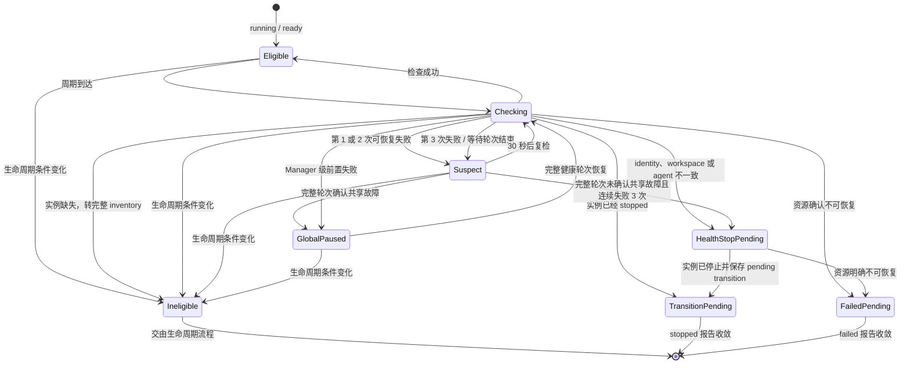
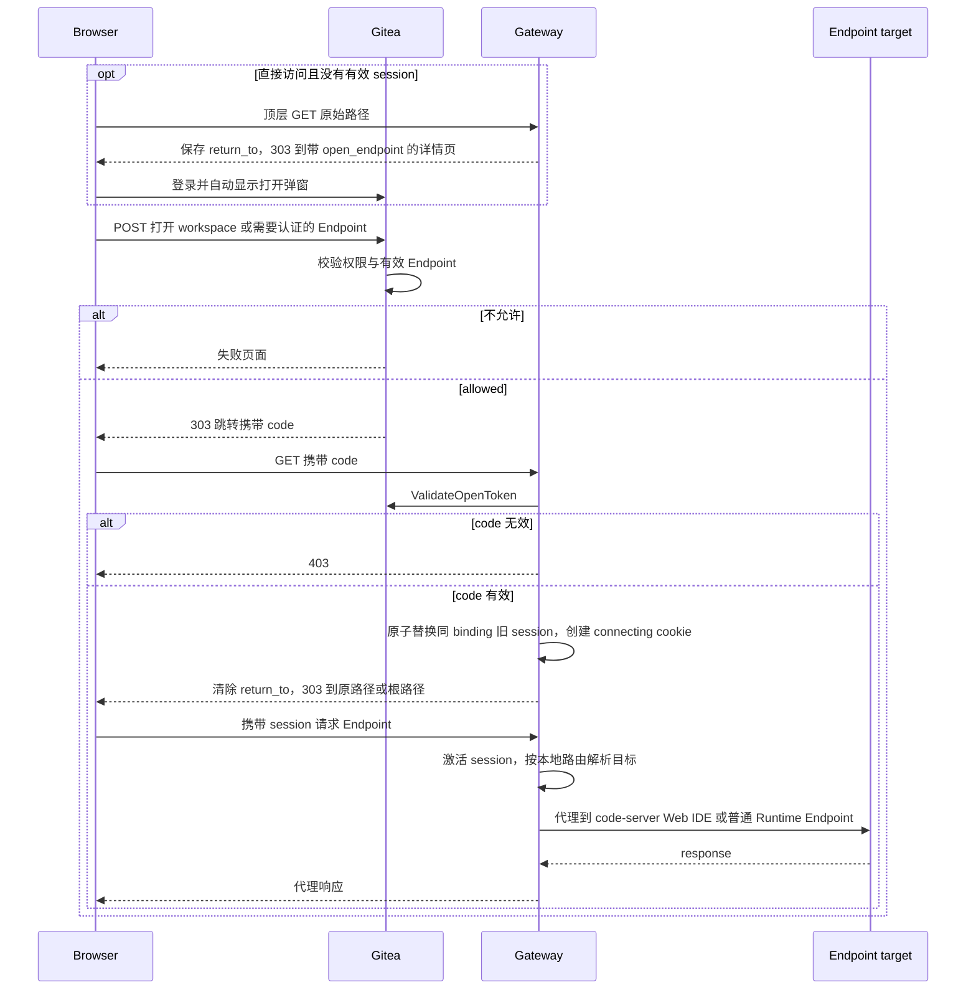
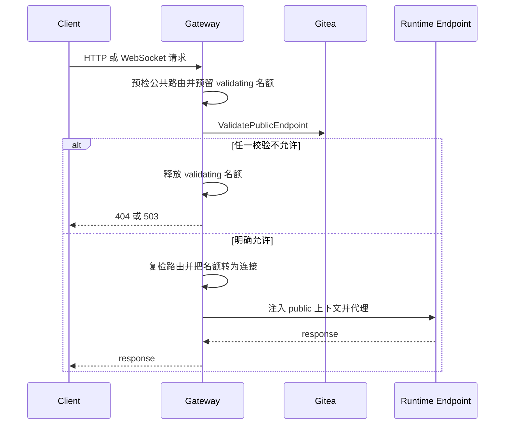
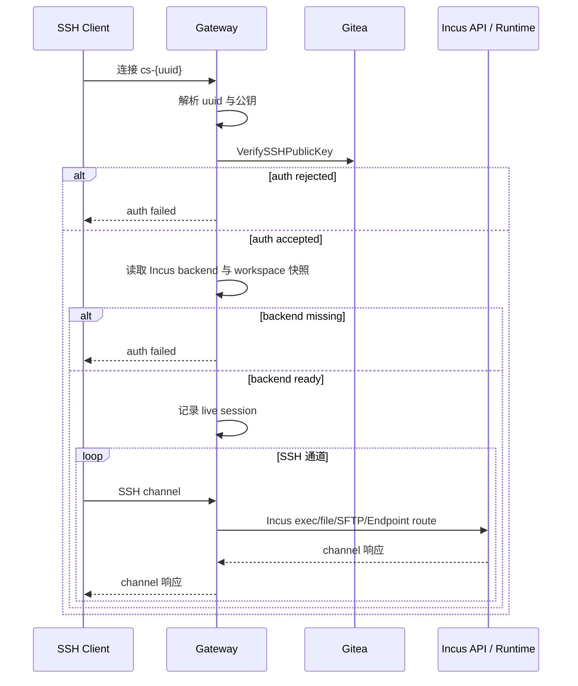

# Manager 与 Gateway

## Manager 设计

Manager 通过 [ManagerService RPC](rpc-spec.md) 与 Gitea 通信。完整 proto 定义见 [RPC 接口定义](rpc-spec.md)。

### 进程与组件边界

`gitea-codespace serve` 是单个操作系统进程。它同时运行 ManagerService 客户端、heartbeat、operation worker、Incus 管理、Runtime 健康检查、Gateway HTTP/WebSocket listener 和 Gateway SSH listener。Gateway 是该进程中的用户接入组件，直接使用进程内的 Codespace 协调状态、Runtime 映射、不可变路由引用和 session 索引；Manager 与 Gateway 之间没有需要部署或兼容的内部网络协议。

三个 listener 都是 Manager 提供完整运行能力的必要部分。进程在声明 online 前完成监听地址绑定；任一 listener 无法绑定时直接退出。运行中 listener 意外终止时，进程关闭 session 准入和已有连接后退出，heartbeat 随之停止，Gitea 按超时派生 offline。外部反向代理和 DNS 的可达性由部署配置保证，Manager 只验证本地 listener 和声明字段。

单进程共享协调状态使 Gateway 可以与 operation、Endpoint 更新和 cleanup 使用同一个按 Runtime UUID 建立的临界区。代码可以按职责拆分包和接口，但这些调用始终留在当前进程内，不形成第二套身份、状态或故障恢复协议。

ManagerService Declare/heartbeat、Fetch/lease、完整 inventory、Runtime 健康调度和三个必要 listener 都由同一个进程级监督器管理。临时控制面或 Incus 错误由对应循环按既有退避规则继续；循环在没有进程取消信号时意外返回、发生未恢复 panic 或报告不可继续的本地状态错误时，监督器原子关闭新 operation 领取和全部 session 准入，取消其他组件并让进程以非零状态退出。单个 Codespace 的 bootstrap、容器、连接或资源错误只进入该 UUID 的执行队列和状态收敛，不结束进程。这个边界使系统以“组件继续工作”或“整个进程退出并由既有重启恢复”两种结果运行，不会留下仍在 heartbeat 但 Fetch、inventory 或健康检查已经静默停止的 Manager。

收到 SIGINT/SIGTERM 时，Manager 先停止领取新 operation 并关闭全部新 session 准入，再取消健康检查和普通后台发布任务；active create/resume 取消 Incus exec 与原生运行时请求、停止实例并持久化 `lease_paused`，stop/delete 在已经开始的 Incus 调用返回后按实际资源状态保存。Gateway 关闭已有连接，全部组件在 `node.shutdown_timeout` 内完成本地提交并停止 heartbeat。到期仍未完成时进程非零退出；下次启动从持久快照和完整 inventory 恢复。关闭流程不创建 operation，也不改写 Gitea deadline。

Gateway 基础域名固定提供 `GET /api/healthz`，响应沿用 Gitea `pass|warn|fail` 结构且不包含 Runtime UUID、内部地址或错误正文。online、关键循环运行且健康调度正常时返回 `pass`；recovering、控制面或 Incus 暂时不可用，或者健康检查因共享故障暂停时返回 HTTP 200 的 `warn`；状态目录无法提交、版本历史硬冲突、关键组件意外退出或进程正在结束时返回 HTTP 503 的 `fail`，随后进程按上述规则退出。容量因正常满载为 0 时仍可返回 `pass`。该接口用于部署诊断和流量就绪判断，进程存活由进程监督器判断；Manager 使用 Declare/Fetch 验证真实控制面，不轮询 Gitea `/api/healthz` 代替业务 RPC。Gateway 不把 `/` 作为进程健康或状态 JSON；在 workspace 派生域名上，`/` 是用户进入 workspace 的业务入口。

Gateway 对用户浏览器的顶层 HTML 请求返回可读错误页，覆盖 open code 无效、session 缺失或过期、授权暂不可用、route 未准备好、runtime endpoint 无法连接、公共 Endpoint 不存在或不可访问等入口。错误页只显示固定标题、简短说明、HTTP 状态和稳定错误分类，不暴露内部地址、RPC 错误正文、实例名或 token。`/api/healthz`、WebSocket upgrade、明确 `Accept: application/json` 的请求和未明确接受 `text/html` 的普通客户端继续返回 JSON 或协议内错误。**设计如此：**浏览器用户需要知道下一步是重新从 Gitea 打开、等待启动还是稍后重试；API、健康检查和脚本调用需要稳定机器可读结果，两类响应按请求类型区分，不把 UI 文案塞进程序接口。

实现验收点：

- [x] 一个 `serve` 进程同时持有 Manager worker、Gateway HTTP 和 Gateway SSH；相同状态目录的第二个进程在发送 RPC 前退出。
- Gateway 通过进程内协调状态完成 session 登记、路由读取和生命周期取消，不经过内部 HTTP、RPC 或共享数据库。
- 任一必要 listener 启动失败时不 Declare online；运行中 listener 意外终止会使整个进程退出并停止 heartbeat。
- Declare/heartbeat、Fetch/lease、inventory、健康调度和必要 listener 任一关键循环意外结束时，Manager 关闭准入并整体退出；单 Codespace 普通错误只收敛该对象。
- SIGINT/SIGTERM 在进程关闭期限内暂停 active create/resume、保存本地结果并关闭连接；进程关闭不延长 operation lease 或创建新的 Gitea 状态。
- Gateway 基础域名的 `/api/healthz` 只返回 Manager 整体 `pass|warn|fail`，不会把单 Codespace 故障、内部地址或错误正文暴露为健康响应。
- [x] Gateway HTTP 的 `/` 不返回进程状态 JSON；workspace 派生域名的 `/` 进入当前 workspace，健康检查只使用 `/api/healthz`。
- [x] 顶层浏览器 HTML 请求遇到 Gateway 自身错误时返回内嵌 HTML 错误页；`Accept: application/json`、WebSocket 和健康检查仍返回 JSON 或协议错误。测试覆盖 route 未准备好时 HTML 页面与 JSON API 响应的分流。

### 身份与认证

Manager 身份由 Gitea 的 Codespace Manager 页面创建。页面分为站点全局和个人用户两类，Manager 记录继续使用 `user_id` 表达归属：

| scope | 字段表达 | 含义 |
| --- | --- | --- |
| 站点全局 | `user_id = 0` | 站点管理员维护，可服务全部创建者 |
| 个人用户 | `user_id = user.id` | 只服务该个人用户创建的 Codespace |

组织不提供 Manager 创建入口。**设计如此：组织仓库可以作为代码来源，但工作区和运行容量属于实际创建它的个人用户；组织管理员不因此取得成员工作区或个人 Manager 的控制权。**

Gitea 创建 Manager 时在同一事务中插入 `codespace_manager`，生成随机 Manager Secret，保存 `secret_hash / secret_salt`，并把明文 secret 只在本次响应中展示给管理员。页面刷新后不再显示该 secret；需要撤销时删除 Manager 记录，需要新凭据时创建新的 Manager 身份。这个模型把身份签发、审计和删除都留在 Gitea，不让 Manager 进程用一个可重复注册入口自己创建身份。

Gitea 创建的 Manager ID 与 Manager Secret 录入 Manager 本地状态。`GITEA_CODESPACE_STATE=local` 时，Manager 使用 SQLite 状态库保存站点、Gateway、Incus、环境 tag 和缓存配置；`GITEA_CODESPACE_STATE=etcd` 时，同一结构保存到 etcd，用于多节点和 Gateway-only 部署。状态库中的 Manager Secret 使用 `GITEA_CODESPACE_STATE_ENCRYPTION_KEY` 指定的 32 字节密钥加密保存。`gitea-codespace admin` 启动本地管理 API，用 `GITEA_CODESPACE_ADMIN_TOKEN` 保护配置写入；站点列表只返回 Manager ID 与 Gitea URL，不返回明文 secret。

```text
GITEA_CODESPACE_STATE=local
GITEA_CODESPACE_STATE_PATH=/var/lib/gitea-codespace/manager.db
GITEA_CODESPACE_STATE_ENCRYPTION_KEY=<base64-encoded-32-byte-key>
GITEA_CODESPACE_NODE_ID=manager-01
GITEA_CODESPACE_ADMIN_LISTEN=127.0.0.1:18080
GITEA_CODESPACE_ADMIN_TOKEN=<local-admin-token>
gitea-codespace admin
gitea-codespace serve
```

本地 SQLite 状态是当前闭环实现。首次启用状态模式时，可以显式传入既有 YAML 导入运行配置；Gitea 站点身份由 Manager 管理 API 写入 site 对象。导入后 `serve` 从状态读取，不再把 YAML 作为长期业务配置源。这样保留已有部署迁移路径，同时避免后续配置修改分散到文件、环境和运行状态三处。

**设计如此：Manager 的业务配置归 Manager 状态管理。**Gitea 只负责签发身份和校验权限，不应该保存 Incus 后端、Gateway 节点、缓存策略或多站点拓扑。把这些部署信息放到 Manager 本地状态，可以让一个 Manager 服务多个 Gitea 站点，也能让 Gateway-only 节点按 Runtime UUID 找到正确站点和后端。环境变量只表达“这个进程如何找到和保护状态”，不承载具体业务配置。

Manager 状态包含以下长期对象：

| 对象 | 含义 |
| --- | --- |
| site | 一个 Gitea URL、Manager ID、加密 Manager Secret 和启用状态 |
| gateway | HTTP/SSH 监听、公开地址、session 和限流参数 |
| incus backend | Incus endpoint、project、storage、network 和管理策略 |
| environment | 用户可选择的 tag、说明、资源、实例类型和可用 backend |
| runtime binding | Runtime UUID、site、backend、Codespace ID、tag 和 operation 版本 |

local 模式中同一进程完成 worker、Gateway 和 Incus 管理。etcd 模式中控制节点通过 lease 领取 lifecycle 操作并写入 route，Gateway-only 节点只 watch route、调用对应 site 的 Gitea 做授权，并通过绑定的 Incus backend 提供 HTTP、WebSocket、SSH、SFTP 和 direct-tcpip。Gateway-only 不 Fetch operation，也不提交 final、log、metadata 或 inventory。

**设计如此：Gateway-only 是接入扩展，不是新的生命周期执行者。**用户连接需要靠近网络入口并可水平扩展，但 create、resume、stop 和 delete 必须由拥有后端写权限和运行状态提交权的 worker 执行。把二者分开可以扩展接入能力，同时保持 operation 状态机只有一个写入路径。

Manager 在 `state_dir` 中保存以下运行状态：

```text
manager-runtime.json
manager.lock
gateway-ssh-host-key
codespaces/
```

`manager-runtime.json` 使用 `0600` 权限保存 `state_format_version`、`protocol_version` 和 `inventory_generation`。它只保存非敏感的 Manager 运行进度，便于重启后继续生成单调递增的完整 inventory generation。`manager.lock` 保证同一状态目录只有一个 `serve` 进程写入。`gateway-ssh-host-key` 保存 Gateway SSH Host Key 私钥；算法、SHA256 指纹和更新时间由该 key 派生后通过 Declare 上报。每个 Runtime 的本地快照保存在 `codespaces/` 下，文件名使用 Manager 绑定后的 `runtime_uuid`。

`codespaces/` 中每个 `runtime_uuid` 文件同时保存 operation、runtime transition、cleanup/health pending、startup input、完整 Dev Container 环境以及当前 Runtime Metadata 和 Endpoint。Manager 进程内对这些文件的读取和读改写统一串行执行，因为资源采样、Endpoint 更新和生命周期 worker 可能同时更新同一个文件；串行提交可以避免后写入的旧副本覆盖已经完成的停止清理。停止 Runtime 时，Manager 清除 Runtime Metadata、Endpoint 和相关 session，但保留下一次 resume 使用的 startup input、完整环境和仍需收敛的 operation/transition 状态；delete 确认实例不存在后删除整个对象快照。

**设计如此：状态文件可以同时承载不同生命周期的数据，但恢复依据仍由字段含义决定。**Runtime Metadata 和 Endpoint 只代表当前运行实例的接入信息，不能作为 Manager 重启后自动恢复发布任务的依据；create/resume 显式激活发布，稳定 running 则在完整 inventory 同时确认 Gitea 与 Incus 状态后恢复发布。startup input 和完整 Dev Container 环境属于 resume 输入，因此停止后继续保存。这样一个文件即可原子保存对象状态，不需要拆分多个容易失去一致性的旁路文件。

后续 ManagerService RPC 通过 header 发送：

```text
x-codespace-manager-id: <manager id>
x-codespace-manager-secret: <manager secret>
```

ManagerService 认证流程：

1. 从 header 读取 `x-codespace-manager-id`。
2. 从 header 读取 `x-codespace-manager-secret`。
3. Gitea 根据 Manager ID 查询 `codespace_manager`。
4. Gitea 使用该 Manager 的 `secret_salt` 计算提交 secret 的 hash。
5. Gitea 使用常量时间比较提交 hash 与 `secret_hash`。
6. 认证成功后，将 Manager 身份写入 request context。
7. 本次 RPC 按 Manager 身份继续处理。

Manager ID 提供稳定身份定位，Manager Secret 提供身份认证。认证逻辑集中在 ManagerService interceptor 中，所有 RPC 使用同一认证路径。

ManagerService 当前协议主版本固定为 1。Manager 的统一 Connect 客户端在每个 request 中写入该值；Gitea 在 Manager 身份认证后、任何业务处理前拒绝不匹配版本。Manager 收到 `protocol_mismatch` 后关闭 Gateway/SSH 新准入，停止领取 operation 和新的 Incus 修改，以明确错误退出并保留已有实例与状态目录。部署方更新到匹配版本后由普通启动恢复。软件 `version` 只用于页面展示，本地状态格式版本和原生运行时请求版本也分别独立。

**设计如此：协议版本随每个 request 发送，不从最近一次 Declare 推断。**Manager Secret 可能在软件更新后继续有效；逐请求版本可以阻止仍持有该 Secret 但协议不匹配的进程执行 Fetch、final、inventory 或访问校验，也不需要给 Manager 数据库记录增加可能过期的版本字段。

**设计如此：ManagerService 只支持一个当前协议主版本。**兼容的新增字段保持主版本不变；改变状态或错误语义时提高主版本并要求配套升级。这里不增加能力协商，因为 Gitea 与 Manager 的状态机必须对同一字段具有唯一解释。

一个 `manager_id` 与一个 `state_dir` 共同对应一个活动 Manager 进程。worker 领取状态、`runtime_generation/metadata_generation/inventory_generation`、Gateway SSH Host Key 和 Incus Runtime 映射都由该状态目录承载，因此单一写入者可以保证版本和 Runtime 映射有确定顺序。本地状态目录独占锁会让共享该目录的第二个进程在发送 RPC 前退出；需要并行部署时，每个进程使用独立 Manager 身份和状态目录。

**设计如此：Manager 进程唯一性以同一 `state_dir` 的本地锁为边界。**复制 `manager_id` 和 secret 到另一目录或主机属于错误部署；两个进程提交的认证材料完全相同，服务端会按同一 Manager 身份处理。现有 operation/history/generation 校验发现多写入结果时，Manager 使用既有保守硬错误关闭准入、容量和新的 Incus 修改。运维处理是停止重复进程；本地与 Gitea 状态已经无法确认时，删除该 Manager 记录、按 Incus 归属字段清理部署侧实例并创建新身份。该边界避免为错误部署增加进程抢占和租约状态机。

实现验收点：

- 站点 Codespace 管理页可以创建 `user_id=0` 的 Manager 并只展示一次明文 secret。
- 用户 Codespace 管理页可以创建 `user_id=ctx.Doer.ID` 的个人 Manager，并要求该用户是个人用户。
- 组织设置没有 Codespace Manager 入口。
- 创建 Manager 后数据库保存 `secret_hash / secret_salt`，页面刷新后不再返回明文 secret。
- `gitea-codespace admin` 可以用本地 token 写入站点和运行配置，站点列表不返回明文 Manager Secret。
- `GITEA_CODESPACE_STATE=local` 时，`gitea-codespace serve` 从 SQLite 状态加载 Gitea 站点和运行配置；状态为空或加密密钥错误时在发送 RPC 前失败。
- 显式 YAML 只作为首次导入输入，导入后状态库是 `serve` 的运行配置来源。
- [x] `manager-runtime.json` 以 `0600` 保存协议版本和 inventory generation，不保存 Gitea URL、Manager ID 或 Manager Secret。
- [x] 本地 SQLite 状态中的 Manager Secret 使用环境密钥加密；测试验证状态数据库不包含明文 secret。
- etcd 模式的 Gateway-only 节点不领取 operation、不提交生命周期上报，只根据 Runtime UUID route 连接已绑定后端。
- [x] 同一 Codespace 状态文件的读改写在 Manager 进程内串行提交；资源采样或 Endpoint 更新不能覆盖已经完成的 Runtime Metadata 清理。
- [x] stop 清除 Runtime Metadata、Endpoint 和本地 session，同时保留 resume 所需的 startup input、完整 Dev Container 环境及必要的 operation/transition 状态；delete 清除整个对象快照。
- [x] Manager 重启不按状态文件中的 Runtime Metadata 自动创建发布任务；create/resume 显式激活，稳定 running 由完整 inventory 确认后恢复发布。
- [x] `serve` 使用状态目录锁；第二个 `serve` 进程在发送 RPC 前失败。
- [x] Gateway SSH Host Key 私钥属于 `state_dir`；Declare 中的算法、指纹和更新时间由该 key 派生，不由普通配置手写。
- ManagerService 认证成功后 request context 中可取得 Manager 记录。
- 每个并行 Manager 进程均使用独立的 `manager_id`、secret 和状态目录；复制身份到其他状态目录时服务端按同一身份处理，检测到版本或 generation 冲突后进入既有保守硬错误流程。
- [x] 每个 ManagerService request 只接受 `protocol_version=1`；不匹配不会创建身份、刷新在线时间或推进任何业务状态，Manager 保留资源并退出。

### Manager 规则

Manager 通过创建者用户和 tag 匹配 create operation。站点全局 Manager 与创建者的个人 Manager 同时匹配时没有优先级，首个成功完成 Gitea 条件 UPDATE 的 Manager 获得 binding。`runtime_state` 与 `last_online_unix + timeout` 表达 online、recovering 和派生 offline；本次是否领取 create/resume 由 Fetch 的 capacity 和 accepted operation types 表达。

Declare 声明：

- `protocol_version=1`
- `name`
- `version`
- `gateway_url`
- `gateway_ssh_addr`
- `tags`
- `gateway_ssh_host_key_algorithm`
- `gateway_ssh_host_key_fingerprint_sha256`
- `gateway_ssh_host_key_updated_unix`
- `startup_capacity_available / cleanup_capacity_available`

`DeclareManagerResponse` 在确认完整快照已经接受的同时返回心跳周期、Runtime Metadata 刷新周期、控制面消息大小上限和 Gitea 面向浏览器的规范根 URL `gitea_web_url`。固定字段的 Declare 响应小于 64 KiB，Manager 首次连接只开放这一读取上限；成功取得三个正数值和合法 URL 后，按返回上限重建控制面客户端，再启动相应周期任务和领取流程。后续每次成功响应原子替换内存中的服务端参数；Runtime Metadata 刷新周期只有在首次取得或实际变化时才重新调度，相同 Declare 响应不重置已经运行的刷新计时。响应字段非法时保持 recovering，后续 Fetch 使用两类零可用容量并记录明确协议错误，不使用 Manager 本地默认值推测 Gitea 配置，也不开始新的 Incus 修改；已经持久化的 `cleanup_pending` 仍按其既有授权续做。Gateway 使用该 URL 把缺少本地认证的浏览器导航带回 Gitea；它来自 Gitea `ROOT_URL`，因此不受 Manager 控制面可能使用内网地址的影响。

Declare 使用本地单调时钟且同一时刻只有一个请求。成功后在返回的 `heartbeat_interval_milliseconds` 内发起下一次；临时错误按控制面重试规则退避，但上限同样是该心跳周期，不加入正抖动。声明语法错误是确定性部署错误，Manager 关闭新准入并退出，由部署者修正配置后重新启动。共享 Gateway URL 或共享 Gateway SSH 地址只形成部署诊断告警，不阻止 Declare，因为共享入口是多站点和 Gateway-only 的正常拓扑。

Declare 使用明确类型字段提交客户端稳定身份和路由能力的完整快照，Gitea 校验后写入对应类型化列和地址表；Manager 不提交自由 map。名称、版本、tags、Gateway/SSH 地址和 host key 可以由客户端修改后重新声明；Manager 身份、owner、secret、容量和已有 Codespace binding 不由 Declare 修改。Gitea 只保存最近一次成功声明，不保存配置历史。

`version` 写入 Manager 的类型化列，用于管理页面展示和兼容性诊断；它不参与 Manager matching、容量判断或 operation 领取。

`protocol_version` 在每个请求处理时校验，不保存到 Manager 行。它与软件 `version` 分离，避免展示字符串或历史声明意外成为生命周期兼容判断。

每个 Manager 声明当前规范化 `gateway_url` 和 `gateway_ssh_addr`，两者都来自当前 Manager 状态。Gitea 在 Manager lock 内把两类规范化地址和 Declare 快照写入同一事务，地址表使用普通索引支持诊断查询。Manager 更换 Gateway URL 前关闭全部 Endpoint session，更换 SSH 地址前关闭全部 SSH session，并关闭对应新连接准入；随后以 recovering 声明当前完整快照，成功后再声明 online，新连接使用变更后的地址。相同地址可以被多个 Manager 声明，Gateway 通过 Runtime UUID 和 Gitea 返回的 Manager binding 选择具体站点与后端。

**设计如此：Gitea 保存地址用于展示与诊断，不把地址当权限边界。**详情页按当前 Declare 快照刷新，Open 请求也使用当前绑定 Manager 的地址生成目标 origin。地址切换期间已经展示或已经签发到旧 origin 的连接可以失败，用户刷新详情或重新 Open 后取得新地址；旧地址被其他 Manager 同时使用时，Open Code 中的 `manager_id`、Runtime UUID 和 session 复检仍会阻止错误消费。

实现验收点：

- Declare 成功后，Manager 列表分别展示名称与版本、运行状态、所属用户、tags、最近在线时间和绑定数量，并通过单个编辑入口进入稳定 URL 的管理页。管理页只读展示 Manager ID、创建时间、Gateway/SSH 地址、host key 以及带说明的完整环境声明，并分页列出当前绑定的 Codespace。同一可见范围内多个 Manager 为同名 tag 声明不同非空说明时，详情页提示部署配置不一致，但不阻断创建或调度。**设计如此：**这些字段来自 Manager 的完整 Declare 快照，Gitea 页面用于确认当前声明而不形成第二个配置来源；环境声明表达 Gitea 当前可供用户选择的稳定基础设施能力，容量只作为 Manager 本地运行配置和 Fetch 当前槽位使用。
- Declare 协议版本不匹配时旧声明和 heartbeat 保持不变，Manager 关闭入口和新动作后退出；匹配版本重启后按普通 recovering 流程恢复。
- 客户端修改声明字段后使用完整快照整体覆盖，失败请求不改变任一旧字段或在线时间。
- 两个 Manager 可以声明相同的规范化 `gateway_url` 或 `gateway_ssh_addr`；Gitea 保存地址记录并通过诊断说明共享入口。
- 声明语法错误会使 Manager 明确退出；共享 Gateway 地址不会让 Declare 失败。
- 地址变化前对应已有 session 全部关闭，新连接只使用 Gitea 已接受的新地址。
- `gitea_web_url` 使用 Gitea 返回的规范外部 URL；Gitea 位于子路径时，Gateway 生成的认证恢复地址保留该子路径。
- 地址切换期间的旧页面、旧 SSH 命令和旧 origin 不会被当作当前路由；刷新详情或重新 Open 后使用新快照，Open Code 不能由其他 Manager 消费。
- recovering 和 online 通过 Declare 明确切换，不由其他 RPC 隐式恢复 online。
- Manager 的心跳、Runtime Metadata 刷新和消息分批使用最近一次成功 Declare 返回的值；Gitea 配置变化后无需同步修改 Manager 本地状态。相同 Declare 响应不会推迟 Runtime Metadata 刷新，持续 heartbeat 时 ready metadata 仍按刷新周期续期。
- Manager 首次 Declare 使用 64 KiB 响应读取上限；成功响应的三个控制参数都为正数后才原子启用新上限并进入 online。响应非法时保持 recovering，Fetch 使用两类零可用容量，不开始新的 Incus 变更，已经持久化的 `cleanup_pending` 仍可继续清理。
- Declare 返回的 `gitea_web_url` 必须是带 host、无 userinfo/query/fragment 且 path 以 `/` 结尾的 HTTP(S) URL；Manager 与三个数值字段共同原子启用，并用结构化 URL resolve 保留 AppSubURL。

### Manager Capacity

- Manager 本地 `capacity_total` 位于 `1..10000`，用于限制运行实例总量。
- `0 <= startup_capacity_available <= 10000`，`0 <= cleanup_capacity_available <= 256`。
- create/resume 需要 Manager 在本次 `FetchOperations` 中声明可接收，且 `startup_capacity_available > 0`；stop/delete 需要 `cleanup_capacity_available > 0`。两类 operation 使用独立执行槽位。
- `FetchOperations` 提交本次两类可用容量，Gitea 将二者之和限制到最多 256 条完整 operation payload；续租回执不占该上限。
- **设计如此：**Declare 只声明稳定的身份、路由和 tags。总容量与瞬时可用容量都由 Manager 本地配置、实例和 worker 状态计算，Gitea 不保存陈旧容量，也不据此形成第二套调度状态。
- Manager 必须声明 1..64 个环境。tag 使用 lower-case 和 `[a-z0-9_-]+` 校验，单项最长 64 字符，description 最长 255 字符；同一 Manager 内规范化后的重复 tag 作为配置错误拒绝。Gitea 在创建确认页聚合站点全局和当前用户个人 Manager 的声明，并要求用户显式选择一个 tag。
- Manager 根据本地真实容量决定是否拉取 create/resume [Operation](glossary.md#operation)。
- Gitea 通过数据库条件更新保证 operation 只被一个 Manager 领取。Manager 自行控制本地并发，不超容量拉取。
- 站点全局 Manager 与创建者的个人 Manager 同时满足条件时均可竞争领取，不等待个人 Manager，也不在 binding 后自动迁移。

Manager 主动 pull operation；启动槽位满时不拉取 create/resume，清理槽位满时不拉取 stop/delete，queued operation 自然等待。两个容量都为 0 时仍通过同一 Fetch 为已有 operation 续租。Gitea 从认证 Manager 数据库记录读取最新环境声明，并校验 Fetch 的 `accepted_create_tags` 是声明子集；新 create 按该集合筛选 `codespace.environment_tag`，resume 只按既有 `manager_id`。Go 层继续判断本次接受类型、容量和最终状态，条件 UPDATE 决定唯一领取者。

单个 Manager 最多管理 10000 个带完整 `manager_id` 归属字段的 Incus 实例，包括 creating、running、stopped 和异常残留。达到上限后 `startup_capacity_available=0`，不再领取新的 create/resume；全量扫描超过上限时保持 recovering 且不发送截断 inventory，由运维先清理到协议上限内。该硬上限与 Gitea 启动时的最大不可拆分消息校验一致，保证完整 inventory 和全部本地 running operation 都能放入 Declare 返回的消息上限，并分别以一个完整请求提交。

Manager 启动恢复完成后仍按 `inventory_report_interval` 扫描并上报完整 Runtime inventory，Incus 外部删除、发现未知 Runtime 等事件也立即触发一轮完整扫描。只有 Incus 实例全量枚举、分页和每个资源状态读取全部成功时才生成快照；出现未知状态或扫描错误时不分配 generation、不调用 `ReportInstances`，而是重试完整扫描。Manager 同一时刻只发送一个 inventory 请求：每次完整扫描完成后分配并原子持久化更高 generation；网络错误或响应丢失后重新扫描并分配新值。Gitea 接受任意高于当前值的 generation，等于或低于当前值时返回 stale 和当前值。Manager 在执行 response result 前重新读取本地当前 `inventory_generation`，仅当它仍等于该请求 generation 时持久化对应 action；本地已经持久化更高 generation 时丢弃延迟响应。Gitea 不依赖 Cron 保存或重放 inventory。

Fetch 或 inventory 收到 `state_history_conflict` 时，Manager 立即关闭全部 Codespace 的本地准入、停止领取新 operation 和新的 Incus 修改，并保持实例与状态目录原状。该错误表明同一 Manager 观察到了 Gitea 当前数据无法解释的更高 operation 版本，继续写入其他对象也无法证明安全，因此由运维恢复一致的数据库与 Manager 状态，或使用 Incus 归属字段明确清理实例。

实现验收点：

- [x] `startup_capacity_available` 来自启动槽位和 Runtime 名额，始终位于 `0..capacity_total`；`cleanup_capacity_available` 来自清理槽位，始终位于 `0..256`。
- Declare 不携带容量；Fetch 同时提交两类本次可用容量，两者都为 0 时仍能续租已有 operation。
- Manager Runtime 总数超过 10000 时保持 recovering、可用容量为 0，且不发送截断 inventory。
- creating inventory 只证明稳定 Runtime identity 存在，不直接推进 Codespace 主状态。
- inventory generation stale 时按服务端当前值加一重建快照，不回退或复用 generation。
- 每次成功完成全量扫描都分配更高 inventory generation；传输失败后重新扫描并使用新值，等于或低于服务端当前值的请求只按 stale 处理。
- Fetch 或 inventory 的正数 observed operation 高于已存在且绑定当前 Manager 的 Codespace 当前版本时返回 `state_history_conflict`；Manager 关闭全部准入、领取和新的 Incus 修改并保留实例等待运维处理。

### Incus Runtime 实现

Manager 的运行后端固定为 Incus。一个 Codespace 对应一个 Incus 实例，实例名沿用用户可见的 Codespace 派生名称：

```text
cs-{runtime_uuid_short}
```

`runtime_uuid_short` 取 UUID 去掉 `-` 后的前 20 位，与 `CODESPACE_NAME` 使用同一规则。实例配置同时保存完整 UUID，因此名称已存在时仍以完整归属字段判断是否属于当前 Codespace；归属不同就返回 `incus_instance_name_conflict`。实例配置写入以下不可变归属字段，Manager 扫描时只接管 `manager_id` 与自身身份一致的实例：

```text
user.gitea.manager_id
user.gitea.runtime_uuid
user.gitea.schema_version
user.gitea.environment_tag
```

**设计如此：Incus 实例名与外部 SSH 用户名属于不同命名空间。**Incus 实例名 `cs-{runtime_uuid_short}` 是单个 Manager 的本地资源名，使用短值便于运维查看，并通过实例配置中的完整 UUID 判断归属；SSH 用户名 `cs-{runtime_uuid}` 是 Gateway 协议中的全局路由标识，携带完整 UUID 后可以直接定位 Codespace。两者都从同一个完整 UUID 独立派生：Incus 操作使用本地实例名和完整归属字段，Gateway SSH 路由使用完整协议用户名。

Codespace 的 workspace、软件安装和用户修改都位于实例根存储中。普通 stop 只停止实例，根存储随实例保留；resume 启动同一个实例；delete 和得到 `cleanup_local_runtime` 授权后的清理删除整个实例，Incus 同步删除该实例自己的根存储。Manager 不为 Codespace 创建独立 workspace 卷、网络或凭据资源，也不删除管理员维护的 image、profile、project、网络或 storage pool。这个资源边界让完整 inventory 只需枚举实例，删除完成也只需确认实例不存在。

**术语说明：本文所称“本地快照”是 Manager 在状态目录中原子保存的 JSON 当前状态文件，用于进程重启后继续现有协议；它不是 Incus 实例快照，也不保存或恢复实例根存储。**

#### Tag 与运行环境

Manager 本地配置在 `runtime.environments[]` 中显式声明 tag 和可选 description；这组环境就是 Manager 向 Gitea Declare 的完整环境声明，不再维护第二份平行列表。Gitea 让用户从可见声明中显式选择 tag，仓库的 Dev Container 配置不能控制实例类型、来源、profiles 或资源限制。每个环境包含实例类型、来源、profiles 和资源限制；固定 bootstrap 与原生运行时由 Manager 程序统一提供，不在 tag 中重复配置。

同一个 tag 可以在不同 Manager 上分别映射为 Incus 虚拟机或系统容器，但必须提供相同的用户可见开发能力，例如相同架构、工具链和 workspace 约定。**设计如此：tag 表达可调度的开发环境能力，不表达底层虚拟化技术、用户授权或信任等级；虚拟机与系统容器对 Gitea、bootstrap、Gateway 和用户操作完全透明。**需要让用户明确选择不同开发能力时，应使用不同 tag，而不是让 Gitea 理解实例类型。

虚拟机拥有独立内核，适合作为不受信任代码的环境；系统容器共享宿主机内核，适合部署管理员确认可接受该安全边界的环境。站点全局或个人 Manager 的每个已声明环境都必须适合其创建范围内的仓库代码。image、profile、设备和实例类型只提供部署管理员愿意交给该范围内仓库代码的资源，不依赖 tag 名称隐藏宿主资源或长期凭据。

需要不同信任边界的环境时，部署管理员使用独立的站点或个人 Manager 身份，并且不向不适用的创建范围声明对应 tag。Manager 启动时继续校验 project、环境结构和展开后的实际配置，不尝试自动判断任意 Incus profile 是否符合管理员的安全策略。**设计理由：profile 可以组合宿主设备和部署策略，通用代码无法可靠推断其业务信任含义；明确声明范围和部署责任比增加一套不完整的 tag ACL 或 profile 安全扫描更可验证。**

Manager 领取 create 后，在首次调用 Incus 之前把本次环境的有效值写入 Codespace 本地快照，包括 tag、实例类型、source、profiles、CPU、内存和根盘大小。后续 resume、stop、delete 和重启恢复都使用这份快照，不重新套用当前 tag 映射；tag 配置变化只影响以后新建的 Codespace。这样 Manager 配置调整不会在一次 resume 中把已有实例切换到另一份环境。

`runtime.incus.project.manage=true` 时，Manager 管理 Codespace project 内 default profile、实例和项目存储卷隔离；`profiles` 数组引用该 project 内 profile。普通部署使用 Manager 创建的 default profile，高级部署可以显式引用自定义 profile。启动时 Manager 校验 storage pool 已存在；managed bridge network 在 default project 中创建或校验，Codespace project 通过 `features.networks=false` 共享 default project 网络；default profile 缺少根盘或共享网络设备时由 Manager 补齐。**设计如此：**Incus project 是 Codespace 的实例和 profile 命名空间；storage pool 和 bridge network 是宿主机级资源，由 default project 承载，Manager 只在明确开启 manage 时创建或校验同一个 managed bridge。这样默认路径不要求用户先手工创建 profile，同时符合 Incus bridge network 不在非 default project 内管理的规则。高级 profile 仍保留给需要宿主设备或公司基线镜像的部署，但必须在同一 project 内清晰声明。Manager 从展开设备中查找恰好一个 `type=disk,path=/` 的根盘设备，并用同名实例设备覆盖写入 `resources.root_disk`；CPU 和内存分别写入实例的 `limits.cpu` 与 `limits.memory`。Manager 创建实例后再次读取 Incus 展开配置，确认本地快照要求的实例类型、归属字段、根盘、资源限制以及连接到目标 managed bridge 的唯一 NIC 均已生效。关键字段不一致时，Manager 关闭该 Codespace 的交互准入并返回固定本地错误 `incus_instance_configuration_mismatch`；create 删除本轮实例后提交 final failed，已有实例先停止并上报 stopped，然后等待管理员修正配置。

#### Incus 连接与支持范围

Manager 使用专用 Incus project 和受限客户端证书访问 Incus。部署管理员在该 project 上设置实例数量、CPU、内存和磁盘限制，并只授予 Manager 管理该 project 实例所需的权限。远程 `runtime.incus.endpoint` 使用本机 Incus client 已建立的 trust 配置，Manager 配置不保存证书或 trust token；证书创建、轮换和撤销继续由 Incus 工具负责。`runtime.incus.project.manage=true` 时 Manager 创建或校验该 project，并要求 profiles 和 storage volumes 隔离可用；bridge network 在 default project 中管理并被 Codespace project 共享。storage pool 是宿主机级资源，只引用不创建。Manager 启动时校验 Incus 服务可达、project 可用、客户端权限完整且服务处于非集群模式；校验失败时保持 recovering，后续 Fetch 提交两类零可用槽位，并给出具体配置错误。

首个实现支持单机 Incus、虚拟机和系统容器。单机模式已经覆盖 Codespace 的创建、保留和删除闭环；Incus 集群会额外引入成员放置、迁移和跨成员故障语义，因此检测到集群时以 `incus_cluster_unsupported` 拒绝启动运行 worker。实例根存储或配置明确损坏时，固定结果是上报 failed、删除实例，再由用户创建新的 Codespace。这个结果代替快照恢复、自动重建和迁移流程，避免形成第二套恢复状态机。环境 `source.image` 从镜像创建，`source.instance` 从同一 Incus 服务器的已有实例复制新实例；来源实例不被接管或修改。仓库 Dev Container 配置不选择这些外层资源。

虚拟机镜像必须包含可用的 Incus guest agent。虚拟机和系统容器镜像必须提供 Manager 能以 root 使用的 shell，并满足固定 bootstrap 对 `apt-get|dnf|pacman` 之一及正常软件源的要求。Manager 在启动实例后等待 Incus 文件和 exec API 可用；在配置的启动等待时间内仍不可用时，本次启动失败。create 删除本轮实例并进入 failed；resume 停止原实例并回到 stopped，用户修正镜像或实例后可以再次 resume。只有根存储或实例配置已经明确不可恢复时才上报 Runtime failed 并清理实例，短暂的 Incus、网络或 guest agent 故障保持本地重试或停止结果。

#### 通信网卡与地址

LXC 与 VM 都通过 `runtime.incus.network.name` 指定的同一个 managed bridge 接入。Manager 从实例的展开设备中查找恰好一个连接到该网络的 NIC，读取设备显式 `hwaddr` 或实例 `volatile.<设备名>.hwaddr`，再用 MAC 地址匹配 Incus Instance State 中 guest agent 实际上报的接口并取得全局 IPv4 地址。profile 设备名、容器内接口名和 VM 内接口名可以不同，Manager 配置不保存其中任何一个来宾接口名。**设计如此：**LXC 和 VM 的网络连接模型相同，区别只是来宾系统如何命名网卡；MAC 是 Incus 设备与来宾接口之间稳定且由 API 同时提供的关联依据。这样更换镜像、调整虚拟硬件顺序或使用自定义 profile 时，不需要部署者猜测来宾接口名。

Manager 使用这个当前地址确认实例通信网卡已经可用，并连接普通 Endpoint、Web IDE 和 SSH 本地端口转发的 Runtime 端口；shell、exec 和 SFTP 继续使用 Incus exec/file/SFTP API。连接到其他网络的 NIC 和地址不参与 Codespace 路由。目标网络没有 NIC 或存在多个 NIC 属于部署配置错误并直接返回明确错误；已找到唯一 NIC 但 guest agent 或 DHCP 尚未提供地址时，create/resume 在启动等待时间内重试。地址只作为可重新计算的运行条件，不写入持久身份；Manager 每次实例启动后重新解析，临时网络故障不会建立目标不明确的路由。

通信 NIC 通过共享 managed bridge network 接入。实例不直接获得公网监听或宿主机端口转发；用户 HTTP/SSH 入口统一经过 Gateway。该网络保留实例到 Gitea、DNS、软件源和必要外部服务的出站访问，并使用 Incus NIC 隔离或 network ACL 限制实例间横向访问。Runtime 不需要连入 Manager 管理端口；Gateway 只从 Manager 已确认的当前实例地址连接用户指定的 Runtime 端口，shell、exec 和 SFTP 使用 Incus exec/file/SFTP API。

Manager 启动和 create/resume 校验会确认通信地址能唯一关联到当前实例。**设计如此：通信地址既是实例网络准备完成的结果，也是 Manager 连接该实例端口的唯一目标，但不承担 Runtime 调用 Manager 的认证来源。**外部请求始终先经过 Gateway 的认证、授权、限流和当前 Codespace 绑定检查；Runtime 不能提交目标主机，Manager 也不接受其他实例或部署内网地址。这样既支持普通 Endpoint、Web IDE 和本地端口转发，也保持目标只属于当前 Codespace。

#### Runtime 凭据与原生运行时

Manager 在实例内维护固定的 Gitea Token 和 Git SSH 材料。执行 bootstrap 前，Manager 通过 Incus file API 把 `gitea-token`、Git 私钥、公钥和 `known_hosts` 写入 `/var/lib/gitea-codespace/seed`。seed 目录和私密文件分别使用 `0700`、`0600`，全部为 `root:root`。固定 bootstrap 创建或确认运行用户后，把材料安装到 `/var/lib/gitea-codespace` 的最终路径，并返回实际用户名、UID、GID 和 workspace。

用户 Codespace Secret 不进入 root seed。Manager 从 `RequestRuntimeAccess` 收到本轮类型化列表后只保留在 worker 内存中；create 使用 bootstrap 返回的 UID/GID，resume 使用已保存的 UID/GID，把名称和值写入 `/run/gitea-codespace/secrets.json`。目录由实际运行用户持有且权限为 `0700`，文件权限为 `0600`。原生 lifecycle、Gateway shell 和 exec 把这些值作为进程环境变量，stop 后删除该文件。

**设计如此：Go 侧生成并交付控制面凭据，固定 bootstrap 负责最终用户和文件权限。**UID/GID 可能已被镜像占用，Manager 不能提前猜测；Dev Container 运行时只消费已经确认的外层用户和 workspace，避免账户准备与容器生命周期互相依赖。

Git SSH key pair 由 Manager 在 Go 侧为本轮 create/resume 生成，私钥只存在于 worker 内存和 Runtime 文件系统，不写入 Manager state、配置、日志或 Gitea。Manager 始终向 Gitea 上报公钥并取得专用 `known_hosts`。Git SSH 与 Gateway 用户 SSH 是两套不同凭据：前者供 Runtime 访问仓库，后者供用户通过 Gateway 进入 Codespace。

Manager 在 create 和每次 resume 时先持久化本地阶段 `write_credentials` 并关闭用户入口，再取得当前 Token、Secret 和 Git SSH 材料。create 随后执行一次固定 bootstrap，并调用原生 `apply create` 创建 Dev Container；resume 直接调用原生 `apply resume` 恢复已保存环境。阶段未提交时重启会重写凭据并重做当前 operation 所需步骤，不假设 Manager state、Gitea 和实例文件系统能够共同原子提交。

Manager 把当前同架构 `gitea-codespace` 可执行文件复制到实例的 root-owned 固定路径，通过隐藏的 `runtime` 子命令执行 create、resume、stop、check、exec 和 TCP bridge。create/resume/stop 使用权限为 `0600` 的严格 JSON 请求与结果文件，stdout/stderr 只承载实时日志；交互 exec 与 TCP bridge 使用原始流。实例架构与 Manager 不一致时在复制前返回明确部署错误，不引入多架构兼容层。

Manager 只有在类型化运行结果、create HEAD、本地 Git remote 凭据、Incus exec/file API、完整 Dev Container 环境、code-server 健康检查、workspace 接入、Endpoint 路由和当前 ready metadata 全部通过后，才提交 final done。状态保存环境 ID、主容器、Compose 相关容器、内部用户、工作目录、合并配置、Feature digest 和 lifecycle 完成标记；固定 Web IDE 端口由产品适配层提供。Gateway 只消费这份类型化状态，不重新解析仓库配置或猜测 Docker 对象。详细设计见[Manager 原生 Dev Container 运行时](devcontainer-runtime.md)。

#### Incus 生命周期映射

| Operation | Manager 的 Incus 行为 | 成功条件 | 失败收敛 |
| --- | --- | --- | --- |
| create | 持久化环境选择和 operation 快照；创建并启动实例；写 root seed；执行固定 bootstrap；写运行时 Secret；解析锁定的 Dev Container 配置；用 Docker API创建单容器或 Compose 环境；执行首次 lifecycle；启动 code-server；建立 workspace 与普通 Endpoint 路由 | 完整环境状态已提交、HEAD 正确、Incus exec/file 可用、主容器与 code-server 健康、Compose 依赖已完成自身健康等待、workspace/Endpoint 路由可用、ready 已接受 | 删除本轮实例并 final failed；确定删除前保持清理任务 |
| resume | 关闭旧 session 准入和交互路由；启动同一实例；重写当前凭据与 Secret；从本地状态启动完整环境；执行 `postStartCommand` 和附着时的 `postAttachCommand`；恢复 code-server、workspace 与普通 Endpoint 路由 | 保存的环境身份与容器集合一致，本地凭据、Incus exec/file、主容器、code-server、workspace/Endpoint 路由和当前 ready 都已恢复；允许 Compose 一次性相关服务正常退出 | 停止同一实例并 final failed，Gitea 回到 stopped；实例确定不可恢复时再上报 failed 并清理 |
| stop | 先关闭 Gateway 准入、SSH session 和 Endpoint proxy；用 Docker API停止环境状态中的全部容器；删除运行时 Secret；请求实例正常关机；超过本地超时后强制停止 | Dev Container 环境已停止、Secret 已清理，且 Incus 明确报告实例 stopped | Incus 暂时不可读时保持 worker 重试；租约到期后不猜测结果，由 Gitea 的普通 stop timeout 与下一次完整 inventory 继续收敛 |
| delete | 持久化 `cleanup_pending`；关闭会话并取消本地 worker；按销毁语义强制停止并删除实例 | 全量枚举确认实例名和归属 UUID 均不存在 | 保持 `cleanup_pending` 并重试，不提前删除本地快照 |

create 使用确定性实例名。名称已存在且归属字段匹配时，Manager 按当前 operation 和已持久化阶段继续；名称相同但归属字段不匹配时返回 `incus_instance_name_conflict`，既不接管也不删除该实例，并把本次 create 提交为 failed。这个硬错误保护非 Codespace 实例，同时不增加资源认领协议。

Manager 重启本身不改变 Gitea 主状态。启动时读取本地快照、完整枚举当前 Manager 归属的 Incus 实例，取消遗留的实例内运行时操作；active create/resume 实例停止并恢复为 `lease_paused`，取得同版本新 lease 后才重新启动。随后续做 `cleanup_pending` / `health_stop_pending`，并通过既有 `ReportInstances`/Fetch 规则恢复控制面。扫描期间验证 running 实例的 Incus exec/file API、workspace、Dev Container、code-server 和普通 Endpoint 路由：固定 exec、文件和 Web IDE 探针成功后才开放该对象准入；临时 Incus 或 agent 错误进入运行健康检查；确认 agent、根存储或 workspace 不可恢复时停止实例并收敛到 stopped 或 failed。stopped 实例不因扫描启动。

#### 容量计算

Manager 使用三个简单上限：配置中的 `capacity_total` 限制可以同时处于 creating、resuming 或 running 的实例数量；`startup_workers` 限制同时执行的 create/resume，`cleanup_workers` 限制同时执行的 stop/delete 和本地资源缩减任务。Incus 可用时，`startup_capacity_available` 取运行实例剩余名额和空闲启动槽位的较小值；`cleanup_capacity_available` 取空闲清理槽位数。Incus 不可用时两者都为 0。stopped 实例不占运行名额，但仍计入 project 的实例数和磁盘配额。

`accepted_operation_types` 分开表达新建和恢复能力。有运行名额时，Manager 接受 resume；Manager 再按 project 的剩余实例数、实例类型、内存配额和全局磁盘配额逐个检查已声明环境，把能够创建的 tag 放入 `accepted_create_tags`。至少一个环境可创建时接受 create，Gitea 只下发集合内的 queued create。**设计如此：**启动容量限制本次 worker 总量，tag 集合表达不同资源规格的当前可用性；小环境仍可创建时无需被暂时不可用的高规格环境阻塞。Manager 使用 Incus project state 的全局 `disk` 配额做预检查；pool 级空间、profile 设备组合和存储池调度由部署管理员在 Incus project/profile 中保证。stop 和 delete 不占启动容量，但领取前必须有清理槽位，保证 operation 的执行期限不会消耗在 Manager 本地等待队列中。

环境规格差异不引入加权调度。需要明显不同容量池时，部署多个使用不同 tag 和 Incus project 的 Manager，使每个 Manager 的容量仍可直接按实例计数。这个取舍保留了 Gitea 当前的简单 claim 模型，也让容量不足时的行为可预测。

#### Incus 端到端测试与部署要求

Incus 真实环境测试属于 Codespace 端到端测试层。默认入口验证 provisioner 在真实 Incus 中完成实例创建、启动、通信地址识别、停止、恢复和删除；完整 Manager 进程级入口覆盖 Gateway、原生 Dev Container 运行时、Runtime 本地 manifest 和真实 Incus 实例之间的完整链路。它不进入普通单元测试，也不作为 Gitea 常规后端测试的隐式前置。这样设计的原因是 Incus 会真实创建实例、占用宿主资源并依赖宿主网络、镜像、profile 和证书状态；专门入口既能覆盖真实部署行为，也不会让没有 Incus 的开发环境产生无关失败。

Incus 端到端测试通过独立入口运行。测试启动时先识别当前环境：Incus API 可达、客户端为 trusted、服务实现为 Incus、服务不是 public-only、服务处于非集群模式、配置 project 可用、测试环境引用的 image/profile/storage/default project managed network 可用，实例启动后 Incus exec/file API 与 Docker 可用。虚拟机环境要求 `incus-agent` 可用；agent 不可用就是环境不可用，不增加 console fallback。默认情况下，识别失败时跳过并输出缺失项；当调用方明确开启强制验收模式时，识别失败作为测试失败返回。**设计如此：环境识别决定测试是否开启，强制验收模式只用于 CI 或部署验收。**本地开发者没有准备 Incus 时不被阻塞，专门声明要跑 Incus 端到端测试的环境可以得到硬失败和具体修复方向。

本地 Incus 与远程 Incus 使用同一组 Manager Incus 配置字段语义。本地部署可以使用默认 unix socket 或配置的 socket；远程部署使用配置的 endpoint 和 project。provisioner 级端到端测试用 `CODESPACE_E2E_INCUS_*` 环境变量填充同一组字段，包括 remote、unix socket、project、network、image 和 profiles；完整 Manager 进程级端到端测试用这些字段构造同义配置并启动真实 `serve` 进程。LXC 与 VM 入口只改变实例类型，使用相同的 managed network。E2E 资源规格固定为 1 个 CPU、`1GiB` 内存和 `10GiB` 稀疏根盘。Gateway 的 HTTP/WebSocket 通过 Incus exec 启动 `runtime tcp`，再由 Docker API连接 Dev Container loopback，因此不要求 Gateway 直连实例 IP，也不创建宿主端口映射。Runtime 不调用 Manager API；首次 Incus exec、Docker 或运行时连通失败时给出明确错误。

用于端到端测试的 Incus project 是独立测试 project。部署管理员预先准备测试 image、project、default project managed network、storage pool 和必要 ACL；测试只创建和删除带测试标识的实例，不创建或修改管理员维护的 image、project、network 或 storage pool。provisioner 级 managed project 测试可以创建带唯一名称的 default project bridge network，并在结束时删除该测试网络；生产 Manager 配置不增加测试专用字段。provisioner 级测试资源在实例配置中写入普通归属字段，并额外写入本次测试运行标识，例如 `user.gitea.e2e_run_id`；清理流程只删除同时匹配 Manager 归属、Runtime UUID 和本次运行标识的资源。完整 Manager 进程测试走真实 Manager 配置路径，不为测试增加生产配置字段；它使用本次测试唯一的 Manager ID 和 Runtime UUID 清理实例。**设计如此：测试标识不进入生产 Manager 配置结构。**需要更强隔离时由独立 Incus project 提供，而不是把测试专用字段暴露给部署配置。

本地测试机如果没有 root 的 subuid/subgid 映射，非特权系统容器会被 Incus 拒绝创建。此时可以准备一个只用于本机测试的显式 profile，在该 profile 中声明 `security.privileged=true`、root disk 和 managed network。**设计如此：privileged 是部署者在测试 profile 中做出的宿主信任选择，代码和普通配置不把它作为默认行为。**具备正常 idmap 的环境应继续使用非特权容器或虚拟机 profile。

端到端测试固定使用低资源规格：单实例内存为 `1GiB`，CPU、根盘和并发容量也保持最小可用值。四条 required 链路按 provisioner container、Manager container、provisioner VM、Manager VM 顺序运行，任意时刻只创建一个实例；即使调用方以并行模式启动 Make，matrix 也在配方中逐条调用子目标。**设计如此：真实测试只需要证明每种实例类型在 provisioner 和完整 Manager 两个层级都能走通。**容量、配额和 worker 组合由纯逻辑测试覆盖，同时创建多个真实实例只会提高资源占用而不会增加本次生命周期验证的有效信号。

完整 Manager 进程级 Incus 测试分别提供 container 和 VM 显式入口。两个入口都启动真实 `gitea-codespace serve` 进程，通过 fake ManagerService 依次放行 create、stop 和 resume；每次 final 后，测试先从 Incus 读取实例并确认实际类型、同一实例 identity 和 running/stopped 状态，再放行下一次 operation。create 和 resume 还要求对应 operation 的 ready Runtime Metadata 已上报，并通过真实 Incus exec/file 工作区探针；stop 要求 publishable metadata 已清除。测试使用真实 Manager 可执行文件和原生运行时；image/profile 需要预先提供账户管理工具、Docker，虚拟机还需要预置并启动 `incus-agent`。**设计如此：final 是 Manager 对控制面的生命周期承诺，必须在该提交点检查真实实例事实。**如果三个 operation 不受测试控制地连续领取，只在最后检查进程退出，VM 类型错误和中间 stop 未生效都可能被后续 resume 掩盖。

原生运行时完整生命周期测试使用单独显式入口。该测试会在真实镜像内执行 create 的 `bootstrap -> apply create`、stop 的 `apply stop`、resume 的 `apply resume`，并验证 Incus exec/file/SFTP、Web IDE 和 Endpoint 连通；bootstrap 可能通过 apt、dnf 或 pacman 安装 Git、sudo 和 Docker。**设计如此：包安装、仓库访问、OCI Feature 和镜像拉取依赖实例出网与宿主缓存，不适合作为默认必需 E2E。**基础 Incus 入口保持低资源且不隐式下载开发镜像；完整部署验收显式运行该入口并接受更长耗时。

端到端覆盖范围以真实链路为边界：创建实例并读取实际 Incus 类型、写入 Gitea Token 文件、确认 Git SSH 公钥和 known_hosts、启动并确认 Incus exec/file API 可用、读取 Runtime 本地 manifest、HTTP/WebSocket 入口经 Gateway 和 Incus proxy 连通、SSH shell/exec/SFTP 经 Gateway 和 Incus API 连通、stop 保留根存储、resume 复用同一实例、delete 删除实例并完成清理。虚拟机和系统容器分别跑同一组行为断言；VM 的 exec、file、SFTP 和工作区探针就是对真实 `incus-agent` 的能力验收，不用读取实例内服务名称推断 agent 状态。二者对 Gitea operation、inventory、Runtime 本地 manifest 和 Gateway 的外部结果必须一致。集群、跨节点迁移、宿主设备透传、动态创建 storage pool/network/profile、大型镜像下载和任意 profile 安全推断不属于首个端到端测试目标；这些场景由部署前置检查给出明确错误或跳过原因。

实现验收点：

- [x] Manager 只通过 Incus 管理 Runtime；启动时验证 Incus 服务端可达、客户端为 trusted、服务端不是 public-only、配置的 project 为当前 project，且服务处于非集群模式。当前实现先完成这些前置校验，再允许 Incus provisioner 创建成功；环境字段和权限最小化继续按本节规则验收。
- 每个 Codespace 恰好映射一个使用 `cs-{runtime_uuid_short}` 名称、带完整 `manager_id + runtime_uuid` 归属字段的 Incus 实例；名称冲突时使用完整归属字段作硬错误判定，workspace 随实例停止保留并随实例删除。测试同时验证该本地名称与 Gateway 使用的 `cs-{完整规范 UUID}` SSH 路由名分别从完整 UUID 派生，并各自在本地资源操作和 SSH 路由中使用。
- [x] Declare 环境声明完全由 `runtime.environments[]` 的 tag 和 description 生成；同一 tag 的虚拟机或系统容器差异不进入 Gitea 数据、RPC 或 Dev Container 配置。Manager 配置以 `node`、`gateway` 和 `runtime` 为唯一顶层结构，tag、说明、Incus 连接和运行环境都能从这三个结构中唯一确定。
- 站点全局 Manager 的每个已声明环境都适用于站点创建范围，个人 Manager 的每个已声明环境都适用于该用户创建范围；tag 只表达开发能力和资源形状，不作为用户授权或信任等级。需要不同信任边界时由独立 Manager 身份提供，不向不适用的范围声明对应 tag。
- [x] create payload 的 `environment_tag` 选择同名本地运行环境；环境缺失时不修改 Incus，并以 create final failed 结束该 operation。
- create 在首次 Incus 修改前持久化有效环境快照；tag 映射变更不改变已有实例的 resume、stop 和 delete 行为，共享 profile 通过新版本名称演进。
- Manager 使用 Incus exec/file API 承载运行时命令、shell、exec、SFTP 和健康检查；虚拟机环境必须提供可用 `incus-agent`，系统容器走同一 Go 代码路径。
- Endpoint、Web IDE 和 SSH 端口转发通过 Incus exec 启动原生 `runtime tcp`，由 Docker API连接主 Dev Container 的 loopback 端口。通信网络不向用户直接暴露实例端口，Gateway 是唯一入站入口。
- Gitea Token、Git SSH 私钥和 known_hosts 先以 root seed 进入实例，再由固定 bootstrap 安装到最终文件；明文不进入 Incus 配置、命令参数或日志。
- 用户 Secret 只存在于启动 worker 内存和运行中实例的 `/run/gitea-codespace/secrets.json`；create 在 bootstrap 后写入，resume 在环境恢复前重写，stop 删除，Manager 快照和结构化环境状态不保存明文。
- bootstrap 成功后必须返回实际非 root UID/GID；`/var/lib/gitea-codespace/git` 与 `runtime` 子目录归该身份所有且权限为 `0700`。
- create 以 root 执行 `bootstrap -> apply create`；resume 以 root 执行 `apply resume`。后续 Gateway shell/exec 进入 Dev Container，SFTP 使用外层实际身份和 workspace。create 校验锁定 SHA，resume 保留用户 HEAD。
- create 完成 workspace 初始化时持久化其绝对路径；resume 从本地结构化环境读取同一 workspace，不依赖 repository 记录、名称或 payload 重新推导路径。
- create payload 提供首选协议和当前可用协议的规范 clone URL；禁用协议字段为空。固定 bootstrap 按首选顺序尝试非空 URL。普通分支和普通 Pull Request 来源分支使用 heads ref，在锁定提交建立同名 tracking branch；Tag、AGit Pull Request 和直接 commit 使用固定快照。Manager 在 Go 侧按本地配置生成 Git SSH 密钥对并始终上报公钥，SSH 失败后改用 HTTP(S) 时允许保留已登记公钥，但 ready 只校验实际 remote 对应的本地凭据。Manager 不把私钥写入本地 state 或 Gitea，Git SSH 连接使用专用 known_hosts 和严格 Host Key 校验。
- Manager 验证 bootstrap 返回的 workspace、原生运行时返回的完整环境、Git 本地配置、Incus exec/file 探针和实际 Endpoint 路由；Gateway 只读取同一类型化环境状态。
- stop 在正常关机超时后强制停止；delete 和 cleanup 只有在 Incus 全量枚举确认实例不存在后才删除本地快照。
- create 名称冲突且归属不匹配时保留原实例并返回固定硬错误；同归属实例按已持久化 operation 阶段幂等继续。
- Manager 重启只恢复快照、扫描和上报，不因重启本身改变任何 Incus 实例状态。
- [x] capacity 使用 running/creating 实例数和启动 worker 数计算；cleanup capacity 使用清理 worker、本地 cleanup pending 和正在执行的清理 operation 计算。stopped 实例保留但不占运行名额；stop/delete 只使用空闲清理槽位。
- [x] 当前 Incus 环境实现通过 project state 的实例数、实例类型和内存资源逐个判断环境 create 配额；Fetch 的 `accepted_create_tags` 只包含本轮能创建的环境。全部环境都不可创建时只关闭 create，仍可在有运行名额时领取 resume，因为 resume 使用已有 stopped 实例，不申请新的 project 资源。
- [x] Incus 环境 `resources.cpu`、`resources.memory` 和 `resources.root_disk` 已进入实例创建请求；root disk 覆盖复制 profile 根盘设备并只改 `size`。设计如此是因为 Incus 实例级 root disk 需要保留 profile 中的 storage pool，Manager 只负责确定本次实例大小。真实 Incus container 和 VM E2E 覆盖创建后的资源配置读取。
- [x] Incus project state 的实例数、实例类型、内存和全局磁盘配额都会影响 create 接受类型；配额不足时 Fetch 仍可在有运行名额时接受 resume。设计如此是因为 resume 使用已有实例，create 才需要申请新的 project 资源。
- [x] LXC 与 VM 使用相同的 managed bridge 配置；Manager 通过展开 NIC 的配置或 `volatile` MAC 匹配 Instance State 中的实际来宾接口，并只从匹配接口取得全局 IPv4 地址。更换来宾接口名不影响地址识别，目标网桥没有 NIC 或出现多个 NIC 时返回包含 network 和设备名称的明确错误。当前单元测试覆盖三种来宾接口名以及 NIC 缺失和重复，真实 Incus matrix 已覆盖 provisioner 与完整 Manager 的 LXC/VM 链路。
- [x] 容量验收覆盖多个 tag 规格不同时分别计算 create 可用性，一个环境配额不足不阻塞其他环境；当前磁盘预检查使用 project state 的全局 `disk` 资源，pool 级细分由部署侧 profile/project 管理。
- [x] `codespace` 提供普通、自动、required、provisioner container/VM、Manager container/VM、四链路 matrix 和原生运行时完整入口；自动入口识别本地 Incus 可用时运行真实 E2E，不可用时跳过并输出原因。强制入口把缺失项或创建失败作为测试失败；matrix 在配方中串行调用四条 required 链路，不依赖 Make prerequisite 的调度顺序。
- [x] Incus 端到端测试有独立入口；普通单元测试和 Gitea 常规后端测试不因本机缺少 Incus 失败。
- [x] Incus 端到端测试启动前识别 Incus API、trusted 客户端、非 public-only、非集群、project、image、profile、storage 和 managed network。默认缺失时跳过并列出缺失项；强制验收模式缺失时失败并列出缺失项。
- [x] 本地 socket 和远程 endpoint/project 使用同一组 Incus 配置字段语义；provisioner 级测试通过 `CODESPACE_E2E_INCUS_*` 填充这些字段，Manager 进程级测试继续使用 Manager 运行配置。
- [x] Incus 端到端测试固定单实例内存为 `1GiB`；四链路 matrix 一次只创建一个实例，完成真实 create/start/通信地址识别/stop/resume/delete 生命周期，不依赖镜像内包安装。
- [x] Incus provisioner 级端到端测试创建的实例带完整 Manager 归属、Runtime UUID 和本次测试运行标识；清理只删除同时匹配这些标识的资源，不修改 image、profile、project、network 或 storage pool。完整 Manager 进程测试使用唯一 Manager ID 和 Runtime UUID 清理，因为它验证真实 Manager 配置路径，不增加测试专用配置字段。
- [x] 原生运行时完整生命周期有独立显式入口，入口开启后才执行镜像内依赖安装、workspace 准备、Dev Container create/stop/resume、Incus exec/file 探针、Web IDE 和 Endpoint 连通；默认测试继续用单元测试覆盖配置与命令语义。
- [x] app 级端到端测试使用同一个本地状态目录和 route store，覆盖 Runtime 本地 manifest 登记公开 Endpoint 后 Gateway HTTP 代理到 Endpoint proxy，以及 ready Runtime Metadata 驱动 Gateway SSH 使用 Incus exec/file 后端。
- [x] app 级进程端到端测试通过真实 `runWithConfigContext`、fake ManagerService 和 dummy provisioner 覆盖监听器启动、Declare、Fetch delete、cleanup/final 和进程关闭。
- [x] Incus 端到端测试覆盖完整 Manager 进程的真实 create/stop/resume 链路；container 和 VM 入口都在三个 final 提交点读取 Incus 实际类型和状态，确认同一实例在 running、stopped、running 间转换。create/resume 同时验收 ready metadata 与 Incus agent 工作区后端，stop 验收可发布 metadata 已清除。该重型入口要求 image/profile 具备账户管理基础工具，VM 环境具备 `incus-agent`，因为它验证 Manager 进程集成而不是包安装。

### Manager Worker Pool 与 Runtime 映射

Manager 本地维护启动和清理两个 worker pool。启动池执行 create/resume；清理池执行 stop/delete、inventory 返回的 cleanup/stop、`health_stop_pending` 和单对象持久状态损坏清理。是否继续从 Gitea 领取新任务分别由 `startup_capacity_available` 和 `cleanup_capacity_available` 表达。

create/resume payload 持久化后占用一个启动槽位，直到 final、stale、resource absent 或明确清除当前 operation；`lease_paused` 仍保留原槽位，保证后续续租可以直接继续。stop/delete 使用相同规则占用清理槽位。本地 cleanup 等动作先写入对应 Codespace 快照的 pending 状态，再由清理池执行；这些持久快照就是待处理集合，内存只保存当前执行索引。清理池先调度已有 pending，再计算本次可上报的空闲清理容量。

Manager 构造 Fetch request 时，在本地调度锁内为声明的两个可用容量预留对应槽位。RPC 失败时释放全部预留；成功响应中的新 queued payload 把对应预留转换为 worker 占用，未使用的预留立即释放。已有 running operation 的 payload 恢复、续租和 abort 使用该 operation 已经占有的槽位，不消耗本次新领取预留。这样 Fetch 在途期间到达的 inventory 或健康动作不能同时使用已经声明给 Gitea 的槽位。

配置调小时，已经持久化的 active operation 和 pending 清理继续占用原槽位，不中断已有任务；可用容量按 `max(0, 配置数 - 当前占用数 - Fetch 预留数)` 计算，在占用数回落前保持 0。**设计如此：worker 配置只限制新任务领取，不撤销 Gitea 已经下发的 operation。**已有任务仍由原 lease、总执行期限和 inventory 收敛，避免一次配置变更制造另一套取消状态机。

实现验收点：

- [x] Fetch request 使用本地计算出的 `startup_capacity_available` 和 `cleanup_capacity_available` 后，会在 RPC 往返期间预留对应启动和清理槽位；RPC 失败或成功但未返回 payload 时释放预留，后续容量计算恢复到真实空闲值；新 create/resume payload 启动后转为 worker 占用。
- [x] 运行中 create/resume、运行中 stop/delete、cleanup pending 和 Fetch 在途预留都会从下一次容量计算中扣除；stopped Runtime 保留根存储但不占启动运行名额。

同一 Codespace 的 operation、boot、Runtime Metadata、Endpoint、本地 session 和 cleanup 共用一个按完整 UUID 建立的执行队列和协调状态。普通动作按已有生命周期顺序执行。cleanup 到达时先短暂锁定协调状态，原子持久化 pending、关闭新 session 准入、把该 UUID 标记为终止并取得当前 worker 与 session 的取消入口；从这一刻起不再启动新的运行侧变更或连接。随后释放协调锁、取消并等待已经开始的调用退出，再由 cleanup 独占执行删除。普通 worker 在提交新建或修改结果前也检查 pending，已经返回的 Incus 结果会由 cleanup 统一删除，不会在清理完成后重新创建资源。

协调状态还保存三类只在当前 Manager 进程中有效的数据：是否允许建立新 session、处于连接中或已经建立的 session 集合，以及最近被 Gitea 接受的 ready boot 版本。这些数据都可以从 Gitea 当前状态、Manager 的 Codespace 当前快照和 Incus 实例扫描重新计算，进程启动时分别恢复为“关闭准入、空 session 集合、没有 ready 接受回执”，因此不写入 `{state_dir}`，也不增加新的生命周期状态。

Manager 只有在以下条件同时成立时才在本地开放新 session：Gitea 预期该 Codespace 为 running 且没有待执行的 stop/delete/cleanup，本地 Runtime 已确认 running，Gitea Token 文件和本地 Git 凭据配置完整，Incus exec/file backend、当前 workspace、Dev Container 和 code-server 可用，Gitea 已接受当前 boot 版本的 ready metadata，并且不存在 `health_stop_pending`、`pending_runtime_transition` 或 `cleanup_pending`。普通 Endpoint 和用户进程不属于准入前置。进程启动、create/resume 尚未 final、收到 stop/delete/cleanup、准备提交 stopped/failed 或本地交互依赖尚未恢复时都关闭准入。该标志只保护 Manager/Gateway 本地连接入口；Gitea 主状态和 Manager online 继续表达控制面事实。

规则：

- `FetchOperations` 单次可领取多个 operation。
- Fetch 先处理当前 Manager 的 running operation，再领取新的 queued operation；只有服务端确认 deadline 未到期，已声明 observed 的 operation 才会收到续租回执或当前版本 payload，排空中的 create/resume 收到不续租的 abort。
- 功能启用时，以及站点排空下的 stop/delete，在 `observed_operations` 中声明相同版本时不返回 payload；服务端仍先校验 deadline，允许继续时才批量刷新 lease，并在 `renewed_leases` 返回 UUID、版本和相对有效时长。排空中的 create/resume 在 deadline 未到期时返回一次性 abort。
- Manager 只用 UUID 和 rversion 都匹配当前 worker 的续租回执建立新本地单调截止点；未知、旧版本或重复回执忽略。响应中没有某个 observed UUID 不表示 operation 已清除，worker 继续保留上下文并在原本地截止点到达后暂停，直到后续 Fetch payload/续租回执或明确 final/inventory 结果到达。
- Manager 只有在本地具备继续执行所需的完整 operation 上下文时才把版本放入 `observed_operations`；本地版本较低时 Gitea 返回当前 payload，相同版本时只续租。payload 或 boot 结果缺失时省略该 UUID 并等待原 deadline。
- 单次 `operations` 总数不超过 Gitea 由两类当前可用容量推导并限制在 `1..256` 的 payload 上限。
- 本次新领取的 queued create/resume 数量不超过 `startup_capacity_available`；已有上下文的 running operation 和 abort 不占新容量。
- queued create 的 `environment_tag` 必须属于本次 `accepted_create_tags`；queued resume 使用已有 binding，不按当前环境声明或接受集合过滤。
- 本次新领取的 queued stop/delete 数量不超过 `cleanup_capacity_available`；清理容量为 0 时仍可按启动容量领取 resume/create。
- 已领取的 operation 使用 `operation_rversion` 绑定后续 `FinalizeOperation` 和 `UpdateLog`。
- create/resume 使用启动槽位；stop/delete 和持久化的本地缩减动作使用清理槽位。
- operation 调度优先级为 `delete > stop > resume > create`。
- 同类型在稳定 scope/tag 筛选后按 `operation_created_unix ASC, id ASC` 读取有界候选；单次 request 最多返回 256 条，observed 列表最多 10000 条，DB 合计最多检查 1024 条候选。内部 ID 不进入 Manager 协议。
- `startup_capacity_available` 根据空闲启动槽位、Fetch 预留、Incus 可用性、正在启动/恢复和 running 的实例数量计算；`cleanup_capacity_available` 根据空闲清理槽位、Fetch 预留和已有本地 pending 计算。
- `accepted_operation_types` 声明本次是否接收 create/resume，`accepted_create_tags` 进一步限定 create；stop/delete 不使用这两个字段，只按清理容量领取。
- Fetch 周期不超过 `OPERATION_LEASE_TIMEOUT / 3`，同一个循环同时负责领取和全部 observed operation 续租。
- 空闲 Fetch 默认每 2 秒发起一次，并加入 0-20% 正抖动；网络或服务端临时错误可以退避，但存在 active worker 时下一次 Fetch 仍须在最早本地续租时点前发起。这样不需要第二套续租调度，临时错误也不会让退避越过已有 operation 的本地截止时间。
- Manager 在每个 Fetch 请求发出前记录 `request_started_monotonic`。普通 payload 或续租成功后按 `local_worker_deadline = request_started_monotonic + lease_valid_for_milliseconds` 建立本地执行截止点，并在剩余本地时长的三分之一前完成下一次 Fetch。服务端实际授予发生在请求开始之后，所以 RPC 耗时会缩短而不会扩大本地授权；墙上时钟跳变也不改变该边界。
- Manager 在每个 Fetch 和 ReportInstances 请求发出时，还在该 RPC 的内存上下文中记录各 UUID 当时已持久化的最高 `operation_rversion`；本地没有记录时使用 0。响应处理完、失败或连接丢失后丢弃这份上下文，不写入状态文件。RPC 调用本身已经把响应与请求一一关联，因此无需增加请求编号或协议字段。
- bootstrap 和原生运行时 exec 都绑定当前 worker context。lease 截止、abort、进程关闭或更高版本 operation 会取消对应 Incus operation；Manager 重启时先终止遗留运行时进程并停止 active create/resume 实例，取得同版本新 lease 后才继续。这样实例内工作不会越过当前 Gitea 授权，也不需要另一份持久 deadline 或 pulse 协议。
- 到达 `local_worker_deadline` 且尚未收到带新相对时长的 Fetch 响应或 final outcome 时，Manager 取消在途 Incus exec 与原生运行时请求。create/resume 还要停止实例并把本地 worker 原子保存为 `lease_paused`，保留当前 operation 上下文且不提交 final；stop/delete 以实际资源状态等待续租或 inventory 判断。协议不返回服务端绝对截止时间，Manager 也不在本地保存该值。**设计如此：取消工作和停止 create/resume 实例只收缩本地执行，不能继续初始化；Manager 与 Gitea 不需要时钟同步。**
- Manager 重启后原单调时钟基线已经丢失，因此先终止遗留运行时进程，停止 active create/resume 实例，全部恢复 worker 保持 `lease_paused`。上下文完整的 operation 提交同版本 observed，只有成功 Fetch 续租并取得新的相对有效时长后才重新启动实例；仍然有效的持久结果可以复用，本次 operation 需要的环境恢复和连通校验必须重做。上下文缺失、Gitea 已按原 deadline 超时或 RPC 暂时不可用时均保持暂停。站点排空下 create/resume 的 abort 相对时长为 0，只立即清理本轮工作并提交 `final failed`，不恢复普通启动步骤。
- 站点排空后，已声明 observed 的 running stop/delete 使用普通 command；running create/resume 只在 deadline 未到期时接受 `abort_create|abort_resume`，不恢复初始化或启动流程。`abort_create` 删除本轮新建的 Incus 实例并提交 `final failed`；`abort_resume` 停止本轮启动的实例、确认根存储保留且实例为 stopped 后提交 `final failed`。Gitea 分别映射到 failed 和 stopped。两类 abort 都在 operation 分组中记录取消原因且不续租；服务端已经 timeout 时不再启动 abort worker。
- `FinalizeOperation` 的响应是当前 worker 的处理依据：

| response | Manager 行为 |
| --- | --- |
| `resource_absent=false` | 清除该版本 operation payload 和 worker 阶段；create/resume 的 Token、credential 和 ready metadata 已在 final 前完成，最新 boot 结果继续用于重启恢复。首次接受、重复提交或旧结果都使用这一收尾。 |
| `resource_absent=true` | 清除该版本通信上下文并触发完整 inventory；本地 Incus 实例只按 `ReportInstances` 的明确 action 处理。 |

- Manager 若确认单个 running/stopped Codespace 已不可恢复，先通知本地 Gateway 关闭该 Codespace session，停止该对象尚未完成的 metadata 上报和生命周期 worker。Gitea 仍有 active operation 时，Manager 的本地操作版本低于当前版本则先 refetch 当前 payload，版本相同则直接使用已有完整上下文，然后使用 `FinalizeOperation(final failed)` 清除当前 operation；若该 operation 是 resume，final failed 先回到 stopped，Manager 随后提交 failed 状态报告表达实例根存储不可恢复。active operation 存在但本地操作上下文缺失时，Manager 保持实例和关闭的 session，等待原 deadline 超时。无 active operation 且本地版本基线完整时，Manager checked increment `runtime_generation`，把 `target_state=failed`、新 generation 和当前 `operation_rversion` 作为一个 `pending_runtime_transition` 原子持久化，再首次调用状态报告；版本基线丢失时先在完整 inventory 中上报 `runtime_state=failed`，取得 Gitea 返回的当前版本后建立同一 pending。根存储损坏或 Incus 明确报告实例不可恢复可以使用该报告；Manager 整体离线、metadata 丢失和临时网络、Gateway、SSH、Endpoint 错误继续进入 recovering 或本地重试，不批量上报 failed。

- failed 状态报告被首次接受或按目标状态幂等成功后，Manager 在同一次本地快照提交中把 `pending_runtime_transition` 替换为 `cleanup_pending`，再按与 `cleanup_local_runtime` 相同的本地流程删除 Incus 实例、会话、凭据和快照。stopped 报告成功时只清除 pending，保留可恢复实例。清理失败时保留 pending 快照并由本地清理任务继续；尚存实例也继续出现在 inventory 中，Gitea 记录仍为 failed 或已经物理删除时返回同一清理动作。`resource_absent` 本身只触发完整 inventory，不直接删除资源；数据库成功确认无记录后返回的 cleanup action 才是无记录场景的完整资源清理授权。

- `ReportRuntimeTransition` 传输失败或响应丢失时原样保留 pending 并重试。业务拒绝按 category 处理：`current_operation_conflict` 保留 pending 并转为 Fetch 当前 operation；该 operation 完成后本地事实仍成立时，用更高 generation 和最新 operation 版本原子替换旧 pending，原事实已不成立时清除旧 pending，delete 或 cleanup 接管时进入本地清理；`stale_operation` 清除旧 pending 并重新上报完整 inventory，仍需报告时再建立新 pending；`stale_generation` 以 detail 当前值为基线重新读取 Incus 状态，事实仍成立时建立更高 generation pending，不再成立时清除旧 pending；`generation_conflict` 按本节的单 Codespace 持久状态损坏流程清理该对象；`manager_offline` 保留 pending，先 Declare recovering 后原样重试；`codespace_not_found` 保留 Runtime 并触发完整 inventory，等待明确 cleanup；`manager_unregistered` 或明确的 `unauthenticated` 关闭全部入口、强制停止 Incus 实例并停止 Gitea RPC，同时保留实例根存储等待同一身份凭据恢复。所有分支保留已经使用的最大 generation。

- `ReportRuntimeMetadata` 的 stale generation 可以自动恢复：Manager 以 detail 当前值加一更新当前 metadata generation，然后重新读取并上报已经持久化的 Endpoint、boot、workspace route 和 Incus backend 完整快照。`stale_operation` 表示该快照的启动上下文已经结束，Manager 清除当前 Runtime Metadata 与 Endpoint、关闭相关 session 并终止该对象的发布任务，等待 Fetch 或完整 inventory 给出当前生命周期事实；它不会按临时通信错误继续重试。相同 generation、不同内容表示本地状态损坏或存在第二写入者，Manager 返回硬错误并按单 Codespace 持久状态损坏流程清理该对象。每个 Codespace 只有一个 metadata 发布任务拥有 generation 写入权，并且同一时刻最多发送一个请求；boot、Endpoint、workspace route、Incus backend 和恢复逻辑只更新同一份当前完整快照并唤醒该任务，多次唤醒可以合并。checked increment 失败同样清理该对象，不提交新快照或部分路由结果。

- metadata 发布请求成功时，任务使用发送前保存的 `sent_generation` 和 `sent_snapshot` 判断结果。只要 `sent_snapshot.boot` 是当前 create/resume operation 的 `ready`，就记录该 boot 版本已经被 Gitea 接受并唤醒 operation worker；即使本地已经产生更高的 Endpoint generation，这个 ready 事实仍然成立。随后任务比较 `sent_generation` 与本地当前 generation：相等时本轮同步完成，不相等时继续发送最新完整快照。`ReportRuntimeMetadataResponse` 是空响应，成功只确认 Gitea 接受了本次请求携带的完整快照。这样 boot 完成只等待一份包含当前 ready 的成功上报，Endpoint 的后续变化继续异步收敛，不会把启动 final 阻塞到 Endpoint 停止变化。

- create/resume final 返回 `metadata_required` 时，worker 清除当前 operation 的进程内 ready 接受记录，唤醒唯一 metadata 发布任务并等待当前 ready 再次上报成功，然后在 lease 内重试 final。返回 `gitea_token_required` 时，worker 重新申请 Gitea Token、读取或生成 Git SSH key、确认公钥和 known_hosts、写入完整 root seed，再执行本次 operation 所需的 bootstrap 或环境恢复并校验本地 helper 后重试 final。实际 remote 的凭据由 Manager 在写入 ready 前校验，final 不增加重复的协议分支。

- resume worker 在 active operation 内关闭本地准入并启动 Runtime，等待 Incus exec/file API 后申请新 Gitea Token、读取或生成 Git SSH key、确认公钥和 known_hosts，并写入完整 root seed；随后用原生 `apply resume` 从结构化环境启动全部容器，恢复本地 Git helper、lifecycle、Web IDE 与 Endpoint。Manager 验证 Incus exec/file、workspace、Dev Container loopback 路由，最后把当前 operation 版本的 `ready` 写入完整 metadata 快照；该校验不发起 repository 可达性请求。worker 等待 Gitea 接受包含本次 ready 的快照后提交 `final done`。任一步临时失败都在本地 lease 内重试；abort、更高 delete operation、timeout 或 final failed 会取消本轮启动、关闭准入、停止 Incus 实例并保留根存储。stopped 不发布历史 ready，下一次 resume 从保存环境重建凭据、运行环境和 ready。

- 稳定 running 的 token 文件缺失表示当前 Runtime 已经失去开发凭据。Manager 保持当前 boot `ready` 的历史事实不回退，但会关闭该 Codespace 的 Gateway/SSH session、停止 Runtime 并保留实例根存储，再提交 stopped 状态报告；下一次 resume 重新写入 root seed并恢复保存的环境。根存储同时损坏时提交 failed 状态报告。该流程不创建新的启动阶段。

- Runtime Instance name 使用 `runtime_uuid` 确定性派生：

```text
cs-{runtime_uuid_short}
```

`runtime_uuid_short` 取 UUID 去掉 `-` 后前 20 位。

Manager 本地只持久化当前运行侧快照，不保存 operation 历史，也不引入本地数据库：

```text
{state_dir}/manager-runtime.json
{state_dir}/manager.lock
{state_dir}/gateway-ssh-host-key
{state_dir}/codespaces/{runtime_uuid}.json
```

`manager-runtime.json` 保存必填的 `state_format_version=1`、协议版本和最近分配的 `inventory_generation`，每个 Codespace 文件保存 `state_format_version=3`。Gitea URL、Manager ID 和 Manager Secret 属于 Manager 状态库的 site 对象；本地 SQLite 使用加密值保存，etcd 使用相同加密载荷保存。`gateway-ssh-host-key` 保存 Gateway SSH Host Key 私钥，Declare 使用的算法、指纹和更新时间从该 key 派生。每个 Codespace 文件保存 Incus 实例 identity、create 时生效的外层环境与 Dev Container 选择、已初始化的绝对 workspace、完整原生运行环境、当前 Endpoint 声明和路由、本地见过的最高 `operation_rversion`、active operation 的 type/payload/worker 状态、runtime generation、完整 metadata 快照、有效自动暂停设置，以及互斥的本地收敛状态。**设计如此：**站点身份和运行配置由 Manager 状态库提供事务边界，`manager-runtime.json` 只保存高频运行进度；二者分离后，状态目录可以恢复 inventory 和实例上下文，同时不把明文 secret 写入普通配置或运行快照。

`pending_runtime_transition` 只包含三个必填字段：`target_state=stopped|failed`、正数 `runtime_generation` 和正数 `observed_operation_rversion`。它不保存原因、观察时间、发送标志或重试次数；对象存在就表示该状态报告尚未获得确定结果。Manager 在任何首次报告前先写入该对象，传输失败和重启都原样重试。stopped 成功后清除它，failed 成功后在同一快照提交中替换为 `cleanup_pending`。同一 Codespace 同时只存在一种本地收敛状态，避免恢复时同时执行停止、状态报告和删除。

active operation 只保存 `active` 或 `lease_paused` 两种 worker 状态、原始 payload 和 operation 版本。更细的 create/resume 步骤由幂等的 provisioner 与原生运行时请求根据已提交的实例、workspace 和环境状态继续，不在本地快照中建立第二套阶段枚举。启动结果保存 operation 类型、版本和 `done|recoverable_failed|unrecoverable_failed`；cleanup action 写入 `cleanup_pending`。metadata 发布不保存待发送队列：重启后 active operation 取得同版本续租再激活，稳定 running 在完整 inventory 确认后激活。

每个 Incus 实例都带有不可变的完整 `manager_id` 与 `runtime_uuid` 归属字段，Manager 用这两个字段从全量扫描恢复归属，不依赖可能碰撞的短名称。active operation 完成后清除 type/payload 和 worker 状态，但保留最近 operation 版本基线和最新 boot 结果。`done` 或 `recoverable_failed` 可以在下一次合法 create/resume 开始时由更高版本替换；resume 的 `unrecoverable_failed` 保留到 failed 状态报告被接受或 delete 完成。如果 Gitea 已有更高 resume，Manager 领取后根据该终态直接提交 final failed，再重试 failed 状态报告，不重复修改运行环境；delete 则按当前 delete operation 清理。Runtime 映射、环境快照、Endpoint 与 generation 继续保留，确认该实例不存在后删除该 codespace 文件。

状态目录权限为 `0700`，配置和快照文件权限为 `0600`。每次更新都在同目录写临时文件、`fsync` 文件、原子 rename 到固定文件名并 `fsync` 父目录；父目录同步成功才是本地提交点，随后发布内存快照并执行依赖该状态的 RPC、Incus 操作或成功响应。rename 后父目录同步失败时，Manager 关闭本地准入并重试同步；确认状态目录无法完成同步时以固定存储错误退出。由于失败发生在依赖该状态的外部动作之前，重启读到提交前或提交后的完整快照都能沿现有幂等协议继续，不会出现服务端已接受本次凭据或版本推进而 Manager 仍只保留提交前值的结果。

进程启动时只读取固定文件名并清理遗留临时文件，优先恢复 `cleanup_pending`，再恢复 `health_stop_pending` 和 `pending_runtime_transition`。`health_stop_pending` 使用自身保存的 observed operation 版本先完成实例停止，确认 stopped 后在同一快照提交中替换为新的 stopped transition pending；已有 transition pending 直接使用原三个字段重试。健康停止意图在关闭发布前保存版本，使 metadata 和 Endpoint 可以立即清除，而 Manager 即使在物理停止前退出也保有后续状态报告所需的版本基线。状态后端未配置、site 身份不可用或 `manager-runtime.json` 无法解析、校验失败时，Manager 以固定硬错误退出，不发送 RPC，也不修改 Incus。该文件只确定 inventory 版本和本地格式；管理员通过 Gitea 删除无法恢复的 Manager，在 Incus 中按归属字段删除其全部实例和状态目录，再创建新 Manager 身份。

当前 Manager 状态格式固定为版本 1，Codespace 状态格式固定为版本 3。进程取得状态目录独占锁后，先从 `manager-runtime.json` 和全部已经存在的 Codespace 文件读取对应格式版本，再启动 listener、发送 RPC 或修改 Incus。文件不可读、不是合法 JSON、缺少格式版本或版本不匹配时，Manager 整体退出并保持全部实例和文件原状；错误明确报告文件路径、读取到的版本和当前要求的版本。识别版本后再做完整结构校验。本设计不实现其他状态格式的迁移；管理员应使用写入该目录的 Manager 版本恢复，或按运维清理流程删除原 Manager 及其部署侧资源后创建新 Manager 身份。

**设计如此：每类状态只接受一个明确格式。**本地文件包含实例归属和 operation 恢复上下文，Manager 只有在完整理解根版本 1 与 Codespace 版本 3 时才能证明实例归属、凭据和删除授权。版本或结构不匹配时使用可诊断的硬错误并保持资源原状，由对应 Manager 程序恢复或由管理员执行明确清理流程。

**设计如此：未知状态格式不是单个 Codespace 状态损坏。**当前进程无法证明未知字段的含义；把它交给自动清理可能误删整个作用域。因此只有已经识别为版本 3、但内容无法通过当前结构校验的单 Codespace 文件才进入下一段的对象级清理。

单个 Codespace 快照文件缺失、已经确认为版本 3 但完整结构校验失败，或对象级 generation 无法递增时，只影响该 UUID。Manager 立即关闭其本地准入，停止对应 worker 和 session，根据 Incus 的不可变 `manager_id + runtime_uuid` 归属字段生成并原子持久化版本 3 的最小 `cleanup_pending` 记录，然后幂等停止并删除该 UUID 的实例。清理完成后删除快照并上报不含该 UUID 的完整 inventory；Gitea 对 running/stopped 写入 failed，对 deleting 完成物理删除，active create 在原 deadline 到期后按既有超时规则进入 failed。清理中断由最小 pending 记录续做。该流程用删除一个无法证明状态完整的实例取得单一、可测试的结果，不按 operation 类型猜测 boot、凭据或 workspace 是否还能继续。

`inventory_generation` 无法递增属于 Manager 状态损坏，处理范围是整个 Manager：关闭全部准入并以硬错误停止 RPC，管理员删除该 Manager、清理其部署侧资源和状态目录后创建新 Manager 身份。完整 inventory 决定所有 UUID 的差异动作，无法分配更高顺序时继续上报会影响多个 Codespace，因此不降级为逐对象恢复。

完整 inventory、Runtime 映射和 worker 上下文分类后声明 online。上下文完整的 worker 可以通过 Fetch 请求续租，上下文缺失的 worker 保持不执行并等待原 deadline。online 表示 Manager 的配置、必要 listener、Incus 和 Gitea 控制面已经恢复；每个 running Codespace 仍需完成 Incus exec/file、workspace、Dev Container、code-server 和普通 Endpoint 验证后才开放本地 session 准入。临时连接错误进入运行健康检查的关闭准入、固定复检和连续失败确认；VM agent 缺失、实例 identity 或 workspace 权限明确不一致时立即停止实例并建立 stopped `pending_runtime_transition`，不阻塞 Manager 领取其他 operation。Gitea 不保存 Endpoint listener、Web IDE 运行目标或完整 Incus identity，因此持久状态损坏使用上述硬错误和清理路径，不从 Gitea 猜测本地秘密或继续运行状态。

这些数据属于 Manager 的 Incus 与本地状态，不写入 Gitea。Manager 收到 create payload 后，以 `environment_tag` 查找同名本地运行环境；环境不存在表示声明配置与当前配置不一致，worker 在修改 Incus 前提交 create final failed 并记录明确诊断。环境存在时，Manager 先原子持久化完整 payload、有效环境、operation 版本和 worker 状态，再创建或启动实例；boot 结果也先持久化再向 Gitea final。Manager 重启时合并本地记录与 Incus 实例扫描结果，再通过 inventory、metadata 和 operation 恢复接口处理两侧状态差异。

Manager 每次完成一轮 Incus 全量扫描后都先分配并原子持久化一个更高 generation，再发送对应上报；传输失败或响应丢失后重新扫描并分配下一个更高值，不复用旧请求。合法本地状态中的 generation 落后于 Gitea 时，stale 响应返回 Gitea 当前已接受值；Manager 将本地值推进到该值之后重新扫描和上报。这样服务端只需判断新请求是否更高，不需要保存 inventory 内容哈希或待确认快照。Manager 状态或 Codespace 状态自身损坏时分别使用前述 Manager 级硬失败或单对象清理。

`ReportInstances` 只在 Manager 上报正数 `observed_operation_rversion` 且 Gitea 当前 active operation 版本更高时，返回 `refetch_operation(current_operation_rversion)`。failed inventory 在这条路径上不直接改写主状态，Manager 取得当前 payload 后提交 `FinalizeOperation(final failed)`；版本与当前 active operation 相同时，Manager 已持有完整操作上下文，直接提交 final failed。`observed_operation_rversion=0` 表示本地没有完整操作上下文，Gitea 不返回 refetch、不刷新 lease，当前 operation 按原 deadline 超时。Fetch 未返回该 UUID 不代表 operation 已清除，Manager 继续等待明确 action 或服务端超时结果。Gitea 当前无 active operation 时，对非零旧上下文返回 `clear_operation_context(current_operation_rversion)`；自动暂停在该 action 最终生效且当前条件仍成立时从完整超时重新计时。

Manager 对 Fetch 的 operation payload、`renewed_leases` 和 ReportInstances 中带 `current_operation_rversion` 的 action 使用同一版本判断。设请求发出时该 UUID 已持久化的最高版本为 `request_version`，处理响应时本地最高版本为 `local_version`，响应版本为 `response_version`：

| 条件 | 处理 |
| --- | --- |
| `response_version < request_version` | 不执行该响应，进入 `operation_version_regression`。请求发出前就已过时的版本证明 Gitea 返回了倒退历史。 |
| `request_version <= response_version < local_version` | 只丢弃该 UUID 的延迟 payload、续租回执或 action。请求发出后本地已经从其他响应接受了更新版本，因此这不是历史倒退。 |
| `response_version >= local_version` | 先原子持久化新的最高版本，再按当前 worker、generation 和 action 条件执行。 |

带版本 action 还要复检当前本地上下文：`clear_operation_context` 只清除不高于 action 版本的 worker；`stop_local_runtime` 只在没有更新版本启动上下文时停止实例；`report_runtime_transition` 和 `refetch_operation` 只为仍匹配的本地状态建立后续请求。`cleanup_local_runtime` 不携带 operation 版本，它继续只按当前 inventory generation 和数据库明确给出的 cleanup 结果执行。这样版本 5 的 inventory action 与版本 6 的 Fetch payload 并发时，后到的版本 5 只作为延迟 action 丢弃；如果请求发出时本地已经知道版本 6，Gitea 仍返回版本 5，才属于历史倒退。

`operation_version_regression` 与 Gitea 返回的 `state_history_conflict` 使用相同的 Manager 级硬错误流程：原子关闭新任务领取和全部本地交互入口，阻止 worker 提交新的 Incus 修改，停止后续 Gitea RPC，输出包含 UUID、RPC、请求版本、本地版本和响应版本的明确诊断，并以非零状态退出。已经存在的实例、根存储和状态目录保持原状；持久化的最高版本使进程被直接重启时能够再次稳定发现冲突。**设计如此：可证明的版本倒退可能来自不连续的 Gitea 数据历史，自动停止或删除实例无法判断哪一侧数据正确，因此整个 Manager 停止并由运维恢复一致数据或按不可变归属字段明确清理。**

`cleanup_local_runtime` 处理三类资源：Gitea 数据库成功确认无该 UUID、记录 binding 指向其他 Manager、记录主状态为 failed。Manager 只处理带当前不可变 `manager_id + runtime_uuid` 归属字段的 Incus 实例，并且只接受仍与本地当前 `inventory_generation` 相同的成功响应；网络、认证、数据库或响应解析失败都保留实例并重试完整扫描。cleanup 授权一旦原子写入当前 codespace 快照，后续 generation 变化不取消已经开始的本地清理，因为 UUID 永不复用，并且三类授权都要求当前 Manager 永久移除自己的实例。未绑定 creating、running 和 stopped 在记录仍存在时不返回 cleanup。Gitea running、Runtime stopped 的分歧和无 active operation 的 failed inventory 可触发 `report_runtime_transition(current_operation_rversion)`；Gitea stopped、Runtime running 固定返回 `stop_local_runtime(current_operation_rversion)`。该指令仅停止实例和交互入口并保留根存储，并按上述请求版本和当前本地上下文判断是否仍然生效，Gitea 主状态保持 stopped。

本地 `cleanup_pending` 只有四类创建来源：已经领取的 delete operation、当前 generation inventory 返回的 `cleanup_local_runtime`、Gitea 已接受或确认幂等成立的 failed transition，以及已经确认属于当前格式的单对象状态损坏或对象 generation 耗尽。前两类是 Gitea 直接下发的删除目标，第三类是 Gitea 已接受不可恢复终态后的本地收尾，第四类依据 Incus 不可变 Manager/UUID 归属执行完整性硬处理。普通 `resource_absent`、空 Fetch、RPC/数据库错误和未知状态格式都不在其中。

**设计如此：`cleanup_local_runtime` 是一种 inventory action，`cleanup_pending` 是统一的本地执行状态。**四类来源进入 pending 后都只需要完成同一套幂等删除，持久化来源字段不会改变恢复行为，因此原因只写入诊断日志。区分两个名称可以保留“无记录删除必须由完整 inventory 明确确认”的安全边界，同时允许 delete、accepted failed 和当前格式损坏使用已经定义的本地清理闭环。

Manager 执行 cleanup 时先在该 UUID 的协调状态中原子写入 `cleanup_pending=true`，同时阻止新动作并取得 operation、boot、metadata 和 Endpoint worker 的取消入口。持久化成功后释放短临界区，发出取消并等待已经开始的 Incus 调用结束；无法立即取消的调用返回后也不能越过 pending 提交新的本地状态。cleanup 随后取得该 UUID 的独占执行权，关闭本地 Endpoint、SSH 与 Gateway session，幂等停止并删除带相同归属字段的 Incus 实例。Incus 全量枚举确认该 UUID 的实例不存在后，才删除 `{state_dir}/codespaces/{runtime_uuid}.json`。

响应在写入 pending 前丢失或进程崩溃时，Incus 实例仍会进入下一次完整 inventory 并重新取得 cleanup；pending 已写入后发生的崩溃由启动恢复直接续做，不再依赖实例仍然存在。任一步失败都保留 pending 快照并按退避继续本地清理，尚存实例仍按实际状态进入 inventory。这个顺序覆盖“实例已删除但本地快照尚未删除”的窗口，同时继续使用 Gitea 记录不存在与本地实例存在的差异取得首次授权，因此不需要 Gitea 保存清理任务或完成回执。

Gitea 只知道 operation 和 Manager 在本次 Fetch 上报的可用槽位，Manager 才知道本地 CPU、内存、Incus 操作队列和 Runtime 启动状态。stop/delete 独立于 create/resume 容量，Manager 满载时仍能推进资源回收。Runtime name 由 `runtime_uuid` 派生，create、resume、delete 和本地清理都能找到同一个实例。

Manager 重启恢复策略见 [维护与重启恢复](maintenance-recovery.md)。该设计把 Manager 重启视为日常维护事件，先恢复本地 Runtime 信息和 Runtime Metadata，再恢复 create/resume 领取，减少维护重启造成的 codespace 误失败。

实现验收点：

- operation payload 和 boot 结果在启动 Runtime 或提交 final 前完成原子快照替换，崩溃后不会读取半写文件。
- Manager 凭据和当前快照只存在于 `0700` 状态目录中的 `0600` 文件。
- Manager 本地没有 operation 历史表；active operation 完成后清除执行上下文但保留最近版本基线和最新 boot 结果，确认归属 Incus 实例不存在后删除当前 codespace 文件。
- Manager 状态文件要求 `state_format_version=1`，Codespace 状态文件要求 `state_format_version=3`；已经存在的文件不可读、不是合法 JSON、缺少该字段，或版本不匹配时，在任何 listener、RPC 或 Incus 修改前使整个 Manager 退出，并保持文件与实例原状。
- stopped/failed 首次报告前持久化完整 `pending_runtime_transition`；响应丢失原样重试，stopped 成功清除，failed 成功原子替换为 cleanup。
- 每个 Codespace 只有一个 metadata 发布任务拥有 generation；所有内容变化先原子替换当前完整快照再唤醒已激活任务。重启后 active create/resume 由续租后的启动流程激活，稳定 running 由完整 inventory 确认后激活，稳定 stopped 保持关闭。
- Manager online 与逐 Codespace 本地 session 准入相互独立；外部 cache 保留旧 ready 时，尚未完成本地凭据、SSH、路由和状态恢复的 Codespace 仍不能建立连接。
- metadata 发布任务串行发送请求；任一成功请求实际携带当前 operation 的 ready 就解除 boot 等待，较新的 Endpoint generation 继续后台同步。
- 同一 UUID 的运行侧变更通过一个本地执行队列和协调状态串行；cleanup 在短临界区内持久化 pending、阻止新动作并取得取消入口，等待旧动作退出后独占执行删除。
- 启动与清理 worker 使用独立配置和槽位；本地 pending 优先取得清理槽位，Fetch 声明的可用槽位在请求发出前预留，并在失败、未使用或转换为新 worker 后准确释放或占用。
- 已有 active operation、`lease_paused` 和 pending 数量因配置调小而超过 worker 数时继续按原授权收敛，两类新领取容量保持 0 直到占用回落。
- Fetch 空响应不会清除本地 worker；只有 `clear_operation_context` 明确指令执行清理。
- ReportInstances 响应只在本地当前 inventory generation 仍等于请求 generation 时执行；更高快照已经持久化后丢弃旧响应中的全部 action。
- inventory 请求严格串行；每次完整扫描都分配更高 generation，传输失败或响应丢失后重新扫描并使用新版本。Gitea 接受任意更高值并拒绝相等或更低值，因此不需要内容哈希或连续版本约束。
- Fetch 和 ReportInstances 请求都在内存中关联请求发出时各 UUID 的最高 operation 版本；响应结束后丢弃该上下文，不增加协议字段或持久状态。
- 响应版本低于请求发出时的最高版本触发 `operation_version_regression`；不低于请求版本但低于当前本地最高版本的延迟结果只丢弃该 UUID，不影响 Manager 继续运行。
- clear、stop、report transition 和 refetch action 在通过请求版本校验后仍复检当前本地上下文，不清除或停止已经替换的新 operation；clear 实际生效后自动暂停在当前条件仍成立时从完整超时重新计时。
- `operation_version_regression` 和 `state_history_conflict` 都使 Manager 关闭准入、领取和新的 Incus 修改，停止 RPC 并以非零状态退出，同时保留实例与持久状态供运维处理。
- 存在 active worker 时 Fetch 退避受最早续租时点限制；普通 worker 只按相对时长建立的本地单调截止点执行，墙上时钟跳变不改变授权。
- 普通 worker 在本地 lease 到期后取消当前 Incus exec 与原生运行时请求；create/resume 停止实例并持久化为 `lease_paused`，只有收到同一 operation 版本新的正数相对有效时长后才复用持久结果，并重新执行环境恢复和连通校验；abort 只执行缩减清理。
- observed-only 批量续租必须通过 `renewed_leases` 的相对有效时长建立新本地截止点；空 Fetch 结果不刷新或清除 worker。
- 四种 FinalizeOperation outcome 都有确定的 worker 行为；stale 不覆盖更高版本上下文，resource absent 触发完整 inventory 而不直接删除 Runtime。
- report transition action 提供的当前 operation 版本可以在正常重启丢失内存上下文后恢复 stopped/failed 状态报告的版本基线；running 只能由当前 resume operation 的 final done 建立。
- Manager 重启时先续做 `cleanup_pending`，再恢复 active operation 并上报 inventory；stopped 主状态对应 running Runtime 时停止 Incus 实例并保留根存储。
- Manager 重启时也先续做 `health_stop_pending` 和 `pending_runtime_transition`；实例停止后原子建立 transition pending，已经存在的 pending 使用相同 generation 和 operation 版本重报，不恢复健康失败计数或检查轮次。
- 单 Codespace failed 状态报告会先关闭本地交互、取消 pending worker 并持久化 generation；临时 Manager 或连接故障不误报为 failed。
- failed 状态报告成功后先持久化 cleanup，再关闭会话、删除归属 Incus 实例和本地状态文件；清理失败或进程重启由 pending 快照续做，尚存实例仍可从完整 inventory 重获同一 cleanup action。
- transition 的 operation、generation、runtime 和 resource 拒绝均有确定的 Fetch、inventory、Declare、新 generation、stopped 或停止通信分支。
- active create/resume/stop 在 recovering 期间先暂停；本地上下文完整且 Fetch 成功续租后恢复当前 worker。站点排空由同版本 abort 收敛 create/resume，记录缺失触发 inventory，更高版本 delete 先持久化 delete 上下文再取消旧 worker 并接管。
- 稳定 running 凭据修复保持 ready；写入失败时关闭入口、停止 Runtime，并按 workspace 是否可恢复上报 stopped 或 failed。
- Manager 状态文件损坏时不发送 RPC 或修改 Incus；单 Codespace 状态文件缺失、已经确认为版本 3 但完整结构校验失败、同代内容冲突或对象版本耗尽时，按不可变归属字段持久化最小 pending 并清理该 UUID 的实例，Gitea 由完整 inventory 或 active create 超时收敛为 failed，或完成 deleting。
- inventory generation 耗尽关闭整个 Manager 的准入和 RPC，管理员删除原身份、清理部署侧资源与状态目录后创建新 Manager 身份。
- inventory cleanup action 只有在对应 `ReportInstances` 请求的 generation 仍为本地当前值时才写入 `cleanup_pending`；delete operation、accepted failed transition 和当前格式单对象损坏按各自已定义的前置事实写入同一 pending。写入成功后由本地任务持续完成，不因后续 generation 变化或进程重启丢失执行状态。
- 普通 `resource_absent`、空 Fetch、RPC/数据库错误和未知状态格式不能创建 `cleanup_pending`；四类合法来源都在删除实例前完成本地原子持久化。
- Incus 实例带完整 Manager/UUID 归属字段；Incus 全量枚举确认实例不存在后才删除 codespace 文件。
- cleanup 在收到响应前、写入 pending 前、删除部分资源后和 Incus 实例删除后删除快照前分别崩溃时，都能由 inventory 重获授权或由 pending 快照直接续做。
- 必要 listener、完整 inventory、Runtime 映射和 worker 上下文分类完成后可以声明 online 并按真实容量 Fetch；逐 Codespace metadata、Incus backend、Endpoint proxy 和三个本地收敛状态独立处理，未完成的对象保持本地 session 准入关闭。
- 稳定 stopped 不发布 Runtime Metadata；下一次 resume 从保留的 Incus 实例生成更高 generation 的启动快照。
- 当前快照完成文件与父目录同步后才发布内存结果和执行外部动作；提交边界前后崩溃时，Manager 按重启读到的提交前或提交后完整快照，通过 Fetch、inventory 和 Runtime 幂等请求收敛。
- 单个 Manager 的 Runtime 总数不超过 10000；超限时不提交不完整 inventory，也不领取新 create。

### Codespace 运行健康检查

Manager 对已经稳定 running 的 Codespace 周期检查基础交互能力，用于发现“Incus 仍显示 running，但实际开发环境已经不能建立新的交互连接”的情况。检查只覆盖 Manager 承诺提供的运行基础：Incus 实例状态、Incus exec/file API、workspace 路径、内部 Dev Container、code-server `/healthz` 和已声明 Endpoint 的 proxy 路由；repository 可达性、workspace 中的用户文件、用户进程和普通 Endpoint 服务内容都由各自请求结果表达，不作为 Codespace 生命周期健康条件。repository 删除或权限变化因此不会使健康检查失败。

符合以下全部条件的对象进入检查：Gitea 与 Manager 当前都预期为 running，本地 Runtime 为 running，当前 ready Metadata 已被 Gitea 接受，没有 active lifecycle worker、`cleanup_pending`、`pending_runtime_transition` 或 `health_stop_pending`。当前检查轮次开始后已有 Gateway shell、exec、SFTP 或 Endpoint proxy 连接成功传输过业务数据时，该事实直接完成本轮检查；其余对象执行一次主动检查：

1. 从 Incus 重新读取实例 running 状态，并确认实例 identity 与本地快照一致。
2. 通过 Incus file API 读取 workspace 元数据，确认路径仍为目录且可由保存的非 root UID/GID 访问。
3. 通过 Incus exec API 以保存的非 root UID/GID、workspace 为 cwd 执行固定命令 `/bin/bash -lc 'exit 0'`。
4. 确认保存的内部 Dev Container 仍在运行，并通过 Runtime 地址请求固定 code-server 端口的 `/healthz`。
5. 对已声明的 Endpoint，通过 Incus exec 与 `runtime tcp` 确认 Dev Container loopback 端口和本地路由一致；未声明 Endpoint 时不额外探测用户端口。
6. stdout 与 stderr 合计最多读取 4 KiB，达到上限或超过 `runtime_health_timeout` 时取消连接；输出只进入脱敏后的本地诊断日志。

**设计如此：运行健康检查只验证平台实际承诺的连接基础。**shell、exec、SFTP 使用 Incus 管理能力，Web IDE 使用当前 Dev Container 内固定 code-server，普通 Endpoint 使用已声明路由。固定 exec 与 `/healthz` 分别验证 Gateway 后续要使用的命令和编辑器后端；项目构建命令、repository 访问和 workspace 内容属于仓库 lifecycle 或用户流程。

Manager 用 `runtime_health_interval` 作为正常周期。每轮开始时保存当时符合条件的 UUID 集合，并按 UUID 把各对象的首次检查确定性分散到整个周期；本轮开始后新进入 running/ready 的对象从下一轮开始。检查池固定为 `min(capacity_total, 32)`，同一 UUID 最多一个在途检查；排队等待和本轮尚未取得执行槽位不计失败。首次可恢复失败立即关闭该对象的新 session 准入，保留已有连接，并以固定 30 秒间隔复检；检查成功会清零连续失败计数，并在 ready、路由、凭据和生命周期条件仍成立时重新开放准入。检查中出现 active operation、主状态变化、ready 失效或任一 pending 时，Manager 取消该对象的在途检查，把它从本轮集合移除并清除健康失败计数，准入和资源动作改由对应生命周期流程决定。失败计数和检查轮次只存在于内存，Manager 重启后从零重新确认。

以下结果直接使用既有状态规则，不累计健康失败：实例已经 stopped 时保存并上报 stopped；实例缺失时通过完整 inventory 处理 missing；根存储、实例配置或归属明确不可恢复时进入 failed 状态报告；VM 缺失 `incus-agent`、实例 identity 与快照矛盾、workspace 权限与保存 UID/GID 不一致时，按既有恢复规则停止实例并上报 stopped 或 failed。Incus server/project、状态目录或 Gateway 监听器的 Manager 级前置检查失败时暂停整轮健康检查、把新 create/resume 容量降为 0，并等待共享依赖恢复，不增加任何 Codespace 的失败次数。

为避免共享部署错误被误判为多个 Runtime 同时损坏，Manager 按 `incus-state|incus-file|incus-exec|endpoint-proxy` 记录可恢复失败的固定阶段。每个 UUID 在本轮的首次健康结果只形成一个批量样本：本轮开始后成功建立并传输业务数据的 Gateway 后端连接形成成功样本，否则由首次主动检查形成成功或失败样本；30 秒复检只更新该对象的连续失败次数，不重复进入批量样本分母。Manager 等本轮全部仍符合条件的 UUID 都产生首次结果后再判断共享故障，不能由最先完成的少数对象提前决定整个 Manager。

本轮有效对象至少 3 个，并且同一阶段至少 3 个 UUID 失败且超过有效样本的 50% 时，健康调度进入 Manager 级暂停：保持 online、声明 create/resume 可用容量为 0，继续进行有界检查但不创建新的 `health_stop_pending`。暂停后的一个完整轮次通过 Manager 级前置检查、同阶段失败不再达到上述共享条件，并且至少 `min(3, 本轮有效对象数)` 个不同 UUID 成功时恢复。实例 identity、workspace 权限或 VM agent 明确不一致使用上一段的对象级恢复规则，不进入可恢复失败统计。暂停状态不写入 Gitea 或本地快照，Manager `/api/healthz` 返回 `warn`，具体阶段和数量只写本地诊断日志。

完整轮次未达到共享故障条件时，连续 3 次可恢复检查失败的 Codespace 进入资源保留的停止流程。Manager 在该 UUID 的协调锁内复检仍无 active operation，从当前 ready metadata 取得 operation 版本并原子持久化 `health_stop_pending`，随后关闭新准入、取消已有 session、清除可发布 metadata 与 Endpoint，再停止 Incus 实例。确认实例 stopped 后，Manager checked increment `runtime_generation`，在同一快照提交中把 health pending 替换为 `pending_runtime_transition(target_state=stopped, runtime_generation, observed_operation_rversion)`，再调用既有 `ReportRuntimeTransition(STOPPED)`；响应丢失或 Manager 重启原样重试。停止暂时失败时保留 health pending 和其中的 observed operation 版本并退避重试，不把通信错误升级为 failed。Gitea 已有并发 operation 时，状态报告按现有 `current_operation_conflict` 结果转入 Fetch；实际已停止的 Runtime 由 stop/delete operation 或后续 inventory 收敛。

**设计如此：可检查对象少于 3 个时不推断 Manager 级共享故障。**这类部署直接使用单对象连续 3 次失败规则；停止仍保留根存储，并由普通 resume 重新初始化交互环境。该取舍避免用一个或两个对象推断整套部署故障，也不增加外部探测服务或新的 Gitea 健康状态。

健康检查本身不创建 Gitea operation。`stopped` 表示实例和根存储仍可恢复，用户下一次 resume 会重新写入 seed、恢复结构化 Dev Container 环境并执行 ready 校验；只有 Incus 明确证明资源不可恢复时才使用 failed。这个结果保持 running 对基础交互可用性的承诺，同时避免临时 Incus API 或运行时连接故障直接删除 workspace。


```mermaid
stateDiagram-v2
    [*] --> Eligible: running / ready
    Eligible --> Checking: 周期到达
    Eligible --> Ineligible: 生命周期条件变化
    Checking --> Eligible: 检查成功
    Checking --> Suspect: 第 1 或 2 次可恢复失败
    Checking --> Suspect: 第 3 次失败 / 等待轮次结束
    Checking --> HealthStopPending: identity、workspace 或 agent 不一致
    Checking --> TransitionPending: 实例已经 stopped
    Checking --> FailedPending: 资源确认不可恢复
    Checking --> Ineligible: 实例缺失，转完整 inventory
    Checking --> Ineligible: 生命周期条件变化
    Suspect --> Checking: 30 秒后复检
    Suspect --> GlobalPaused: 完整轮次确认共享故障
    Suspect --> HealthStopPending: 完整轮次未确认共享故障且连续失败 3 次
    Suspect --> Ineligible: 生命周期条件变化
    Checking --> GlobalPaused: Manager 级前置失败
    GlobalPaused --> Checking: 完整健康轮次恢复
    GlobalPaused --> Ineligible: 生命周期条件变化
    HealthStopPending --> TransitionPending: 实例已停止并保存 pending transition
    HealthStopPending --> FailedPending: 资源明确不可恢复
    Ineligible --> [*]: 交由生命周期流程
    TransitionPending --> [*]: stopped 报告收敛
    FailedPending --> [*]: failed 报告收敛
```

实现验收点：

- 健康检查只覆盖稳定 running/ready 且没有生命周期 worker 或 pending 的对象；repository、workspace 内容、用户进程和普通 Endpoint 不参与判定。
- 主动检查严格验证当前 Incus identity、workspace 可访问性、结构化环境中的 Dev Container、code-server `/healthz` 和已声明 Endpoint 路由；命令无 PTY、无凭据、固定且输出有界，单容器与 Compose 使用同一检查路径。
- 正常检查按 UUID 分散，检查池和单对象并发有界；排队、进程关闭和 Manager 级依赖故障不累计单对象失败。
- 首次可恢复失败关闭新准入，成功检查清零计数并按完整 ready 条件重新开放；连续 3 次失败且完整轮次排除共享故障后才持久化停止意图。
- 对象不再符合检查条件时取消在途检查并清零计数，由当前生命周期流程决定准入和资源状态。
- 每轮只用不同 UUID 的首次健康结果形成批量样本；成功业务 shell、exec、SFTP 或 Endpoint proxy 连接可以形成成功样本，30 秒复检不重复进入分母，全部有效对象完成首次结果前不作共享故障判断。
- 同阶段批量失败在完整轮次达到文中数量和比例时暂停健康驱动的停止，并在后续 Fetch 提交零启动可用槽位；少于 3 个对象时只使用单对象规则，恢复轮次满足固定成功条件后自动继续，不批量改写 Gitea 主状态。
- [x] `health_stop_pending` 在停止实例前持久化并携带当前 ready metadata 的 observed operation 版本；可发布 metadata 与 Endpoint 随后清除，停止后原子替换为完整 `pending_runtime_transition`。任一崩溃点都能继续停止或使用相同版本幂等重报。设计如此是因为健康检查只负责把不可交互的 running Runtime 收敛为 stopped，后续上报继续复用已有 transition 机制，不增加新的 RPC 或主状态。
- 健康失败默认停止实例并保留根存储；只有 Incus 明确确认资源不可恢复时进入 failed，临时 Gitea、Incus、网络或调度错误不会批量产生 failed。
- 健康检查复用原生运行时 check、现有 RPC 和主状态；轮次明细与失败命令输出只进入脱敏后的 Manager 本地日志。

### Manager 自动暂停

自动暂停沿用现有 stop operation 和 `stopped` 主状态。Manager/Gateway 负责判断连续空闲，Gitea 通过 `RequestIdleStop` 按请求到达时的设置、用户交互和生命周期原子创建 stop。这样实际连接只在运行侧维护，生命周期授权仍只有 Gitea 一条写入路径；用户恢复继续使用普通 resume，不增加 paused 状态、自动唤醒协议或另一套 Runtime 停止命令。

Manager 保存每个 Codespace 的以下当前数据：

```text
auto_stop_enabled
auto_stop_timeout_seconds
interaction_generation
```

有效设置来自 create/resume payload、成功 `ReportInstances` 结果和 `observation_changed` outcome。Manager 使用最后收到的完整设置覆盖本地开关、超时和交互版本。延迟结果可能短暂提前或延后本地计时；如果它导致 Manager 使用过期设置发起停止，Gitea 会比较请求携带的实际设置值和当前交互版本，并返回当前完整设置，因此不会形成错误 stop。控制面恢复稳定后，下一次成功完整 inventory 会再次下发当前设置；收敛时间最多为一个 `inventory_report_interval` 加当前 RPC 退避，默认配置为 1 分钟加最多 30 秒。

`auto_stop_enabled=false` 会清除普通空闲计时。交互版本提高表示 Gitea 已接受新的用户活动；当前满足计时条件时从完整时长重新开始。交互版本未变化而启用策略发生变化时，已经处于计时中的 Codespace 保留进程内 `idle_started`：新超时未达到时按剩余时间继续，已经达到时立即请求；从关闭变为启用时从当前时间开始完整计时。

Gateway 维护 `runtime_uuid -> live sessions`，统计已认证 HTTP、WebSocket、IDE 和 SSH；公共 Endpoint 连接使用独立计数。Manager 用下列统一条件判断普通计时是否可以运行：Codespace 本地状态为 running、Runtime Metadata ready、当前设置启用、没有 lifecycle worker、认证 live session 数为 0。任一事件使这组条件从不成立变为成立，并且当前没有 `idle_started` 时，Manager 用进程内单调时钟记录 `idle_started=now`。

该规则覆盖 create 首次 ready、resume 后 ready、最后一个 session 关闭、never 改为启用策略、排空结束取得启用设置、其他 worker 结束后仍为 running，以及 Manager 完成 Incus 恢复和首次完整 inventory。新 session 建立、成功 Open Token/SSH binding 返回更高 `interaction_generation`，或本地收到用户活动事件时，清除普通计时；session 再次归零且其余条件成立时从完整时长开始。Gateway 的 session idle timeout 先关闭无流量连接，Codespace 自动暂停计时随后才开始，两者职责不同：前者回收连接，后者停止整个 Runtime。

Runtime 内后台进程、CPU/内存使用、磁盘活动、主动出站请求和公共 Endpoint 流量不属于已认证用户连接，不延长自动暂停时间。需要长期运行构建、公共服务或其他后台任务的 Codespace 使用 `never` 设置。这个定义使用 Manager 能完整观察的用户连接事实，不依赖采样阈值，也避免后台噪声使实例永远无法暂停。

当统一计时条件持续达到配置值时，Manager 执行：

1. 在该 UUID 的本地协调锁内再次检查状态、设置、交互版本和 live session。
2. 为该 UUID 设置仅存在于进程内的“请求进行中”标志，避免同一时刻并发调用；该标志不写入本地快照。
3. 调用 `RequestIdleStop(runtime_uuid, observed_enabled, observed_timeout_seconds, observed_interaction_generation)`。
4. `pending(operation_rversion)` 表示 Gitea 已创建或已经持有 idle stop；Manager 不建立专用本地阶段，普通 Fetch 循环会领取 queued stop。本地已有 running stop 上下文时按 observed 规则续租；上下文缺失时等待原 deadline。持续空闲时，Manager 只按控制面退避间隔再次查询，不并发创建请求。
5. `observation_changed(runtime_settings)` 时应用完整新设置；交互版本提高时从完整空闲时长重新开始，仅设置变化时按新策略和原 `idle_started` 重新计算。
6. `not_applicable(OPERATION_CONFLICT)` 交给普通 Fetch 恢复，`not_applicable(ALREADY_STOPPED)` 等待普通 resume，`not_applicable(STATE_UNAVAILABLE)` 等待下一次状态同步。版本无法递增时 Gitea 返回 `version_exhausted` 硬错误，Manager 停止该请求并记录管理员可见诊断。

网络超时、响应解析失败和临时服务错误只保留内存中的退避时间，计时条件仍成立时使用当前本地设置与交互版本重试；`manager_offline` 表示先完成恢复并成功 Declare online，`codespace_not_found` 触发完整 inventory，`manager_unregistered` 关闭全部入口、强制停止 Incus 实例并停止 Gitea RPC，同时保留实例根存储。RPC 响应返回时再次检查当前设置、交互版本和 session；本地事实已经变化时忽略旧响应并按当前条件重新判断。

普通 Fetch 是 idle stop 的运行侧接管入口。queued stop 由 Fetch 条件领取；running stop 在本地上下文完整时提交 observed version 并续租，Manager 重启后上下文缺失则等待原 deadline。idle 与用户 stop 在 Manager 侧使用完全相同的 payload 和 worker；来源只保存在 Gitea，用于领取前的取消判定。Manager 按普通 stop worker 的既有原子持久化规则保存 payload 后，关闭 session、运行 stop 收尾、停止 Runtime、通过 Fetch 续租并提交日志。stop 完成后 Gitea 写入 stopped 并吊销 Token；stop 超时写 failed，因为 Gitea 没有收到 stopped 证明，用户可查看日志后再次 delete。用户随后通过普通 resume 恢复成功停止的 Codespace。

同一 UUID 的 session 变化、空闲计时到期、operation payload、cleanup、boot 和 Endpoint 变更使用现有本地协调状态串行。空闲检查先成立但尚未取得 Gitea 授权时，新 session 可以更新本地交互版本；Gitea 也会通过交互版本拒绝已在途的旧请求。Gitea 已创建但尚未被 Manager 领取的 idle stop 可被用户 open/SSH/继续运行取消；Manager 已领取后停止动作进入现有不可撤销执行边界，连接请求返回 stopping，完成后由用户 resume。该分界避免在 Runtime 已经开始停止时反向恢复一半完成的本地步骤。

Manager 重启时恢复当前设置和交互版本，不恢复空闲请求本身。Gitea 已创建的 queued stop 会被普通 Fetch 领取；running stop 从完整本地 operation 上下文恢复为暂停状态，成功 Fetch 续租后继续，上下文缺失或服务端已超时时等待普通 timeout 与 inventory 收敛。Gitea 尚未创建 stop 时，在 Incus、inventory 设置和运行状态恢复完成后重新计算统一计时条件，成立时从完整配置时长开始。进程停机时间不计入空闲，Gateway session 也不跨重启保存，因此用户有完整窗口重新连接。

**设计理由：自动暂停需要两类不同事实。**Gateway 的实时 session 和单调时钟回答“当前是否连续无人连接”，Gitea 的设置、交互版本和 active operation 回答“此刻是否仍允许停止”。Gitea 创建的普通 stop 是唯一需要跨重启保存的结果；Manager 只保留一次在途调用标志并通过普通 Fetch 恢复已创建的 stop，使连接真实性、用户竞态、响应丢失和进程重启都落入已有组件的权威范围。

实现验收点：

- 任一已认证 HTTP、WebSocket、IDE 或 SSH live session 存在时不启动 Codespace 空闲计时；最后一个认证 session 关闭后才从零累计完整超时。公共连接不改变该计数。
- Gateway session idle timeout 到期只关闭连接；随后 Codespace 自动暂停超时到期才调用 RequestIdleStop，两级计时不会混为一个时间点。
- 后台进程、资源使用和出站流量不延长计时，`never` 设置可以稳定支持需要长期后台运行的对象。
- RequestIdleStop 同一 UUID 同时最多一个在途调用；临时错误按当前本地基线退避重试，不写自动暂停专用持久状态。
- pending 只依赖 Gitea active operation；queued 由普通 Fetch 领取，running 仅在本地上下文完整时续租或取得更高版本 payload，上下文缺失时等待原 deadline。
- observation changed、operation 冲突、已经停止和状态不可用分别执行文中固定处理，不会由 Manager 直接改写 Gitea 主状态。
- Manager offline、Codespace 不存在和 Manager 身份失效分别进入 Declare online、完整 inventory 和停止通信分支，Incus 实例删除仍只接受 inventory cleanup。
- 超时缩短按原 `idle_started` 立即或按剩余时间生效，超时延长按新剩余时间生效，never 清除普通计时；设置为 never 不主动启动 stopped Runtime。
- inventory 或 observation changed 返回更高交互版本时从完整时长重新计时；仅开关或超时变化且交互版本相同时才沿用原 `idle_started` 重算。
- 延迟设置只能改变 Manager 的临时计时；Gitea 按当前实际设置值授权，控制面稳定后在一个 inventory 周期加当前 RPC 退避内重新下发当前设置。
- Manager 重启后，Gitea 已存在的 idle stop 通过普通 Fetch 恢复；服务端尚未创建 stop 时从当前设置的完整时长重新计时，停机时间和墙上时钟变化不触发立即暂停。
- idle stop 复用现有 stop worker，完成后保留 Incus 实例根存储、关闭 session、删除运行凭据并进入 stopped；用户通过普通 resume 回到 ready。
- create/resume 首次 ready、从 never 或排空重新启用、worker 结束和恢复 inventory 完成时，即使从未发生 session 的 1 到 0 变化，也会按统一条件开始完整计时。
- 延迟设置快照最多改变本地计时；Gitea 的当前实际设置和交互版本复检保证它不能形成错误 stop，交互版本在 Manager 本地只前进。
- idle stop payload 与用户 stop 使用同一个普通 stop worker 持久化和恢复路径，没有自动暂停专用接管阶段。

### Manager 直接删除

Manager delete 在 Gitea 保持 Codespace user relation lock 和 Manager lock，按内部 Codespace ID 顺序分批读取，并逐 Codespace 使用内部 ID 或绑定后的 Runtime UUID 取得对象锁，在短事务中删除 binding、开发凭据和日志，空集合复检后再删除 Manager。每个子事务提交并释放 Codespace lock 后尽力清理相关 cache；cache 清理失败只记录服务端日志，不改变已提交结果。delete 不读取 Manager runtime state，不发送 RPC，也不等待 Runtime 回收。Manager 的 Incus 实例和本地状态文件可以继续存在；Manager 记录删除后旧 secret 无法认证，相关 Runtime UUID 也已从 Gitea 消失，因此运行侧残留只能形成部署侧资源占用或连接失败，不会破坏 Gitea 数据。

这是组件所有权的设计边界：Gitea 对自己的数据库、凭据和日志给出同步删除结果，内部短事务失败时保留 Manager 父记录，相同请求可继续清理剩余项；Manager 部署对 Incus 实例和本地快照负责。Manager 记录删除后原身份无法再提交 `ReportInstances`，因此无记录 UUID 的 inventory 清理规则不适用于该身份；本设计不为 Manager 身份删除增加远端确认、删除中状态、补偿队列或跨身份扫描。删除确认界面负责向用户展示绑定 Codespace 数量和运行侧可能残留资源，用户确认后即可提交 Gitea 本地删除。

**设计选择：同步删除表示成功响应前 Manager 和绑定的 Gitea 资源已经清空，不表示内部只有一个数据库事务。**最多 10000 个 Runtime 的规模要求逐项短事务；失败时已提交子项不恢复，父记录保留并作为重试边界。

Manager 需要暂时停止领取新 create/resume 时，在 `FetchOperations` 中上报 `startup_capacity_available=0` 或从 `accepted_operation_types` 移除对应类型；这只表达当前领取意愿，不改变 Manager 身份、已有 operation、Codespace 主状态、token 或用户会话。启动和恢复过程通过 Declare 上报 recovering，停止心跳后由 Gitea 派生 offline，永久撤销身份则使用 delete。

**设计理由：Manager 使用身份、运行状态和调度意愿三个独立维度。**记录存在表示身份有效，`runtime_state` 表示运行可用性，Fetch 参数表示是否领取新的 create/resume，删除记录表示永久撤销身份。Endpoint、SSH、operation 恢复和删除均据各自所需维度判断，避免一个管理状态同时改变多项无关行为。

实现验收点：

- Manager 主动排空只通过 Fetch 容量和 operation 类型表达，不改变已有 operation、token、Endpoint、SSH 会话或状态上报能力。
- Manager 数据表、RPC、配置和管理界面均没有单 Manager enable、disable、pause 或 quarantine 字段与操作。
- Manager delete 在 online、offline 或 recovering 下执行相同的 Gitea 本地清理。
- Manager delete 不产生 ManagerService 调用或 lifecycle operation，提交后被删除的 Manager 身份认证失败；对应 Manager 下一次 RPC 明确失败时关闭全部入口并强制停止 Incus 实例，实例根存储和本地状态文件仍按管理员删除时已经确认的部署运维边界处理。
- Manager delete 按每批至多 100 个 UUID、每个 Codespace 一个短事务处理；中途失败保留 Manager 记录，重试完成剩余项，同一时刻不持有全部 Codespace lock。
- Manager 身份删除后不再通过该身份执行无记录 inventory 清理；该边界不影响仍有效的全局或其他 Manager 自动清理账户删除产生的无记录 UUID。
- 删除确认界面展示绑定 Codespace 数量，以及 Incus 实例和本地状态文件可能残留的结果。

### Manager Secret

[Manager Secret](glossary.md#manager-secret) 用于认证 Gitea 已创建的 Manager 调用 ManagerService RPC。

规则：

- 只在 Gitea 管理页创建 Manager 身份的响应中展示一次。
- Manager secret 固定为 32 个安全随机字节的 64 位小写十六进制字符串，由 Gitea 创建 Manager 身份时生成并只展示一次；Manager 管理 API 写入站点对象时加密保存，不写入普通配置或 `manager-runtime.json`。
- Gitea 只保存 hash/salt。
- Gitea 将十六进制 salt 和 secret 解码为原始字节，按 `SHA-256(salt_bytes || secret_bytes)` 计算 verifier；字符串拼接或大小写归一化后的文本不参与 hash。
- 使用常量时间比较（`subtle.ConstantTimeCompare`）。
- manager secret 只用于该 Manager 身份调用 ManagerService RPC。
- manager secret 明文只在 Manager 身份创建成功时展示一次。
- manager secret 从创建成功起保持有效，删除对应 Manager 记录时失效。
- Manager secret 丢失或该身份需要撤销时，管理员创建新的 Manager 身份并删除旧 Manager。Manager 删除对 Gitea 数据和部署侧残留的处理继续使用本章既有规则。

Manager Secret 使用 salt/hash 保存，是因为它是 ManagerService 的长期通信凭据。Gitea 保存可验证值即可完成认证，部署系统保存或注入明文 secret 并负责后续 RPC 调用。**设计如此：Manager Secret 与 Manager 记录具有相同生命周期，不提供独立轮换状态。**当前部署没有不中断迁移既有 binding 的凭据轮换需求；使用创建新身份并删除旧身份处理替换，可以保持认证状态只有“记录存在且 secret 匹配”或“记录不存在”两种结果。

实现验收点：

- Manager 身份创建响应包含一次性明文 `manager_secret`。
- `codespace_manager` 表保存 `secret_hash / secret_salt`。
- ManagerService 认证使用 `manager_id` 定位 Manager。
- ManagerService 认证使用 `secret_salt` 计算提交 secret 的 hash。
- ManagerService 认证使用常量时间比较 hash。
- 列表、详情和后续刷新都不返回明文 manager secret。
- Manager 记录删除后原 secret 无法认证；`manager_unregistered` 或明确认证失败时，Manager 关闭全部本地入口、强制停止 Incus 实例并停止 RPC，实例根存储和状态目录继续保留。

### Runtime 本地材料与 Endpoint 声明

Runtime 不提供给 Manager 调用的 HTTP API，也不持有访问 Manager 的 token。Manager 在 create/resume 中通过 Incus file/exec API 主动完成三类材料：写入 Gitea Token，确保 Git SSH 密钥并把公钥上报到 Gitea，读取 Runtime 本地 Endpoint manifest。这样设计的原因是 VM、系统容器、本地 Incus 和远程 Incus 的直连网络差异很大；把控制方向固定为 Manager 到 Incus，可以复用 Incus 已有身份、文件和 exec 能力，不需要在 Runtime 内暴露 Manager 私网地址，也不会因为 NAT、代理或多网卡导致实例身份歧义。

固定文件路径：

```text
/var/lib/gitea-codespace/gitea-token
/var/lib/gitea-codespace/git/id_ed25519
/var/lib/gitea-codespace/git/id_ed25519.pub
/var/lib/gitea-codespace/git/known_hosts
/var/lib/gitea-codespace/runtime/endpoints.json
/run/gitea-codespace/secrets.json
```

Git SSH 公钥在每次 create/resume 都会上报。Manager 优先读取 Runtime 最终凭据路径或 root seed 中已有的密钥对，缺失时按本地 `runtime.git.ssh_key_type` 生成。Manager 先把密钥写入 root seed，再用当前 operation 版本和公钥调用 `RequestRuntimeAccess`，一次取得 Token、Secrets 与 known_hosts，最后写入响应材料。**设计如此：**SSH 公钥是 Codespace 生命周期级 Git 身份，始终上报可让 HTTP create、SSH create、resume 和协议回退复用同一闭环；先持久化密钥可以让 RPC 前后发生进程退出时仍复用同一把密钥，避免重试生成不同公钥后与 Gitea 已记录的公钥冲突；版本绑定则保证返回材料属于当前启动操作。私钥不持久化在 Manager 或 Gitea，只存在于 worker 内存和 Runtime 文件中。

CPU、内存和磁盘指标不由 Runtime helper 写文件或上报。Manager 在 metadata 发布前和周期刷新时通过 Incus API 读取当前实例状态，生成 `RuntimeResourceUsage` 后放入同一份 Runtime Metadata typed snapshot。采样失败只记录本地诊断并让页面暂时显示指标不可用，不阻止 ready、final、open、SSH、公共 Endpoint 或自动暂停。**设计如此：**资源指标来自实例外部管理面，与仓库 lifecycle 和 Dev Container 内部结构无关；由 Manager 统一采样可以保持单一可信来源。

Endpoint helper 只修改 `/var/lib/gitea-codespace/runtime/endpoints.json`。文件格式为单个 JSON 对象，`version=2`，`endpoints` 为普通 Endpoint 的完整声明列表。原生运行时在 create 的首次 lifecycle 前根据 `forwardPorts`、`appPort` 和端口属性写入默认清单，文件 owner 是实际运行用户且权限为 `0600`；resume 读取并保留该文件。Manager 在原生环境创建或恢复成功后、ready 前和稳定 running 健康检查中读取该文件；读取成功后先规范化普通 Endpoint，再固定补入私有的 `workspace` Endpoint，把这一份完整集合同时写入本地路由快照、Gateway route 和 Runtime Metadata。文件不存在或 endpoints 为空表示当前没有普通 Endpoint，完整集合仍包含平台管理的 `workspace`。清单最多声明 63 个普通 Endpoint，补入 `workspace` 后 RPC 数据和本地状态中的总数最多为 64。

`workspace` 是平台 Web IDE 的保留 ID，helper 和仓库配置不能声明它。Manager 只接受自己补入的固定属性：`label=Workspace`、`public=false` 和平台 Web IDE 端口 `13337`；内部连接同样使用 HTTP。**设计如此：**清单属于工作环境输入，不能替换或公开平台开发入口；Manager 生成的完整集合则是 Gitea 授权、页面展示和 Gateway 路由共同使用的事实。由同一次同步生成两侧数据，可以避免 Gitea 根据 ready 状态猜测入口存在，而 Manager 本地实际尚未建立对应路由。

manifest 中每个 Endpoint 只包含 `endpoint_id`、`label`、`upstream_port` 和 `public`，不包含 upstream host、内部协议、Manager 地址、token、容器 ID 或内部状态。端口始终解释为主 Dev Container 内的 loopback 端口；普通 ID 固定为 `port-<upstream_port>`。Gateway 通过 Incus exec 启动 `runtime tcp`，再由 Docker API连接该端口，不创建 Docker host 端口映射。Dev Container 内的 `gitea-codespace-endpoint` 提供按端口的 list、set 和 delete；set 默认创建私有 HTTP 入口，并可设置标签或公共访问。**设计如此：Runtime 只声明“当前开发容器的哪个 HTTP 端口可以访问”，认证、公共访问复检、限流和连接仍由 Gateway 统一实现。端口身份固定后，仓库默认值与用户调整会更新同一条记录，不需要任意 ID 命名规则或 Gitea 写接口。**

实现验收点：

- [x] Manager create/resume 生成或恢复公钥后先写入 root seed，再以当前 operation 版本调用一次 `RequestRuntimeAccess`；成功后把 Gitea Token 和 known_hosts 写入同一 root seed，进程中断后的重试复用原密钥。
- Manager 在 create/resume 中把 Gitea 按所有仓库或当前仓库指定范围解析出的用户 Secret 写成运行时 JSON；文件使用实际运行用户和 `0600` 权限，stop 后不存在。
- Runtime 内没有 Manager base URL、访问 Manager 的 token 或指向 Manager 的 HTTP helper；bootstrap、原生运行时和 Endpoint helper 只读写固定本地文件。
- [x] Endpoint manifest 使用 `version=2` 和普通 Endpoint 完整列表语义；Manager 读取后固定补入 `workspace`，再用同一完整集合替换本地 Endpoint 快照、Gateway route 和 Runtime Metadata。空列表只清空普通 Endpoint。
- [x] Runtime manifest 最多接受 63 个普通 Endpoint；Manager 补入 `workspace` 后本地快照与 Runtime Metadata 总数最多为 64。
- Endpoint manifest 的每个条目只允许声明实例内端口、标签和公共访问布尔值；host、path、内部协议、token、容器标识和用户身份不进入 manifest。
- Dev Container 内的普通服务监听 loopback 或 all-interface 端口后即可声明；`forwardPorts` 与 `appPort` 由原生运行时生成初始 Endpoint，不要求发布到外层实例。
- Dev Container 内可从 `PATH` 使用 Endpoint helper 按端口列出、新增、更新和删除声明；默认私有，`--public` 明确选择公共访问，内部连接固定使用 HTTP。
- 默认清单只在 create 初始化并由实际运行用户持有；resume 不覆盖用户修改，Manager 的周期同步会把最新完整列表更新到路由和 metadata。
- Manager 读取 manifest 失败、JSON 字段未知、Endpoint 超限或字段非法时，不发布新路由，并按当前启动或健康检查路径给出可诊断错误。
- Git SSH 私钥只存在于 Runtime 实例内；公钥始终上报，known_hosts 始终由 Gitea 返回的可信行写入。
- Manager 从 Incus API 采样 CPU、内存和磁盘，写入 Runtime Metadata typed snapshot；Runtime helper、Endpoint manifest 和 Dev Container 运行结果都不包含资源指标字段。
- Incus 指标采样失败时，Manager 继续发布不含可用指标的当前 metadata，ready/final/open/SSH 不因指标缺失失败。
- 这部分设计不增加 Runtime 到 Manager 的网络要求；本地和远程 Incus、VM 和系统容器使用同一控制方向。

## Gateway 设计

Gateway 通过 Manager 身份调用 Gitea [ManagerService RPC](rpc-spec.md) 完成 Open Token、公共 Endpoint、已有 session 和 SSH 认证。Gateway 是 `gitea-codespace serve` 进程内组件，直接读取 Manager 的不可变 Runtime 路由并共用 Codespace 协调锁，不需要额外的进程间路由或 session 协议。

### Endpoint 打开流程

Gitea 为 workspace 和普通 Endpoint 提供明确的 POST 打开动作：

```text
POST /-/codespaces/{codespace_id}/open
POST /-/codespaces/{codespace_id}/open/{endpoint_id}
```

无 `endpoint_id` 的路由始终选择 `workspace`，不接收可选表单字段；带 `endpoint_id` 的路由选择用户指定的普通 Endpoint，并拒绝保留值 `workspace`。Gitea 列表和详情页共用一个确认弹窗，弹窗不签发 code、不推进交互版本也不更新活跃时间；确认表单 POST 到对应路径并使用 Gitea 现有 CSRF 防护。需要认证入口的 POST 签发包含非空 `endpoint_id` 的 Open Token binding，因此 Gateway 不需要根据缺失字段推断默认值。公共 Endpoint 的 POST 复检为无 active operation 的公共目标时直接 303 到服务端当前推导的地址；存在 active operation 时返回当前状态错误，不签发 code，也不记录用户交互。

普通页面点击确认时，表单在新标签页提交，让 Gitea 管理页面保持可用。Gateway 缺少有效 session 时跳转到 `GET /-/codespaces/{codespace_id}?open_endpoint={endpoint_id}`；Gitea 登录完成后按当前详情数据自动显示同一弹窗，并在当前标签页提交。**设计如此：**恢复标签页必须继续完成 Gateway code 交换，才能读取 Gateway 当前 Host 保存的恢复 Cookie 并回到原 path/query；普通打开需要保留原管理页。两种场景只改变表单目标，不增加另一套打开路由或客户端 Gateway 地址。

`workspace` 是每个可交互 Codespace 的固定 Web IDE 入口。Manager 把它作为固定私有 Endpoint 放入 Runtime Metadata 和本地路由，Gitea 只在当前 metadata 中确实存在该记录时用 `endpoint_id=workspace` 签发 Open Token；实际后端始终是当前 Dev Container 中由平台启动的 code-server。普通 Endpoint 声明不能使用这个 ID。**设计如此：**Gitea 的授权对象、页面入口和 Manager 的实际路由来自同一份完整快照，不会出现控制面显示可打开而 Gateway 尚无目标的状态；固定属性又保证仓库进程不能把 Web IDE 替换成其他服务或改成公共访问。

页面始终把 `workspace` 显示为默认 Open，使用本地化的固定 Web IDE 文案；其他 Endpoint 来自 Runtime Metadata 并使用显式路由打开。

普通 Endpoint 和 `workspace` 都要求当前 Runtime Metadata ready 且存在对应记录；`workspace` 还必须保持固定标签和私有属性。SSH 客户端仍使用独立 SSH 接入面。

Endpoint label 规则：

- label 必须是合法 UTF-8；去除首尾 Unicode 空白后保存该结果。
- 去除首尾空白后按 Unicode 字符数计算长度，范围为 1 到 64。
- label 使用普通可展示文本，控制字符、`<` 和 `>` 由输入校验拒绝。
- 不执行 Unicode 归一化、字符替换或自动清洗；相同输入在 Manager 与 Gitea 得到相同规范值。
- 仅用于 UI 展示，不受查找、路由、授权、默认选择或日志身份影响。
- UI 按普通文本 escape 后展示。

Manager 在接受 Runtime Endpoint 声明时执行该校验，Gitea 在接受 Runtime Metadata 时独立执行相同规则；metadata 内容 hash 使用校验后的规范值。label 只承担展示职责，输入校验关注 UI 可读性和 HTML 展示安全。路由和授权使用 `endpoint_id`，用户修改 label 不影响 Gateway 转发或日志关联。

**设计如此：非法 label 直接拒绝，不由任一组件猜测替换结果。**自动清洗会使 Runtime、Manager、Gitea cache 和页面看到不同文本，也会使同一 generation 的内容 hash 失去稳定含义；共享明确规则可以在写入路由和 cache 前给出一致错误。

### Manager Web IDE

Manager 把 `workspace` 固定代理到当前 Dev Container 中的 code-server。原生运行时在 create 时把固定引用的 code-server Feature 合入构建，程序版本来自 `runtime.web_ide.code_server_version` 的明确语义版本；create 和 resume 都启动环境中已安装的服务，监听容器内固定端口 `13337`，使用实际 workspace，并关闭自身登录、遥测和更新检查。create 会初始化 `customizations.vscode.settings` 和扩展；resume 只恢复 code-server 进程和当前运行环境，不覆盖用户在 Web IDE 中后续修改的 settings，也不重复安装扩展。自身登录关闭是因为 Gateway 已经完成 Gitea 身份校验并持续复检授权；再增加一套 code-server 密码只会产生无法与 Gitea 生命周期同步的第二身份。配置版本只影响新建环境，已有环境通过重建升级，这使恢复始终使用创建时已经验证的容器和 Feature digest。

Gateway 在完成规范 Host、Open Code、Cookie、session、来源和 Service Worker 检查后，从统一 Endpoint route store 取得 Manager 生成的 `workspace` 路由，通过 Incus exec 与 `runtime tcp` 连接 Dev Container 内的 code-server。代理保留原始 path 和 query，支持普通 HTTP 与 WebSocket upgrade，并与普通认证 Endpoint 共用转发头、应用 Cookie、重定向、连接租约和生命周期取消逻辑。浏览器不能提交实例地址或端口；这些目标只来自 Manager 的结构化环境结果，而且端口必须等于平台固定值。

Web IDE 不进入 Runtime Endpoint manifest，也不增加专用 RPC 字段；Manager 使用既有 `RuntimeEndpoint` 结构把固定的 `workspace` 描述放入 Runtime Metadata。实例名、容器身份和端口等实际后端仍只在 Manager 本地 route store 中保存。**设计如此：**Web IDE 是平台能力，因此由 Manager 生成；它同时也是一个 HTTP/WebSocket 接入点，因此复用 Endpoint 的授权和代理模型。描述进入 metadata、实际目标留在本地，既消除 Gitea 的猜测逻辑，也不会把内部路由材料复制到控制面缓存。

create 和 resume 只有在 Dev Container running 且 code-server `/healthz` 返回成功后才发布 ready；稳定 running 健康检查继续验证同一目标。workspace 的 HTTP/WebSocket 请求沿用现有 Gateway session 配额、空闲时间、持续授权复检和自动暂停计数。session 到期、复检失败、stop、delete、cleanup 或本地准入关闭时，Manager 取消对应代理请求和 WebSocket；下一次 resume 恢复保存的环境并通过健康检查与 ready 后才开放。

实现验收点：

- [x] `workspace` 始终代理到固定 code-server 后端；Runtime Endpoint 声明拒绝该保留 ID，Manager 生成的固定私有路由可以进入本地 route store。
- [x] Manager 用同一次清单同步生成 `workspace` 本地路由和 Runtime Metadata 记录；Gitea 缺少该记录时不签发 workspace Open Code，也不把页面入口显示为可用。
- [x] 浏览器只能使用 Gateway 已认证的 workspace origin；实例名和端口来自 Manager 本地状态，端口必须等于平台固定值。
- [x] Gateway 代理 code-server 的 HTTP path、query、WebSocket、应用 Cookie 与重定向，不新增浏览器终端页面、静态资源或自定义终端协议。
- [x] Web IDE 复用 Open Code、Gateway Cookie、session 配额、空闲时间、持续授权复检和自动暂停计数，不建立 code-server 密码身份。
- [x] create、resume 和稳定健康检查都验证 Dev Container 与 code-server `/healthz`，失败时 workspace 不进入可用状态。
- [x] Manager 启动时输出新建环境使用的 code-server 版本；配置只接受明确语义版本，已有环境通过重建升级。
- [x] create 初始化 Web IDE settings 和扩展；resume 保留用户修改，只恢复 code-server 进程和当前 Secret 环境。
- [x] stop、delete、cleanup、路由替换、准入关闭和授权复检失败通过统一 Endpoint lease 取消 Web IDE HTTP/WebSocket；resume 只在原生运行时恢复同一环境并通过检查后重新开放。
- [x] SSH shell、exec、SFTP 和本地端口转发继续使用既有独立接入能力，不依赖 Web IDE 实现。

Endpoint URL 使用 `gateway_url` 的 scheme、base domain 和可选 port。`uuid32` 是完整 Runtime UUID 去掉连字符后的 32 位小写十六进制字符串：

```text
workspace:       {scheme}://{uuid32}.{gateway_domain}[:port]/
normal endpoint: {scheme}://{endpoint_id}-{uuid32}.{gateway_domain}[:port]/
```

`workspace` 不生成 `workspace-{uuid32}` 别名，避免同一逻辑入口出现两个 origin。普通 Endpoint 从 host 最后固定的 `-{uuid32}` 后缀反向解析，前缀完整作为 `endpoint_id`；不使用短 UUID，避免不同 Codespace 产生 DNS 路由碰撞。`endpoint_id` 固定匹配 `^[a-z0-9](?:[a-z0-9-]{0,28}[a-z0-9])?$`，最长普通 Endpoint label 恰好为 63 字节。

Gateway 只接受配置能够派生出的规范 Host。请求 Host 转为小写后必须没有末尾点、具有合法 DNS label，且显式或默认端口等于 `gateway_url` 的有效端口；scheme 和端口始终来自规范外部 `gateway_url`。`X-Forwarded-Host`、`X-Forwarded-Proto` 和 `X-Forwarded-Port` 不参与 Host、origin、Cookie 或路由判定，前置反向代理必须保留浏览器原始 Host。这样 listener 地址、TLS 终止位置和对外地址可以不同，但一个 Endpoint 仍只有一个浏览器 origin。

当前 Endpoint 的规范 Origin 由 `gateway_url` 的 scheme、已校验的请求 Host 和有效端口组成。Gateway 使用结构化 URL 解析 `Origin`：只接受 `http|https`、无 userinfo、path、query 和 fragment 的单一来源，主机转小写并把默认端口规范化后再比较；`null`、重复值、逗号拼接值和解析失败都不匹配。这样 HTTPS 默认端口与显式 `:443` 表达为同一来源，同时不会用字符串前缀或后缀误认其他 Endpoint。

open 成功响应指向目标 host 的保留 code 交换路径：

```text
303 Location: {target_origin}/.gitea-codespace/open?code={code}
```

规则：
- `gateway_url` 的校验规则见 [DeclareManager 声明校验](gitea-server.md#declaremanager)。它只描述 scheme、base domain 和可选 port，不携带业务 path。
- `code` 作为 authorization code，由 Gateway 消费并在本地建立 session，不传递到 Runtime Instance。
- Manager/Gateway 本地诊断日志不记录完整 token。
- Gitea 的签发响应和 Gateway 的交换响应都设置 `Cache-Control: no-store` 与 `Referrer-Policy: no-referrer`。Gateway 保留路径只接受 GET 和恰好一个非空 `code` 参数；其他方法返回 405，参数缺失、重复或存在额外参数时返回 403，均不消费 code。303 明确让浏览器以 GET 进入交换路径，不依赖客户端对 POST 后 302 的兼容行为。
- Gateway 根据 `Host` 解析目标 `runtime_uuid/endpoint_id`，先在 Codespace 协调锁内检查本地 session 准入和路由；尚未完成恢复、正在 stop/delete/cleanup 或目标路由不存在时直接返回暂时不可用，不消费 code。预检通过后调用 `ValidateOpenToken`，并要求返回的 binding 与 Host 和当前 Manager 完全一致。RPC 成功后再次取得同一协调锁，重新检查 session 准入、当前不可变路由和 Manager binding，并创建最长 30 秒的 `connecting` session。浏览器随后携带新 cookie 发起的第一个无 code 请求会把它转为 `live`；30 秒内没有后续请求则移除。这一确认阶段可以回收响应丢失或浏览器没有跟随 303 时留下的服务端记录。
- code 交换请求可以不携带旧 session，也可以携带多个保留名称候选。Gateway 按本节统一候选规则只选择恰好一个属于同一 user、Codespace、Endpoint、Manager 和当前 Host 的有效旧 session；最终登记在同一协调锁内从索引移除它、在配额计算中排除它并加入新 `connecting` session。旧连接在锁外关闭。这样当前浏览器重复 Open 是原子的一换一，其他浏览器没有把自身 Host session 带入本次请求，其独立 session 不受影响。
- 未知、过期、格式错误或 binding 不同的旧 cookie 不参与替换；出现多个当前 Host 的有效候选时拒绝交换。新 session 仍按正常上限判断，避免用另一个身份或入口的 cookie 绕过配额。
- 最终检查、旧 session 替换和新 session 登记是一个不可分割步骤：Endpoint 变更或生命周期动作先成立时不登记 session；登记先成立时后续动作会取消新 session。code 已由 Gitea 消费但登记失败时，Gateway 返回暂时不可用，用户重新从 Gitea open。登记成功后，Gateway 优先取本 Host 的合法恢复路径并返回 `303 Location: {原始路径和查询串}`，没有合法恢复路径时返回 `303 Location: /`；带 code 的请求本身不代理到 Runtime。
- code 交换响应的 no-store 与 no-referrer 保证一次性 code 不进入后续 Referer 或可复用的 HTTP 缓存。

需要认证的 Endpoint 被直接访问且没有有效 Gateway session 时，Gateway 只对已经通过下述来源判定，且方法为 GET、没有 WebSocket upgrade、`Accept` 接受 HTML、`Sec-Fetch-Mode=navigate`、`Sec-Fetch-Dest=document` 的顶层导航启用浏览器认证恢复。Gateway 把当前站内路径和查询串写入当前 Host 的恢复 Cookie，再以 303 跳转到 `gitea_web_url` 下的 Codespace 详情页，并把规范 `endpoint_id` 放入 `open_endpoint` 查询参数。其他请求包括 XHR、资源请求、WebSocket 和修改方法均直接返回 401，不自动重放。这样用户粘贴需要认证的 Endpoint 深层链接时可以先登录、确认打开并回到原位置，同时不会把非幂等请求转换成登录跳转。

恢复 Cookie 使用 `HttpOnly`、`SameSite=Lax`、`Path=/`，不设置 `Domain`，固定 5 分钟失效。HTTPS 外部地址使用 `__Host-gitea_codespace_return_to` 并固定带 Secure；HTTP 使用 `gitea_codespace_return_to`。保存值最多 2048 字节，必须是以单个 `/` 开头的站内路径和查询串，不含控制字符、反斜线或 `/.gitea-codespace/` 保留路径；不符合条件时只保存 `/`。code 交换只接受当前协议对应名称中恰好一个合法值，缺失、重复或解析失败都回到 `/`；另一个协议的名称同样作为保留 Cookie 删除且不读取。Gateway 不把恢复 Cookie 转发给 upstream，并删除 upstream 返回的两种同名 `Set-Cookie`。code 交换成功、失败或发现无效恢复值时都清除当前 Host 的恢复 Cookie。父域 Cookie 不能由仅限当前主机的响应清除，因此重复值只会使本次深层路径回退到 `/`，不会改变 code binding 或 session 身份。`gitea_web_url` 来自最近一次成功 Declare 响应；它包含 Gitea 对外协议、host 和可选子路径，Gateway 不使用控制面连接地址拼接浏览器 URL。

Gateway 本地 HTTP 失败固定为：非法或未知 Host 返回 404；open code 无效、Gitea 拒绝、Host 与 binding 不匹配、浏览器来源不允许或 Service Worker 注册请求返回 403；需要认证的入口在无 code 请求中出现 session cookie 缺失、重复或无效时，按上段返回认证恢复跳转或 401；本地 Endpoint/workspace 目标暂不可用、授权校验并发已满或 Gitea 无法确认访问时返回 503；upstream 连接失败返回 502、连接超时返回 504；session 或公共连接数量达到上限返回 429。Open Code 交换携带的无效旧 cookie 按前述替换规则清除，不改变有效 code 的认证结果。upstream 已经返回的业务状态码包括 401 均保持不变；Gateway session 有效时，upstream 的 401 表示应用自身认证结果，Gateway 不把它解释为 Gitea 登录失效。浏览器只看到通用错误页或固定错误 body，具体分类和连接错误正文只写 Manager/Gateway 本地日志。

Gateway Endpoint 反向代理：

- [x] Gateway 实现 HTTP reverse proxy。已由 `codespace/internal/app` 的认证 workspace 与公共 Endpoint upstream 代理单元测试覆盖。
- [x] 支持 WebSocket upgrade。当前公共 Endpoint WebSocket 测试通过真实 upgrade 握手和 frame 往返确认，Gateway 使用同一 upstream 路由和转发上下文代理到 Runtime。
- [x] Endpoint 支持 HTTP 和 WebSocket；SSH 使用独立接入面。当前已覆盖 HTTP 请求代理和 WebSocket upgrade 代理，SSH 仍由独立 Gateway SSH 章节实现。
- [x] Gateway 用户入口按 `gateway_url` 和本地 listener 配置提供 HTTP 或 HTTPS；Gateway 到 Runtime 固定使用 HTTP 连接 Runtime helper 转发出的容器端口。当前实现用本地 route store 的端口和固定 HTTP 构造 upstream，Endpoint 请求本身不能提交 host 或内部协议。
- [x] Open Token 消费后建立 Gateway 服务端 session，cookie 只保存高熵随机 session ID。
- [x] session ID 使用安全随机源生成 32 字节并以不可预测字符串编码。HTTPS 外部地址使用 `__Host-gitea_codespace_session`，属性固定为 `Secure`、`HttpOnly`、`SameSite=Lax`、`Path=/` 且没有 Domain；HTTP 使用无 Secure 的 `gitea_codespace_session`。`gateway_cookie_secure` 的最终配置必须与 `gateway_url` 外部 scheme 一致，Cookie 名称由该 scheme 唯一确定。
- Gateway 始终保留两种 session 名称和两种恢复名称。代理请求按结构化 Cookie 语法收集当前名称的全部 session 候选并按值去重，再查询本地索引；只有恰好一个候选同时匹配当前规范 Host、user、Codespace、Endpoint、Manager 且未过期时认证成功。未知、过期或属于其他 Host/binding 的候选被忽略；多个有效匹配返回 401。这样父域注入的未知 Cookie 和其他 Endpoint 的有效 session 都不能覆盖当前 Host 的平台身份。全部保留名称随后从 upstream `Cookie` 删除，其余合法应用 Cookie 重新组成请求；格式错误的普通应用项被忽略，未解析的原始 Cookie 字符串不进入 Runtime。
- Gateway 对 upstream 的每条 `Set-Cookie` 分别使用标准 Cookie 解析器读取并重新序列化，不直接转发原始字符串。四个保留名称直接删除；其他可解析 Cookie 无条件删除 `Domain`，使其仅发送给当前 Endpoint Host。合法绝对 `Path` 保持，缺失或非法值改为 `/`；合法 `Expires/Max-Age`、`HttpOnly` 和 `SameSite=Strict|Lax|None` 保持，非法 SameSite 改为 Lax。Gateway 外部为 HTTPS 时为所有应用 Cookie 强制添加 `Secure`；HTTP 下保留 upstream 已有 Secure，不把安全 Cookie 降级为明文可用。
- `SameSite=None`、`__Host-`、`__Secure-` 和 `Partitioned` 只有在最终属性满足浏览器安全要求时返回：HTTPS 下 `__Host-` 固定为 Secure、Path=/、无 Domain，`__Secure-` 和 Partitioned 固定带 Secure；HTTP 下删除这些无法形成有效安全 Cookie 的条目。无法解析的 Set-Cookie、非法名称、控制字符、边界不明确或合并了多条 Cookie 的单条 header 被删除并记本地诊断日志；能安全重建的同一响应其他 Cookie 和业务响应继续返回。未识别属性不进入重建结果。
- **设计如此：上述重建只约束 Runtime 的 HTTP `Set-Cookie` 响应。**页面脚本仍可通过 `document.cookie` 设置当前域或非公共后缀父域的普通应用 Cookie；请求 Cookie 不携带原始 Domain，Gateway 无法在保留原生脚本 Cookie 兼容性的同时可靠区分其来源。因此扁平 wildcard 下的兄弟 Endpoint 是独立来源，但不承诺普通应用 Cookie 的站点级隔离。Gateway 自身凭据通过 HTTPS `__Host-` 名称、HttpOnly、高熵值和服务端 Host/binding 匹配保持独立；需要普通应用 Cookie 相互隔离的部署应使用浏览器认可为公共后缀的 `gateway_domain`。
- Gateway 根据 session 绑定 `user_id / runtime_uuid / endpoint_id / manager_id`。
- [x] Runtime Endpoint 和 Web IDE 都从根路径直接代理用户请求，不增加或剥离包含 Codespace/Endpoint 身份的业务 path；保留的 `/.gitea-codespace/open` 只用于 code 交换，不转发到 Runtime upstream。
- Gateway 向 Runtime 注入转发上下文 header：

```text
X-Gitea-Codespace-UUID
X-Gitea-Codespace-Endpoint-ID
X-Gitea-Codespace-Access
X-Gitea-Codespace-User-ID
X-Forwarded-For
X-Forwarded-Proto
X-Forwarded-Host
```

- [x] Gateway 在代理 Runtime Endpoint 前删除客户端提交的同名上下文和 `Forwarded/X-Forwarded-*` header，再根据当前访问方式和实际连接信息覆盖写入，Runtime 只能看到 Gateway 生成的可信值。认证访问写入 `X-Gitea-Codespace-Access: authenticated` 和 session 的用户 ID；公共访问写入 `X-Gitea-Codespace-Access: public`，省略用户 ID。两者都写入 UUID、Endpoint ID 和转发信息。
- [x] Gateway 在代理 Runtime Endpoint 或 Web IDE 前删除自身 session cookie；code-server 只接收普通应用 Cookie 和 Gateway 重建的可信转发上下文，不解析平台 session。
- [x] Gateway 不向 Endpoint 或 Web IDE 传递 `code`、Codespace Gitea Token、Manager Secret 或 Gitea Token。
- [x] Gateway 在全部 Endpoint host 上先检查 Service Worker 标记；存在 `Service-Worker: script`、`Sec-Fetch-Dest: serviceworker` 或对应字段格式异常时固定返回 403，不连接 upstream。其他响应删除 `Service-Worker-Allowed`。普通 Web Worker、Shared Worker 和 Worklet 保持可用。**设计如此：Endpoint 的认证方式和生命周期会变化，持久 Service Worker 不能跨这些变化继续控制同一 origin 或截获 Open Code。**
- Runtime upstream 固定为 HTTP，由 Gateway 负责外部 HTTPS、Cookie 安全属性、来源判断和持续授权；普通 Endpoint 不提供内部 TLS 配置。
- Gateway 不生成 CORS 响应头。公共 Endpoint 的 Origin、预检 OPTIONS、Runtime `Access-Control-*` 和 `Vary` 原样传递，由 Runtime 应用决定跨源读取；需要认证的 Endpoint 先按下述固定来源矩阵拒绝跨源请求，因此不提供认证 CORS。
- Runtime 返回的相对 `Location` 原样保留；绝对或 network-path Location 的 authority 等于当前内部 upstream 时，把 scheme 与 authority 改写为当前外部 Endpoint origin，并保留 path、query 和 fragment。指向其他外部站点的绝对 Location 原样保留，使应用仍可主动跳转到外部身份或业务服务。
- 新的 ready 快照改变 Runtime 实例或 Dev Container Web IDE 目标时，Manager 先关闭现有 `workspace` HTTP/WebSocket session，再开放新目标。这样同一浏览器 origin 始终只连接当前已验证的 code-server，旧 Runtime 的长连接不能越过 stop、resume 或重建边界。

需要认证的 Endpoint 使用以下固定来源判定，来源检查先于 session 恢复和 upstream 连接：

| 请求 | 处理 |
| --- | --- |
| WebSocket | 必须有且只有一个与当前规范 origin 完全一致的 Origin |
| `POST/PUT/PATCH/DELETE/OPTIONS` | 必须有且只有一个与当前规范 origin 完全一致的 Origin |
| `GET/HEAD` 且存在 Origin | Origin 必须有且只有一个并完全一致 |
| `GET/HEAD`、无 Origin、`Sec-Fetch-Site=same-origin` | 允许继续认证 |
| `GET/HEAD`、无 Origin、`Sec-Fetch-Mode=navigate`、`Sec-Fetch-Dest=document` | 允许 `none/same-origin/same-site/cross-site` 的顶层导航继续认证 |
| `GET/HEAD`、无 Origin、完全没有 Fetch Metadata | 作为非浏览器客户端允许继续认证 |
| Origin 重复、`null`、格式错误、Fetch Metadata 矛盾或其他组合 | 返回 403 |

公共 Endpoint 不使用这张认证来源表；Gateway 完成本地路由和 Gitea 公共访问判定后把请求交给 Runtime CORS。Open Code 保留路径先执行自身 GET、code、Host 与 binding 校验，也不进入普通 upstream 来源表。

### 公共 Endpoint 访问

公共请求与认证请求共用 Codespace 的本地交互准入边界。Manager 重启恢复、create/resume 尚未 final 或存在 `pending_runtime_transition` 时，即使本地快照仍有公共路由，Gateway 也不会发起公共校验或连接 upstream。

普通 Endpoint 声明 `public=true` 时，Gateway 允许匿名 HTTP 和 WebSocket，但每个请求仍需同时满足本地交互准入已开放、当前本地路由为公共访问，并且具有最多 1 秒前由 Gitea `ValidatePublicEndpoint` 返回的 allowed 结果。该 RPC 校验功能开关、Manager binding 与在线状态、Codespace 稳定 running、无 active operation（包括 queued idle stop）、metadata ready、目标存在且仍为公共访问。Gateway 先在 Codespace 协调锁内预检本地准入和不可变路由引用，并同时取得 Endpoint 与 TCP peer IP 两个 `validating` 名额；没有新鲜 allowed 时，再取得全局校验 RPC 名额并在锁外调用 Gitea。响应后重新取得同一锁，复检准入和路由引用并把公共名额转为当前请求或连接。RPC 拒绝、通信失败或最终复检失败时释放名额且不连接 upstream。这样匿名并发在调用 Gitea 前已经受限，短时间的资源请求也不会逐个放大为控制面 RPC。

普通 HTTP 在每个请求转发前检查本地状态和当前公共授权结果；新鲜 allowed 缺失时才调用 `ValidatePublicEndpoint`。WebSocket 和尚未结束的流式 HTTP 请求每 `gateway.sessions.revalidate_interval` 再次调用，周期复检不使用 1 秒 HTTP 结果，并沿用已经建立的连接名额。拒绝、超时、连接失败或响应损坏时关闭外部与后端连接。stop、delete、failed、路由删除或 `public` 改为 false 时，Manager/Gateway 的本地事件立即使授权结果失效、取消待校验名额并关闭对应公共连接。匿名请求面对不存在、非公共访问或当前生命周期不允许的目标统一返回 404；Gitea 或 Manager 暂时无法完成校验、校验 RPC 并发已满时返回 503；达到连接上限返回 429。该映射不向匿名调用方泄露 Codespace 是否存在，详细原因只写日志。

公共访问不建立 Gateway session，不携带或解析用户身份，也不更新 `interaction_generation`、`last_active_unix` 或 Manager 的 live session 计数，因此不会取消或延后自动暂停。**设计如此：公共流量不代表创建者正在使用开发环境。**需要持续公开服务的用户应把该 Codespace 的自动暂停策略设为 never。公共请求到达时清除当前 Host 上两种 scheme 对应的 Gateway session 和恢复 Cookie，避免以后改回需要认证时浏览器误以为旧 session 仍有效；全部保留名称都不会进入 Runtime。

公共连接使用独立的并发上限：每个正在校验或尚未结束的 HTTP 请求、流式响应或 WebSocket 分别占一个进程全局名额，并同时受 `gateway.limits.public_max_connections_per_endpoint` 和 `gateway.limits.public_max_connections_per_ip` 约束。默认值分别为 64 和 16；`validating` 在 RPC 前占用，校验成功后原地转为连接名额，失败、请求结束或连接关闭时只释放一次；已经建立的长连接周期复检沿用原名额。公共名额不驱逐已有连接，也不进入认证 session 配额。per-IP 键使用 Gateway listener 看到的 TCP peer IP，不使用客户端提交的 `Forwarded` 或 `X-Forwarded-For`，避免匿名调用方伪造计数身份；部署在前置代理之后时该键就是代理 IP，部署方可按实际连接汇聚程度调高本地值，并在代理层执行客户端级限制。限额控制匿名入口的直接资源占用，不增加请求速率、带宽或分布式计数协议。

实现验收点：

- [x] `public=true` 的普通 Endpoint 在没有 session cookie 时可以访问；本地公共路由和 Gitea RPC 任一不允许时都不连接 upstream。当前单元测试覆盖 allowed 后代理到 upstream，以及未通过本地路由时不代理。
- 本地交互准入未开放时，保留的公共路由不能建立连接；当前 ready 重报和对象恢复完成后才允许新请求。
- [x] 公共 WebSocket 和长时间 HTTP 响应在连接建立后按固定周期重新调用 `ValidatePublicEndpoint`，拒绝、通信失败或响应损坏会取消代理上下文并关闭外部与 upstream 连接；周期复检不使用普通 HTTP 的 1 秒 allowed cache。
- [x] 普通 HTTP 每次请求检查本地状态和最多 1 秒的新鲜公共 allowed，缺失时调用 Gitea；删除路由或改为需要认证时，本地事件会取消已有公共 HTTP/WebSocket 代理连接并释放名额。
- [x] stop、delete 和 failed 生命周期事件会通过 Manager 本地事件主动关闭该 Codespace 的公共 HTTP/WebSocket 代理连接并释放名额。
- [x] 公共请求不建立 session、不注入用户 ID、不更新用户交互和活跃时间，也不阻止自动暂停；请求只获得 `Access: public`、UUID、Endpoint 和转发信息。
- workspace 的公共访问始终失败；repository 可见性、删除和用户权限变化不改变普通 Endpoint 明确声明的 `public` 值。
- 每 Endpoint 64、每来源 IP 16 的默认并发限制包含 HTTP、流式响应和 WebSocket，超限稳定返回 429，连接结束后名额只释放一次。
- 公共请求还受全进程在途上限约束；全局容量不足时返回 503，不调用 Gitea 或连接 upstream。
- 公共请求在检查授权前取得 `validating` 名额；需要调用 Gitea 时再取得全局校验 RPC 名额。拒绝、RPC 失败、最终路由复检失败和并发取消均只释放一次，校验阶段也不能越过两类并发上限。
- [x] 已建立的公共 WebSocket 和流式 HTTP 周期复检沿用原连接名额，复检失败时只释放一次。
- [x] 路由变化会取消待校验名额和已有 HTTP/WebSocket 连接；label-only 更新保持既有连接。
- [x] 本地生命周期状态变化会取消待校验名额和已有 HTTP/WebSocket 连接。
- per-IP 计数使用 listener 的 TCP peer IP，客户端自报转发头不能拆分名额；前置代理部署可调整该配置并由代理补充客户端级限制。
- 公共访问清除旧 Gateway session 和恢复 cookie；upstream 返回的 401 原样传给客户端，不触发 Gitea 登录恢复。

DNS 与 TLS 部署：

- `gateway_domain` 是运行用户工作区内容的专用域。推荐让它与 Gitea `ROOT_URL` host 使用不同可注册域；Gitea 使用公共后缀规则识别相同可注册域、Gateway 覆盖 Gitea host、Gateway 落入 `[session].DOMAIN` 等情况，并记录部署告警。这样管理员能看到 Runtime 用户内容域与 Gitea 登录站点可能共享浏览器 cookie scope，但系统不阻断受信内网、本地开发、单用户环境或自定义域策略下的明确部署选择。
- `gateway_domain` 可以与 Gitea `ROOT_URL` host 或 `[session].DOMAIN` 处于同一 cookie scope；部署方同时保证该域及父域不承载其他系统会发送到 Endpoint 的认证 Cookie。Gitea 在启动和 Declare 时诊断自己能够确定的重叠，因为浏览器请求中的普通 Cookie 不携带原始 Domain，Gateway 收到请求后已经无法补做来源识别。
- **设计如此：普通自托管 `gateway_domain` 下的全部扁平 Endpoint 通常仍属于同一浏览器站点。**这种布局用一组精确域名和 wildcard DNS/TLS 覆盖全部入口，并由 Gateway Host/binding 保护平台 session；普通应用自行设置的父域 Cookie 仍可能到达兄弟 Endpoint。只有部署方使用浏览器公共后缀时，浏览器才同时拒绝这种父域应用 Cookie。
- `gateway_domain` 需要一条指向 Gateway 的精确 DNS 记录和一条 `*.{gateway_domain}` wildcard 记录；所有 Codespace 和 Endpoint 都落在单层 wildcard 下。
- HTTPS listener 或前置反向代理证书包含 `{gateway_domain}` 与 `*.{gateway_domain}` 两个 SAN。证书按 Manager 部署签发，不为单个 Codespace 或 Endpoint 动态签发。
- 采用 `{endpoint_id}-{uuid32}.{gateway_domain}` 而不是 `*.{uuid}.example.com`，是为了让一个固定 wildcard 证书覆盖全部入口，同时避免 wildcard 证书不能跨越多级 DNS label 的限制。
- HTTP 与 HTTPS 使用完全相同的 host 派生和路由规则；是否要求 HTTPS 由部署配置决定。

需要认证的 Endpoint 打开与直接访问恢复流程：


```mermaid
sequenceDiagram
    participant U as Browser
    participant G as Gitea
    participant W as Gateway
    participant T as Endpoint target

    opt 直接访问且没有有效 session
        U->>W: 顶层 GET 原始路径
        W-->>U: 保存 return_to，303 到带 open_endpoint 的详情页
        U->>G: 登录并自动显示打开弹窗
    end
    U->>G: POST 打开 workspace 或需要认证的 Endpoint
    G->>G: 校验权限与有效 Endpoint
    alt 不允许
        G-->>U: 失败页面
    else allowed
        G-->>U: 303 跳转携带 code
        U->>W: GET 携带 code
        W->>G: ValidateOpenToken
        alt code 无效
            W-->>U: 403
        else code 有效
            W->>W: 原子替换同 binding 旧 session，创建 connecting cookie
            W-->>U: 清除 return_to，303 到原路径或根路径
            U->>W: 携带 session 请求 Endpoint
            W->>W: 激活 session，按本地路由解析目标
            W->>T: 代理到 code-server Web IDE 或普通 Runtime Endpoint
            T-->>W: response
            W-->>U: 代理响应
        end
    end
```

公共 Endpoint 请求流程：


```mermaid
sequenceDiagram
    participant U as Client
    participant W as Gateway
    participant G as Gitea
    participant T as Runtime Endpoint

    U->>W: HTTP 或 WebSocket 请求
    W->>W: 预检公共路由并预留 validating 名额
    W->>G: ValidatePublicEndpoint
    alt 任一校验不允许
        W->>W: 释放 validating 名额
        W-->>U: 404 或 503
    else 明确允许
        W->>W: 复检路由并把名额转为连接
        W->>T: 注入 public 上下文并代理
        T-->>W: response
        W-->>U: response
    end
```

Endpoint URL 示例：

```text
https://0123456789abcdef0123456789abcdef.codespace.example.com/
https://app-3000-0123456789abcdef0123456789abcdef.codespace.example.com/
```

HTTP/WebSocket 覆盖 Web IDE 和端口预览，SSH 使用独立接入面。明确的协议集合让 Gateway 可以统一管理鉴权、连接资源、证书、session 和失败诊断。HTTP 可用于受信网络，HTTPS 加密传输内容。Open Token 只用于换取 Gateway session，避免一次性 bearer token 泄漏到 Runtime 或后续浏览器请求中。

实现验收点：

- 默认 open 的 binding 始终为 `endpoint_id=workspace`，同一 workspace URL 固定打开当前 Dev Container 的 code-server Web IDE。
- 普通 Gitea 页面通过复用弹窗在新标签页 POST，Gateway 恢复通过带 `open_endpoint` 的详情页在当前标签页 POST；两者都由服务端推导 Gateway URL，打开流程只有这一个弹窗和两条 POST 路由。
- 普通 Endpoint host 可以无歧义还原完整 `endpoint_id` 和 32 位 UUID；Host 与 Open Token binding 不匹配时不建立 session。
- 精确域名和单层 wildcard DNS/证书覆盖 workspace 与全部普通 Endpoint，不需要按 Codespace 动态签发证书。
- HTTP 和 HTTPS Endpoint 分别按声明 scheme 连接同一 Runtime identity 派生的 host。
- `gateway_url` 为 HTTP 时使用无 Secure 的普通名称，为 HTTPS 时使用 Secure、HttpOnly、Path=/、无 Domain 的 `__Host-` session 与恢复 Cookie；配置与外部 scheme 不一致时启动失败。
- Runtime 的 HTTP `Set-Cookie` 不能覆盖四个 Gateway 保留名称或设置父域 Cookie；每条应用 Cookie 经结构化解析、属性规范化和重建后仅发送给当前 Endpoint Host，无法安全重建的单条 Cookie 被删除且不影响其他业务响应。
- 普通应用的 `document.cookie` 父域行为不被误报为 Gateway 可隔离能力；非公共后缀的扁平 Gateway 域明确属于共享 Cookie 站点，平台 session 仍由 `__Host-` 或服务端 Host/binding 匹配保护。
- 认证 WebSocket、修改请求和带 Origin 的 GET/HEAD 要求精确 Origin；无 Origin 的 GET/HEAD 只按固定 Fetch Metadata 表接受同源、顶层导航或完全没有浏览器来源信息的客户端。公共 Endpoint 的跨源读取继续由 Runtime CORS 决定。
- Origin 通过结构化 URL 规范化 scheme、主机和有效端口后比较；`null`、重复、拼接、携带其他 URL 部分或解析失败都不能通过来源校验。
- Endpoint host 在 `Service-Worker: script`、`Sec-Fetch-Dest: serviceworker` 或字段异常时拒绝请求并删除 `Service-Worker-Allowed`，普通 Web Worker、Shared Worker、Worklet 和应用 Cookie 保持可用。
- Gitea 会诊断 `gateway_domain` 与 Gitea host、wildcard 和 session Domain 的重叠关系；已有 Manager 地址在 Gitea 启动时也经过相同检查。重叠风险记录为部署告警，语法合法的声明继续生效。
- open code 的 allowed/denied outcome 互斥；Gitea 使用 no-store/no-referrer 的 303，Gateway 只以 GET 消费恰好一个 code，带 code 的请求不代理到目标，交换后 URL 和后续 Referer 不含 code。
- 相对 Location 保留，指向当前内部 upstream 的绝对或 network-path Location 改写为外部 Endpoint origin，其他外部 Location 保留；公共 CORS 头由 Runtime 决定，Gateway 不合成。
- 同一浏览器重复打开相同 Host 和 binding 时，新 `connecting` session 原子替换旧项；其他浏览器的 session 不变，30 秒未激活的新项自动清理。
- 需要认证的入口在顶层 HTML GET 时可以经 Gitea 登录确认后回到最长 2048 字节的合法原始路径；非导航、WebSocket 和修改请求保持 401 且不重放。
- 恢复 cookie 缺失、重复、过期或内容非法时回到 `/` 并清除当前 Host 的 cookie，不能改变 code binding 或目标 Host；无法清除的父域值也只会继续触发根路径回退。
- 认证恢复只使用 Declare 返回的 `gitea_web_url`，GET 不签发 code，POST 才执行现有 CSRF 校验和签发动作；恢复 cookie 不进入 Runtime。

### Gateway Session 管理

- Gateway 维护 `runtime_uuid -> 有效 sessions` 的本地索引。
- Gateway 和 Manager 是同一 `gitea-codespace serve` 进程内的一体化组件，共享本地协调状态和 Runtime 路由。
- 公共连接使用独立的有界计数，不写入 session 索引，也不触发 live session 的 0/1 通知。
- Endpoint session 索引记录 `connecting` 和 `live` 两种条目。`connecting` 表示 Open Code 已交换并等待浏览器用新 cookie 发起第一个无 code 请求，使用固定 30 秒上限；两种条目都占用用户与 Codespace session 名额并参与 0/1 计数。SSH 不创建 Endpoint cookie 项，完成受限握手和本地后端确认后直接登记一个 live transport。这样 303 跳转期间不会误触发自动暂停，SSH 未完成握手只占用全局在途名额而不会制造长期 session。
- session 从 0 变为 1 或从 1 变为 0 时，Gateway 在同一进程内通知 Manager 的 Codespace 协调状态；前者取消普通空闲计时，后者开始自动暂停的单调计时。
- Manager 执行 stop/delete 前，在 Codespace 协调边界内先关闭 Endpoint session 和公共连接准入，并把该 `runtime_uuid` 的连接中、已建立 HTTP/WebSocket/IDE session 和公共连接全部标记为取消；认证项移出有效索引，公共项释放独立名额。SSH 通过清除 Runtime Metadata 取消已经登记的 transport，并由握手后的本地目标复查拦截先发生的清理。实际连接在锁外关闭，生命周期动作完成后不会保留可用用户连接。
- 新 ready 快照改变 `workspace` 的 Runtime 实例或 code-server 目标时，关闭该 Codespace 的现有 `workspace` session；用户重新 open 后在同一 URL 建立绑定到新目标的 session。
- Manager 修改 `gateway_url` 前关闭该 Manager 的全部 Endpoint session；新 Declare 成功后用户重新 open 到新 origin。
- 功能关闭后，新 open 在 `ValidateOpenToken` 处取得状态不可用分类；已有 session 按下述复检边界关闭。
- 创建用户登录状态不再允许后，新的 open 由 Gitea `ValidateOpenToken` 返回对应失败分类。
- 已建立 session 在下一次 Manager operation、本地事件、到期复检或 Runtime 断开时关闭。Gateway 会话管理依赖本地 Manager 事件通知，Gitea 不对 Gateway 下发主动指令。

Gateway session 默认配置：

```yaml
gateway:
  sessions:
    ttl: 8h
    idle_timeout: 30m
    revalidate_interval: 5m
    max_per_codespace: 32
    max_per_user: 128
  limits:
    max_inflight_total: 4096
    max_inflight_per_session: 32
    public_max_connections_per_endpoint: 64
    public_max_connections_per_ip: 16
    validation_max_inflight: 128
  ssh:
    handshake_timeout: 30s
    max_channels_per_connection: 32
```

规则：

- Endpoint session 绑定 `user_id / runtime_uuid / endpoint_id / manager_id`，SSH session 绑定 `user_id / runtime_uuid / manager_id`。
- Endpoint session TTL 从 `connecting` 创建时起算且不滑动。Endpoint 的第一个无 code 请求在协调边界内校验 cookie、Host、binding、路由引用、准入与 30 秒确认期限，然后原地转为 `live`。SSH 使用独立的 `gateway.ssh.handshake_timeout` 完成协议握手、认证和后端确认，成功后登记 live transport。每次通过认证并实际转发的 HTTP 请求刷新 idle time，WebSocket 收到任一方向有效 frame 时刷新 idle time。SSH 在任一方向传输 channel data/extended data，或者收到 shell、exec、subsystem、signal、channel open 和终端尺寸变化等实际 channel 请求时刷新 idle time；仅维持传输的 keepalive、ignore 和没有业务数据的 global request 不刷新。无有效流量的连接在 idle timeout 到期时关闭。
- 创建 session 前同时检查 codespace 和 user 上限；统计范围包含 Endpoint session 与 SSH connection，一个 SSH connection 计一个 session。达到任一上限返回 `429`，不驱逐已有 session，也不消费额外 session ID。
- Gateway 对所有外部用户工作使用一个进程级在途名额池。Open Code 交换、认证或公共普通 HTTP 请求、流式 HTTP、WebSocket 和 SSH transport 在调用 Gitea 或连接 Runtime 前各占一个 `gateway.limits.max_inflight_total` 名额；WebSocket 和 SSH 持有到连接关闭，HTTP upgrade 从请求原地转为 WebSocket 名额而不重复计数。未知 Host、格式错误和 listener 健康检查在进入业务处理前结束，不占该池。池满时 HTTP 返回 503，SSH 在调用 Gitea 前关闭新 transport；已有请求和连接不被驱逐。
- 已经解析出唯一有效 session 的认证 HTTP、流式请求和 WebSocket 还占用一个 `gateway.limits.max_inflight_per_session` 名额；同一 WebSocket 从 HTTP upgrade 继承该名额。达到上限返回 429，不建立等待队列。普通请求完成或长连接关闭时，全局与 session 名额各释放一次；名额只限制进程资源，不增加 session 数，也不改变自动暂停的 0/1 计数。
- Open Code 成功后的最终本地检查、旧 session 匹配、session 上限预留和新 `connecting` session 登记在同一个 Codespace 协调锁临界区内完成。匹配旧 session 时先从计数中排除旧项再判断上限，并在同一临界区完成一换一；旧连接在锁外关闭。Endpoint 路由更新、stop、delete 和 cleanup 使用同一把锁取消 `connecting` 与 `live` 条目。
- session cookie 存在多个候选时只按当前规范 Host 和完整 binding 查询本地有效 session；未知、过期和其他 Host 值被忽略，恰好一个匹配才进入认证。多个当前 Host 有效匹配返回 401，不创建或替换 session。
- 普通 HTTP session 在每次请求转发前检查本地 session、当前路由和授权结果。授权键固定包含 `manager_id/user_id/runtime_uuid/endpoint_id`；最近 1 秒内相同键的 `RevalidateGatewaySession` allowed 可以复用，缺失或过期时才同步调用 RPC。公共键固定包含 `manager_id/runtime_uuid/endpoint_id/public`，使用同一 1 秒边界。缓存只保存 allowed，使用 Manager 单调时钟计时，不持久化；denied、超时、通信错误和损坏响应直接回到空结果。**设计如此：授权缓存只表达访问主体、目标 Endpoint 和访问方式。**路由变化由 Gateway route store 在本地删除对应 session 并取消正在转发的连接立即生效，缓存只承担减少短时间重复 RPC 的作用，避免同一事实由两套机制维护。
- allowed 缓存使用固定最大条目数；写入新 allowed 时先清理过期项，仍达到上限时淘汰最早过期的条目。设计如此是因为 allowed 只降低短时间重复 RPC，容量上限可以防止大量一次性访问长期占用内存，同时过期或最早到期的缓存最接近重新校验。
- 相同授权键的并发 miss 共享一个在途 RPC；全进程所有 `RevalidateGatewaySession` 与 `ValidatePublicEndpoint` 调用共同受 `gateway.limits.validation_max_inflight` 限制，默认 128。没有可用名额时当前 HTTP 请求返回 503，不建立无界等待队列。RPC allowed 后仍复检当前 session、准入、当前路由和访问方式，匹配才写入 1 秒结果并转发；本地 stop/delete/failed、路由变化、访问方式变化和 session 取消通过本地 session 删除、route lease 取消和转发前 route 复检立即使旧结果不可用。只发生在 Gitea 的功能、账户、Manager 或 Codespace 变化最多延迟 1 秒生效；结果到期后 Gitea 不可用时不使用旧 allowed。
- WebSocket 和 SSH 是持续占用的长连接，各自使用定时器，每 `gateway.sessions.revalidate_interval` 调用 `RevalidateGatewaySession`；WebSocket 使用 endpoint 分支，SSH 使用 ssh 分支。Open Token 只在建连时消费一次。
- Manager stop/delete 前通知 Gateway 关闭该 codespace 的所有 Endpoint sessions。
- 功能关闭后，普通 HTTP 在下一次请求且最迟已有 allowed 的 1 秒期限结束后关闭，WebSocket 和 SSH 在下一次定时复检时关闭。
- 创建用户登录状态不再允许后，新 session 由 Gitea 返回对应失败分类；普通 HTTP session 在下一次请求且最迟已有 allowed 的 1 秒期限结束后关闭，WebSocket/SSH session 在下一次定时复检时关闭。
- Runtime upstream 断开时 session 保留，下一次请求重新连接，直到 TTL 或 idle timeout 到期。
- Gateway session 不跨 Gateway 进程重启持久化；重启后旧 cookie 失效，用户从 Gitea 重新 open。
- `gateway_cookie_secure=auto` 按规范外部 `gateway_url` 选择 HTTPS `__Host-` 或 HTTP 普通名称；显式 true/false 只能与浏览器实际访问 scheme 一致，不一致时启动失败。
- 公共连接上限只统计当前 `serve` 进程中的在途请求和连接；单 Endpoint 与来源 IP 两个上限都满足后才登记，结束时原子释放一次。Manager 不把该计数持久化或上报 Gitea。
- 名额取得顺序固定为进程全局、访问方式名额、Gitea 校验名额：公共访问取得 Endpoint/IP 名额，认证访问取得 session 名额，确实需要 RPC 时最后取得 `gateway.limits.validation_max_inflight`。任一失败立即逆序释放已经取得的名额，所有计数器只做有界尝试而不持锁等待。

Gateway HTTP listener 固定使用 64 KiB request header 上限和 10 秒 read-header timeout。请求与响应正文直接流式转发并使用传输背压，不设置会阻止 Git、IDE 或开发服务上传大文件的统一正文大小上限，也不建立无界用户态缓冲队列。

TTL 限制长期遗留 session，idle timeout 控制资源占用。普通 HTTP 每次请求检查本地状态和最多 1 秒的新鲜 Gitea allowed，使连续资源请求共享同一短期判定；WebSocket 和 SSH 使用定时器，使没有新请求的持续连接也能在一个复检周期内收敛。stop、delete 和本地路由变化由 Manager/Gateway 本地事件立即关闭连接。

重复 Open 的替换只作用于当前请求携带的旧 cookie。旧 session 与新 binding 完全相同时，一换一不会产生 live session 的 1 到 0 或 0 到 1 通知；新 session 30 秒未确认才在到期移除时产生实际计数变化。首次 Open 从 0 增加到 1，会立即取消自动暂停计时。这样刷新页面和重复点击 Open 不会短暂启动空闲计时，也不会留下长期无法访问的服务端 session。

Endpoint 访问方式与路由变化只使用现有本地状态收敛：需要认证改为公共访问时关闭认证 session 并使认证 allowed 失效，再开放公共路由；公共访问改为需要认证时先关闭公共请求和长连接、使公共 allowed 失效，后续访问重新 Open。普通 Endpoint 的端口或访问方式变化，以及新 ready 快照改变 Web IDE 目标时，都先关闭旧连接再提交新目标；`gateway_url` 变化关闭该 Manager 全部浏览器连接，旧 Host 随后按未知 Host 返回 404。**设计如此：这些变化属于 session、连接和不可变目标引用的本地生命周期，不增加 Gitea 主状态、数据库字段或 RPC 消息。**

session idle timeout 与 Codespace 自动暂停超时连续执行而不重叠：无流量 session 在本节的 idle timeout 到期时关闭，live session 计数归零后才由 Manager 开始 Codespace 级超时。认证 HTTP、WebSocket 和 SSH 共享该计数，因此任何已认证连接都能阻止自动暂停；公共连接和 Runtime 内部活动不进入该索引。

`RevalidateGatewaySession` 校验 session 中保存的 user、codespace 和 Manager binding；Endpoint 分支额外校验 endpoint binding。所有 Endpoint 与 SSH session 都要求当前 metadata ready；Endpoint session 还要求存在对应的私有记录，`workspace` 同时要求固定平台属性且 Manager 本地持有已验证的 code-server 目标。SSH session 还要求 Manager 本地 Incus backend 可用。Gateway 只有收到明确 `allowed` 才继续保留 session；`denied`、超时、Connect `Unavailable|Internal`、连接错误或响应解析失败都立即关闭外部与后端连接。该 RPC 是持续授权检查，只有明确允许才维持连接，不写生命周期状态或访问历史。

实现验收点：

- Open Token 只在建立 session 时消费一次，后续到期复检使用 `RevalidateGatewaySession`。
- [x] Open Code 交换创建的 Endpoint session 先进入最长 30 秒的 `connecting`；第一个无 code 请求原地激活，响应丢失或未跟随 303 时会自动移除。该项通过 HTTP `/open` 成功后 `LiveSessions` 立即可见、registry 在首个认证请求中激活 session、30 秒 connecting 超时释放 session 计数，以及 idle timeout/TTL 释放名额的测试验收。
- [x] 同一浏览器携带同 Host、同 binding 的旧 cookie 重复 Open 时原子替换旧 session，配额按一换一计算且旧连接在锁外关闭；其他浏览器 session 保持不变。该项通过 registry 配额替换、HTTP `/open` 携带旧 cookie 换发新 cookie、旧 cookie 失效，以及旧 HTTP 代理连接收到 context cancel 的测试验收。
- [x] 未知、过期和 binding 不同的旧 cookie 不参与替换；多个当前 Host 有效候选拒绝请求，恰好一个匹配才允许一换一，两者都不能绕过用户或 Codespace session 上限。该项通过 registry 候选筛选、普通 workspace 请求混合未知/其他 binding/当前 binding cookie 仍成功、多个当前 binding cookie 返回 401，以及 `/open` 多个当前 binding cookie 拒绝交换的测试验收。
- 普通 HTTP 在每次请求转发前检查本地状态和最多 1 秒的 allowed，缺失时同步复检；相同键的并发 miss 只调用一次 Gitea。
- allowed 缓存只保存短期成功结果，条目数保持在固定上限内；过期项或最早过期项被清理后，下一次访问按正常复检重新取得 allowed。
- [x] 认证 WebSocket 和长时间 HTTP 响应按固定定时器调用 Endpoint 分支的 `RevalidateGatewaySession`，拒绝、通信失败或响应损坏会取消代理上下文并关闭外部与 upstream 连接；周期复检不使用普通 HTTP 的 1 秒 allowed cache。
- [x] HTTP/WebSocket 路由变化会删除受影响 Endpoint session、取消已有代理连接，label-only 更新保持既有连接。stop、delete 和 failed 生命周期事件会删除该 Codespace 的 Endpoint session 并取消已有代理连接。只发生在 Gitea 的功能、账户、Manager 或 Codespace 变化由普通 HTTP 在最多 1 秒后发现，认证 WebSocket 和长时间 HTTP 响应在下一次定时复检发现。revalidate 返回拒绝或发生通信失败时也关闭 session，当前 HTTP 请求返回错误且不转发到 Runtime。
- [x] SSH 建立连接时调用 `VerifySSHPublicKey`，认证成功后在握手期限内确认 Manager 本地 Incus backend、workspace 和 Dev Container 目标，并按固定定时器调用 SSH 分支的 `RevalidateGatewaySession`。该项按真实 SSH 握手、后端 Incus exec/SFTP/Endpoint route 和 session 计数验收，原因是 Gateway SSH 的授权、运行环境可用性和空闲计数必须进入同一用户连接生命周期。
- [x] stop/delete 生命周期事件通过 Manager 本地事件立即关闭 SSH session。该项通过 Gateway session 取消索引验收，原因是删除 session 记录不足以关闭已经建立的 SSH transport，必须同时取消连接上下文。
- [x] Incus backend、workspace 或 Endpoint proxy 目标变化通过 Manager 本地事件立即关闭受影响 SSH session。该项通过本地快照更新后的目标比较和 Gateway session 取消索引验收，原因是旧 SSH transport 不能继续连接到已经被新 ready 快照替换的运行侧目标。
- 全进程校验 RPC 并发达到 `gateway.limits.validation_max_inflight` 时不启动更多校验并返回 503；allowed 过期后不会在 Gitea 错误期间继续使用。
- [x] 全进程在途名额覆盖 Open、认证/公共 HTTP、流式请求、WebSocket 和 SSH；认证请求还受单 session 名额限制，达到上限时不排队且结束后只释放一次。
- HTTP header 超限或读取超时在调用 Gitea 和 upstream 前结束；正文保持流式和背压，不因统一体积限制破坏开发服务。
- Gateway session 不包含 Gitea token、Manager Secret 或 Gitea Token。
- 新 ready 快照改变 `workspace` 的实例或 Web IDE 目标时会关闭已有 session；用户重新 open 前，旧 session 不会连接到新目标。
- [x] session ID 具有 256 位随机熵；达到上限稳定返回 429，TTL 与 idle timeout 按上述固定事件计算。该项通过 32 字节随机 session ID、Endpoint open 达到 session 上限返回 429、已建立 session 在 TTL 到期后释放名额以及 SSH idle timeout 关闭 live 连接验收。
- 普通 Endpoint 目标更新/删除、Web IDE 目标更新和 gateway URL 变化都会在新目标生效前关闭受影响的旧 session。
- `private -> public` 先关闭认证 session 并失效认证 allowed，`public -> private` 先关闭公共连接并失效公共 allowed；两种切换都不增加持久状态，旧访问方式不能连接新目标。
- Open Code 校验完成与本地 session 登记并发遇到 stop/delete/cleanup 或路由变化时，只有“session 先登记并被动作取消”或“动作先成立、session 登记失败”两种结果；替换旧 session 时也遵循同一临界区。
- live session 计数的 0/1 边界能稳定通知 Manager 开始或取消 Codespace 空闲计时；Gateway 重启后由 Manager 恢复流程按完整超时重新计时。
- [x] 同 binding 的 session 一换一不发出 0/1 边界通知；新 `connecting` 超时或取消后才按真实剩余计数决定是否开始空闲计时。该项通过一换一替换先删除旧 session 再登记新 session、替换后 `LiveSessions` 保持 1、旧代理连接锁外取消，以及 connecting/idle/TTL 过期后按当前剩余 session 重新计算 `LiveSessions` 验收。
- Endpoint 的 `connecting` 在 30 秒单调截止点内转为 live；SSH 在配置的握手期限内完成认证与本地后端确认，握手成功后直接登记 live session，并在登记后复查本地目标。生命周期事件发生在登记前时复查失败，发生在登记后时由 session 取消索引关闭连接。
- [x] SSH 有实际 channel 活动时保持 session；只有 keepalive 或没有业务流量的连接在 idle timeout 到期后关闭并从 live session 计数移除。该项通过真实 SSH transport、阻塞的 Incus backend channel 和 live session 释放验收，原因是 Gateway SSH 必须和 HTTP/WebSocket 使用同一空闲会话边界。

## SSH 接入

### 连接入口

SSH 是 codespace 自身稳定接入面，不是 Endpoint。

用户通过 `ssh cs-{runtime_uuid}@gateway_host` 连接。外部 SSH 用户名固定为 39 字节 ASCII：`cs-` 加 36 字符的小写规范 UUID；Gateway 只接受这一完整格式并在调用 Gitea 前完成解析。这个用户名是 SSH 协议中的 Codespace 路由标识，不映射为操作系统账户；shell 和 exec 使用 start 阶段保存的 Dev Container 用户与工作目录，SFTP 使用 init 阶段确认的非 root UID/GID 和外层 workspace。Gateway 调用 `VerifySSHPublicKey` 让 Gitea 读取 codespace 并完成公钥认证，不直接访问 Gitea 数据库；认证通过后，从同一 `serve` 进程的 Manager Runtime 映射解析 Incus backend。用户身份通过公钥匹配确定，创建者用户名由 Gitea 侧从 `user_id` 获取。

Gitea 页面展示当前 `gateway_ssh_addr`、Gateway SSH host key algorithm、SHA256 fingerprint 和 host key 更新时间，作为用户核对当前 Gateway 身份的可信来源。**设计如此：对外 host key 轮换保留 SSH 客户端的 known_hosts 冲突保护。**用户看到主机身份变化时，先通过已认证的 Gitea 页面核对新指纹，再更新本地 known_hosts；Gitea 无需保存用户确认状态或另建 host key 发布系统。

SSH 可用性：

- `running` 状态且没有 active operation，或只有 Gitea 可以在本次认证事务中取消的 queued idle stop 时提供 SSH。
- Runtime Metadata 必须存在且 `boot.stage=ready`。
- Manager 本地快照必须具有 workspace、非 root UID/GID、Dev Container 目标和可用的 Incus exec/file API 后端。
- shell、exec、SFTP 和 SSH 端口转发不依赖 Endpoint 声明；端口转发只接受逻辑回环目标 `localhost`、`127.0.0.1` 或 `::1`，由 Manager 连接当前 Runtime 实例的请求端口。
- `creating|stopped|deleting|failed` 返回状态不可用分类。
- queued user stop、已经领取的 stop 和 delete operation 返回状态不可用分类。
- stopped codespace 通过显式 resume 恢复后再提供 SSH。

SSH 是长连接交互面，只有 running 状态能保证 Incus backend、workspace 和 Manager/Gateway 准入同时成立。stopped 自动唤醒会把认证尝试变成生命周期操作，容易让普通 SSH 客户端重试触发意外资源启动。

### SSH 后端模型

Gateway 终止外部 SSH，并把 SSH channel 映射到 Manager 当前 Incus 后端。用户 SSH key 只在 Gitea/Gateway 边界使用，Runtime 的交互能力由 Incus exec/file/SFTP 和 proxy 提供。

Gateway 处理流程：

1. 用户连接 `ssh cs-{runtime_uuid}@gateway_host`。
2. Gateway 从连接串解析 `runtime_uuid`，不查询 Gitea 数据库。
3. Gateway 调用 Gitea `VerifySSHPublicKey(runtime_uuid, public_key)`，传递 SSH 客户端认证请求中的 wire-format 公钥 bytes。
4. Gateway 在 `gateway.ssh.handshake_timeout` 内确认 Manager 本地 workspace、Incus file/exec API 和 Dev Container 目标；握手成功后登记 live session 并立即复查本地目标。
5. Gateway 为每个 channel 创建对应的 Incus exec、Incus file/SFTP 或已声明 Endpoint 的内部连接。
6. Gateway 在外部 SSH channel 与后端 Incus 操作之间转发数据，并记录 live session。

SSH 连接流程：


```mermaid
sequenceDiagram
    participant C as SSH Client
    participant W as Gateway
    participant G as Gitea
    participant I as Incus API / Runtime

    C->>W: 连接 cs-{uuid}
    W->>W: 解析 uuid 与公钥
    W->>G: VerifySSHPublicKey
    alt auth rejected
        W-->>C: auth failed
    else auth accepted
        W->>W: 读取 Incus backend 与 workspace 快照
        alt backend missing
            W-->>C: auth failed
        else backend ready
            W->>W: 记录 live session
            loop SSH 通道
                C->>W: SSH channel
                W->>I: Incus exec/file/SFTP/Endpoint route
                I-->>W: channel 响应
                W-->>C: channel 响应
            end
        end
    end
```

支持的 SSH 能力：

- shell：通过 Incus exec 调用 `docker exec` 进入当前 Dev Container；收到 `pty-req` 时创建 PTY，没有 PTY 请求时保留独立 stdout/stderr。
- exec：通过同一 Dev Container 目标执行单条命令，stdout、stderr 和数值退出状态返回给 SSH client。
- subsystem `sftp`：Gateway 实现 SSH SFTP subsystem，文件读写由 Incus 实例 file/SFTP API 完成。登录初始目录是 workspace，客户端可以访问当前 Runtime 实例的完整文件系统；新建文件和目录按 init 输出的非 root UID/GID 设置 owner。
- `pty-req` 和 `window-change` 映射到 Incus exec PTY；常用 POSIX `signal` 映射到 Incus exec control；进程结束发送 `exit-status`。`env` 和无法映射的 signal 返回 channel failure，Incus 只有数值退出结果时不合成 `exit-signal`。
- `direct-tcpip`：客户端目标主机使用 `localhost`、IPv4 回环地址 `127.0.0.1` 或 IPv6 回环地址 `::1`，端口可以是 1..65535 中的任意当前 Runtime 服务端口。Manager 从 SSH binding 取得实例名，通过 Incus 状态解析该实例的通信地址并连接请求端口；客户端不需要 Runtime IP，也不能指定其他主机。

**设计如此：首版 SSH 只覆盖开发中稳定需要的 shell、exec、SFTP 和当前 Runtime 的回环端口访问。**三种目标写法只是兼容客户端对本机地址的常见表达，实际目标始终由 Manager 解析为当前 Runtime。开发工具经常临时启动未声明为 Web Endpoint 的调试端口，因此本地转发不要求 Endpoint manifest；固定 Runtime 边界可以避免把 Gateway 变成访问其他 Runtime 或部署内网的通用代理。远程转发、X11 forwarding 和 agent forwarding 会让 Gateway 在外部建立额外监听或转交用户本地信任，核心收益小且权限边界更复杂；首版收到这些请求时返回 SSH failure，并在日志中使用固定分类记录。

每个新建 shell、exec、sftp 和 `direct-tcpip` channel 都占用当前 transport 的一个 `gateway.ssh.max_channels_per_connection` 名额。达到上限时只拒绝新 channel，已有 channel 保持运行，关闭时只释放一次。Endpoint 层继续处理 HTTP 和 WebSocket；SSH `direct-tcpip` 是绑定当前 Runtime 实例的独立 TCP channel，不创建持久路由或监听器，并随 SSH transport 关闭。

**设计如此：SFTP 的隔离边界是当前 Runtime 实例，workspace 只是初始目录。**外部用户已经通过 Codespace 创建者公钥认证，Runtime 实例负责与宿主机及其他 Codespace 隔离，因此文件入口可以完整提供该实例的文件系统能力。Gateway 保留 workspace、UID 和 GID，是为了让常用路径开箱可用，并让单用户入口在多用户实例中创建正确属主的文件；它通过 Incus 实例文件 API 完成操作，不要求 Runtime 内运行 `sftp-server`，VM 和系统容器使用同一管理通道。

### SSH 认证

Gateway 每次 SSH 认证尝试都调用 Gitea `VerifySSHPublicKey`，不跨连接缓存认证结果。Manager 本地已经安装 running stop/delete worker 时直接返回状态不可用；除此之外由 Gitea 判断 active operation，Gateway 不以“存在某个 stop”提前拒绝可能取消 queued idle stop 的认证。

Gitea 校验（详见 [ManagerService RPC](gitea-server.md#managerservice-rpc)）：

- `runtime_uuid` 映射到有效 codespace。
- codespace 为 `running`。
- codespace 当前没有 active operation，或只有本次成功认证可以取消的 queued idle stop；queued user stop、running stop 和 delete 拒绝认证。
- Gitea 解析 wire-format `public_key`，按创建用户、SHA256 fingerprint 和 `KeyTypeUser` 查询现有 SSH key，并比较规范化 wire bytes；部署密钥（`KeyTypeDeploy`）和授权主体（`KeyTypePrincipal`）不接受。若站点强制 2FA，用户必须已启用符合站点要求的 2FA。
- 创建用户当前允许登录。
- 绑定 Manager 当前在线。

Gateway 按 source IP、`runtime_uuid` 做限流和退避。限流和退避由 Gateway 负责。

Gitea 可以向 Gateway 返回失败分类用于日志和退避。Gateway 对 SSH client 只返回统一认证失败。

SSH session 规则：

- Gateway 在调用 Gitea 前取得全局在途名额，并用 `gateway.ssh.handshake_timeout` 同时限制协议握手、Gitea 校验与本地后端确认。认证允许后确认当前 workspace、Incus file/exec API 和 Dev Container 目标；握手成功后登记一个 live session，再复查本地目标。stop/delete/cleanup 在登记前清除目标会让复查失败，在登记后发生则通过 session 取消索引关闭 transport。一个 transport 即使包含多个 channel 也只计一个 session。
- 新 SSH transport 在 `VerifySSHPublicKey` 前取得一个进程全局在途名额，握手和 live 期间持续持有；channel 数另受每 transport 上限约束，因此一个已认证 transport 不能通过无限 channel 绕过进程资源边界。
- Manager 执行 stop/delete 时先关闭该 Codespace 的本地准入，再清除 Runtime Metadata；清理本地快照会取消该 `runtime_uuid` 已登记的 SSH session。并发握手如果尚未登记，会在登记后的目标复查中发现快照已经清除并关闭连接。
- 功能关闭后，新 SSH 在 `VerifySSHPublicKey` 处取得状态不可用分类，已有 SSH 在下一次定时复检时关闭。
- 创建用户登录状态不再允许后，新的 SSH auth 由 Gitea `VerifySSHPublicKey` 返回对应失败分类。
- 已建立 SSH session 在下一次 Manager operation、Gateway 周期校验或 Runtime 断开时关闭。Gateway 会话管理依赖本地 Manager 事件通知，Gitea 不对 Gateway 下发主动指令。
- 已建立 SSH session 周期调用 `RevalidateGatewaySession(ssh={user_id, runtime_uuid})`；返回拒绝时立即关闭外部 SSH transport 和对应 Incus exec、SFTP、proxy channel。
- channel data、实际 channel 请求和终端尺寸变化按 Gateway session 规则刷新 idle time；协议 keepalive 不刷新，idle timeout 关闭 transport 时只递减一次 live session 计数。

SSH 公钥只在建立外部 transport 时认证。用户删除该公钥后，新的 SSH 连接立即认证失败；已经建立的 transport 继续按用户登录状态、功能开关、Codespace 生命周期、Manager/metadata 状态、session TTL、idle timeout 和周期复检管理，公钥删除本身不关闭它。**设计如此：**`RevalidateGatewaySession` 保存用户与 Codespace binding，不保存公钥指纹；现有连接最长仍受 TTL 和 idle timeout 限制。需要立即结束已有连接时，管理员可限制该用户登录，或者停止、删除 Codespace 或关闭功能，这些现有路径都会在确定边界关闭连接。

Gateway 本地执行 SSH 认证限流与退避。

计数维度：

- `source_ip`
- `runtime_uuid`
- `source_ip + runtime_uuid`
- `public_key_hash`

默认配置：

```yaml
gateway:
  ssh:
    handshake_timeout: 30s
    auth:
      max_attempts_per_ip_per_minute: 30
      max_attempts_per_codespace_per_minute: 20
      max_attempts_per_ip_codespace_per_minute: 10
      max_attempts_per_public_key_per_minute: 30
      failure_window: 10m
```

失败分类处理：

- `invalid_credentials` 计入退避。
- `codespace_not_found` 计入退避。
- `codespace_not_running` 轻量计数。
- `login_restricted`、`manager_mismatch` 计数并写 Gateway 本地日志。
- `internal_error` 不计入暴力破解退避。

SSH 暴力破解通常同时体现为来源 IP、目标 codespace 和公钥维度异常。多维度计数减少单一 IP 维度的误伤，降低攻击者轮换 key 或目标 codespace 的绕过空间。Gateway 离 SSH 连接最近，适合做快速退避；Gitea 返回失败分类，Gateway 据此区分攻击、状态不可用和内部故障。

四个限流维度共用一个只存在于进程内的有过期缓存，过期时间使用 `gateway.ssh.auth.failure_window`，退避固定从 1 秒增长到最多 30 秒，最多保存 65536 个计数键。退避范围属于认证算法的一部分，因此由程序固定；部署者只调整各作用域次数和失败窗口即可得到清晰、可比较的策略。容量已满时，已有键继续按当前窗口更新，新的未知键在调用 Gitea 前按认证失败处理且不插入；窗口到期或进程重启清空。

Manager 本地日志只记录 operation lease 的取得、失效和错误，不为每次成功续租重复输出。Runtime Metadata 连续出现相同上报错误时最多每 30 秒记录一次，恢复后记录一条恢复信息。**设计如此：**这些日志面向部署运维，不属于用户的 operation 正文；保留状态变化和周期性故障采样即可判断问题，逐秒重复不会增加诊断信息。

实现验收点：

- [x] operation lease 正常续租不会周期性写入成功日志，续租失败和到期仍有明确错误。
- [x] Runtime Metadata 相同错误按 30 秒限频，错误变化立即记录，成功恢复记录一次恢复信息。

### Gateway SSH Host Key 与 Incus 后端

每条 Manager 身份记录拥有一把固定 Gateway SSH host key。该 key 只用于用户 SSH 客户端核对 Gateway 身份。

规则：

- Gateway 对外 SSH host private key 保存在 Manager `0700` 状态目录中的独立 `0600` 文件，private key 不写入 Gitea、日志或 Runtime Metadata。
- 对外 host key 丢失时 Manager 生成新 key，并通过下一次 `DeclareManager` 更新 algorithm、fingerprint 和更新时间；用户页面据此展示新的核对信息。
- Manager 到 Runtime 的交互使用 Incus API；Runtime 的交互能力由 Incus exec/file/SFTP 和 proxy 提供。
- create 的固定顺序是：关闭准入、启动实例并等待 Incus 管理通道、写入本轮凭据、执行固定 bootstrap、原生创建 Dev Container、验证 Incus exec/file、workspace、容器、code-server 和普通 Endpoint、发布 ready、final done，最后复检并开放准入。resume 关闭准入、启动实例、重写凭据、恢复保存的容器集合、验证同一组后端、发布 ready、final done。ready 因而始终证明当前 Gateway 后端可用。
- Manager 每次启动都在开放本地准入前验证 running Runtime 的 Incus exec/file、workspace、Dev Container、code-server 和普通 Endpoint。运行健康检查使用相同目标。临时错误进入固定复检与连续失败收敛；VM 缺失 `incus-agent`、实例 identity 与持久快照矛盾或 workspace 权限不可恢复时，Manager 停止实例并上报 stopped，下一次 resume 重写 seed、恢复保存环境并完成 ready 校验。实例或根存储已确认不可恢复时改用 failed 状态报告。
- 用户 SSH 公钥只在 Gitea/Gateway 边界校验，不进入 Runtime Instance。
- Incus backend 的实例名、workspace、UID/GID 和结构化 Dev Container 目标只保存在 Manager 本地快照；Gitea 面向用户的页面或响应只展示 Gateway SSH 地址和 host key 信息。

**设计如此：单个 Runtime 的后端异常属于对象级故障。**Manager online 表示配置、Incus 和 Gitea 控制面可用，不表示每个 Runtime 都已经恢复交互。按 Codespace 关闭准入使 Manager 能继续领取该对象的 stop/delete/resume，也避免一个 stopped Runtime 阻塞全部工作负载。

**设计如此：VM 环境必须带 `incus-agent`。**shell、exec、SFTP 和文件检查都依赖 Incus agent 在虚拟机内提供统一 API；无 agent VM 需要另一套入口和恢复策略，复杂度高且与默认能力不一致。环境缺失 agent 时 create/resume 在操作期限内等待后给出明确失败，运维修正环境后重新创建或恢复。

实现验收点：

- [x] 每次新 SSH 认证都调用 `VerifySSHPublicKey`，已有 SSH session 按固定间隔调用 `RevalidateGatewaySession`。
- [x] source IP、Codespace、source IP + Codespace 和 public key hash 四个 SSH 认证限流维度都有固定阈值；命中退避或分钟窗口上限时，Gateway 在调用 Gitea 前拒绝认证。该项通过一次 Gitea 拒绝后相同来源、公钥和 Codespace 的第二次 SSH 认证不再调用 Gitea 验收，原因是暴力破解应由离连接最近的 Gateway 快速拦截。
- [x] Endpoint session 与 SSH connection 共用 per-user/per-codespace session 上限。该项通过 registry 同时统计 Endpoint session 与 SSH transport，并通过 HTTP open 上限返回 429 验收。设计如此是因为 SSH 与浏览器入口都占用同一 Codespace 的交互容量，不应该使用两套独立配额。
- [x] Gateway 不读取 Gitea 数据库；认证成功后只从 Manager 本地映射解析 Incus backend、workspace 和 Endpoint proxy route。
- [x] Gateway 只接受 `cs-{小写规范 UUID}` 的 39 字节协议用户名；该值只定位 Codespace，shell/exec 身份来自保存的 Dev Container 用户，SFTP 新建对象归属来自 init 确认的非 root UID/GID。
- 用户 SSH key 只用于 Gitea/Gateway 外部认证，不写入 Runtime。
- 用户删除 SSH 公钥后新连接认证失败，已有 transport 保持到用户登录受限、功能关闭、生命周期变化、复检失败、TTL、空闲超时或 Runtime 断开之一成立。
- [x] stop 和 delete 立即关闭已有 SSH channel；功能关闭和其他 Gitea 授权变化在下一次定时复检时关闭。
- [x] Incus backend、workspace 或 Endpoint proxy route 变化立即关闭受影响的已有 SSH channel。
- SSH 协议握手、Gitea 认证和本地后端确认必须在 `gateway.ssh.handshake_timeout` 内完成；默认 30 秒。未发送 SSH 握手或后端确认超时的连接会关闭并释放全局在途名额。
- [x] 每个 SSH transport 的 shell、exec、sftp 和 `direct-tcpip` 等 channel 共用固定 channel 上限；满载只拒绝新 channel，已有 channel 保持运行，关闭时只释放一次名额。该项通过单 transport 打开阻塞 channel 后继续打开第二个 channel 被拒绝验收，原因是一个已认证 SSH 连接不能绕过连接级资源边界。
- [x] shell PTY 通过 Incus interactive exec 创建，resize 和 signal 通过 Incus exec control 转发，退出状态按 SSH 协议返回。
- [x] exec 通过 Incus non-interactive exec 创建，stdout、stderr 和退出状态按 SSH 协议返回。
- [x] SFTP 通过 Gateway SFTP subsystem 和 Incus 实例 file/SFTP API 完成，初始目录是 workspace，绝对路径可访问当前 Runtime 实例文件系统，新建文件和目录 owner 使用 init 输出的 UID/GID。设计如此是因为 Runtime 实例是隔离边界，而 workspace 与 UID/GID 分别提供常用入口和多用户文件归属。
- [x] ready 校验和稳定 running 健康检查使用 Manager 本地快照中的实例名与 workspace，通过 Incus 工作区访问检查确认 runtime workdir 可达且可写；连续三次失败关闭准入、停止实例并上报 stopped。这样设计是为了让健康检查验证 Gateway 实际使用的后端能力，而不是依赖 Runtime 内部 SSH。
- [x] `direct-tcpip` 只允许 `targetHost=localhost|127.0.0.1|::1` 和有效端口；Manager 通过 Incus exec 与原生运行时连接当前 Dev Container 的 loopback 端口，其他目标主机返回 SSH failure。该项通过真实 SSH channel 分别使用主机名、IPv4 回环地址和 IPv6 回环地址连接测试服务，并拒绝其他主机验收。设计如此是为了覆盖客户端常用的本机地址表达，同时把访问范围固定在当前 Runtime。
- [x] SSH transport 从认证前到连接关闭持续占用一个 Gateway 进程总在途名额；满载时在调用 Gitea 前关闭新 transport，已有连接不被驱逐。该项通过预占全局名额后新 SSH 握手被拒绝验收，原因是 SSH 与 HTTP/WebSocket 必须共享同一个进程资源预算。
- [x] SSH 认证限流缓存最多保存 65536 个有期限键；容量已满时已有键继续计数，新的未知键在调用 Gitea 前按认证失败处理，窗口到期或进程重启后释放。
- Gateway host private key 只存在于 Manager 状态目录；host key 丢失会更新展示指纹。
- 对外 host key 轮换后，详情页展示当前指纹和更新时间；SSH 客户端保留 known_hosts 冲突，用户核对页面后更新本地记录。
- Manager 同时拥有 running 和 stopped Codespace 时，单个 running Runtime 的 Incus backend 验证失败不会启动 stopped 实例，也不会阻塞 Manager 上线；running 实例按对象级规则停止并上报 stopped，后续 resume 在 ready 前重新验证 Incus exec/file、workspace 和 proxy。
- 进程在停止 Runtime 或提交 stopped 状态报告的任一位置退出，重启会从本地待上报结果和完整 inventory 继续，不依赖进程内完成标记。

## 日志与脱敏

### 日志来源

- Gitea 保存一套 codespace 上报日志。
- Manager 本地日志用于 Manager/Gateway 排障。
- `UpdateLog` 是唯一上报入口，始终追加到当前 codespace 日志文件。
- Manager 把每条日志上报为 `LogLine(timestamp_unix_nano, message)`；message 是去除 CR/LF 后的 UTF-8 单行，嵌入换行先拆成多条，下一次 offset 只使用 Gitea `UpdateLogResponse.next_offset`。
- Gitea 可为完整 failed 对象和 operation 最终状态通过内部日志入口写入摘要；Manager 领取 operation 时从 payload 的 `log_offset` 继续追加。
- create/resume/stop/delete lifecycle operation 执行期间的 boot、init、git、Endpoint 初始化、stop、resume、delete 阶段日志写入 codespace 日志。
- bootstrap、镜像构建、Feature 安装和 lifecycle 通过 Incus exec 或 Docker API运行时，Manager 实时读取 stdout 和 stderr，把完整正文行写入当前 operation 日志；命令结束时再刷新剩余半行。两条流汇入同一按到达顺序上报的诊断流，正文不添加通道名称前缀。Docker 镜像拉取单独记录开始、完成和最多每 5 秒一次的变化后聚合进度，进度包含已完成层数和已知下载字节数。
- active operation 清空后，日志文件进入封闭状态，由 Gitea 页面读取已保存的生命周期诊断输出。
- running 期间 Endpoint 后续变化和用户可见运行异常记录在 Manager/Gateway 本地日志；成功连接和正常关闭不写独立访问事件。
- running 期间成功 open code、SSH 认证和继续运行由 Gitea 推进 `interaction_generation`；`last_active_unix` 仍尽力更新用于展示，时间戳写入失败不拒绝访问，也不保存详细成功连接流水。
- open token 校验失败、SSH 公钥失败、限流、扫描、爆破、Gateway 代理调试、Incus 驱动调试、heartbeat、空 pull、运行健康检查明细和内部重试细节只写 Manager/Gateway 本地日志。

codespace 日志是生命周期操作的诊断输出，单文件连续追加。只有当前 `operation_status=running` 且 `operation_rversion` 匹配时允许追加，active operation 清空后封闭。连接级事件保留在 Manager/Gateway 本地日志——这些事件数量大、包含网络诊断细节，放入 Gitea codespace 日志会干扰用户阅读生命周期过程。

### 脱敏

- Manager 是精确脱敏第一责任方。
- Manager 在 `UpdateLog` 前脱敏 `GITEA_TOKEN`、本轮用户 Codespace Secret、Manager Secret、URL userinfo、URL query token、Authorization header、git credential helper 输出和常见 bearer/basic token 形式。
- Manager 在脱敏后把生命周期输出按最多 64 行或约 250 毫秒组成有界批次，并继续按控制面消息大小拆分；命令结束和 operation handler 返回前刷新剩余行。批量上传减少长时间包安装和构建过程的 RPC 与数据库事务，同时保持用户可感知的实时输出。
- Manager 维护 operation-local mask set。
- operation-local mask set 包含注入给 bootstrap、原生运行时、lifecycle、交互命令和 Runtime Secret 文件的所有敏感值。
- `::add-mask::value` 消费后，`value` 加入 operation-local mask set，后续日志中出现的 `value` 替换为 `***`。
- `::add-mask::value` 由 Manager 本地消费并加入 mask set，mask 指令原文仅存在于 Manager 本地内存。
- Manager 重启后继续处理同一 operation 时，从实例中的当前凭据文件重建 mask set；普通重启不轮换 Gitea Token。active create、active resume 和无 active operation 的 running 恢复可通过 `RequestRuntimeAccess` 取得 Gitea Token。active stop 不调用该 RPC，而是优先读取自己管理的固定 Gitea Token 文件；文件不可读取或内容无法通过当前凭据格式校验时，不把未知值加入 mask set，并按下一条规则丢弃无法确认安全的缓冲日志。这样 stop 和站点排空都不依赖服务端重新交付凭据。
- 重启前尚未上传且无法用当前 mask set 确认安全的本地缓冲日志直接丢弃，Manager 追加固定的“重启期间部分日志已丢弃”警告后继续当前生命周期；日志恢复本身不把 operation 标记为 failed。无法确认安全的原始内容始终不上传。
- Gitea 入库前执行防御性清理：限制原始行和清理后行的长度，过滤控制字符，并替换 `gcs_` Token、URL userinfo、常见 URL query token、Authorization header 及 bearer/basic token 形式。
- Manager 持有 Gitea Token 和用户 Secret 明文，使用完整凭据执行精确脱敏。Gitea 不持有 Manager 内全部运行时敏感值，因此它只按可可靠识别的格式再次清理。安全性以 Manager 上传前脱敏为准；Gitea 的防御性清理用于降低 Manager 漏掉常见凭据格式时的入库风险，前端不承担脱敏责任。
- 下载日志和 UI 日志使用同一份脱敏内容。
- 错误摘要必须在 final `FinalizeOperation` 前上传。
- active operation 清空后，Gitea 日志进入封闭状态。
- stop/resume/delete 创建新的 operation 版本后，日志继续追加到同一文件。
- Manager 以 `FetchOperations` 返回的 `log_offset` 初始化当前 operation 的上传 offset；成功追加使用 response `next_offset`，遇到 offset conflict/gap 时使用 `LogOffsetDetail.current_offset` 恢复，不从 0 覆盖已有内容。
- Gitea 返回 `log_size_exceeded` 后，当前生命周期日志 sink 停止普通日志上传并继续读取命令输出，避免实例进程因管道阻塞；日志截断不阻止 stop、resume、delete 或最终状态提交，operation 结果仍由数据库主状态表达。Gitea 使用预留空间写入 timeout、missing runtime 等控制面诊断，因此普通输出达到上限后仍能说明独立状态变化。
- 只有当前 `operation_status=running` 且 `operation_rversion` 匹配时才能追加 Gitea 日志。

**设计如此：Docker 镜像拉取进度保存聚合状态，而不是保存 Docker 终端进度条的每次刷新。**拉取帧表达同一镜像层不断变化的当前值，把每帧变成永久日志会放大日志、RPC、数据库写入和页面节点，却不会增加诊断信息；镜像构建和 Feature 脚本的正文代表实际执行步骤，仍按完整行保存。追加式日志协议已经能够表达低频进度，不需要增加单独的进度服务或可变日志记录。

脱敏责任放在 Manager——Manager 创建 Runtime、注入 token，并最早看到 init 输出。Gitea 的防御性清理用于降低展示风险，但不能替代 Manager 对已知敏感值的精确 mask；边界清晰，日志泄漏时也能定位责任组件。

### 日志展示边界

Manager 上报的 `LogLine` 只包含采集时间和正文。Gitea 页面使用类似 Actions 的控制台布局展示行号、可选时间列和正文，并提供全屏与下载；页面不解析分组、等级、ANSI 或 stdout/stderr 通道。**设计如此：**环境创建需要连续、可下载的诊断输出，额外日志命令语法会增加持久化解析和前端状态却不改变 operation 结果。时间与正文已经足以定位 bootstrap、构建、Feature 和 lifecycle 问题。

实现验收点：

- Manager 上报的 message 等于脱敏后的命令正文，不包含人工添加的 stdout/stderr 前缀。
- Gitea 入库前过滤控制字符，并替换 `gcs_` Token、URL userinfo、URL query token、Authorization header 和常见 bearer/basic token；offset 重放使用同一份清理后字节，不重复追加日志。
- Gitea Web 响应把时间和正文作为独立字段，页面默认展示行号与正文，可以切换时间列、全屏并下载。
- 日志分页和下载继续使用同一份 DBFS 单文件，浏览器只按服务端 `next_offset` 前进。

### Manager/Gateway 本地诊断日志

Manager/Gateway 不建立连接访问审计或成功会话流水。Endpoint/SSH 鉴权拒绝、Host/binding 不一致、限流、upstream 连接失败、Runtime 扫描失败和恢复错误写入现有本地结构化诊断日志，成功 open、公共请求、SSH 连接和正常关闭不单独记录事件。用户认证打开、SSH、继续运行和 resume 由 Gitea 推进交互版本；对应 `last_active_unix` 尽力写入，时间戳失败只影响活跃时间展示。公共请求不写这两个字段。

本地诊断日志只记录固定失败分类和排障所需的 Manager/Codespace/Endpoint 标识，敏感字段按本章规则脱敏。日志输出位置、轮转与保留复用 Manager 部署现有日志配置，使访问失败诊断与其他 Manager 日志使用同一运维边界。

实现验收点：

- Manager 从 operation payload 的 `log_offset` 继续追加，遇到 offset conflict/gap 时按服务端当前 offset 恢复，Gitea 内部摘要和后续 operation 日志保持单文件连续。
- Manager 只使用服务端返回的 next/current offset 推进日志，不自行计算脱敏后字节数。
- bootstrap、构建、Feature 和 lifecycle 运行期间的 stdout/stderr 完整正文行按有界批次实时追加到 Gitea 日志，剩余半行和未满批次在命令结束时追加；正文不带人工通道前缀，页面无需等待整个环境创建结束。
- 镜像拉取日志包含开始、完成和低频聚合进度；同一层的大量 Docker 进度刷新不会形成等量持久化日志，拉取错误仍进入 operation 失败日志。
- Gitea 返回日志大小已达上限后，Manager 不再为当前 sink 发送普通日志，仍持续排空命令输出并完成生命周期和最终状态提交。
- Manager 在 final 前关闭并上传完整 operation 分组；Gitea 只为 timeout、missing runtime 和主动 Runtime 状态变化等独立控制面判定写内部摘要，失败或预留空间不足不回滚生命周期结果，物理删除路径不重新创建日志。
- token、Authorization header、cookie、query string 和完整 user agent 不进入 codespace 日志或 Manager/Gateway 本地诊断日志。
- active stop 恢复不调用 `RequestRuntimeAccess`；Manager 只能从 Runtime 的固定 Gitea Token 文件重建 mask，读取或格式校验失败时丢弃无法确认安全的缓冲日志。
- codespace 日志用于生命周期诊断；连接失败只进入 Manager/Gateway 本地日志，不生成成功访问审计。
- Gitea 详情页、日志下载和 Manager 追加都使用同一份 DBFS 日志；页面按 offset 增量读取，不引入第二套面向浏览器的裸流式日志协议。
