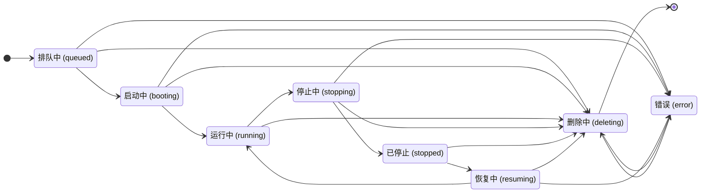

# 状态与生命周期

## 主状态

用户可见状态与存储主状态使用单轴状态图：

状态含义：

| 状态 | 含义 |
| --- | --- |
| `queued` | 请求和 operation 已创建，但尚未被 Manager 通过 `FetchOperation` 成功领取。 |
| `booting` | 首次 create 正在构建环境并执行 `init.sh`。 |
| `running` | Runtime Instance 正在运行，可按条件 open/SSH。 |
| `stopping` | 正在停止 Runtime Instance。 |
| `stopped` | Runtime Instance 已停止，可按条件 resume。 |
| `resuming` | 正在恢复 stopped Runtime Instance。 |
| `deleting` | 正在删除 Runtime Instance 和 Gitea 记录。 |
| `error` | 生命周期失败终态，用户只能 delete。 |

规则：

- `booting` 只能由 create 进入。
- `boot` 是 create 的初始化状态，resume 使用 `resuming`。
- `error` 不回到正常状态。
- `error` 后 delete 会创建新的 delete operation，不视为 retry。
- open、SSH、resume、stop、delete、logs 是否可用，由主状态、repo 状态、用户状态、Manager 在线状态和 Runtime Metadata 共同决定。

## Operation 状态

Operation status 统一为：

| 状态 | 含义 |
| --- | --- |
| `queued` | operation 已创建，但尚未被任何 Manager 通过 `FetchOperation` 成功领取。 |
| `running` | 已被 Manager claim，lease 有效或可续租。 |
| `done` | Manager 上报成功，且 Gitea 已完成 State Finalization。 |
| `failed` | Manager 上报失败或 Gitea 判定超时失败，且 Gitea 已完成 State Finalization。 |

Operation status 限定为 `queued` / `running` / `done` / `failed`。

## State Finalization

Codespace 主状态只能由 Gitea State Finalization 写入。

`UpdateOperation` 只记录 operation 事实并触发 State Finalization。Manager 上报进度和终态，Gitea State Finalization 写入主状态。

State Finalization 在同一事务内执行：

1. 读取 codespace。
2. 校验 `operation_status == running`。
3. 校验当前状态转移合法。
4. 写入 `operation_status = done|failed` 和 `operation_finished_unix`。
5. 更新 codespace 主状态。
6. 更新 token 状态。
7. 写入 `stopped_unix`、`status_message`、`gitea_token_id` 等主状态字段。

`operation_status` 含义：

- `queued`：operation 已创建，尚未被 Manager 通过 `FetchOperation` 领取。
- `running`：Manager 已领取，表示有正在执行的操作。用于 stale detection、operation-bound RPC 匹配和并发保护。
- `done|failed`：operation 已完成，[State Finalization](glossary.md#state-finalization) 后主状态已推进。
- 创建新的 stop、resume 或 delete 时，`operation_type` 和 `operation_status` 在同一行覆写。
- 日志追加到同一 codespace 文件，不按 operation 切分。
- delete done 后物理删除 codespace 和日志。

状态推进：

| Operation 结果 | 状态变化 |
| --- | --- |
| create done | `booting` -> `running` |
| create failed | `queued` / `booting` -> `error` |
| resume done | `resuming` -> `running` |
| resume failed | `resuming` -> `error` |
| stop done | `stopping` -> `stopped` |
| stop failed | `stopping` -> `error` |
| delete done | `deleting` -> physical delete |
| delete failed | `deleting` -> `error` |

超时：

| 超时类型 | 状态变化 |
| --- | --- |
| queue timeout | `queued` -> `error` |
| boot timeout | `booting` -> `error` |
| resume timeout | `resuming` -> `error` |
| stop timeout | `stopping` -> `error` |
| delete timeout | `deleting` -> `error` |

进入 `stopping`、`deleting`、`error` 的同一事务里吊销 active Gitea Token。

## State Reconciliation

`reconcile_codespace_states` 周期运行。

职责：

- 检查中间态。
- 检查 `operation_deadline_unix` 超时。
- 检查 Manager offline timeout。
- 将超时 operation 标记为 failed。
- 通过 [State Finalization](glossary.md#state-finalization) 进入 `error`。
- 吊销失效 Gitea Token。
- 写入 `status_message`。
- 处理 stale Runtime Metadata 与 ReportInstances 分歧。

规则：

- Gitea 是状态权威。Manager 上报的运行时观测数据用于展示和诊断，由 Gitea reconciliation 和 State Finalization 保持主状态一致。
- Gitea 当前为 `error` 而 Manager 报告 runtime 仍存在时，Gitea 记录 [State Divergence](glossary.md#state-divergence) 并返回 [Manager Instruction](glossary.md#manager-instruction) `cleanup_local_runtime`。
- Gitea 已物理删除 codespace 而 Manager 继续上报时，Gitea 返回 `NotFound + cleanup_local_runtime`。
- Manager 声称 runtime 不存在而 Gitea 认为 running 时，Gitea 进入 `error` 并吊销 token。
- Gitea 处于 deleting 时，只接受 delete 结果推进。
