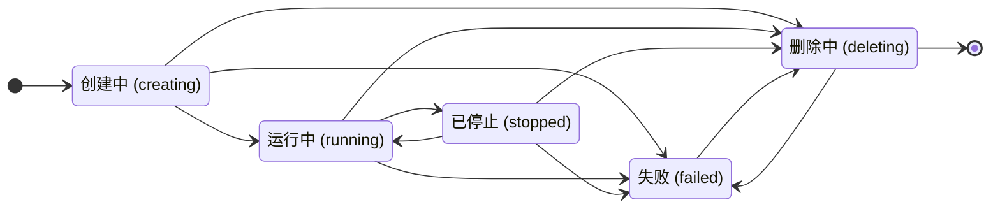

# 状态与生命周期

## 总体模型

Codespace 生命周期由三层数据共同表达：

| 层级 | 数据 | 职责 |
| --- | --- | --- |
| 资源主状态 | `codespace.status` | 表达 codespace 资源当前处于哪个生命周期结果。 |
| 当前 operation | `operation_type / operation_status / operation_rversion / operation_*_unix` | 表达 Gitea 已下发、Manager 正在执行或已经完成的异步动作。 |
| Manager 运行态 | `codespace_manager.runtime_state / last_online_unix / ReportInstances` | 表达维护、重启和运行侧事实。 |

这样拆分的原因是主状态应该回答“这个 codespace 资源现在是什么状态”，operation 应该回答“当前正在做什么动作”，Manager 运行态应该回答“运行侧是否处于维护恢复”。`queued`、`booting`、`stopping`、`resuming`、`metadata_rebuilding` 和 `recovering` 都由这三层数据派生，不作为 codespace 持久主状态。

Gitea 负责：

- 接收用户 create / resume / stop / delete 请求。
- 创建当前 lifecycle operation。
- 通过 `FetchOperation` 下发 operation。
- 根据 Manager 上报结果执行 State Finalization。
- 维护 `codespace.status`、operation 字段、token、日志和数据库事务一致性。

Manager 负责：

- 通过 `FetchOperation` 拉取 Gitea 下发的 operation。
- 执行本地 Runtime 动作。
- 通过 `UpdateOperation` 上报 progress、lease renew、done、failed。
- 通过 `ReportRuntimeMetadata` 上报 Runtime Metadata。
- 通过 `ReportInstances` 上报本地 Runtime inventory。

## 主状态

持久主状态只保存资源生命周期结果：



| 状态 | 含义 | 主要允许动作 |
| --- | --- | --- |
| `creating` | create 已创建，可能等待 Manager 领取，也可能正在创建 Runtime 和执行初始化。 | delete |
| `running` | Runtime 资源预期存在并运行；无 active stop/delete 时可交互。 | open / SSH / stop / delete |
| `stopped` | Runtime 资源预期存在但不运行，可恢复。 | resume / delete |
| `deleting` | delete 已创建，正在等待 Manager 清理或正在清理。 | 无用户动作 |
| `failed` | 生命周期失败，保留日志和记录。 | delete |

`creating` 覆盖旧设计中的 create 排队和 boot 初始化，因为排队还是执行中由 `operation_status` 表达。`running` 和 `stopped` 是资源结果；stop/resume 正在执行时主状态保持当前资源结果，交互能力由 active operation 禁用。这样可以避免把异步动作的临时阶段写成资源主状态。

## Operation

operation 类型：

```text
create
resume
stop
delete
```

operation 状态：

| 状态 | 含义 |
| --- | --- |
| `queued` | operation 已创建，正在等待 Manager 通过 `FetchOperation` 领取。 |
| `running` | operation 已被 Manager 领取，lease 有效。 |
| `done` | Manager 上报成功，Gitea 已完成 State Finalization。 |
| `failed` | Manager 上报失败或 Gitea 判定失败，Gitea 已完成 State Finalization。 |

每次 lifecycle operation 递增 `operation_rversion`：

```text
operation_rversion
operation_type
operation_status
operation_created_unix
operation_started_unix
operation_deadline_unix
operation_finished_unix
```

`operation_rversion` 写入 `FetchOperation` 返回数据，并由 `UpdateOperation`、`UpdateLog`、`RequestGiteaToken` 携带。Gitea 按 `codespace_uuid + operation_rversion + manager_id` 校验上报归属。

这样设计的原因是 Gitea 和 Manager 都可能维护重启，旧上报可能晚到。递增版本把 Manager 上报绑定到当前下发的 operation；delete 抢占 create/resume/stop 时递增版本，旧 operation 后续上报自然成为 stale report。

## 用户动作映射

| 当前主状态 | 用户动作 | 写入结果 |
| --- | --- | --- |
| 无记录 | create | `status=creating, operation_type=create, operation_status=queued, manager_id=0` |
| `running` | stop | `status=running, operation_type=stop, operation_status=queued` |
| `stopped` | resume | `status=stopped, operation_type=resume, operation_status=queued` |
| `creating/running/stopped/failed` | delete | `status=deleting, operation_type=delete, operation_status=queued` |
| `deleting` | 任意用户动作 | 拒绝 |

普通动作要求当前没有 active operation。delete 是终止目标，可以抢占当前 create/resume/stop：Gitea 递增 `operation_rversion`，写入 delete operation，并把主状态改为 `deleting`。旧 Manager 使用旧版本上报时返回 stale，避免旧结果覆盖新的删除目标。

## FetchOperation

`FetchOperation` 是 Manager 获取 Gitea 下发动作的入口。

Request：

```text
capacity_total
capacity_available
accepted_operation_types
```

Response：

```text
operation_rversion
operation_type
codespace_uuid
lease_deadline_unix
create/resume 数据
```

领取优先级：

```text
delete -> stop -> resume -> create
```

领取条件：

| operation | 条件 |
| --- | --- |
| delete | 已绑定当前 Manager，主状态为 `deleting`，`operation_status=queued` |
| stop | 已绑定当前 Manager，主状态为 `running`，`operation_type=stop`，`operation_status=queued` |
| resume | 已绑定当前 Manager，主状态为 `stopped`，`operation_type=resume`，`operation_status=queued`，本次声明接受 resume，容量可用 |
| create | 未绑定 Manager，主状态为 `creating`，`operation_type=create`，`operation_status=queued`，owner scope 匹配，tag 匹配，本次声明接受 create，容量可用 |

领取成功后同事务写入：

```text
operation_status=running
operation_started_unix=now
operation_deadline_unix=now + lease timeout
```

create 领取时额外写入 `manager_id`。delete 和 stop 是资源回收动作，Manager 满载时仍可领取；create/resume 会占用容量，由 Manager 当前容量决定领取时机。

## UpdateOperation 与 State Finalization

`UpdateOperation` 上报当前 operation 的执行情况：

```text
progress
renew lease
final done
final failed
```

Gitea 校验：

```text
codespace_uuid
operation_rversion
manager_id
operation_status=running
```

状态写入：

| operation | done | failed |
| --- | --- | --- |
| create | `status=running, operation_status=done` | `status=failed, operation_status=failed` |
| resume | `status=running, operation_status=done` | `status=failed, operation_status=failed` |
| stop | `status=stopped, operation_status=done, stopped_unix=now` | `status=failed, operation_status=failed` |
| delete | 物理删除 codespace、日志和绑定数据 | `status=failed, operation_status=failed` |

State Finalization 在同一事务内执行：

1. 读取 codespace。
2. 校验 `operation_rversion`、`manager_id` 和 `operation_status`。
3. 校验当前主状态、operation 类型和目标结果匹配。
4. 写入 `operation_status = done|failed` 和 `operation_finished_unix`。
5. 更新 codespace 主状态。
6. 更新 token 状态。
7. 写入 `stopped_unix`、`gitea_token_id` 等状态字段。
8. 封闭当前 operation 日志。

stop 失败进入 `failed` 是因为 Gitea 已经无法确认 Runtime 是否仍处于可交互一致状态；继续允许 open/SSH 会扩大不一致风险。delete 失败进入 `failed`，用户或管理员可以再次 delete，新的 delete operation 会递增 `operation_rversion`。

## Runtime Metadata

`ReportRuntimeMetadata` 上报当前 Runtime 快照：

```text
endpoints
internal_ssh
boot stage
resource_usage
last_reported_unix
```

Runtime Metadata 写入 Gitea 本地 cache，用于页面展示、Endpoint existence check、open 和 SSH 判定。主状态和权限判断仍以数据库字段为准。

写入条件：

- caller Manager 与 `codespace.manager_id` 匹配。
- `status in (creating, running, stopped)`。
- `status=stopped` 时 metadata 只用于展示保留资源信息，不提供 open/SSH。
- `status=deleting/failed` 返回 stale。

Runtime Metadata 是运行时信息，变化频繁，也可以由 Manager 重建，因此放在 cache 中。cache miss 只影响展示和交互入口，不改变主状态。

## 派生展示态

页面和 API 可以从持久主状态、operation 和 Manager 运行态派生展示状态：

| 条件 | 展示态 |
| --- | --- |
| `status=creating && operation_status=queued` | `queued` |
| `status=creating && operation_status=running` | `booting` |
| `status=running && operation_type=stop && operation_status in (queued,running)` | `stopping` |
| `status=stopped && operation_type=resume && operation_status in (queued,running)` | `resuming` |
| `status=deleting` | `deleting` |
| `status=running && Manager offline/recovering` | `running_unavailable` / `recovering` |
| Runtime Metadata cache miss 且 Manager online/recovering | `metadata_rebuilding` |

这些状态用于 UI 和失败分类，不写入 `codespace.status`。这样可以保留用户需要的细粒度反馈，同时让持久状态机保持小而稳定。

## 超时处理

`operation_created_unix + QUEUE_TIMEOUT` 表达 queued operation 等待 Manager 领取的最长时间。`operation_deadline_unix` 表达 running operation 的 lease 截止时间。Manager 通过 `UpdateOperation` progress 或 renew lease 刷新 `operation_deadline_unix`。

queued operation 超时处理：

| operation | 处理 |
| --- | --- |
| create | `status=failed, operation_status=failed` |
| resume | `status=failed, operation_status=failed` |
| stop | `status=failed, operation_status=failed` |
| delete | `status=failed, operation_status=failed` |

active operation 超时处理：

| Manager 状态 | 处理 |
| --- | --- |
| online | `operation_deadline_unix` 到期后按当前 operation failed 处理。 |
| recovering | 暂缓失败，等待 Manager 完整 inventory 或 online。 |
| offline 且未超过 `MANAGER_RESTART_GRACE` | 暂缓失败。 |
| offline 超过 `MANAGER_RESTART_GRACE` | 按当前 operation failed 处理。 |

维护恢复是 Manager 级事件，因此不在每条 codespace 上保存 recovery deadline。完整 `ReportInstances(snapshot_complete=true)` 到达后，Gitea 优先使用 inventory 事实处理差异，不继续等待 timeout。

## State Reconciliation

`reconcile_codespace_states` 周期运行。

职责：

- 检查 active operation 的 `operation_deadline_unix`。
- 检查 Manager online/offline/recovering。
- 处理 stale Runtime Metadata 与 ReportInstances 分歧。
- 通过 State Finalization 写入明确结果。
- 吊销失效 Gitea Token。
- 返回 extra runtime cleanup 指令。

恢复证据：

```text
DeclareManager(recovering/online)
ReportInstances(snapshot_complete=true)
ReportInstances 包含 codespace_uuid
UpdateOperation 携带当前 operation_rversion
ReportRuntimeMetadata 被接受
```

差异分类：

```text
extra_runtime
missing_runtime
manager_mismatch
stale_operation
metadata_missing
snapshot_incomplete
```

维护重启期间，Gitea 给 Manager 时间重新上报完整运行信息；完整 snapshot 到达后，Gitea 按数据库主状态、当前 operation 和 Runtime inventory 处理差异。这样既能处理正常维护抖动，也能在真实差异出现时给出明确结果。
