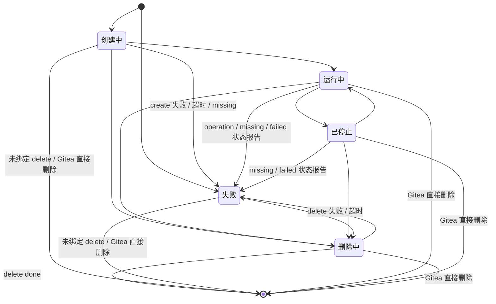
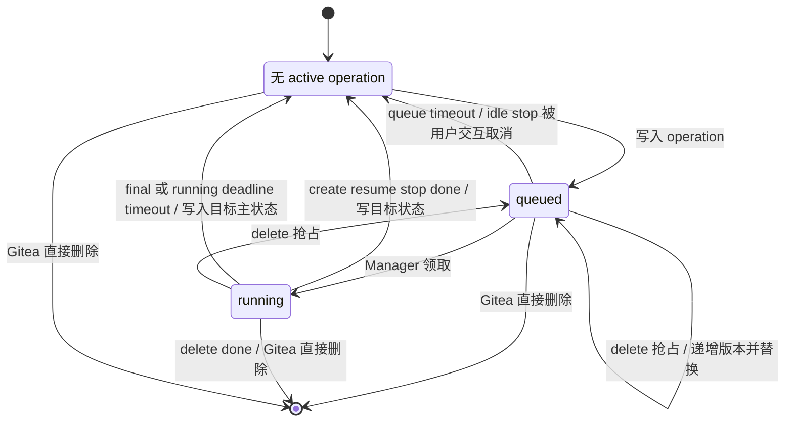
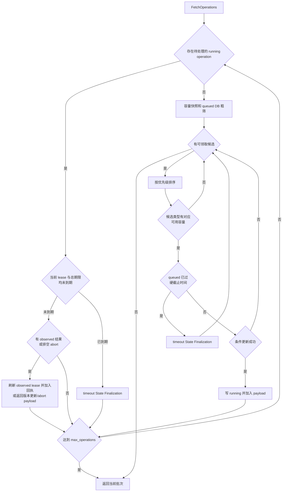
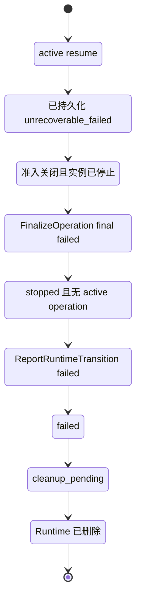
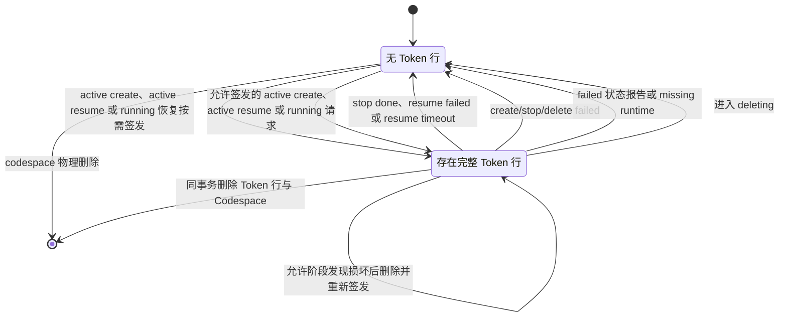
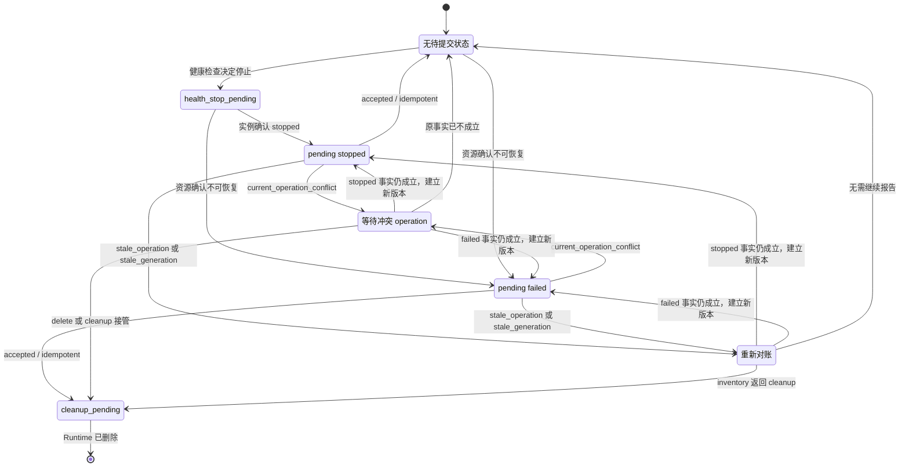
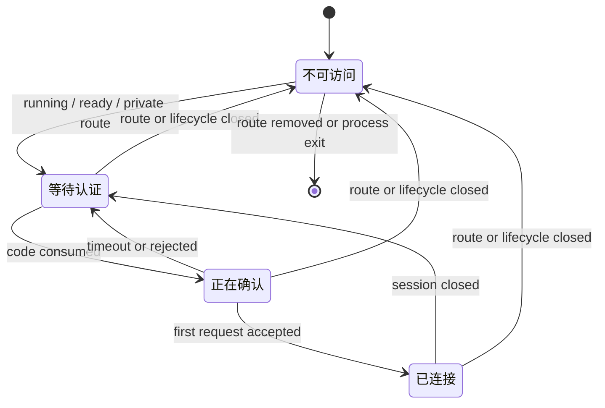
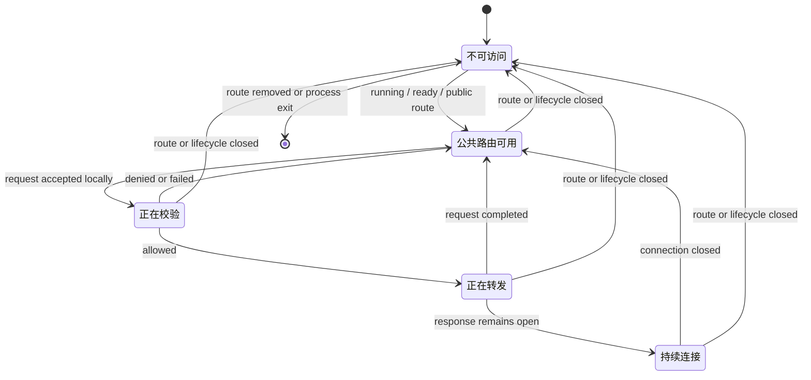
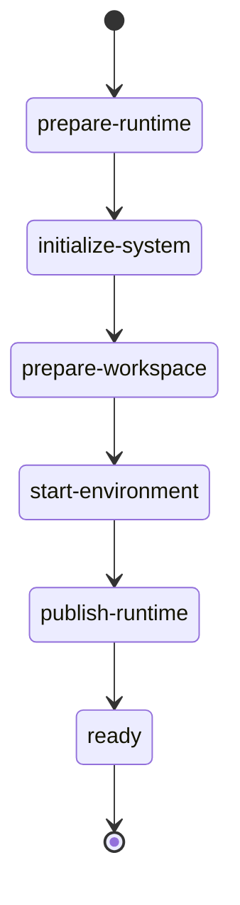

# 状态与生命周期

## 总体模型

Codespace 生命周期由三类数据共同表达：

| 数据 | 权威含义 |
| --- | --- |
| `codespace.status` | Gitea 持久主状态，表达资源生命周期结果。 |
| active operation 字段 | Gitea 当前下发给 Manager 的生命周期指令。 |
| Manager 运行状态报告 | Manager 通过 inventory、metadata 和 transition 上报的 Incus 实例与运行状态。 |

动作以 active operation 为准；Manager 运行状态报告经 Gitea 校验后可以改变主状态。Repository 状态只参与 create 来源校验；create operation 完成、workspace 已初始化后，repository 事件或访问权限变化只影响 Git、LFS 和 repository API，不改变 Codespace 主状态。`queued`、`booting`、`stopping`、`resuming`、`metadata_rebuilding` 和 `recovering` 都由现有字段计算后展示，不写入 `codespace.status`。

Gitea 负责：

- 接收用户 create / resume / stop / delete 请求。
- 写入当前 active operation。
- 通过 `FetchOperations` 批量下发 operation。
- 校验 Manager 上报并执行 State Finalization。
- 根据 Manager 运行状态报告处理 Gitea 与 Runtime 的状态差异。
- 维护 `codespace.status`、active operation、token、日志和数据库事务一致性。

Manager 负责：

- 通过 `FetchOperations` 拉取 Gitea 下发的 operation。
- 执行本地 Runtime 动作。
- 通过 `FetchOperations.observed_operations` 批量续租，通过 `FinalizeOperation` 上报 done/failed；阶段变化通过 Runtime Metadata 和日志表达。
- 通过 `ReportRuntimeMetadata` 上报 Runtime Metadata。
- 通过 `ReportInstances` 上报本地 Runtime inventory。
- 通过 `ReportRuntimeTransition` 上报本地主动 stopped/failed 状态变化。

实现验收点：

- 所有生命周期写入都能明确归属于主状态、active operation 或 Manager 运行状态报告之一。
- Manager 运行状态报告通过 Gitea 的绑定、版本和状态检查后才能改变持久主状态。

## 主状态

持久主状态只保存资源生命周期结果：



| 状态 | 含义 | 主要允许动作 |
| --- | --- | --- |
| `creating` | create 已创建，可能等待 Manager 领取，也可能正在创建 Runtime 和执行初始化。 | delete |
| `running` | Runtime 资源预期存在并运行；无 active operation 或只有 queued idle stop 且 Runtime Metadata `boot.stage=ready` 时可交互。 | open / SSH / continue / 自动暂停设置 / stop / delete |
| `stopped` | Runtime 资源预期存在但不运行，可恢复。 | 自动暂停设置 / resume / delete |
| `deleting` | 普通 Codespace delete operation 已创建，正在等待 Manager 清理该 Runtime 或正在清理；用户、组织、Manager 删除和 force delete 不进入此状态。 | 无用户动作 |
| `failed` | 生命周期失败，保留日志和记录。 | delete |

`creating` 覆盖 create 排队和 boot 初始化，排队与执行中由 active operation 区分。`running` 和 `stopped` 是资源结果；stop/resume 执行时主状态不变。queued idle stop 是用户仍可通过 open、SSH、continue 或设置变化取消的等待阶段；queued user stop 和已经领取的 stop 关闭运行交互。自动暂停设置在 running/stopped 保持可用，因为它保存的是当前及下一次运行使用的对象策略。

表中的动作表示状态机可以接受的动作类型，页面还要按调用者权限裁剪。自动暂停设置、open、SSH、continue 和 resume 只向 Codespace 创建者开放；组织所有者和站点管理员只使用管理列表中的 stop/delete，站点管理员另有不经过普通状态切换的 force delete。这样状态可用性不会被误解为任意管理员都能执行全部动作。

实现验收点：

- 数据库只写入五个主状态，排队、启动、停止中和恢复中不进入 `codespace.status`。
- 每个主状态只开放表中列出的用户动作。
- queued idle stop 保持 running 交互能力，queued user stop 和 running stop 派生 stopping；设置在 running/stopped 的 active operation 期间仍可保存。
- 权限层在状态允许面上继续裁剪动作；非创建者不会因管理权限获得自动暂停、连接或恢复操作。

## Active Operation

operation 类型：

```text
create
resume
stop
delete
```

operation 状态：

| 状态 | 含义 |
| --- | --- |
| `queued` | operation 已创建，正在等待 Manager 通过 `FetchOperations` 领取。 |
| `running` | operation 已被 Manager 领取；当前 lease 与固定总执行期限共同形成的执行授权是否有效，由 `operation_deadline_unix` 判定。 |

active operation 字段只表达当前 Gitea-issued operation：

```text
operation_rversion
operation_type
operation_status
operation_trigger
operation_created_unix
operation_started_unix
operation_deadline_unix
```

operation 完成后不保留 `done` 或 `failed` operation 状态。Gitea 写入最终主状态，并清空 active operation 字段；失败诊断从 codespace 日志读取。

active operation 生命周期：



`operation_trigger=user|idle` 表示当前 operation 来自用户操作还是 Manager 的空闲停止请求。create、resume、用户 stop 和 delete 使用 `user`；只有 `RequestIdleStop` 创建的 stop 使用 `idle`。来源不改变 stop 的执行和 final 语义，但允许 Gitea 在 Manager 领取前把 queued idle stop 与用户主动 stop 区分开：新的有效用户交互可以取消前者，用户按下 stop 则把前者原地改为 `user`。该字段只用于 Gitea 内部的并发判定；Manager 对两类 stop 执行相同动作，因此领取响应不传来源。Fetch 批量续租不改变 `operation_status`，仍停留在 `Running`。final 和 timeout 通过 State Finalization 在同一事务中按 operation 类型写入稳定主状态并清空 active operation，因此图中不引入持久的 done/failed operation 节点。delete 可以替换 queued 或 running operation；抢占时递增 `operation_rversion`、把主状态写为 `deleting`，并写入 queued delete payload，旧版本上报返回 stale。

`operation_rversion` 是 Gitea 当前下发 operation payload 的版本。递增时机：

```text
创建 create/resume/stop/delete operation
delete 抢占当前 operation
Gitea 替换当前 active operation payload
```

不递增：

```text
FetchOperations 领取
FetchOperations observed operation 续租
FinalizeOperation final done/failed
ReportRuntimeMetadata
ReportInstances
ReportRuntimeTransition
```

queued idle stop 被用户交互取消或被用户 stop 接管时不递增 `operation_rversion`。取消保留已使用的版本并清空 active operation；接管保留相同 stop 意图和版本，只把来源更新为 `user`。这样响应丢失的 `RequestIdleStop` 重试不会创建并行 operation，而用户 stop 也不会因已有相同停止意图返回冲突。

`operation_rversion` 写入 `FetchOperations` 返回数据，并由 `FinalizeOperation`、`UpdateLog` 携带。Gitea 按 `codespace_uuid + operation_rversion + manager_id` 校验 operation 上报归属。旧版本上报返回 `stale_operation`，主状态不变。

实现验收点：

- 创建或替换 operation 时递增 `operation_rversion`，领取、Fetch 续租和 final 不递增。
- 同一 codespace 同时最多存在一个 queued 或 running active operation。
- operation 来源始终为 `user` 或 `idle`；用户交互只能取消 queued idle stop，已经领取的 running stop 按原版本完成。
- final 和 timeout 直接写入目标主状态并清空 active operation，数据库中没有 done/failed operation 状态或历史。
- delete done 和任意 Gitea 直接删除从 queued/running/no-operation 直接终止记录，不经过持久的 NoOp 中间状态。

## 用户动作映射

| 当前主状态 | 用户动作 | 写入结果 |
| --- | --- | --- |
| 无记录，来源完整且有匹配 Manager | create | `status=creating, operation_rversion=1, operation_type=create, operation_status=queued, operation_trigger=user, manager_id=0` |
| repository/ref/commit/config 前置校验失败 | 无 | 返回创建错误，不创建 codespace |
| 来源数据完整但无 Manager 匹配 | create | `status=failed, manager_id=0, operation_rversion=0`，operation 字段为空，Gitea 尽力写入失败摘要日志 |
| `running` | open / SSH | 推进 `interaction_generation`；若存在 queued idle stop 则同事务取消，随后签发或返回访问凭据 |
| `running` | 继续运行 | 推进 `interaction_generation`；若存在 queued idle stop 则同事务取消，保持 `status=running` |
| `running` | stop | 无 active operation 时创建 `operation_type=stop, operation_status=queued, operation_trigger=user`；已有 queued idle stop 时原地改为 `operation_trigger=user` |
| `stopped` | resume | 推进 `interaction_generation`，创建 `operation_type=resume, operation_status=queued, operation_trigger=user` |
| `creating/failed` 且 `manager_id=0` | delete | 同步物理删除 Codespace、开发凭据和日志 |
| `creating/running/stopped/failed` 且 `manager_id!=0` | delete | `status=deleting, operation_type=delete, operation_status=queued, operation_trigger=user`，同事务物理删除 Token 与 Git SSH Key |
| 任意未物理删除状态 | 站点管理员 force delete | 同步物理删除 Gitea 记录、开发凭据和日志；Incus 实例和 Manager 本地状态文件不属于该事务结果 |
| 任意未物理删除状态 | 用户、组织或 Manager 本地删除 | 通过有界短事务同步物理删除关联 Gitea 记录、开发凭据和日志；不创建 operation，不联系 Manager |
| `deleting` | 任意用户动作 | 拒绝 |

公共 Endpoint 校验只读取当前状态，不属于用户动作：它不签发 Open Code、不推进 `interaction_generation`、不更新 `last_active_unix`，也不取消 queued idle stop。任何 active stop 存在时公共请求都被拒绝。**设计如此：匿名流量不表示创建者正在使用开发环境。**

除 delete 外，普通生命周期动作要求当前没有 active operation；queued idle stop 的取消和接管是上述规则的明确例外。Open Code 签发、Open Code 成功消费、SSH 成功认证和“继续运行”都在 Codespace lock 内推进 `interaction_generation`，并取消尚未被 Manager 领取的 idle stop；事务先成立的用户交互使后到的 `RequestIdleStop` 因版本不匹配而重置计时，idle stop 先被领取则访问入口返回 stopping，用户在停止完成后使用既有 resume。任一版本无法递增时返回不可重试的 `version_exhausted`，不提交本次用户动作。未绑定 Manager 表示 create 尚未在运行侧建立受 Gitea 管理的资源，delete 在 Codespace lock 内使用短事务直接清理 Gitea 记录。事务先按 UUID、当前 `operation_rversion`、`manager_id=0`、主状态和预读到的全部 operation 字段删除 Codespace 主记录；queued create 匹配 `operation_type=create + operation_status=queued`，没有 active operation 的 failed 记录匹配空 operation 字段。affected rows 为 1 后再删除 Token、Git SSH Key 和日志元数据并一同提交；子项失败会使整笔事务回滚。若条件删除影响 0 行，服务重新读取记录：Fetch 已先完成 claim 时，delete 按已绑定规则创建 delete operation；记录已经由其他删除提交时按 Web 入口约定返回对象不存在；其他版本或 operation 变化按当前状态重新判定。已经绑定 Manager 时，delete 是终止目标，可以抢占当前 create/resume/stop：Gitea 递增 `operation_rversion`，写入 `operation_trigger=user` 的 delete operation，把主状态改为 `deleting`，并在同一事务内物理删除 Token 与 Git SSH Key。旧 Manager 使用旧版本上报时返回 stale，避免旧结果覆盖新的删除目标。站点管理员 force delete 是明确的 Gitea 本地删除入口，可作用于任意未物理删除状态；提交前展示该动作不等待运行侧回收并要求确认。原 Manager 身份仍有效时，之后成功提交的完整 inventory 查询不到该 UUID 并收到 `cleanup_local_runtime`；Manager 身份已删除或永久失联时由部署运维处理。

无匹配 Manager 的 failed 记录没有产生 Gitea-issued operation，所以保留初始版本 0；后续 Manager 注册、Declare 或 tags 变化不自动创建 operation。该记录用于展示固定失败结果和日志，用户删除后重新 create 才会重新执行匹配。这样版本 1 始终表示实际创建过的第一个 operation，不把前置判定伪装成已下发任务。

实现验收点：

- 普通动作在 active operation 存在时返回 conflict；queued idle stop 可以被用户交互取消、被用户 stop 接管，delete 仍可按规则抢占。
- Open Code 签发和消费、SSH 成功认证、继续运行与 resume 都推进交互版本；queued idle stop 与这些动作并发时只能形成“取消后继续运行”或“已领取后完成停止”之一。
- 公共 Endpoint 请求不参与用户交互竞态，queued idle stop 存在时不因匿名请求取消或延后。
- 无匹配 Manager 的 create 直接形成版本 0 failed 记录，后续 Manager 变化不会自动复活；有匹配 Manager 的 create 从版本 1 queued operation 开始。
- 无绑定 delete 同步完成，有绑定 delete 生成 queued operation 并物理删除 Token 与 Git SSH Key。
- 未绑定 delete 与 create claim 并发时，条件写入只产生一种已提交结果：claim 成功后 delete 转为绑定删除，或物理删除成功后 claim 影响 0 行；开发凭据、日志元数据和 Codespace 主记录在同一删除事务中共同提交或共同回滚。
- force delete 可从包括 deleting 在内的任意未物理删除状态同步完成，不读取 Manager 状态或创建 operation。

## FetchOperations

`FetchOperations` 是 Manager 批量获取 Gitea 下发动作的入口。

Request：

```text
capacity_available
cleanup_capacity_available
accepted_operation_types
max_operations
observed_operations:
  - codespace_uuid
    operation_rversion
```

Response：

```text
operations:
  - operation_rversion
    codespace_uuid
    lease_valid_for_milliseconds
    log_offset
    command 分支
```

领取优先级：

```text
delete -> stop -> resume -> create
```

Fetch 在任何租约、超时或领取写入前，先批量校验 `observed_operations`。对于仍存在、绑定当前 Manager 的 Codespace，observed 正数版本高于 Gitea 保存的 `operation_rversion` 表示 Manager 已见过 Gitea 当前数据无法解释的更新历史；整个请求返回 Manager 级 `state_history_conflict`，不刷新租约、不执行 timeout、不领取 queued operation，也不改写 Token、cache 或主状态。UUID 无记录或 binding 不匹配时没有足够历史证明版本倒退，本次 Fetch 不续租该项，后续完整 inventory 按数据库当前关系返回 cleanup；这使正常删除仍走既有资源清理路径，而不会被误判为数据库恢复。

预检通过后，Fetch 先处理当前 Manager 的 running operation，每条在刷新 observed lease 或返回当前 payload 前都先判定 deadline。`operation_deadline_unix` 已被总执行期限封顶，因此 lease 或总期限任一个到期都会进入同一 timeout State Finalization。deadline 未到期时，功能启用或站点排空下的 stop/delete 按以下规则处理：相同版本出现在 `observed_operations` 时只批量刷新 lease，并在 `renewed_leases` 返回 UUID、版本和相对有效时长；observed 版本较低时返回当前 payload 并刷新 lease；未提交该 UUID 表示本地上下文缺失，Gitea 保持 operation 等待原 deadline。deadline 已到期时不返回 payload、续租回执或 abort，该项不计入 `max_operations`。站点排空下的 running create/resume 在 deadline 未到期时返回 `abort_create|abort_resume`；这些 abort 都是不刷新 lease 的一次性清理命令，Manager 清理本轮工作并 final failed，Gitea 将 create 映射到 failed、resume 映射回 stopped。处理完 running operation 后再领取新的 queued operation。所有路径都不改变 `operation_rversion`。

running operation 恢复条件：

- `codespace.manager_id` 等于当前 Manager。
- `operation_status=running`。
- deadline 未到期；已到期的 operation 先 timeout，不进入 response。
- 功能启用时，或站点排空下的 stop/delete，`observed_operations` 包含相同 `codespace_uuid + operation_rversion` 时只刷新 lease 并返回轻量续租回执；包含较低版本时返回当前 payload；未包含该 UUID 时保持等待原 deadline。站点排空下的 create/resume 不使用 observed 抑制 abort。
- 本次 response 已加入的 running operation 也从后续恢复候选中排除。
- 返回普通执行 payload 时按本节统一租约计算刷新 `operation_deadline_unix`，并返回本次实际授予的正数相对有效时长；接近总执行期限时该值短于标准 lease，abort payload 不刷新且相对有效时长为 0。
- running operation 恢复不占 create/resume 容量，但计入 `max_operations`。
- `repo_id=0` 的 running create 在 Manager 已声明相同版本且本地上下文完整时只续租；Manager 缺少上下文时等待原 deadline，超时后进入 failed。Gitea 不从旧 metadata 推断 create 成功。
- 站点排空下的 running create/resume 在 deadline 未到期时返回对应 abort 指令；create 删除本轮新建的 Incus 实例并 final failed，Gitea 写入 failed；resume 停止本轮启动的实例、保留实例根存储并 final failed，Gitea 写回 stopped。

queued operation 领取条件：

| operation | 条件 |
| --- | --- |
| delete | 已绑定当前 Manager，主状态为 `deleting`，`operation_status=queued`，本次清理容量可用 |
| stop | 已绑定当前 Manager，主状态为 `running`，`operation_type=stop`，`operation_status=queued`，本次清理容量可用 |
| resume | 已绑定当前 Manager，主状态为 `stopped`，`operation_type=resume`，`operation_status=queued`，本次声明接受 resume，容量可用，caller Manager 声明 online 且未派生为 offline |
| create | 未绑定 Manager，主状态为 `creating`，`operation_type=create`，`operation_status=queued`，owner scope 匹配，tag 匹配，本次声明接受 create，容量可用，caller Manager 声明 online 且未派生为 offline |

create/resume/delete 和用户 stop 的来源为 `user`，空闲 stop 的来源为 `idle`。两类 stop 使用相同领取规则；Fetch claim 在数据库中保留来源，但响应不返回该内部字段。用户交互和有效设置变化只匹配 `queued + stop + idle` 执行条件清除，Fetch claim 只匹配 queued；双方提交顺序决定取消成功或 stop 已进入不可撤销执行阶段。相同设置提交保持当前 queued idle stop。

领取成功后同事务写入：

```text
operation_status=running
operation_started_unix=now
operation_deadline_unix=min(
  向未来取整到 Unix 秒(grant_time + lease timeout),
  operation_started_unix + operation max duration
)
```

`grant_time` 是领取或续租事务内为本次授权读取一次的 Gitea 当前时间。总执行期限固定为首次领取时的 `operation_started_unix + OPERATION_MAX_DURATION`，续租不修改这两个值。普通情况下响应中的 `lease_valid_for_milliseconds` 精确等于 `OPERATION_LEASE_TIMEOUT`；如果标准 lease 会越过总执行期限，则返回从 `grant_time` 到总期限向下取整的正整数毫秒数，并把数据库 deadline 固定为总期限。剩余时间不足 1 毫秒时直接执行 timeout，不授予零长度普通 lease。Manager 从更早的请求开始时间计算本地截止点，因此本地授权不会晚于 Gitea 侧授权。绝对截止时间不通过协议返回，避免 Manager 把两端墙上时钟用于执行授权。create 领取时额外写入 `manager_id`。领取不递增 `operation_rversion`。

**设计如此：总执行期限限制的是一次 active operation，不限制 Runtime 的整个生命周期。**它只处理 Manager 持续在线并持续续租、但脚本或 Incus 操作始终无法完成的情况；到期结果继续使用现有 running timeout 映射，因此不增加失败类型、重试计数或历史记录。

领取实现沿用 Actions `runs-on` 的“稳定字段筛选、Go 层判断、条件 UPDATE 抢占”形态。Gitea 从认证 Manager 的最新 `tags_json` 解析普通标量列表；Fetch request 不携带 tags，数据库也不执行 JSON 匹配。候选查询按 operation 状态、类型、`repo_tag IN manager.tags` 和 repository 当前 owner scope 做筛选，`accepted_operation_types` 与 capacity 在 Go 层判断。

**设计理由：global Manager 与 owner-scoped Manager 没有调度优先级。** 两者同时满足 owner scope、tag、online 和 capacity 条件时，都可以参与同一 create 的条件 UPDATE，首个更新成功者取得 operation；binding 成立后不会因为另一个 Manager 的 scope 更具体而迁移。global Manager 表达可服务所有 owner 的站点容量，不是 owner-scoped Manager 的延迟后备。保持无优先级竞争可以沿用现有 claim 模型，避免增加等待窗口、容量预留和新的失活判定。

create 最终条件 UPDATE 再次确认 Manager online、`status=creating`、当前 `operation_rversion`、`manager_id=0`、`operation_type=create`、`operation_status=queued`、`operation_trigger=user`、`repo_tag` 属于最新 tags、`repo_id>0` 且 repository 存在；owner Manager 还要求 repository 当前 owner 匹配，global Manager 不限制 owner。repository transfer 自身按 owner、repository lock 顺序提交；Fetch claim 不取得 repository lock，而由条件 UPDATE 定义与 transfer 的数据库顺序：claim 先成功则 binding 固定，transfer 先生效则旧 owner Manager claim 失败。

Fetch 不使用覆盖整批操作的大事务。running lease 刷新和每条 queued claim 分别使用短事务；每条 claim 成功提交后再加载 payload。payload 加入响应前重新读取同一 UUID，并确认当前 `operation_rversion`、`manager_id`、`operation_type`、`operation_trigger` 和 `operation_status=running` 仍与本次 claim 一致；账户清理已经删除记录或其他流程已经替换 operation 时，该候选不返回旧 payload。若加载 create 所需 repository/user 数据或构造 payload 失败，服务使用单独短事务按 `codespace_uuid + operation_rversion + operation_status=running + manager_id` 条件释放尚未下发的 claim：恢复 `operation_status=queued`，清空 started/deadline，保留来源，create 额外恢复 `manager_id=0`。释放条件 affected rows 为 0 表示 operation 已被其他流程替换，不再覆盖当前状态。单条候选失败后继续处理本批其他候选；数据库连接等系统性错误终止本次 RPC 且不返回 response，已经提交的 claim 保持 running 并等待原 deadline。这样每条 claim 仍使用独立短事务，无法确认 payload 已被 Manager 持久化时也不会重新启动动作。

批量返回规则：

- `max_operations` 必须在 `1..256`，`observed_operations` 最多 10000 条且 `codespace_uuid` 不重复；Manager 每次上报全部本地上下文完整的 running operation。
- 单个 Manager 的 Runtime 总数和 Declare 声明的总容量均不超过 10000；完整 inventory 与 observed operation 分别以一个完整请求提交，其最大编码尺寸由 Gitea 启动校验覆盖。
- DB 使用 `operation_created_unix, uuid` keyset 分页；1024 上限在稳定 scope/tag 筛选之后计算，避免其他 scope 或 tag 的旧 operation 长期遮挡可领取候选。
- 总返回数量不超过 `max_operations`。
- `max_operations` 只限制 `operations`；`renewed_leases` 最多等于 observed 数量，不占 payload 名额。
- 本次新领取的 queued create/resume 数量不超过 `capacity_available`；已有上下文的 running operation 和 abort 不占新容量。
- 本次新领取的 queued stop/delete 数量不超过 `cleanup_capacity_available`；已有上下文的 running operation 不占新容量。
- stop/delete 不占 create/resume 容量，create/resume 也不占清理容量；某一类容量为 0 时跳过该类候选并继续处理另一类。
- create/resume 需要 `accepted_operation_types` 包含对应类型。
- stop/delete 在 Runtime 名额或启动槽位满载时仍可使用清理容量领取。
- 站点排空时不领取 queued create/resume；queued stop/delete 按清理容量领取，running stop/delete 继续处理。
- 功能启用时，以及站点排空下的 stop/delete，已上报相同 `observed_operations` 版本时返回相对有效时长的续租回执；observed 版本较低时返回当前 payload；排空中的 create/resume 在 deadline 未到期时下发相对有效时长为 0 的 abort。
- Manager 只对本地执行上下文完整的 operation 声明 observed；缺少 payload 或 boot 结果时省略并等待原 deadline。
- 刚领取 queued operation 时在本次 claim 响应中返回完整 payload；已是 running 的 operation 只有上报较低 observed 版本时才返回当前 payload。
- running operation 在刷新 observed lease 或返回当前 payload 前先检查 deadline；过期项直接 timeout 且不计入 `max_operations`。
- 每个 payload 携带当前 `log_offset`；Manager 从该 offset 继续追加单文件日志。
- 单条候选 payload 构造失败不会丢弃本批已经成功组装或随后可执行的 operation。
- `accepted_operation_types` 只表达本次是否接受 create/resume；stop/delete 是绑定 Manager 负责的资源回收动作，并由清理容量决定本轮领取数量。
- 两个新领取容量都为 0 时仍处理全部 observed operation、续租和 timeout，不领取 queued operation。
- operation 类型优先级相同时，固定按 `operation_created_unix ASC, uuid ASC` 领取。
- Manager 的 Fetch/续租周期不超过 `OPERATION_LEASE_TIMEOUT / 3`。
- observed 正数版本高于同一已绑定 Codespace 的 Gitea 当前版本时，整个 Fetch 在任何业务写入前返回 `state_history_conflict`；无记录或 binding 不匹配由完整 inventory 收敛，不在 Fetch 中推断历史。

`FetchOperations` 领取流程：



实现验收点：

- running operation 的续租或版本更新先于 queued claim，且不会重复下发 Manager 已确认的相同版本。
- observed-only 续租返回匹配 UUID、版本和相对有效时长的轻量回执，不与 payload 或 abort 重复出现。
- 领取、返回当前 payload 和续租使用同一租约计算：Gitea 内部 deadline 不晚于固定总执行期限，协议返回本次实际授予的相对有效时长；只有最后一段授权可以短于标准 lease。
- running operation 在 observed 续租或返回当前 payload 前检查 deadline；只有未到期的项才继续。
- 站点排空后已领取且 deadline 未到期的 create/resume 只下发 abort 命令；deadline 已到期时直接 timeout。
- 功能启用时，以及站点排空下的 stop/delete，已确认的相同版本刷新 lease 并返回续租回执，较低 observed 版本返回当前 payload；未声明 observed 的 running operation 等待原 deadline。
- DB 按稳定 operation、scope 和 repo tag 字段筛选，动态类型/capacity 在 Go 中判断，条件 UPDATE 决定唯一领取者。
- Fetch 不接收 tags；候选与 claim 都使用认证 Manager 最新声明的 tags。
- create claim 重新确认 repository 当前存在和 owner scope，transfer 与 claim 并发不会按旧 owner 错误绑定。
- global 与 owner-scoped Manager 同时匹配时允许任一合格 Manager 领取，但条件更新保证只有一个领取成功；binding 成立后不自动迁移。
- 单次结果遵守 `max_operations`、create/resume 启动容量和 stop/delete 清理容量上限；任一执行池满载不阻塞另一执行池。
- 同优先级 FIFO、候选扫描上限和 request 数量限制得到校验。
- payload 构造失败的 claim 被条件释放；系统错误或响应丢失留下的 running claim 等待原 deadline 并按普通 timeout 收敛。

## FinalizeOperation 与 State Finalization

`FinalizeOperation` 只上报 Gitea-issued active operation 的最终结果：

```text
final done
final failed
```

Gitea 校验：

```text
codespace_uuid
operation_rversion
final.operation_type（final 时）
manager_id
operation_status=running
```

状态写入：

| operation | done | failed |
| --- | --- | --- |
| create | `status=running`，保留当前开发凭据并清空 active operation | `status=failed`，物理删除 Token 与 Git SSH Key 并清空 active operation |
| resume | `status=running, last_active_unix=now`，保留当前 Token 与 Git SSH Key，清空 active operation，`stopped_unix` 不清零 | `status=stopped`，物理删除 Token、保留 Git SSH Key 并清空 active operation |
| stop | `status=stopped, stopped_unix=now`，物理删除 Token、保留 Git SSH Key 并清空 active operation | `status=failed`，物理删除 Token 与 Git SSH Key 并清空 active operation |
| delete | 物理删除 Codespace、Token、Git SSH Key、日志和绑定数据 | `status=failed`，物理删除 Token 与 Git SSH Key 并清空 active operation |

resume worker 在 active operation 内先运行 init 取得凭据身份，再取得新 Token 并写入 Runtime credential；workspace remote 为 SSH 时校验已有私钥与公钥配对，并通过 `EnsureCodespaceGitSSHKey` 确认 Gitea 仍绑定同一公钥，然后上报同版本 `ready` Runtime Metadata。prepare/activate 阶段和 `running` 都可直接使用 Token 与 Git SSH Key；Manager 在 final 前只验证本地凭据配置，不探测 repository 可达性，面向用户的 open 和 Gateway SSH 仍等待 final done。Gitea 接受 final 时把主状态和用户交互能力一起切换为 running，并清空 active operation。Manager 重启后先终止遗留 launcher、停止 active resume 实例并恢复 `lease_paused`；本地 payload、boot 结果和 worker 阶段完整时才把该版本放入 Fetch，收到成功续租和新的相对有效时长后重新启动并继续到 ready。上下文缺失或服务端已超时的 operation 不会重新执行。final 幂等提交后不需要 operation 结束后的凭据刷新任务。

resume failed 表示 Manager 已确认本轮启动进程已停止，因此 operation 事务先回到 `stopped`。Manager 把本次 boot 终态原子保存为 `done`、`recoverable_failed` 或 `unrecoverable_failed`；普通启动、网络、服务端和文件写入失败使用 `recoverable_failed`，final failed 后保持 stopped。实例根存储损坏、Git SSH 密钥材料相互矛盾或 Gitea 已绑定不同公钥等无法安全恢复的结果使用 `unrecoverable_failed`，final failed 被接受后继续通过 `ReportRuntimeTransition(failed)` 进入 failed。这样 final 只回答当前 operation 是否完成，主状态报告继续表达实例是否还可恢复。

不可恢复的 resume 按固定顺序收敛：



final failed 与状态报告之间出现新 resume 时，状态报告返回 `current_operation_conflict`。Manager 领取该新 resume 后读取保留的 `unrecoverable_failed`，不再执行 init，确认实例保持 stopped 后直接提交 final failed，再次上报 failed；delete 则按当前 delete operation 清理。最新 boot 终态保存 `operation_type + operation_rversion + outcome`；`done` 和 `recoverable_failed` 可由下一次合法初始化替换，`unrecoverable_failed` 保留到 failed 状态报告或 delete 完成，因此进程重启不会丢失这一收敛目标。

**设计如此：不可恢复的 resume 会在两个现有事务之间短暂经过 stopped。**`FinalizeOperation(final failed)` 先确认本轮启动已经停止并清空 active operation，随后 `ReportRuntimeTransition(failed)` 表达实例本身不可恢复；持久化的 `unrecoverable_failed` 保证 stopped 不是最终结果。这个顺序复用现有 final 和状态报告的职责，不需要扩展 final 枚举或增加主状态。

State Finalization 在同一事务内执行：

1. 读取 codespace。
2. 校验 `operation_rversion`、`manager_id` 和 `operation_status`。
3. final 时校验请求 `operation_type` 与当前 active operation 类型一致，并校验主状态和目标结果匹配。
4. 更新 codespace 主状态。
5. 按目标主状态分别保留或物理删除 Token 与 Git SSH Key；Git 首选项不参与凭据生命周期判定。
6. 首次 final、timeout、missing、transition 或 queued idle stop 取消时写入 `updated_unix=now`，并按结果写入 `stopped_unix` 等状态字段；即使主状态保持稳定，active operation 首次结束也属于结果变化，相同结果的幂等重试不刷新时间。
7. 清空包括 `operation_trigger` 在内的 active operation 字段。
8. 封闭当前运行中日志追加窗口。

主事务提交后，如果 Codespace 记录仍然存在，final、timeout、missing 和 failed 状态报告会在释放该 Codespace keyed lock 前尽力追加一条内部状态摘要。摘要使用独立的 DBFS 追加事务；写入失败只记录服务端日志，不回滚已经成立的生命周期结果。delete done、force/account/Manager delete 和 retention 清理已经删除日志与记录，因此跳过内部摘要，不再创建日志。这样主状态写入不依赖诊断文本，同时同一 Codespace 的下一次 operation 会在本次摘要写入尝试结束后开始。

active operation 仍存在时，Gitea 严格校验 final 的 operation 类型。active operation 已清空后不再声称能够验证已经删除的原类型，而是按相同 `operation_rversion` 和请求目标主状态判断幂等：create/resume done 对应 running，resume failed 和 stop done 对应 stopped，create/stop/delete failed 对应 failed。当前主状态匹配时返回 `idempotent_done`，不匹配时返回 `stale_operation`。codespace 已物理删除时返回 `resource_absent`。Manager 按 outcome 处理当前上下文：

active operation 仍存在且 final 携带的 `operation_rversion` 与当前值相同，但有效 `operation_type` 与当前类型不同时，Gitea 返回现有 `stale_operation` outcome。这表示 Manager 的本地 worker 上下文已经不能继续；Manager 停止该 worker 的新 Incus 变更和 operation RPC，从 `observed_operations` 省略这份旧上下文并保留 Runtime。`UNSPECIFIED` 或未知枚举仍属于 `invalid_argument`。

| outcome | Manager 行为 |
| --- | --- |
| `final_accepted` | 清除该版本 operation payload 和 worker 阶段；最新 boot 终态结果继续保留用于重启恢复，resume 的 `unrecoverable_failed` 还会继续驱动 failed 状态报告。 |
| `idempotent_done` | 按 `final_accepted` 完成同一版本的本地收尾，不重复执行 Runtime 动作。 |
| `stale_operation` | 停止该 worker 的新 Incus 变更和 operation RPC，从 observed 集合省略其上下文并保留 Runtime；已经替换的更高版本上下文不受影响。 |
| `resource_absent` | 清除该版本 operation 上下文并触发完整 inventory；delete worker 将其视为 Gitea 侧删除已经完成，Incus 实例只按 inventory 明确指令处理。 |

`stale_operation` 不是重新下发 operation 的入口。Gitea 保留当前 active operation 到原 `operation_deadline_unix`，届时按统一 timeout 表处理：create/delete 进入 failed，resume/stop 进入 stopped；之后完整 inventory 对残留 Runtime 执行现有 cleanup、停止或状态报告规则。若 stale 响应产生时 Gitea 已无 active operation，下一次完整 inventory 直接按当前主状态处理差异。该闭环不重放无法确认的旧动作，也不增加新的恢复状态。

UUID 不复用，也不保存 operation 历史或 tombstone，因此 stale 和 resource absent 都只处理当前通信上下文。物理资源清理由下一次成功、当前 generation 的完整 inventory 根据数据库记录是否存在作出明确决定。

可恢复的 resume 失败回到 `stopped`，因为 Manager 已确认本轮启动已停止且 workspace 仍可恢复；不可恢复 boot 终态按前述两步流程继续进入 failed。stop 失败进入 `failed`：Gitea 无法确认 Runtime 可交互一致性，继续允许 open/SSH 会扩大不一致风险。delete 失败进入 `failed`，用户或管理员可以再次 delete，新的 delete operation 会递增 `operation_rversion`。

token 随主状态变化：



`creating -> running` 和 resume done 都保留已经写入的 Token；功能启用且调用条件仍成立时，重复 `RequestGiteaToken` 解密并校验当前行后返回同一明文。排空模式拒绝全部 `RequestGiteaToken`，但不改变图中的持久 Token 状态。

**图示范围：上图表达 `codespace_gitea_token` 行随生命周期变化的持久结果。**稳定 stopped 没有 Token；active resume 可以提前持有一行 Token，并在有效初始化期限内直接访问绑定仓库，resume done 后继续复用。面向用户的 open 与 Gateway SSH 仍只在 running 开放。站点排空以及 `is_active`、`prohibit_login`、`must_change_password`、站点强制 2FA 等登录限制在每次 Git/LFS/API 请求上判定。create abort、resume failed/timeout、stop final 和进入 failed/deleting 时物理删除 Token 行。

| 当前阶段 | `RequestGiteaToken` | 已有 Token 的新请求 | 状态收敛 |
| --- | --- | --- | --- |
| 已领取且租约有效的 create | 返回当前行或创建新行 | 允许 | create done 直接复用到 running；失败或超时删除 |
| 稳定 running | 返回当前行或创建新行 | 允许 | 保持当前行 |
| active stop | 拒绝重新交付明文 | 允许已经存在的 Token | stop final 删除 |
| 稳定 stopped | 拒绝 | 拒绝 | Token 行已删除 |
| 已领取且租约有效的 resume | 返回当前行或创建新行 | 允许 | resume done 复用到 running；失败、超时或 abort 删除 |
| failed / deleting / 已物理删除 | 拒绝 | 拒绝 | Token 行删除 |

**设计如此：Token 的有效期由 Codespace 工作阶段界定。**允许阶段持续使用当前行，时间经过本身不产生轮换；每个新请求仍实时检查工作阶段、唯一 repository binding、创建用户登录限制和 Gitea 原有权限。Token 行被生命周期事务删除后，下一次合法 resume 才重新签发。

`codespace_ssh_key` 属于 Codespace 整体生命周期：create 首次尝试 SSH clone 前生成，create 重试和 SSH remote 的 resume 校验并复用，不记录 operation 版本。有效 create/resume 初始化期与 running 都能使用；稳定 stopped 保留关系但拒绝 Git 命令，failed/deleting 和物理删除清理关系与 `PublicKey`。create 从 SSH 回退到 HTTP(S) 成功时允许保留已经登记的关系，最终只使用 HTTP(S) 且从未尝试 SSH 的 Codespace 不创建该关系。实际 remote 的差异只增加 Manager ready 前的本地凭据配置检查，不增加 Gitea final 分支、主状态或 active operation 类型。**设计如此：已登记公钥是限定到当前 Codespace 和仓库的生命周期凭据，协议回退不为它增加补偿删除流程。**

实现验收点：

- State Finalization 同事务写主状态、Token 与 Git SSH Key 生命周期、时间戳和 active operation 清理；active operation 清空后日志追加窗口随之关闭。
- create/resume final done 要求当前版本 ready metadata 和 Token 行；Manager 在发布 ready 前验证实际 remote 对应的 HTTP helper 或完整 SSH Key 关系。Key 不携带 operation 版本。
- final、timeout、取消和物理删除都清空 `operation_trigger`；该来源只供 Gitea 内部判定 queued idle stop 是否可取消。
- `updated_unix` 仅在创建记录、创建或替换 active operation，以及首次 final/timeout/missing/transition/queued idle stop 取消时更新；未改变 active operation 的交互或设置、claim、续租和幂等结果不刷新该字段。
- Gitea 只为仍保留记录的状态结果在主事务提交后、释放 Codespace lock 前尝试写内部摘要；物理删除路径跳过摘要，摘要失败不回滚生命周期结果。
- final 的 operation 类型与 active operation 不一致时拒绝；active 已清空时按相同版本和请求映射的目标主状态返回确定的幂等结果。
- active operation 存在时，当前版本的 final 携带错误有效 operation 类型返回 `stale_operation`；Manager 停止该 worker 并从 observed 集合省略旧上下文，Gitea 按原 deadline 超时，随后由完整 inventory 收敛 Runtime 差异。active 已清空时直接由 inventory 处理当前差异。非法枚举始终返回 `invalid_argument`。
- active operation 清空后的幂等只证明相同版本已经到达相同目标主状态，不再证明原 operation 类型仍可从数据库恢复。
- Fetch observed 续租刷新 deadline，final 重试返回明确幂等结果；boot stage 只通过 Runtime Metadata 和日志展示。
- Manager 对四种 outcome 执行确定的本地处理；stale 不清除更高版本上下文，resource absent 触发完整 inventory 而不直接删除 Runtime。
- delete final 物理删除后重复 final 返回 `resource_absent`；若 Incus 实例仍存在，下一次成功的完整 inventory 按无数据库记录返回 cleanup。

## Manager Runtime Transition

Manager 可以在没有 Gitea-issued active operation 时主动上报本地 stopped 或不可恢复的 failed 状态。用户启动 stopped Codespace 始终通过 resume operation；Manager 发现 stopped 主状态对应 running Runtime 时按 inventory 指令停止本地进程，保持 Gitea 作为启动意图的唯一来源。

```text
ReportRuntimeTransition:
  codespace_uuid
  runtime_generation
  observed_operation_rversion
  fact: stopped 或 failed
```

Manager 在首次调用前把完全相同的三个报告字段保存为本地 `pending_runtime_transition`；它不进入 Gitea 数据库，也不增加主状态。对象存在就表示等待确定结果，传输失败和进程重启使用相同 generation 重试：



`pending_runtime_transition` 的字段不可原地改写为另一个状态事实。operation conflict 或 stale generation 使原报告版本失效后，Manager 重新确认本地事实，checked increment generation，并以最新 operation 版本原子替换为一个新 pending；原事实已经不成立时清除旧 pending，delete 或 inventory cleanup 接管时则进入既有清理流程。这样本地恢复只保存当前待确认事实，不保存 transition 历史。

接受条件：

| 当前 Gitea 状态 | Manager 状态报告 | Gitea 行为 |
| --- | --- | --- |
| `running` 且无 active operation | `stopped` | 写 `status=stopped`，写 `stopped_unix=now`，物理删除 Token 并保留 Git SSH Key |
| `running/stopped` 且无 active operation | `failed` | 写 `status=failed` 并物理删除 Token 与 Git SSH Key，提交后尽力清除交互 cache；running failure 不写 `stopped_unix` |
| `running/stopped` 且有 active operation | 任意 | 返回 `current_operation_conflict`，主状态不变 |
| `failed` 且相同 generation 的 `failed` 重试 | `failed` | 目标主状态已经成立，幂等成功，不刷新 `updated_unix` 或 failed retention 起点 |
| `creating/deleting/failed` 收到 stopped，或 `creating/deleting` 收到 failed | 任意 | 返回 `stale_operation`，主状态不变 |
| 站点排空且无 active operation | `stopped` | 允许 |
| 站点排空且无 active operation | `failed` | 允许 |

Gitea 按固定顺序检查 Manager 绑定、active operation 冲突、Manager runtime state、`observed_operation_rversion`、`runtime_generation` 以及主状态与报告值的兼容性。`observed_operation_rversion` 记录 Manager 产生该报告时看到的 Gitea operation 版本，使旧报告无法覆盖较新的 operation 结果。`ReportRuntimeTransition` 是 Manager 主动报告，不是 Gitea 下发的指令，因此不递增 `operation_rversion`。

runtime generation 按报告值对应的目标主状态判定：低于当前值返回 `stale_generation` 和当前值；等于当前值且当前主状态已经等于目标时返回幂等成功；等于当前值但目标状态不同时返回 `generation_conflict`；高于当前值时只在状态转换合法时写入新值。`failed/creating/deleting` 等状态收到不兼容的更高 generation 时返回 `stale_operation`。数据库只需保存当前 generation 和主状态，幂等判断无需历史报告类型。

功能开关和 Manager runtime state 共同限定 transition：功能启用且 Manager 声明为 online 或 recovering、heartbeat 仍有效时可以上报 stopped/failed；站点排空时同样接受这两个缩减状态。已派生为 offline 的 Manager 先通过 `DeclareManager(recovering)` 更新声明和 heartbeat，再提交 transition。这样正在恢复的有效身份可以收敛运行状态，heartbeat 过期的身份则先重新声明当前可用性。

stopped 状态报告先在同一数据库事务中提交主状态和 runtime generation，删除 Token 并保留 Git SSH Key；failed 状态报告删除两类开发凭据。随后尽力清除 Runtime Metadata；清理失败记录服务端日志，已提交的生命周期结果保持有效。尚未消费的 Open Code 会在短 TTL 后自然失效，期间每次交换都会因主状态不再是 running 而被拒绝。Manager 发现 stopped 主状态对应 running Runtime 时使用 inventory 的 `stop_local_runtime`，停止 Incus 实例并保留根存储；新的启动统一由 Gitea-issued resume operation 建立。

failed 状态报告用于 Manager 已确认的单个 Codespace 不可恢复，例如 Incus 实例根存储损坏、Incus 明确报告该实例无法再运行，或 Runtime Git SSH 私钥、公钥和 Gitea 公钥绑定已经相互矛盾。Manager 暂时离线使用 recovering，Runtime Metadata 丢失返回 metadata_rebuilding，Gateway/SSH/Endpoint 临时错误在本地重试；实例物理缺失由完整 inventory 的 missing 规则处理；active operation 的动作失败先使用 `FinalizeOperation(final failed)`，不可恢复的 resume 再按前述 boot 终态提交 failed 状态报告。failed 状态报告只携带状态和版本，Gitea 追加固定状态摘要，详细原因保留在 Manager 本地日志。

Manager 在提交 failed 状态报告前关闭该 Codespace 的 session，停止该对象尚未完成的 metadata 上报和生命周期 worker，并原子持久化完整 pending。Gitea 返回首次接受或目标主状态已经成立的幂等成功后，Manager 在同一次本地提交中把 pending 替换为 `cleanup_pending`，再按完整 cleanup 流程删除 Incus 实例、凭据和本地快照；stopped 成功只清除 pending 并保留实例根存储。清理失败或进程重启时由 pending 快照继续，尚存实例在后续 inventory 中上报 `runtime_state=failed`。Gitea 记录仍为 failed 或已经被其他流程物理删除时，成功的当前 generation inventory 都返回 `cleanup_local_runtime`。普通 `resource_absent` 只触发该完整 inventory，不直接授权无记录资源删除。

Manager 按错误分类处理 `ReportRuntimeTransition`：传输失败原样保留 pending；`current_operation_conflict` 保留它并 Fetch 当前 operation，operation 完成后按仍成立的事实建立新版本 pending；`stale_operation` 清除旧 pending 并重新上报 inventory；`stale_generation` 使用服务端当前值为基线，重新读取 Incus 状态后建立更高版本 pending；`generation_conflict` 关闭该 Codespace 的发布和交互，持久化最小清理记录并删除该 UUID 的归属实例；`manager_offline` 保留 pending 并先 Declare recovering；`codespace_not_found` 保留 Runtime 并触发完整 inventory；`manager_unregistered` 或明确认证失败关闭全部入口、强制停止 Incus 实例并停止 RPC，同时保留实例根存储等待同一身份凭据恢复。所有分支保留已经使用的最高 generation。

主动 transition 表达 Manager 本地策略或恢复结果，不是用户动作，因此不更新 `last_active_unix`。用户 resume final、成功签发或消费 Open Code、成功 SSH 认证和继续运行尽力写入该字段；时间戳失败不撤销已成立的访问。自动暂停不使用该时间戳，交互竞态由 `interaction_generation` 判定。

实现验收点：

- active operation 存在时主动 transition 不改主状态。
- runtime generation 乱序、重复和新版本分别得到 stale、幂等和接受结果。
- stopped/failed 首次上报前保存三个必填字段的 pending；响应丢失或重启使用相同字段重试，不能重新分配 generation 冒充原请求。
- 相同 runtime generation 只按状态报告的目标主状态判断处理；目标不同返回不可重试的 generation conflict，不需要历史状态报告字段。
- 旧 `observed_operation_rversion` 对应的状态报告不能覆盖较新 operation 已写入的主状态。
- 站点排空时可以上报缩减能力的 stopped/failed 状态。
- 功能启用且 Manager online/recovering 时可上报 stopped/failed；offline Manager 必须先 Declare recovering。
- stopped 主状态对应 running Runtime 时只执行 inventory 下发的本地停止，不通过状态报告启动。
- stopped/failed 在数据库提交后即成功，cache 清理失败不恢复交互权限，幂等重试可再次尝试清理。
- failed 状态报告从 running/stopped 写入现有 failed 主状态，立即物理删除 Token 与 Git SSH Key，幂等重试不延后 retention。
- failed 状态报告成功后 Manager 先持久化本地 cleanup，再删除归属 Incus 实例和本地快照；失败或重启后由 pending 快照续做，尚存实例仍可通过 failed inventory 取得同一 cleanup action。
- operation conflict、stale operation 和 stale generation 分别进入等待 operation、inventory 和重新确认事实分支；旧 pending 不会覆盖较新 operation 结果。
- 多个条件同时失败时按固定校验顺序返回稳定分类；cache 与数据库之间允许安全的可重试中间结果，不允许产生越权交互。
- transition 的 operation conflict、stale operation、generation stale/conflict、站点排空、Manager offline 和 Codespace/Manager 记录缺失都有确定的 Manager 本地处理行为。

## Runtime Metadata

`ReportRuntimeMetadata` 上报当前 Runtime 快照：

```text
endpoints
internal_ssh
boot
metadata_generation
```

普通 Endpoint 的 `public` 与存在性一同来自当前 metadata。认证打开流程只接受 false，公共校验只接受 true；`workspace` 固定 false。该访问方式不改变主状态。

### Endpoint 访问状态

Endpoint 访问状态只存在于 Manager/Gateway 内存，使用当前主状态、ready metadata、不可变路由引用和 session/连接索引推导，不写入 Gitea 数据库或 Runtime Metadata。需要认证的入口按以下状态收敛：



公共入口的 `validating`、`forwarding` 和 `streaming` 是单次请求或连接状态，不形成 session：



`private -> public` 先关闭 `connecting/live`、使认证 allowed 失效，再开放公共 ready；`public -> private` 先取消 `validating/forwarding/streaming`、使公共 allowed 失效，再进入等待认证。upstream、端口、协议和 workspace 实际目标变化同样先关闭旧连接，再替换路由。Host、Origin、Service Worker 或 code 格式在入口校验失败时直接结束请求，不进入以上状态，也不推进 `interaction_generation`。**设计如此：访问方式和跨域判定属于当前连接的本地生命周期，不增加 Gitea 主状态、operation 或历史记录。**

Runtime Metadata 写入 Gitea cache，用于页面展示以及 open/SSH 的 ready、普通 Endpoint existence 和 internal SSH 判定。`workspace` 的 Runtime Endpoint 是否存在只决定 Manager 连接该 upstream 还是 Manager 内置 Web SSH，不改变主状态；主状态和权限判断仍以数据库字段为准。resume 只读取数据库主状态、active operation 和 Manager 可用性，不依赖该 cache，因为它的职责正是恢复 stopped workspace。

`boot.stage` 使用以下适用顺序，`boot.operation_rversion` 标识产生快照的 Manager 启动上下文：



Manager 本地执行阶段固定为 `lease_paused -> prepare_runtime -> run_init -> write_credentials -> run_prepare -> run_activate -> validate_runtime -> publish_ready -> finalize -> completed`，只保存在 Manager 当前快照。它们与六个 boot stage 的对应关系如下：

| Manager 本地阶段 | 对外 boot stage |
| --- | --- |
| `lease_paused` | 保持暂停前最后一个已持久化的 boot stage；尚未发布时保持 `prepare-runtime` |
| `prepare_runtime` | `prepare-runtime` |
| `run_init`、`write_credentials` | `initialize-system` |
| `run_prepare` | `prepare-workspace` |
| `run_activate` | `start-environment` |
| `validate_runtime` | `publish-runtime` |
| 已持久化 ready 快照、正在等待 Gitea 回执的 `publish_ready`，以及后续 `finalize`、`completed` | `ready` |

init、prepare 和 activate 各自提交严格结果及本阶段 `CODESPACE_ENV` 变更；Manager 只验证凭据身份、workspace 和 internal SSH 等通用输出，脚本内部子步骤只写日志。进入 `write_credentials` 前先关闭 Runtime HTTP API 和用户入口；两个 Token 文件原子替换完成后，Runtime Token verifier 与 `run_prepare` 在同一 Manager 快照提交。崩溃后本地仍为 `write_credentials`，或者后续阶段发现文件与 verifier 不一致时，同一 active create/resume 持久化回到该阶段并重做凭据、prepare、activate 和校验。`publish_ready` 先持久化 `boot.stage=ready` 的完整快照再发送；响应丢失时保留该快照并幂等重报。进入 `lease_paused` 会停止实例；同版本续租后仍可保留单调的 ready boot stage，但 Manager 必须重新完成 prepare、activate 和连通校验，确认本次启动可用后才重报 ready 并推进到 `finalize`。**设计如此：Manager 本地阶段用于崩溃恢复并允许凭据重放，boot stage 用于 Gitea 校验当前启动进度且保持单调；两者职责不同，因此不是一一对应关系。脚本内部实现不增加本地阶段或 Gitea stage。**

create 和 resume 的 final done 都要求 boot 版本等于当前 operation 且 metadata 已为 `ready`。resume 启动 Runtime 后，在 active operation 内先运行 init，申请并写入新 Token，再运行 prepare 和 activate，刷新实际 remote 的本地凭据配置并上报本次 resume 版本的 `ready`；旧版本的 `ready` 不能完成当前 resume。凭据或 ready 上报临时失败时，Manager 在 operation lease 内退避重试；确认无法写入 credential 时停止本轮启动的 Runtime，create 提交 final failed 并进入 failed，resume 提交 final failed 并保持可恢复的 stopped。普通 Endpoint、用户服务和 repository 可达性不参与 ready 判定。这样 `running` 始终表示本次启动所需的本地凭据配置和交互入口已经就绪，open/SSH 不存在等待另一个启动阶段的中间状态。

Gitea 按主状态和 active operation 校验 boot 上下文：

| Gitea 当前状态 | 可接受的 boot 快照 |
| --- | --- |
| active create | `boot.operation_rversion` 等于当前 operation；stage 按 create 顺序前进，最终到 `ready` |
| active resume | `boot.operation_rversion` 等于当前 operation；stage 按适用步骤前进，最终到 `ready` |
| `running` | stage 固定为 `ready`，boot 版本不大于当前 `operation_rversion` |
| `stopped` 且无 active operation | 不接受 Runtime Metadata；等待下一次 resume 重建当前快照 |

同一 `boot.operation_rversion` 的 stage 只能按规定顺序前进；一旦接受 `ready`，后续同版本快照继续保持 `ready`。resume final failed、timeout 或 abort 会在主状态事务提交后尽力清除当前 Runtime Metadata，Manager 清除本轮 boot 发布上下文，不恢复或发布历史 `ready`。此后迟到的当前 resume 版本快照因已经没有 active resume 而返回 `stale_operation`；清理失败时数据库中的 `stopped` 主状态仍会阻止交互。`recoverable_failed`、timeout 和 abort 允许下次 resume 使用更高 operation 版本重建完整快照；`unrecoverable_failed` 按前述流程继续进入 failed。

稳定 running 的 Gitea Token 文件缺失时，Manager 关闭新准入，通过 `RequestGiteaToken` 取得当前行的同一明文并原子写回，校验本地 helper 后继续沿用当前 `ready`。Runtime Token 文件缺失或 verifier 不匹配时不在 running 内跨存储修复：Manager 关闭会话并停止 Runtime，再通过 `ReportRuntimeTransition(stopped)` 收敛主状态并保留实例根存储，下一次 resume 在 active operation 内生成新值。根存储已损坏时改为报告 failed。**设计如此：active create/resume 使用可重放的 `write_credentials`，稳定 running 使用 stopped 边界恢复 Runtime Token，两种场景都有唯一结果且不增加新的 Gitea 主状态。**

写入条件：

- caller Manager 与 `codespace.manager_id` 匹配。
- `metadata_generation` 高于 cache 当前版本时覆盖；相同版本且规范化内容相同时只刷新 TTL，相同版本但内容不同时返回不可重试的 generation conflict，更低版本返回 stale 和 cache 当前 generation。cache miss 时接受 Manager 用正 generation 重建快照。Manager 对 stale 使用服务端当前值加一并重新读取当前完整快照；同代冲突或本地版本无法递增时执行单 Codespace 持久状态损坏清理。
- `status in (creating, running, stopped)`，并满足上表中的 boot 上下文。
- `status=stopped` 时只接受 active resume 的当前启动进度；没有 active operation 时不接受或周期发布 metadata。stopped 状态始终不提供 open/SSH。
- `status=deleting/failed` 返回 stale。

Runtime Metadata 变化频繁且可重建，放在 cache 中。cache miss 只影响展示和交互入口，不改变主状态。

Gitea 在接受请求时写入 `last_reported_unix=now`，该时间不属于 Manager 快照内容，也不参与 generation 内容比较。Manager 对 active create、active resume 和 running Codespace 使用最近一次成功 Declare 返回的 metadata 刷新周期；稳定 stopped 等待下一次 resume 再启动发布。

每个 Codespace 的 metadata 由 Manager 的单一发布任务串行发送，同一时刻最多存在一个请求。boot、Endpoint、internal SSH 和恢复流程先更新同一份本地当前快照，再唤醒发布任务；多次唤醒可以合并。发布任务收到成功响应时，先按该请求实际携带的 boot 判断 ready：只要其中包含当前 create/resume operation 的 `ready`，就记录本次启动的 ready 已被 Gitea 接受并唤醒 operation worker。随后再比较该请求 generation 与本地当前 generation；本地已经产生更高 Endpoint generation 时，任务继续发送最新完整快照，但已经成立的 ready 回执保持有效。这样 final 只等待启动所需内容确实进入 Gitea，不会因为之后独立发生的 Endpoint 变化被反复延后。

实现验收点：

- metadata cache 接受当前 Manager 的新版本快照和相同版本、相同内容的 TTL 刷新。
- cache miss 不触发主状态变更，交互入口返回 metadata rebuilding 分类。
- stopped resume 在 metadata cache miss 时仍可创建 operation；open/SSH 必须等待 ready，普通 Endpoint 还要求目标存在，SSH 还要求 internal SSH 完整。
- 普通 Endpoint 按当前 metadata 的 `public` 值只进入一种访问路径；公共访问同样等待 ready，workspace 始终使用认证路径。
- private/public 切换先关闭旧 session、请求和长连接并失效对应 allowed，再开放新访问路径；路由或生命周期关闭时所有瞬时访问状态回到 unavailable。
- Host、Origin、Service Worker 和 Open Code 入口拒绝不创建 session、公共连接或交互版本；公共 validating/forwarding/streaming 不写持久状态。
- resume final done 只在当前 operation 版本的 metadata 已为 `ready` 且 Token 行完整时接受；Manager 在 ready 前按 workspace 实际 remote 验证本地 HTTP helper 或 SSH 公钥关系，不探测 repository 可达性。final 成功后无需恢复独立的凭据刷新任务。
- 同一 boot 版本的阶段只能前进，`ready` 不能回退；`running` 状态下所有已接受快照都保持 `ready`。
- resume failed、timeout 或 abort 后，迟到的同版本快照返回 stale；cache 清理失败也不能使 stopped Codespace 获得交互权限。
- resume failed、timeout 或 abort 后不恢复历史 ready；下一次 resume 从保留的 Incus 实例重建 credential、Endpoint、internal SSH 和 ready。
- 稳定 running 的凭据修复保持 boot ready；修复失败时先停止 Runtime，再按 workspace 是否可恢复上报 stopped 或 failed。
- 本地 metadata generation 丢失时，Manager 可根据 stale detail 恢复版本基线后重报当前完整快照。
- 同代不同 metadata 返回不可重试的 `generation_conflict`；版本无法递增返回 `version_exhausted`，两者都不写入新快照或继续自动升代，Manager 随后按 Incus 归属字段清理该 Codespace。
- metadata 发布任务串行发送当前完整快照；任一成功请求包含当前 operation 的 ready 时即可满足 final 的 metadata 前置条件，之后产生的更高 Endpoint generation 继续异步收敛。
- Manager 本地阶段按固定映射生成六个 boot stage；暂停保持最后已持久化的 stage，只有 Gitea 接受当前版本 ready 快照后才把本地阶段推进到 `finalize`。
- `lease_paused` 后的同版本恢复复用持久初始化结果，但重新执行本次实例启动所需的环境准备、activate 和校验；已达到 ready 的 boot stage 保持单调，旧 ready 回执不能跳过重新校验。

## 派生展示态

服务端从持久主状态、active operation 和 Manager 运行态派生展示状态：

| 条件 | 展示态 |
| --- | --- |
| `status=creating && operation_status=queued` | `queued` |
| `status=creating && operation_status=running` | `booting` |
| `status=running && operation_type=stop && operation_status=queued && operation_trigger=idle` | `running`，根据 active operation 字段开放 continue 和可取消交互 |
| `status=running && operation_type=stop && operation_status=queued && operation_trigger=user` | `stopping` |
| `status=running && operation_type=stop && operation_status=running` | `stopping` |
| `status=stopped && operation_type=resume && operation_status in (queued,running)` | `resuming` |
| `status=deleting` | `deleting` |
| `status=running && Manager offline/recovering` | `recovering` |
| Runtime Metadata cache miss 且 Manager online/recovering | `metadata_rebuilding` |

同一记录满足多个条件时，展示优先级固定为：`deleting > failed > stopping/resuming/booting/queued > recovering > metadata_rebuilding > running/stopped`。queued idle operation 不覆盖 running 展示态，只决定 continue 和可取消交互能力；Fetch 把 operation 改为 running 后立即按 stopping 优先级展示。`running` 只由 ready 的 create/resume final 建立，因此不再派生另一种“运行但未就绪”展示态。这些状态用于 UI 和失败分类，不写入 `codespace.status`。

实现验收点：

- 完整详情页、状态片段、创建者列表和治理列表对同一数据库记录派生出相同展示态。
- 多个条件同时满足时严格使用固定优先级。
- queued idle stop 显示 running 并开放取消能力；相同版本被 Fetch 领取后显示 stopping 并关闭 open、SSH 和 continue。

## 状态差异处理

| 不同步场景 | Gitea 行为 |
| --- | --- |
| Manager 上报旧 `operation_rversion` | 返回 `stale_operation`，主状态不变 |
| Manager 有 Runtime，且正常向前运行的 Gitea 数据库成功确认无 codespace | 返回 `cleanup_local_runtime`；记录不存在表达 Gitea 不再管理该 UUID |
| Manager 有 Runtime，但 `codespace.manager_id != caller` | 返回 `cleanup_local_runtime` action |
| Manager 有 Runtime，Gitea 为未绑定 `creating` | 保留该 Runtime，不返回 cleanup；等待当前 create 被领取或超时 |
| Manager 上报 `runtime_state=creating` | 只证明具有稳定 identity 的资源存在，不驱动 running/stopped 主状态变化 |
| 已绑定 Manager 上报 `runtime_state=failed` | 只表示资源仍有 identity 但已确认不可恢复；本地正版本低于当前 active operation 时先 refetch 并 final failed，版本相同时直接使用已有上下文 final failed，版本为 0 时等待原 deadline；无 active operation 且 Gitea 为 running/stopped 时返回 `report_runtime_transition(current_operation_rversion)`；未绑定 creating 仍不返回指令 |
| inventory 上报正数 observed operation version，且低于 Gitea 当前 active operation 版本 | 返回 `refetch_operation(current_operation_rversion)`，本轮不使用该实例状态改写主状态 |
| inventory 上报 `observed_operation_rversion=0`，且 Gitea 有 active operation | 不返回 action，不刷新 lease；当前 operation 按原 deadline 超时 |
| inventory 正数 observed operation version 高于 Gitea 当前 operation 版本 | 整次请求返回不可重试的 Manager 级 `state_history_conflict`；不改写主状态、operation、开发凭据或 cache，不返回差异指令 |
| Manager 保留非零旧 operation 上下文但 Gitea 当前无 active operation | 返回 `clear_operation_context(current_operation_rversion)`；Manager 只在本地版本不高于该值时清除旧 worker，不删除 Runtime |
| Gitea running、Runtime stopped 且无 active operation | 返回 `report_runtime_transition(current_operation_rversion)`，由 Manager 上报 stopped 状态报告 |
| Gitea stopped、Runtime running 且无 active operation | 返回 `stop_local_runtime(current_operation_rversion)`；Manager 仅在本地 operation 版本不高于该值时停止 Incus 实例和交互入口并保留根存储，Gitea 主状态保持 stopped |
| 完整健康轮次结束，稳定 running 的基础交互健康检查已连续 3 次失败，且本轮未达到共享故障暂停条件 | Manager 先持久化 `health_stop_pending`、关闭交互并停止实例；确认 stopped 后原子建立 `pending_runtime_transition`，再通过既有 `ReportRuntimeTransition(stopped)` 写为 stopped，保留根存储供普通 resume 恢复 |
| Manager 健康检查共享前置失败，或完整轮次确认同一阶段至少 3 个 UUID 失败且失败数超过本轮有效对象的一半 | Manager 暂停健康驱动的停止并把 create/resume 可用容量降为 0；Gitea 主状态、active operation 和开发凭据保持当前结果，用户 operation 与 inventory 继续按原规则处理 |
| Gitea 期望 Runtime 存在，完整 inventory 缺失 Runtime | active create deadline 未到期时保持 `creating`；其他 `creating/running/stopped` 进入 `failed` |
| Gitea `deleting`，完整 inventory 缺失 Runtime | 视为 delete 完成，物理删除 |
| queued operation 超时未领取 | create/delete 写 `failed`；resume 保持 `stopped`；stop 保持 `running`；全部清空 active operation |
| running operation lease 超时，Manager 为 online/recovering/offline 任一状态 | create/delete 写 `failed`；resume/stop 写 `stopped`；全部清空 active operation |
| Manager 主动报 stopped，但 Gitea 有 active operation | 返回 `current_operation_conflict`，以 active operation 为准 |
| Manager 确认无 active operation 的 running/stopped Codespace 不可恢复 | 接受 failed 状态报告，写 `status=failed` 并物理删除 Token 与 Git SSH Key；提交后尽力清除交互 cache |
| Runtime Metadata 丢失 | 主状态不变，open/SSH 返回 `metadata_rebuilding` |
| 功能启用，已领取 create 的 `creating`、已领取 resume 的 `stopped` 或无 active operation 的 `running` Token 行缺失，且创建用户仍存在 | 允许绑定 Manager 通过 `RequestGiteaToken` 获取新 Token |
| 功能启用，active create 即将尝试 SSH，或 active resume 的实际 remote 为 SSH，但缺少 Git SSH Key 关系 | start/resume prepare 通过 Runtime helper 提交已落盘公钥，Manager 调用 `EnsureCodespaceGitSSHKey`；关系缺失时补建，相同公钥幂等确认，不同公钥返回 `key_conflict` 并保存不可恢复 boot 终态 |
| 功能排空期间 Manager 请求 Gitea Token | 拒绝请求；稳定工作状态中的现有 Token 行保持不变 |
| 功能排空期间 Manager 登记 Git SSH Key | 拒绝请求；已有公钥绑定保持不变并由访问守卫拒绝使用 |
| owner 分阶段清理发现 Codespace 开发凭据 | 在任何 owner repository 删除前，随当前 Codespace 短事务物理删除 Token、Git SSH Key 关系及其 `PublicKey` |
| 完整 inventory generation 高于最近接受版本 | 接受为新的完整快照，按当前数据库状态返回每个上报 UUID 的结果，并用该快照执行 missing 判定 |
| 完整 inventory generation 等于或低于最近接受版本 | 返回 stale 和当前 generation，不参与差异写入或 missing 判定 |

实现验收点：

- 每种状态差异都有唯一主状态结果或 Manager action。
- stale 上报和旧 generation 不会改写当前主状态。
- inventory generation 接受任意更高值，因此 Manager 在一次完整扫描或传输失败后可以直接使用新版本重新扫描；等于或更低版本只返回 stale。正数 observed operation 高于 Gitea 当前版本仍返回 Manager 级 `state_history_conflict`，不执行自动状态修复或清理。
- 数据库明确无记录、binding 不匹配和 failed 返回 cleanup；数据库/RPC 错误、旧 generation 和不完整 inventory 不触发本地删除。
- Manager 接受 cleanup 后先持久化本地清理，再删除归属 Incus 实例和本地快照；进程崩溃后由 pending 快照续做。
- 未绑定 creating 不产生可能与后续 claim 竞争的 cleanup 指令。
- operation 超时按类型回到明确稳定状态，resume/stop 的调度或通信超时不会把既有 workspace 变成破坏性清理目标。
- stopped 主状态不会因 running inventory 自动恢复；只有 Gitea 下发的 resume operation 在 Token、实际 remote 所需 Git 凭据和 ready metadata 完成后，才能通过 final done 进入 running。
- 健康检查只通过既有 stopped/failed transition 收敛：每轮固定开始时符合条件的 UUID 集合，全部仍符合条件的对象取得首次结果后统一判断共享故障；未达到共享条件时，连续基础交互失败的对象停止并保留实例，共享依赖故障和单次失败不批量改写主状态，资源明确不可恢复时才进入 failed。
- Manager 以请求发出时该 UUID 已持久化的最高 operation 版本校验 payload、续租回执和带版本 action：响应版本低于请求发出时的版本才产生 `operation_version_regression`；请求发出后本地已接受更高版本时，处于两者之间的延迟响应只丢弃本项。真正的版本倒退使整个 Manager 关闭准入、领取和新的 Incus 修改并保留资源。

## 超时处理

`operation_created_unix + QUEUE_TIMEOUT` 是 queued operation 等待 Manager 领取的硬截止时间。Fetch 读到过期候选时，在 Codespace lock 内按 `codespace_uuid + operation_rversion + operation_status=queued` 条件写入超时结果，然后继续处理本批其他候选；该项不计入 `max_operations`。Cron 处理未被 Fetch 扫到的过期记录。running operation 的总执行期限固定为 `operation_started_unix + OPERATION_MAX_DURATION`；`operation_deadline_unix` 保存当前 lease 与该总期限中的较早值，Manager 只通过 Fetch observed 批量续租，但续租不能越过总期限。

timeout 根据 operation 是否已经执行及可确认的资源结果写入下表主状态，并清空 active operation。当前 lease 到期和总执行期限到期使用同一列结果：

| operation | queued 超时 | running deadline 超时 |
| --- | --- | --- |
| create | `status=failed`，删除可能残留的 Token 与 Git SSH Key，清空 operation | `status=failed`，删除 Token 与 Git SSH Key，清空 operation |
| resume | 保持 `status=stopped`，删除可能残留的 Token、保留 Git SSH Key，清空 operation | 写 `status=stopped`，删除 Token、保留 Git SSH Key，清空 operation |
| stop | 保持 `status=running` 和当前开发凭据，清空 operation | 写 `status=stopped`、`stopped_unix=now`，删除 Token、保留 Git SSH Key，清空 operation |
| delete | `status=failed`，保持开发凭据不存在，清空 operation | `status=failed`，保持开发凭据不存在，清空 operation |

queued 表示 Manager 尚未开始动作，因此 resume/stop 恢复 operation 创建前的稳定状态。running resume 超时以保留已初始化 workspace 的 `stopped` 处理；running stop 超时以停止目标处理并关闭交互，Manager 恢复后若仍上报 running，现有 `stop_local_runtime` 继续完成本地停止。create 没有可依赖的既有 workspace，delete 本身是破坏性目标，所以二者超时进入 `failed`。该区分避免调度拥堵或 Manager 失联把可恢复 workspace 误标为需要删除的失败资源。

active operation 的当前 deadline 到期时使用统一处理：

| Manager 状态 | 处理 |
| --- | --- |
| online、recovering 或 offline | `now >= operation_deadline_unix` 时按上表的 running deadline timeout 结果处理。 |

Manager 可用性和 operation 执行期限分别表达不同事实：online/recovering/offline 决定当前是否可以交互、领取或提交请求，`operation_deadline_unix` 决定已领取动作还能否继续。Fetch、final 和 Cron 都直接校验同一 deadline；第一个成功的条件更新成立后，其他请求按当前状态返回幂等或 stale 结果。**设计如此：Manager 重启、recovering 声明和成功续租都不会改变 `operation_started_unix`，因此不会创建额外总执行时间。**

Manager 调用当前版本 `FinalizeOperation` 时，如果 handler 发现 `now >= operation_deadline_unix` 且 Cron 尚未处理，handler 在同一 Codespace lock 内立即按上表执行 timeout State Finalization。随后按请求 final 映射出的目标主状态判断：目标已与 timeout 结果一致时返回 `idempotent_done`，否则返回 `stale_operation`。例如 resume failed、stop done 与 timeout 后的 `stopped` 一致，resume done、stop failed 则 stale。该映射复用现有 outcome，不增加 expired 响应分支。

Manager 在发送 Fetch 前记录 `request_started_monotonic`，收到 operation payload 或续租回执后按 `local_worker_deadline = request_started_monotonic + lease_valid_for_milliseconds` 建立本地执行截止点。服务端授予 lease 晚于请求开始，因此把请求耗时计入已消耗时间会得到保守边界；两端墙上时钟不一致也不会延长本地授权。Manager 不接收或保存 Gitea 的绝对 Unix deadline。每个 init/prepare/activate launcher 通过实例内 pulse 文件取得当前 operation 版本、递增序号和 Manager 计算的剩余本地毫秒数，并用 Runtime 单调时钟限制对应进程组；pulse 不再更新时自行终止。

到达本地截止点且尚未收到新的成功 Fetch 续租或 final outcome 时，Manager 取消在途 Incus exec、终止 launcher 并确认进程组退出。create/resume 还要停止实例，把本地 worker 持久化为 `lease_paused` 并保留当前上下文，不提交 final；stop/delete 的实际资源结果由后续续租或 inventory 判断。同版本成功续租后，create/resume 才重新启动实例并从最后一个已提交阶段继续。**设计如此：pulse 和 `lease_paused` 只限制 Manager/Runtime 本地执行，不是新的 Gitea lease、主状态或 RPC 字段；最终结果继续由现有 deadline、final 和 inventory 决定。**

Gitea 每次授予 lease 时，用该次 `grant_time + OPERATION_LEASE_TIMEOUT` 向未来取整到整数 Unix 秒，再与固定总执行期限取较早值写入 `operation_deadline_unix`。未接近总期限时响应返回配置时长的精确整数毫秒值；最后一段授权返回到总期限为止向下取整的正整数毫秒数。向未来取整允许普通 lease 的 Gitea 侧边界最多多出不足一秒，但总期限不参与向未来取整。**设计如此：Manager 始终按实际返回时长和本地单调时钟停止 Incus 变更，最后一次续租不能把执行延长到总期限之后。**

Manager 进程重启后已经失去原单调时钟基线，因此先终止遗留 launcher、停止 active create/resume 实例，并把所有恢复出的 worker 置为 `lease_paused`。只有上下文完整的 operation 才提交同版本 observed；Gitea 在原 deadline 未到期时返回新的相对有效时长，Manager 据此建立新本地截止点后恢复 worker。Gitea 已经超时、上下文缺失或 RPC 暂时不可用时均保持暂停，不使用磁盘中的绝对 deadline 猜测剩余授权。**设计如此：Gitea 重启不改写 operation，Manager 重启也不自动延长 lease；恢复执行必须经过一次服务端成功续租。**

站点排空下的 create/resume abort 不续租，`lease_valid_for_milliseconds=0`。abort 只授权立即执行幂等的缩减动作：create 删除本轮新建的 Incus 实例，resume 停止本轮 Incus 启动并保留根存储，随后提交 final failed；它不能继续普通初始化或启动步骤。缩减动作晚于服务端原 deadline 完成时，final 可能得到幂等或 stale 结果，后续仍由 timeout 与 inventory 规则收敛。

Cron、claim、Fetch 续租和 final 都以 `codespace_uuid + operation_rversion + operation_status` 进行条件更新。并发时第一个条件更新成功者生效，后续流程按最新主状态返回 stale、idempotent 或 resource absent，不覆盖先完成的结果。

实现验收点：

- queued 使用创建时间超时；running 使用由当前 lease 和固定总执行期限共同封顶的 deadline 超时。
- Fetch 不领取已到硬截止时间的 queued operation，而是条件写入 timeout 结果并继续本批。
- queued create/delete 超时进入 failed，queued resume/stop 分别保持 stopped/running；running create/delete 超时进入 failed，running resume/stop 写为 stopped。
- online、recovering 和 offline 的 running operation 使用相同 deadline 与 timeout 映射。
- Declare recovering/online 和 heartbeat 不读写 operation deadline；Declare 与 Cron 的先后顺序不改变超时结果。
- 截止时间在业务写入中直接校验，不依赖 Cron 是否已经扫描到该记录。
- deadline 已过时，FinalizeOperation 请求路径立即完成 timeout，并按请求目标与 timeout 目标是否一致返回 idempotent 或 stale。
- Fetch 对 running operation 使用与 FinalizeOperation 相同的 deadline 规则；已经到期的 observed operation 不会被刷新 lease。
- Manager 以请求开始时的本地单调时钟加服务端相对有效时长建立保守截止点，不用绝对 Unix deadline 授权 Incus 变更；实例内 pulse 只把同一截止边界落实到在途脚本进程组。
- 本地截止点或 pulse 到期会终止 launcher；create/resume 实例停止并进入本地 `lease_paused`，同版本续租前不再修改 Runtime，也不提交 final。
- Gitea 的普通 lease deadline 向未来取整到 Unix 秒但不能越过总期限；最后一段相对有效时长可以短于配置值，Manager 本地截止点不晚于 Gitea 侧截止边界。
- Manager 持续在线并持续报告 `recoverable_failed` 或重试 Incus 操作时，续租仍在 `operation_started_unix + OPERATION_MAX_DURATION` 到期，按现有 running timeout 结果完成状态收敛。
- Manager 重启后暂停全部恢复 worker，只有成功 Fetch 续租并取得新相对有效时长后才恢复；abort 的相对时长为 0，只执行缩减清理。

## 周期状态检查

`reconcile_codespaces` 周期运行。

职责：

- 检查 queued operation timeout。
- 检查 running operation lease。
- 通过 State Finalization 写入明确结果。
- 清理超过 `OLDER_THAN` 的 failed Codespace。

Runtime inventory 作为 `ReportInstances` 请求数据处理，extra/missing/mismatch 在该请求中计算；Runtime Metadata 缓存未命中时，交互入口返回 `metadata_rebuilding`。Manager 的 offline 状态由请求根据声明状态和最后在线时间实时派生。周期任务只处理数据库可以独立判断的 operation 超时和 failed 到期清理，不扫描 Manager 状态、inventory、Runtime Metadata、`last_active_unix` 或自动暂停设置。

**设计理由：开发凭据由 operation 请求和生命周期事务维护。**`RequestGiteaToken` 为 active create、active resume 或稳定 running 创建或修复 Token；create 首次尝试 SSH 或 SSH remote 的 resume 初始化时，`EnsureCodespaceGitSSHKey` 确认 Codespace 生命周期内唯一的公钥关系。有效初始化期与 running 都可直接访问绑定仓库。stop final 和 resume 失败/超时删除 Token 并保留 Git SSH Key；failed、deleting 和物理删除删除两类凭据。每次变化都由明确的生命周期阶段约束，周期任务只在 operation 超时和 failed 物理删除事务中得到相应凭据结果。

恢复依据：

```text
DeclareManager(recovering/online)
ReportInstances(完整快照)
ReportInstances 包含 codespace_uuid
FinalizeOperation 携带当前 operation_rversion
ReportRuntimeMetadata 被接受
ReportRuntimeTransition 被接受
```

进程重启不创建额外恢复期限。Manager 在原 operation deadline 内重新上报完整运行信息；完整快照到达后，Gitea 按数据库主状态、当前 active operation 和 Runtime inventory 的普通规则处理差异。每个 reported UUID 最多返回一个互斥指令：`cleanup_local_runtime`、`refetch_operation`、`clear_operation_context`、`stop_local_runtime` 或 `report_runtime_transition`，优先级依次为 cleanup、refetch、clear、stop、report。Runtime Metadata 缓存缺失由单一元数据发布任务重建，create/resume final 缺少当前 ready 快照时由该 RPC 返回 `metadata_required`，两者都不属于 inventory 差异指令。

实现验收点：

- 持久主状态只使用 `creating/running/stopped/deleting/failed`，operation 完成后清空 active operation 字段。
- `manager_id=0` 的 codespace 删除不创建 operation；已绑定 codespace 的 delete 由绑定 Manager 领取。
- `FetchOperations` 可在同一批响应中为较低正版本的完整本地上下文返回当前 running payload，并领取多个 queued operation；未提交 observed 的 running operation 等待原 deadline。
- 主动 Runtime transition、inventory 和 metadata 的旧版本均不能覆盖新状态。
- 同一 inventory 项只产生五种明确指令之一，元数据缺失和 final 前置条件由各自接口处理。
- Codespace Token 行可在 active create、active resume 或稳定 running 保留，并在 create/resume 初始化期直接使用；resume failed/timeout/abort 和 stop final 删除 Token。SSH Key 首次 create 登记后跨 stopped 和 resume 保留，有效 create/resume 初始化期与 running 可用，稳定 stopped 按状态拒绝。failed、deleting 和物理删除会删除两类凭据；站点排空时已有完整行可保留但新请求拒绝。
- Token 时间经过本身不轮换；允许阶段的每个新请求仍执行工作状态、repository binding、登录限制和现有业务权限检查，生命周期删除 Token 行后由下一次合法 resume 重新签发。
- `reconcile_codespaces` 不单独扫描或修复开发凭据；所有状态转换与物理删除路径在自身事务中完成 Token 与 Git SSH Key 结果。
- 用户或组织删除在任何 owner repository 删除前按 keyset 分批、逐 Codespace 短事务清理当时仍由创建者、repository owner 或 Manager owner 关联的 Codespace、Token、Git SSH Key、日志，以及目标 owner 自有的 Manager、地址和 registration token；删除结果只依赖 Gitea 持久数据。
- owner、repository、Manager 和 Codespace 关系变更在需要多个锁时使用固定层级；普通 owner 删除在前置条件通过后开始 Codespace 清理，用户 purge 释放 owner 写锁处理组织关系后重新取得并复扫，transfer 后 repository 关系跟随新 owner。
- 账户清理绑定到其他 owner 或全局 Manager 的 Codespace 时只取得 Codespace lock；成功删除普通用户或组织不会删除 `owner_id=0` 的 Manager、地址、registration token 或其无关 Codespace。
- 账户删除后仍有效的全局或其他 owner Manager 通过成功完整 inventory 清理无记录 UUID；随账户删除的 Manager 身份无法继续认证，其运行资源仍由部署运维处理。
- Manager 删除保持父级 lock，按 UUID keyset 逐 Codespace 短事务清理 binding、Token、Git SSH Key 和日志，空集合复检后删除 Manager 地址行与 Manager；不以运行侧状态或回收为前置条件。
- 展示态按固定优先级派生，不写入 `codespace.status`。
