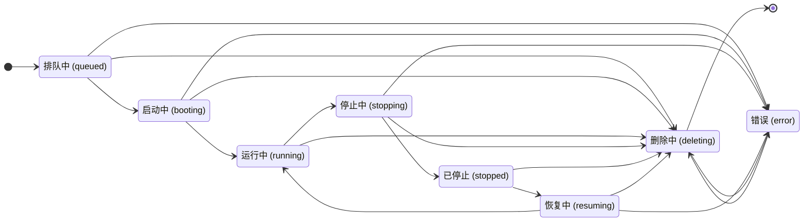

# 状态与生命周期

## 总体模型

Codespace 生命周期采用 Gitea 动作权威与 Manager 运行观测分离的模型。

Gitea 负责：

- 接收用户 create / resume / stop / delete 请求。
- 创建当前 lifecycle operation。
- 通过 `FetchOperation` 下发 operation。
- 根据 Manager 上报结果执行 State Finalization。
- 维护 `codespace.status` 主状态。
- 维护 token、日志、权限和数据库事务一致性。

Manager 负责：

- 通过 `FetchOperation` 拉取 Gitea 下发的 operation。
- 执行本地 Runtime 动作。
- 通过 `UpdateOperation` 上报 progress、lease renew、done、failed。
- 通过 `ReportRuntimeMetadata` 上报 Runtime Metadata。
- 通过 `ReportInstances` 上报本地 Runtime inventory。

Gitea 拥有用户权限、仓库状态、token 生命周期和数据库事务，适合作为动作和主状态权威。Manager 拥有 Runtime 现场事实，适合作为运行观测与执行结果来源。两者分离后，重启、重试和数量差异都通过同一套 reconciliation 收敛。

实现验收点：

- `codespace.status` 由 Gitea State Finalization 写入。
- Manager 上报作为运行观测和 operation 结果输入。
- 用户动作先进入 Gitea operation，再由 Manager pull 执行。
- Runtime 差异由 Gitea 根据数据库状态返回收敛指令。

## 主状态

用户可见状态与存储主状态使用单轴状态图：



状态含义：

| 状态 | 含义 |
| --- | --- |
| `queued` | create operation 已创建，正在等待 Manager 通过 `FetchOperation` 领取。 |
| `booting` | create 已被 Manager 领取，首次环境构建和 `init.sh` 正在执行。 |
| `running` | Runtime Instance 正在运行，可按权限、Manager 在线态和 Runtime Metadata 提供 open/SSH。 |
| `stopping` | stop operation 已创建，正在等待绑定 Manager 停止 Runtime Instance。 |
| `stopped` | Runtime Instance 已停止，可按条件 resume 或 delete。 |
| `resuming` | resume operation 已创建，绑定 Manager 正在恢复 Runtime Instance。 |
| `deleting` | delete operation 已创建，绑定 Manager 正在清理 Runtime Instance，Gitea 等待 finalization 后删除记录。 |
| `error` | 生命周期失败终态，保留日志和状态消息，用户或管理员通过 delete 完成清理。 |

create 和 resume 使用不同状态，是因为首次创建包含 clone、checkout、初始化脚本和内部 SSH 配置，而 resume 复用已有 Runtime 数据。分开表达可以让日志、超时和 UI 状态对用户更准确。`error` 通过 delete 退出，是为了保持失败现场和日志可见，让用户或管理员先看清失败原因，再清理 Runtime 和记录。

实现验收点：

- create 创建后进入 `queued`，claim 成功后进入 `booting`。
- resume 创建后进入 `resuming`。
- stop 创建后进入 `stopping`。
- delete 创建后进入 `deleting`。
- `error` 状态保留日志和状态消息，并可继续创建 delete operation 完成清理。

## Operation

operation 类型：

```text
create
resume
stop
delete
```

operation 状态：

| 状态 | 含义 |
| --- | --- |
| `queued` | operation 已创建，正在等待 Manager 通过 `FetchOperation` 领取。 |
| `running` | operation 已被 Manager claim，lease 有效或处于恢复窗口。 |
| `done` | Manager 上报成功，Gitea 已完成 State Finalization。 |
| `failed` | Manager 上报失败或 Gitea 判定失败，Gitea 已完成 State Finalization。 |

每次 lifecycle operation 使用独立 `operation_id`：

```text
operation_id
operation_type
operation_status
operation_deadline_unix
operation_recovery_deadline_unix
operation_last_recovering_unix
operation_finished_unix
operation_status_message
```

`operation_id` 写入 `FetchOperation` payload，并由 `UpdateOperation`、`UpdateLog`、`RequestGiteaToken` 携带。

Gitea 和 Manager 都可能维护重启，旧上报可能晚到。`operation_id` 把 Manager 上报绑定到当前 Gitea 下发的动作，使 stop、resume、delete、create 的结果都能被精确归属。

实现验收点：

- 每次 create/resume/stop/delete 创建新的 `operation_id`。
- Manager 的 operation-bound RPC 携带 `operation_id`。
- Gitea 按 `codespace_uuid + operation_id + manager_id` 校验上报归属。
- 匹配当前 operation 的 final result 触发 State Finalization。

## 用户动作映射

| 用户动作 | Gitea operation | 主状态变化 |
| --- | --- | --- |
| create | `create` | 创建后 `queued`，claim 后 `booting` |
| resume | `resume` | `stopped -> resuming` |
| stop | `stop` | `running -> stopping` |
| delete | `delete` | 当前可删除状态 -> `deleting` |

create 在 Manager claim 成功时绑定 `manager_id`。resume、stop、delete 使用已有 `manager_id`。

create 需要根据 owner scope、tag 和 Manager 容量选择执行方；已有 Runtime 的后续动作由绑定 Manager 执行，可以保持 Runtime name、workspace、本地资源映射稳定。

实现验收点：

- create 创建时 `manager_id=0`。
- create claim 成功后写入 `manager_id` 并进入 `booting`。
- resume/stop/delete 创建 operation 时沿用当前 `manager_id`。
- 同一 codespace 同一时刻存在一个 active operation。

## FetchOperation

`FetchOperation` 是 Manager 获取 Gitea 下发动作的入口。

Request：

```text
capacity_total
capacity_available
accepted_operation_types
```

Response：

```text
operation_id
operation_type
codespace_uuid
lease_deadline_unix
create/resume payload
```

领取优先级：

```text
delete -> stop -> resume -> create
```

claim 条件：

| operation | 条件 |
| --- | --- |
| delete | 已绑定当前 Manager，主状态为 `deleting` |
| stop | 已绑定当前 Manager，主状态为 `stopping` |
| resume | 已绑定当前 Manager，主状态为 `resuming`，本次声明接受 resume，容量可用 |
| create | 未绑定 Manager，主状态为 `queued`，owner scope 匹配，tag 匹配，本次声明接受 create，容量可用 |

delete 和 stop 是资源回收动作，优先推进可以释放运行侧资源。resume 和 create 会占用容量，由 Manager 当前容量决定领取时机。

实现验收点：

- 单次 `FetchOperation` 返回一个 operation。
- claim 通过数据库条件更新完成原子领取。
- create claim 同事务写入 `manager_id`、`operation_status=running`、`operation_deadline_unix`，并推进到 `booting`。
- stop/delete 在 Manager 满载时仍可领取。
- 并发 claim 只有一个 Manager 成功。

## UpdateOperation 与 State Finalization

`UpdateOperation` 上报当前 operation 的执行事实：

```text
progress
renew lease
final done
final failed
```

Gitea 校验：

```text
codespace_uuid
operation_id
manager_id
operation_status=running
```

Finalization：

| operation | done | failed |
| --- | --- | --- |
| create | `booting -> running` | `error` |
| resume | `resuming -> running` | `error` |
| stop | `stopping -> stopped` | `error` |
| delete | 物理删除 codespace、日志和绑定数据 | `error` |

State Finalization 在同一事务内执行：

1. 读取 codespace。
2. 校验 `operation_id`、`manager_id` 和 `operation_status`。
3. 校验当前状态转移合法。
4. 写入 `operation_status = done|failed` 和 `operation_finished_unix`。
5. 更新 codespace 主状态。
6. 更新 token 状态。
7. 写入 `stopped_unix`、`status_message`、`gitea_token_id` 等主状态字段。
8. 封闭当前 operation 日志。

Manager 负责报告动作结果，Gitea 负责把结果转成主状态、token 生命周期、日志封闭和状态消息。State Finalization 在同一事务内完成这些写入，保证用户看到一致的生命周期结果。

实现验收点：

- progress 更新 stage/message 和 lease。
- final result 触发一次 State Finalization。
- 重复 final 返回幂等结果。
- finalization 同事务处理主状态、operation 状态、token 和日志封闭。

## Runtime Metadata

`ReportRuntimeMetadata` 上报当前 Runtime 快照：

```text
endpoints
internal_ssh
boot stage
resource_usage
last_reported_unix
```

Runtime Metadata 写入 Gitea 本地 cache，用于页面展示、Endpoint existence check、open 和 SSH 判定。

Runtime Metadata 是运行时观测数据，变化频繁且可由 Manager 重建，适合放在 cache。主状态和权限闭环继续由数据库字段维护。

实现验收点：

- Runtime Metadata 成功写入 cache。
- `running` 交互入口同时依据主状态、Manager 在线态和 Runtime Metadata。
- Gitea cache 丢失后由 Manager 重建 Runtime Metadata。
- Runtime Metadata 接受成功可刷新恢复证据时间。

## 超时收敛

Gitea 使用 `operation_deadline_unix` 表达当前 operation 的 lease 截止时间，使用 `operation_recovery_deadline_unix` 表达维护恢复窗口截止时间。

| 场景 | 收敛结果 |
| --- | --- |
| `queued` 等待 create claim 超过 queue timeout | `queued -> error` |
| `booting` 超过 operation deadline | 进入恢复窗口；窗口到期后 `error` |
| `resuming` 超过 operation deadline | 进入恢复窗口；窗口到期后 `error` |
| `stopping` 超过 operation deadline | 进入恢复窗口；窗口内接受 stop done；窗口到期后 `error` |
| `deleting` 超过 operation deadline | 进入 delete 恢复窗口；窗口内接受 delete done；窗口到期后 `error` |
| `running` 且 Manager offline | 主状态保持 `running`，交互入口返回 manager unavailable/recovering 分类 |

operation deadline 表达本次执行租约，recovery deadline 表达维护恢复宽限。分成两个时间点可以让 Gitea 在 Manager 或自身重启后继续接受当前 `operation_id` 的上报，同时让真实长期停滞最终收敛到明确状态。

实现验收点：

- operation 超过 lease 后写入 `operation_recovery_deadline_unix`。
- 恢复窗口内匹配当前 `operation_id` 的 final result 可触发 State Finalization。
- `running` 的 Manager offline 影响交互入口分类，主状态在恢复窗口内保持稳定。
- recovery deadline 到期后由 reconciliation 推进明确结果。

## State Reconciliation

`reconcile_codespace_states` 周期运行。

职责：

- 检查中间态。
- 检查 `operation_deadline_unix` 和 `operation_recovery_deadline_unix`。
- 检查 Manager offline timeout。
- 处理 stale Runtime Metadata 与 ReportInstances 分歧。
- 通过 [State Finalization](glossary.md#state-finalization) 收敛到明确结果。
- 吊销失效 Gitea Token。
- 写入 `status_message`。

恢复证据：

```text
DeclareManager(recovering/online)
ReportInstances(snapshot_complete=true)
ReportInstances 包含 codespace_uuid
UpdateOperation 携带当前 operation_id
ReportRuntimeMetadata 被接受
```

差异分类：

```text
extra_runtime
missing_runtime
manager_mismatch
stale_operation
metadata_missing
snapshot_incomplete
```

维护重启期间，Gitea 给 Manager 时间重新上报完整事实；完整 snapshot 到达后，Gitea 按数据库主状态和当前 operation 收敛差异。这样既能吸收正常维护抖动，也能在真实差异出现时给出明确结果。

实现验收点：

- recovery window 内保留当前主状态。
- 有恢复证据时刷新 `operation_last_recovering_unix`。
- snapshot complete 后计算 expected/reported 差异。
- extra runtime 返回 cleanup。
- missing runtime 按当前主状态收敛。
- recovery deadline 到期后通过 State Finalization 推进明确结果。
