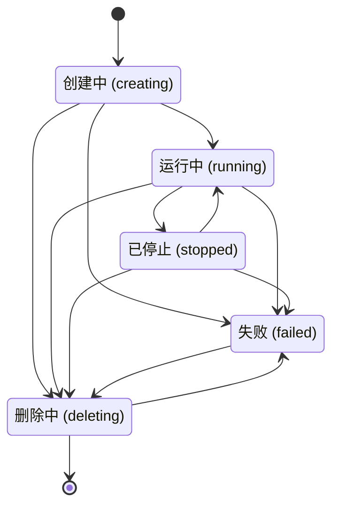
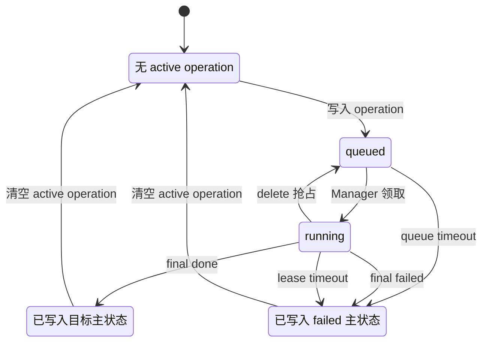
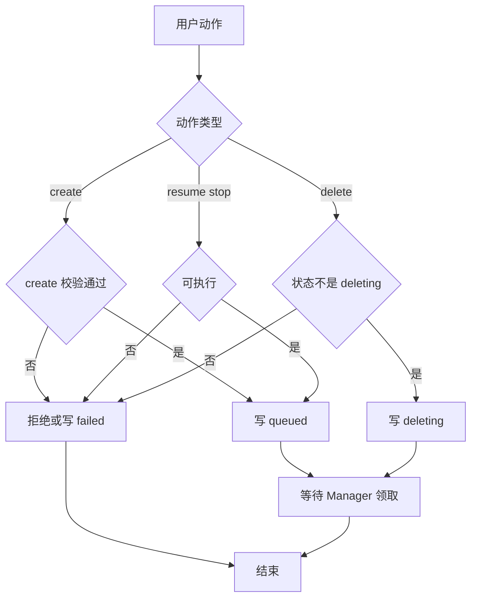
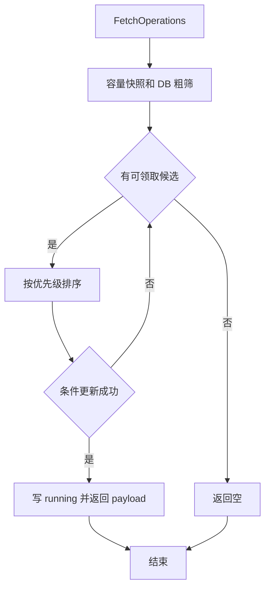
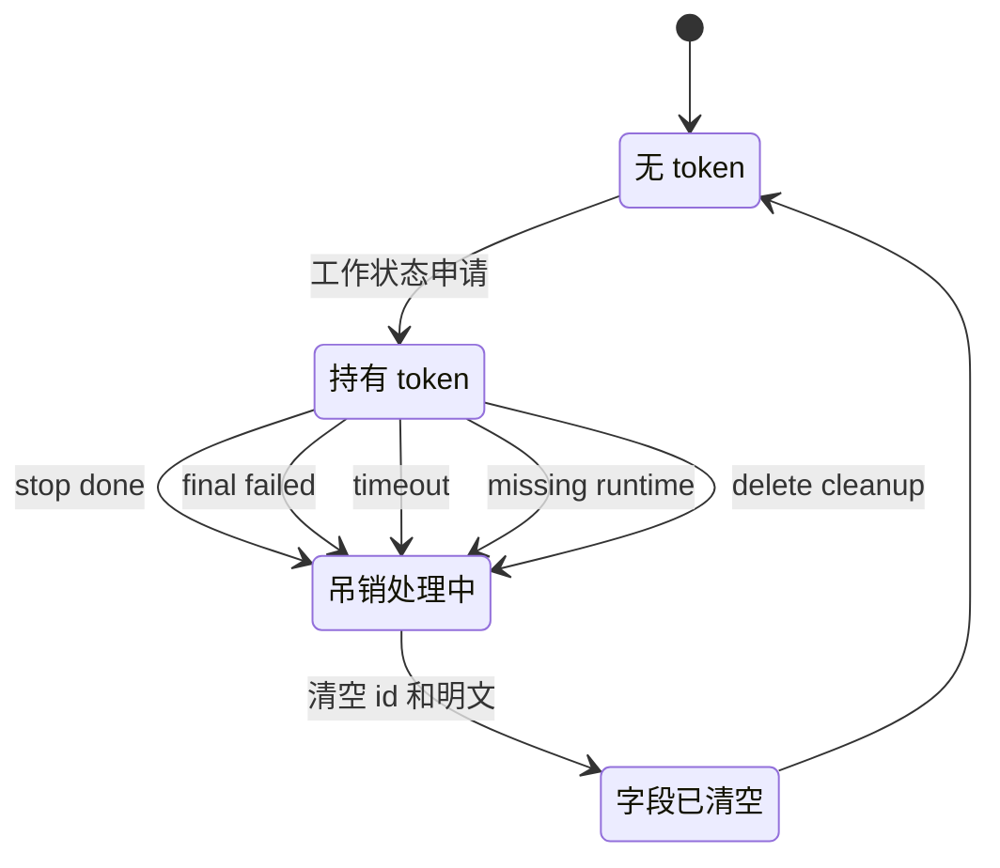
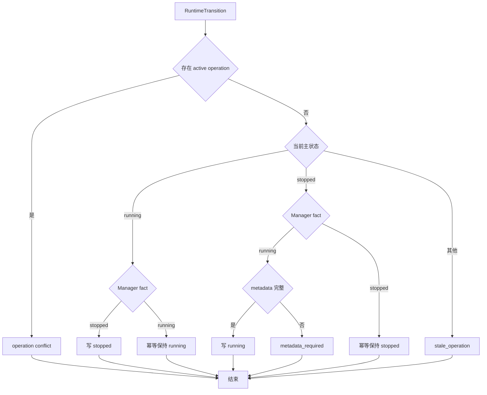

# 状态与生命周期

## 总体模型

Codespace 生命周期由三类数据共同表达：

| 数据 | 权威含义 |
| --- | --- |
| `codespace.status` | Gitea 持久主状态，表达资源生命周期结果。 |
| active operation 字段 | Gitea 当前下发给 Manager 的生命周期指令。 |
| Manager runtime fact | Manager 通过 inventory、metadata 和 transition 上报的本地运行事实。 |

Gitea 下发动作以 active operation 为准；Manager 本地资源存在性以 Manager 上报为事实来源，但只有 Gitea 校验并写入数据库后才改变主状态。Repository 状态只参与 create 来源校验；codespace 创建完成后，状态机不再因 repository 删除、归档、迁移、ref 变化或访问权限变化而改变主状态。`queued`、`booting`、`stopping`、`resuming`、`metadata_rebuilding` 和 `recovering` 都是派生展示态，不写入 `codespace.status`。

Gitea 负责：

- 接收用户 create / resume / stop / delete 请求。
- 写入当前 active operation。
- 通过 `FetchOperations` 批量下发 operation。
- 校验 Manager 上报并执行 State Finalization。
- 根据 Manager runtime fact 处理不同步状态。
- 维护 `codespace.status`、active operation、token、日志和数据库事务一致性。

Manager 负责：

- 通过 `FetchOperations` 拉取 Gitea 下发的 operation。
- 执行本地 Runtime 动作。
- 通过 `UpdateOperation` 上报 progress、lease renew、done、failed。
- 通过 `ReportRuntimeMetadata` 上报 Runtime Metadata。
- 通过 `ReportInstances` 上报本地 Runtime inventory。
- 通过 `ReportRuntimeTransition` 上报本地主动 stop/resume 事实。

## 主状态

持久主状态只保存资源生命周期结果：



| 状态 | 含义 | 主要允许动作 |
| --- | --- | --- |
| `creating` | create 已创建，可能等待 Manager 领取，也可能正在创建 Runtime 和执行初始化。 | delete |
| `running` | Runtime 资源预期存在并运行；无 active stop/delete 时可交互。 | open / SSH / stop / delete |
| `stopped` | Runtime 资源预期存在但不运行，可恢复。 | resume / delete |
| `deleting` | delete 已创建，正在等待 Manager 清理或正在清理。 | 无用户动作 |
| `failed` | 生命周期失败，保留日志和记录。 | delete |

`creating` 覆盖 create 排队和 boot 初始化，因为排队还是执行中由 active operation 表达。`running` 和 `stopped` 是资源结果；stop/resume 正在执行时主状态保持当前资源结果，交互能力由 active operation 禁用。

## Active Operation

operation 类型：

```text
create
resume
stop
delete
```

operation 状态：

| 状态 | 含义 |
| --- | --- |
| `queued` | operation 已创建，正在等待 Manager 通过 `FetchOperations` 领取。 |
| `running` | operation 已被 Manager 领取，lease 有效。 |

active operation 字段只表达当前 Gitea-issued operation：

```text
operation_rversion
operation_type
operation_status
operation_created_unix
operation_started_unix
operation_deadline_unix
```

operation 完成后不保留 `done` 或 `failed` operation 状态。Gitea 写入最终主状态，并清空 active operation 字段；失败诊断从 codespace 日志读取。

active operation 生命周期：



`progress` 和 `renew lease` 不改变 `operation_status`，仍停留在 `Running`。delete 抢占时会递增 `operation_rversion` 并替换 active operation payload；若原 operation 仍是 `Queued`，主状态不变但 payload 已替换；若原 operation 是 `Running`，新 delete operation 回到 `Queued` 等待领取。旧版本上报返回 stale。

`operation_rversion` 是 Gitea 当前下发 operation payload 的版本。递增时机：

```text
创建 create/resume/stop/delete operation
delete 抢占当前 operation
Gitea 替换当前 active operation payload
```

不递增：

```text
FetchOperations 领取
UpdateOperation progress
UpdateOperation renew lease
UpdateOperation final done/failed
ReportRuntimeMetadata
ReportInstances
ReportRuntimeTransition
```

`operation_rversion` 写入 `FetchOperations` 返回数据，并由 `UpdateOperation`、`UpdateLog` 携带。Gitea 按 `codespace_uuid + operation_rversion + manager_id` 校验 operation 上报归属。旧版本上报返回 `stale_operation`，主状态不变。

## 用户动作映射

| 当前主状态 | 用户动作 | 写入结果 |
| --- | --- | --- |
| 无记录 | create | `status=creating, operation_type=create, operation_status=queued, manager_id=0` |
| `running` | stop | `status=running, operation_type=stop, operation_status=queued` |
| `stopped` | resume | `status=stopped, operation_type=resume, operation_status=queued` |
| `creating/running/stopped/failed` | delete | `status=deleting, operation_type=delete, operation_status=queued` |
| `deleting` | 任意用户动作 | 拒绝 |

普通动作要求当前没有 active operation。delete 是终止目标，可以抢占当前 create/resume/stop：Gitea 递增 `operation_rversion`，写入 delete operation，并把主状态改为 `deleting`。旧 Manager 使用旧版本上报时返回 stale，避免旧结果覆盖新的删除目标。

用户动作写入流程：



## FetchOperations

`FetchOperations` 是 Manager 批量获取 Gitea 下发动作的入口。

Request：

```text
capacity_total
capacity_available
accepted_operation_types
max_operations
observed_operations:
  - codespace_uuid
    operation_rversion
```

Response：

```text
operations:
  - operation_rversion
    operation_type
    codespace_uuid
    lease_deadline_unix
    create 数据
```

领取优先级：

```text
delete -> stop -> resume -> create
```

领取条件：

| operation | 条件 |
| --- | --- |
| delete | 已绑定当前 Manager，主状态为 `deleting`，`operation_status=queued` |
| stop | 已绑定当前 Manager，主状态为 `running`，`operation_type=stop`，`operation_status=queued` |
| resume | 已绑定当前 Manager，主状态为 `stopped`，`operation_type=resume`，`operation_status=queued`，本次声明接受 resume，容量可用 |
| create | 未绑定 Manager，主状态为 `creating`，`operation_type=create`，`operation_status=queued`，owner scope 匹配，tag 匹配，本次声明接受 create，容量可用 |

领取成功后同事务写入：

```text
operation_status=running
operation_started_unix=now
operation_deadline_unix=now + lease timeout
```

create 领取时额外写入 `manager_id`。领取不递增 `operation_rversion`。

领取实现采用与 Actions `runs-on` 相同的形态：数据库只按稳定字段粗筛 queued operation，owner scope、tag、`accepted_operation_types` 和 capacity 在 Go 内存中判断，最后用条件 UPDATE 抢占。create 不使用 SQL join 或 JSON contains 匹配 Manager tags。

批量返回规则：

- 总返回数量不超过 `max_operations`。
- create/resume 返回数量不超过 `capacity_available`。
- stop/delete 不占 create/resume 容量。
- create/resume 需要 `accepted_operation_types` 包含对应类型。
- stop/delete 在 Manager 满载时仍可领取。
- Manager 已上报相同 `observed_operations` 版本的 running operation 不重复下发完整 payload。
- Manager 未上报、上报版本不同、或刚领取 queued operation 时返回完整 payload。

`FetchOperations` 领取流程：



## UpdateOperation 与 State Finalization

`UpdateOperation` 上报 Gitea-issued active operation 的执行情况：

```text
progress
renew lease
final done
final failed
```

Gitea 校验：

```text
codespace_uuid
operation_rversion
manager_id
operation_status=running
```

状态写入：

| operation | done | failed |
| --- | --- | --- |
| create | `status=running, keep token, clear active operation` | `status=failed, clear active operation, revoke token` |
| resume | `status=running, clear active operation` | `status=failed, clear active operation, revoke token` |
| stop | `status=stopped, stopped_unix=now, clear active operation, revoke token` | `status=failed, clear active operation, revoke token` |
| delete | 物理删除 codespace、token、日志和绑定数据 | `status=failed, clear active operation, revoke token` |

State Finalization 在同一事务内执行：

1. 读取 codespace。
2. 校验 `operation_rversion`、`manager_id` 和 `operation_status`。
3. 校验当前主状态、operation 类型和目标结果匹配。
4. 更新 codespace 主状态。
5. 按目标主状态处理 token 生命周期绑定。
6. 写入 `stopped_unix` 等状态字段。
7. 清空 active operation 字段。
8. 封闭当前运行中日志追加窗口。

重复 final 同一 `operation_rversion` 时，如果 active operation 已清空且主状态已经匹配目标结果，返回 `idempotent_done`。如果主状态不匹配，返回 `stale_operation`。

stop 失败进入 `failed` 是因为 Gitea 已经无法确认 Runtime 是否仍处于可交互一致状态；继续允许 open/SSH 会扩大不一致风险。delete 失败进入 `failed`，用户或管理员可以再次 delete，新的 delete operation 会递增 `operation_rversion`。

token 随主状态收敛：



`creating -> running` 不吊销 token，重复 `RequestGiteaToken` 直接返回已保存明文，二者都不改变 `HasToken` 状态。

## Manager Runtime Transition

Manager 可以在没有 Gitea-issued active operation 时主动上报本地 stop/resume 事实：

```text
ReportRuntimeTransition:
  codespace_uuid
  runtime_state = running | stopped
  transition_reason
  observed_unix
  metadata_json
```

接受条件：

| 当前 Gitea 状态 | Manager fact | Gitea 行为 |
| --- | --- | --- |
| `running` 且无 active operation | `stopped` | 写 `status=stopped`，写 `stopped_unix=now`，吊销 token |
| `stopped` 且无 active operation | `running` | 写 `status=running`，要求同请求写入 Runtime Metadata |
| `running/stopped` 且有 active operation | 任意 | 返回 `current_operation_conflict`，主状态不变 |
| `creating/deleting/failed` | 任意 | 返回 `stale_operation`，主状态不变 |
| Manager disabled | `stopped` | 允许 |
| Manager disabled | `running` | 返回 `manager_disabled` |

`ReportRuntimeTransition` 不递增 `operation_rversion`，因为它不是 Gitea 下发的指令，而是 Manager 上报的运行事实。

Manager 主动状态上报流程：



## Runtime Metadata

`ReportRuntimeMetadata` 上报当前 Runtime 快照：

```text
endpoints
internal_ssh
boot
last_reported_unix
```

Runtime Metadata 写入 Gitea 本地 cache，用于页面展示、Endpoint existence check、open 和 SSH 判定。主状态和权限判断仍以数据库字段为准。

写入条件：

- caller Manager 与 `codespace.manager_id` 匹配。
- `status in (creating, running, stopped)`。
- `status=stopped` 时 metadata 只用于展示保留资源信息，不提供 open/SSH。
- `status=deleting/failed` 返回 stale。

Runtime Metadata 是运行时信息，变化频繁，也可以由 Manager 重建，因此放在 cache 中。cache miss 只影响展示和交互入口，不改变主状态。

## 派生展示态

页面和 API 可以从持久主状态、active operation 和 Manager 运行态派生展示状态：

| 条件 | 展示态 |
| --- | --- |
| `status=creating && operation_status=queued` | `queued` |
| `status=creating && operation_status=running` | `booting` |
| `status=running && operation_type=stop && operation_status in (queued,running)` | `stopping` |
| `status=stopped && operation_type=resume && operation_status in (queued,running)` | `resuming` |
| `status=deleting` | `deleting` |
| `status=running && Manager offline/recovering` | `running_unavailable` / `recovering` |
| Runtime Metadata cache miss 且 Manager online/recovering | `metadata_rebuilding` |

这些状态用于 UI 和失败分类，不写入 `codespace.status`。

## 不同步收敛

| 不同步场景 | Gitea 行为 |
| --- | --- |
| Manager 上报旧 `operation_rversion` | 返回 `stale_operation`，主状态不变 |
| Manager 有 Runtime，Gitea 无 codespace | 返回 `cleanup_local_runtime` |
| Manager 有 Runtime，但 `codespace.manager_id != caller` | 返回 `manager_mismatch` 和 `cleanup_local_runtime` |
| Gitea 期望 Runtime 存在，完整 inventory 缺失 Runtime | `creating/running/stopped` 进入 `failed` |
| Gitea `deleting`，完整 inventory 缺失 Runtime | 视为 delete 完成，物理删除 |
| queued operation 超时未领取 | 当前 operation failed，写 `status=failed` 并清空 active operation |
| running operation lease 超时且 Manager online | 当前 operation failed，写 `status=failed` 并清空 active operation |
| running operation lease 超时但 Manager recovering/offline grace 内 | 暂缓失败，等待完整 inventory 或 Manager online |
| Manager 主动报 stopped，但 Gitea 有 active operation | 返回 `current_operation_conflict`，以 active operation 为准 |
| Manager 主动报 running，但缺失 Runtime Metadata | 拒绝 transition，返回 `metadata_required` |
| Runtime Metadata 丢失 | 主状态不变，open/SSH 返回 `metadata_rebuilding` |
| `creating/running` token 缺失 | 允许 Manager 通过 `RequestGiteaToken` 获取新 token |
| `stopped/failed/deleting` token 仍存在 | reconciliation 调用生命周期入口吊销 token |

## 超时处理

`operation_created_unix + QUEUE_TIMEOUT` 表达 queued operation 等待 Manager 领取的最长时间。`operation_deadline_unix` 表达 running operation 的 lease 截止时间。Manager 通过 `UpdateOperation` progress 或 renew lease 刷新 `operation_deadline_unix`。

queued operation 超时和 running operation 超时都按当前 operation failed 处理：写入 `status=failed`，吊销 token，并清空 active operation。delete 的 running operation 超时也进入 `failed`，用户或管理员可以再次 delete。

active operation lease 到期时按 Manager 状态判断：

| Manager 状态 | 处理 |
| --- | --- |
| online | 按当前 operation failed 处理。 |
| recovering | 暂缓失败，等待 Manager 完整 inventory 或 online。 |
| offline 且未超过 `MANAGER_RESTART_GRACE` | 暂缓失败。 |
| offline 超过 `MANAGER_RESTART_GRACE` | 按当前 operation failed 处理。 |

维护恢复是 Manager 级事件，因此不在每条 codespace 上保存 recovery deadline。完整 `ReportInstances(snapshot_complete=true)` 到达后，Gitea 优先使用 inventory 事实处理差异，不继续等待 timeout。

## State Reconciliation

`reconcile_codespace_states` 周期运行。

职责：

- 检查 queued operation timeout。
- 检查 running operation lease。
- 检查 Manager online/offline/recovering。
- 处理 `ReportInstances` 中的 extra/missing/mismatch。
- 处理 Runtime Metadata cache miss 对交互入口的影响。
- 检查并收敛 token 生命周期绑定。
- 通过 State Finalization 写入明确结果。

恢复证据：

```text
DeclareManager(recovering/online)
ReportInstances(snapshot_complete=true)
ReportInstances 包含 codespace_uuid
UpdateOperation 携带当前 operation_rversion
ReportRuntimeMetadata 被接受
ReportRuntimeTransition 被接受
```

差异分类：

```text
extra_runtime
missing_runtime
manager_mismatch
stale_operation
current_operation_conflict
metadata_missing
metadata_required
snapshot_incomplete
```

维护重启期间，Gitea 给 Manager 时间重新上报完整运行信息；完整 snapshot 到达后，Gitea 按数据库主状态、当前 active operation 和 Runtime inventory 处理差异。
